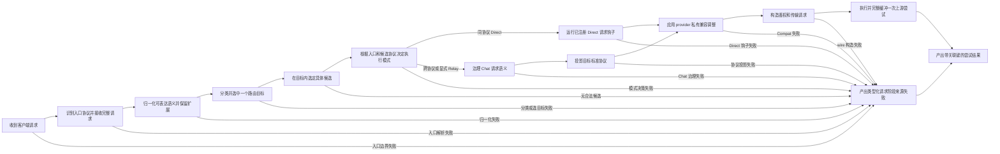
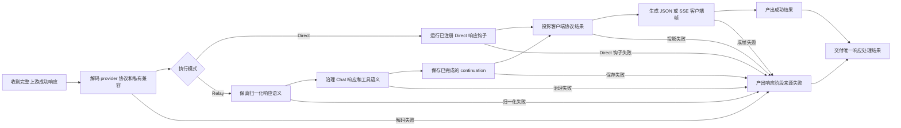
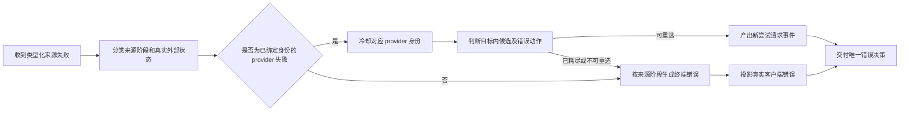
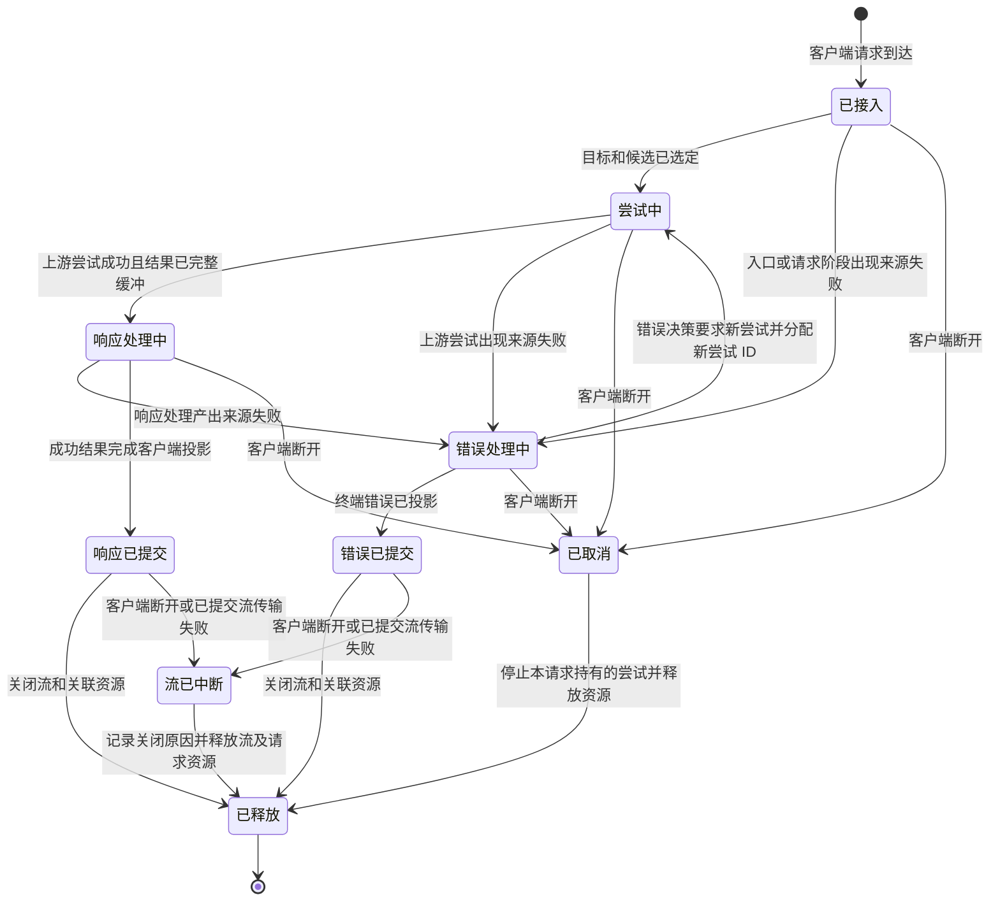

# V3 代理流水线：DAGPipe 目标图与首轮 gap 审计

状态：设计候选，尚未成为可编译或运行的 DAGPipe 图。审计基线：`origin/main` `39242705b41c6da0a87db7184cce4414e8628be0`；本轮只读现有 V3 map、入口和 Rust 源码，不修改已锁定骨架。

## 目标与边界

RouteCodex 的业务目标是透明代理：在不同客户端和上游协议之间最大限度保持请求、响应、历史、工具与流语义的连通性。代理新增的语义校验不得拦截本可兼容传递的请求或响应。信任边界、目标协议确实无法表达的字段和真实上游错误必须显式处理。控制资源、路由决策、provider 健康与业务 payload 分开。

本设计覆盖一个客户端请求触发的请求准备与上游尝试、成功响应、来源错误及取消后的资源终结。配置编译、启动探针、调试采样、部署和管理 API 是依赖或旁观者，不纳入业务 payload 图。图中的节点是业务责任，不是 Rust 函数调用；下表另列现有实现线索。

### 角色、对象与触发

| 角色 | 责任与权限 |
| --- | --- |
| 客户端 | 发起带协议、目标模型、历史和流意图的请求；可断开连接；接收成功结果或显式错误。 |
| Server | 接入、边界限制、连接状态与最终 HTTP/SSE 发送；不改业务语义。 |
| Runtime | 持有单次请求及 provider 尝试生命周期、选择 Direct/Relay、缓冲尝试结果；不把错误伪装成成功。 |
| Router / Target | 分类、选中一个不透明目标、展开和重选该目标内候选；不改 payload。 |
| Chat Process / Direct hook | 分别在 Relay / Direct 模式拥有声明的 payload 改写；互不代写。 |
| Provider / Error | Provider 负责 wire、鉴权、传输和健康；Error 负责来源分类、动作、耗尽和客户端错误投影。 |

一个图执行的关联键是请求 ID 与尝试 ID。客户端请求、上游成功响应、来源失败是三个独立对象源；分别建图，不能把三者伪装成一个多入口 DAG。以下是**业务目标图**，尚非 DAGPipe `CompiledGraph`。

## 请求图：客户端请求 → 一次上游尝试结果

入口 ARC 是客户端请求及独立的类型化控制引用；唯一出口 ARC 是本次处理结果，标记上游成功响应、上游来源失败或入口/请求阶段来源失败。每个节点失败在业务目标上汇入同一类型化出口，再由生命周期送入错误图；Operator 不可自行终止而丢失 Error01/598 路径。DAGPipe 落地时须用类型化结果 ARC 或明确的 Runtime 转换承接失败，不能假设 Operator 抛错后下游失败节点仍会执行。模式选择是显式分支。Provider 失败后的重选由图外的请求生命周期发起**新尝试**，不在静态 DAG 中画回边。未出现合法候选时产出类型化来源失败，不静默换模型。

## 响应图：一次上游成功响应 → 响应处理结果

入口 ARC 是上游成功响应，加同一请求的类型化模式/协议引用；唯一出口 ARC 是带成功客户端结果或类型化响应阶段来源失败的**响应处理结果**。失败由生命周期送入错误图，不在响应图内伪装成成功。Provider 尝试在提交客户端响应前完整缓冲。SSE 是客户端传输边界，按已确定的客户端语义成帧，不从 SSE 字节重建路由、错误或 continuation 控制状态。Direct 不进入 Relay Chat Process；Relay 的 continuation 保存只接受已完成响应。

## 错误图：一次来源失败 → 后续动作或显式客户端错误

入口 ARC 是类型化来源失败；provider/模型/鉴权身份仅在来源确属该 provider 尝试时存在。唯一出口 ARC 是类型化错误决策。`新尝试请求事件` 由生命周期 owner 消费并创建新的尝试 ID，不是指向请求图内部节点的回边。只有当前错误策略确实允许重选才发起新尝试；Server、请求阶段、响应阶段等非 provider 失败按来源终结，保留真实外部状态及项目规定的 598/599/502 投影。调试日志、snapshot 和样本只旁路记录证据，不承载决策真相。

## 请求生命周期状态

状态机由 Runtime/Server 边界拥有，DAGPipe 静态图不承担循环调度。请求取消是独立终点；必须有可核对的连接/尝试/流释放证据。响应成功、错误、取消和提交后流中断最终均汇入资源释放终点，但业务出口保持各自语义。客户端响应提交后只能记录流关闭及其来源，不能再次投影 HTTP 状态或第二份终端错误。目标契约要求 provider 尝试提交前完整缓冲；若现有 SSE 路径仍观测到上游提交后失败，应作为 G6 的实现/契约差异核对，不能暗中把它当成新业务成功或重选机会。

## 首轮图审计

| 检查 | 目标图结论 | 需要的落地证据 |
| --- | --- | --- |
| 单源单汇 | 三个对象源分别有唯一入口 ARC 和唯一出口 ARC；Direct/Relay 在各自图内汇合。 | 每个 DAGPipe JSON 经 `dagpipe graph validate`，且无无主入口、悬空节点或多出口。 |
| 分支与重试 | Router/Target 选目标与候选，Runtime 独立决定模式；失败只输出新尝试事件，重试跨执行。 | 两种 owner 的绑定、尝试 ID 的状态机/ARC 绑定与成功、失败测试。 |
| 透明代理 | 保留可表达语义和扩展；Direct/Relay 改写权限分开；无多余语义拒绝。 | 协议字段正反例、上游 wire 与客户端结果的同入口对照。 |
| 终点 | 成功、任一来源的终端错误、取消均到资源释放；响应处理失败进入错误图，上游失败不被伪装成 200。 | 真实入口和连接断开回放、错误链与资源关闭收据。 |
| 图与代码 | 业务图未由当前 Rust runtime 执行；下列绑定只表示现有实现线索。 | 后续 Operator 注册、SDK compile、实际入口 journal/ARC 与相同语义结果。 |

## 现有实现线索与 gap

| ID | 目标节点/边 | 当前可见证据 | Gap / 下一步 |
| --- | --- | --- | --- |
| G1 | 业务语义图成为项目真源 | `docs/architecture/v3-{resource-operation,function,mainline-call,verification}-map.yml` 是资源、owner、调用和 gate 地图；当前 V3 范围未见 DAGPipe 图文件。 | 把上述三个对象源细分为项目拥有的 DAGPipe JSON；确定 Direct/Relay 的静态条件分支及类型化失败 ARC/Runtime 转换，独立审查后验证。现有调用图不能充当业务图。 |
| G2 | 节点绑定为可执行 Operator | `v3/Cargo.toml` 和 V3 crates 未见 DAGPipe SDK、`CompiledGraph` 或 Operator 注册引用。 | 按现有唯一 owner 建立节点→Operator 名称/版本→ARC schema→作用权限映射，再做 SDK compile；本轮不推断已有运行接线。 |
| G3 | 请求入口到模式分支 | `v3/crates/routecodex-v3-server/src/lib.rs` 声明 HTTP 入口；`endpoint_handlers.rs`、`executors.rs` 接到 Runtime；`v3-mainline-call-map.yml` 有 `v3.responses_direct.required_mainline`。 | 用真实请求 ID 核对 Direct/Relay 决策和候选引用；不能把 map 的 `anchored` 或测试锚点当成所有协议的运行证明。 |
| G4 | Relay 与 Direct 的响应分支 | `v3.hub_pipeline.v1.request/response` 与 `v3.hub_relay.*` map 分别列静态骨架及 Relay source slice；`hub_v1.rs` 导出相邻 builder 与 Direct/Relay 路径。 | 各选一个真实成功样本，对比 provider raw、Chat/Direct 作用点、continuation、客户端 JSON/SSE；再决定 Operator 边界。 |
| G5 | 错误、重选与终端 | `v3.debug_error_foundation.mainline` map 列 Error01–06；`v3.hub_relay.response_failure_entry` 声明响应治理失败接 Error01；Runtime `kernel.rs` 持有尝试计数和传输尝试。 | 分别用 Server/请求、provider、响应阶段失败样本核对状态；仅对已绑定 provider 身份的类型化失败更新健康，验证目标内重选、598/599/502/外部状态和最终响应。为新尝试 ID、响应失败接线及释放终点补类型化证据。 |
| G6 | 取消、提交后流中断与资源释放 | 当前 map 主要记录请求/响应/错误调用边，也有提交后 SSE 观测与 EOF/error/drop 的局部合同；本轮未绑定 DAGPipe 状态机与每终点资源收据。 | 明确连接断开、上游尝试取消、SSE 关闭的 owner、事件与验收；核对提交前完整缓冲与现有提交后观测的关系，补同入口取消/流中断回放。 |

**审计结论：设计候选可作 DAGPipe 建模基线，不能声称 DAGPipe 图已校验、Operator 已接线或真实入口已通过。** 首个实施依赖是 G1：锁定图的 ARC/分支合同并通过独立设计 review；再按依赖处理 G2，随后用 G3–G6 的真实入口证据证明或修正实现 gap。修改项目锁定骨架节点、边、owner 或资源流之前，先遵守 `docs/architecture/wiki/v3-mainline-skeleton-sop.md` 的授权边界。
