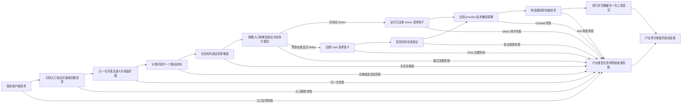
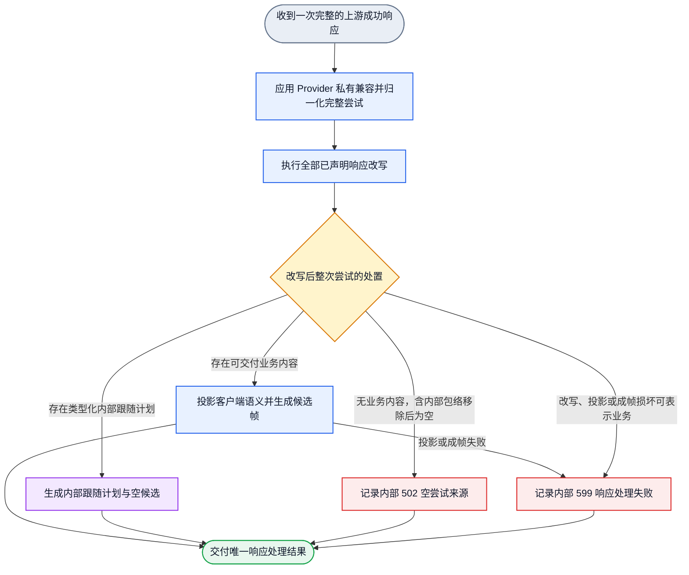
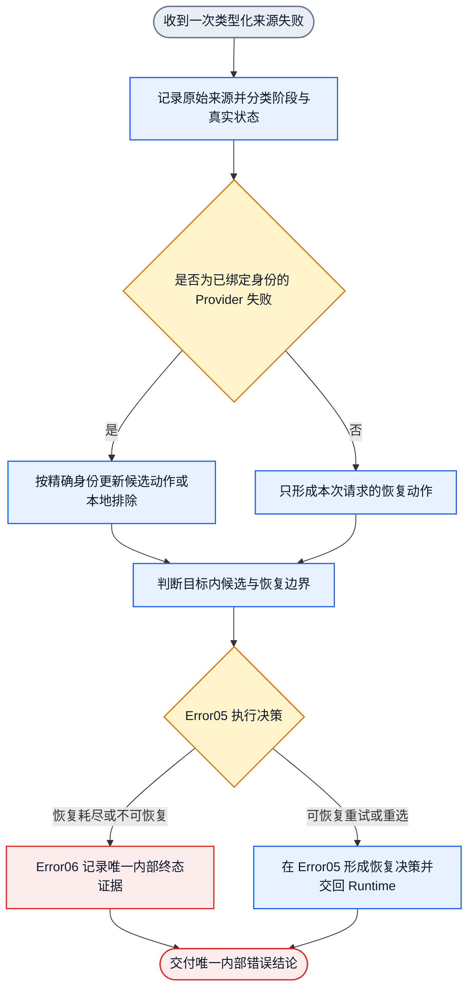
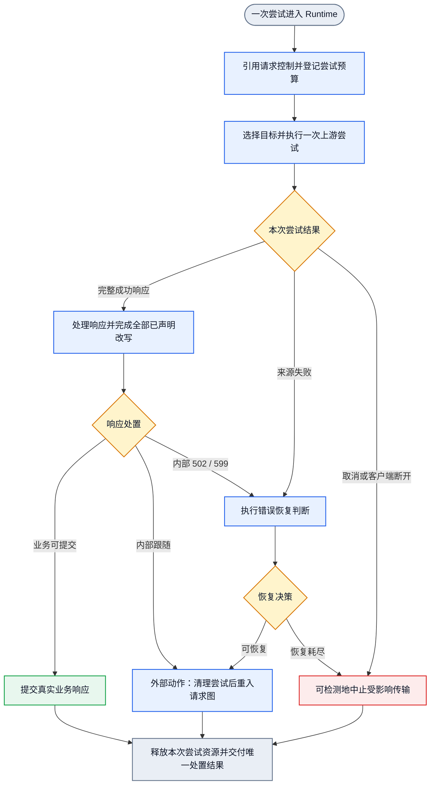

# V3 代理流水线：DAGPipe 目标图与首轮 gap 审计

状态：设计候选，尚未成为可编译或运行的 DAGPipe 图。审计基线：`origin/main` `39242705b41c6da0a87db7184cce4414e8628be0`；本轮只读现有 V3 map、入口和 Rust 源码，不修改已锁定骨架。

## 目标与边界

RouteCodex 的业务目标是透明代理：在不同客户端和上游协议之间最大限度保持请求、响应、历史、工具与流语义的连通性。代理新增的语义校验不得拦截本可兼容传递的请求或响应。信任边界、目标协议确实无法表达的字段和真实上游错误必须显式处理。控制资源、路由决策、provider 健康与业务 payload 分开。

控制来源只由真实 typed owner 及其生产写入边界证明。普通业务 JSON 的字段拼写不能证明控制泄漏；schema、工具参数、结果、历史和 opaque 扩展中的同名字段须完整保留，也不得成为运行时控制真源。`normalize_request_losslessly` 和 Provider/客户端投影都不增加递归名称准入（03df769）。

本设计覆盖一个客户端请求触发的请求准备与上游尝试、成功响应、来源错误及取消后的资源终结。配置编译、启动探针、调试采样、部署和管理 API 是依赖或旁观者，不纳入业务 payload 图。图中的节点是业务责任，不是 Rust 函数调用；下表另列现有实现线索。

`provider_interface` 是 provider 配置到 target 候选接线的辅助对象流，登记在 `docs/architecture/dagpipe/graphs/provider-multi-interface-wiring.graph.json`。它不是第四个业务对象源，也不改变本文件“请求、响应、错误三源”的模型；它复用现有 V3Config02–V3Config05、V3Target08–V3Target10 owner，并由 `modules.json` 单独登记。

### 角色、对象与触发

| 角色 | 责任与权限 |
| --- | --- |
| 客户端 | 发起带协议、目标模型、历史和流意图的请求；可断开连接；接收成功结果或显式错误。 |
| Server | 接入、边界限制、连接状态与最终 HTTP/SSE 发送；不改业务语义。 |
| Runtime | 持有单次请求及 provider 尝试生命周期、选择 Direct/Relay、缓冲尝试结果；不把错误伪装成成功。 |
| Router / Target | 分类、选中一个不透明目标、展开和重选该目标内候选；不改 payload。 |
| Chat Process / Direct hook | 分别在 Relay / Direct 模式拥有声明的 payload 改写；互不代写。 |
| Provider / Error | Provider 负责 wire、鉴权、传输和健康；Error 负责内部来源分类、恢复动作与耗尽决策，禁止客户端错误投影；所有模型入口遵守 AGENTS.md 的无错误响应硬约束。 |

一个图执行的关联键是请求 ID 与尝试 ID。客户端请求、上游成功响应、来源失败是三个独立对象源；分别建图，不能把三者伪装成一个多入口 DAG。以下是**业务目标图**，尚非 DAGPipe `CompiledGraph`。

## 请求图：客户端请求 → 一次上游尝试结果

```mermaid
flowchart LR
  A[收到客户端请求] --> B[识别入口协议并接收完整请求]
  B --> C[归一化可表达语义并保留扩展]
  C --> D[分类并选中一个路由目标]
  D --> E[在目标内选定具体候选]
  E --> M[根据入口和候选协议决定执行模式]
  M -->|同协议 Direct| F[运行已注册 Direct 请求钩子]
  M -->|跨协议或显式 Relay| G[治理 Chat 请求语义]
  G --> H[投影目标标准协议]
  F --> I[应用 provider 私有兼容调整]
  H --> I
  I --> J[构造鉴权和传输请求]
  J --> K[执行并完整缓冲一次上游尝试]
  K --> L[产出带关联键的尝试结果]
  A -->|入口边界失败| N[产出类型化请求阶段来源失败]
  B -->|入口解析失败| N
  C -->|归一化失败| N
  D -->|分类或选目标失败| N
  E -->|无合法候选| N
  M -->|模式决策失败| N
  F -->|Direct 钩子失败| N
  G -->|Chat 治理失败| N
  H -->|协议投影失败| N
  I -->|Compat 失败| N
  J -->|wire 构造失败| N
  N --> L
```

入口 ARC 是客户端请求及独立的类型化控制引用；唯一出口 ARC 是本次处理结果，标记上游成功响应、上游来源失败或入口/请求阶段来源失败。每个节点失败在业务目标上汇入同一类型化出口，再由生命周期送入错误图；Operator 不可自行终止而丢失 Error01/598 路径。DAGPipe 落地时须用类型化结果 ARC 或明确的 Runtime 转换承接失败，不能假设 Operator 抛错后下游失败节点仍会执行。模式选择是显式分支。Provider 失败后的重选由图外的请求生命周期发起**新尝试**，不在静态 DAG 中画回边。未出现合法候选时产出类型化来源失败，不静默换模型。

## 响应图：一次上游成功响应 → 唯一响应处理结果

```mermaid
flowchart TD
  A([收到一次完整的上游成功响应]):::boundary --> B[应用 Provider 私有兼容并归一化完整尝试]:::action
  B --> C[执行全部已声明响应改写]:::action
  C --> D{改写后整次尝试的处置}:::decision
  D -->|存在可交付业务内容| E[投影客户端语义并生成候选帧]:::action
  E -->|投影或成帧失败| H
  D -->|存在类型化内部跟随计划| F[生成内部跟随计划与空候选]:::data
  D -->|无业务内容，含内部包络移除后为空| G[记录内部 502 空尝试来源]:::failure
  D -->|改写、投影或成帧损坏可表示业务| H[记录内部 599 响应处理失败]:::failure
  E --> I([交付唯一响应处理结果]):::success
  F --> I
  G --> I
  H --> I

  classDef boundary fill:#E9EEF5,stroke:#64748B,color:#0F172A,stroke-width:1.5px
  classDef action fill:#E8F1FF,stroke:#2563EB,color:#0F172A,stroke-width:1.5px
  classDef decision fill:#FFF4CC,stroke:#D97706,color:#0F172A,stroke-width:1.5px
  classDef data fill:#F3E8FF,stroke:#9333EA,color:#0F172A,stroke-width:1.5px
  classDef success fill:#E8F7EE,stroke:#16A34A,color:#0F172A,stroke-width:1.5px
  classDef failure fill:#FDECEC,stroke:#DC2626,color:#0F172A,stroke-width:1.5px
```

入口 ARC 是上游成功响应及同一请求的类型化模式/协议引用；唯一出口 ARC 是**响应处理结果**。业务可交付、内部跟随、内部 502 空尝试和内部 599 响应处理失败都只在出口汇合，不增加第二个对象源或第二个响应出口。失败结果由生命周期送入独立错误图，不在响应图内伪装成成功。Direct 和 Relay 的既有模式/协议引用选择同一响应源内的已声明改写 owner，不改变对象源或出口。

整次尝试的判空发生在全部已声明响应改写完成之后，不依赖 usage、输出 token 或最后一帧。普通文本、仅工具调用、reasoning、refusal 和 `content_filter` 都是可交付业务结果。仅移除 `memory_raw_capture` 等非客户端内部控制包络后为空，映射为 `ProviderFailure` / `provider_response_empty` / 内部 502。真实可表示业务内容在改写、投影或成帧中丢失、损坏或报错，映射为响应处理阶段 `RuntimeFailure` / 内部 599，不归因给上游。

Provider 尝试在提交客户端响应前完整缓冲。SSE 是客户端传输边界，按确定的客户端语义成帧，不从 SSE 字节重建路由、错误或 continuation 控制状态。Direct 不进入 Relay Chat Process；Relay 的 continuation 保存只接受已完成响应。

| 业务责任 | 现有图节点或类型化资源参照 |
| --- | --- |
| Provider 私有响应调整 | `adjust_provider_private_response` |
| 完整尝试归一化 | `normalize_provider_response`，写入 `v3.operation_runner.response_provenance` |
| Direct / Relay 已声明响应改写 | Direct 注册钩子；Relay `govern_chat_response` |
| 可交付结果与内部跟随决策 | `govern_chat_response`，写入 `v3.operation_runner.execution_disposition` 与 `v3.operation_runner.servertool_sidecar_plan` |
| 内部 502 / 内部 599 | `v3.error.source` 进入 `error_err01_source_raised` |
| 逆向投影与客户端候选帧 | `inverse_project_client_response`、`frame_committed_client_response`、`v3.operation_runner.client_frame_candidate` |

## 错误图：一次来源失败 → 唯一内部错误决策

```mermaid
flowchart TD
  A([收到一次类型化来源失败]):::boundary --> B[记录原始来源并分类阶段与真实状态]:::action
  B --> C{是否为已绑定身份的 Provider 失败}:::decision
  C -->|是| D[按精确身份更新候选动作或本地排除]:::action
  C -->|否| E[只形成本次请求的恢复动作]:::action
  D --> F[判断目标内候选与恢复边界]:::action
  E --> F
  F --> G{Error05 执行决策}:::decision
  G -->|可恢复重试或重选| H[在 Error05 形成恢复决策并交回 Runtime]:::action
  G -->|恢复耗尽或不可恢复| I[Error06 记录唯一内部终态证据]:::failure
  I --> J([交付唯一内部错误结论]):::failure
  H --> J

  classDef boundary fill:#E9EEF5,stroke:#64748B,color:#0F172A,stroke-width:1.5px
  classDef action fill:#E8F1FF,stroke:#2563EB,color:#0F172A,stroke-width:1.5px
  classDef decision fill:#FFF4CC,stroke:#D97706,color:#0F172A,stroke-width:1.5px
  classDef success fill:#E8F7EE,stroke:#16A34A,color:#0F172A,stroke-width:1.5px
  classDef failure fill:#FDECEC,stroke:#DC2626,color:#0F172A,stroke-width:1.5px
```

入口 ARC 是类型化来源失败；provider/模型/鉴权身份仅在来源确属该 provider 尝试时存在。唯一出口 ARC 是内部类型化错误决策，不存在到客户端业务响应的边。`新尝试请求事件` 由生命周期 owner 消费并创建新的尝试 ID，不是指向请求图内部节点的回边。仅在当前策略允许时发起新尝试。Provider 状态、SSE 解码错误及 Server/请求/响应阶段错误均只供内部分类和管理，禁止 HTTP 错误状态、错误体或协议错误事件；池空/耗尽也只能无响应或未完成传输。请求局部兼容失败只排除本次候选，不冷却 provider。调试日志、snapshot 和样本只记录证据，不承载决策真相。

错误图的六个规范阶段依次是 `error_err01_source_raised`、`error_err02_classified`、`error_err03_target_local_action`、`error_err04_target_exhaustion`、`error_err05_execution_decision`、`error_err06_client_projected`。前五个节点在可恢复路径上形成 `Err01 -> Err02 -> Err03 -> Err04 -> Err05`；`Err05` 是唯一执行决策点，可恢复结果从 `error-execution-decision` 退出。`Err06` 只接收终端决策，不参与重试，也不产生客户端错误候选。静态图保留六节点终端结构路径，但 Runtime 必须让可恢复决策停在 Err05，释放失败尝试后在图外启动新尝试；只有 `terminal_client_error` 才执行 Err06 并记录内部终态证据。

本节的节点使用业务语义标签；函数名和文件只作为现有 owner 的映射参照。静态图不能证明全图 SDK 已接线或真实运行。

## 请求生命周期状态

```mermaid
flowchart TD
  S([一次尝试进入 Runtime]):::boundary --> A[引用请求控制并登记尝试预算]:::action
  A --> B[选择目标并执行一次上游尝试]:::action
  B --> C{本次尝试结果}:::decision
  C -->|完整成功响应| D[处理响应并完成全部已声明改写]:::action
  C -->|来源失败| E[执行错误恢复判断]:::action
  C -->|取消或客户端断开| T
  D --> F{响应处置}:::decision
  E --> G{恢复决策}:::decision
  F -->|业务可提交| H[提交真实业务响应]:::success
  F -->|内部跟随| X[外部动作：清理尝试后重入请求图]:::action
  F -->|内部 502 / 599| E
  G -->|可恢复| X
  G -->|恢复耗尽| T[可检测地中止受影响传输]:::failure
  H --> Z[释放本次尝试资源并交付唯一处置结果]:::boundary
  T --> Z
  X --> Z

  classDef boundary fill:#E9EEF5,stroke:#64748B,color:#0F172A,stroke-width:1.5px
  classDef action fill:#E8F1FF,stroke:#2563EB,color:#0F172A,stroke-width:1.5px
  classDef decision fill:#FFF4CC,stroke:#D97706,color:#0F172A,stroke-width:1.5px
  classDef success fill:#E8F7EE,stroke:#16A34A,color:#0F172A,stroke-width:1.5px
  classDef failure fill:#FDECEC,stroke:#DC2626,color:#0F172A,stroke-width:1.5px
```

生命周期由 Runtime/Server 边界拥有，此图以一次尝试为边界。DAGPipe 静态图不承担循环调度或请求重试。`外部动作：清理尝试后重入请求图` 只表示 Runtime 在当前图外创建新尝试或内部跟随调用，不是指向请求图节点的回边。重试和内部跟随仅释放尝试资源，保留请求资源。取消和客户端断开由 Runtime/Server 在声明边界处理，并与成功、终态失败和外部重入一起到达唯一尝试资源释放与处置出口。请求终结器只在成功提交、终态失败、取消或断开后释放请求资源。必须有可核对的连接、尝试和流释放证据。客户端响应提交后只能记录流关闭及其来源，不能再次投影 HTTP 状态或第二份终端错误。目标契约要求 provider 尝试提交前完整缓冲；若现有 SSE 路径仍观测到上游提交后失败，应作为 G6 的实现/契约差异核对，不能暗中把它当成新业务成功或重选机会。

## 首轮图审计

| 检查 | 目标图结论 | 需要的落地证据 |
| --- | --- | --- |
| 单源单汇 | 三个对象源分别有唯一入口 ARC 和唯一出口 ARC；Direct/Relay 在各自图内汇合。 | 每个 DAGPipe JSON 经 `dagpipe graph validate`，且无无主入口、悬空节点或多出口。 |
| 分支与重试 | Router/Target 选目标与候选，Runtime 独立决定模式；失败只输出新尝试事件，重试跨执行。 | 两种 owner 的绑定、尝试 ID 的状态机/ARC 绑定与成功、失败测试。 |
| 透明代理 | 保留可表达语义和扩展；Direct/Relay 改写权限分开；无多余语义拒绝。 | 协议字段正反例、上游 wire 与客户端结果的同入口对照。 |
| 终点 | 成功、任一来源的终端错误、取消均到资源释放；响应处理失败进入错误图，上游失败不被伪装成 200。 | 真实入口和连接断开回放、错误链与资源关闭收据。 |
| 图与代码 | 三张业务目标图和 `provider_interface` 辅助图已登记；当前 Rust runtime 只编译并运行请求图的 `capture_client_json` Node01 切片。 | 后续节点逐一完成 Operator 注册、SDK compile、实际入口 journal/ARC 与相同语义结果；辅助图不冒充业务图运行证明。 |

## 现有实现线索与 gap

| ID | 目标节点/边 | 当前可见证据 | Gap / 下一步 |
| --- | --- | --- | --- |
| G1 | 业务语义图成为项目真源 | 请求、响应、错误三张 `v3.operation_runner.*.graph.json` 已登记；`v3-operation-runner-dagpipe` 验证图合同，`modules.json` 验证静态登记。 | 后续逐节点核对目标业务图、ARC/分支合同与现有图；静态图不能证明整条运行接线。 |
| G2 | 节点绑定为可执行 Operator | `operation_runner` 已从请求图派生并编译 `capture_client_json` Node01 切片，HTTP 与 Responses WebSocket 入口使用同一编译结果；其余节点尚未运行。 | 沿唯一 owner 逐一落实余下节点的 Operator 名称/版本、ARC schema、作用权限和 SDK compile；每步核对真实入口。 |
| G3 | 请求入口到模式分支 | `v3/crates/routecodex-v3-server/src/lib.rs` 声明 HTTP 入口；`endpoint_handlers.rs`、`executors.rs` 接到 Runtime；`v3-mainline-call-map.yml` 有 `v3.responses_direct.required_mainline`。 | 用真实请求 ID 核对 Direct/Relay 决策和候选引用；不能把 map 的 `anchored` 或测试锚点当成所有协议的运行证明。 |
| G4 | Relay 与 Direct 的响应分支 | `v3.hub_pipeline.v1.request/response` 与 `v3.hub_relay.*` map 分别列静态骨架及 Relay source slice；`hub_v1.rs` 导出相邻 builder 与 Direct/Relay 路径。 | 各选一个真实成功样本，对比 provider raw、Chat/Direct 作用点、continuation、客户端 JSON/SSE；再决定 Operator 边界。 |
| G5 | 错误、重选与终端 | `v3.debug_error_foundation.mainline` map 列 Error01–06；`v3.hub_relay.response_failure_entry` 声明响应治理失败接 Error01；Runtime `kernel.rs` 持有尝试计数和传输尝试。 | 分别用 Server/请求、provider、响应阶段失败样本核对状态；仅对已绑定 provider 身份且策略要求冷却的类型化失败更新健康，验证请求局部排除、目标内重选、598/599/502 及客户端与 provider 状态隔离。为新尝试 ID、响应失败接线及释放终点补类型化证据。 |
| G6 | 取消、提交后流中断与资源释放 | 当前 map 主要记录请求/响应/错误调用边，也有提交后 SSE 观测与 EOF/error/drop 的局部合同；本轮未绑定 DAGPipe 状态机与每终点资源收据。 | 明确连接断开、上游尝试取消、SSE 关闭的 owner、事件与验收；核对提交前完整缓冲与现有提交后观测的关系，补同入口取消/流中断回放。 |

**审计结论：三张静态图已登记，Node01 切片已接入；整条请求、响应、错误图仍未运行。** 后续沿 G2–G6 逐节点核对图、Operator、调用边和真实入口证据，不以静态校验或 Node01 证据推断全图完成。修改项目锁定骨架节点、边、owner 或资源流之前，先遵守 `docs/architecture/wiki/v3-mainline-skeleton-sop.md` 的授权边界。
