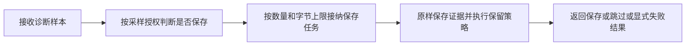
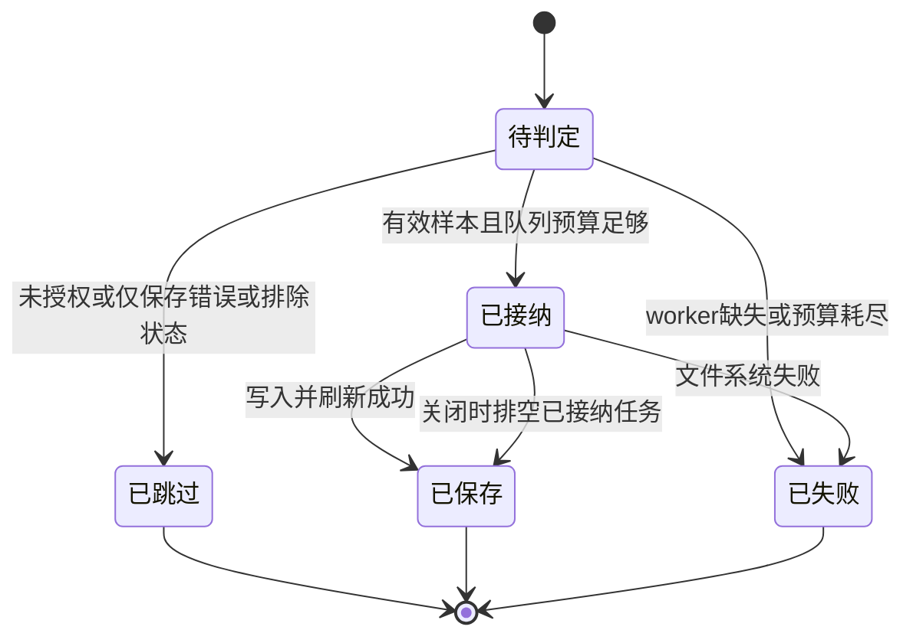

# Codex 样本持久化

图文件描述单个诊断样本对象流；跳过或拒绝作为 typed 结果继续至唯一出口，无业务 payload 修改。拓扑不新增生产 DAGpipe 调度。唯一 owner 为 Debug crate 的 `V3CodexSampleStore`。

| 语义节点 | 实现边界 | 验收 |
| --- | --- | --- |
| 判断是否保存 | persist / enqueue_persist 共用采样策略 | 未授权、普通样本及排除状态不占队列；force 502 不被跳过 |
| 接纳保存任务 | enqueue_persist | 保留64项和64MiB上限，过载显式记录且不影响业务请求 |
| 原样保存证据 | persist / worker / retention | JSON语义不变、保留provider attempts、0700/0600、写入错误显式、shutdown排空 |

范围：Debug persistence owner及公开接口回归；不改Provider、Router、SSE或客户端协议。成功/跳过/失败终点均以样本文件或failure ledger可核验；关闭排空已接纳任务。真实HTTP成功/失败入口验收由Server已有黑盒harness及安装后4444/7777验证完成。
