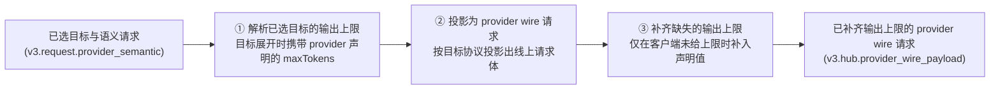

# V3 Provider 输出上限补齐（provider output-cap injection）

本文件是图产物 `v3.provider_output_cap_injection.graph.json` 的语义审阅面。
唯一设计真源是 graph 文件；本文件只提供中文语义图、边界说明与验收证据索引。

## 1. 缺陷与目标

**现象**：DSH 客户端经 RCC 调用上游模型时频繁出现
「已达到输出 token 上限 回答被截断」。

**根因**（已用同入口 A/B 对照证实）：客户端不发送输出上限时，RCC 的
provider-bound 请求体里**没有任何输出上限字段**，上游网关于是套用自己的
隐式默认值（glm-5.3 / qwen3.8-max-0902 为 8192，wb-deepseek-v4.1-flash
为 32768）。该默认值远低于任务实际需要的输出量，模型在默认值处停下并返回
`finish_reason=length` / `stop_reason=max_tokens` 的合法部分输出。

**目标**：当客户端未指定输出上限时，把 provider 模型在配置里声明的
`maxTokens` 作为输出上限补进 provider-bound 请求；客户端一旦显式指定，
永远以客户端为准。

## 2. 对象流边界（SESE）

| 项 | 值 |
|---|---|
| 对象 | 单个请求的 provider-bound 请求体 |
| 唯一入口 ARC | `已选目标与语义请求`（`v3.request.provider_semantic`） |
| 唯一出口 ARC | `已补齐输出上限的 provider wire 请求`（`v3.hub.provider_wire_payload`） |
| 触发 | 已选定 provider 目标、准备构造 provider 请求 |

## 3. 中文语义图

## 4. 节点、owner 与效果

| 节点 | Operator | Owner feature | 效果 |
|---|---|---|---|
| ① 解析已选目标的输出上限 | `routecodex.v3.target.V3TargetInterpreter::expand_candidates` | `v3.virtual_router_target_interpreter` | 只读 published manifest，把声明的 `maxTokens` 挂到候选上 |
| ② 投影为 provider wire 请求 | `routecodex.v3.runtime.build_v3_provider_standard_protocol_payload_from_req07` | `v3.hub_pipeline_static_skeleton`（被 `v3.provider_compat_profile_loading` 调用） | 只读语义请求，产出线上请求体 |
| ③ 补齐缺失的输出上限 | `routecodex.v3.runtime.apply_v3_provider_req_compat_to_provider_payload` | `v3.provider_compat_profile_loading` | 只读候选声明与线上请求体，写回线上请求体 |

**节点顺序依据**：注入必须发生在**协议投影之后**。若在 canonical 语义层注入，
canonical 的 `max_completion_tokens` 到达 Gemini 目标会触发
`UnmappedOutboundFields target_protocol=gemini` 错误（Gemini 无出站 token 投影）。
投影后的线上请求体才具备各协议自己的字段名。

**唯一 owner 依据**：`apply_v3_provider_req_compat_to_provider_payload` 是 Relay 与
Direct 两种执行模式共用的唯一请求侧 provider-compat 函数（Relay 经
`build_provider_req_compat_06_from_v3_hub_req_outbound_07`；Direct 经
`hooks.rs` 的 Responses/Chat 两条路径），因此不存在第二条会静默分叉的注入路径。

## 5. 逐协议字段与「客户端优先」判据

| provider wire | 客户端上限字段 | 客户端未给时补入 |
|---|---|---|
| Responses | `max_output_tokens` | `max_output_tokens` |
| OpenAI Chat | `max_completion_tokens` 或 `max_tokens` | `max_completion_tokens` |
| Anthropic | `max_tokens` | `max_tokens` |
| Gemini | `generationConfig.maxOutputTokens` | `generationConfig.maxOutputTokens` |

判据：仅当该协议**全部**可能承载字段都不存在时，才补入声明值；任一字段存在即视为
客户端已表达意图，不得覆盖。

## 6. 证据索引

| 证据 | 位置 |
|---|---|
| dry-run：无上限时 provider body 无 `max_tokens` | `~/.rcc/run-notes/evidence/dsh-rcc-truncation-20261004/runs/sample_1791105582864/dryrun-nolimit/` |
| dry-run：客户端 20000 → anthropic `max_tokens: 20000` | `.../runs/sample_1791105603966/dryrun-limit/` |
| dry-run：OpenAI Chat 客户端 20000 → `max_completion_tokens: 20000` | `.../runs/sample_1791105976247/r2/` |
| A/B 对照：无上限 → incomplete/8192；上限 20000 → completed/14053 | `.../runs/sample_1791105814717/live-probe-nolimit-control/`、`.../runs/sample_1791105694992/live-probe-limit20000-b/` |
| 声明值被上游接受（64000 与 393216 均 200） | `.../runs/sample_1791106089629/`、`sample_1791106094417/`、`sample_1791106113950/`、`sample_1791106118298/`、`sample_1791106139877/` |

## 7. 红测计划（实现前必须先红）

1. `客户端已给上限时不得被声明值覆盖` —— 四种 wire 各一例。
2. `客户端未给上限且模型声明了 maxTokens 时补入声明值` —— 四种 wire 各一例。
3. `客户端未给上限且模型未声明 maxTokens 时不得注入任何字段`。

## 8. 非目标

- 不修改 provider 声明里的 `maxTokens`（探针已证明 64000 / 393216 均被上游接受，
  原先"声明有误"的假设已被证伪；把声明改成 8192 会把截断固化，属有害改动）。
- 不改 DSH 客户端。
- 不改上游网关默认值。
- 不为"输出太长"增加截断/裁剪/fallback 逻辑。
- 不改 `provider_request_cleanup`（经核实为仅移除、当前不执行的遗留面，不适用）。

## 9. 风险

| 风险 | 处置 |
|---|---|
| 某 provider 声明值超过上游真实上限 → 注入后 400 | 已抽样验证 64000/393216 被接受；若出现 400 应修声明，而不是加猜测性 clamp |
| 输出变长导致客户端上下文/耗时预算变化 | 这是修复的预期效果；不额外加人为上限 |
| 与 provider health/cooldown、598/599 错误映射的交互 | 注入不改变终态语义；截断仍是合法部分输出，不进入失败/冷却路径 |
