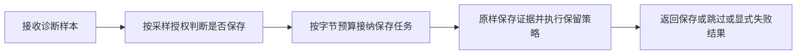
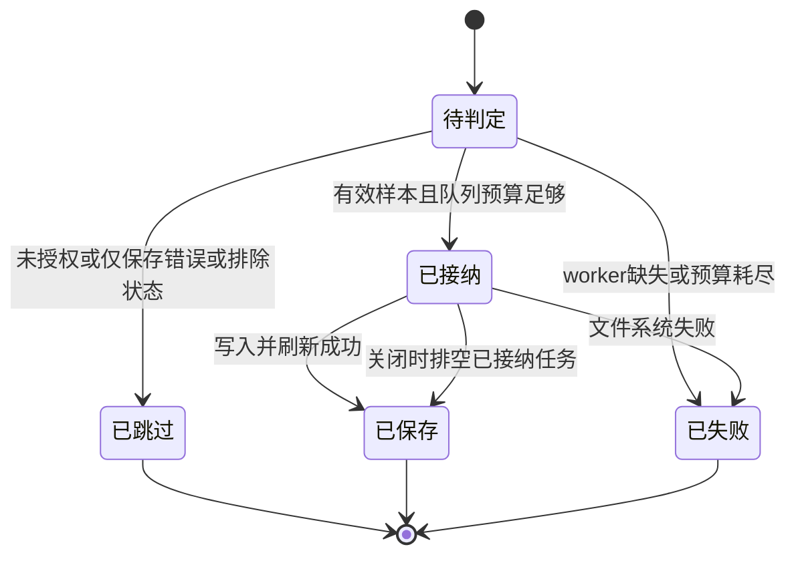

# Codex 样本持久化

图文件描述从 `enqueue_persist` 进入的单个异步诊断样本对象流；跳过或拒绝作为 typed 结果抵达唯一出口，不触发后续队列或文件系统 effect，无业务 payload 修改。拓扑不新增生产 DAGpipe 调度。唯一 owner 为 Debug crate 的 `V3CodexSampleStore`。这是非代理流水线功能图，放在 `docs/architecture/dags/`，由 `verify:v3-dagpipe-feature-graphs` 校验拓扑及真实资源 owner，不登记到代理流水线的 `modules.json`。

| 语义节点 | 实现边界 | 验收 |
| --- | --- | --- |
| 判断是否保存并接纳任务 | `V3CodexSampleStore::enqueue_persist`；内部与 `persist` 共用 `should_persist` | 未授权、普通样本及排除状态不占队列；force 502 不被跳过；保留64MiB字节预算上限，不以固定任务数限流；过载显式记录且不影响业务请求 |
| 排空已接纳任务 | `run_v3_codex_sample_persist_worker` | 消费唯一队列，关闭时排空已接纳任务并释放字节预算 |
| 原样保存证据 | `V3CodexSampleStore::persist` / retention | JSON语义不变、保留provider attempts、0700/0600、写入错误显式 |

图的队列字节预算属于 `v3.debug.codex_sample_persist_queue`，不读取表达诊断 payload 保真策略的 `v3.debug.payload_budget`。上游 snapshot 授权在创建样本任务前判断；本图不把它声明成存储 owner 的资源读取。入队或写入失败仍通过既有 `record_v3_codex_sample_persist_failure` owner 进入有界 failure ledger；它是节点内部错误终点，不新增代理 Error 链或成功包装。

范围：Debug persistence owner及公开接口回归；不改Provider、Router、SSE或客户端协议。成功/跳过/失败终点均以样本文件或failure ledger可核验；关闭排空已接纳任务。真实HTTP成功/失败入口验收由Server已有黑盒harness及安装后4444/7777验证完成。
