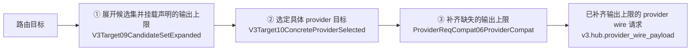

# V3 Provider 输出上限补齐（provider output-cap injection）

本文件是图产物 `v3.provider_output_cap_injection.graph.json` 的语义审阅面。
唯一设计真源是 graph 文件；本文件只提供中文语义图、边界说明与验收证据索引。

图位置：`docs/architecture/dags/`（非代理流水线对象源图目录），由
`npm run verify:v3-dagpipe-feature-graphs` 治理（枚举目录内全部 `*.graph.json`、
逐张 `dagpipe graph validate`、并把每个节点的 operator 末段与
`v3-resource-operation-map.yml` 的 `allowed_readers`/`allowed_writers` 交叉核对）。
不登记进 `docs/architecture/dagpipe/modules.json`。

## 1. 缺陷与目标

**现象**：DSH 客户端经 RCC 调用上游模型时频繁出现
「已达到输出 token 上限 回答被截断」。

**根因**（同入口 A/B 对照证实）：客户端不发送输出上限时，RCC 的
provider-bound 请求体里**没有任何输出上限字段**，上游网关于是套用自己的
隐式默认值（glm-5.3 / qwen3.8-max-0902 为 8192，wb-deepseek-v4.1-flash
为 32768）。该默认值远低于任务实际需要的输出量，模型在默认值处停下并返回
`finish_reason=length` / `stop_reason=max_tokens` 的合法部分输出。

**目标**：客户端未指定输出上限时，把 provider 模型在配置里声明的
`maxTokens` 作为输出上限补进 provider-bound 请求；客户端一旦显式指定，
永远以客户端为准。

## 2. 对象流边界（SESE）

| 项 | 值 |
|---|---|
| 对象 | 单个请求从路由目标到 provider wire 请求的构造流 |
| 唯一入口 ARC | `路由目标`（schema-only，无资源绑定） |
| 唯一出口 ARC | `已补齐输出上限的 provider wire 请求`（`v3.hub.provider_wire_payload`） |

## 3. 中文语义图

## 4. 节点、owner 与资源效果

| 节点 | Operator（末段为 resource map 登记符号） | Owner feature | reads | writes |
|---|---|---|---|---|
| ① 展开候选集并挂载声明的输出上限 | `routecodex.v3.target.V3Target09CandidateSetExpanded` | `v3.virtual_router_target_interpreter` | — | `v3.target.candidate_set` |
| ② 选定具体 provider 目标 | `routecodex.v3.target.V3Target10ConcreteProviderSelected` | `v3.virtual_router_target_interpreter` | `v3.target.candidate_set` | `v3.target.concrete_provider` |
| ③ 补齐缺失的输出上限 | `routecodex.v3.runtime.ProviderReqCompat06ProviderCompat` | `v3.provider_compat_profile_loading` | `v3.request.provider_semantic`、`v3.target.concrete_provider`、`v3.hub.resolved_target` | `v3.hub.provider_wire_payload` |

**协议投影不是独立节点**：标准协议投影
（`build_v3_provider_standard_protocol_payload_from_req07`）是节点③内部步骤，
其 owner 为 `v3.route_selected_provider_model_binding`（该符号是它的
`entry_symbol`），且它是私有函数、不是 SDK 注册 Operator，因此不单列节点。
注入发生在其之后，对**最终 payload**生效。

**节点顺序依据**：注入必须发生在**协议投影之后**。若在 canonical 语义层注入，
canonical 的 `max_completion_tokens` 到达 Gemini 目标会触发
`UnmappedOutboundFields target_protocol=gemini` 错误（Gemini 出站白名单不含 token
别名）。投影后的线上请求体才具备各协议自己的字段名。

**唯一 owner 依据**：`apply_v3_provider_req_compat_to_provider_payload` 是 Relay 与
Direct 两种执行模式共用的唯一请求侧 provider-compat 函数（Relay 经
`build_provider_req_compat_06_from_v3_hub_req_outbound_07`；Direct 经 `hooks.rs`
的 Responses/Chat 两条路径，`hooks.rs:506` 与 `hooks.rs:782`），无第二条分叉路径。

## 5. 逐协议字段与「客户端优先」判据

| provider wire | 客户端上限可能出现的字段 | 客户端未给时补入 |
|---|---|---|
| Responses | `max_output_tokens`、`max_completion_tokens`、`max_tokens` | `max_output_tokens` |
| OpenAI Chat | `max_completion_tokens`、`max_tokens` | `max_completion_tokens` |
| Anthropic | `max_tokens` | `max_tokens` |
| Gemini | `generationConfig.maxOutputTokens` | `generationConfig.maxOutputTokens` |

**判据**：仅当该协议**全部**可能承载字段都不存在时，才补入声明值；任一字段存在即视为
客户端已表达意图，不得覆盖。Responses 必须检查三个别名：Direct 模式下
Responses 标准化是无损的（`nodes.rs:296-324`）且 `hooks.rs:455` 的 `_ => request_body`
会把已经是 Responses 形状的 body 原样透传，因此 Direct wire 可能带
`max_completion_tokens` 或 `max_tokens`；Relay 投影则会把三个别名收敛为
`max_output_tokens`（`request_outbound_format.rs:296-301`）。

**注入位置**：在 `apply_v3_provider_req_compat_to_provider_payload` 内、**最终 payload**
上执行（即 `run_req_outbound_stage3_compat` 调用与其后的 payload 归一化之后，
`provider_req_compat_06_provider_compat.rs:113-134` 之后），使注入字段不经过 provider
compat profile 的字段挑选。

**Gemini 边界**：`generationConfig` 在白名单中只校验顶层存在、不校验形状
（`request_outbound_format.rs:407-414`）。因此注入只在
`generationConfig` 缺失时创建；若已存在但**不是对象**，保持原样且绝不报错
（透明代理：不得拒绝可通过的请求）。

## 6. 证据索引

| 证据 | 位置 |
|---|---|
| dry-run：无上限时 provider body 无 `max_tokens` | `~/.rcc/run-notes/evidence/dsh-rcc-truncation-20261004/runs/sample_1791105582864/dryrun-nolimit/` |
| dry-run：客户端 20000 → anthropic `max_tokens: 20000` | `.../runs/sample_1791105603966/dryrun-limit/` |
| dry-run：OpenAI Chat 客户端 20000 → `max_completion_tokens: 20000` | `.../runs/sample_1791105976247/r2/` |
| A/B 对照：无上限 → incomplete/8192；上限 20000 → completed/14053 | `.../runs/sample_1791105814717/live-probe-nolimit-control/`、`.../runs/sample_1791105694992/live-probe-limit20000-b/` |
| 声明值被上游接受（64000 与 393216 均 200） | `.../runs/sample_1791106089629/`、`sample_1791106094417/`、`sample_1791106113950/`、`sample_1791106118298/`、`sample_1791106139877/` |

## 7. 红测计划（实现前必须先红）

测试归属 **v3 workspace**（`v3/package.json` 的 `-p provider-compat-core` /
`-p routecodex-v3-runtime`）；根 `package.json:156` 的
`test:v3-provider-compat-profile-loading` 指向不存在的
`sharedmodule/llmswitch-core/rust-core/Cargo.toml`，不作为本任务 gate。

1. `hub_v1/tests.rs` — 四协议矩阵（经
   `build_provider_req_compat_06_from_v3_hub_req_outbound_07`，候选
   `max_tokens: Some(20000)`）：
   - (a) 客户端无上限 → Responses `max_output_tokens == 20000`；
     OpenAiChat `max_completion_tokens == 20000` 且 `get("max_tokens").is_none()`；
     Anthropic `max_tokens == 20000`；
     Gemini `pointer("/generationConfig/maxOutputTokens") == 20000`。
   - (b) 客户端上限 64 → 各协议线上字段 `== 64`；含别名用例：Responses 带
     `max_completion_tokens: 64` 时不得再出现 `max_output_tokens`。
     **注意**：Relay OpenAI Chat 上 `max_tokens` 是白名单字段、原样透传
     （`request_outbound_format.rs:1047-1051` 只把 `max_output_tokens` 改名为
     `max_completion_tokens`），因此"不得再出现 `max_completion_tokens`"只对
     Responses→Chat Direct 成立；Relay Chat wire 上两者**并存是合法的**，
     测试须按此分别断言，不得把并存当失败。
   - (c) `max_tokens: None` → 四协议均不出现任何上限字段。
2. `hub_v1/tests.rs` — Gemini 守护：`generationConfig` 已存在但非对象时，
   注入不得报错且保持原值不变。
3. 线上抓包测试：
   - `tests/responses_relay_field_parity_integration.rs`：manifest provider 声明
     `maxTokens`，断言 Responses 与 OpenAI Chat wire 的 provider body
     （对齐既有 `body["max_completion_tokens"] == 321` 断言）。
   - `tests/responses_relay_anthropic_provider_wire_integration.rs`、
     `tests/anthropic_relay_anthropic_provider_wire_integration.rs`：断言
     Anthropic provider body 的 `max_tokens`。
4. `hub_v1/request_outbound_gemini_tests.rs` — 保留投影层守护：canonical
   `max_completion_tokens` 到 Gemini 仍须以
   `UnmappedOutboundFields target_protocol=gemini` 失败（证明注入必须在投影之后）。
5. **字段名一致性守护**（消融）：断言注入所用字段名与该协议投影层既有字段名一致
   （`request_outbound_format.rs:106-108`、`:296-301`、`:1048-1051`；
   `anthropic_codec.rs:497-503`；`gemini_codec.rs:396-402`），防止两处协议知识漂移。

## 8. 实现清单

- `V3TargetCandidate` 增加 `pub max_tokens: Option<u64>`，在
  `v3/crates/routecodex-v3-target/src/lib.rs:741` 的结构体字面量中从
  `model.max_tokens` 赋值（紧邻 `:750` 的 `max_context_tokens`）。
- 所有 `V3TargetCandidate` 构造点同步补齐新字段：
  `selected_provider_model_binding.rs:53`、`provider_req_compat_06_provider_compat.rs:375`、
  `hub_v1/tests.rs:257/333/408`、`hooks_tests.rs:58`。
- 注入实现位于 `apply_v3_provider_req_compat_to_provider_payload`。

## 9. 非目标

- 不修改 provider 声明里的 `maxTokens`（探针已证明 64000 / 393216 均被上游接受；
  把声明改成 8192 会把截断固化，属有害改动）。
- 不改 DSH 客户端。
- 不改上游网关默认值。
- 不为「输出太长」增加截断/裁剪/fallback 逻辑，不添加猜测性 clamp。
- 不改 `provider_request_cleanup`（仅移除、当前不执行的遗留面）。
- 不改 `provider_terminal_response_admission`（截断是合法部分输出，rcc 的承认行为正确）。

## 10. 风险

| 风险 | 处置 |
|---|---|
| 某 provider 声明值超过上游真实上限 → 注入后 400 | 已抽样验证 64000/393216 被接受；仅覆盖已抽样 provider。跟踪为独立风险项，出现 400 应修声明，不加猜测性 clamp；回滚即撤销注入 |
| 输出变长触发 `request_timeout_ms`，被计入 provider 冷却并反馈到 598/599 | 注入按设计提高输出长度；需一条真实入口长输出 E2E 观察是否触发超时/冷却，不加 fallback；若触发按 provider 超时真因处理 |
| 与 provider health/cooldown、598/599 错误映射的交互 | 注入不改变终态语义；截断仍是合法部分输出，不进入失败/冷却路径 |
