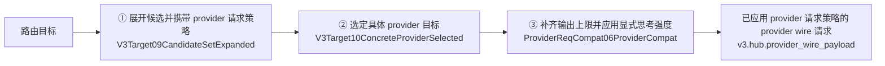

# V3 Provider 请求策略注入（provider request policy injection）

本文件是图产物 `v3.provider_request_policy_injection.graph.json` 的语义审阅面。
唯一设计真源是 graph 文件；本文件提供中文语义图、边界说明与验收证据索引。

图位置：`docs/architecture/dags/`，由
`npm run verify:v3-dagpipe-feature-graphs` 治理。

## 1. 目标与边界

provider-directory TOML 可为每个 provider 声明可选的最终思考强度：

```toml
[provider.v3]
reasoning_effort = "medium"
```

配置存在时，最终 provider wire effort 以该配置为准；配置省略时完整保留
客户端、标准协议投影和既有 compat mappings 的结果。配置值只从
provider-directory 编译链传入已选 provider 目标，不从 wire、metadata 或日志
重建控制状态。

## 2. 对象流边界（SESE）

| 项 | 值 |
|---|---|
| 对象 | 单个请求从路由目标到 provider wire 请求的构造流 |
| 唯一入口 ARC | `路由目标`（schema-only，无资源绑定） |
| 唯一出口 ARC | `已应用 provider 请求策略的 provider wire 请求`（`v3.hub.provider_wire_payload`） |

## 3. 中文语义图



## 4. 节点、owner 与资源效果

| 节点 | Operator | Owner feature | reads | writes |
|---|---|---|---|---|
| ① 展开候选并携带 provider 请求策略 | `routecodex.v3.target.V3Target09CandidateSetExpanded` | `v3.virtual_router_target_interpreter` | — | `v3.target.candidate_set` |
| ② 选定具体 provider 目标 | `routecodex.v3.target.V3Target10ConcreteProviderSelected` | `v3.virtual_router_target_interpreter` | `v3.target.candidate_set` | `v3.target.concrete_provider` |
| ③ 补齐输出上限并应用显式思考强度 | `routecodex.v3.runtime.ProviderReqCompat06ProviderCompat` | `v3.provider_compat_profile_loading` | `v3.request.provider_semantic`、`v3.target.concrete_provider`、`v3.hub.resolved_target` | `v3.hub.provider_wire_payload` |

`reasoning_effort` 和 `max_tokens` 都是 provider 声明中允许进入 provider wire
的候选字段。配置 effort 由节点①从 published manifest 复制到候选，节点②
原样携带，节点③在标准协议投影和既有 compat mappings 之后应用最终值。
其他候选字段保持控制侧语义，不进入 provider wire。

## 5. 配置失败与清理终点

配置编译是图入口之前的同步前置依赖。配置失败不是 runtime 请求失败：

- exact TOML 解析失败或非法 enum 返回 `V3ConfigError::Parse`。
- unsupported protocol 返回 `V3ConfigError::Validation`。
- 两种失败都在 `V3Config05ManifestPublished` 之前终止，不发布 manifest。

本 feature 不创建 listener、进程、文件句柄或异步任务，因此配置失败路径
没有可回收的运行时资源；取消不适用于同步编译。测试 listener 和外部
provider fixture 属于测试自身资源：断言后关闭 server handle，并验证
独占 fixture listener 不再接受连接。失败和清理终点都有可核验检查，不依赖
消息邮箱、后台任务或隐式状态。

## 6. 证据索引

| 证据 | 位置 |
|---|---|
| exact TOML 正向解析、invalid enum、unsupported protocol | 定向 config 测试与公开 consumer E2E |
| Chat/Responses、Direct/Relay provider wire effort 断言 | 公开 HTTP consumer E2E |
| 未配置透明回归与其他 provider 隔离 | 公开 HTTP consumer E2E |
| graph 治理与资源 effect 交叉核对 | `npm run verify:v3-dagpipe-feature-graphs` |
