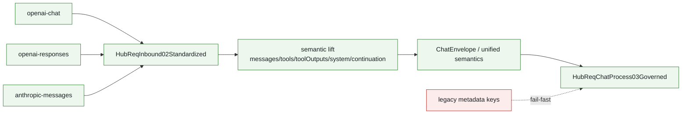
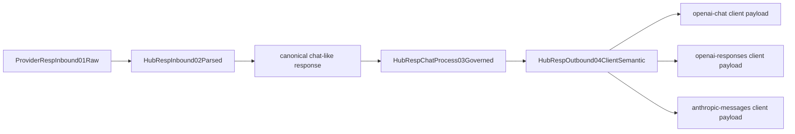
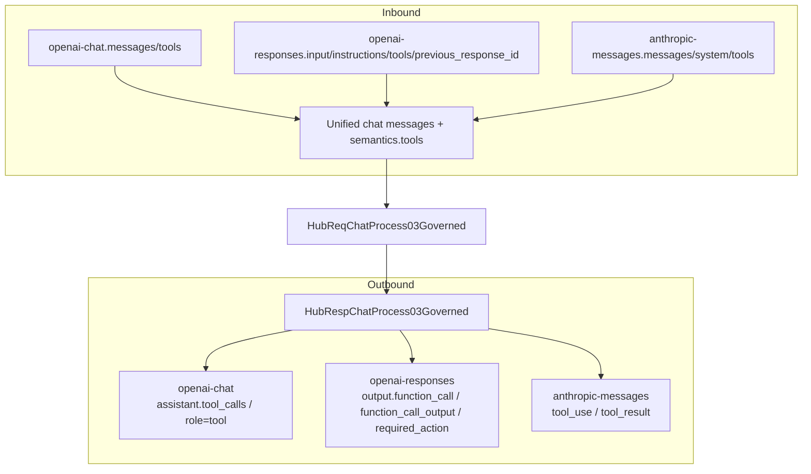

# Chat Process Protocol Mapping

## Purpose

这页只解决两件事：

1. 三种入口协议在进入 `chat process` 时，哪些语义字段要映射到统一 chat 语义。
2. 当前有哪些映射漏洞、哪些字段仍停留在 legacy metadata / transitional surface。

Canonical sources:

- `docs/CHAT_PROCESS_PROTOCOL_AND_PIPELINE.md`
- `docs/chat-process-continuation-state-contract.md`
- `docs/architecture/function-map.yml`
- `docs/architecture/verification-map.yml`
- `docs/audits/2026-05-17-conversion-matrix-full-audit.md`
- `docs/design/responses-continuation-storage-ownership.md`

Target protocols in this page:

- `openai-chat`
- `openai-responses`
- `anthropic-messages`

## Main Rule

- inbound 在进入 `HubReqChatProcess03Governed` 前，必须把“可映射语义”提升为统一 chat 语义。
- response 在进入 `HubRespChatProcess03Governed` 前，必须先 canonicalize 到 chat completion-like 语义。
- metadata 只留不可映射的 runtime control；可映射语义不得滞留 metadata。

## Inbound Mapping Flow

## Request-Side Semantic Mapping

| Semantic concept | `openai-chat` | `openai-responses` | `anthropic-messages` | Unified chat-process target |
| --- | --- | --- | --- | --- |
| user/assistant turn history | `messages[]` | `input[]` / restored full input | `messages[]` | `ChatEnvelope.messages` |
| system instruction | system role message | `instructions` and/or system `input_text` | top-level `system` | `semantics.system.textBlocks` plus canonical message/system lift |
| client tool declarations | `tools[]` | `tools[]` | `tools[]` | `semantics.tools.clientToolsRaw` |
| explicit empty tools | empty `tools` intent | empty `tools` intent | empty `tools` intent | `semantics.tools.explicitEmpty` |
| tool call output back to model | `role=tool` with `tool_call_id` | `function_call_output` / `submit_tool_outputs` | `tool_result` | `chat.toolOutputs` + `semantics.continuation.toolContinuation.resumeOutputs` |
| continuation anchor | mostly none / local session logic | `previous_response_id`, `response_id`, `responsesResume` | message-level continuity only | `semantics.continuation.*` |
| response format / output schema hints | response format style fields | `response_format` family | tool/schema guidance | protocol-specific semantic supplement under `semantics.*`, not metadata |
| anthropic tool aliasing | n/a | n/a | `tool_use.name` alias mapping | `semantics.tools.toolNameAliasMap` |

## Response-Side Semantic Mapping

## Response Projection Matrix

| Unified response semantic | To `openai-chat` client | To `openai-responses` client | To `anthropic-messages` client |
| --- | --- | --- | --- |
| plain assistant text | `choices[].message.content` | `output_text` / `output[]` text item | assistant text block |
| tool call request | `assistant.tool_calls[]` + `finish_reason=tool_calls` | `output.function_call` + `required_action.submit_tool_outputs.tool_calls[]` | `content[].tool_use` |
| tool call id continuity | `tool_calls[].id` / `tool_call_id` | `call_id` / `id` / `required_action` linkage | `tool_use.id` / `tool_result.tool_use_id` |
| tool result backfill | `role=tool` / restored next-turn tool message | `function_call_output` / resumed input item | `tool_result` block |
| continuation owner/restore truth | internal only | internal only, explicit protocol fields rebuilt from semantics | internal only |
| hidden reasoning retention | protocol-dependent internal carrier | protocol-dependent internal carrier | anthropic/native carrier and projection owner |

## Field-Level Mapping Matrix

### Request Fields

| Unified meaning | `openai-chat` request field | `openai-responses` request field | `anthropic-messages` request field | Unified target |
| --- | --- | --- | --- | --- |
| user / assistant history | `messages[]` | `input[]` / restored `fullInput` | `messages[]` | `ChatEnvelope.messages` |
| system instruction | system role message | `instructions` or leading system `input_text` | top-level `system` | `semantics.system.textBlocks` |
| tool declaration list | `tools[]` | `tools[]` | `tools[]` | `semantics.tools.clientToolsRaw` |
| explicit no-tools intent | empty `tools[]` / tool policy hints | empty `tools[]` | empty `tools[]` | `semantics.tools.explicitEmpty` |
| tool result submission | `role=tool` + `tool_call_id` | `function_call_output` / `submit_tool_outputs` | `tool_result` + `tool_use_id` | `chat.toolOutputs` |
| continuation anchor | session/conversation continuity | `previous_response_id` / `response_id` / `responsesResume.*` | message-level continuity hints | `semantics.continuation.*` |
| response schema / format hint | response format style fields | `response_format` family | schema guidance / tool guidance | protocol supplement under `semantics.*` |
| anthropic alias map | n/a | n/a | tool name aliasing | `semantics.tools.toolNameAliasMap` |

### Response Fields

| Unified meaning | `openai-chat` response field | `openai-responses` response field | `anthropic-messages` response field | Unified source |
| --- | --- | --- | --- | --- |
| assistant text | `choices[].message.content` | `output_text` / `output[].content[].text` | assistant text block | governed plain text response |
| tool call request | `assistant.tool_calls[]` | `output.function_call` + `required_action.submit_tool_outputs.tool_calls[]` | `content[].tool_use` | governed tool-call response |
| tool-call id | `tool_calls[].id` | `call_id` / `id` | `tool_use.id` | same semantic tool-call identity |
| tool result linkage | `tool_call_id` in next request | `function_call_output.call_id` | `tool_result.tool_use_id` | same semantic linkage id |
| terminal marker | `finish_reason` | `response.completed` / `response.done` | content-block terminal / final completion | unified terminal response state |
| continuation resume truth | internal only | rebuilt protocol fields only | internal only | `semantics.continuation` |
| hidden reasoning | hidden/internal | replay-safe retained subset only | hidden/internal native carrier | internal carrier only |

## JSON / SSE Equality Surface

| Semantic | JSON surface | SSE surface | Must hold |
| --- | --- | --- | --- |
| terminal completion | final JSON body | `response.completed` / `response.done` | same terminal truth |
| tool call availability | final `assistant.tool_calls` or `required_action` | completed event / final SSE frame | same consumer-visible tool call set |
| tool-call ids | final body ids | terminal SSE frame ids | ids must match exactly |
| plain text output | final text field | accumulated SSE visible output | semantic equality, not necessarily byte-for-byte chunking |
| error projection | JSON error body | `event:error` or terminal error frame | same error class, no success-wrapped error |

## Legacy Metadata Keys That Must Not Reach Chat Process

来自 `CHAT_PROCESS_PROTOCOL_AND_PIPELINE.md` 的 fail-fast 清单：

- `responsesResume`
- `clientToolsRaw`
- `anthropicToolNameMap`
- `responsesContext`
- `responseFormat`
- `systemInstructions`
- `toolsFieldPresent`
- `extraFields`

这些键若仍以 metadata 形式进入 `HubReqChatProcess03Governed`，说明 semantic lift 还不彻底。

## Owner Anchors

| Feature | What it owns | Canonical builder / evidence |
| --- | --- | --- |
| `hub.metadata_boundary` | metadata 只能做 control carrier，不能留在 normal payload | `assert_no_inline_metadata`, `ensure_runtime_metadata_json`, `read_runtime_metadata_json` |
| `responses.instructions_to_input_normalization` | `instructions -> leading system input_text` Rust-only | `apply_responses_instructions_to_input` |
| `responses.tool_parameters_normalization` | Responses `tools[].parameters` normalize to wire object schema | `normalize_responses_tool_parameters` |
| `hub.response_responses_chat_projection` | Responses provider payload -> chat semantic projection | response mainline owner + Rust response projection |
| `hub.response_anthropic_client_projection` | Anthropic message -> OpenAI chat/Responses client semantic projection | `build_openai_chat_from_anthropic_message_full`, `build_openai_chat_response_from_anthropic_message` |

## Three-Protocol Mapping Graph

## Mapping Gaps / Review Findings

| Gap ID | Area | Current signal | Why it matters |
| --- | --- | --- | --- |
| `map-gap-01` | Legacy metadata residue | `responsesResume / responsesContext / responseFormat / anthropicToolNameMap / clientToolsRaw` 仍在代码与旧类型里大量出现 | 说明还有过渡面没有完全缩到 `semantics.*` |
| `map-gap-02` | Coverage asymmetry | 旧 conversion audit 已指出 tool-call 映射矩阵不完整，尤其跨协议 required_action/tool_use/tool_result 组合 | 容易出现“一个协议绿，另一个协议 silently lossy” |
| `map-gap-03` | Queryability | 之前缺专门的三协议 chat-process 映射图 | 审计时要在 req/resp 多文档跳转，难以一次看出缺口 |
| `map-gap-04` | Continuation semantics | `previous_response_id`、`responsesResume`、relay store、direct ownership 分别在不同文档/代码点出现 | 若不统一看，容易把协议字段误当路由真源 |
| `map-gap-05` | Audit surface | `protocolMapping.preserved/lossy/dropped/unsupported` 有 contract 文档，但还没有对应 wiki review 面把三协议放一起 | 后续难补齐“哪些字段是有损，哪些字段是完全缺失” |

## Suggested Next Gate Additions

这部分是后续建议，不是本次已实现 gate。

| Gate idea | Purpose |
| --- | --- |
| `verify:chat-process-protocol-mappable-semantics` | 扫描 fail-fast metadata key 是否还在进入 `HubReqChatProcess03Governed` 前存活 |
| `verify:protocol-mapping-audit-coverage` | 断言三协议对 `preserved/lossy/dropped/unsupported` 都有显式 audit |
| `verify:tool-call-id-roundtrip-three-protocols` | 锁住 `tool_call_id / call_id / tool_use_id` roundtrip 一致性 |
| `verify:continuation-owner-three-protocols` | 锁住 `entryKind + continuationOwner + scope` 不被协议特判绕回去 |
| `verify:responses-sse-json-equality` | 锁住 JSON 与 SSE 对同一响应语义等价，尤其 tool call / required_action / terminal |
| `verify:server-responses-sse-bridge-surface` | 锁住 server 只有单一 SSE bridge surface，不把协议语义散回 handler |

## Review Checklist

- 进入 `chat process` 前，所有可映射语义是否都已落到 chat fields 或 `semantics.*`。
- metadata 是否还残留 `responsesResume / responsesContext / anthropicToolNameMap / clientToolsRaw` 等 legacy 键。
- `instructions/system/tools/tool outputs/continuation anchors` 是否三协议都能映射到统一语义。
- response projection 是否同时覆盖 `openai-chat`、`openai-responses`、`anthropic-messages`。
- `tool_call_id / call_id / tool_use_id` 是否保持可追溯一致。
- 有损或不支持字段是否进入 `protocolMapping` audit，而不是静默丢失。
- JSON 与 SSE 是否对同一响应语义等价。
- server SSE bridge 是否仍是 facade-only 单一出口，而不是重新长出第二份协议语义。
