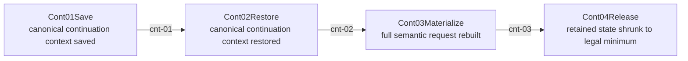

# Continuation Standard Contract

## Purpose

This page is the review surface for the standardized continuation contract that `MetadataCenter` must own.

It exists to stop continuation behavior from being split across:

- protocol fields
- local store entry shapes
- bridge-local guessed fields
- stopless-specific restore patches

Canonical sources:

- `docs/design/continuation-metadata-center-standard-contract.md`
- `docs/design/responses-continuation-storage-ownership.md`
- `docs/chat-process-continuation-state-contract.md`
- `docs/architecture/wiki/metadata-center-mainline-source.md`

## Lifecycle

Save/restore order matters:

- restore must happen before any stopless or hook-side reclassification of the request
- hook-side response/request rewriting must run on the restored current-turn shape
- save must persist the finalized canonical continuation truth, not the pre-hook shell shape
- if a stopless projection or response hook runs before restore, the next turn will replay stale shape and lose the modification context

## Protocol Modes

| protocol | owner | mode | legal persisted truth | forbidden behavior |
| --- | --- | --- | --- | --- |
| `openai-responses` | `direct` | `remote_resume` | `responseId/previousResponseId/providerKey/scope` | local materialize pretending to be remote resume |
| `openai-responses` | `relay` | `local_materialize` or `submit_tool_outputs` | `fullInput/deltaInput/restoredTools/toolOutputs/scope` | restoring tools from a second guessed path |
| `openai-chat` | `none` | `none` | none by default | consuming responses continuation |
| `anthropic-messages` | `none` | `none` | none by default | consuming responses continuation |

## Owner Rules

### Save

- one owner decides whether continuation rights exist
- one owner writes the canonical family

### Restore

- one owner validates legal entry
- one owner reads the canonical family

### Materialize

- one owner expands canonical continuation truth into next-turn semantic input

### Release

- one owner shrinks retained continuation state

## Test Matrix

### White-box

- save direct responses remote truth only
- save relay responses with `fullInput + restoredTools`
- restore direct requires same provider
- restore relay returns canonical `fullInput + restoredTools`
- materialize relay uses one canonical context
- release removes non-canonical residue

### Black-box

- relay continuation final provider request preserves tools
- direct continuation stays on same provider
- ordinary create does not auto-resume
- chat/messages do not consume responses continuation
- stopless continuation keeps schema feedback and tool availability together

## Current Gap

Current repo behavior is still mixed:

- some restore paths return `fullInput`
- some bridge paths independently expect `restoredTools`
- this means the contract is not yet canonical

That gap must be closed at the contract level first, then in code.
