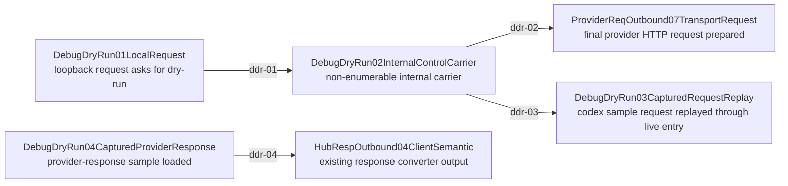

# Debug Unified Surface Mainline Source

## Purpose

This page is the M0 review surface for the debug unified surface migration. It does not prove that runtime implementation has already converged into one module. It locks:

- which debug families are in scope,
- which ones belong to the future unified debug authoring surface,
- which ones must stay with existing runtime owners,
- and the enforced per-module migration order.

Canonical sources:

- `docs/goals/debug-unified-surface-goal.md`
- `docs/architecture/function-map.yml` -> `feature_id: debug.unified_surface`
- `docs/architecture/verification-map.yml` -> `feature_id: debug.unified_surface`
- `docs/architecture/mainline-call-map.yml` -> `chain_id: debug.unified_surface.mainline`
- `docs/architecture/metadata-center-manifest.yml` (`debug_snapshot` family boundary)

Current state:

- `src/debug/` exists, but it is not yet the single runtime owner.
- snapshot writing, provider snapshot buffering, logger rendering, debug hooks, and diag error files still live in different modules.
- the current M0 closeout is governance only: docs, registry, review surface, and migration sequence.

## Main Rule

- `diag` is not synonymous with `diagnostics`.
- `debug` is not allowed to absorb runtime semantics that belong to VR/Hub/provider owners.
- the migration must happen one module at a time, in the documented M0 -> M9 order.
- old paths are not "deprecated forever"; they are temporary and must be physically deleted once the corresponding module slice lands.

## Diagnostics Taxonomy

| family | current examples | target owner | must not become |
| --- | --- | --- | --- |
| error diag artifact | `~/.rcc/diag/error-*.json`, replay scripts that read those files | `src/debug/diag/*` | runtime retry/fallback state, metadata truth, provider/client payload |
| runtime diagnostics contract | `routeResult.diagnostics`, VR forwarder diagnostics, Hub native diagnostics | existing runtime owner such as `vr.provider_forwarder_runtime` / Hub Rust owner | a debug-owned second DTO or second policy engine |
| log diag rendering | usage line `diag=wait.traffic ... decode.sse ...`, provider/pipeline console debug rendering | `src/debug/logger/*` | timing-truth owner, route/selection decision owner |

Hard rule:

- debug may consume runtime diagnostics read-only for inspection, but must never redefine them or fork their meaning.

## Migration Mainline

```mermaid
flowchart LR
  DebugObs01SurfaceRequested["DebugObs01SurfaceRequested<br/>debug governance entry requested"]
  DebugObs02DiagCaptured["DebugObs02DiagCaptured<br/>error diag artifact isolated from runtime diagnostics"]
  DebugObs03SnapshotCaptured["DebugObs03SnapshotCaptured<br/>snapshot store/writer surface selected"]
  DebugObs04LoggerEmitted["DebugObs04LoggerEmitted<br/>logger/inline diag rendering routed"]
  DebugObs05HarnessExecuted["DebugObs05HarnessExecuted<br/>dry-run/replay/harness contract unified"]
  DebugObs06PolicyRecorded["DebugObs06PolicyRecorded<br/>policy violation recording unified"]
  DebugObs07ReplayedOrInspected["DebugObs07ReplayedOrInspected<br/>debug artifact package becomes replay/inspection ready"]

  DebugObs01SurfaceRequested -->|dbg-01| DebugObs02DiagCaptured
  DebugObs02DiagCaptured -->|dbg-02| DebugObs03SnapshotCaptured
  DebugObs03SnapshotCaptured -->|dbg-03| DebugObs04LoggerEmitted
  DebugObs04LoggerEmitted -->|dbg-04| DebugObs05HarnessExecuted
  DebugObs05HarnessExecuted -->|dbg-05| DebugObs06PolicyRecorded
  DebugObs06PolicyRecorded -->|dbg-06| DebugObs07ReplayedOrInspected
```

This is the target migration shell, not proof that the chain is runtime-anchored today. All edges remain `binding pending` until their corresponding module slice is migrated and verified.

## Module Order

| module | scope | current source residue | target result |
| --- | --- | --- | --- |
| `M0 debug.surface_registry` | docs/map/wiki/manifest/call-map only | no unified owner registry | governance shell lands |
| `M1 debug.diag_error_artifact` | `~/.rcc/diag/error-*.json`, reader/writer, replay-input path | `responses-handler.ts` direct write, replay script hardcoded path | one diag writer/reader contract |
| `M2 debug.snapshot_store` | `src/debug/snapshot-store.ts` roundtrip and indexability | store path layout does not equal fetch/list semantics | one coherent snapshot store |
| `M3 debug.snapshot_server_writer` | `src/utils/snapshot-writer.ts` | server snapshot writing split from debug surface | server snapshot moves under debug |
| `M4 debug.snapshot_provider_writer` | provider snapshot writer + buffer | provider debug snapshot remains under provider utils | provider snapshot moves under debug |
| `M5 debug.logger_surface` | pipeline/provider logger + inline `diag=` rendering | logger code split across pipeline/provider utils | one logger surface, no timing semantic rewrite |
| `M6 debug.harness_replay_surface` | harness/registry/dry-run/replay | replay and dry-run metadata contracts diverge | replayable unified harness contract |
| `M7 debug.provider_hook_surface` | debug example hooks + bidirectional hook contract | debug fields may leak into normal metadata | debug hooks remain observation-only |
| `M8 debug.policy_violation_surface` | policy violation copy/reporting | manual copy convention in README/scripts | one policy observation surface |
| `M9 cleanup` | old path deletion + global gates | migration shells and old residues remain | src/debug becomes true single authoring surface |

## Pipeline Dry-Run Loop

`debug.pipeline_dry_run_loop` is the first concrete M6 slice for request/response repair closeout.

Rules:

- request dry-run is local-only and triggered by `x-routecodex-dry-run: provider-request`.
- request dry-run must use the normal API handler, Hub/VR/provider runtime path, and stop only after final provider request preparation plus `provider-request` snapshot write.
- captured request dry-run uses `node scripts/replay-codex-sample.mjs --sample <client-request.json> --dry-run provider-request --base http://127.0.0.1:<port>`.
- captured response dry-run uses `npm run dry-run:codex-response -- --sample <provider-response.json>` and calls `convertProviderResponseIfNeeded`; no script-local response parser may become truth.
- debug carrier state must not enter provider wire payload or normal client response payload.

## Boundary Rules

### Metadata

- `debug_snapshot` remains an observability family only.
- debug must not write `request_truth`, `continuation_context`, `runtime_control`, `provider_observation`, or `client_attachment_scope`.
- debug metadata must not leak into provider wire payloads or client normal response payloads.

### Runtime Diagnostics

- VR/Hub/provider runtime `diagnostics` fields remain owned by their current runtime owner.
- HTTP diagnostics routes may expose runtime status, but must not implement runtime selection/health logic.
- no debug module may fork a second `diagnostics` DTO that redefines runtime meaning.

### Error diag artifacts

- error diag file writing must become a named debug writer, not ad hoc `fs.writeFileSync` inside route handlers.
- write failure must be observable; silent `catch {}` is not allowed in the target design.
- replay readers must accept explicit path/input and must not hardcode local machine diag paths.

## Completion Signal for M0

M0 is complete only when:

- `debug.unified_surface` exists in function-map and verification-map,
- this wiki page exists and matches the call-map/manifest node IDs,
- `docs/architecture/mainline-manifests/debug-unified-surface.mainline.yml` exists,
- `docs/architecture/mainline-call-map.yml` contains `debug.unified_surface.mainline`,
- and the migration order + diagnostics taxonomy are explicitly queryable in repo artifacts.

That still does not mean runtime migration is complete. Runtime closeout begins at M1.
