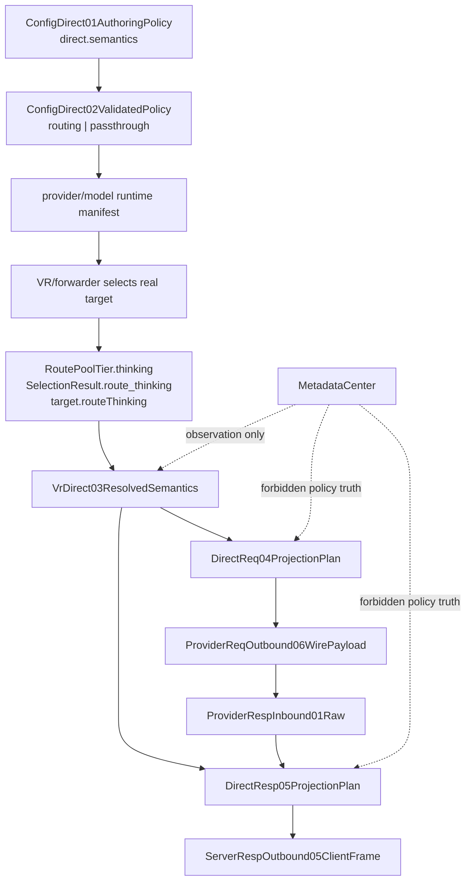

# Direct Semantic Classification Mainline

## Purpose

Review same-protocol direct 如何从显式 provider/model 配置得到通用语义分类，并由同一分类驱动 request/response projector。

Canonical sources:

- `docs/design/direct-semantic-classification.md`
- `docs/architecture/resource-operation-map.yml`
- `docs/architecture/function-map.yml`
- `docs/architecture/mainline-call-map.yml`
- `docs/goals/direct-semantic-classification-test-design.md`

## Flow

## Classification Matrix

| Class | Request model | Request thinking | Response model/thinking |
| --- | --- | --- | --- |
| `routing` | set canonical provider model | set route thinking | restore client-visible model; preserve protocol response thinking |
| `passthrough` | preserve client field | preserve client field | preserve provider response |

Missing config means `routing`. `passthrough` requires explicit provider/model declaration.

## Layer Matrix

| Layer | Owns | Must not own |
| --- | --- | --- |
| Config compiler | enum validation, default materialization, deterministic provider profile manifest | request-scoped policy creation, runtime payload decisions |
| Forwarder | logical target to real provider selection | direct policy |
| Virtual Router | uniquely creates request-scoped resolved class/provenance after real target selection; carries top-level route tier `thinking` as `target.routeThinking` | request/response mutation; route thinking hidden in `routeParams` |
| HTTP server router-direct input | carry VR target `routeThinking` and `directSemantic` into native direct resolver | interpret routing/passthrough, synthesize policy, or derive thinking from `routeParams` |
| Request projector | closed request field plan | config lookup, provider-specific branching |
| Response projector | closed response field plan from same resolved contract | depend on request projector output; infer mode from `originalClientModel` or `payloadChanged` |
| Host | native call, stream IO, observation IO | semantic branching |

## Forbidden Shortcuts

- `routeParams.directPassthrough`
- provider-name prefix checks
- forwarder-level policy override
- `routeParams.thinking` as route thinking truth
- MetadataCenter policy recovery
- request and response independently resolving mode
- independent model/thinking/restore booleans
- unknown config silently treated as routing

## Current State

- Rust owner and `direct.semantic_policy` resource are locked.
- Mainline edges `dsc-01` through `dsc-04` are anchored to real Rust caller/callee symbols.
- Config validation, real-target classification, and paired request/response projection plans are implemented in Rust.
- Host only invokes native plans and performs payload/stream IO.
- Runtime completion still requires source builds, global install, managed restart, and same-entry live replay.
- Runtime residue gate locks `RoutePoolTier.thinking -> SelectionResult.route_thinking -> target.routeThinking -> VrDirect03ResolvedSemantics.route_thinking` and the HTTP server real-target projection (`target.routeThinking` and `target.directSemantic`) because missing this bridge makes module tests pass while live router-direct silently keeps client thinking.

## Review Checklist

- Config surface is one closed enum.
- Default remains routing.
- Passthrough is explicit.
- Forwarder resolves first.
- HTTP server forwards real-target route params, route thinking, and direct semantic without interpreting them.
- VR classifies without payload mutation.
- VR is the only writer of request-scoped `direct.semantic_policy`.
- Request and response consume same resolved contract.
- Response does not depend on request projector output.
- MetadataCenter remains observation-only.
- JSON/SSE plans are paired.
- Unknown config fails.
- Relay/non-direct path remains isolated.
