<!-- AUTO-GENERATED: do not edit by hand. Rebuild with `node scripts/architecture/render-architecture-wiki-pages.mjs`. -->
# Error Mainline Call Graph

Source of truth:
- `docs/architecture/mainline-call-map.yml` defines adjacent edges for this chain
- `docs/architecture/function-map.yml` enriches owner summary and owner module context

Render rules:
- This page is a filtered render artifact, not a second architecture truth source.
- `anchored` = verified caller/callee binding
- `partial` = edge is bound, but only part of the transition is concretely anchored
- `binding pending` = edge intentionally left unresolved until code audit pins the real bridge

## error.mainline

Provider/runtime/direct failures enter unified ErrorErr chain and only then project to client-visible error.

Entry contract: `ErrorErr01SourceRaised` via `docs/design/pipeline-type-topology-and-module-boundaries.md`

```mermaid
flowchart LR
  ErrorErr06ClientProjected["ErrorErr06ClientProjected"]
  ErrorErr05ExecutionDecision["ErrorErr05ExecutionDecision"]
  ErrorErr03RuntimeClassified["ErrorErr03RuntimeClassified"]
  ErrorErr02HostCaptured["ErrorErr02HostCaptured"]
  ErrorErr01SourceRaised["ErrorErr01SourceRaised"]
  ErrorErr01SourceRaised -->|err-01| ErrorErr02HostCaptured
  ErrorErr02HostCaptured -->|err-02| ErrorErr03RuntimeClassified
  ErrorErr03RuntimeClassified -.->|err-03| ErrorErr05ExecutionDecision
  ErrorErr05ExecutionDecision -->|err-04| ErrorErr06ClientProjected
  classDef anchored fill:#edf7ed,stroke:#2e7d32,stroke-width:1px,color:#1b1f23;
  classDef partial fill:#fff7e6,stroke:#b26a00,stroke-width:1px,color:#1b1f23;
  classDef pending fill:#f4f4f5,stroke:#6b7280,stroke-width:1px,stroke-dasharray: 5 5,color:#1b1f23;
  class ErrorErr01SourceRaised anchored;
  class ErrorErr02HostCaptured anchored;
  class ErrorErr03RuntimeClassified partial;
  class ErrorErr05ExecutionDecision partial;
  class ErrorErr06ClientProjected anchored;
```

| step | transition | status | caller -> callee | split binding | owner |
| --- | --- | --- | --- | --- | --- |
| err-01 | `ErrorErr01SourceRaised -> ErrorErr02HostCaptured` | anchored | `reportProviderErrorToRouterPolicy -> reportProviderErrorToRouterPolicy` |  | `error.pipeline_contract` ErrorErr01-06 provider/runtime error chain contract and architecture gate |
| err-02 | `ErrorErr02HostCaptured -> ErrorErr03RuntimeClassified` | anchored | `classifyProviderFailure -> classifyProviderFailure` |  | `error.provider_failure_policy` provider error cataloging, runtime classification, router policy application, client-disconnect and upstream-stream-incomplete routing |
| err-03 | `ErrorErr03RuntimeClassified -> ErrorErr05ExecutionDecision` | partial | `resolveProviderRetryExecutionPlan -> consume_error_err_05_execution_decision_from_error_err_04_router_policy` |  | `error.execution_decision_consumer` Request/direct executor consumption of ErrorErr04 router policy into ErrorErr05 execution decisions, including primary_exhausted and upstream_stream_incomplete reroute |
| err-04 | `ErrorErr05ExecutionDecision -> ErrorErr06ClientProjected` | anchored | `project_error_err_06_client_from_error_err_05_execution_decision -> mapErrorToHttp` |  | `error.client_projection` ErrorErr06 client-visible HTTP/SSE error projection, including started-stream incomplete SSE error frames |
