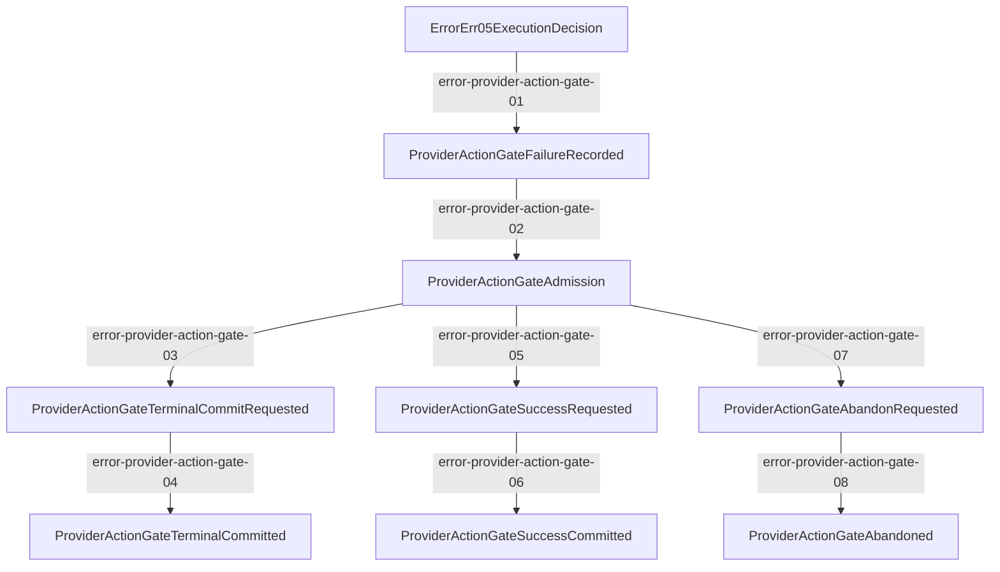

# V2 Provider Action Gate

Canonical lifecycle: `error.provider_action_gate.mainline`.

The RequestExecutor records the Rust-owned lane before waiting. A nonterminal Error05
returns after one admitted generation. A `project_terminal` Error05 carries the same
lane key and admitted generation through `commitProviderActionTerminalNative`; Rust
atomically compares the generation and advances the lane group to sustained mode.

An admitted generation has no wall-clock lease. Rust binds it to
`lane_group_key + generation + action_scope_key`; only the same logical request scope
may release it through provider success, provider failure, terminal commit, or
health-neutral abandon. The five-second value is the sustained spacing floor after an
outcome, never evidence that an in-flight action was cancelled.

This machine lifecycle stops at `ProviderActionGateTerminalCommitted`. Runtime does not
pass a commit witness into the client projector, so this map must not fabricate a
`TerminalCommitted -> ErrorErr06ClientProjected` call edge or a gate side-channel read.
The real client projection remains `error.mainline#err-05`:
`ErrorErr05ExecutionDecision -> ErrorErr06ClientProjected`, owned by
`error.client_projection`.

Machine locks:

- The eight required step IDs are exact and may not be deleted, duplicated, or renamed.
- Every declared caller and callee symbol exists in its declared source file.
- Every caller function body contains an invocation of its declared callee.
- Mainline map and lifecycle manifest endpoints, status, owner, symbols, and source
  files remain identical.
- Function, resource, and verification maps bind this lifecycle and its dedicated
  verifier/red-fixture gates.
- Red fixtures lock explicit ownership, action-scope comparison, FIFO tickets, abort
  listener cleanup, and the full five-second sustained floor after failure or abandon.
- Error06 projection remains owned only by `error.client_projection`; the provider
  action gate owns admission and atomic commit, not client payload shape or a synthetic
  commit witness.
