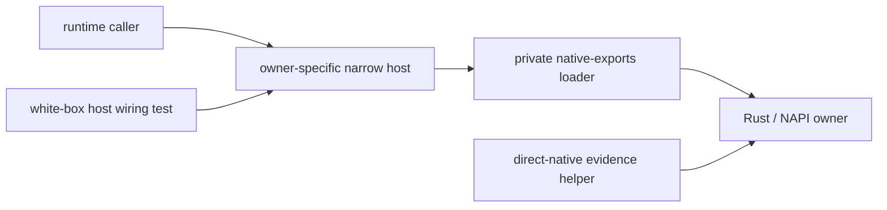

# Hub Pipeline Rust Reference Closeout

## Purpose

This page is the review surface for the first Hub Pipeline Rust residual reference convergence pass.
It tracks how broad `native-exports`, aggregate host, retired TS stage bridge, old helper wrapper, and direct-native helper references are classified before runtime refactor work.

## Main Rule

Broad `native-exports.ts` is a private loader and forbidden legacy owner surface.
It must not be described as the Hub Pipeline semantic owner.
Runtime callers must use owner-specific narrow hosts or Rust-owned adjacent contracts.
Pure Rust/NAPI black-box evidence may use direct-native helpers under test/script helper directories only.

## Reference Flow

## Classification Matrix

| Surface | Status | Owner rule | Gate expectation |
| --- | --- | --- | --- |
| Runtime import of broad `native-exports.ts` | forbidden | runtime must call owner-specific narrow host | `verify:hub-pipeline-native-reference-gate` fails |
| Narrow host import of `./native-exports.js` | allowed | host is IO/native-call shell only | gate allows `*-host.ts` |
| White-box mock of broad native surface | forbidden for monitored Hub Pipeline tests | mock owner-specific host | gate fails selected test files |
| Direct-native helper under tests/scripts | allowed for evidence only | helper calls Rust/NAPI truth | runtime import ban protects boundary |
| Doc owner surface naming broad native owner | forbidden | docs must say private loader/forbidden legacy if mentioned | gate fails stale owner wording |
| Rust `hub_pipeline_` symbol/module | allowed | Rust is semantic truth | inventory classifies as legitimate |

## Root Host Thin-Wrapper Gate

`verify:architecture-thin-wrapper-only` scans the root Hub host surface, not only the retired sharedmodule TS directories:

- `src/modules/llmswitch/bridge/**`
- `src/server/runtime/http-server/executor-pipeline.ts`
- `src/server/runtime/http-server/request-executor.ts`
- `src/server/runtime/http-server/executor/provider-response-converter.ts`
- `src/server/runtime/http-server/executor/request-executor-provider-*.ts`
- `src/server/handlers/responses-handler.ts`

The gate fails when `rootHostCheckedFiles` is zero. Allowed host work is limited to NAPI/JSON boundaries, Node IO, HTTP/SSE/stream transport, logging/diagnostics, MetadataCenter transport, and exact Rust effect execution.
The paired red fixtures reject handler/request-bridge continuation writers, TS ErrorErr classification, flat metadata protocol/exclusion fallback, semantic payload fallback, malformed native-plan downgrade, broad native facade imports, and deleted wrapper revival.

## Owner Matrix

| Feature | Owner surface | Current action |
| --- | --- | --- |
| `hub.runtime_ingress_bridge` | Rust `hub_pipeline_engine::registry` plus `routing-native-host.ts` | active claim avoided; gate documents target seam |
| `hub.request_stage_pipeline_bridge` | Rust NAPI plus test-only request-stage direct-native helper | retired shell stays forbidden |
| `hub.response_post_servertool_client_projection` | Rust `effect_plan.rs` plus `provider-response-converter-host.ts` | gate protects host/direct-native boundary |
| `hub.pipeline_rust_residual_reference_closeout` | architecture gate, inventory, and review surface | first safe slice; no runtime behavior change |

## Active Claim Boundary

This review surface does not authorize editing active-claim files.
If a residual is owned by another active claim, write handoff or merge-queue evidence instead of changing the file.

## Review Findings

hub-rust-ref-gap-01: Current inventory has runtime/source, test, doc/map/wiki, gate/script, and memory/history references; raw grep output is not a closeout artifact until classified by owner.

hub-rust-ref-gap-02: Several broad native references are legitimate private-loader or forbidden-path assertions; the gate must distinguish those from runtime callers and stale owner wording.

hub-rust-ref-gap-03: Runtime refactor is not started by this slice. This page only closes the first gate/doc/test-design convergence layer.

hub-rust-ref-gap-04: The former thin-wrapper gate passed with `checked files: 0`; the root host scan and zero-count failure now close that evidence gap at source-gate level.

## Verification

- `npm run verify:hub-pipeline-native-reference-gate`
- `npm run test:hub-pipeline-native-reference-gate-red-fixtures`
- `npm run verify:architecture-thin-wrapper-only`
- `npm run test:architecture-thin-wrapper-only-red-fixtures`
- `npm run verify:function-map-compile-gate`
- `npm run verify:architecture-wiki-sync`
- `npm run verify:architecture-wiki-html-sync`
