# Internal Error Numbering Mainline Source

## Purpose

This page is the review surface for `debug.internal_error_numbering`.

It locks RouteCodex-owned internal debug error numbering:

- internal request errors use `500-1xx`,
- internal response errors use `500-2xx`,
- other RouteCodex internal errors use `500-3xx`,
- external/provider/upstream/client errors stay external and may only be linked.

Canonical sources:

- `docs/goals/internal-error-numbering-debug-system-plan.md`
- `docs/architecture/function-map.yml` -> `feature_id: debug.internal_error_numbering`
- `docs/architecture/verification-map.yml` -> `feature_id: debug.internal_error_numbering`
- `docs/architecture/mainline-call-map.yml` -> `chain_id: internal_error_numbering.mainline`
- `docs/architecture/mainline-manifests/internal-error-numbering.mainline.yml`

## Main Rule

Internal `500-*` codes are debug side-channel identity only. They do not replace `ErrorErr01-06`, do not decide retry/reroute/fail, and do not change `ErrorErr06ClientProjected`.

External errors are linked, not wrapped. Provider `401/403/429/5xx`, upstream SSE/JSON errors, and client disconnect must not become `InternalDebugErrorEnvelope`.

Rule token: external errors are linked, not wrapped.

## Numbering Contract

| range | lane | meaning |
| --- | --- | --- |
| `500-100` to `500-199` | request | RouteCodex-owned request pipeline internal failures |
| `500-200` to `500-299` | response | RouteCodex-owned response pipeline internal failures |
| `500-300` to `500-399` | other | debug, metadata, runtime lifecycle, config, servertool, or gate internal failures |

## Internal Error Numbering Mainline

```mermaid
flowchart LR
  IntErrNum01SourceObserved["IntErrNum01SourceObserved<br/>internal failure source observed"]
  IntErrNum02ModuleBlockResolved["IntErrNum02ModuleBlockResolved<br/>module block resolved from registry"]
  IntErrNum03SubcodeAssigned["IntErrNum03SubcodeAssigned<br/>subcode assigned and validated"]
  IntErrNum04EnvelopeBuilt["IntErrNum04EnvelopeBuilt<br/>InternalDebugErrorEnvelope built"]
  IntErrNum05DebugArtifactProjected["IntErrNum05DebugArtifactProjected<br/>debug artifact projection"]
  IntErrNum06ExternalLinked["IntErrNum06ExternalLinked<br/>external error linked only"]
  IntErrNum07ClientBoundaryPreserved["IntErrNum07ClientBoundaryPreserved<br/>client/provider payload boundary preserved"]

  IntErrNum01SourceObserved -->|ien-01| IntErrNum02ModuleBlockResolved
  IntErrNum02ModuleBlockResolved -->|ien-02| IntErrNum03SubcodeAssigned
  IntErrNum03SubcodeAssigned -->|ien-03| IntErrNum04EnvelopeBuilt
  IntErrNum04EnvelopeBuilt -->|ien-04| IntErrNum05DebugArtifactProjected
  IntErrNum05DebugArtifactProjected -->|ien-05| IntErrNum06ExternalLinked
  IntErrNum06ExternalLinked -->|ien-06| IntErrNum07ClientBoundaryPreserved
```

## Node Contract

| node | input | output | owner | boundary |
| --- | --- | --- | --- | --- |
| `IntErrNum01SourceObserved` | RouteCodex-owned failure origin plus requested code | observed internal source | `src/debug/internal-error/envelope.ts` | must not classify external provider status as internal |
| `IntErrNum02ModuleBlockResolved` | internal code | registry module block | `src/debug/internal-error/registry.ts` | no message/path inference |
| `IntErrNum03SubcodeAssigned` | module block plus code | validated registry entry | `src/debug/internal-error/registry.ts` | duplicate or retired code fails |
| `IntErrNum04EnvelopeBuilt` | registry entry plus context | `InternalDebugErrorEnvelope` | `src/debug/internal-error/envelope.ts` | side-channel only |
| `IntErrNum05DebugArtifactProjected` | envelope | debug artifact projection | `src/debug/internal-error/projection.ts` | no retry/reroute/fallback effect |
| `IntErrNum06ExternalLinked` | optional external relation | `ExternalErrorLink` | `src/debug/internal-error/external-link.ts` | external identity remains external |
| `IntErrNum07ClientBoundaryPreserved` | internal artifact projection | payload boundary proof | `src/debug/internal-error/guards.ts` | no provider wire or default client body leak |

## Extension Checklist

Adding a new internal error code requires:

- registry entry in `src/debug/internal-error/registry.ts`,
- node ID from topology/mainline artifacts,
- owner feature that exists in `docs/architecture/function-map.yml`,
- focused positive test for envelope construction,
- reverse test for invalid range/duplicate/wrong external policy,
- leak test if the related path touches provider wire or client response,
- `npm run verify:internal-error-numbering` PASS.

## Review Checklist

- Does the code belong to `500-1xx`, `500-2xx`, or `500-3xx` by topology position?
- Is the owner feature queryable in function-map and verification-map?
- Is external provider/upstream/client identity linked rather than wrapped?
- Is `ErrorErr01-06` still policy truth?
- Does default client response payload avoid `internalCode`?
- Does provider wire payload avoid `internalCode`?
