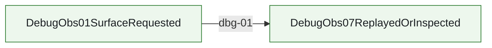
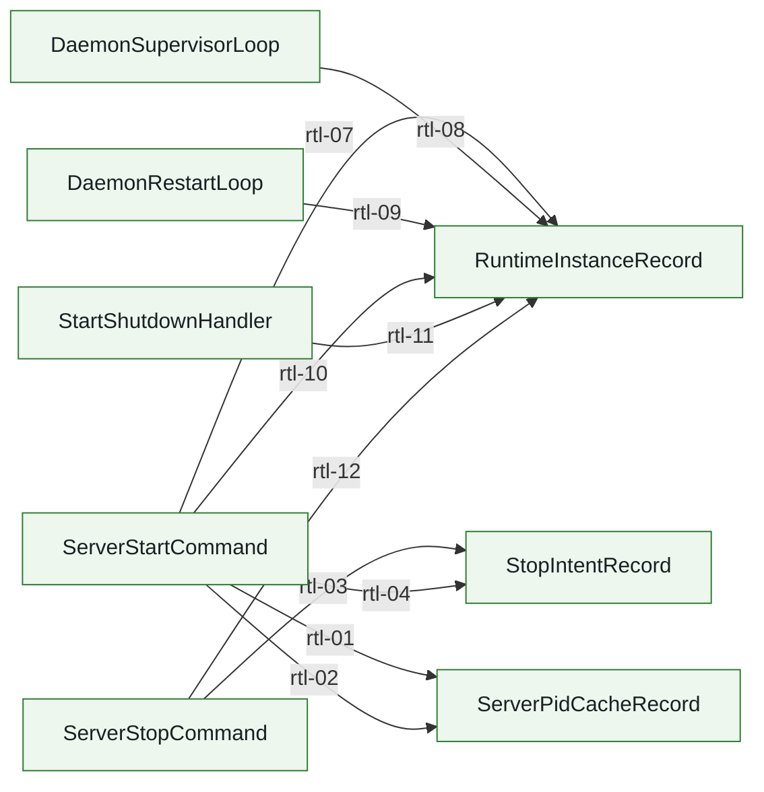
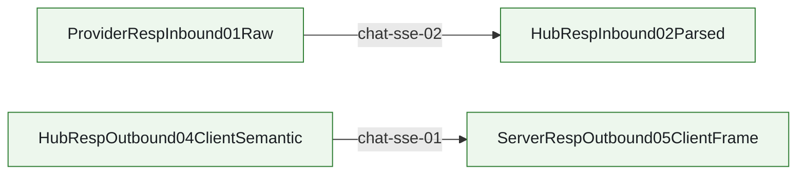

<!-- AUTO-GENERATED: do not edit by hand. Rebuild with `npm run render:architecture-mainline-mermaid`. -->
# Mainline Call Graph

Source of truth:
- `docs/architecture/mainline-call-map.yml` defines request/response/error edges
- `docs/architecture/function-map.yml` enriches owner summary and owner module context

Render rules:
- Mermaid page is a render artifact, not a second architecture truth source.
- `anchored` = verified caller/callee binding
- `partial` = edge is bound, but only part of the transition is concretely anchored
- `binding pending` = edge intentionally left unresolved until code audit pins the real bridge

## servertool.hook_skeleton.mainline

Servertool standard hook skeleton: CLI remains the business execution lifecycle, while request/result injection, response interception, schema validation, hook response injection, followup/reenter effect planning, and finalization are governed by Rust-owned required/optional hooks.

Entry contract: `HubRespChatProcess03Governed` via `docs/architecture/wiki/servertool-hook-skeleton-mainline-source.md`

```mermaid
flowchart LR
  HubReqChatProcess03Governed["HubReqChatProcess03Governed"]
  ServertoolReqHook04RequestFinalized["ServertoolReqHook04RequestFinalized"]
  ServertoolReqHook03ToolInjected["ServertoolReqHook03ToolInjected"]
  ServertoolReqHook02TextRewritten["ServertoolReqHook02TextRewritten"]
  ServertoolReqHook01ResultParsed["ServertoolReqHook01ResultParsed"]
  HubReqInbound02Standardized["HubReqInbound02Standardized"]
  ServertoolCli04ClientExecuted["ServertoolCli04ClientExecuted"]
  HubRespOutbound04ClientSemantic["HubRespOutbound04ClientSemantic"]
  ServertoolRespHook06ProjectionFinalized["ServertoolRespHook06ProjectionFinalized"]
  ServertoolRespHook05ReenterDispatched["ServertoolRespHook05ReenterDispatched"]
  ServertoolRespHook04FollowupPlanned["ServertoolRespHook04FollowupPlanned"]
  ServertoolRespHook03HookResponseInjected["ServertoolRespHook03HookResponseInjected"]
  ServertoolRespHook02SchemaValidated["ServertoolRespHook02SchemaValidated"]
  ServertoolRespHook01Intercepted["ServertoolRespHook01Intercepted"]
  HubRespChatProcess03Governed["HubRespChatProcess03Governed"]
  HubRespChatProcess03Governed -->|sth-resp-01| ServertoolRespHook01Intercepted
  ServertoolRespHook01Intercepted -->|sth-resp-02| ServertoolRespHook02SchemaValidated
  ServertoolRespHook02SchemaValidated -->|sth-resp-03| ServertoolRespHook03HookResponseInjected
  ServertoolRespHook03HookResponseInjected -->|sth-resp-04| ServertoolRespHook04FollowupPlanned
  ServertoolRespHook04FollowupPlanned -->|sth-resp-05| ServertoolRespHook05ReenterDispatched
  ServertoolRespHook05ReenterDispatched -->|sth-resp-06| ServertoolRespHook06ProjectionFinalized
  ServertoolRespHook06ProjectionFinalized -->|sth-resp-07| HubRespOutbound04ClientSemantic
  ServertoolRespHook03HookResponseInjected -->|sth-cli-01| ServertoolCli04ClientExecuted
  HubReqInbound02Standardized -->|sth-req-01| ServertoolReqHook01ResultParsed
  ServertoolReqHook01ResultParsed -->|sth-req-02| ServertoolReqHook02TextRewritten
  ServertoolReqHook02TextRewritten -->|sth-req-03| ServertoolReqHook03ToolInjected
  ServertoolReqHook03ToolInjected -->|sth-req-04| ServertoolReqHook04RequestFinalized
  ServertoolReqHook04RequestFinalized -->|sth-req-05| HubReqChatProcess03Governed
  classDef anchored fill:#edf7ed,stroke:#2e7d32,stroke-width:1px,color:#1b1f23;
  classDef partial fill:#fff7e6,stroke:#b26a00,stroke-width:1px,color:#1b1f23;
  classDef pending fill:#f4f4f5,stroke:#6b7280,stroke-width:1px,stroke-dasharray: 5 5,color:#1b1f23;
  class HubRespChatProcess03Governed pending;
  class ServertoolRespHook01Intercepted pending;
  class ServertoolRespHook02SchemaValidated pending;
  class ServertoolRespHook03HookResponseInjected pending;
  class ServertoolRespHook04FollowupPlanned pending;
  class ServertoolRespHook05ReenterDispatched pending;
  class ServertoolRespHook06ProjectionFinalized pending;
  class HubRespOutbound04ClientSemantic pending;
  class ServertoolCli04ClientExecuted pending;
  class HubReqInbound02Standardized pending;
  class ServertoolReqHook01ResultParsed pending;
  class ServertoolReqHook02TextRewritten pending;
  class ServertoolReqHook03ToolInjected pending;
  class ServertoolReqHook04RequestFinalized pending;
  class HubReqChatProcess03Governed anchored;
```

| step | transition | status | caller -> callee | split binding | owner |
| --- | --- | --- | --- | --- | --- |
| sth-resp-01 | `HubRespChatProcess03Governed -> ServertoolRespHook01Intercepted` | binding pending | `binding pending` |  | `binding pending` |
| sth-resp-02 | `ServertoolRespHook01Intercepted -> ServertoolRespHook02SchemaValidated` | binding pending | `binding pending` |  | `binding pending` |
| sth-resp-03 | `ServertoolRespHook02SchemaValidated -> ServertoolRespHook03HookResponseInjected` | binding pending | `binding pending` |  | `binding pending` |
| sth-resp-04 | `ServertoolRespHook03HookResponseInjected -> ServertoolRespHook04FollowupPlanned` | binding pending | `binding pending` |  | `binding pending` |
| sth-resp-05 | `ServertoolRespHook04FollowupPlanned -> ServertoolRespHook05ReenterDispatched` | binding pending | `binding pending` |  | `binding pending` |
| sth-resp-06 | `ServertoolRespHook05ReenterDispatched -> ServertoolRespHook06ProjectionFinalized` | binding pending | `binding pending` |  | `binding pending` |
| sth-resp-07 | `ServertoolRespHook06ProjectionFinalized -> HubRespOutbound04ClientSemantic` | binding pending | `binding pending` |  | `binding pending` |
| sth-cli-01 | `ServertoolRespHook03HookResponseInjected -> ServertoolCli04ClientExecuted` | binding pending | `binding pending` |  | `binding pending` |
| sth-req-01 | `HubReqInbound02Standardized -> ServertoolReqHook01ResultParsed` | binding pending | `binding pending` |  | `binding pending` |
| sth-req-02 | `ServertoolReqHook01ResultParsed -> ServertoolReqHook02TextRewritten` | binding pending | `binding pending` |  | `binding pending` |
| sth-req-03 | `ServertoolReqHook02TextRewritten -> ServertoolReqHook03ToolInjected` | binding pending | `binding pending` |  | `binding pending` |
| sth-req-04 | `ServertoolReqHook03ToolInjected -> ServertoolReqHook04RequestFinalized` | binding pending | `binding pending` |  | `binding pending` |
| sth-req-05 | `ServertoolReqHook04RequestFinalized -> HubReqChatProcess03Governed` | anchored | `apply_hub_req_chatprocess_03_tool_governance -> run_hub_req_chatprocess_03_governed_entrypoint` |  | `hub.req_chatprocess_governance` Rust req_chatprocess owner governs request-side tool semantics before the request re-enters the normal Hub mainline |

## request.mainline

HTTP request enters host, standardizes in Hub, routes via VR, exits through provider wire build.

Entry contract: `ServerReqInbound01ClientRaw` via `docs/design/pipeline-type-topology-and-module-boundaries.md`

| step | transition | status | caller -> callee | split binding | owner |
| --- | --- | --- | --- | --- | --- |
| req-00 | `ServerReqInbound01ClientRaw -> HubReqInbound02Standardized` | anchored | `prepareResponsesHandlerEntryForHttp -> planResponsesHandlerEntry` |  | `server.responses_request_handler_bridge_surface` /v1/responses request handler uses one opaque request facade only; protocol semantics stay in Hub Pipeline/native owner |
| req-01 | `ServerReqInbound01ClientRaw -> HubReqInbound02Standardized` | anchored | `buildResponsesRequestContextForHttp -> captureReqInboundResponsesContextSnapshotJson` |  | `hub.req_inbound_responses_context_capture` Rust req_inbound owner captures and normalizes relay `/v1/responses` request context before any TS bridge reuse |
| req-02 | `HubReqInbound02Standardized -> HubReqChatProcess03Governed` | anchored | `captureReqInboundResponsesContextSnapshot -> captureReqInboundResponsesContextSnapshotWithNative` |  | `hub.req_inbound_responses_context_capture` Rust req_inbound owner captures and normalizes relay `/v1/responses` request context before any TS bridge reuse |
| req-03 | `HubReqChatProcess03Governed -> VrRoute04SelectedTarget` | anchored | `execute -> run_vr_route_04_selected_target_entrypoint` |  | `hub.route_selection_bridge` Hub req-03 Rust bridge that seals virtual-router decisions into `VrRoute04SelectedTarget` |
| req-04 | `VrRoute04SelectedTarget -> HubReqOutbound05ProviderSemantic` | anchored | `execute -> run_hub_req_outbound_05_provider_semantic_entrypoint` |  | `hub.req_outbound_provider_semantic` Hub req-04 Rust bridge that applies `VrRoute04SelectedTarget` to `HubReqOutbound05ProviderSemantic` |
| req-05 | `HubReqOutbound05ProviderSemantic -> ProviderReqOutbound06WirePayload` | partial | `runReqOutboundStage3CompatWithNative -> run_req_outbound_stage3_compat_json` |  | `responses.request_compat_normalization` Responses request compat normalization for c4m/crs profiles must be owned by Rust req_outbound stage3 compat only |

## response.mainline

Provider response enters Hub, gets governed, then projects to client protocol and server frame.

Entry contract: `ProviderRespInbound01Raw` via `docs/design/pipeline-type-topology-and-module-boundaries.md`

| step | transition | status | caller -> callee | split binding | owner |
| --- | --- | --- | --- | --- | --- |
| resp-01 | `ProviderRespInbound01Raw -> HubRespInbound02Parsed` | anchored | `run_hub_resp_inbound_02_parsed_entrypoint -> parse_hub_resp_inbound_02_from_provider_resp_inbound_01` |  | `hub.response_provider_sse_materialization` Provider response SSE marker/bodyText materialization before Rust Hub response pipeline entry |
| resp-02 | `HubRespInbound02Parsed -> HubRespChatProcess03Governed` | anchored | `run_hub_resp_chatprocess_03_governed_entrypoint -> build_hub_resp_chatprocess_03_from_hub_resp_inbound_02` |  | `hub.response_responses_chat_projection` OpenAI Responses provider payload to OpenAI Chat client semantic projection, including bridge response actions and Responses retention carriers |
| resp-03 | `HubRespChatProcess03Governed -> HubRespOutbound04ClientSemantic` | anchored | `prepareResponsesJsonClientDispatchPlanForHttp -> projectResponsesClientPayloadForClientNative` |  | `hub.response_responses_client_projection` OpenAI Responses client-visible payload projection for JSON body and SSE frames after HubRespChatProcess03Governed normalization, including apply_patch freeform custom tool output plus client-visible model/reasoning restore |
| resp-04 | `HubRespOutbound04ClientSemantic -> ServerRespOutbound05ClientFrame` | anchored | `sendPipelineResponse -> sendSsePipelineResponse` |  | `server.responses_response_handler_bridge_surface` /v1/responses response bridge is an opaque response projection/conversation facade; continuation save truth lives in core Chat Process closeout |

## responses.continuation.mainline

Responses continuation mainline is a Chat Process boundary block: request-side Responses restore runs after HubReqInbound02Standardized and before HubReqChatProcess03Governed; response-side save runs after HubRespChatProcess03Governed and before HubRespOutbound04ClientSemantic; SSE remains transport-only after semantic finalization.

Entry contract: `ChatProcReqContinuation01EntryEvidence` via `docs/architecture/wiki/responses-continuation-mainline-source.md`

| step | transition | status | caller -> callee | split binding | owner |
| --- | --- | --- | --- | --- | --- |
| rct-01 | `ChatProcReqContinuation01EntryEvidence -> ChatProcReqContinuation02OwnerResolved` | partial | `prepareResponsesHandlerEntryForHttp -> planResponsesHandlerEntry` |  | `hub.chat_process_responses_continuation` /v1/responses continuation save/restore is a Chat Process boundary block, not a handler/SSE concern |
| rct-02 | `ChatProcReqContinuation02OwnerResolved -> ChatProcReqContinuation03CanonicalRestored` | partial | `buildResponsesRequestContextForHttp -> captureReqInboundResponsesContextSnapshotJson` |  | `hub.chat_process_responses_continuation` /v1/responses continuation save/restore is a Chat Process boundary block, not a handler/SSE concern |
| rct-03 | `ChatProcReqContinuation03CanonicalRestored -> ChatProcReqContinuation04HookRestored` | anchored | `buildCapturedRelayResumeRequestContextForHttp -> captureReqInboundResponsesContextSnapshot` |  | `hub.chat_process_responses_continuation` /v1/responses continuation save/restore is a Chat Process boundary block, not a handler/SSE concern |
| rct-04 | `ChatProcReqContinuation04HookRestored -> ChatProcReqContinuation05Governed` | anchored | `captureReqInboundResponsesContextSnapshot -> captureReqInboundResponsesContextSnapshotWithNative` |  | `hub.chat_process_responses_continuation` /v1/responses continuation save/restore is a Chat Process boundary block, not a handler/SSE concern |
| rct-05 | `ChatProcReqContinuation05Governed -> ChatProcRespContinuation06ResponseGoverned` | partial | `prepareResponsesJsonClientDispatchPlanForHttp -> projectResponsesClientPayloadForClientNative` |  | `hub.chat_process_responses_continuation` /v1/responses continuation save/restore is a Chat Process boundary block, not a handler/SSE concern |
| rct-06 | `ChatProcRespContinuation06ResponseGoverned -> ChatProcRespContinuation07CanonicalSaved` | anchored | `convertProviderResponse -> recordResponsesResponse` |  | `hub.chat_process_responses_continuation` /v1/responses continuation save/restore is a Chat Process boundary block, not a handler/SSE concern |
| rct-07 | `ChatProcRespContinuation07CanonicalSaved -> ChatProcRespContinuation08Released` | anchored | `releaseMetadataCenterForHttpResponse -> releaseMetadataCenterForHttpResponse` |  | `hub.chat_process_responses_continuation` /v1/responses continuation save/restore is a Chat Process boundary block, not a handler/SSE concern |

## debug.unified_surface.mainline

Debug unified surface governance shell for diag artifacts, snapshots, logger rendering, harness/replay, and policy observation.

Entry contract: `DebugObs01SurfaceRequested` via `docs/architecture/wiki/debug-unified-surface-mainline-source.md`

| step | transition | status | caller -> callee | split binding | owner |
| --- | --- | --- | --- | --- | --- |
| dbg-01 | `DebugObs01SurfaceRequested -> DebugObs07ReplayedOrInspected` | anchored | `createDebugToolkit -> createDebugToolkit` |  | `debug.unified_surface` debug/diag/snapshot/logger/harness/replay/policy migration must converge on one queryable authoring surface under src/debug with per-module closeout and explicit diagnostics taxonomy |

## internal_error_numbering.mainline

RouteCodex-owned internal debug errors are assigned stable `500-1xx/2xx/3xx` codes, projected only to debug artifacts, linked to external errors without wrapping them, and guarded from default client/provider payload leakage.

Entry contract: `IntErrNum01SourceObserved` via `docs/architecture/wiki/internal-error-numbering-mainline-source.md`

```mermaid
flowchart LR
  IntErrNum07ClientBoundaryPreserved["IntErrNum07ClientBoundaryPreserved"]
  IntErrNum06ExternalLinked["IntErrNum06ExternalLinked"]
  IntErrNum05DebugArtifactProjected["IntErrNum05DebugArtifactProjected"]
  IntErrNum04EnvelopeBuilt["IntErrNum04EnvelopeBuilt"]
  IntErrNum03SubcodeAssigned["IntErrNum03SubcodeAssigned"]
  IntErrNum02ModuleBlockResolved["IntErrNum02ModuleBlockResolved"]
  IntErrNum01SourceObserved["IntErrNum01SourceObserved"]
  IntErrNum01SourceObserved -->|ien-01| IntErrNum02ModuleBlockResolved
  IntErrNum02ModuleBlockResolved -->|ien-02| IntErrNum03SubcodeAssigned
  IntErrNum03SubcodeAssigned -->|ien-03| IntErrNum04EnvelopeBuilt
  IntErrNum04EnvelopeBuilt -->|ien-04| IntErrNum05DebugArtifactProjected
  IntErrNum05DebugArtifactProjected -->|ien-05| IntErrNum06ExternalLinked
  IntErrNum06ExternalLinked -->|ien-06| IntErrNum07ClientBoundaryPreserved
  classDef anchored fill:#edf7ed,stroke:#2e7d32,stroke-width:1px,color:#1b1f23;
  classDef partial fill:#fff7e6,stroke:#b26a00,stroke-width:1px,color:#1b1f23;
  classDef pending fill:#f4f4f5,stroke:#6b7280,stroke-width:1px,stroke-dasharray: 5 5,color:#1b1f23;
  class IntErrNum01SourceObserved anchored;
  class IntErrNum02ModuleBlockResolved anchored;
  class IntErrNum03SubcodeAssigned anchored;
  class IntErrNum04EnvelopeBuilt anchored;
  class IntErrNum05DebugArtifactProjected anchored;
  class IntErrNum06ExternalLinked anchored;
  class IntErrNum07ClientBoundaryPreserved anchored;
```

| step | transition | status | caller -> callee | split binding | owner |
| --- | --- | --- | --- | --- | --- |
| ien-01 | `IntErrNum01SourceObserved -> IntErrNum02ModuleBlockResolved` | anchored | `observeInternalDebugErrorSource -> resolveInternalDebugErrorModuleBlock` |  | `debug.internal_error_numbering` Internal debug error numbering registry and envelope construction for RouteCodex-owned `500-1xx/2xx/3xx` side-channel errors, with external errors linked but never wrapped |
| ien-02 | `IntErrNum02ModuleBlockResolved -> IntErrNum03SubcodeAssigned` | anchored | `resolveInternalDebugErrorModuleBlock -> assignInternalDebugErrorSubcode` |  | `debug.internal_error_numbering` Internal debug error numbering registry and envelope construction for RouteCodex-owned `500-1xx/2xx/3xx` side-channel errors, with external errors linked but never wrapped |
| ien-03 | `IntErrNum03SubcodeAssigned -> IntErrNum04EnvelopeBuilt` | anchored | `assignInternalDebugErrorSubcode -> buildInternalDebugErrorEnvelope` |  | `debug.internal_error_numbering` Internal debug error numbering registry and envelope construction for RouteCodex-owned `500-1xx/2xx/3xx` side-channel errors, with external errors linked but never wrapped |
| ien-04 | `IntErrNum04EnvelopeBuilt -> IntErrNum05DebugArtifactProjected` | anchored | `buildInternalDebugErrorEnvelope -> projectInternalDebugErrorToDebugArtifact` |  | `debug.internal_error_numbering` Internal debug error numbering registry and envelope construction for RouteCodex-owned `500-1xx/2xx/3xx` side-channel errors, with external errors linked but never wrapped |
| ien-05 | `IntErrNum05DebugArtifactProjected -> IntErrNum06ExternalLinked` | anchored | `projectInternalDebugErrorToDebugArtifact -> linkExternalError` |  | `debug.internal_error_numbering` Internal debug error numbering registry and envelope construction for RouteCodex-owned `500-1xx/2xx/3xx` side-channel errors, with external errors linked but never wrapped |
| ien-06 | `IntErrNum06ExternalLinked -> IntErrNum07ClientBoundaryPreserved` | anchored | `linkExternalError -> preserveInternalErrorClientBoundary` |  | `debug.internal_error_numbering` Internal debug error numbering registry and envelope construction for RouteCodex-owned `500-1xx/2xx/3xx` side-channel errors, with external errors linked but never wrapped |

## error.mainline

Provider/runtime/direct failures enter unified ErrorErr chain; provider availability/cooldown truth stays provider/server-scoped and must not be rewritten into session-storm truth before client projection.

Entry contract: `ErrorErr01SourceRaised` via `docs/design/pipeline-type-topology-and-module-boundaries.md`

```mermaid
flowchart LR
  ErrorErr06ClientProjected["ErrorErr06ClientProjected"]
  ErrorErr05ExecutionDecision["ErrorErr05ExecutionDecision"]
  ErrorErr03RuntimeClassified["ErrorErr03RuntimeClassified"]
  ErrorErr02HostCaptured["ErrorErr02HostCaptured"]
  ErrorErr01SourceRaised["ErrorErr01SourceRaised"]
  ErrorErr01SourceRaised -->|err-01| ErrorErr02HostCaptured
  ErrorErr02HostCaptured -->|err-02| ErrorErr03RuntimeClassified
  ErrorErr03RuntimeClassified -.->|err-03| ErrorErr05ExecutionDecision
  ErrorErr05ExecutionDecision -->|err-04| ErrorErr06ClientProjected
  classDef anchored fill:#edf7ed,stroke:#2e7d32,stroke-width:1px,color:#1b1f23;
  classDef partial fill:#fff7e6,stroke:#b26a00,stroke-width:1px,color:#1b1f23;
  classDef pending fill:#f4f4f5,stroke:#6b7280,stroke-width:1px,stroke-dasharray: 5 5,color:#1b1f23;
  class ErrorErr01SourceRaised anchored;
  class ErrorErr02HostCaptured anchored;
  class ErrorErr03RuntimeClassified partial;
  class ErrorErr05ExecutionDecision partial;
  class ErrorErr06ClientProjected anchored;
```

| step | transition | status | caller -> callee | split binding | owner |
| --- | --- | --- | --- | --- | --- |
| err-01 | `ErrorErr01SourceRaised -> ErrorErr02HostCaptured` | anchored | `reportProviderErrorToRouterPolicy -> reportProviderErrorToRouterPolicy` |  | `error.pipeline_contract` ErrorErr01-06 provider/runtime error chain contract and architecture gate |
| err-02 | `ErrorErr02HostCaptured -> ErrorErr03RuntimeClassified` | anchored | `classifyProviderFailure -> classifyProviderFailure` |  | `error.provider_failure_policy` provider/server error cataloging, runtime classification, router policy application, and availability/cooldown truth; session-local storm semantics are explicitly separate |
| err-03 | `ErrorErr03RuntimeClassified -> ErrorErr05ExecutionDecision` | partial | `resolveProviderRetryExecutionPlan -> resolveProviderRetryExecutionPlan` |  | `error.execution_decision_consumer` Request/direct executor consumption of ErrorErr04 router policy into ErrorErr05 execution decisions, including primary_exhausted and upstream_stream_incomplete reroute |
| err-04 | `ErrorErr05ExecutionDecision -> ErrorErr06ClientProjected` | anchored | `project_error_err_06_client_from_error_err_05_execution_decision -> mapErrorToHttp` |  | `error.client_projection` ErrorErr06 client-visible HTTP/SSE error projection, including started-stream incomplete SSE error frames |

## vr.route_availability.mainline

Virtual Router ordinary-route filtering, default-pool availability floor, and primary_exhausted planning remain Rust-owned; TS may only consume the floor/plan output and must not locally re-decide terminal no-provider.

Entry contract: `VrAvail01RouteCandidates` via `docs/architecture/wiki/virtual-router-route-availability-mainline-source.md`

```mermaid
flowchart LR
  ErrorErr05ExecutionDecision["ErrorErr05ExecutionDecision"]
  VrAvail04PrimaryExhaustedPlanned["VrAvail04PrimaryExhaustedPlanned"]
  VrAvail03DefaultFloorEvaluated["VrAvail03DefaultFloorEvaluated"]
  VrAvail02PoolFiltered["VrAvail02PoolFiltered"]
  VrAvail01RouteCandidates["VrAvail01RouteCandidates"]
  VrAvail01RouteCandidates -->|vra-01| VrAvail02PoolFiltered
  VrAvail02PoolFiltered -->|vra-02| VrAvail03DefaultFloorEvaluated
  VrAvail03DefaultFloorEvaluated -->|vra-03| VrAvail04PrimaryExhaustedPlanned
  VrAvail04PrimaryExhaustedPlanned -.->|vra-04| ErrorErr05ExecutionDecision
  classDef anchored fill:#edf7ed,stroke:#2e7d32,stroke-width:1px,color:#1b1f23;
  classDef partial fill:#fff7e6,stroke:#b26a00,stroke-width:1px,color:#1b1f23;
  classDef pending fill:#f4f4f5,stroke:#6b7280,stroke-width:1px,stroke-dasharray: 5 5,color:#1b1f23;
  class VrAvail01RouteCandidates anchored;
  class VrAvail02PoolFiltered anchored;
  class VrAvail03DefaultFloorEvaluated anchored;
  class VrAvail04PrimaryExhaustedPlanned partial;
  class ErrorErr05ExecutionDecision partial;
```

| step | transition | status | caller -> callee | split binding | owner |
| --- | --- | --- | --- | --- | --- |
| vra-01 | `VrAvail01RouteCandidates -> VrAvail02PoolFiltered` | anchored | `resolve_forwarder_candidate_for_pool -> select` |  | `vr.provider_forwarder_runtime` ProviderForwarder config load, capability filtering, internal target selection, startup cooldown truth, and runtime diagnostics stay in Rust Virtual Router |
| vra-02 | `VrAvail02PoolFiltered -> VrAvail03DefaultFloorEvaluated` | anchored | `build_provider_not_available_error -> evaluate_singleton_route_pool_exhaustion` |  | `vr.route_availability_floor` route selection must not silently collapse to empty after quota health and filters; default pool always keeps one last ordered choice |
| vra-03 | `VrAvail03DefaultFloorEvaluated -> VrAvail04PrimaryExhaustedPlanned` | anchored | `resolvePrimaryExhaustedPlan -> planPrimaryExhaustedToDefaultPoolNative` |  | `virtual_router.primary_exhausted_to_default_pool` primary tier exhausted to default-pool plan stays Rust-owned and host consumes plan only |
| vra-04 | `VrAvail04PrimaryExhaustedPlanned -> ErrorErr05ExecutionDecision` | partial | `executeRouterDirectPipelineForPort -> resolveDefaultTierAvailableForErrorErr05` |  | `error.execution_decision_consumer` Request/direct executor consumption of ErrorErr04 router policy into ErrorErr05 execution decisions, including primary_exhausted and upstream_stream_incomplete reroute |

## vr.online_diagnostics.mainline

Virtual Router online diagnostics: HTTP/CLI thin shells call Rust VR status/dry-run contracts; Rust alone expands routes, forwarders, default-floor state, and unavailable-provider explanations.

Entry contract: `VrDiag01StatusSnapshot` via `docs/goals/virtual-router-online-diagnostics-plan.md`

```mermaid
flowchart LR
  ServerRespOutbound05ClientFrame["ServerRespOutbound05ClientFrame"]
  VrDiag03DryRunDecision["VrDiag03DryRunDecision"]
  VrDiag02DryRunInput["VrDiag02DryRunInput"]
  VrDiag01StatusSnapshot["VrDiag01StatusSnapshot"]
  VrDiag01StatusSnapshot -->|vrd-01| VrDiag02DryRunInput
  VrDiag02DryRunInput -->|vrd-02| VrDiag03DryRunDecision
  VrDiag03DryRunDecision -->|vrd-03| ServerRespOutbound05ClientFrame
  classDef anchored fill:#edf7ed,stroke:#2e7d32,stroke-width:1px,color:#1b1f23;
  classDef partial fill:#fff7e6,stroke:#b26a00,stroke-width:1px,color:#1b1f23;
  classDef pending fill:#f4f4f5,stroke:#6b7280,stroke-width:1px,stroke-dasharray: 5 5,color:#1b1f23;
  class VrDiag01StatusSnapshot anchored;
  class VrDiag02DryRunInput anchored;
  class VrDiag03DryRunDecision anchored;
  class ServerRespOutbound05ClientFrame anchored;
```

| step | transition | status | caller -> callee | split binding | owner |
| --- | --- | --- | --- | --- | --- |
| vrd-01 | `VrDiag01StatusSnapshot -> VrDiag02DryRunInput` | anchored | `get_status -> diagnose_route` |  | `vr.online_diagnostics` Virtual Router online status and dry-run route diagnostics stay Rust-owned |
| vrd-02 | `VrDiag02DryRunInput -> VrDiag03DryRunDecision` | anchored | `diagnose_route -> route` |  | `vr.online_diagnostics` Virtual Router online status and dry-run route diagnostics stay Rust-owned |
| vrd-03 | `VrDiag03DryRunDecision -> ServerRespOutbound05ClientFrame` | anchored | `diagnoseRoute -> registerHttpRoutes` |  | `vr.online_diagnostics` Virtual Router online status and dry-run route diagnostics stay Rust-owned |

## runtime.lifecycle.mainline

Managed server lifecycle: `ROUTECODEX_SESSION_DIR` is only the runtime workdir root; pid cache writes on start, stop-intent writes on stop, and `tmuxSessionId` / request `sessionId` / `conversationId` stay separate namespaces rather than directory-derived identity.

Entry contract: `ServerPidCacheRecord` via `docs/design/server-runtime-lifecycle-ssot.md`

| step | transition | status | caller -> callee | split binding | owner |
| --- | --- | --- | --- | --- | --- |
| rtl-01 | `ServerStartCommand -> ServerPidCacheRecord` | anchored | `writeServerPidCache -> writeServerPidCache` |  | `runtime.lifecycle.pid_cache` server pid cache lives under <rccUserDir>/state/runtime-lifecycle/ports/<port>/pid.cache; pid is a transient cache, not the authoritative runtime state |
| rtl-02 | `ServerStartCommand -> ServerPidCacheRecord` | anchored | `writeServerPidCache -> writeServerPidCache` |  | `runtime.lifecycle.pid_cache` server pid cache lives under <rccUserDir>/state/runtime-lifecycle/ports/<port>/pid.cache; pid is a transient cache, not the authoritative runtime state |
| rtl-03 | `ServerStopCommand -> StopIntentRecord` | anchored | `writeDaemonStopIntent -> writeServerStopIntent` |  | `runtime.lifecycle.stop_intent` stop-intent is a cross-process signal under <rccUserDir>/state/runtime-lifecycle/ports/<port>/stop-intent.json; it must be reaped when older than TTL |
| rtl-04 | `ServerStartCommand -> StopIntentRecord` | anchored | `consumeDaemonStopIntent -> consumeServerStopIntent` |  | `runtime.lifecycle.stop_intent` stop-intent is a cross-process signal under <rccUserDir>/state/runtime-lifecycle/ports/<port>/stop-intent.json; it must be reaped when older than TTL |
| rtl-07 | `ServerStartCommand -> RuntimeInstanceRecord` | anchored | `writeRuntimeInstance -> writeRuntimeInstance` |  | `runtime.lifecycle.instance_registry` managed server instance declaration lives under <rccUserDir>/state/runtime-lifecycle/ports/<port>/instance.json |
| rtl-08 | `DaemonSupervisorLoop -> RuntimeInstanceRecord` | anchored | `writeRuntimeInstance -> writeRuntimeInstance` |  | `runtime.lifecycle.instance_registry` managed server instance declaration lives under <rccUserDir>/state/runtime-lifecycle/ports/<port>/instance.json |
| rtl-09 | `DaemonRestartLoop -> RuntimeInstanceRecord` | anchored | `writeRuntimeInstance -> writeRuntimeInstance` |  | `runtime.lifecycle.instance_registry` managed server instance declaration lives under <rccUserDir>/state/runtime-lifecycle/ports/<port>/instance.json |
| rtl-10 | `ServerStartCommand -> RuntimeInstanceRecord` | anchored | `updateRuntimeInstanceStatus -> updateRuntimeInstanceStatus` |  | `runtime.lifecycle.instance_registry` managed server instance declaration lives under <rccUserDir>/state/runtime-lifecycle/ports/<port>/instance.json |
| rtl-11 | `StartShutdownHandler -> RuntimeInstanceRecord` | anchored | `updateRuntimeInstanceStatus -> updateRuntimeInstanceStatus` |  | `runtime.lifecycle.instance_registry` managed server instance declaration lives under <rccUserDir>/state/runtime-lifecycle/ports/<port>/instance.json |
| rtl-12 | `ServerStopCommand -> RuntimeInstanceRecord` | anchored | `updateRuntimeInstanceStatus -> updateRuntimeInstanceStatus` |  | `runtime.lifecycle.instance_registry` managed server instance declaration lives under <rccUserDir>/state/runtime-lifecycle/ports/<port>/instance.json |

## stopless.session.mainline

Stopless three-round contract inside Chat Process boundary: every request first injects stop guidance plus internal reasoningStop, Round-1 response intercepts/normalizes stop into terminal-or-CLI and saves canonical continuation truth, Round-2 request restores CLI result into guidance plus reasoningStop pair, and Round-3 no_schema guard stops endless stop->CLI rewriting.

Entry contract: `StoplessResp01StopDetected` via `docs/architecture/wiki/stopless-session-mainline-source.md`

| step | transition | status | caller -> callee | split binding | owner |
| --- | --- | --- | --- | --- | --- |
| stl-01 | `StoplessResp01StopDetected -> StoplessResp02SchemaGateEvaluated` | anchored | `run_servertool_resp_stopless_hook_skeleton -> run_stopless_auto_handler_runtime_json` |  | `hub.servertool_stopless_cli_continuation` stop_message_auto current-turn CLI continuation planning inside Chat Process request/response boundary |
| stl-02 | `StoplessResp02SchemaGateEvaluated -> StoplessState03RuntimeSnapshotResolved` | anchored | `run_stopless_auto_handler_runtime_json -> plan_stopless_execution_json` |  | `hub.servertool_stopless_cli_continuation` stop_message_auto current-turn CLI continuation planning inside Chat Process request/response boundary |
| stl-03 | `StoplessState03RuntimeSnapshotResolved -> StoplessCli04ProjectionPlanned` | anchored | `run_servertool_resp_stopless_hook_skeleton -> build_stopless_auto_cli_projection_from_engine_json` |  | `hub.servertool_stopless_cli_continuation` stop_message_auto current-turn CLI continuation planning inside Chat Process request/response boundary |
| stl-04 | `StoplessCli04ProjectionPlanned -> StoplessCli06ClientExecuted` | anchored | `createServertoolCommand -> build_servertool_cli_binary_run_command_from_client_exec_result` |  | `hub.servertool_stopless_cli_continuation` stop_message_auto current-turn CLI continuation planning inside Chat Process request/response boundary |
| stl-05 | `StoplessCli06ClientExecuted -> StoplessReq07ContinuationRestored` | anchored | `has_stop_message_auto_cli_result_in_request_json -> resolve_runtime_stop_message_state_from_metadata_center` |  | `hub.servertool_stopless_cli_continuation` stop_message_auto current-turn CLI continuation planning inside Chat Process request/response boundary |
| stl-06 | `StoplessReq07ContinuationRestored -> StoplessReq08GuidanceRewritten` | anchored | `buildChatRequestFromResponses -> convertBridgeInputToChatMessages` |  | `hub.servertool_stopless_cli_continuation` stop_message_auto current-turn CLI continuation planning inside Chat Process request/response boundary |
| stl-07 | `StoplessReq08GuidanceRewritten -> StoplessReq09SchemaContractInjected` | anchored | `apply_req_process_tool_governance -> inject_stopless_system_instruction` |  | `hub.servertool_stopless_cli_continuation` stop_message_auto current-turn CLI continuation planning inside Chat Process request/response boundary |
| stl-08 | `StoplessReq09SchemaContractInjected -> VrRoute04SelectedTarget` | anchored | `classify -> classify` |  | `hub.servertool_stopless_cli_continuation` stop_message_auto current-turn CLI continuation planning inside Chat Process request/response boundary |

## metadata.center.mainline

single request-scoped metadata center mainline: one bound center flows across server -> Hub Pipeline -> provider/runtime -> response closeout; request truth is materialized once, continuation/runtime/provider observation attach as separate families, and later stages consume read-only projections before closeout release.

Entry contract: `MetaReq01InboundSeeded` via `docs/architecture/wiki/metadata-center-mainline-source.md`

```mermaid
flowchart LR
  MetaResp08CloseoutReleased["MetaResp08CloseoutReleased"]
  MetaResp07ServertoolContextProjected["MetaResp07ServertoolContextProjected"]
  MetaResp07BridgeMetadataBound["MetaResp07BridgeMetadataBound"]
  MetaResp06ResponseObserved["MetaResp06ResponseObserved"]
  MetaReq05ProviderObservationProjected["MetaReq05ProviderObservationProjected"]
  MetaReq04RuntimeControlBound["MetaReq04RuntimeControlBound"]
  MetaReq03ContinuationAttached["MetaReq03ContinuationAttached"]
  MetaReq02TruthMaterialized["MetaReq02TruthMaterialized"]
  MetaReq01InboundSeeded["MetaReq01InboundSeeded"]
  MetaReq01InboundSeeded -->|mtc-01| MetaReq02TruthMaterialized
  MetaReq02TruthMaterialized -->|mtc-02| MetaReq03ContinuationAttached
  MetaReq02TruthMaterialized -->|mtc-02-result| MetaReq03ContinuationAttached
  MetaReq03ContinuationAttached -->|mtc-03| MetaReq04RuntimeControlBound
  MetaReq04RuntimeControlBound -->|mtc-04| MetaReq05ProviderObservationProjected
  MetaReq05ProviderObservationProjected -->|mtc-05| MetaResp06ResponseObserved
  MetaResp06ResponseObserved -->|mtc-06| MetaResp07BridgeMetadataBound
  MetaResp07BridgeMetadataBound -->|mtc-07| MetaResp07ServertoolContextProjected
  MetaResp07ServertoolContextProjected -->|mtc-08| MetaResp08CloseoutReleased
  classDef anchored fill:#edf7ed,stroke:#2e7d32,stroke-width:1px,color:#1b1f23;
  classDef partial fill:#fff7e6,stroke:#b26a00,stroke-width:1px,color:#1b1f23;
  classDef pending fill:#f4f4f5,stroke:#6b7280,stroke-width:1px,stroke-dasharray: 5 5,color:#1b1f23;
  class MetaReq01InboundSeeded anchored;
  class MetaReq02TruthMaterialized anchored;
  class MetaReq03ContinuationAttached anchored;
  class MetaReq04RuntimeControlBound anchored;
  class MetaReq05ProviderObservationProjected anchored;
  class MetaResp06ResponseObserved anchored;
  class MetaResp07BridgeMetadataBound anchored;
  class MetaResp07ServertoolContextProjected anchored;
  class MetaResp08CloseoutReleased anchored;
```

| step | transition | status | caller -> callee | split binding | owner |
| --- | --- | --- | --- | --- | --- |
| mtc-01 | `MetaReq01InboundSeeded -> MetaReq02TruthMaterialized` | anchored | `buildRequestMetadata -> writeRequestTruth` |  | `hub.metadata_center_mainline` single request-scoped metadata center remains the only carrier across server -> Hub Pipeline -> provider/runtime -> response closeout |
| mtc-02 | `MetaReq02TruthMaterialized -> MetaReq03ContinuationAttached` | anchored | `buildResponsesPipelineMetadataForHttp -> writeContinuationContext` |  | `hub.metadata_center_mainline` single request-scoped metadata center remains the only carrier across server -> Hub Pipeline -> provider/runtime -> response closeout |
| mtc-02-result | `MetaReq02TruthMaterialized -> MetaReq03ContinuationAttached` | anchored | `attachResponsesRequestContextToResultForHttp -> writeContinuationContext` |  | `hub.metadata_center_mainline` single request-scoped metadata center remains the only carrier across server -> Hub Pipeline -> provider/runtime -> response closeout |
| mtc-03 | `MetaReq03ContinuationAttached -> MetaReq04RuntimeControlBound` | anchored | `finalizeRequestExecutorAttemptMetadata -> finalizeRequestExecutorAttemptMetadata` |  | `hub.metadata_center_mainline` single request-scoped metadata center remains the only carrier across server -> Hub Pipeline -> provider/runtime -> response closeout |
| mtc-04 | `MetaReq04RuntimeControlBound -> MetaReq05ProviderObservationProjected` | anchored | `resolveRequestExecutorPipelineAttempt -> resolveRequestExecutorPipelineAttempt` |  | `hub.metadata_center_mainline` single request-scoped metadata center remains the only carrier across server -> Hub Pipeline -> provider/runtime -> response closeout |
| mtc-05 | `MetaReq05ProviderObservationProjected -> MetaResp06ResponseObserved` | anchored | `convertProviderResponse -> readMetadataCenterRequestTruth` |  | `hub.metadata_center_mainline` single request-scoped metadata center remains the only carrier across server -> Hub Pipeline -> provider/runtime -> response closeout |
| mtc-06 | `MetaResp06ResponseObserved -> MetaResp07BridgeMetadataBound` | anchored | `buildBridgeAdapterContext -> readRuntimeServerToolProjection` |  | `hub.metadata_center_mainline` single request-scoped metadata center remains the only carrier across server -> Hub Pipeline -> provider/runtime -> response closeout |
| mtc-07 | `MetaResp07BridgeMetadataBound -> MetaResp07ServertoolContextProjected` | anchored | `runServertoolResponseStageOrchestrationShell -> readRuntimeControlFromAnyBoundMetadataCenter` |  | `hub.metadata_center_mainline` single request-scoped metadata center remains the only carrier across server -> Hub Pipeline -> provider/runtime -> response closeout |
| mtc-08 | `MetaResp07ServertoolContextProjected -> MetaResp08CloseoutReleased` | anchored | `releaseMetadataCenterForHttpResponse -> markReleased` |  | `hub.metadata_center_mainline` single request-scoped metadata center remains the only carrier across server -> Hub Pipeline -> provider/runtime -> response closeout |

## sse.chat_stream_projection.mainline

Chat JSON response projection into client-visible SSE frames and Chat provider SSE decode into final Chat JSON; malformed semantics fail fast instead of being synthesized into successful frames/responses.

Entry contract: `HubRespOutbound04ClientSemantic` via `docs/design/pipeline-type-topology-and-module-boundaries.md`

| step | transition | status | caller -> callee | split binding | owner |
| --- | --- | --- | --- | --- | --- |
| chat-sse-01 | `HubRespOutbound04ClientSemantic -> ServerRespOutbound05ClientFrame` | anchored | `processResponseToSseWithFunctions -> buildChatSseEventSequenceWithNative` |  | `sse.chat_stream_projection` OpenAI Chat SSE/JSON stream projection for chat chunks, usage, reasoning, and tool-call deltas |
| chat-sse-02 | `ProviderRespInbound01Raw -> HubRespInbound02Parsed` | anchored | `convertSseToJson -> buildChatJsonFromSseWithNative` |  | `sse.chat_stream_projection` OpenAI Chat SSE/JSON stream projection for chat chunks, usage, reasoning, and tool-call deltas |

## Shared Multi-Reference Functions

| function_id | symbol | owner | note |
| --- | --- | --- | --- |
| native.responses_context_capture | `captureReqInboundResponsesContextSnapshotJson` | `hub.req_inbound_responses_context_capture` Rust req_inbound owner captures and normalizes relay `/v1/responses` request context before any TS bridge reuse | Host/native wrapper; truth owner remains Rust hub_req_inbound_context_capture. |
| native.responses_client_projection | `projectResponsesClientPayloadForClientNative` | `hub.response_responses_client_projection` OpenAI Responses client-visible payload projection for JSON body and SSE frames after HubRespChatProcess03Governed normalization, including apply_patch freeform custom tool output plus client-visible model/reasoning restore | Thin host/native facade; truth owner remains Rust. |
| error.execution_decision_consumer | `resolveProviderRetryExecutionPlan` | `error.execution_decision_consumer` Request/direct executor consumption of ErrorErr04 router policy into ErrorErr05 execution decisions, including primary_exhausted and upstream_stream_incomplete reroute | Executor consumes classified provider failure and materializes retry/reroute/fail-fast decision. |
| runtime.lifecycle.pid_cache_writer | `writeServerPidCache` | `runtime.lifecycle.pid_cache` server pid cache lives under <rccUserDir>/state/runtime-lifecycle/ports/<port>/pid.cache; pid is a transient cache, not the authoritative runtime state | Writes transient pid.cache JSON under runtime-lifecycle subdir; truth remains HTTP /health + listener identity. |
| runtime.lifecycle.stop_intent_signal | `writeServerStopIntent` | `runtime.lifecycle.stop_intent` stop-intent is a cross-process signal under <rccUserDir>/state/runtime-lifecycle/ports/<port>/stop-intent.json; it must be reaped when older than TTL | Cross-process stop-intent signal; daemon-stop-intent.ts is a thin re-export facade. |
| runtime.lifecycle.stop_intent_consumer | `consumeServerStopIntent` | `runtime.lifecycle.stop_intent` stop-intent is a cross-process signal under <rccUserDir>/state/runtime-lifecycle/ports/<port>/stop-intent.json; it must be reaped when older than TTL | Consumes and TTL-gates stop-intent.json; same owner truth as the writer. |
| runtime.lifecycle.instance_registry_writer | `writeRuntimeInstance` | `runtime.lifecycle.instance_registry` managed server instance declaration lives under <rccUserDir>/state/runtime-lifecycle/ports/<port>/instance.json | Atomic write via temp file + rename; authoritative description of the instance, not the pid cache. |
| runtime.lifecycle.instance_registry_status | `updateRuntimeInstanceStatus` | `runtime.lifecycle.instance_registry` managed server instance declaration lives under <rccUserDir>/state/runtime-lifecycle/ports/<port>/instance.json | Promotes instance.json status; caller must already have a record via writeRuntimeInstance. |
| debug.surface_registry | `createDebugToolkit` | `debug.unified_surface` debug/diag/snapshot/logger/harness/replay/policy migration must converge on one queryable authoring surface under src/debug with per-module closeout and explicit diagnostics taxonomy | Canonical debug owner entrypoint. createDebugToolkit is the unified facade constructor for debug diag/snapshot/logger/harness replay surfaces. |
| error.err_04_router_policy_applied | `ErrorErr04RouterPolicyApplied` | `error.pipeline_contract` ErrorErr01-06 provider/runtime error chain contract and architecture gate | Router policy applied between ErrorErr03 and ErrorErr05; type is registered in topology doc table. |
| error.err_04_executor_envelope | `RequestExecutorErrorErr04RouterPolicyEnvelope` | `error.execution_decision_consumer` Request/direct executor consumption of ErrorErr04 router policy into ErrorErr05 execution decisions, including primary_exhausted and upstream_stream_incomplete reroute | Executor-side envelope alias for ErrorErr04RouterPolicyApplied; call map edge err-03 crosses from ErrorErr03 to ErrorErr05 per contract. |

## Maintenance Rules

- Do not invent symbols. Use binding_pending until concrete caller/callee is verified in code.
- Each edge must bind one adjacent mainline transition only.
- If a facade/wrapper is listed, also record the truth owner feature_id.
- When a feature changes mainline entry/exit, update this file in the same change set.
- If runtime orchestration and typed contract builders are different layers, record them in split_bindings instead of compressing them into one fake edge.
