<!-- AUTO-GENERATED: do not edit by hand. Rebuild with `npm run render:architecture-mainline-mermaid`. -->
# Mainline Call Graph

Source of truth:
- `docs/architecture/mainline-call-map.yml` defines request/response/error edges
- `docs/architecture/function-map.yml` enriches owner summary and owner module context

Render rules:
- Mermaid page is a render artifact, not a second architecture truth source.
- `anchored` = verified caller/callee binding
- `partial` = edge is bound, but only part of the transition is concretely anchored
- `binding pending` = edge intentionally left unresolved until code audit pins the real bridge

## config.user_config_materialization.mainline

RouteCodex runtime config loading flows from the public TS shell into the native Rust loader, then into Rust path/provider/materialization owners before returning LoadedRouteCodexConfig.

Entry contract: `ConfigLoad01PublicShell` via `docs/architecture/function-map.yml`

```mermaid
flowchart LR
  HubConfig03RuntimeRouteTierArtifacts["HubConfig03RuntimeRouteTierArtifacts"]
  HubConfig02RuntimePolicyArtifacts["HubConfig02RuntimePolicyArtifacts"]
  HubConfig01PipelineRuntimeArtifact["HubConfig01PipelineRuntimeArtifact"]
  VrConfig02NativeBootstrap["VrConfig02NativeBootstrap"]
  VrConfig01RustBootstrapArtifact["VrConfig01RustBootstrapArtifact"]
  ConfigLoad06LoadedConfigReturned["ConfigLoad06LoadedConfigReturned"]
  ConfigLoad05RuntimeManifestCompiled["ConfigLoad05RuntimeManifestCompiled"]
  ConfigLoad04UserConfigParsed["ConfigLoad04UserConfigParsed"]
  ConfigLoad03RustLoader["ConfigLoad03RustLoader"]
  ConfigLoad02NativeBridge["ConfigLoad02NativeBridge"]
  ConfigLoad01PublicShell["ConfigLoad01PublicShell"]
  ConfigLoad01PublicShell -->|cfg-load-01| ConfigLoad02NativeBridge
  ConfigLoad02NativeBridge -->|cfg-load-02| ConfigLoad03RustLoader
  ConfigLoad03RustLoader -->|cfg-load-03| ConfigLoad04UserConfigParsed
  ConfigLoad04UserConfigParsed -->|cfg-load-04| ConfigLoad05RuntimeManifestCompiled
  ConfigLoad05RuntimeManifestCompiled -->|cfg-load-05| ConfigLoad06LoadedConfigReturned
  ConfigLoad05RuntimeManifestCompiled -->|cfg-runtime-vr-01| VrConfig01RustBootstrapArtifact
  VrConfig01RustBootstrapArtifact -->|cfg-runtime-vr-02| VrConfig02NativeBootstrap
  ConfigLoad05RuntimeManifestCompiled -->|cfg-runtime-hub-01| HubConfig01PipelineRuntimeArtifact
  HubConfig01PipelineRuntimeArtifact -->|cfg-runtime-hub-02| HubConfig02RuntimePolicyArtifacts
  HubConfig01PipelineRuntimeArtifact -->|cfg-runtime-hub-03| HubConfig03RuntimeRouteTierArtifacts
  classDef anchored fill:#edf7ed,stroke:#2e7d32,stroke-width:1px,color:#1b1f23;
  classDef partial fill:#fff7e6,stroke:#b26a00,stroke-width:1px,color:#1b1f23;
  classDef pending fill:#f4f4f5,stroke:#6b7280,stroke-width:1px,stroke-dasharray: 5 5,color:#1b1f23;
  class ConfigLoad01PublicShell anchored;
  class ConfigLoad02NativeBridge anchored;
  class ConfigLoad03RustLoader anchored;
  class ConfigLoad04UserConfigParsed anchored;
  class ConfigLoad05RuntimeManifestCompiled anchored;
  class ConfigLoad06LoadedConfigReturned anchored;
  class VrConfig01RustBootstrapArtifact anchored;
  class VrConfig02NativeBootstrap anchored;
  class HubConfig01PipelineRuntimeArtifact anchored;
  class HubConfig02RuntimePolicyArtifacts anchored;
  class HubConfig03RuntimeRouteTierArtifacts anchored;
```

| step | transition | status | caller -> callee | split binding | owner |
| --- | --- | --- | --- | --- | --- |
| cfg-load-01 | `ConfigLoad01PublicShell -> ConfigLoad02NativeBridge` | anchored | `loadRouteCodexConfig -> loadRouteCodexConfigNativeSync` |  | `config.user_config_materialization` runtime user config loader is a TS native shell; v2 source validation and runtime manifest materialization are Rust-owned |
| cfg-load-02 | `ConfigLoad02NativeBridge -> ConfigLoad03RustLoader` | anchored | `loadRouteCodexConfigNativeSync -> load_route_codex_config_json` |  | `config.user_config_materialization` runtime user config loader is a TS native shell; v2 source validation and runtime manifest materialization are Rust-owned |
| cfg-load-03 | `ConfigLoad03RustLoader -> ConfigLoad04UserConfigParsed` | anchored | `load_route_codex_config_json -> load_routecodex_config_json` |  | `config.user_config_materialization` runtime user config loader is a TS native shell; v2 source validation and runtime manifest materialization are Rust-owned |
| cfg-load-04 | `ConfigLoad04UserConfigParsed -> ConfigLoad05RuntimeManifestCompiled` | anchored | `load_routecodex_config_json -> compile_routecodex_runtime_manifest_json` |  | `config.user_config_materialization` runtime user config loader is a TS native shell; v2 source validation and runtime manifest materialization are Rust-owned |
| cfg-load-05 | `ConfigLoad05RuntimeManifestCompiled -> ConfigLoad06LoadedConfigReturned` | anchored | `load_routecodex_config_json -> materialize_routecodex_user_config_from_manifest_json` |  | `config.user_config_materialization` runtime user config loader is a TS native shell; v2 source validation and runtime manifest materialization are Rust-owned |
| cfg-runtime-vr-01 | `ConfigLoad05RuntimeManifestCompiled -> VrConfig01RustBootstrapArtifact` | anchored | `resolveRouterBootstrapConfig -> compileRouteCodexRuntimeConfigManifest` |  | `config.user_config_materialization` runtime user config loader is a TS native shell; v2 source validation and runtime manifest materialization are Rust-owned |
| cfg-runtime-vr-02 | `VrConfig01RustBootstrapArtifact -> VrConfig02NativeBootstrap` | anchored | `bootstrapVirtualRouter -> bootstrapVirtualRouterConfig` |  | `config.user_config_materialization` runtime user config loader is a TS native shell; v2 source validation and runtime manifest materialization are Rust-owned |
| cfg-runtime-hub-01 | `ConfigLoad05RuntimeManifestCompiled -> HubConfig01PipelineRuntimeArtifact` | anchored | `setupRuntime -> getRuntimeConfigManifestFromBootstrapInput` |  | `config.user_config_materialization` runtime user config loader is a TS native shell; v2 source validation and runtime manifest materialization are Rust-owned |
| cfg-runtime-hub-02 | `HubConfig01PipelineRuntimeArtifact -> HubConfig02RuntimePolicyArtifacts` | anchored | `extractProviderKeysFromPipelineRuntimeConfig -> compile_routecodex_runtime_manifest` |  | `config.user_config_materialization` runtime user config loader is a TS native shell; v2 source validation and runtime manifest materialization are Rust-owned |
| cfg-runtime-hub-03 | `HubConfig01PipelineRuntimeArtifact -> HubConfig03RuntimeRouteTierArtifacts` | anchored | `extractRoutingTiersForPipelineRuntimeConfigRoute -> compile_routecodex_runtime_manifest` |  | `config.user_config_materialization` runtime user config loader is a TS native shell; v2 source validation and runtime manifest materialization are Rust-owned |

## webui.config_editor_surface.mainline

WebUI config editor intent must flow through daemon admin/config APIs into shared config codec/writer owners; WebUI owns no provider runtime, routing policy, or forwarder selection semantics.

Entry contract: `WebuiConfigEditor01UserIntent` via `docs/loops/runtime-lifecycle/gate-matrix.md`

```mermaid
flowchart LR
  WebuiConfigEditor03SharedConfigMutation["WebuiConfigEditor03SharedConfigMutation"]
  WebuiConfigEditor02AdminApiRequest["WebuiConfigEditor02AdminApiRequest"]
  WebuiConfigEditor01UserIntent["WebuiConfigEditor01UserIntent"]
  WebuiConfigEditor01UserIntent -->|wce-01| WebuiConfigEditor02AdminApiRequest
  WebuiConfigEditor02AdminApiRequest -->|wce-02| WebuiConfigEditor03SharedConfigMutation
  classDef anchored fill:#edf7ed,stroke:#2e7d32,stroke-width:1px,color:#1b1f23;
  classDef partial fill:#fff7e6,stroke:#b26a00,stroke-width:1px,color:#1b1f23;
  classDef pending fill:#f4f4f5,stroke:#6b7280,stroke-width:1px,stroke-dasharray: 5 5,color:#1b1f23;
  class WebuiConfigEditor01UserIntent anchored;
  class WebuiConfigEditor02AdminApiRequest anchored;
  class WebuiConfigEditor03SharedConfigMutation anchored;
```

| step | transition | status | caller -> callee | split binding | owner |
| --- | --- | --- | --- | --- | --- |
| wce-01 | `WebuiConfigEditor01UserIntent -> WebuiConfigEditor02AdminApiRequest` | anchored | `ProviderPage -> apiFetch` |  | `webui.config_editor_surface` WebUI online config editor surface for provider cards, single-file httpserver.ports[] entries, routing groups, and fwd aggregation configuration |
| wce-02 | `WebuiConfigEditor02AdminApiRequest -> WebuiConfigEditor03SharedConfigMutation` | anchored | `registerProviderRoutes -> writeUserConfigFile` |  | `webui.config_editor_surface` WebUI online config editor surface for provider cards, single-file httpserver.ports[] entries, routing groups, and fwd aggregation configuration |

## servertool.hook_skeleton.mainline

Servertool standard hook skeleton: CLI remains the business execution lifecycle, while request/result injection, response interception, schema validation, hook response injection, followup/reenter effect planning, and finalization are governed by Rust-owned required/optional hooks.

Entry contract: `HubRespChatProcess03Governed` via `docs/architecture/wiki/servertool-hook-skeleton-mainline-source.md`

```mermaid
flowchart LR
  HubReqChatProcess03Governed["HubReqChatProcess03Governed"]
  ServertoolReqHook04RequestFinalized["ServertoolReqHook04RequestFinalized"]
  ServertoolReqHook03ToolInjected["ServertoolReqHook03ToolInjected"]
  ServertoolReqHook02TextRewritten["ServertoolReqHook02TextRewritten"]
  ServertoolReqHook01ResultParsed["ServertoolReqHook01ResultParsed"]
  HubReqInbound02Standardized["HubReqInbound02Standardized"]
  ServertoolCli04ClientExecuted["ServertoolCli04ClientExecuted"]
  HubRespOutbound04ClientSemantic["HubRespOutbound04ClientSemantic"]
  ServertoolRespHook06ProjectionFinalized["ServertoolRespHook06ProjectionFinalized"]
  ServertoolRespHook03HookResponseInjected["ServertoolRespHook03HookResponseInjected"]
  ServertoolRespHook02SchemaValidated["ServertoolRespHook02SchemaValidated"]
  ServertoolRespHook01Intercepted["ServertoolRespHook01Intercepted"]
  HubRespChatProcess03Governed["HubRespChatProcess03Governed"]
  HubRespChatProcess03Governed -->|sth-resp-01| ServertoolRespHook01Intercepted
  ServertoolRespHook01Intercepted -->|sth-resp-02| ServertoolRespHook02SchemaValidated
  ServertoolRespHook02SchemaValidated -->|sth-resp-03| ServertoolRespHook03HookResponseInjected
  ServertoolRespHook03HookResponseInjected -->|sth-resp-06| ServertoolRespHook06ProjectionFinalized
  ServertoolRespHook06ProjectionFinalized -->|sth-resp-07| HubRespOutbound04ClientSemantic
  ServertoolRespHook03HookResponseInjected -->|sth-cli-01| ServertoolCli04ClientExecuted
  HubReqInbound02Standardized -->|sth-req-01| ServertoolReqHook01ResultParsed
  ServertoolReqHook01ResultParsed -->|sth-req-02| ServertoolReqHook02TextRewritten
  ServertoolReqHook02TextRewritten -->|sth-req-03| ServertoolReqHook03ToolInjected
  ServertoolReqHook03ToolInjected -->|sth-req-04| ServertoolReqHook04RequestFinalized
  ServertoolReqHook04RequestFinalized -->|sth-req-05| HubReqChatProcess03Governed
  classDef anchored fill:#edf7ed,stroke:#2e7d32,stroke-width:1px,color:#1b1f23;
  classDef partial fill:#fff7e6,stroke:#b26a00,stroke-width:1px,color:#1b1f23;
  classDef pending fill:#f4f4f5,stroke:#6b7280,stroke-width:1px,stroke-dasharray: 5 5,color:#1b1f23;
  class HubRespChatProcess03Governed anchored;
  class ServertoolRespHook01Intercepted anchored;
  class ServertoolRespHook02SchemaValidated anchored;
  class ServertoolRespHook03HookResponseInjected anchored;
  class ServertoolRespHook06ProjectionFinalized anchored;
  class HubRespOutbound04ClientSemantic anchored;
  class ServertoolCli04ClientExecuted anchored;
  class HubReqInbound02Standardized anchored;
  class ServertoolReqHook01ResultParsed anchored;
  class ServertoolReqHook02TextRewritten anchored;
  class ServertoolReqHook03ToolInjected anchored;
  class ServertoolReqHook04RequestFinalized anchored;
  class HubReqChatProcess03Governed anchored;
```

| step | transition | status | caller -> callee | split binding | owner |
| --- | --- | --- | --- | --- | --- |
| sth-resp-01 | `HubRespChatProcess03Governed -> ServertoolRespHook01Intercepted` | anchored | `execute -> run_servertool_resp_stopless_hook_skeleton` |  | `hub.servertool_stopless_cli_continuation` stop_message_auto current-turn CLI continuation planning inside Chat Process request/response boundary |
| sth-resp-02 | `ServertoolRespHook01Intercepted -> ServertoolRespHook02SchemaValidated` | anchored | `run_servertool_resp_stopless_hook_skeleton -> inspect_stop_gateway_signal` |  | `hub.servertool_stopless_cli_continuation` stop_message_auto current-turn CLI continuation planning inside Chat Process request/response boundary |
| sth-resp-03 | `ServertoolRespHook02SchemaValidated -> ServertoolRespHook03HookResponseInjected` | anchored | `run_servertool_resp_stopless_hook_skeleton -> run_stopless_auto_handler_runtime_json` |  | `hub.servertool_stopless_cli_continuation` stop_message_auto current-turn CLI continuation planning inside Chat Process request/response boundary |
| sth-resp-06 | `ServertoolRespHook03HookResponseInjected -> ServertoolRespHook06ProjectionFinalized` | anchored | `run_servertool_resp_stopless_hook_skeleton -> build_stopless_auto_cli_projection_from_engine_json` |  | `hub.servertool_stopless_cli_continuation` stop_message_auto current-turn CLI continuation planning inside Chat Process request/response boundary |
| sth-resp-07 | `ServertoolRespHook06ProjectionFinalized -> HubRespOutbound04ClientSemantic` | anchored | `finalize_hub_resp_outbound_04_client_semantic -> build_hub_resp_outbound_04_client_payload_for_protocol` |  | `hub.servertool_stopless_cli_continuation` stop_message_auto current-turn CLI continuation planning inside Chat Process request/response boundary |
| sth-cli-01 | `ServertoolRespHook03HookResponseInjected -> ServertoolCli04ClientExecuted` | anchored | `build_stopless_auto_cli_projection_from_engine_json -> build_stopless_auto_cli_projection_json` |  | `hub.servertool_stopless_cli_continuation` stop_message_auto current-turn CLI continuation planning inside Chat Process request/response boundary |
| sth-req-01 | `HubReqInbound02Standardized -> ServertoolReqHook01ResultParsed` | anchored | `normalize_shell_like_tool_calls_before_governance -> normalize_responses_input_function_calls` |  | `hub.req_chatprocess_governance` Rust req_chatprocess owner governs request-side tool semantics before the request re-enters the normal Hub mainline |
| sth-req-02 | `ServertoolReqHook01ResultParsed -> ServertoolReqHook02TextRewritten` | anchored | `normalize_responses_input_function_calls -> build_stop_hook_guidance_text_from_output` |  | `hub.req_chatprocess_governance` Rust req_chatprocess owner governs request-side tool semantics before the request re-enters the normal Hub mainline |
| sth-req-03 | `ServertoolReqHook02TextRewritten -> ServertoolReqHook03ToolInjected` | anchored | `apply_req_process_tool_governance -> inject_reasoning_stop_tool` |  | `hub.req_chatprocess_governance` Rust req_chatprocess owner governs request-side tool semantics before the request re-enters the normal Hub mainline |
| sth-req-04 | `ServertoolReqHook03ToolInjected -> ServertoolReqHook04RequestFinalized` | anchored | `apply_req_process_tool_governance -> build_processed_request` |  | `hub.req_chatprocess_governance` Rust req_chatprocess owner governs request-side tool semantics before the request re-enters the normal Hub mainline |
| sth-req-05 | `ServertoolReqHook04RequestFinalized -> HubReqChatProcess03Governed` | anchored | `apply_hub_req_chatprocess_03_tool_governance -> run_hub_req_chatprocess_03_governed_entrypoint` |  | `hub.req_chatprocess_governance` Rust req_chatprocess owner governs request-side tool semantics before the request re-enters the normal Hub mainline |

## request.mainline

HTTP request enters host, standardizes in Hub, routes via VR, exits through provider wire build.

Entry contract: `ServerReqInbound01ClientRaw` via `docs/design/pipeline-type-topology-and-module-boundaries.md`

| step | transition | status | caller -> callee | split binding | owner |
| --- | --- | --- | --- | --- | --- |
| req-00 | `ServerReqInbound01ClientRaw -> HubReqInbound02Standardized` | anchored | `prepareResponsesHandlerEntryForHttp -> planResponsesHandlerEntry` |  | `server.responses_request_handler_bridge_surface` /v1/responses request handler uses one opaque request facade only; protocol semantics stay in Hub Pipeline/native owner |
| req-01 | `ServerReqInbound01ClientRaw -> HubReqInbound02Standardized` | anchored | `buildResponsesRequestContextForHttp -> captureReqInboundResponsesContextSnapshotJson` |  | `hub.req_inbound_responses_context_capture` Rust req_inbound owner captures and normalizes relay `/v1/responses` request context before any TS bridge reuse |
| req-02 | `HubReqInbound02Standardized -> HubReqChatProcess03Governed` | anchored | `captureReqInboundResponsesContextSnapshot -> capture_req_inbound_responses_context_snapshot_json` |  | `hub.req_inbound_responses_context_capture` Rust req_inbound owner captures and normalizes relay `/v1/responses` request context before any TS bridge reuse |
| req-03 | `HubReqChatProcess03Governed -> VrRoute04SelectedTarget` | anchored | `execute -> run_vr_route_04_selected_target_entrypoint` |  | `hub.route_selection_bridge` Hub req-03 Rust bridge that seals virtual-router decisions into `VrRoute04SelectedTarget` |
| req-04 | `VrRoute04SelectedTarget -> HubReqOutbound05ProviderSemantic` | anchored | `execute -> run_hub_req_outbound_05_provider_semantic_entrypoint` |  | `hub.req_outbound_provider_semantic` Hub req-04 Rust bridge that applies `VrRoute04SelectedTarget` to `HubReqOutbound05ProviderSemantic` |
| req-05 | `HubReqOutbound05ProviderSemantic -> ProviderReqOutbound06WirePayload` | anchored | `execute -> run_req_outbound_stage3_compat` |  | `responses.request_compat_normalization` Responses request compat normalization for c4m/crs profiles must be owned by Rust req_outbound stage3 compat only |

## responses.direct_passthrough.mainline

Responses same-protocol direct keeps the current request body as provider wire, uses Virtual Router only for target selection, and must not preflight, sanitize, repair, or replay historical tool shape in the server layer.

Entry contract: `ServerReqInbound01ClientRaw` via `docs/architecture/wiki/responses-direct-relay-map.md`

```mermaid
flowchart LR
  ProviderReqOutbound06WirePayload["ProviderReqOutbound06WirePayload"]
  VrRoute04SelectedTarget["VrRoute04SelectedTarget"]
  ServerReqInbound01ClientRaw["ServerReqInbound01ClientRaw"]
  ServerReqInbound01ClientRaw -->|rdp-01| VrRoute04SelectedTarget
  VrRoute04SelectedTarget -->|rdp-02| ProviderReqOutbound06WirePayload
  classDef anchored fill:#edf7ed,stroke:#2e7d32,stroke-width:1px,color:#1b1f23;
  classDef partial fill:#fff7e6,stroke:#b26a00,stroke-width:1px,color:#1b1f23;
  classDef pending fill:#f4f4f5,stroke:#6b7280,stroke-width:1px,stroke-dasharray: 5 5,color:#1b1f23;
  class ServerReqInbound01ClientRaw anchored;
  class VrRoute04SelectedTarget anchored;
  class ProviderReqOutbound06WirePayload anchored;
```

| step | transition | status | caller -> callee | split binding | owner |
| --- | --- | --- | --- | --- | --- |
| rdp-01 | `ServerReqInbound01ClientRaw -> VrRoute04SelectedTarget` | anchored | `executeRouterDirectPipelineForPort -> route` |  | `responses.direct_tool_shape_contract` Responses direct passthrough must keep the current request body as provider wire; live direct does not validate, sanitize, replay raw metadata, or force relay for tool shape |
| rdp-02 | `VrRoute04SelectedTarget -> ProviderReqOutbound06WirePayload` | anchored | `executeRouterDirectPipelineForPort -> executeRouterDirectPipeline` |  | `responses.direct_tool_shape_contract` Responses direct passthrough must keep the current request body as provider wire; live direct does not validate, sanitize, replay raw metadata, or force relay for tool shape |

## response.mainline

Provider response enters Hub, gets governed, then projects to client protocol and server frame.

Entry contract: `ProviderRespInbound01Raw` via `docs/design/pipeline-type-topology-and-module-boundaries.md`

| step | transition | status | caller -> callee | split binding | owner |
| --- | --- | --- | --- | --- | --- |
| resp-01 | `ProviderRespInbound01Raw -> HubRespInbound02Parsed` | anchored | `run_hub_resp_inbound_02_parsed_entrypoint -> parse_hub_resp_inbound_02_from_provider_resp_inbound_01` |  | `hub.response_provider_sse_materialization` Provider response SSE marker/bodyText materialization before Rust Hub response pipeline entry |
| resp-02 | `HubRespInbound02Parsed -> HubRespChatProcess03Governed` | anchored | `run_hub_resp_chatprocess_03_governed_entrypoint -> build_hub_resp_chatprocess_03_from_hub_resp_inbound_02` |  | `hub.response_responses_chat_projection` OpenAI Responses provider payload to OpenAI Chat client semantic projection, including bridge response actions and Responses retention carriers |
| resp-03 | `HubRespChatProcess03Governed -> HubRespOutbound04ClientSemantic` | anchored | `prepareResponsesJsonClientDispatchPlanForHttp -> projectResponsesClientPayloadForClientNative` |  | `hub.response_responses_client_projection` OpenAI Responses client-visible payload projection for JSON body and SSE frames after HubRespChatProcess03Governed normalization, including apply_patch freeform custom tool output plus client-visible model/reasoning restore |
| resp-04 | `HubRespOutbound04ClientSemantic -> ServerRespOutbound05ClientFrame` | anchored | `sendPipelineResponse -> sendSsePipelineResponse` |  | `server.responses_response_handler_bridge_surface` /v1/responses response dispatch is handler-local HTTP IO plus Rust/NAPI response projection; duplicate response bridge facade is deleted |

## responses.continuation.mainline

Responses continuation mainline is a Chat Process boundary block: request-side Responses restore runs after HubReqInbound02Standardized and before HubReqChatProcess03Governed; response-side save runs after HubRespChatProcess03Governed and before HubRespOutbound04ClientSemantic; SSE remains transport-only after semantic finalization.

Entry contract: `ChatProcReqContinuation01EntryEvidence` via `docs/architecture/wiki/responses-continuation-mainline-source.md`

| step | transition | status | caller -> callee | split binding | owner |
| --- | --- | --- | --- | --- | --- |
| rct-01 | `ChatProcReqContinuation01EntryEvidence -> ChatProcReqContinuation02OwnerResolved` | anchored | `prepareResponsesHandlerEntryForHttp -> planResponsesContinuationRequestAction` |  | `hub.chat_process_responses_continuation` /v1/responses continuation save/restore is a Chat Process boundary block, not a handler/SSE concern |
| rct-02 | `ChatProcReqContinuation02OwnerResolved -> ChatProcReqContinuation03CanonicalRestored` | anchored | `buildResponsesRequestContextForHttp -> planResponsesRequestContext` |  | `hub.chat_process_responses_continuation` /v1/responses continuation save/restore is a Chat Process boundary block, not a handler/SSE concern |
| rct-03 | `ChatProcReqContinuation03CanonicalRestored -> ChatProcReqContinuation04HookRestored` | anchored | `buildCapturedRelayResumeRequestContextForHttp -> captureReqInboundResponsesContextSnapshot` |  | `hub.chat_process_responses_continuation` /v1/responses continuation save/restore is a Chat Process boundary block, not a handler/SSE concern |
| rct-04 | `ChatProcReqContinuation04HookRestored -> ChatProcReqContinuation05Governed` | anchored | `captureReqInboundResponsesContextSnapshot -> capture_req_inbound_responses_context_snapshot_json` |  | `hub.chat_process_responses_continuation` /v1/responses continuation save/restore is a Chat Process boundary block, not a handler/SSE concern |
| rct-05 | `ChatProcReqContinuation05Governed -> ChatProcRespContinuation06ResponseGoverned` | anchored | `prepareResponsesJsonClientDispatchPlanForHttp -> planResponsesJsonClientDispatchNative` |  | `hub.chat_process_responses_continuation` /v1/responses continuation save/restore is a Chat Process boundary block, not a handler/SSE concern |
| rct-06 | `ChatProcRespContinuation06ResponseGoverned -> ChatProcRespContinuation07CanonicalSaved` | anchored | `convertProviderResponse -> recordResponsesResponse` |  | `hub.chat_process_responses_continuation` /v1/responses continuation save/restore is a Chat Process boundary block, not a handler/SSE concern |
| rct-07 | `ChatProcRespContinuation07CanonicalSaved -> ChatProcRespContinuation08Released` | anchored | `releaseMetadataCenterForHttpResponse -> releaseMetadataCenterForHttpResponse` |  | `hub.chat_process_responses_continuation` /v1/responses continuation save/restore is a Chat Process boundary block, not a handler/SSE concern |

## debug.unified_surface.mainline

Debug unified surface governance shell for diag artifacts, snapshots, logger rendering, harness/replay, and policy observation.

Entry contract: `DebugObs01SurfaceRequested` via `docs/architecture/wiki/debug-unified-surface-mainline-source.md`

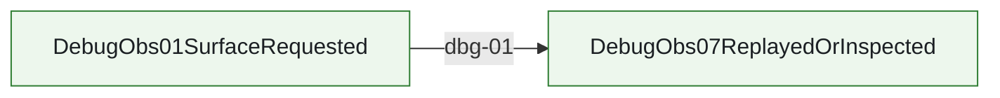

| step | transition | status | caller -> callee | split binding | owner |
| --- | --- | --- | --- | --- | --- |
| dbg-01 | `DebugObs01SurfaceRequested -> DebugObs07ReplayedOrInspected` | anchored | `createDebugToolkit -> createDebugToolkit` |  | `debug.unified_surface` debug/diag/snapshot/logger/harness/replay/policy migration must converge on one queryable authoring surface under src/debug with per-module closeout and explicit diagnostics taxonomy |

## debug.pipeline_dry_run_loop.mainline

Local-only request/response dry-run loop: real API requests stop at final provider HTTP request preparation, captured client samples replay through the same entrypoint, and captured provider responses reuse the existing response converter.

Entry contract: `DebugDryRun01LocalRequest` via `docs/architecture/wiki/debug-unified-surface-mainline-source.md`

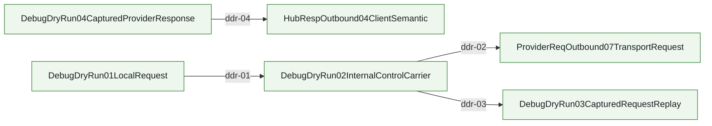

| step | transition | status | caller -> callee | split binding | owner |
| --- | --- | --- | --- | --- | --- |
| ddr-01 | `DebugDryRun01LocalRequest -> DebugDryRun02InternalControlCarrier` | anchored | `resolvePipelineDryRunForHandler -> resolvePipelineDryRunControlFromHeaders` |  | `debug.pipeline_dry_run_loop` local-only request/response dry-run loop for provider-request cut-point inspection and captured provider-response replay |
| ddr-02 | `DebugDryRun02InternalControlCarrier -> ProviderReqOutbound07TransportRequest` | anchored | `executeHttpRequestOnce -> buildProviderRequestDryRunResponse` |  | `debug.pipeline_dry_run_loop` local-only request/response dry-run loop for provider-request cut-point inspection and captured provider-response replay |
| ddr-03 | `DebugDryRun02InternalControlCarrier -> DebugDryRun03CapturedRequestReplay` | anchored | `main -> fetch` |  | `debug.pipeline_dry_run_loop` local-only request/response dry-run loop for provider-request cut-point inspection and captured provider-response replay |
| ddr-04 | `DebugDryRun04CapturedProviderResponse -> HubRespOutbound04ClientSemantic` | anchored | `main -> convertProviderResponseIfNeeded` |  | `debug.pipeline_dry_run_loop` local-only request/response dry-run loop for provider-request cut-point inspection and captured provider-response replay |

## internal_error_numbering.mainline

RouteCodex-owned internal debug errors are assigned stable `500-1xx/2xx/3xx` codes, projected only to debug artifacts, linked to external errors without wrapping them, and guarded from default client/provider payload leakage.

Entry contract: `IntErrNum01SourceObserved` via `docs/architecture/wiki/internal-error-numbering-mainline-source.md`

```mermaid
flowchart LR
  IntErrNum07ClientBoundaryPreserved["IntErrNum07ClientBoundaryPreserved"]
  IntErrNum06ExternalLinked["IntErrNum06ExternalLinked"]
  IntErrNum05DebugArtifactProjected["IntErrNum05DebugArtifactProjected"]
  IntErrNum04EnvelopeBuilt["IntErrNum04EnvelopeBuilt"]
  IntErrNum03SubcodeAssigned["IntErrNum03SubcodeAssigned"]
  IntErrNum02ModuleBlockResolved["IntErrNum02ModuleBlockResolved"]
  IntErrNum01SourceObserved["IntErrNum01SourceObserved"]
  IntErrNum01SourceObserved -->|ien-01| IntErrNum02ModuleBlockResolved
  IntErrNum02ModuleBlockResolved -->|ien-02| IntErrNum03SubcodeAssigned
  IntErrNum03SubcodeAssigned -->|ien-03| IntErrNum04EnvelopeBuilt
  IntErrNum04EnvelopeBuilt -->|ien-04| IntErrNum05DebugArtifactProjected
  IntErrNum05DebugArtifactProjected -->|ien-05| IntErrNum06ExternalLinked
  IntErrNum06ExternalLinked -->|ien-06| IntErrNum07ClientBoundaryPreserved
  classDef anchored fill:#edf7ed,stroke:#2e7d32,stroke-width:1px,color:#1b1f23;
  classDef partial fill:#fff7e6,stroke:#b26a00,stroke-width:1px,color:#1b1f23;
  classDef pending fill:#f4f4f5,stroke:#6b7280,stroke-width:1px,stroke-dasharray: 5 5,color:#1b1f23;
  class IntErrNum01SourceObserved anchored;
  class IntErrNum02ModuleBlockResolved anchored;
  class IntErrNum03SubcodeAssigned anchored;
  class IntErrNum04EnvelopeBuilt anchored;
  class IntErrNum05DebugArtifactProjected anchored;
  class IntErrNum06ExternalLinked anchored;
  class IntErrNum07ClientBoundaryPreserved anchored;
```

| step | transition | status | caller -> callee | split binding | owner |
| --- | --- | --- | --- | --- | --- |
| ien-01 | `IntErrNum01SourceObserved -> IntErrNum02ModuleBlockResolved` | anchored | `observeInternalDebugErrorSource -> resolveInternalDebugErrorModuleBlock` |  | `debug.internal_error_numbering` Internal debug error numbering registry and envelope construction for RouteCodex-owned `500-1xx/2xx/3xx` side-channel errors, with external errors linked but never wrapped |
| ien-02 | `IntErrNum02ModuleBlockResolved -> IntErrNum03SubcodeAssigned` | anchored | `resolveInternalDebugErrorModuleBlock -> assignInternalDebugErrorSubcode` |  | `debug.internal_error_numbering` Internal debug error numbering registry and envelope construction for RouteCodex-owned `500-1xx/2xx/3xx` side-channel errors, with external errors linked but never wrapped |
| ien-03 | `IntErrNum03SubcodeAssigned -> IntErrNum04EnvelopeBuilt` | anchored | `assignInternalDebugErrorSubcode -> buildInternalDebugErrorEnvelope` |  | `debug.internal_error_numbering` Internal debug error numbering registry and envelope construction for RouteCodex-owned `500-1xx/2xx/3xx` side-channel errors, with external errors linked but never wrapped |
| ien-04 | `IntErrNum04EnvelopeBuilt -> IntErrNum05DebugArtifactProjected` | anchored | `buildInternalDebugErrorEnvelope -> projectInternalDebugErrorToDebugArtifact` |  | `debug.internal_error_numbering` Internal debug error numbering registry and envelope construction for RouteCodex-owned `500-1xx/2xx/3xx` side-channel errors, with external errors linked but never wrapped |
| ien-05 | `IntErrNum05DebugArtifactProjected -> IntErrNum06ExternalLinked` | anchored | `projectInternalDebugErrorToDebugArtifact -> linkExternalError` |  | `debug.internal_error_numbering` Internal debug error numbering registry and envelope construction for RouteCodex-owned `500-1xx/2xx/3xx` side-channel errors, with external errors linked but never wrapped |
| ien-06 | `IntErrNum06ExternalLinked -> IntErrNum07ClientBoundaryPreserved` | anchored | `linkExternalError -> preserveInternalErrorClientBoundary` |  | `debug.internal_error_numbering` Internal debug error numbering registry and envelope construction for RouteCodex-owned `500-1xx/2xx/3xx` side-channel errors, with external errors linked but never wrapped |

## error.mainline

Provider/runtime/direct failures enter unified ErrorErr chain; provider availability/cooldown truth stays provider/server-scoped and must not be rewritten into session-storm truth before client projection.

Entry contract: `ErrorErr01SourceRaised` via `docs/design/pipeline-type-topology-and-module-boundaries.md`

```mermaid
flowchart LR
  ErrorErr06ClientProjected["ErrorErr06ClientProjected"]
  ErrorErr05ExecutionDecision["ErrorErr05ExecutionDecision"]
  ErrorErr04RouterPolicyApplied["ErrorErr04RouterPolicyApplied"]
  ErrorErr03RuntimeClassified["ErrorErr03RuntimeClassified"]
  ErrorErr02HostCaptured["ErrorErr02HostCaptured"]
  ErrorErr01SourceRaised["ErrorErr01SourceRaised"]
  ErrorErr01SourceRaised -->|err-01| ErrorErr02HostCaptured
  ErrorErr02HostCaptured -->|err-02| ErrorErr03RuntimeClassified
  ErrorErr03RuntimeClassified -->|err-03| ErrorErr04RouterPolicyApplied
  ErrorErr04RouterPolicyApplied -->|err-04| ErrorErr05ExecutionDecision
  ErrorErr05ExecutionDecision -->|err-05| ErrorErr06ClientProjected
  classDef anchored fill:#edf7ed,stroke:#2e7d32,stroke-width:1px,color:#1b1f23;
  classDef partial fill:#fff7e6,stroke:#b26a00,stroke-width:1px,color:#1b1f23;
  classDef pending fill:#f4f4f5,stroke:#6b7280,stroke-width:1px,stroke-dasharray: 5 5,color:#1b1f23;
  class ErrorErr01SourceRaised anchored;
  class ErrorErr02HostCaptured anchored;
  class ErrorErr03RuntimeClassified anchored;
  class ErrorErr04RouterPolicyApplied anchored;
  class ErrorErr05ExecutionDecision anchored;
  class ErrorErr06ClientProjected anchored;
```

| step | transition | status | caller -> callee | split binding | owner |
| --- | --- | --- | --- | --- | --- |
| err-01 | `ErrorErr01SourceRaised -> ErrorErr02HostCaptured` | anchored | `reportProviderErrorToRouterPolicy -> reportProviderErrorToRouterPolicy` |  | `error.pipeline_contract` ErrorErr01-06 provider/runtime error chain contract and architecture gate |
| err-02 | `ErrorErr02HostCaptured -> ErrorErr03RuntimeClassified` | anchored | `classifyProviderFailure -> classifyProviderFailure` |  | `error.provider_failure_policy` provider/server error cataloging, runtime classification, router policy application, and availability/cooldown truth; session-local storm semantics are explicitly separate |
| err-03 | `ErrorErr03RuntimeClassified -> ErrorErr04RouterPolicyApplied` | anchored | `report_provider_error_to_router_policy_json_bridge -> report_provider_error` |  | `error.pipeline_contract` ErrorErr01-06 provider/runtime error chain contract and architecture gate |
| err-04 | `ErrorErr04RouterPolicyApplied -> ErrorErr05ExecutionDecision` | anchored | `resolveProviderRetryExecutionPlan -> resolveProviderRetryExecutionPlan` |  | `error.execution_decision_consumer` Request/direct executor consumption of ErrorErr04 router policy into ErrorErr05 execution decisions, including primary_exhausted and upstream_stream_incomplete reroute |
| err-05 | `ErrorErr05ExecutionDecision -> ErrorErr06ClientProjected` | anchored | `project_error_err_06_client_from_error_err_05_execution_decision -> mapErrorToHttp` |  | `error.client_projection` ErrorErr06 client-visible HTTP/SSE error projection, including started-stream incomplete SSE error frames |

## vr.route_availability.mainline

Virtual Router ordinary-route filtering, default-pool availability floor, and primary_exhausted planning remain Rust-owned; TS may only consume the floor/plan output and must not locally re-decide terminal no-provider.

Entry contract: `VrAvail01RouteCandidates` via `docs/architecture/wiki/virtual-router-route-availability-mainline-source.md`

```mermaid
flowchart LR
  ErrorErr05ExecutionDecision["ErrorErr05ExecutionDecision"]
  VrAvail04PrimaryExhaustedPlanned["VrAvail04PrimaryExhaustedPlanned"]
  VrAvail03DefaultFloorEvaluated["VrAvail03DefaultFloorEvaluated"]
  VrAvail02PoolFiltered["VrAvail02PoolFiltered"]
  VrAvail01RouteCandidates["VrAvail01RouteCandidates"]
  VrAvail01RouteCandidates -->|vra-01| VrAvail02PoolFiltered
  VrAvail02PoolFiltered -->|vra-02| VrAvail03DefaultFloorEvaluated
  VrAvail03DefaultFloorEvaluated -->|vra-03| VrAvail04PrimaryExhaustedPlanned
  VrAvail04PrimaryExhaustedPlanned -->|vra-04| ErrorErr05ExecutionDecision
  classDef anchored fill:#edf7ed,stroke:#2e7d32,stroke-width:1px,color:#1b1f23;
  classDef partial fill:#fff7e6,stroke:#b26a00,stroke-width:1px,color:#1b1f23;
  classDef pending fill:#f4f4f5,stroke:#6b7280,stroke-width:1px,stroke-dasharray: 5 5,color:#1b1f23;
  class VrAvail01RouteCandidates anchored;
  class VrAvail02PoolFiltered anchored;
  class VrAvail03DefaultFloorEvaluated anchored;
  class VrAvail04PrimaryExhaustedPlanned anchored;
  class ErrorErr05ExecutionDecision anchored;
```

| step | transition | status | caller -> callee | split binding | owner |
| --- | --- | --- | --- | --- | --- |
| vra-01 | `VrAvail01RouteCandidates -> VrAvail02PoolFiltered` | anchored | `resolve_forwarder_candidate_for_pool -> select` |  | `vr.provider_forwarder_runtime` ProviderForwarder config load, capability filtering, internal target selection, in-process health/cooldown truth, and runtime diagnostics stay in Rust Virtual Router |
| vra-02 | `VrAvail02PoolFiltered -> VrAvail03DefaultFloorEvaluated` | anchored | `build_provider_not_available_error -> evaluate_singleton_route_pool_exhaustion` |  | `vr.route_availability_floor` route selection must not silently collapse to empty after quota health and filters; default pool always keeps one last ordered choice |
| vra-03 | `VrAvail03DefaultFloorEvaluated -> VrAvail04PrimaryExhaustedPlanned` | anchored | `resolvePrimaryExhaustedPlan -> planPrimaryExhaustedToDefaultPoolNative` |  | `virtual_router.primary_exhausted_to_default_pool` primary tier exhausted to default-pool plan stays Rust-owned and host consumes plan only |
| vra-04 | `VrAvail04PrimaryExhaustedPlanned -> ErrorErr05ExecutionDecision` | anchored | `executeRouterDirectPipelineForPort -> resolveErrorErr05RouteAvailabilityDecision` |  | `vr.route_availability_floor` route selection must not silently collapse to empty after quota health and filters; default pool always keeps one last ordered choice |

## vr.online_diagnostics.mainline

Virtual Router online diagnostics: HTTP/CLI thin shells call Rust VR status/dry-run contracts; Rust alone expands routes, forwarders, default-floor state, and unavailable-provider explanations.

Entry contract: `VrDiag01StatusSnapshot` via `docs/goals/virtual-router-online-diagnostics-plan.md`

```mermaid
flowchart LR
  ServerRespOutbound05ClientFrame["ServerRespOutbound05ClientFrame"]
  VrDiag03DryRunDecision["VrDiag03DryRunDecision"]
  VrDiag02DryRunInput["VrDiag02DryRunInput"]
  VrDiag01StatusSnapshot["VrDiag01StatusSnapshot"]
  VrDiag01StatusSnapshot -->|vrd-01| VrDiag02DryRunInput
  VrDiag02DryRunInput -->|vrd-02| VrDiag03DryRunDecision
  VrDiag03DryRunDecision -->|vrd-03| ServerRespOutbound05ClientFrame
  classDef anchored fill:#edf7ed,stroke:#2e7d32,stroke-width:1px,color:#1b1f23;
  classDef partial fill:#fff7e6,stroke:#b26a00,stroke-width:1px,color:#1b1f23;
  classDef pending fill:#f4f4f5,stroke:#6b7280,stroke-width:1px,stroke-dasharray: 5 5,color:#1b1f23;
  class VrDiag01StatusSnapshot anchored;
  class VrDiag02DryRunInput anchored;
  class VrDiag03DryRunDecision anchored;
  class ServerRespOutbound05ClientFrame anchored;
```

| step | transition | status | caller -> callee | split binding | owner |
| --- | --- | --- | --- | --- | --- |
| vrd-01 | `VrDiag01StatusSnapshot -> VrDiag02DryRunInput` | anchored | `get_status -> diagnose_route` |  | `vr.online_diagnostics` Virtual Router online status and dry-run route diagnostics stay Rust-owned |
| vrd-02 | `VrDiag02DryRunInput -> VrDiag03DryRunDecision` | anchored | `diagnose_route -> route` |  | `vr.online_diagnostics` Virtual Router online status and dry-run route diagnostics stay Rust-owned |
| vrd-03 | `VrDiag03DryRunDecision -> ServerRespOutbound05ClientFrame` | anchored | `registerHttpRoutes -> registerHttpRoutes` |  | `vr.online_diagnostics` Virtual Router online status and dry-run route diagnostics stay Rust-owned |

## vr.hit_log_projection.mainline

Virtual Router hit-log diagnostics: host effects collect the route decision context, runtime host calls Rust/NAPI hit-log projection directly, and host emits the formatted diagnostic line without owning formatting or telemetry semantics.

Entry contract: `VrHitLog01RouteDecision` via `docs/architecture/wiki/virtual-router-ownership-map.md`

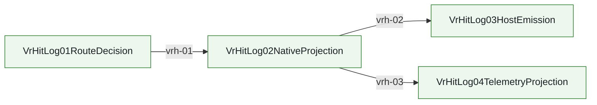

| step | transition | status | caller -> callee | split binding | owner |
| --- | --- | --- | --- | --- | --- |
| vrh-01 | `VrHitLog01RouteDecision -> VrHitLog02NativeProjection` | anchored | `finalizeVirtualRouterRouteHostEffectsNative -> finalize_virtual_router_route_host_effects_json_bridge` |  | `vr.route_host_effects` Virtual Router route host effects plan/finalize stay Rust-owned before TS host emission |
| vrh-02 | `VrHitLog02NativeProjection -> VrHitLog03HostEmission` | anchored | `finalize_virtual_router_route_host_effects_json -> format_virtual_router_hit_json` |  | `vr.route_host_effects` Virtual Router route host effects plan/finalize stay Rust-owned before TS host emission |
| vrh-03 | `VrHitLog02NativeProjection -> VrHitLog04TelemetryProjection` | anchored | `to_virtual_router_hit_event_json_bridge -> to_virtual_router_hit_event_json` |  | `vr.hit_log_projection` Virtual Router hit-log record, formatting, color-key, reason, and telemetry projection stay Rust-owned |

## runtime.lifecycle.mainline

Managed server lifecycle: `ROUTECODEX_SESSION_DIR` is only the runtime workdir root; pid cache writes on start, stop-intent writes on stop, and `tmuxSessionId` / request `sessionId` / `conversationId` stay separate namespaces rather than directory-derived identity.

Entry contract: `ServerPidCacheRecord` via `docs/design/server-runtime-lifecycle-ssot.md`

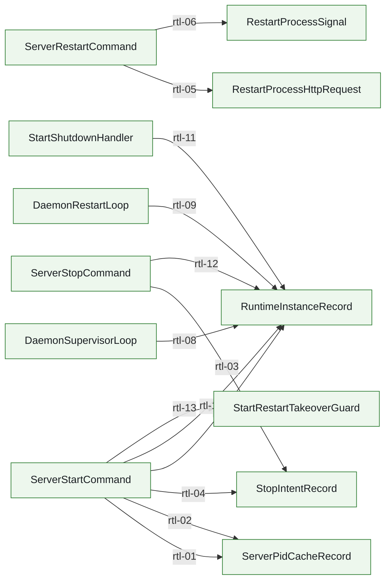

| step | transition | status | caller -> callee | split binding | owner |
| --- | --- | --- | --- | --- | --- |
| rtl-01 | `ServerStartCommand -> ServerPidCacheRecord` | anchored | `writeServerPidCache -> writeServerPidCache` |  | `runtime.lifecycle.pid_cache` server pid cache lives under <rccUserDir>/state/runtime-lifecycle/ports/<port>/pid.cache; pid is a transient cache, not the authoritative runtime state |
| rtl-02 | `ServerStartCommand -> ServerPidCacheRecord` | anchored | `writeServerPidCache -> writeServerPidCache` |  | `runtime.lifecycle.pid_cache` server pid cache lives under <rccUserDir>/state/runtime-lifecycle/ports/<port>/pid.cache; pid is a transient cache, not the authoritative runtime state |
| rtl-03 | `ServerStopCommand -> StopIntentRecord` | anchored | `writeDaemonStopIntent -> writeServerStopIntent` |  | `runtime.lifecycle.stop_intent` stop-intent is a cross-process signal under <rccUserDir>/state/runtime-lifecycle/ports/<port>/stop-intent.json; it must be reaped when older than TTL |
| rtl-04 | `ServerStartCommand -> StopIntentRecord` | anchored | `consumeDaemonStopIntent -> consumeServerStopIntent` |  | `runtime.lifecycle.stop_intent` stop-intent is a cross-process signal under <rccUserDir>/state/runtime-lifecycle/ports/<port>/stop-intent.json; it must be reaped when older than TTL |
| rtl-05 | `ServerRestartCommand -> RestartProcessHttpRequest` | anchored | `requestProcessRestartViaHttp -> registerRestartRoutes` |  | `runtime.lifecycle.restart_command` CLI restart requests the existing RouteCodex process or its original start supervisor to restart in-session |
| rtl-06 | `ServerRestartCommand -> RestartProcessSignal` | anchored | `requestInPlaceRestart -> sendSignal` |  | `runtime.lifecycle.restart_command` CLI restart requests the existing RouteCodex process or its original start supervisor to restart in-session |
| rtl-07 | `ServerStartCommand -> RuntimeInstanceRecord` | anchored | `writeRuntimeInstance -> writeRuntimeInstance` |  | `runtime.lifecycle.instance_registry` managed server instance declaration lives under <rccUserDir>/state/runtime-lifecycle/ports/<port>/instance.json |
| rtl-08 | `DaemonSupervisorLoop -> RuntimeInstanceRecord` | anchored | `writeRuntimeInstance -> writeRuntimeInstance` |  | `runtime.lifecycle.instance_registry` managed server instance declaration lives under <rccUserDir>/state/runtime-lifecycle/ports/<port>/instance.json |
| rtl-09 | `DaemonRestartLoop -> RuntimeInstanceRecord` | anchored | `writeRuntimeInstance -> writeRuntimeInstance` |  | `runtime.lifecycle.instance_registry` managed server instance declaration lives under <rccUserDir>/state/runtime-lifecycle/ports/<port>/instance.json |
| rtl-10 | `ServerStartCommand -> RuntimeInstanceRecord` | anchored | `updateRuntimeInstanceStatus -> updateRuntimeInstanceStatus` |  | `runtime.lifecycle.instance_registry` managed server instance declaration lives under <rccUserDir>/state/runtime-lifecycle/ports/<port>/instance.json |
| rtl-11 | `StartShutdownHandler -> RuntimeInstanceRecord` | anchored | `updateRuntimeInstanceStatus -> updateRuntimeInstanceStatus` |  | `runtime.lifecycle.instance_registry` managed server instance declaration lives under <rccUserDir>/state/runtime-lifecycle/ports/<port>/instance.json |
| rtl-12 | `ServerStopCommand -> RuntimeInstanceRecord` | anchored | `updateRuntimeInstanceStatus -> updateRuntimeInstanceStatus` |  | `runtime.lifecycle.instance_registry` managed server instance declaration lives under <rccUserDir>/state/runtime-lifecycle/ports/<port>/instance.json |
| rtl-13 | `ServerStartCommand -> StartRestartTakeoverGuard` | anchored | `createStartCommand -> refuseExplicitRestartTakeoverIfOccupied` |  | `runtime.lifecycle.start_command` CLI start owns server process launch and must not hide restart semantics behind explicit start --restart takeover |

## stopless.session.mainline

Stopless three-round contract inside Chat Process boundary: every request first injects stop guidance plus internal reasoningStop, Round-1 response intercepts/normalizes stop into terminal-or-CLI and saves canonical continuation truth, Round-2 request restores CLI result into guidance plus reasoningStop pair, and Round-3 no_schema guard stops endless stop->CLI rewriting.

Entry contract: `StoplessResp01StopDetected` via `docs/architecture/wiki/stopless-session-mainline-source.md`

| step | transition | status | caller -> callee | split binding | owner |
| --- | --- | --- | --- | --- | --- |
| stl-01 | `StoplessResp01StopDetected -> StoplessResp02SchemaGateEvaluated` | anchored | `run_servertool_resp_stopless_hook_skeleton -> run_stopless_auto_handler_runtime_json` |  | `hub.servertool_stopless_cli_continuation` stop_message_auto current-turn CLI continuation planning inside Chat Process request/response boundary |
| stl-02 | `StoplessResp02SchemaGateEvaluated -> StoplessState03RuntimeSnapshotResolved` | anchored | `run_stopless_auto_handler_runtime_json -> plan_stopless_execution_json` |  | `hub.servertool_stopless_cli_continuation` stop_message_auto current-turn CLI continuation planning inside Chat Process request/response boundary |
| stl-03 | `StoplessState03RuntimeSnapshotResolved -> StoplessCli04ProjectionPlanned` | anchored | `run_servertool_resp_stopless_hook_skeleton -> build_stopless_auto_cli_projection_from_engine_json` |  | `hub.servertool_stopless_cli_continuation` stop_message_auto current-turn CLI continuation planning inside Chat Process request/response boundary |
| stl-04 | `StoplessCli04ProjectionPlanned -> StoplessCli06ClientExecuted` | anchored | `createServertoolCommand -> build_servertool_cli_binary_run_command_from_client_exec_result` |  | `hub.servertool_stopless_cli_continuation` stop_message_auto current-turn CLI continuation planning inside Chat Process request/response boundary |
| stl-05 | `StoplessCli06ClientExecuted -> StoplessReq07ContinuationRestored` | anchored | `has_stop_message_auto_cli_result_in_request_json -> resolve_runtime_stop_message_state_from_metadata_center` |  | `hub.servertool_stopless_cli_continuation` stop_message_auto current-turn CLI continuation planning inside Chat Process request/response boundary |
| stl-06 | `StoplessReq07ContinuationRestored -> StoplessReq08GuidanceRewritten` | anchored | `run_responses_openai_request_codec_json -> convert_bridge_input_to_chat_messages` |  | `hub.servertool_stopless_cli_continuation` stop_message_auto current-turn CLI continuation planning inside Chat Process request/response boundary |
| stl-07 | `StoplessReq08GuidanceRewritten -> StoplessReq09SchemaContractInjected` | anchored | `apply_req_process_tool_governance -> inject_stopless_system_instruction` |  | `hub.servertool_stopless_cli_continuation` stop_message_auto current-turn CLI continuation planning inside Chat Process request/response boundary |
| stl-08 | `StoplessReq09SchemaContractInjected -> VrRoute04SelectedTarget` | anchored | `classify -> classify` |  | `hub.servertool_stopless_cli_continuation` stop_message_auto current-turn CLI continuation planning inside Chat Process request/response boundary |

## metadata.center.mainline

single request-scoped metadata center mainline: one bound center flows across server -> Hub Pipeline -> provider/runtime -> response closeout; request truth is materialized once, continuation/runtime/provider observation attach as separate families, and later stages consume read-only projections before closeout release.

Entry contract: `MetaReq01InboundSeeded` via `docs/architecture/wiki/metadata-center-mainline-source.md`

| step | transition | status | caller -> callee | split binding | owner |
| --- | --- | --- | --- | --- | --- |
| mtc-01 | `MetaReq01InboundSeeded -> MetaReq02TruthMaterialized` | anchored | `buildRequestMetadata -> writeRequestTruth` |  | `hub.metadata_center_mainline` single request-scoped metadata center remains the only carrier across server -> Hub Pipeline -> provider/runtime -> response closeout |
| mtc-02 | `MetaReq02TruthMaterialized -> MetaReq03ContinuationAttached` | anchored | `buildResponsesPipelineMetadataForHttp -> writeContinuationContext` |  | `hub.metadata_center_mainline` single request-scoped metadata center remains the only carrier across server -> Hub Pipeline -> provider/runtime -> response closeout |
| mtc-03 | `MetaReq03ContinuationAttached -> MetaReq04RuntimeControlBound` | anchored | `finalizeRequestExecutorAttemptMetadata -> finalizeRequestExecutorAttemptMetadata` |  | `hub.metadata_center_mainline` single request-scoped metadata center remains the only carrier across server -> Hub Pipeline -> provider/runtime -> response closeout |
| mtc-04 | `MetaReq04RuntimeControlBound -> MetaReq05ProviderObservationProjected` | anchored | `resolveRequestExecutorPipelineAttempt -> resolveRequestExecutorPipelineAttempt` |  | `hub.metadata_center_mainline` single request-scoped metadata center remains the only carrier across server -> Hub Pipeline -> provider/runtime -> response closeout |
| mtc-05 | `MetaReq05ProviderObservationProjected -> MetaResp06ResponseObserved` | anchored | `convertProviderResponse -> readRequestTruthFromBoundMetadataCenter` |  | `hub.metadata_center_mainline` single request-scoped metadata center remains the only carrier across server -> Hub Pipeline -> provider/runtime -> response closeout |
| mtc-06 | `MetaResp06ResponseObserved -> MetaResp07BridgeMetadataBound` | anchored | `buildBridgeInvocationMetadata -> MetadataCenter.read` |  | `hub.metadata_center_mainline` single request-scoped metadata center remains the only carrier across server -> Hub Pipeline -> provider/runtime -> response closeout |
| mtc-07 | `MetaResp07BridgeMetadataBound -> MetaResp08CloseoutReleased` | anchored | `releaseMetadataCenterForHttpResponse -> markReleased` |  | `hub.metadata_center_mainline` single request-scoped metadata center remains the only carrier across server -> Hub Pipeline -> provider/runtime -> response closeout |

## sse.chat_stream_projection.mainline

Chat JSON response projection into client-visible SSE frames and Chat provider SSE decode into final Chat JSON; malformed semantics fail fast instead of being synthesized into successful frames/responses.

Entry contract: `HubRespOutbound04ClientSemantic` via `docs/design/pipeline-type-topology-and-module-boundaries.md`

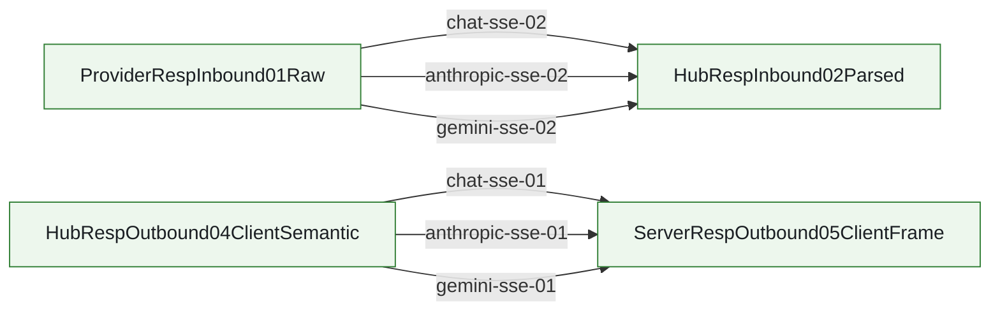

| step | transition | status | caller -> callee | split binding | owner |
| --- | --- | --- | --- | --- | --- |
| chat-sse-01 | `HubRespOutbound04ClientSemantic -> ServerRespOutbound05ClientFrame` | anchored | `buildSseFramesFromJsonWithNative -> build_sse_frames_from_json_json` |  | `sse.chat_stream_projection` OpenAI Chat SSE/JSON stream projection for chat chunks, usage, reasoning, and tool-call deltas |
| chat-sse-02 | `ProviderRespInbound01Raw -> HubRespInbound02Parsed` | anchored | `buildJsonFromSseWithNative -> build_json_from_sse_json` |  | `sse.chat_stream_projection` OpenAI Chat SSE/JSON stream projection for chat chunks, usage, reasoning, and tool-call deltas |
| anthropic-sse-01 | `HubRespOutbound04ClientSemantic -> ServerRespOutbound05ClientFrame` | anchored | `buildSseFramesFromJsonWithNative -> build_sse_frames_from_json_json` |  | `sse.anthropic_gemini_stream_projection` Anthropic Messages and Gemini Chat protocol-specific SSE projection owners |
| anthropic-sse-02 | `ProviderRespInbound01Raw -> HubRespInbound02Parsed` | anchored | `buildJsonFromSseWithNative -> build_json_from_sse_json` |  | `sse.anthropic_gemini_stream_projection` Anthropic Messages and Gemini Chat protocol-specific SSE projection owners |
| gemini-sse-01 | `HubRespOutbound04ClientSemantic -> ServerRespOutbound05ClientFrame` | anchored | `buildSseFramesFromJsonWithNative -> build_sse_frames_from_json_json` |  | `sse.anthropic_gemini_stream_projection` Anthropic Messages and Gemini Chat protocol-specific SSE projection owners |
| gemini-sse-02 | `ProviderRespInbound01Raw -> HubRespInbound02Parsed` | anchored | `buildJsonFromSseWithNative -> build_json_from_sse_json` |  | `sse.anthropic_gemini_stream_projection` Anthropic Messages and Gemini Chat protocol-specific SSE projection owners |

## stage_a.p0_rust_migration.mainline

Stage A locks P0 Rust migration owner boundaries before implementation: servertool followup orchestration, Anthropic conversion, Responses continuation store, and request/response Chat Process tool governance.

Entry contract: `StageAOwnerBoundary` via `docs/goal-prompts/2026-07-03-rust-hub-pipeline-migration.md`

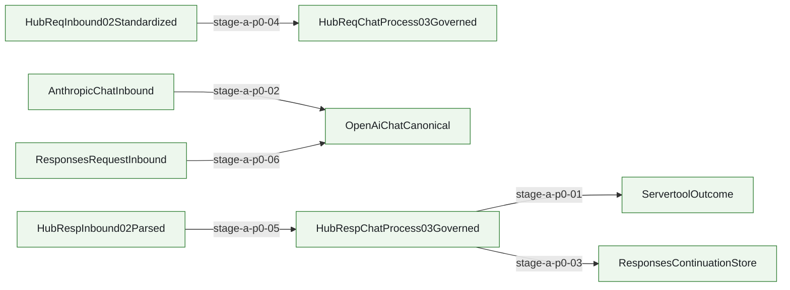

| step | transition | status | caller -> callee | split binding | owner |
| --- | --- | --- | --- | --- | --- |
| stage-a-p0-01 | `HubRespChatProcess03Governed -> ServertoolOutcome` | anchored | `run_servertool_response_stage_json -> plan_servertool_outcome_json` |  | `servertool.followup_orchestration` Orchestration logic for server-side tools followup |
| stage-a-p0-02 | `AnthropicChatInbound -> OpenAiChatCanonical` | anchored | `build_openai_chat_from_anthropic_json -> map_chat_tools_to_anthropic_tools` |  | `conversion.shared.anthropic` Anthropic OpenAI chat protocol normalization and tool schema mapping |
| stage-a-p0-03 | `HubRespChatProcess03Governed -> ResponsesContinuationStore` | anchored | `prepare_responses_conversation_entry_json -> restore_responses_continuation_payload` |  | `conversion.responses.store` Responses conversation store and continuation management |
| stage-a-p0-04 | `HubReqInbound02Standardized -> HubReqChatProcess03Governed` | anchored | `apply_req_process_tool_governance -> apply_req_process_tool_governance_json` |  | `hub.req_chatprocess.tool_governance` Harvest text tool calls from request side and sanitize payloads |
| stage-a-p0-05 | `HubRespInbound02Parsed -> HubRespChatProcess03Governed` | anchored | `govern_response_json -> strip_orphan_function_calls_tag_json` |  | `hub.resp_chatprocess.tool_governance` Harvest tool results, reverse apply_patch, strip internal tools |
| stage-a-p0-06 | `ResponsesRequestInbound -> OpenAiChatCanonical` | anchored | `run_responses_openai_request_codec_json -> run_responses_openai_response_codec_json` |  | `conversion.shared.responses_openai` OpenAI Responses to OpenAI Chat protocol normalization and response projection |

## Shared Multi-Reference Functions

| function_id | symbol | owner | note |
| --- | --- | --- | --- |
| native.responses_context_capture | `captureReqInboundResponsesContextSnapshotJson` | `hub.req_inbound_responses_context_capture` Rust req_inbound owner captures and normalizes relay `/v1/responses` request context before any TS bridge reuse | Host/native wrapper; truth owner remains Rust hub_req_inbound_context_capture. |
| native.responses_client_projection | `projectResponsesClientPayloadForClientNative` | `hub.response_responses_client_projection` OpenAI Responses client-visible payload projection for JSON body and SSE frames after HubRespChatProcess03Governed normalization, including apply_patch freeform custom tool output plus client-visible model/reasoning restore | Thin host/native facade; truth owner remains Rust. |
| error.execution_decision_consumer | `resolveProviderRetryExecutionPlan` | `error.execution_decision_consumer` Request/direct executor consumption of ErrorErr04 router policy into ErrorErr05 execution decisions, including primary_exhausted and upstream_stream_incomplete reroute | Executor consumes classified provider failure and materializes retry/reroute/fail-fast decision. |
| runtime.lifecycle.pid_cache_writer | `writeServerPidCache` | `runtime.lifecycle.pid_cache` server pid cache lives under <rccUserDir>/state/runtime-lifecycle/ports/<port>/pid.cache; pid is a transient cache, not the authoritative runtime state | Writes transient pid.cache JSON under runtime-lifecycle subdir; truth remains HTTP /health + listener identity. |
| runtime.lifecycle.stop_intent_signal | `writeServerStopIntent` | `runtime.lifecycle.stop_intent` stop-intent is a cross-process signal under <rccUserDir>/state/runtime-lifecycle/ports/<port>/stop-intent.json; it must be reaped when older than TTL | Cross-process stop-intent signal; daemon-stop-intent.ts is a thin re-export facade. |
| runtime.lifecycle.stop_intent_consumer | `consumeServerStopIntent` | `runtime.lifecycle.stop_intent` stop-intent is a cross-process signal under <rccUserDir>/state/runtime-lifecycle/ports/<port>/stop-intent.json; it must be reaped when older than TTL | Consumes and TTL-gates stop-intent.json; same owner truth as the writer. |
| runtime.lifecycle.instance_registry_writer | `writeRuntimeInstance` | `runtime.lifecycle.instance_registry` managed server instance declaration lives under <rccUserDir>/state/runtime-lifecycle/ports/<port>/instance.json | Atomic write via temp file + rename; authoritative description of the instance, not the pid cache. |
| runtime.lifecycle.instance_registry_status | `updateRuntimeInstanceStatus` | `runtime.lifecycle.instance_registry` managed server instance declaration lives under <rccUserDir>/state/runtime-lifecycle/ports/<port>/instance.json | Promotes instance.json status; caller must already have a record via writeRuntimeInstance. |
| debug.surface_registry | `createDebugToolkit` | `debug.unified_surface` debug/diag/snapshot/logger/harness/replay/policy migration must converge on one queryable authoring surface under src/debug with per-module closeout and explicit diagnostics taxonomy | Canonical debug owner entrypoint. createDebugToolkit is the unified facade constructor for debug diag/snapshot/logger/harness replay surfaces. |
| error.err_04_router_policy_applied | `report_provider_error` | `error.pipeline_contract` ErrorErr01-06 provider/runtime error chain contract and architecture gate | Router policy applied between ErrorErr03 and ErrorErr05; Rust provider runtime ingress normalizes provider error events into ErrorErr04 policy truth. |
| error.err_04_executor_envelope | `RequestExecutorErrorErr04RouterPolicyEnvelope` | `error.execution_decision_consumer` Request/direct executor consumption of ErrorErr04 router policy into ErrorErr05 execution decisions, including primary_exhausted and upstream_stream_incomplete reroute | Executor-side envelope alias for ErrorErr04RouterPolicyApplied; call map edge err-03 crosses from ErrorErr03 to ErrorErr05 per contract. |

## Maintenance Rules

- Do not invent symbols. Use binding_pending until concrete caller/callee is verified in code.
- Each edge must bind one adjacent mainline transition only.
- If a facade/wrapper is listed, also record the truth owner feature_id.
- When a feature changes mainline entry/exit, update this file in the same change set.
- If runtime orchestration and typed contract builders are different layers, record them in split_bindings instead of compressing them into one fake edge.
