<!-- AUTO-GENERATED: do not edit by hand. Rebuild with `npm run render:architecture-mainline-mermaid`. -->
# Mainline Call Graph

Source of truth:
- `docs/architecture/mainline-call-map.yml` defines request/response/error edges
- `docs/architecture/function-map.yml` enriches owner summary and owner module context

Render rules:
- Mermaid page is a render artifact, not a second architecture truth source.
- `anchored` = verified caller/callee binding
- `partial` = edge is bound, but only part of the transition is concretely anchored
- `binding pending` = edge intentionally left unresolved until code audit pins the real bridge

## request.mainline

HTTP request enters host, standardizes in Hub, routes via VR, exits through provider wire build.

Entry contract: `ServerReqInbound01ClientRaw` via `docs/design/pipeline-type-topology-and-module-boundaries.md`

```mermaid
flowchart LR
  ProviderReqOutbound06WirePayload["ProviderReqOutbound06WirePayload"]
  HubReqOutbound05ProviderSemantic["HubReqOutbound05ProviderSemantic"]
  VrRoute04SelectedTarget["VrRoute04SelectedTarget"]
  HubReqChatProcess03Governed["HubReqChatProcess03Governed"]
  HubReqInbound02Standardized["HubReqInbound02Standardized"]
  ServerReqInbound01ClientRaw["ServerReqInbound01ClientRaw"]
  ServerReqInbound01ClientRaw -->|req-00| HubReqInbound02Standardized
  ServerReqInbound01ClientRaw -->|req-01| HubReqInbound02Standardized
  HubReqInbound02Standardized -->|req-02| HubReqChatProcess03Governed
  HubReqChatProcess03Governed -->|req-03| VrRoute04SelectedTarget
  VrRoute04SelectedTarget -->|req-04| HubReqOutbound05ProviderSemantic
  HubReqOutbound05ProviderSemantic -.->|req-05| ProviderReqOutbound06WirePayload
  classDef anchored fill:#edf7ed,stroke:#2e7d32,stroke-width:1px,color:#1b1f23;
  classDef partial fill:#fff7e6,stroke:#b26a00,stroke-width:1px,color:#1b1f23;
  classDef pending fill:#f4f4f5,stroke:#6b7280,stroke-width:1px,stroke-dasharray: 5 5,color:#1b1f23;
  class ServerReqInbound01ClientRaw anchored;
  class HubReqInbound02Standardized anchored;
  class HubReqChatProcess03Governed pending;
  class VrRoute04SelectedTarget pending;
  class HubReqOutbound05ProviderSemantic pending;
  class ProviderReqOutbound06WirePayload partial;
```

| step | transition | status | caller -> callee | owner |
| --- | --- | --- | --- | --- |
| req-00 | `ServerReqInbound01ClientRaw -> HubReqInbound02Standardized` | anchored | `prepareResponsesHandlerEntryForHttp -> planResponsesHandlerEntry` | `server.responses_request_handler_bridge_surface` /v1/responses request handler uses one opaque request facade only; protocol semantics stay in Hub Pipeline/native owner |
| req-01 | `ServerReqInbound01ClientRaw -> HubReqInbound02Standardized` | anchored | `buildResponsesRequestContextForHttp -> captureReqInboundResponsesContextSnapshotJson` | `hub.req_inbound_responses_context_capture` Rust req_inbound owner captures and normalizes relay `/v1/responses` request context before any TS bridge reuse |
| req-02 | `HubReqInbound02Standardized -> HubReqChatProcess03Governed` | anchored | `captureReqInboundResponsesContextSnapshot -> captureReqInboundResponsesContextSnapshotWithNative` | `hub.req_inbound_responses_context_capture` Rust req_inbound owner captures and normalizes relay `/v1/responses` request context before any TS bridge reuse |
| req-03 | `HubReqChatProcess03Governed -> VrRoute04SelectedTarget` | binding pending | `binding pending` | `binding pending` |
| req-04 | `VrRoute04SelectedTarget -> HubReqOutbound05ProviderSemantic` | binding pending | `binding pending` | `binding pending` |
| req-05 | `HubReqOutbound05ProviderSemantic -> ProviderReqOutbound06WirePayload` | partial | `runReqOutboundStage3CompatWithNative -> run_req_outbound_stage3_compat_json` | `responses.request_compat_normalization` Responses request compat normalization for c4m/crs profiles must be owned by Rust req_outbound stage3 compat only |

## response.mainline

Provider response enters Hub, gets governed, then projects to client protocol and server frame.

Entry contract: `ProviderRespInbound01Raw` via `docs/design/pipeline-type-topology-and-module-boundaries.md`

| step | transition | status | caller -> callee | owner |
| --- | --- | --- | --- | --- |
| resp-01 | `ProviderRespInbound01Raw -> HubRespInbound02Parsed` | anchored | `run_hub_resp_inbound_02_parsed_entrypoint -> parse_hub_resp_inbound_02_from_provider_resp_inbound_01` | `binding pending` |
| resp-02 | `HubRespInbound02Parsed -> HubRespChatProcess03Governed` | anchored | `run_hub_resp_chatprocess_03_governed_entrypoint -> build_hub_resp_chatprocess_03_from_hub_resp_inbound_02` | `binding pending` |
| resp-03 | `HubRespChatProcess03Governed -> HubRespOutbound04ClientSemantic` | anchored | `prepareResponsesJsonClientDispatchPlanForHttp -> projectResponsesClientPayloadForClientNative` | `hub.response_responses_client_projection` OpenAI Responses client-visible payload projection for JSON body and SSE frames, including apply_patch freeform custom tool output plus client-visible model/reasoning restore |
| resp-04 | `HubRespOutbound04ClientSemantic -> ServerRespOutbound05ClientFrame` | anchored | `sendPipelineResponse -> sendSsePipelineResponse` | `server.responses_response_handler_bridge_surface` /v1/responses response lifecycle bridge uses one opaque continuation/conversation facade only; protocol semantics stay in Hub Pipeline/native owner |

## error.mainline

Provider/runtime/direct failures enter unified ErrorErr chain and only then project to client-visible error.

Entry contract: `ErrorErr01SourceRaised` via `docs/design/pipeline-type-topology-and-module-boundaries.md`

```mermaid
flowchart LR
  ErrorErr06ClientProjected["ErrorErr06ClientProjected"]
  ErrorErr05ExecutionDecision["ErrorErr05ExecutionDecision"]
  ErrorErr03RuntimeClassified["ErrorErr03RuntimeClassified"]
  ErrorErr02HostCaptured["ErrorErr02HostCaptured"]
  ErrorErr01SourceRaised["ErrorErr01SourceRaised"]
  ErrorErr01SourceRaised -->|err-01| ErrorErr02HostCaptured
  ErrorErr02HostCaptured -->|err-02| ErrorErr03RuntimeClassified
  ErrorErr03RuntimeClassified -.->|err-03| ErrorErr05ExecutionDecision
  ErrorErr05ExecutionDecision -->|err-04| ErrorErr06ClientProjected
  classDef anchored fill:#edf7ed,stroke:#2e7d32,stroke-width:1px,color:#1b1f23;
  classDef partial fill:#fff7e6,stroke:#b26a00,stroke-width:1px,color:#1b1f23;
  classDef pending fill:#f4f4f5,stroke:#6b7280,stroke-width:1px,stroke-dasharray: 5 5,color:#1b1f23;
  class ErrorErr01SourceRaised anchored;
  class ErrorErr02HostCaptured anchored;
  class ErrorErr03RuntimeClassified partial;
  class ErrorErr05ExecutionDecision partial;
  class ErrorErr06ClientProjected anchored;
```

| step | transition | status | caller -> callee | owner |
| --- | --- | --- | --- | --- |
| err-01 | `ErrorErr01SourceRaised -> ErrorErr02HostCaptured` | anchored | `reportProviderErrorToRouterPolicy -> reportProviderErrorToRouterPolicy` | `error.pipeline_contract` ErrorErr01-06 provider/runtime error chain contract and architecture gate |
| err-02 | `ErrorErr02HostCaptured -> ErrorErr03RuntimeClassified` | anchored | `classifyProviderFailure -> classifyProviderFailure` | `error.provider_failure_policy` provider error cataloging, runtime classification, router policy application, client-disconnect and upstream-stream-incomplete routing |
| err-03 | `ErrorErr03RuntimeClassified -> ErrorErr05ExecutionDecision` | partial | `resolveProviderRetryExecutionPlan -> consume_error_err_05_execution_decision_from_error_err_04_router_policy` | `error.execution_decision_consumer` Request/direct executor consumption of ErrorErr04 router policy into ErrorErr05 execution decisions, including primary_exhausted and upstream_stream_incomplete reroute |
| err-04 | `ErrorErr05ExecutionDecision -> ErrorErr06ClientProjected` | anchored | `project_error_err_06_client_from_error_err_05_execution_decision -> mapErrorToHttp` | `error.client_projection` ErrorErr06 client-visible HTTP/SSE error projection, including started-stream incomplete SSE error frames |

## Shared Multi-Reference Functions

| function_id | symbol | owner | note |
| --- | --- | --- | --- |
| native.responses_context_capture | `captureReqInboundResponsesContextSnapshotJson` | `hub.req_inbound_responses_context_capture` Rust req_inbound owner captures and normalizes relay `/v1/responses` request context before any TS bridge reuse | Host/native wrapper; truth owner remains Rust hub_req_inbound_context_capture. |
| native.responses_client_projection | `projectResponsesClientPayloadForClientNative` | `hub.response_responses_client_projection` OpenAI Responses client-visible payload projection for JSON body and SSE frames, including apply_patch freeform custom tool output plus client-visible model/reasoning restore | Thin host/native facade; truth owner remains Rust. |
| error.execution_decision_consumer | `resolveProviderRetryExecutionPlan` | `error.execution_decision_consumer` Request/direct executor consumption of ErrorErr04 router policy into ErrorErr05 execution decisions, including primary_exhausted and upstream_stream_incomplete reroute | Executor consumes classified provider failure and materializes retry/reroute/fail-fast decision. |

## Maintenance Rules

- Do not invent symbols. Use binding_pending until concrete caller/callee is verified in code.
- Each edge must bind one adjacent mainline transition only.
- If a facade/wrapper is listed, also record the truth owner feature_id.
- When a feature changes mainline entry/exit, update this file in the same change set.
