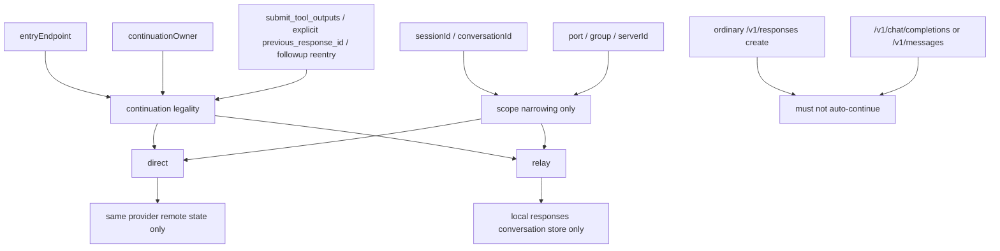

# Metadata Boundary Map

## Purpose

这页只回答两件事：

1. `sessionId / conversationId / requestId / pipelineId / entryEndpoint / continuationOwner` 等 metadata 在请求闭环里怎么传。
2. 哪些地方允许读，哪些地方绝对不能泄漏到 provider wire / client payload。

它是 review surface，不是第二份 SSOT。

Canonical sources:

- `docs/architecture/function-map.yml` -> `feature_id: hub.metadata_boundary`
- `docs/architecture/verification-map.yml` -> `feature_id: hub.metadata_boundary`
- `docs/design/pipeline-type-topology-and-module-boundaries.md`
- `docs/goals/metadata-request-isolation-plan.md`
- `docs/design/responses-continuation-storage-ownership.md`
- `docs/chat-process-continuation-state-contract.md`

## Main Rule

- metadata 只允许作为 side-channel control carrier。
- 请求链、响应链都可以读当前闭环 metadata。
- provider 出站 body / SDK options / direct passthrough body 不得出现内部 metadata。
- client JSON / SSE payload 不得出现内部 metadata。
- 闭环结束必须释放；不得跨 `requestId / pipelineId / port / session / conversation / continuationOwner` 复用。

## Scope Keys

| Key | Role | Where it is valid | Must not become |
| --- | --- | --- | --- |
| `requestId` | 当前请求闭环主键 | request + response 当前闭环 | provider body field / client response field |
| `pipelineId` | 当前 pipeline 实例主键 | request + response 当前闭环 | provider body field / client response field |
| `sessionId` | 当前 request truth session identity | metadata carrier / continuation scope / stopless request key | provider payload semantic shortcut |
| `conversationId` | 当前 conversation narrowing key | metadata carrier / continuation scope | request `sessionId` replacement or provider payload semantic shortcut |
| `entryEndpoint` | 入口协议边界 | req_inbound / req_chatprocess / resp_outbound | provider metadata fallback |
| `continuationOwner` | `direct` vs `relay` 恢复归属 | continuation store / restore / route pin | 普通 create 自动续接条件 |
| `port` / `serverId` / `group` | 端口与实例隔离 | runtime metadata / snapshot root / restore scope | cross-port shared metadata |
| `routeHint` / `streamIntent` / `servertool*` | 内部控制语义 | Hub / VR / runtime / servertool | client-visible protocol field |

## Session Dir Clarification

`ROUTECODEX_SESSION_DIR` is not a semantic session id. It is a runtime filesystem root that may host several unrelated state families at once:

- generic routing/runtime state snapshots (`session:*`, `conversation:*`, `tmux:*`)
- `session-bindings.json`
- `provider-health.json`
- `servertool-pending/*`

This means `sessionId` / `tmuxSessionId` / `conversationId` are not the same key, but the directory itself is already a shared runtime workdir. When reading or writing stopless/session data, prefer explicit metadata scope + explicit owner path. Do not infer ownership from the directory name alone.

Stopless-specific clarification:

- generic runtime snapshot keys such as `session:*`, `conversation:*`, or `tmux:*` are not legal stopless identity sources just because they coexist in the workdir;
- current stopless counting/control truth remains request-local `MetadataCenter.runtime_control.stopless` plus current-turn tool-output truth, keyed by the active request `sessionId`;
- mentions of `conversation:*` / `tmux:*` on this page are generic runtime namespace background only, not stopless contract.

Persistence rule now stays explicit:

- protocol-independent continuation state may be persisted/file-backed, because it must survive protocol boundaries and later restore with owner/scope validation;
- request-local stopless / current-turn CLI projection state must not be upgraded into persisted session truth just because it has a `sessionId`;
- `ROUTECODEX_SESSION_DIR` can host both categories physically, but the persistence decision comes from lifecycle contract, not from the directory existing.

Namespace rule is now explicit:

- `tmuxSessionId`: client attachment / injection runtime scope only
- `conversationId` / `conversationSessionId`: conversation-level narrowing key only
- request `sessionId`: request/continuation scope only
- `session-bindings.json` may bind `conversationSessionId -> tmuxSessionId` for runtime injection lookup, but it must not redefine any of these namespaces as one identity
- `session-bindings.json` production path is now runtime-bootstrap-owned: the HTTP server injects the bindings store path into `SessionClientRegistry`; the registry must not infer current-instance scope from feature-chain metadata, session ids, or `ROUTECODEX_SESSION_DIR`.

Stop-message / stopless control clarification:

- canonical stopless control lives in `MetadataCenter.runtime_control.stopless`;
- `stopMessageEnabled` / `stopMessageExcludeDirect` are still active runtime-control fields;
- top-level `metadata.stopMessageEnabled` / `routecodexPortStopMessageEnabled` remain compatibility projections only;
- `serverToolLoopState` / `stopMessageState` are active runtime mirrors consumed by Rust servertool-core contracts, but they are not `MetadataCenter.runtime_control` canonical slots.

## State Family Matrix

| State family | Current owner | Lifetime | Persist/file? | Why |
| --- | --- | --- | --- | --- |
| Responses / protocol-independent continuation | responses continuation store + owner restore path | cross-request / cross-tool-turn / protocol restore | yes, required | continuation 恢复权必须显式保存，不能只靠 scope 命中 |
| stopless `stop_message_auto` loop state | stopless runtime metadata + current request `tool_outputs` | current request + next tool roundtrip | no | 不是 protocol-independent continuation，不应升级成 persisted session truth |
| servertool pending injection | `hub.servertool_pending_session` | cross-request followup bridge | pending review | 目前仍是文件态，但是否属于“必须持久化 continuation”需继续按 owner 收口审计 |
| tmux / client bindings | `SessionClientRegistry` | client/tmux attachment lifecycle | yes, but separate namespace | 这是 client binding，不是 request session 或 continuation |
| runtime lifecycle pid/stop-intent/instance registry | runtime lifecycle owners | cross-process runtime control | yes | 这是 runtime control plane，不是业务 continuation |
| provider health / cooldown | provider runtime health owners | cross-request runtime heuristics | yes, if policy requires restart survival | 属于 runtime policy，不是 session 身份 |

As of 2026-06-17, two implementation contracts are now explicit:

- `sharedmodule/llmswitch-core/src/servertool/pending-session.ts` no longer reads `ROUTECODEX_SESSION_DIR` or top-level fallback fields. Caller must pass explicit `sessionDir` from runtime metadata.
- `sharedmodule/llmswitch-core/src/native/router-hotpath/native-virtual-router-routing-state.{ts,js}` now passes an explicit "no override" sentinel when caller does not provide `sessionDir`, and `router-hotpath-napi/src/virtual_router_engine/routing_state_store.rs` no longer reads `ROUTECODEX_SESSION_DIR` as a storage override. Persistent routing-state owner now accepts only explicit override input or canonical `~/.rcc` roots.
- `sharedmodule/llmswitch-core/rust-core/crates/router-hotpath-napi/src/virtual_router_engine/napi_proxy.rs` now reads runtime path overrides only from `metadata.__rt.*`; top-level `metadata.sessionDir/rccUserDir` no longer count as legal fallback.

## Request / Response Flow

```mermaid
flowchart LR
  A["Client HTTP Body<br/>may contain client metadata input"] --> B["ServerReqInbound01ClientRaw<br/>capture current request facts"]
  B --> C["MetaCarrier<br/>requestId/pipelineId/sessionId/conversationId/entryEndpoint/port"]
  B --> D["HubReqInbound02Standardized<br/>strip inline metadata from normal payload"]
  C --> D
  D --> E["HubReqChatProcess03Governed<br/>read metadata only as control semantics"]
  C --> E
  E --> F["VrRoute04SelectedTarget<br/>read continuation/route scope only"]
  C --> F
  F --> G["HubReqOutbound05ProviderSemantic<br/>metadata isolated from semantic payload"]
  C --> G
  G --> H["ProviderReqOutbound06WirePayload<br/>assert no inline metadata"]
  H --> I["Upstream Provider"]
  I --> J["ProviderRespInbound01Raw"]
  J --> K["HubRespInbound02Parsed<br/>same requestId/pipelineId metadata only"]
  C --> K
  K --> L["HubRespChatProcess03Governed<br/>servertool/followup/continuation read current carrier"]
  C --> L
  L --> M["HubRespOutbound04ClientSemantic<br/>project client payload without metadata"]
  C --> M
  M --> N["ServerRespOutbound05ClientFrame<br/>JSON/SSE no internal metadata"]
  N --> O["Client"]

  classDef safe fill:#edf7ed,stroke:#2e7d32,color:#1b1f23;
  classDef guard fill:#fff7e6,stroke:#b26a00,color:#1b1f23;
  classDef deny fill:#fdecec,stroke:#c62828,color:#1b1f23;
  class B,C,D,E,F,G,J,K,L,M,N safe;
  class H guard;
  class I,O deny;
```

## Node-by-Node Boundary

| Node | Allowed metadata action | Forbidden action | Evidence anchor |
| --- | --- | --- | --- |
| `ServerReqInbound01ClientRaw` | 读取 client metadata，生成当前闭环 carrier | 把 metadata 留在 pipeline normal body | `docs/goals/metadata-request-isolation-plan.md` §2026-06-01 handler 收口 |
| `HubReqInbound02Standardized` | 标准化 payload，并断言 normal payload 无 inline metadata | 用 metadata 继续承载可映射业务语义 | `assert_no_inline_metadata` / `HubReqInbound02Standardized` |
| `HubReqChatProcess03Governed` | 读取当前 carrier 控制语义，如 continuation / tool governance / route hints | 让 `responsesResume / clientToolsRaw / responseFormat` 等继续滞留 metadata | `hub_pipeline_blocks/process_mode.rs` fail-fast keys |
| `VrRoute04SelectedTarget` | 只消费 continuation / route scope | 读取 payload 修语义，或跨 port/session 恢复别的 metadata | `docs/chat-process-continuation-state-contract.md` |
| `HubReqOutbound05ProviderSemantic` | 保留 provider-neutral 业务语义 | 从 `payload.metadata.context` 回填 provider semantic | `docs/goals/metadata-request-isolation-plan.md` P0/P1 |
| `ProviderReqOutbound06WirePayload` | 最终 wire build 前断言无 inline metadata | provider body / SDK options 带内部 metadata | `assert_no_inline_metadata` / metadata leak boundary gates |
| `HubRespInbound02Parsed` | 只读取同一 `requestId/pipelineId` 的当前闭环 carrier | 从别的请求/端口恢复 metadata | topology doc §4.1 |
| `HubRespChatProcess03Governed` | 读取当前闭环 continuation/servertool metadata | 把 metadata 注入 followup payload 或 client payload | metadata isolation plan + continuation ownership doc |
| `HubRespOutbound04ClientSemantic` | 只做 client protocol projection | 输出 `response.metadata` / internal `__rt` / side-channel fields | `tests/sharedmodule/responses-sse-metadata-boundary.spec.ts` |
| `ServerRespOutbound05ClientFrame` | 写 JSON/SSE frame | 输出 internal metadata 到 client body / SSE event body | handler-utils / response boundary tests |

## Continuation / Ownership Binding

## Metadata Consumers

| Consumer | Reads | Why | Must not do |
| --- | --- | --- | --- |
| req_inbound | `entryEndpoint`, request scope ids, client metadata | capture current request context | leave metadata in normal payload |
| req_chatprocess | `responsesResume`, continuation hints, tools presence, stopless control | unify continuation / chat semantics | keep mappable semantics in metadata |
| virtual_router | `chainId`, `stickyScope`, `resumeFrom`, route hints | continuity and route decision; `stickyScope` is continuation narrowing only, not stopless identity | direct-read protocol-specific scattered keys forever |
| req_outbound / provider runtime | runtime carrier only | auth/transport/runtime observability | rebuild provider payload from metadata |
| resp_chatprocess | same closed-loop ids + continuation/servertool hints | followup / tool governance / result restore | inject metadata to client semantic payload |
| snapshot / diagnostics | metadata root field | observability only | replay into normal live path without replay scope |

## Leak Gates

Current explicit gates and tests already referenced by owner map:

- `tests/red-tests/hub_pipeline_meta_error_carrier_contract.test.ts`
- `tests/red-tests/hub_pipeline_live_runtime_typed_entrypoints_e2e.test.ts`
- `tests/red-tests/hub_pipeline_type_topology_contract.test.ts`
- `tests/sharedmodule/responses-sse-metadata-boundary.spec.ts`
- `tests/sharedmodule/responses-openai-bridge-metadata-boundary.spec.ts`
- `tests/providers/core/runtime/provider-runtime-metadata.isolation.spec.ts`
- `tests/server/handlers/handler-metadata-boundary.spec.ts`
- `scripts/architecture/verify-architecture-metadata-leak-boundary.mjs`

## Mapping Gaps / Review Findings

这部分不是在宣称 bug 已修，只是把当前 review 面能看见的缺口列出来，方便后续补 gate 或补实现。

| Gap ID | Area | Current signal | Why it is a gap |
| --- | --- | --- | --- |
| `meta-gap-01` | Wiki coverage | 当前之前没有专门 metadata boundary wiki 页 | review 时难把 request/response/continuation/snapshot 边界放到一张图上 |
| `meta-gap-02` | Queryability | `hub.metadata_boundary` 有 owner 和 tests，但没有按 `sessionId/requestId/continuationOwner` 拆开的 review 面 | 改 stopless / continuation / direct-relay 时仍可能改错层 |
| `meta-gap-03` | Continuation isolation | 文档已要求 `entryKind + continuationOwner + scope` 三重隔离，但 wiki 层此前没有把 direct/relay 恢复权显式画出 | 容易误把 `sessionId` 当恢复权真源 |
| `meta-gap-04` | Chat-process handoff | `responsesResume / responsesContext / responseFormat / anthropicToolNameMap` 仍在代码和旧类型声明中出现 | 需要继续审计哪些是过渡字段，哪些应继续收缩到 `semantics.*` |
| `meta-gap-05` | Snapshot/replay boundary | 计划文档已要求 snapshot metadata 不回流 live path，但 wiki 之前没有把 replay 例外单独标红 | 容易把 debug root metadata 当 runtime metadata 复用 |
| `meta-gap-06` | Session dir overloading | `ROUTECODEX_SESSION_DIR` 仍同时承载 routing state、bindings、health、pending files | stopless/pending-session 已收口到 metadata-only caller contract，但 runtime workdir root 仍混放多类状态，长期仍建议物理拆分 |

## Review Checklist

- 当前改动是否只在 metadata owner 或允许路径内完成。
- 是否把 `requestId/pipelineId/sessionId/conversationId/entryEndpoint/continuationOwner` 绑定到当前闭环，而不是全局 cache。
- provider body / SDK options / direct passthrough body 是否仍完全不含内部 metadata。
- client JSON / SSE payload 是否完全不含内部 metadata。
- continuation 恢复是否同时校验 `entryKind + continuationOwner + scope`。
- replay/snapshot 路径是否显式标记为 replay，而不是 live path 自动恢复。
