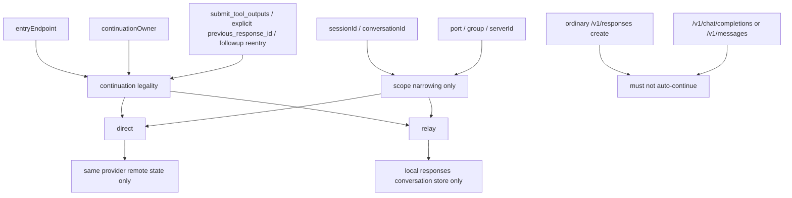

# Metadata Boundary Map

## Purpose

这页只回答两件事：

1. `sessionId / conversationId / requestId / pipelineId / entryEndpoint / continuationOwner` 等 metadata 在请求闭环里怎么传。
2. 哪些地方允许读，哪些地方绝对不能泄漏到 provider wire / client payload。

它是 review surface，不是第二份 SSOT。

Canonical sources:

- `docs/architecture/function-map.yml` -> `feature_id: hub.metadata_boundary`
- `docs/architecture/verification-map.yml` -> `feature_id: hub.metadata_boundary`
- `docs/design/pipeline-type-topology-and-module-boundaries.md`
- `docs/goals/metadata-request-isolation-plan.md`
- `docs/design/responses-continuation-storage-ownership.md`
- `docs/chat-process-continuation-state-contract.md`

## Main Rule

- metadata 只允许作为 side-channel control carrier。
- 请求链、响应链都可以读当前闭环 metadata。
- provider 出站 body / SDK options / direct passthrough body 不得出现内部 metadata。
- client JSON / SSE payload 不得出现内部 metadata。
- 闭环结束必须释放；不得跨 `requestId / pipelineId / port / session / conversation / continuationOwner` 复用。

## Scope Keys

| Key | Role | Where it is valid | Must not become |
| --- | --- | --- | --- |
| `requestId` | 当前请求闭环主键 | request + response 当前闭环 | provider body field / client response field |
| `pipelineId` | 当前 pipeline 实例主键 | request + response 当前闭环 | provider body field / client response field |
| `sessionId` | 当前 session 控制索引 | metadata carrier / continuation scope / stopless scope | provider payload semantic shortcut |
| `conversationId` | 当前 conversation 控制索引 | metadata carrier / continuation scope | provider payload semantic shortcut |
| `entryEndpoint` | 入口协议边界 | req_inbound / req_chatprocess / resp_outbound | provider metadata fallback |
| `continuationOwner` | `direct` vs `relay` 恢复归属 | continuation store / restore / route pin | 普通 create 自动续接条件 |
| `port` / `serverId` / `group` | 端口与实例隔离 | runtime metadata / snapshot root / restore scope | cross-port shared metadata |
| `routeHint` / `streamIntent` / `servertool*` | 内部控制语义 | Hub / VR / runtime / servertool | client-visible protocol field |

## Request / Response Flow

```mermaid
flowchart LR
  A["Client HTTP Body<br/>may contain client metadata input"] --> B["ServerReqInbound01ClientRaw<br/>capture current request facts"]
  B --> C["MetaCarrier<br/>requestId/pipelineId/sessionId/conversationId/entryEndpoint/port"]
  B --> D["HubReqInbound02Standardized<br/>strip inline metadata from normal payload"]
  C --> D
  D --> E["HubReqChatProcess03Governed<br/>read metadata only as control semantics"]
  C --> E
  E --> F["VrRoute04SelectedTarget<br/>read continuation/route scope only"]
  C --> F
  F --> G["HubReqOutbound05ProviderSemantic<br/>metadata isolated from semantic payload"]
  C --> G
  G --> H["ProviderReqOutbound06WirePayload<br/>assert no inline metadata"]
  H --> I["Upstream Provider"]
  I --> J["ProviderRespInbound01Raw"]
  J --> K["HubRespInbound02Parsed<br/>same requestId/pipelineId metadata only"]
  C --> K
  K --> L["HubRespChatProcess03Governed<br/>servertool/followup/continuation read current carrier"]
  C --> L
  L --> M["HubRespOutbound04ClientSemantic<br/>project client payload without metadata"]
  C --> M
  M --> N["ServerRespOutbound05ClientFrame<br/>JSON/SSE no internal metadata"]
  N --> O["Client"]

  classDef safe fill:#edf7ed,stroke:#2e7d32,color:#1b1f23;
  classDef guard fill:#fff7e6,stroke:#b26a00,color:#1b1f23;
  classDef deny fill:#fdecec,stroke:#c62828,color:#1b1f23;
  class B,C,D,E,F,G,J,K,L,M,N safe;
  class H guard;
  class I,O deny;
```

## Node-by-Node Boundary

| Node | Allowed metadata action | Forbidden action | Evidence anchor |
| --- | --- | --- | --- |
| `ServerReqInbound01ClientRaw` | 读取 client metadata，生成当前闭环 carrier | 把 metadata 留在 pipeline normal body | `docs/goals/metadata-request-isolation-plan.md` §2026-06-01 handler 收口 |
| `HubReqInbound02Standardized` | 标准化 payload，并断言 normal payload 无 inline metadata | 用 metadata 继续承载可映射业务语义 | `assert_no_inline_metadata` / `HubReqInbound02Standardized` |
| `HubReqChatProcess03Governed` | 读取当前 carrier 控制语义，如 continuation / tool governance / route hints | 让 `responsesResume / clientToolsRaw / responseFormat` 等继续滞留 metadata | `hub_pipeline_blocks/process_mode.rs` fail-fast keys |
| `VrRoute04SelectedTarget` | 只消费 continuation / route scope | 读取 payload 修语义，或跨 port/session 恢复别的 metadata | `docs/chat-process-continuation-state-contract.md` |
| `HubReqOutbound05ProviderSemantic` | 保留 provider-neutral 业务语义 | 从 `payload.metadata.context` 回填 provider semantic | `docs/goals/metadata-request-isolation-plan.md` P0/P1 |
| `ProviderReqOutbound06WirePayload` | 最终 wire build 前断言无 inline metadata | provider body / SDK options 带内部 metadata | `assert_no_inline_metadata` / metadata leak boundary gates |
| `HubRespInbound02Parsed` | 只读取同一 `requestId/pipelineId` 的当前闭环 carrier | 从别的请求/端口恢复 metadata | topology doc §4.1 |
| `HubRespChatProcess03Governed` | 读取当前闭环 continuation/servertool metadata | 把 metadata 注入 followup payload 或 client payload | metadata isolation plan + continuation ownership doc |
| `HubRespOutbound04ClientSemantic` | 只做 client protocol projection | 输出 `response.metadata` / internal `__rt` / side-channel fields | `tests/sharedmodule/responses-sse-metadata-boundary.spec.ts` |
| `ServerRespOutbound05ClientFrame` | 写 JSON/SSE frame | 输出 internal metadata 到 client body / SSE event body | handler-utils / response boundary tests |

## Continuation / Ownership Binding

## Metadata Consumers

| Consumer | Reads | Why | Must not do |
| --- | --- | --- | --- |
| req_inbound | `entryEndpoint`, request scope ids, client metadata | capture current request context | leave metadata in normal payload |
| req_chatprocess | `responsesResume`, continuation hints, tools presence, stopless control | unify continuation / chat semantics | keep mappable semantics in metadata |
| virtual_router | `chainId`, `stickyScope`, `resumeFrom`, route hints | continuity and route decision | direct-read protocol-specific scattered keys forever |
| req_outbound / provider runtime | runtime carrier only | auth/transport/runtime observability | rebuild provider payload from metadata |
| resp_chatprocess | same closed-loop ids + continuation/servertool hints | followup / tool governance / result restore | inject metadata to client semantic payload |
| snapshot / diagnostics | metadata root field | observability only | replay into normal live path without replay scope |

## Leak Gates

Current explicit gates and tests already referenced by owner map:

- `tests/red-tests/hub_pipeline_meta_error_carrier_contract.test.ts`
- `tests/red-tests/hub_pipeline_live_runtime_typed_entrypoints_e2e.test.ts`
- `tests/red-tests/hub_pipeline_type_topology_contract.test.ts`
- `tests/sharedmodule/responses-sse-metadata-boundary.spec.ts`
- `tests/sharedmodule/responses-openai-bridge-metadata-boundary.spec.ts`
- `tests/providers/core/runtime/provider-runtime-metadata.isolation.spec.ts`
- `tests/server/handlers/handler-metadata-boundary.spec.ts`
- `scripts/architecture/verify-architecture-metadata-leak-boundary.mjs`

## Mapping Gaps / Review Findings

这部分不是在宣称 bug 已修，只是把当前 review 面能看见的缺口列出来，方便后续补 gate 或补实现。

| Gap ID | Area | Current signal | Why it is a gap |
| --- | --- | --- | --- |
| `meta-gap-01` | Wiki coverage | 当前之前没有专门 metadata boundary wiki 页 | review 时难把 request/response/continuation/snapshot 边界放到一张图上 |
| `meta-gap-02` | Queryability | `hub.metadata_boundary` 有 owner 和 tests，但没有按 `sessionId/requestId/continuationOwner` 拆开的 review 面 | 改 stopless / continuation / direct-relay 时仍可能改错层 |
| `meta-gap-03` | Continuation isolation | 文档已要求 `entryKind + continuationOwner + scope` 三重隔离，但 wiki 层此前没有把 direct/relay 恢复权显式画出 | 容易误把 `sessionId` 当恢复权真源 |
| `meta-gap-04` | Chat-process handoff | `responsesResume / responsesContext / responseFormat / anthropicToolNameMap` 仍在代码和旧类型声明中出现 | 需要继续审计哪些是过渡字段，哪些应继续收缩到 `semantics.*` |
| `meta-gap-05` | Snapshot/replay boundary | 计划文档已要求 snapshot metadata 不回流 live path，但 wiki 之前没有把 replay 例外单独标红 | 容易把 debug root metadata 当 runtime metadata 复用 |

## Review Checklist

- 当前改动是否只在 metadata owner 或允许路径内完成。
- 是否把 `requestId/pipelineId/sessionId/conversationId/entryEndpoint/continuationOwner` 绑定到当前闭环，而不是全局 cache。
- provider body / SDK options / direct passthrough body 是否仍完全不含内部 metadata。
- client JSON / SSE payload 是否完全不含内部 metadata。
- continuation 恢复是否同时校验 `entryKind + continuationOwner + scope`。
- replay/snapshot 路径是否显式标记为 replay，而不是 live path 自动恢复。
