# Metadata Center Mainline Source

## Purpose

This page is the review surface for the request-scoped metadata center mainline as it exists today and continues to migrate. It answers one question only:

- across the request/response lifecycle, which metadata family should be written where, and which stage is the unique owner of that write.

This is not a second source of truth. Current boundary/gate policy still lives in:

- `docs/architecture/function-map.yml` -> `feature_id: hub.metadata_boundary`
- `docs/architecture/verification-map.yml` -> `feature_id: hub.metadata_boundary`
- `docs/architecture/mainline-call-map.yml`

This page exists because the current repo already proved that "metadata passed as plain object and repeatedly merged" is not queryable enough for long-lived maintenance. The current goal is to keep the human review surface aligned with the real implementation while the remaining partial families migrate.

## Main Rule

- Metadata must converge into one request-scoped center, not continue as free-floating `Record<string, unknown>` merges.
- The center must store both value and provenance.
- Request truth, continuation context, runtime control, provider observation, client attachment scope, and debug snapshot are different families and must not share the same flat namespace.
- stopless/servertool must read request truth from the center, not guess from continuation context, tmux scope, or scattered runtime fields.

## Metadata Center Mainline

```mermaid
flowchart LR
  MetaReq01InboundSeeded["MetaReq01InboundSeeded<br/>client metadata parsed into request-scoped seed"]
  MetaReq02TruthMaterialized["MetaReq02TruthMaterialized<br/>request truth slots fixed"]
  MetaReq03ContinuationAttached["MetaReq03ContinuationAttached<br/>continuation context slots attached"]
  MetaReq04RuntimeControlBound["MetaReq04RuntimeControlBound<br/>route/servertool/stream control slots attached"]
  MetaReq05ProviderObservationProjected["MetaReq05ProviderObservationProjected<br/>target/provider observation projected"]
  MetaResp06ResponseObserved["MetaResp06ResponseObserved<br/>finish reason / response semantics observed"]
  MetaResp07ServertoolContextProjected["MetaResp07ServertoolContextProjected<br/>adapter/servertool read-only projection"]
  MetaResp08CloseoutReleased["MetaResp08CloseoutReleased<br/>request-scoped metadata finalized and released"]

  MetaReq01InboundSeeded -->|mtc-01| MetaReq02TruthMaterialized
  MetaReq02TruthMaterialized -->|mtc-02| MetaReq03ContinuationAttached
  MetaReq02TruthMaterialized -->|mtc-02-result| MetaReq03ContinuationAttached
  MetaReq03ContinuationAttached -->|mtc-03| MetaReq04RuntimeControlBound
  MetaReq04RuntimeControlBound -->|mtc-04| MetaReq05ProviderObservationProjected
  MetaReq05ProviderObservationProjected -->|mtc-05| MetaResp06ResponseObserved
  MetaResp06ResponseObserved -->|mtc-06| MetaResp07ServertoolContextProjected
  MetaResp07ServertoolContextProjected -->|mtc-07| MetaResp08CloseoutReleased
```



## Stage Owners and Target Families

| step | transition | owner stage | metadata families allowed to write | current owner truth |
| --- | --- | --- | --- | --- |
| `mtc-01` | inbound seed -> request truth | `ServerReqInbound01ClientRaw` / `HubReqInbound02Standardized` | `request_truth` seed only | handler + req_inbound capture |
| `mtc-02` | request truth fixed -> continuation attached | `HubReqChatProcess03Governed` | `continuation_context` | responses/chat continuation semantics |
| `mtc-02-result` | request truth fixed -> result continuation attached | `HubReqChatProcess03Governed` / host result bridge | `continuation_context` | `attachResponsesRequestContextToResultForHttp -> MetadataCenter.writeContinuationContext`; result metadata 现在也只把 `responsesRequestContext` 写进 center continuation family |
| `mtc-03` | continuation attached -> runtime control bound | `HubReqChatProcess03Governed` / `VrRoute04SelectedTarget` | `runtime_control` | route hint / stream / servertool followup / stop-message controls |
| `mtc-04` | runtime control -> provider observation | `VrRoute04SelectedTarget` / `HubReqOutbound05ProviderSemantic` | `provider_observation` | `request-executor-pipeline-attempt.ts` currently projects `target` + `compatibilityProfile` onto flat metadata while keeping request truth center-bound |
| `mtc-05` | provider observation -> response observed | `HubRespInbound02Parsed` | `provider_observation` append + `response_observation` | `responses-response-bridge.ts` currently derives `finishReason` and persists lifecycle using MetadataCenter-backed request truth |
| `mtc-06` | response observed -> servertool context projection | `HubRespChatProcess03Governed` | read-only projection from center; no new request truth | `servertool-adapter-context.ts` now reads request truth from `MetadataCenter.readRequestTruth()` for session/conversation projection |
| `mtc-07` | projected -> closeout released | `HubRespOutbound04ClientSemantic` / `ServerRespOutbound05ClientFrame` | `status/provenance` closeout only | `metadata-center.ts::releaseMetadataCenterForHttpResponse -> MetadataCenter.markReleased`; JSON closeout、SSE finish/close、SSE bridge-error 现已共用真实 handler closeout owner |

## Family Definitions

### `request_truth`

These are identity facts of the current request. Later stages may read them, but must not redefine them:

- `requestId`
- `pipelineId`
- `entryEndpoint`
- `sessionId`
- `conversationId`
- `clientRequestId`
- `portScope`

### `continuation_context`

These are legal continuation/recovery inputs and must not be upgraded into request truth:

- `responsesRequestContext`
- `responsesResume`
- `previousResponseId`
- `responseId`
- `toolOutputs`
- `continuationOwner`
- `resumeFrom`
- `chainId`
- `stickyScope`

### `runtime_control`

These are internal control semantics:

- `routeHint`
- `routeName`
- `routeId`
- `providerProtocol`
- `providerFamily`
- `serverToolFollowup`
- `stopMessage*`
- `streamIntent`
- `clientAbort`

### `provider_observation`

These are routing/provider-side observations and must not write back into request truth:

- `target`
- `providerKey`
- `assignedModelId`
- `compatibilityProfile`
- `responseSemantics`
- `finishReason`

### `client_attachment_scope`

These are tmux/client attachment facts, not request session truth:

- `daemonId`
- `tmuxSessionId`
- `tmuxTarget`
- `workdir`

### `debug_snapshot`

Observability-only:

- `snapshotId`
- `bridgeHistory`
- replay/debug markers

## Provenance Contract

Each slot in the future center must keep provenance, not only value.

Minimum contract:

```ts
type MetadataSlot<T> = {
  value: T
  family: string
  writtenBy: {
    module: string
    symbol: string
    stage: string
  }
  status: 'active' | 'consumed' | 'finalized' | 'released'
  writePolicy: 'write_once' | 'replaceable' | 'append_only'
  version: number
  history: Array<{
    value: unknown
    module: string
    symbol: string
    stage: string
    at: number
    reason?: string
  }>
}
```

Without this provenance contract, the center would still fail the real maintenance goal: "once the value is wrong, immediately know who wrote it, at which stage, and whether the overwrite was legal."

## Current Structural Problems This Page Is Meant To Eliminate

### 1. Repeated Merge Residue

Current remaining flat merge/projection surfaces include:

- `src/server/handlers/handler-utils.ts::mergePipelineMetadata`
- `src/server/runtime/http-server/executor/request-executor-attempt-state.ts::finalizeRequestExecutorAttemptMetadata`

Request truth itself no longer lacks a single write ledger:

- `src/server/runtime/http-server/executor-metadata.ts::buildRequestMetadata` owns request truth materialization
- `src/modules/llmswitch/bridge/responses-request-bridge.ts` owns continuation context attachment
- `src/server/runtime/http-server/executor/servertool-adapter-context.ts` now reads request truth only from `MetadataCenter`

The remaining problem is that some broader runtime fields are still projected through flat metadata merge surfaces.

### 2. Multi-source Session Backfill Residue

Historical bad sources were:

- top-level metadata
- nested `metadata`
- `__rt`
- `entryOriginRequest`
- `capturedEntryRequest`
- `capturedChatRequest`

Current verified status:

- `servertool-adapter-context` no longer backfills request `sessionId/conversationId` from `entryOriginRequest` / flat metadata / `__rt`
- `responsesRequestContext-only` no longer activates stopless
- request truth is write-once inside `MetadataCenter`

### 3. Continuation Context Pollution

`responsesRequestContext.sessionId/conversationId` belongs to continuation context only.

It must never define:

- request `sessionId`
- stopless activation input
- stop-message state key

### 4. Client Attachment Pollution

These must not define request session truth:

- `tmuxSessionId`
- `clientTmuxSessionId`
- `conversationSessionId`
- `stopMessageClientInjectSessionScope`

## Current Status

Completed:

1. center-facing docs and source map landed
2. `request_truth` and `continuation_context` landed
3. stopless/servertool consumers moved to center reads
4. live replay proved request truth `sessionId` now appears in runtime logs instead of `session=unknown`

Still open:

1. delete remaining scattered flat merge/projection surfaces
2. promote `provider_observation` / `response_observation` from flat projection to explicit center-backed families so `mtc-04` / `mtc-05` / `mtc-06` can move from `partial` toward fully anchored family ownership
3. continue replay closeout for the remaining upstream `/v1/messages` `HTTP_400` that is no longer a session-truth bug

## Migration Order

Next migration order:

1. keep `request_truth` write-once and `continuation_context` replaceable as separate center families
2. finish provider observation and response observation family projection without reopening request-truth writes
3. replace remaining flat merge/projection surfaces with center-backed projections
4. add manifest and wiki sync gates so node IDs stay shared across machine and human review surfaces
5. replay real request samples after each runtime-facing migration slice

## Review Checklist

- Is the field classified into the correct family rather than left in a flat namespace?
- Does the stage that writes the field match the intended owner stage?
- Can this field ever legally overwrite earlier request truth?
- Does stopless/servertool read request truth only from the center contract?
- Can a reader distinguish request truth from continuation context and client attachment scope in one query?
- Does the planned center expose provenance and overwrite history for every critical slot?

## Status

Current status is partially implemented and still under migration.

What is done:

- human-readable audit surface exists
- metadata family split exists
- mainline-stage owner map exists

What is done in repo:

- machine-readable manifest exists at `docs/architecture/metadata-center-manifest.yml`
- dedicated `function-map.yml` feature exists as `hub.metadata_center_mainline`
- dedicated `mainline-call-map.yml` chain exists as `metadata.center.mainline`
- dedicated `verification-map.yml` feature exists as `hub.metadata_center_mainline`
- `request_truth` and `continuation_context` are implemented in `MetadataCenter`
- request truth is write-once

What is not done yet:

- `mtc-04` / `mtc-05` / `mtc-06` are only `partial`: the repo has real caller/callee/read-path truth now, but `provider_observation` / `response_observation` are still projected through flat metadata rather than first-class MetadataCenter families
- remaining flat merge/projection surfaces are not fully replaced
- manifest/wiki/mainline sync gates are not fully wired
