# Metadata Center Mainline Source

## Purpose

This page is the review surface for the request-scoped metadata center mainline as it exists today and continues to migrate. It answers one question only:

- across the request/response lifecycle, which metadata family should be written where, and which stage is the unique owner of that write.

This is not a second source of truth. Current boundary/gate policy still lives in:

- `docs/architecture/function-map.yml` -> `feature_id: hub.metadata_boundary`
- `docs/architecture/verification-map.yml` -> `feature_id: hub.metadata_boundary`
- `docs/architecture/mainline-call-map.yml`

This page exists because the current repo already proved that "metadata passed as plain object and repeatedly merged" is not queryable enough for long-lived maintenance. The current goal is to keep the human review surface aligned with the real implementation while the remaining partial families migrate.

For continuation specifically, the implementation target is now explicitly standardized in:

- `docs/design/continuation-metadata-center-standard-contract.md`
- `docs/architecture/wiki/continuation-standard-contract.md`

That contract is the rule for `save / restore / materialize / release`. Field-level fixes that do not move toward that contract are temporary debugging evidence only, not architecture closeout.

## Main Rule

- Metadata must converge into one request-scoped center, not continue as free-floating `Record<string, unknown>` merges.
- The same request-scoped `MetadataCenter` must be created at server request entry and then carried through `server -> Hub Pipeline -> provider/runtime -> response closeout`; later stages must not spawn a second center and merge it back.
- The center must store both value and provenance.
- Request truth, continuation context, runtime control, provider observation, client attachment scope, and debug snapshot are different families and must not share the same flat namespace.
- stopless/servertool must read request truth from the center, not guess from continuation context, tmux scope, or scattered runtime fields.
- The center is request-scoped, not session-scoped. `sessionId/conversationId` are write-once `request_truth` fields, not MetadataCenter instance keys and not legal restoration targets from continuation history.

## Metadata Center Mainline

```mermaid
flowchart LR
  MetaReq01InboundSeeded["MetaReq01InboundSeeded<br/>client metadata parsed into request-scoped seed"]
  MetaReq02TruthMaterialized["MetaReq02TruthMaterialized<br/>request truth slots fixed"]
  MetaReq03ContinuationAttached["MetaReq03ContinuationAttached<br/>continuation context slots attached"]
  MetaReq04RuntimeControlBound["MetaReq04RuntimeControlBound<br/>route/servertool/stream control slots attached"]
  MetaReq05ProviderObservationProjected["MetaReq05ProviderObservationProjected<br/>target/provider observation projected"]
  MetaResp06ResponseObserved["MetaResp06ResponseObserved<br/>finish reason / response semantics observed"]
  MetaResp07ServertoolContextProjected["MetaResp07ServertoolContextProjected<br/>adapter/servertool read-only projection"]
  MetaResp08CloseoutReleased["MetaResp08CloseoutReleased<br/>request-scoped metadata finalized and released"]

  MetaReq01InboundSeeded -->|mtc-01| MetaReq02TruthMaterialized
  MetaReq02TruthMaterialized -->|mtc-02| MetaReq03ContinuationAttached
  MetaReq02TruthMaterialized -->|mtc-02-result| MetaReq03ContinuationAttached
  MetaReq03ContinuationAttached -->|mtc-03| MetaReq04RuntimeControlBound
  MetaReq04RuntimeControlBound -->|mtc-04| MetaReq05ProviderObservationProjected
  MetaReq05ProviderObservationProjected -->|mtc-05| MetaResp06ResponseObserved
  MetaResp06ResponseObserved -->|mtc-06| MetaResp07ServertoolContextProjected
  MetaResp07ServertoolContextProjected -->|mtc-07| MetaResp08CloseoutReleased
```



## Stage Owners and Target Families

| step | transition | owner stage | metadata families allowed to write | current owner truth |
| --- | --- | --- | --- | --- |
| `mtc-01` | inbound seed -> request truth | `ServerReqInbound01ClientRaw` / `HubReqInbound02Standardized` | `request_truth` seed only | handler + req_inbound capture |
| `mtc-02` | request truth fixed -> continuation attached | `HubReqChatProcess03Governed` | `continuation_context` | responses/chat continuation semantics |
| `mtc-02-result` | request truth fixed -> result continuation attached | `HubReqChatProcess03Governed` / host result bridge | `continuation_context` | `attachResponsesRequestContextToResultForHttp -> MetadataCenter.writeContinuationContext`; result metadata 现在也只把 `responsesRequestContext` 写进 center continuation family |
| `mtc-03` | continuation attached -> runtime control bound | `HubReqChatProcess03Governed` / request-route owner / `VrRoute04SelectedTarget` | `runtime_control` | route hint / stream / servertool followup / stop-message controls; relay `/v1/responses` restore may carry `responsesResume` + `routeHint` at handler/bridge entry, while effective `retryProviderKey` is finalized later by request-executor request-route owner before Hub execution |
| `mtc-04` | runtime control -> provider observation | `VrRoute04SelectedTarget` / `HubReqOutbound05ProviderSemantic` | `provider_observation` | `request-executor-pipeline-attempt.ts::resolveRequestExecutorPipelineAttempt -> MetadataCenter.writeProviderObservation`; target / providerKey / assignedModelId / compatibilityProfile now enter center instead of reviving flat `metadata.target` |
| `mtc-05` | provider observation -> response observed | `HubRespInbound02Parsed` | `provider_observation` append + `response_observation` | `persistResponsesConversationLifecycleAtChatProcessExitWithinCore -> readMetadataCenterRequestTruth`; response-side continuation save owner is core Chat Process closeout |
| `mtc-06` | response observed -> servertool context projection | `HubRespChatProcess03Governed` | read-only projection from center; no new request truth | `buildServerToolAdapterContext -> readRuntimeServerToolProjection`; session/conversation/model/compatibility projection now goes through one MetadataCenter-backed helper |
| `mtc-07` | projected -> closeout released | `HubRespOutbound04ClientSemantic` / `ServerRespOutbound05ClientFrame` | `status/provenance` closeout only | `metadata-center.ts::releaseMetadataCenterForHttpResponse -> MetadataCenter.markReleased`; JSON closeout、SSE finish/close、SSE bridge-error 现已共用真实 handler closeout owner |

## Write-Point Lock Table

This is the contract that must be mirrored into `function-map`, `mainline-call-map`, and gate scripts. Each family has exactly one stage owner for initial write, and only the same owner family may legally replace/append fields later.

| family | initial write owner | legal fields | write policy | forbidden rewrites |
| --- | --- | --- | --- | --- |
| `request_truth` | `ServerReqInbound01ClientRaw -> HubReqInbound02Standardized` | `requestId`, `pipelineId`, `entryEndpoint`, `sessionId`, `conversationId`, `clientRequestId`, `portScope` | `write_once` | continuation restore, stopless/servertool, tmux/client attachment, provider response, SSE/handler closeout |
| `continuation_context` | `HubReqChatProcess03Governed` continuation owner | `responsesRequestContext`, `responsesResume`, `previousResponseId`, `responseId`, `toolOutputs`, `continuationOwner`, `resumeFrom`, `chainId`, `stickyScope` | `replaceable_by_owner_only` | upgrading any field into `request_truth`; stopless using it as session truth |
| `runtime_control` | `HubReqChatProcess03Governed` then request-route owner | `routeHint`, `routeName`, `routeId`, `providerProtocol`, `retryProviderKey`, `preselectedRoute`, `serverToolFollowup`, `serverToolFollowupSource`, `stopless`, `stopMessage*`, `streamIntent`, `clientAbort` | `replaceable_by_owner_only` | flat top-level metadata mirrors, `__rt`, SSE/JSON projection repair; relay continuation fields becoming handler-owned retry pin truth |
| `provider_observation` | `VrRoute04SelectedTarget / HubReqOutbound05ProviderSemantic` then `HubRespInbound02Parsed` append | `target`, `providerKey`, `assignedModelId`, `compatibilityProfile`, `responseSemantics`, `finishReason` | `append_only` or owner-replaceable documented slot-by-slot | writing back into `request_truth` or reviving flat `metadata.target` / `metadata.compatibilityProfile` |
| `response_observation` | `HubRespInbound02Parsed` | response status / finish-reason / protocol-observed facts | `append_only` | request-side identity/control rewrites |
| `closeout_status` | `HubRespOutbound04ClientSemantic / ServerRespOutbound05ClientFrame` | release/finalized status and provenance only | `finalize_only` | semantic repair, continuation save/restore, request-truth mutation |
| `debug_snapshot` | observability-only owners | snapshot ids, replay/debug markers | `append_only` | any runtime decision input |

## Same-Center Requirement

- The center must be attached once per request and then passed through every stage of that request lifecycle.
- `server`, `Hub Pipeline`, and `provider/runtime` must all read/write the same bound center for that request, not parallel centers later merged by plain-object spread.
- `sessionId` may help describe the request, but it must not be used to reopen, reuse, or re-key a prior request's center.
- If a later stage needs new fields such as `requestId`, `providerKey`, or `routeHint`, it must write them into its own family on the same center rather than creating side-channel metadata residue.

## Family Definitions

### `request_truth`

These are identity facts of the current request. Later stages may read them, but must not redefine them:

- `requestId`
- `pipelineId`
- `entryEndpoint`
- `sessionId`
- `conversationId`
- `clientRequestId`
- `portScope`

### `continuation_context`

These are legal continuation/recovery inputs and must not be upgraded into request truth:

- `responsesRequestContext`
- `responsesResume`
- `previousResponseId`
- `responseId`
- `toolOutputs`
- `continuationOwner`
- `resumeFrom`
- `chainId`
- `stickyScope`

Contract lock:

- this family only drives protocol-specific continuation owners such as `/v1/responses`
- chat/messages/non-responses paths must not pseudo-reuse `continuation_context` as if they had entered the Responses continuation block
- stopless/servertool may consume current-turn continuation-restored truth, but they must not read `continuation_context` as session truth or as an owner decision surface
- continuation fields must not be promoted back into request identity

### `runtime_control`

These are internal control semantics:

- `routeHint`
- `routeName`
- `routeId`
- `providerProtocol`
- `serverToolFollowup`
- `stopMessage*`
- `streamIntent`
- `clientAbort`

Current schema gap:

- the center now implements first-class `runtimeControl` state/read/write/release plus a host-side projection reader, so the family is no longer "manifest/type only"
- the current repo already exposes a narrower first-batch runtime-control contract that is stronger than the generic manifest wording:
  - request-route control: `routeHint`, `routeName`, `routeId`, `providerProtocol`, `retryProviderKey`, `preselectedRoute`
  - followup / stopless control: `serverToolFollowup`, `serverToolFollowupSource`, `stopless`
  - stop-message control: `stopMessageEnabled`, `stopMessageExcludeDirect`
- current request-path owner split for relay `/v1/responses` continuation must stay explicit:
  - handler/bridge entry may bind `continuation_context.responsesResume` plus `runtime_control.routeHint`
  - relay `resumeMeta.providerKey` does not become effective retry-pin truth at the handler boundary
  - effective `runtime_control.retryProviderKey` must be proven on the request-executor path before Hub execution, not inferred from the earlier bridge shell alone
- current request-route owner split for the remaining first-batch runtime-control fields must also stay explicit:
  - `preselectedRoute`
    - current write owner is router-direct relay handoff in `src/server/runtime/http-server/index.ts`
    - current release owner is retry-attempt preparation in `src/server/runtime/http-server/executor-metadata.ts`
    - request-stage Hub TS shell may transport it, but must not invent or extend its meaning
  - `stopMessageEnabled` / `stopMessageExcludeDirect`
    - current write owners are request/runtime entry shells (`src/server/runtime/http-server/index.ts`) plus the narrow stopless-directive request capture in `src/server/runtime/http-server/executor-metadata.ts`
    - top-level `metadata.stopMessageEnabled` / `routecodexPortStopMessageEnabled` mirrors are stale residues and must not be treated as authoritative write points
  - `providerProtocol`
    - current repo still carries this mainly as protocol-shell transport on top-level metadata / normalized request, not as a completed runtime-control-first write path
    - until that migration lands, docs and gates must not overclaim `runtime_control.providerProtocol` as fully anchored owner truth
- this first batch is not speculative. It is directly evidenced by current writers/readers:
  - `src/server/runtime/http-server/executor/request-executor-attempt-state.ts`
  - `src/server/runtime/http-server/index.ts`
  - `src/server/runtime/http-server/executor/servertool-followup-dispatch.ts`
  - `sharedmodule/llmswitch-core/rust-core/crates/router-hotpath-napi/src/hub_pipeline_blocks/napi_bindings.rs`
  - `sharedmodule/llmswitch-core/rust-core/crates/router-hotpath-napi/src/hub_pipeline_lib/engine.rs`
- the remaining gap is no longer carrier availability. The gap is that production writers/readers still mostly materialize these controls through flat metadata or request-semantics residue instead of writing/reading the new center family first
- this is why `mtc-03` is still only `partial`: the first-class center contract now exists, but the request-route-control and followup-control writers have not yet been migrated onto it

### `provider_observation`

These are routing/provider-side observations and must not write back into request truth:

- `target`
- `providerKey`
- `assignedModelId`
- `compatibilityProfile`
- `responseSemantics`
- `finishReason`

### `client_attachment_scope`

These are tmux/client attachment facts, not request session truth:

- `daemonId`
- `tmuxSessionId`
- `tmuxTarget`
- `workdir`

### `debug_snapshot`

Observability-only:

- `snapshotId`
- `bridgeHistory`
- replay/debug markers

## Provenance Contract

Each slot in the future center must keep provenance, not only value.

Minimum contract:

```ts
type MetadataSlot<T> = {
  value: T
  family: string
  writtenBy: {
    module: string
    symbol: string
    stage: string
  }
  status: 'active' | 'consumed' | 'finalized' | 'released'
  writePolicy: 'write_once' | 'replaceable' | 'append_only'
  version: number
  history: Array<{
    value: unknown
    module: string
    symbol: string
    stage: string
    at: number
    reason?: string
  }>
}
```

Without this provenance contract, the center would still fail the real maintenance goal: "once the value is wrong, immediately know who wrote it, at which stage, and whether the overwrite was legal."

## Current Structural Problems This Page Is Meant To Eliminate

### 1. Repeated Merge Residue

Current remaining flat merge/projection surfaces include:

- `src/server/handlers/handler-utils.ts::buildHandlerPipelineMetadata`
- `src/server/runtime/http-server/executor/request-executor-attempt-state.ts::finalizeRequestExecutorAttemptMetadata`

Request truth itself no longer lacks a single write ledger:

- `src/server/runtime/http-server/executor-metadata.ts::buildRequestMetadata` owns request truth materialization
- `src/modules/llmswitch/bridge/responses-request-bridge.ts` owns continuation context attachment
- `src/server/runtime/http-server/executor/servertool-adapter-context.ts` now reads request truth only from `MetadataCenter`

The remaining problem is now narrower: broader runtime families still pass through flat metadata containers, but provider observation no longer relies on flat `target` / `compatibilityProfile` revival.

Additional current runtime-control residue that is still intentional and must not be mis-described as owner truth:

- `stopMessageEnabled` / `stopMessageExcludeDirect` now live only inside `MetadataCenter.runtime_control`; any top-level mirror references are stale documentation or stale tests and must be removed as code paths disappear
- `providerProtocol` still survives as protocol-shell transport metadata in TS/host bridges and diagnostics; it is not yet a center-first-only field
- `preselectedRoute` already has a center-backed write/release path, but some tests and bridge shells still assert its top-level relay transport around the same bound request metadata

Chat Process owner rule:

- request-side continuation restore happens before request-side stopless/servertool hook restore and before normal `HubReqChatProcess03Governed`
- response-side stopless/servertool schema judgment + CLI/terminal normalization happens before response-side continuation save and before `HubRespOutbound04ClientSemantic`
- `ServerRespOutbound05ClientFrame` / SSE may only transport finalized client semantic truth and must never repair metadata, continuation, or stopless semantics
- closeout may mark release/finalized status only; it must not repair or backfill prior families

### 2. Multi-source Session Backfill Residue

Historical bad sources were:

- top-level metadata
- nested `metadata`
- `__rt`
- `entryOriginRequest`
- `capturedEntryRequest`
- `capturedChatRequest`

Current verified status:

- `servertool-adapter-context` no longer backfills request `sessionId/conversationId` from `entryOriginRequest` / flat metadata / `__rt`
- `responsesRequestContext-only` no longer activates stopless
- request truth is write-once inside `MetadataCenter`

### 3. Continuation Context Pollution

`responsesRequestContext.sessionId/conversationId` belongs to continuation context only.

It must never define:

- request `sessionId`
- stopless activation input
- stop-message state key

### 4. Client Attachment Pollution

These must not define request session truth:

- `tmuxSessionId`
- `clientTmuxSessionId`
- `conversationSessionId`
- `stopMessageClientInjectSessionScope`

## Current Status

Completed:

1. center-facing docs and source map landed
2. `request_truth` and `continuation_context` landed
3. stopless/servertool consumers moved to center reads
4. live replay proved request truth `sessionId` now appears in runtime logs instead of `session=unknown`

Still open:

1. delete remaining scattered flat merge/projection surfaces
2. promote `response_observation` and remaining runtime-control projections so the remaining `mtc-03` partial edge can move toward fully anchored family ownership; response-side continuation save owner is already core Chat Process closeout
3. migrate the narrow request-attempt/runtime-entry writers onto the landed runtime-control family:
   - `routeHint`, `routeName`, `routeId`, `providerProtocol`
   - `retryProviderKey`, `preselectedRoute`
   - `serverToolFollowup`, `serverToolFollowupSource`, `stopless`
   - `stopMessageEnabled`, `stopMessageExcludeDirect`
4. move remaining followup/control readers to center-backed runtime-control projection
5. continue replay closeout for the remaining upstream `/v1/messages` `HTTP_400` that is no longer a session-truth bug

## Migration Order

Next migration order:

1. keep `request_truth` write-once and `continuation_context` replaceable as separate center families
2. keep the landed first-class `runtime_control` carrier plumbing as the only new center-backed control surface
3. migrate the narrow request-attempt writer onto that runtime-control carrier before touching wider entry-shell writers
4. migrate wider entry-shell and followup/control readers onto center-backed runtime-control projection
5. finish provider observation and response observation family projection without reopening request-truth writes
6. replace remaining flat merge/projection surfaces with center-backed projections
7. add manifest and wiki sync gates so node IDs stay shared across machine and human review surfaces
8. replay real request samples after each runtime-facing migration slice

## Review Checklist

- Is the field classified into the correct family rather than left in a flat namespace?
- Does the stage that writes the field match the intended owner stage?
- Can this field ever legally overwrite earlier request truth?
- Does stopless/servertool read request truth only from the center contract?
- Can a reader distinguish request truth from continuation context and client attachment scope in one query?
- Does the planned center expose provenance and overwrite history for every critical slot?

## Status

Current status is partially implemented and still under migration.

What is done:

- human-readable audit surface exists
- metadata family split exists
- mainline-stage owner map exists

What is done in repo:

- machine-readable manifest exists at `docs/architecture/metadata-center-manifest.yml`
- dedicated `function-map.yml` feature exists as `hub.metadata_center_mainline`
- dedicated `mainline-call-map.yml` chain exists as `metadata.center.mainline`
- dedicated `verification-map.yml` feature exists as `hub.metadata_center_mainline`
- `request_truth` and `continuation_context` are implemented in `MetadataCenter`
- request truth is write-once

What is not done yet:

- `mtc-03` is still `partial`: broader runtime-control merge/write semantics have not yet become a first-class MetadataCenter family
- `mtc-05` / `mtc-06` now have concrete MetadataCenter-backed reader edges, and response-side continuation save no longer goes through handler/SSE bridge; the remaining gap is migration depth and owner enforcement, not absence of the `response_observation` family itself
- remaining flat merge/projection surfaces are not fully replaced
- manifest/wiki/mainline core sync gates are wired; remaining work is semantic migration depth, not missing sync gate plumbing
