<!-- AUTO-GENERATED: do not edit by hand. Rebuild with `node scripts/architecture/render-architecture-wiki-pages.mjs`. -->
# Request Mainline Call Graph

Source of truth:
- `docs/architecture/mainline-call-map.yml` defines adjacent edges for this chain
- `docs/architecture/function-map.yml` enriches owner summary and owner module context

Render rules:
- This page is a filtered render artifact, not a second architecture truth source.
- `anchored` = verified caller/callee binding
- `partial` = edge is bound, but only part of the transition is concretely anchored
- `binding pending` = edge intentionally left unresolved until code audit pins the real bridge

## request.mainline

HTTP request enters host, standardizes in Hub, routes via VR, exits through provider wire build.

Entry contract: `ServerReqInbound01ClientRaw` via `docs/design/pipeline-type-topology-and-module-boundaries.md`

```mermaid
flowchart LR
  ProviderReqOutbound06WirePayload["ProviderReqOutbound06WirePayload"]
  HubReqOutbound05ProviderSemantic["HubReqOutbound05ProviderSemantic"]
  VrRoute04SelectedTarget["VrRoute04SelectedTarget"]
  HubReqChatProcess03Governed["HubReqChatProcess03Governed"]
  HubReqInbound02Standardized["HubReqInbound02Standardized"]
  ServerReqInbound01ClientRaw["ServerReqInbound01ClientRaw"]
  ServerReqInbound01ClientRaw -->|req-00| HubReqInbound02Standardized
  ServerReqInbound01ClientRaw -->|req-01| HubReqInbound02Standardized
  HubReqInbound02Standardized -->|req-02| HubReqChatProcess03Governed
  HubReqChatProcess03Governed -->|req-03| VrRoute04SelectedTarget
  VrRoute04SelectedTarget -->|req-04| HubReqOutbound05ProviderSemantic
  HubReqOutbound05ProviderSemantic -->|req-05| ProviderReqOutbound06WirePayload
  classDef anchored fill:#edf7ed,stroke:#2e7d32,stroke-width:1px,color:#1b1f23;
  classDef partial fill:#fff7e6,stroke:#b26a00,stroke-width:1px,color:#1b1f23;
  classDef pending fill:#f4f4f5,stroke:#6b7280,stroke-width:1px,stroke-dasharray: 5 5,color:#1b1f23;
  class ServerReqInbound01ClientRaw anchored;
  class HubReqInbound02Standardized anchored;
  class HubReqChatProcess03Governed anchored;
  class VrRoute04SelectedTarget anchored;
  class HubReqOutbound05ProviderSemantic anchored;
  class ProviderReqOutbound06WirePayload anchored;
```

| step | transition | status | caller -> callee | split binding | owner |
| --- | --- | --- | --- | --- | --- |
| req-00 | `ServerReqInbound01ClientRaw -> HubReqInbound02Standardized` | anchored | `prepareResponsesHandlerEntryForHttp -> planResponsesHandlerEntry` |  | `server.responses_request_handler_bridge_surface` /v1/responses request handler uses one opaque request facade only; protocol semantics stay in Hub Pipeline/native owner |
| req-01 | `ServerReqInbound01ClientRaw -> HubReqInbound02Standardized` | anchored | `buildResponsesRequestContextForHttp -> captureReqInboundResponsesContextSnapshotJson` |  | `hub.req_inbound_responses_context_capture` Rust req_inbound owner captures and normalizes relay `/v1/responses` request context before any TS bridge reuse |
| req-02 | `HubReqInbound02Standardized -> HubReqChatProcess03Governed` | anchored | `captureReqInboundResponsesContextSnapshot -> captureReqInboundResponsesContextSnapshotWithNative` |  | `hub.req_inbound_responses_context_capture` Rust req_inbound owner captures and normalizes relay `/v1/responses` request context before any TS bridge reuse |
| req-03 | `HubReqChatProcess03Governed -> VrRoute04SelectedTarget` | anchored | `execute -> run_vr_route_04_selected_target_entrypoint` |  | `hub.route_selection_bridge` Hub req-03 Rust bridge that seals virtual-router decisions into `VrRoute04SelectedTarget` |
| req-04 | `VrRoute04SelectedTarget -> HubReqOutbound05ProviderSemantic` | anchored | `execute -> run_hub_req_outbound_05_provider_semantic_entrypoint` |  | `hub.req_outbound_provider_semantic` Hub req-04 Rust bridge that applies `VrRoute04SelectedTarget` to `HubReqOutbound05ProviderSemantic` |
| req-05 | `HubReqOutbound05ProviderSemantic -> ProviderReqOutbound06WirePayload` | anchored | `runReqOutboundStage3CompatWithNative -> run_req_outbound_stage3_compat_json` |  | `responses.request_compat_normalization` Responses request compat normalization for c4m/crs profiles must be owned by Rust req_outbound stage3 compat only |

## Other Chains

[webui.config_editor_surface.mainline](docs/architecture/wiki/webui-config_editor_surface-mainline.md) · [servertool.hook_skeleton.mainline](docs/architecture/wiki/servertool-hook_skeleton-mainline.md) · [responses.direct_passthrough.mainline](docs/architecture/wiki/responses-direct_passthrough-mainline.md) · [response.mainline](docs/architecture/wiki/response-mainline-call-graph.md) · [responses.continuation.mainline](docs/architecture/wiki/responses-continuation-mainline.md) · [debug.unified_surface.mainline](docs/architecture/wiki/debug-unified_surface-mainline.md) · [internal_error_numbering.mainline](docs/architecture/wiki/internal_error_numbering-mainline.md) · [error.mainline](docs/architecture/wiki/error-mainline-call-graph.md) · [vr.route_availability.mainline](docs/architecture/wiki/vr-route_availability-mainline.md) · [vr.online_diagnostics.mainline](docs/architecture/wiki/vr-online_diagnostics-mainline.md) · [vr.hit_log_projection.mainline](docs/architecture/wiki/vr-hit_log_projection-mainline.md) · [runtime.lifecycle.mainline](docs/architecture/wiki/runtime-lifecycle-call-graph.md) · [stopless.session.mainline](docs/architecture/wiki/runtime-lifecycle-call-graph.md) · [metadata.center.mainline](docs/architecture/wiki/metadata-center-mainline-source.md) · [sse.chat_stream_projection.mainline](docs/architecture/wiki/sse-chat_stream_projection-mainline.md) · [stage_a.p0_rust_migration.mainline](docs/architecture/wiki/stage_a-p0_rust_migration-mainline.md)
