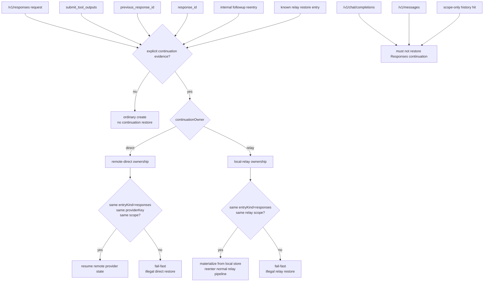
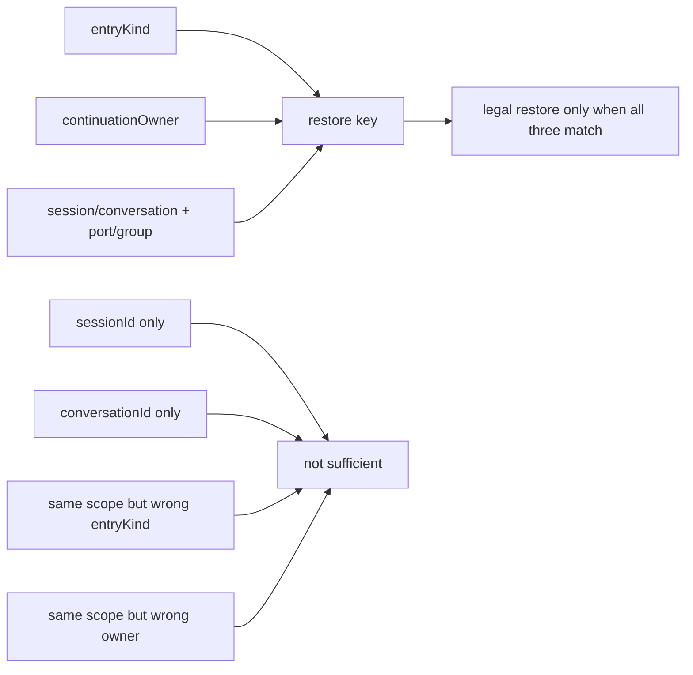
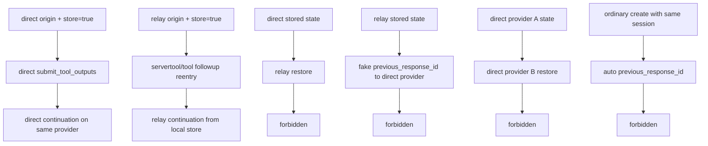

# Responses Direct Relay Map

## Purpose

这页只回答两件事：

1. `/v1/responses` 的 `direct` 和 `relay` continuation ownership 到底怎么分。
2. 哪些入口是合法 continuation，哪些 crossing 必须 fail-fast。

它是 review surface，不是第二份 SSOT。

Canonical sources:

- `docs/architecture/function-map.yml`
- `docs/architecture/verification-map.yml`
- `docs/design/responses-continuation-storage-ownership.md`
- `docs/design/pipeline-type-topology-and-module-boundaries.md`
- `docs/chat-process-continuation-state-contract.md`
- `sharedmodule/llmswitch-core/rust-core/crates/router-hotpath-napi/src/hub_pipeline_blocks/responses_resume.rs`
- `sharedmodule/llmswitch-core/rust-core/crates/router-hotpath-napi/src/shared_responses_conversation_utils.rs`
- `sharedmodule/llmswitch-core/src/conversion/shared/responses-conversation-store.ts`

Key owners:

- `hub.req_inbound_responses_context_capture`
- `responses.direct_tool_shape_contract`

## Main Rule

- continuation 不是“同 session 自动续接”，而是“保存过的状态按 ownership 明确恢复”。
- `direct + store=true` 的真源是远程 provider state。
- `relay + store=true` 的真源是本地 responses conversation store。
- 普通 `/v1/responses create` 不是 continuation 入口。
- chat/messages 入口不得因为 scope 命中旧 Responses 状态而自动恢复。

## Ownership Flow

## Entry Matrix

| Entry case | Continuation? | Owner truth | Why |
| --- | --- | --- | --- |
| Ordinary `/v1/responses create` | no | none | 普通 create 不自带恢复权 |
| `/v1/responses.submit_tool_outputs` | yes | direct or relay, depends on stored ownership | 显式续接既有 response chain |
| body has `previous_response_id` | yes | direct or relay, depends on stored ownership | 显式恢复证据 |
| body has `response_id` | yes | direct or relay, depends on stored ownership | 显式恢复证据 |
| internal followup reentry | yes | inherit origin ownership | followup 不是新协议，只是标准 create 重入 |
| known local relay restore entry | yes | relay only | 本地 store materialize 唯一路径 |
| `/v1/chat/completions` or `/v1/messages` with same session | no | none | 入口协议不匹配，禁止 scope-only 恢复 |

## Direct vs Relay Ownership

| Mode | Store truth | Restore truth | Must validate | Must not do |
| --- | --- | --- | --- | --- |
| `direct + store=false` | no saved state | no continuation right | n/a | 因 session/scope 自动补 `previous_response_id` |
| `direct + store=true` | remote provider state | same-provider direct restore only | `entryKind=responses` + `continuationOwner=direct` + same `providerKey` + same scope | 切 relay、切 provider、伪造本地 continuation |
| `relay + store=false` | no saved state | no continuation right | n/a | 因本地历史自动 materialize |
| `relay + store=true` | local responses conversation store | local materialize + normal relay reentry | `entryKind=responses` + `continuationOwner=relay` + same scope | 伪造 remote `previous_response_id`、冒充 direct 恢复 |

## Three-key Isolation

## Provider Pin

`direct` continuation 恢复后，下一跳必须 pin 回保存该状态的原 provider。这里的路由 pin 是内部 control carrier，不是 provider/client payload 字段。

| Field | Producer | Consumer | Rule |
| --- | --- | --- | --- |
| `__shadowCompareForcedProviderKey` | followup 注入 / relay restore materialize | Rust router metadata input / route selection | direct continuation 必须强校验同 provider |
| `providerKey` | remote-direct ownership record | restore/materialize path | 只是 restore 条件，不得回写 client/provider visible payload |
| `continuationOwner` | ownership store / restore | continuation legality gate | `direct` 和 `relay` 必须硬隔离 |

## Legal and Illegal Paths

## Review Findings

| Gap ID | Area | Current signal | Why it matters |
| --- | --- | --- | --- |
| `direct-relay-gap-01` | Dedicated wiki | 此前没有 direct/relay ownership 的单页 review 面 | 改 continuation/store/restore 时仍容易把 scope 当真源 |
| `direct-relay-gap-02` | Owner queryability | `function-map` 有 owner，但没有把 legal entry + illegal crossing 画成可审图面 | review 时不容易一眼看出 crossing 漏洞 |
| `direct-relay-gap-03` | Provider pin surface | `__shadowCompareForcedProviderKey` 的生产/消费链此前分散在设计文档里 | direct restore 容易被误实现成“尽量恢复”而不是“同 provider 强校验” |
| `direct-relay-gap-04` | Cross-protocol isolation | 文档已写 chat/messages 不能命中 Responses continuation，但 wiki 之前没有显式红线 | bridge 层最容易重新长出 scope-only 恢复 |
| `direct-relay-gap-05` | `store=false` semantics | 之前缺单独图面强调 `store=false` 没有恢复权 | 容易把“有历史”误当“可继续” |

## Verification Anchors

- `tests/modules/llmswitch/bridge/responses-request-bridge.request-context-normalization.spec.ts`
- `tests/sharedmodule/responses-openai-bridge-metadata-boundary.spec.ts`
- `tests/sharedmodule/native-required-exports-sse-stream.spec.ts`
- `tests/servertool/followup-runtime-provider-pin.spec.ts`
- `scripts/architecture/verify-architecture-metadata-leak-boundary.mjs`
- `npm run verify:function-map-compile-gate`

## Review Checklist

- 普通 `/v1/responses create` 是否仍不会自动 continuation。
- `direct` 恢复是否同时校验 `entryKind=responses + continuationOwner=direct + same providerKey + same scope`。
- `relay` 恢复是否只来自本地 store materialize，而不是伪造 remote `previous_response_id`。
- followup 是否只是标准 create 重入，而不是私有第二协议。
- chat/messages 入口是否完全不能命中 Responses continuation store。
- provider pin 是否仍只存在 metadata/control carrier，而不进入 provider/client payload。
