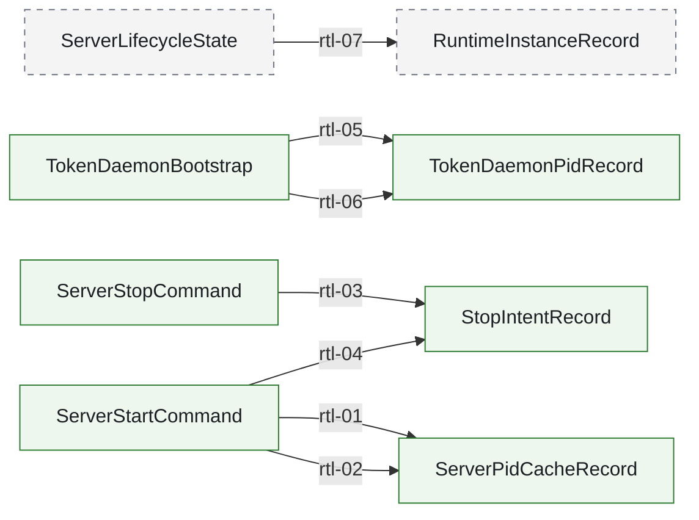

<!-- AUTO-GENERATED: do not edit by hand. Rebuild with `node scripts/architecture/render-architecture-wiki-pages.mjs`. -->
# Runtime Lifecycle Call Graph

Source of truth:
- `docs/architecture/mainline-call-map.yml` defines adjacent edges for this chain
- `docs/architecture/function-map.yml` enriches owner summary and owner module context

Render rules:
- This page is a filtered render artifact, not a second architecture truth source.
- `anchored` = verified caller/callee binding
- `partial` = edge is bound, but only part of the transition is concretely anchored
- `binding pending` = edge intentionally left unresolved until code audit pins the real bridge

## runtime.lifecycle.mainline

Managed server and token-daemon lifecycle: `ROUTECODEX_SESSION_DIR` is only the runtime workdir root; pid cache writes on start, stop-intent writes on stop, and `tmuxSessionId` / request `sessionId` / `conversationId` stay separate namespaces rather than directory-derived identity.

Entry contract: `ServerPidCacheRecord` via `docs/design/server-runtime-lifecycle-ssot.md`

| step | transition | status | caller -> callee | split binding | owner |
| --- | --- | --- | --- | --- | --- |
| rtl-01 | `ServerStartCommand -> ServerPidCacheRecord` | anchored | `writeServerPidCache -> writeServerPidCache` |  | `runtime.lifecycle.pid_cache` server pid cache lives under <rccUserDir>/state/runtime-lifecycle/ports/<port>/pid.cache; pid is a transient cache, not the authoritative runtime state |
| rtl-02 | `ServerStartCommand -> ServerPidCacheRecord` | anchored | `writeServerPidCache -> writeServerPidCache` |  | `runtime.lifecycle.pid_cache` server pid cache lives under <rccUserDir>/state/runtime-lifecycle/ports/<port>/pid.cache; pid is a transient cache, not the authoritative runtime state |
| rtl-03 | `ServerStopCommand -> StopIntentRecord` | anchored | `writeDaemonStopIntent -> writeServerStopIntent` |  | `runtime.lifecycle.stop_intent` stop-intent is a cross-process signal under <rccUserDir>/state/runtime-lifecycle/ports/<port>/stop-intent.json; it must be reaped when older than TTL |
| rtl-04 | `ServerStartCommand -> StopIntentRecord` | anchored | `consumeDaemonStopIntent -> consumeServerStopIntent` |  | `runtime.lifecycle.stop_intent` stop-intent is a cross-process signal under <rccUserDir>/state/runtime-lifecycle/ports/<port>/stop-intent.json; it must be reaped when older than TTL |
| rtl-05 | `TokenDaemonBootstrap -> TokenDaemonPidRecord` | anchored | `resolveTokenDaemonPidPath -> resolveTokenDaemonPidPath` |  | `runtime.lifecycle.pid_cache` server pid cache lives under <rccUserDir>/state/runtime-lifecycle/ports/<port>/pid.cache; pid is a transient cache, not the authoritative runtime state |
| rtl-06 | `TokenDaemonBootstrap -> TokenDaemonPidRecord` | anchored | `resolveTokenDaemonPidPath -> resolveTokenDaemonPidPath` |  | `runtime.lifecycle.pid_cache` server pid cache lives under <rccUserDir>/state/runtime-lifecycle/ports/<port>/pid.cache; pid is a transient cache, not the authoritative runtime state |
| rtl-07 | `ServerLifecycleState -> RuntimeInstanceRecord` | binding pending | `binding pending` |  | `runtime.lifecycle.instance_registry` managed server instance declaration lives under <rccUserDir>/state/runtime-lifecycle/ports/<port>/instance.json |
