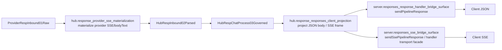

# Server Responses SSE Bridge Map

## Purpose

这页只回答两件事：

1. `server -> response handler -> SSE/JSON` 的出口 surface 在哪里，谁是 owner。
2. JSON 与 SSE 对同一响应语义的等价面是什么，哪些地方还存在缺口。

Canonical sources:

- `docs/architecture/function-map.yml`
- `docs/architecture/verification-map.yml`
- `docs/architecture/mainline-call-map.yml`
- `docs/design/pipeline-type-topology-and-module-boundaries.md`
- `docs/audits/2026-05-17-conversion-matrix-full-audit.md`
- `docs/audits/2026-05-17-regression-matrix-audit.md`

Key owners:

- `hub.response_responses_client_projection`
- `hub.response_provider_sse_materialization`
- `server.responses_sse_bridge_surface`
- `server.responses_response_handler_bridge_surface`

## Main Rule

- Rust owns client-visible Responses JSON body and SSE frame semantics.
- TS server handler may only hold framing / transport shell; the duplicate `responses-sse-bridge.ts` facade is physically deleted.
- JSON 与 SSE 对同一响应必须语义等价；不能一个通道保留 `required_action/tool_calls`，另一个 silently 丢失。

## Surface Flow

## Owner Matrix

| Feature | What it owns | Canonical builders / files | Forbidden growth |
| --- | --- | --- | --- |
| `hub.response_provider_sse_materialization` | provider raw stream -> parsed SSE/bodyText semantic materialization | `materialize_provider_response_sse_payload`, `build_provider_sse_stream_read_error_descriptor` | TS server/provider helper reimplementation |
| `hub.response_responses_client_projection` | client-visible Responses JSON body and SSE frame projection | `project_responses_client_payload_for_client`, `project_responses_client_body_for_client`, `project_responses_sse_frame_for_client` | `provider-response-converter.ts` / shared old response utils duplicate semantics |
| `server.responses_sse_bridge_surface` | SSE transport facade with deleted duplicate bridge | `src/server/handlers/handler-response-sse.ts`, owner-specific response/SSE hosts; broad `native-exports.ts` is only a private loader and forbidden owner surface | TS protocol semantics growing back into handler or deleted bridge restored |
| `server.responses_response_handler_bridge_surface` | final response lifecycle bridge for JSON/SSE dispatch | `sendPipelineResponse`, `sendSsePipelineResponse` mainline edge | second handler-local response protocol owner |

## JSON / SSE Equality Matrix

| Semantic | JSON must expose | SSE must expose | Equality rule |
| --- | --- | --- | --- |
| final completion | final response body | `response.completed` and/or `response.done` terminal event | same terminal truth |
| tool call request | final `assistant.tool_calls` or `required_action.submit_tool_outputs.tool_calls[]` | terminal/completed SSE frame with same tool-call set | same consumer-visible required action |
| tool-call ids | final body ids | SSE terminal ids | exact id equality |
| plain output text | final text field | accumulated visible text stream | semantic equality |
| custom tool output / apply_patch freeform | final client-visible body projection | SSE frame projection | same replay-safe visible tool result |
| error result | JSON error body | `event:error` / started-stream error frame | same error class |

## Server / SSE Boundary

| Layer | Allowed | Forbidden |
| --- | --- | --- |
| `handler-response-sse.ts` | write frames, manage stream transport, hold opaque native state | rebuild `required_action`, repair tool-call ids, fallback to original frame on native failure |
| `handler-response-utils.ts` | transport dispatch, internal-carrier assert, bridge handoff | parse metadata to patch response payload |
| `responses-sse-bridge.ts` | physically deleted duplicate facade | any restored runtime import |
| Rust response projection owner | all client-visible Responses payload semantics | n/a |

## Gaps / Review Findings

| Gap ID | Area | Current signal | Why it matters |
| --- | --- | --- | --- |
| `sse-gap-01` | Dedicated wiki | 此前没有 server/SSE 单独 review 面 | handler / bridge / Rust owner 边界不够直观 |
| `sse-gap-02` | Equality gate | 旧 audit 已指出 JSON 与 SSE 双通道一致性未形成统一矩阵门禁 | 容易出现一个通道绿、另一个通道 silent lossy |
| `sse-gap-03` | Tool-call terminal parity | `required_action` 在 SSE completed 与最终 JSON body 的一致性曾被点名为缺口 | 直接影响 Codex/tool-loop 客户端可用性 |
| `sse-gap-04` | Owner drift risk | TS handler/bridge 天然靠近 transport，最容易重新长出“临时修 frame”语义 | 会破坏 Rust-only client projection owner |

## Verification Anchors

- `tests/sharedmodule/responses-sse-contract-direct-native.spec.ts`
- `tests/sharedmodule/provider-response-rust-plan.spec.ts`
- `tests/server/handlers/handler-response-utils.required-action-split-frame.spec.ts`
- `tests/server/handlers/handler-response-utils.force-sse-json-responses.spec.ts`
- `tests/red-tests/server_sse_metadata_guard_e2e.test.ts`
- `tests/server/runtime/http-server/executor/provider-response-converter.prebuilt-sse-passthrough.spec.ts`
- `npm run verify:hub-response-provider-sse-materialization`
- `npm run verify:provider-response-errorerr-bypass-closeout`
- `npm run verify:responses-handler-single-bridge-surface`
- `npm run verify:server-function-map-boundary`

## Review Checklist

- 当前改动是否只在 SSE bridge facade 或 Rust response projection owner 的允许路径内。
- provider raw SSE materialization 是否仍完全由 Rust owner 决定。
- JSON / SSE 是否对 `tool_calls / required_action / terminal / error` 保持等价。
- TS handler 是否只做 transport shell，没有恢复协议语义。
- direct passthrough metadata 是否没有绕过 client-visible SSE/JSON projection。
