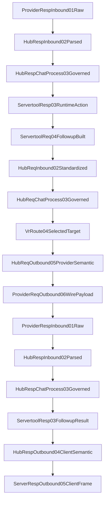
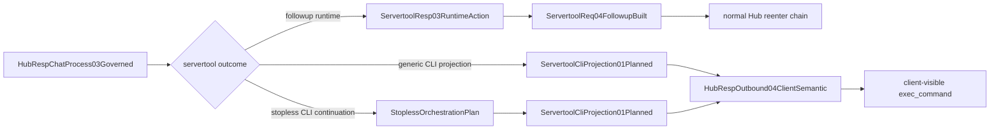
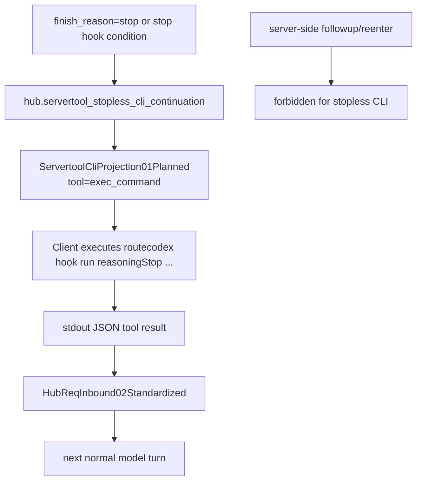

# Servertool Followup Call Graph

## Purpose

这页只回答两件事：

1. servertool followup 主链到底怎么从 `HubRespChatProcess03Governed` 回到正常请求/响应主线。
2. followup、CLI projection、stopless 三条分支分别由谁 owning，哪里绝对不能长出第二份语义。

它是 review surface，不是第二份 SSOT。

Canonical sources:

- `docs/architecture/function-map.yml`
- `docs/architecture/verification-map.yml`
- `docs/architecture/mainline-call-map.yml`
- `docs/design/servertool-rust-only-architecture.md`
- `docs/design/servertool-cli-lifecycle.md`
- `docs/design/servertool-cli-projection-migration.md`
- `docs/design/responses-continuation-storage-ownership.md`
- `docs/design/pipeline-type-topology-and-module-boundaries.md`

Key owners:

- `hub.servertool_followup`
- `hub.servertool_cli_projection`
- `hub.servertool_stopless_cli_continuation`
- `hub.servertool_orchestration_policy`

## Main Rule

- servertool 是 `HubRespChatProcess03Governed` 内部子链，不是独立 pipeline。
- followup 只能从 origin snapshot 构造，不能从当前污染 payload 猜。
- TS 只能做 runtime IO / bridge / reenter shell，不得重写工具语义。
- stopless CLI 不走 server-side followup/reenter；它走 client-visible `exec_command`。

## Mainline

## Node Boundary

| Node | What it owns | Must not do | Anchor |
| --- | --- | --- | --- |
| `HubRespChatProcess03Governed` | servertool/tool governance 唯一响应标准态 | 直接写 client frame，或从 provider raw 旁路判定 | topology doc §4.1.1 |
| `ServertoolResp03RuntimeAction` | Rust effect plan，决定 followup / client-inject / CLI projection | 用 client payload 或 SSE frame 反推语义 | `run_servertool_response_stage_json` |
| `ServertoolReq04FollowupBuilt` | 从 origin snapshot 构造 followup 请求 | 从当前污染 payload 猜工具列表/上下文 | `plan_servertool_outcome_json` |
| reenter request chain | 正常 Hub 请求主线 | servertool 私有旁路协议 | pipeline topology |
| `ServertoolResp03FollowupResult` | 选定 followup governed truth | 被 pre-followup client payload 覆盖 | Rust-only architecture |
| `HubRespOutbound04ClientSemantic` | client protocol projection 唯一出口 | servertool 专用第二投影器 | `project_hub_resp_outbound_04_from_hub_resp_chatprocess_03` |

## Branch Split

## Owner Matrix

| Feature | Owns | Canonical builders | Must not grow in |
| --- | --- | --- | --- |
| `hub.servertool_followup` | followup orchestration + post-followup governed truth | `run_servertool_response_stage_json`, `plan_servertool_outcome_json`, `project_hub_resp_outbound_04_from_hub_resp_chatprocess_03` | `src/providers`, `src/server` |
| `hub.servertool_cli_projection` | generic servertool -> client `exec_command` projection | `build_servertool_cli_projection_01_from_hub_resp_chatprocess_03` | provider runtime / executor local projection |
| `hub.servertool_stopless_cli_continuation` | stopless runtime-metadata control continuation planning | `plan_stopless_orchestration_action`, `resolve_runtime_stop_message_state_from_metadata_center`, `plan_client_exec_cli_projection_output` | handler-local stopless logic / TS reenter / adapterContext state |
| `hub.servertool_orchestration_policy` | timeout, disconnect, provider pin, followup error policy | `resolve_adapter_context_provider_key`, `compact_followup_error_reason` | scattered handler/executor policy |

## Followup vs CLI

| Path | Trigger | Who executes | Next step | Hard boundary |
| --- | --- | --- | --- | --- |
| followup runtime | internal servertool needs local execution + reenter | server-side runtime shell under Rust plan | rebuild standard request and reenter Hub request chain | 只能 relay 复入完整 Hub Pipeline |
| generic CLI projection | tool should run through normal client tool loop | client executes `exec_command` | client returns ordinary tool result next turn | 不得 server-side reenter |
| stopless CLI continuation | `stop_message_auto` / `reasoningStop` loop | client executes `exec_command` | next turn model consumes current request `tool_outputs` / runtime metadata truth | 不得再触发 server-side followup，也不得依赖 file writeback |

## Stopless Branch

## Illegal Growth

| Forbidden pattern | Why |
| --- | --- |
| handler/executor 直接决定 servertool tool 语义 | 破坏 Rust-only orchestration owner |
| followup 从当前响应 payload 猜上下文 | 会把污染 payload 当真相 |
| pre-followup `clientPayload` / `streamPipe.payload` 覆盖 post-followup truth | 会丢失真实 followup 结果 |
| stopless CLI 再走 server-side followup/reenter | 与 CLI 生命周期冲突 |
| direct/provider passthrough 进入 followup orchestration | 违反“followup 只能 relay 复入完整 Hub Pipeline” |
| provider/client payload 暴露内部 followup metadata | 违反 metadata 闭环边界 |

## Review Findings

| Gap ID | Area | Current signal | Why it matters |
| --- | --- | --- | --- |
| `followup-gap-01` | Dedicated wiki | 此前没有 followup/CLI/stopless 合并 review 图面 | servertool 分支很多，易改错层 |
| `followup-gap-02` | Split visibility | function-map 有 owner，但 followup 与 CLI 的分流边界未在单页显式对比 | 容易把 CLI 路径误补成 followup |
| `followup-gap-03` | Stopless isolation | 文档已写 stopless 不可 server-side reenter，但 wiki 之前没有单独标红 | 旧 stopless/followup 语义容易复活 |
| `followup-gap-04` | Post-followup truth | 之前缺一张图强调 `ServertoolResp03FollowupResult -> HubRespOutbound04ClientSemantic` 的唯一出口 | 容易重新用 pre-followup payload 投影 SSE/JSON |

## Verification Anchors

- `tests/sharedmodule/servertool-active-js-shadow-audit.spec.ts`
- `tests/sharedmodule/servertool-pending-session.spec.ts`
- `tests/servertool/servertool-cli-projection.spec.ts`
- `tests/servertool/stopless-cli-continuation.spec.ts`
- `tests/servertool/followup-runtime-provider-pin.spec.ts`
- `tests/server/handlers/responses-handler.servertool-cli-projection.blackbox.spec.ts`
- `tests/sharedmodule/apply-patch-chat-process-contract.spec.ts`
- `npm run verify:servertool-rust-only`

## Review Checklist

- 当前改动是在 `hub.servertool_*` owner 或允许路径里，而不是 handler/provider/executor 本地补语义。
- followup 请求是否只从 origin snapshot 构造。
- followup 是否仍然走正常 Hub request/reenter chain，而不是私有旁路。
- stopless CLI 是否仍是 client-visible `exec_command`，且不走 server-side followup。
- post-followup governed truth 是否仍是 `HubRespOutbound04ClientSemantic` 的唯一输入。
- provider pin / timeout / disconnect / error policy 是否仍只由 `hub.servertool_orchestration_policy` 收口。
