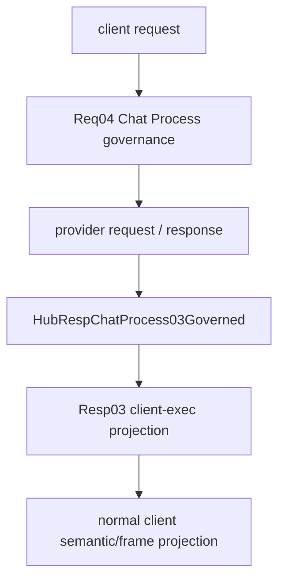
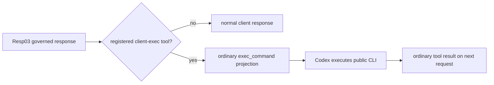

# Servertool Followup Call Graph

## Purpose

This page is a review surface for the current RouteCodex V3 servertool boundary.
The historical “followup” names remain here only so old evidence can be
identified; V3 has no server-side servertool followup or reentry path.

Canonical sources:

- `docs/architecture/v3-function-map.yml`
- `docs/architecture/v3-resource-operation-map.yml`
- `docs/architecture/v3-mainline-call-map.yml`
- `docs/architecture/v3-verification-map.yml`
- `docs/design/v3-servertool-center-skeleton.md`
- `docs/design/servertool-cli-lifecycle.md`
- `docs/design/servertool-rust-only-architecture.md`

## Main Rule

- `HubRespChatProcess03Governed` remains the response-side semantic owner.
- Req04 validates registered-tool input; Resp03 projects one ordinary
  `exec_command` call when a client-exec tool applies.
- Codex executes the public CLI through the normal tool loop and returns its
  stdout as the ordinary tool result on the next request.
- RouteCodex does not create a server-side followup request, a second kernel,
  or a servertool-specific response exit.
- Stopless, `reasoningStop`, `stop_message_auto`, and stop-response interception
  are retired. Official Stop, timer, and future memory hooks belong to the
  independent `codex-hooks` daemon/CodexApp framework.

## Mainline

```mermaid
flowchart TD
  A["client request"] --> B["Req04 Chat Process governance"]
  B --> C["provider request / response"]
  C --> D["HubRespChatProcess03Governed"]
  D --> E["Resp03 client-exec projection"]
  E --> F["normal client semantic/frame projection"]
```

The active path ends at the normal client projection. The next client request
is an ordinary tool-result request and starts at the normal request mainline.

## Node Boundary

| Node | Active responsibility | Forbidden responsibility |
| --- | --- | --- |
| `HubRespChatProcess03Governed` | Response-side registered-tool governance and projection plan | Direct client-frame construction or provider-raw semantic inference |
| Req04 governance | Validate registered call/result shape and tool input | Reconstruct hidden control state from payload or history |
| Resp03 projection | Emit one ordinary `exec_command` call with the original tool-call identity | Create a private followup request or a second response exit |
| public servertool CLI | Validate the registered tool and JSON object, then emit one projection descriptor | Execute a hidden server-side operation or mutate RouteCodex control state |
| Codex client tool loop | Execute the projected command and return stdout as ordinary tool result | Route around normal request/response governance |

## Branch Split

```mermaid
flowchart LR
  A["Resp03 governed response"] --> B{"registered client-exec tool?"}
  B -->|no| C["normal client response"]
  B -->|yes| D["ordinary exec_command projection"]
  D --> E["Codex executes public CLI"]
  E --> F["ordinary tool result on next request"]
```

There is no active `followup runtime` branch. The projection branch does not
re-enter RouteCodex; it returns to the normal client tool loop.

## Owner Matrix

| Concern | Current owner | Boundary |
| --- | --- | --- |
| registered servertool semantics | `routecodex-v3-runtime` / `servertool-core` | Typed V3 Req04/Resp03 resources and fixed hook placement |
| client-exec projection | `routecodex-v3-runtime` | One ordinary `exec_command` call and preserved tool-call pairing |
| CLI validation/projection descriptor | `routecodex-v3-cli` and `servertool-core` | JSON object validation and public command construction only |
| command execution | Codex client | Normal tool loop; result returns as ordinary input |
| wake-up hooks | independent `codex-hooks` daemon/CodexApp | `sendmessage` input boundary; outside V3 servertool flow |

## Followup vs CLI

| Historical/current path | Status | Next step |
| --- | --- | --- |
| `ServertoolResp03RuntimeAction` -> `ServertoolReq04FollowupBuilt` | Retired historical topology | Do not restore server-side reentry |
| client-exec CLI projection | Active V3 topology | Codex executes `routecodex servertool run ...`; next request carries the ordinary tool result |
| external Stop/timer/memory wake-up | Independent framework | hooksd decides whether to call CodexApp `sendmessage` |

## External Hooks Boundary

- V3 does not declare or intercept `reasoningStop` and does not own Stopless
  state or continuation.
- Hooks daemon state is separate from request/response payload and provider
  state. Working-state gating decides whether a wake-up is deferred or sent.
- A hooks sidecar being unavailable must degrade/fail-open for RouteCodex
  startup; it must never prevent the main RouteCodex service from starting.
- Hook delivery is not evidence of servertool execution, response projection,
  or a RouteCodex followup.

## Review Findings

| Gap ID | Resolution |
| --- | --- |
| `followup-gap-01` | This page now labels the old followup graph as historical and shows the active V3 client-exec path. |
| `followup-gap-02` | The current CLI projection and retired followup topology are explicitly separated. |
| `followup-gap-04` | The normal client projection is the only active response exit; no post-followup truth exists in V3. |

## Verification Anchors

- `npm run verify:v3-servertool-center-skeleton`
- `npm run verify:v3-architecture-docs`
- `npm run verify:v3-build-admission-lockstep`
- `npm run verify:architecture-wiki-html-sync`
- `npm run verify:v3-architecture-ci`

## Review Checklist

- Is the change bound to the V3 maps and the fixed Req04/Resp03 owner?
- Does the CLI remain a projection/validation shell rather than a hidden
  business-operation executor?
- Is the normal client tool loop the only active next step?
- Are Stopless and external hook wake-ups kept outside V3 servertool flow?
- Does the change avoid server-side reentry, a second kernel, a second
  response exit, and payload-carried control state?
