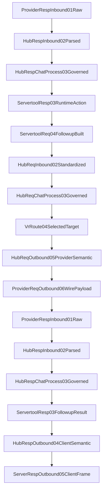
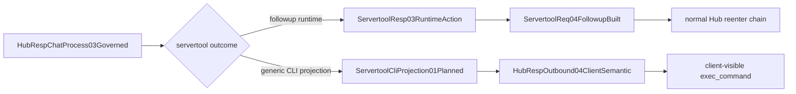

# Servertool Followup Call Graph

## Purpose

这页只回答两件事：

1. servertool followup 主链到底怎么从 `HubRespChatProcess03Governed` 回到正常请求/响应主线。
2. followup 和 CLI projection 两条分支分别由谁 owning，哪里绝对不能长出第二份语义。

它是 review surface，不是第二份 SSOT。

Canonical sources:

- `docs/architecture/function-map.yml`
- `docs/architecture/verification-map.yml`
- `docs/architecture/mainline-call-map.yml`
- `docs/design/servertool-rust-only-architecture.md`
- `docs/design/servertool-cli-lifecycle.md`
- `docs/design/servertool-cli-projection-migration.md`
- `docs/design/responses-continuation-storage-ownership.md`
- `docs/design/pipeline-type-topology-and-module-boundaries.md`

Key owners:

- `hub.servertool_followup`
- `hub.servertool_cli_projection`
- `hub.servertool_orchestration_policy`

## Main Rule

- servertool 是 `HubRespChatProcess03Governed` 内部子链，不是独立 pipeline。
- followup 只能从 origin snapshot 构造，不能从当前污染 payload 猜。
- TS 只能做 runtime IO / bridge / reenter shell，不得重写工具语义。
- client-side hook 唤醒不属于 V3 servertool followup；它由外部 hooks daemon/codexapp 通过输入接口完成。

## Mainline

```mermaid
flowchart TD
  A["ProviderRespInbound01Raw"] --> B["HubRespInbound02Parsed"]
  B --> C["HubRespChatProcess03Governed"]
  C --> D["ServertoolResp03RuntimeAction"]
  D --> E["ServertoolReq04FollowupBuilt"]
  E --> F["HubReqInbound02Standardized"]
  F --> G["HubReqChatProcess03Governed"]
  G --> H["VrRoute04SelectedTarget"]
  H --> I["HubReqOutbound05ProviderSemantic"]
  I --> J["ProviderReqOutbound06WirePayload"]
  J --> K["ProviderRespInbound01Raw"]
  K --> L["HubRespInbound02Parsed"]
  L --> M["HubRespChatProcess03Governed"]
  M --> N["ServertoolResp03FollowupResult"]
  N --> O["HubRespOutbound04ClientSemantic"]
  O --> P["ServerRespOutbound05ClientFrame"]
```

## Node Boundary

| Node | What it owns | Must not do | Anchor |
| --- | --- | --- | --- |
| `HubRespChatProcess03Governed` | servertool/tool governance 唯一响应标准态 | 直接写 client frame，或从 provider raw 旁路判定 | topology doc §4.1.1 |
| `ServertoolResp03RuntimeAction` | Rust effect plan，决定 followup / client-inject / CLI projection | 用 client payload 或 SSE frame 反推语义 | `run_servertool_response_stage_json` |
| `ServertoolReq04FollowupBuilt` | 从 origin snapshot 构造 followup 请求 | 从当前污染 payload 猜工具列表/上下文 | `plan_servertool_outcome_json` |
| reenter request chain | 正常 Hub 请求主线 | servertool 私有旁路协议 | pipeline topology |
| `ServertoolResp03FollowupResult` | 选定 followup governed truth | 被 pre-followup client payload 覆盖 | Rust-only architecture |
| `HubRespOutbound04ClientSemantic` | client protocol projection 唯一出口 | servertool 专用第二投影器 | `project_hub_resp_outbound_04_from_hub_resp_chatprocess_03` |

## Branch Split

```mermaid
flowchart LR
  A["HubRespChatProcess03Governed"] --> B{"servertool outcome"}
  B -->|followup runtime| C["ServertoolResp03RuntimeAction"]
  C --> D["ServertoolReq04FollowupBuilt"]
  D --> E["normal Hub reenter chain"]

  B -->|generic CLI projection| F["ServertoolCliProjection01Planned"]
  F --> G["HubRespOutbound04ClientSemantic"]
  G --> H["client-visible exec_command"]

```

## Owner Matrix

| Feature | Owns | Canonical builders | Must not grow in |
| --- | --- | --- | --- |
| `hub.servertool_followup` | followup orchestration + post-followup governed truth | `run_servertool_response_stage_json`, `plan_servertool_outcome_json`, `project_hub_resp_outbound_04_from_hub_resp_chatprocess_03` | `src/providers`, `src/server` |
| `hub.servertool_cli_projection` | generic servertool -> client `exec_command` projection | `build_servertool_cli_projection_01_from_hub_resp_chatprocess_03` | provider runtime / executor local projection |
| `hub.servertool_orchestration_policy` | timeout, disconnect, provider pin, followup error policy | `resolve_adapter_context_provider_key`, `compact_followup_error_reason` | scattered handler/executor policy |

## Followup vs CLI

| Path | Trigger | Who executes | Next step | Hard boundary |
| --- | --- | --- | --- | --- |
| followup runtime | internal servertool needs local execution + reenter | server-side runtime shell under Rust plan | rebuild standard request and reenter Hub request chain | 只能 relay 复入完整 Hub Pipeline |
| generic CLI projection | tool should run through normal client tool loop | client executes `exec_command` | client returns ordinary tool result next turn | 不得 server-side reenter |

## External Hooks Boundary

- V3 不再声明、注入或拦截 `reasoningStop`，也不再维护 Stopless continuation/state machine。
- 官方 Stop Hook、定时唤醒、update-goal 和后续 long-horizon hook 属于独立 hooks daemon/codexapp；它们通过 Codex 输入接口发送普通 message。
- daemon 先感知 Codex 是否 working；working 时默认不发送打扰型唤醒，非 working 时才执行发送策略。
- 外部 hooks 的消息发送不经过 servertool followup、V3 response projection 或 SSE 修复路径。

## Illegal Growth

| Forbidden pattern | Why |
| --- | --- |
| handler/executor 直接决定 servertool tool 语义 | 破坏 Rust-only orchestration owner |
| followup 从当前响应 payload 猜上下文 | 会把污染 payload 当真相 |
| pre-followup `clientPayload` / `streamPipe.payload` 覆盖 post-followup truth | 会丢失真实 followup 结果 |
| direct/provider passthrough 进入 followup orchestration | 违反“followup 只能 relay 复入完整 Hub Pipeline” |
| provider/client payload 暴露内部 followup metadata | 违反 metadata 闭环边界 |

## Review Findings

| Gap ID | Area | Current signal | Why it matters |
| --- | --- | --- | --- |
| `followup-gap-01` | Dedicated wiki | 此前没有 followup/CLI 合并 review 图面 | servertool 分支很多，易改错层 |
| `followup-gap-02` | Split visibility | function-map 有 owner，但 followup 与 CLI 的分流边界未在单页显式对比 | 容易把 CLI 路径误补成 followup |
| `followup-gap-04` | Post-followup truth | 之前缺一张图强调 `ServertoolResp03FollowupResult -> HubRespOutbound04ClientSemantic` 的唯一出口 | 容易重新用 pre-followup payload 投影 SSE/JSON |

## Verification Anchors

- `v3/crates/routecodex-v3-runtime/tests/hub_relay_tool_servertool_multiturn_parity.rs`
- `v3/scripts/architecture/verify-v3-relay-tool-servertool-multiturn-parity.mjs`
- `v3/scripts/tests/v3-relay-tool-servertool-multiturn-parity-red-fixtures.mjs`
- `npm run verify:v3-relay-tool-servertool-multiturn-parity-closeout`

## Review Checklist

- 当前改动是在 `hub.servertool_*` owner 或允许路径里，而不是 handler/provider/executor 本地补语义。
- followup 请求是否只从 origin snapshot 构造。
- followup 是否仍然走正常 Hub request/reenter chain，而不是私有旁路。
- 外部 hooks 是否保持在 daemon/codexapp 输入边界，不进入 V3 servertool followup。
- post-followup governed truth 是否仍是 `HubRespOutbound04ClientSemantic` 的唯一输入。
- provider pin / timeout / disconnect / error policy 是否仍只由 `hub.servertool_orchestration_policy` 收口。
