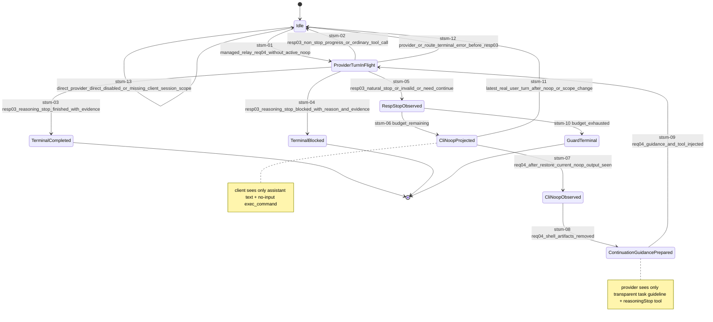

<!-- AUTO-GENERATED: do not edit by hand. Rebuild with `npm run render:v3-stopless-state-machine-docs`. -->
# Stopless Session Mainline Source

## Purpose

This page is the generated review surface for the V3 stopless lifecycle. It binds the StoplessCenter MetadataCenter state machine, the fixed Req04/Resp03 hook edges, and the generated HTML flow/state diagrams to one manifest truth.

Canonical sources:
- `docs/architecture/manifests/v3.servertool_hook_skeleton_lifecycle.mainline.yml`
- `docs/architecture/v3-resource-operation-map.yml` (`resource_id: v3.metadata.runtime_control_stopless`)
- `docs/architecture/v3-function-map.yml` (`feature_id: v3.servertool_hook_skeleton_lifecycle`)
- `docs/architecture/v3-mainline-call-map.yml` (`chain_id: v3.servertool_hook_skeleton_lifecycle`)
- `docs/architecture/v3-verification-map.yml`
- `.agents/skills/rcc-dev-skills/references/95-v3-stopless-sop.md`

Generated artifacts:
- Markdown: `docs/architecture/wiki/stopless-session-mainline-source.md`
- HTML: `docs/architecture/wiki/html/stopless-session-mainline-source.html`
- Generator: `scripts/architecture/render-v3-stopless-state-machine-docs.mjs`
- Verifier: `scripts/architecture/verify-v3-stopless-state-machine-docs.mjs`

Main rule: stopless is transparent to client/provider/agent except for the public no-input `exec_command` bridge that lets the black-box client display the stopped assistant text. StoplessCenter is the only control truth and lives in MetadataCenter/runtime_control; it never lives in CLI args/stdout, provider payload, client payload, continuation store, SSE, handler, debug snapshot, or dry-run metadata. Provider-request dry-run may read the scoped StoplessCenter state to build an observational provider request, but it must never write, clear, or advance that live state.

## Stopless Session Mainline

```mermaid
flowchart LR
  V3HubReqContinuation03Classified["V3HubReqContinuation03Classified"]
  V3HubReqChatProcess04Governed["V3HubReqChatProcess04Governed"]
  V3StoplessReq01RuntimeControlLoaded["V3StoplessReq01RuntimeControlLoaded"]
  V3StoplessReq02NoopCliConsumed["V3StoplessReq02NoopCliConsumed"]
  V3StoplessReq03GuidanceToolInjected["V3StoplessReq03GuidanceToolInjected"]
  V3HubRespChatProcess03Governed["V3HubRespChatProcess03Governed"]
  V3StoplessResp01ReasoningStopInspected["V3StoplessResp01ReasoningStopInspected"]
  V3StoplessResp02RuntimeControlUpdated["V3StoplessResp02RuntimeControlUpdated"]
  V3StoplessResp03NoopCliOrTerminalProjected["V3StoplessResp03NoopCliOrTerminalProjected"]
  V3HubRespContinuation04Committed["V3HubRespContinuation04Committed"]
  V3HubReqContinuation03Classified -->|v3-servertool-stopless-req-01| V3HubReqChatProcess04Governed
  V3HubReqChatProcess04Governed -->|v3-servertool-stopless-req-02| V3StoplessReq01RuntimeControlLoaded
  V3StoplessReq01RuntimeControlLoaded -->|v3-servertool-stopless-req-03| V3StoplessReq02NoopCliConsumed
  V3StoplessReq02NoopCliConsumed -->|v3-servertool-stopless-req-04| V3StoplessReq03GuidanceToolInjected
  V3HubRespChatProcess03Governed -->|v3-servertool-stopless-resp-01| V3StoplessResp01ReasoningStopInspected
  V3StoplessResp01ReasoningStopInspected -->|v3-servertool-stopless-resp-02| V3StoplessResp02RuntimeControlUpdated
  V3StoplessResp02RuntimeControlUpdated -->|v3-servertool-stopless-resp-03| V3StoplessResp03NoopCliOrTerminalProjected
  V3StoplessResp03NoopCliOrTerminalProjected -->|v3-servertool-stopless-resp-04| V3HubRespContinuation04Committed
```

## Stopless State Machine

## State Contract

| state | kind | stored | client-visible | provider-visible | description |
| --- | --- | --- | --- | --- | --- |
| `Idle` | `reset` | `false` | `false` | `false` | No active stopless control state for this scoped session. |
| `ProviderTurnInFlight` | `active` | `true` | `false` | `false` | A managed relay provider turn is in flight with transparent stopless guidance and exactly one internal reasoningStop declaration. |
| `RespStopObserved` | `transient` | `false` | `false` | `false` | Resp03 observed a natural stop, invalid/no evidence reasoningStop, or explicit continue signal before deciding projection or pass-through. |
| `CliNoopProjected` | `active` | `true` | `true` | `false` | Resp03 preserved visible assistant text and projected no-input exec_command for client tool-round closure. |
| `CliNoopObserved` | `transient` | `false` | `false` | `false` | Req04 after continuation restore observed the current no-op output only as tool-round completion evidence. |
| `ContinuationGuidancePrepared` | `transient` | `false` | `false` | `true` | Req04 removed no-op shell artifacts and stale generated stopless guidelines, then prepared one ordinary, transparent provider-facing current-turn continuation guideline. |
| `TerminalCompleted` | `terminal` | `false` | `true` | `false` | Resp03 accepted reasoningStop completion only when evidence is present, stripped internal tool artifacts, and cleared StoplessCenter. |
| `TerminalBlocked` | `terminal` | `false` | `true` | `false` | Resp03 accepted reasoningStop blocked only when reason and evidence are present, stripped internal tool artifacts, and cleared StoplessCenter or waits for a real user turn. |
| `GuardTerminal` | `terminal` | `false` | `true` | `false` | The configured consecutive-stop guard is reached; current provider stop passes through without no-op or internal diagnostic and StoplessCenter is cleared. |

## Edge Owners and Current Status

| step | from | to | status | owner feature | resource access |
| --- | --- | --- | --- | --- | --- |
| `v3-servertool-stopless-req-01` | `V3HubReqContinuation03Classified` | `V3HubReqChatProcess04Governed` | `anchored` | `v3.servertool_hook_skeleton_lifecycle` | consumes: `v3.request.normal_payload`, `v3.hub.continuation_ownership` produces: `v3.request.normal_payload` side_channel_reads: `v3.continuation.local_context_truth` |
| `v3-servertool-stopless-req-02` | `V3HubReqChatProcess04Governed` | `V3StoplessReq01RuntimeControlLoaded` | `anchored` | `v3.servertool_hook_skeleton_lifecycle` | consumes: `v3.request.normal_payload` produces: `v3.request.normal_payload` side_channel_reads: `v3.metadata.runtime_control_stopless` |
| `v3-servertool-stopless-req-03` | `V3StoplessReq01RuntimeControlLoaded` | `V3StoplessReq02NoopCliConsumed` | `anchored` | `v3.servertool_hook_skeleton_lifecycle` | consumes: `v3.request.normal_payload` produces: `v3.request.normal_payload` |
| `v3-servertool-stopless-req-04` | `V3StoplessReq02NoopCliConsumed` | `V3StoplessReq03GuidanceToolInjected` | `anchored` | `v3.servertool_hook_skeleton_lifecycle` | consumes: `v3.request.normal_payload` produces: `v3.request.normal_payload` side_channel_reads: `v3.metadata.runtime_control_stopless` side_channel_writes: `v3.hub.tool_governance_truth` |
| `v3-servertool-stopless-resp-01` | `V3HubRespChatProcess03Governed` | `V3StoplessResp01ReasoningStopInspected` | `anchored` | `v3.servertool_hook_skeleton_lifecycle` | consumes: `v3.hub.response_semantic` produces: `v3.hub.response_semantic` side_channel_reads: `v3.hub.static_hook_registry` |
| `v3-servertool-stopless-resp-02` | `V3StoplessResp01ReasoningStopInspected` | `V3StoplessResp02RuntimeControlUpdated` | `anchored` | `v3.servertool_hook_skeleton_lifecycle` | consumes: `v3.hub.response_semantic` produces: `v3.hub.response_semantic` side_channel_writes: `v3.metadata.runtime_control_stopless` |
| `v3-servertool-stopless-resp-03` | `V3StoplessResp02RuntimeControlUpdated` | `V3StoplessResp03NoopCliOrTerminalProjected` | `anchored` | `v3.servertool_hook_skeleton_lifecycle` | consumes: `v3.hub.response_semantic` produces: `v3.response.client_payload` side_channel_reads: `v3.metadata.runtime_control_stopless` |
| `v3-servertool-stopless-resp-04` | `V3StoplessResp03NoopCliOrTerminalProjected` | `V3HubRespContinuation04Committed` | `anchored` | `v3.servertool_hook_skeleton_lifecycle` | consumes: `v3.hub.response_semantic`, `v3.response.client_payload` produces: `v3.continuation.local_context_truth` side_channel_writes: `v3.continuation.local_context_truth` |

## State Transition Matrix

| transition | class | from | to | event | action |
| --- | --- | --- | --- | --- | --- |
| `stsm-01` | `normal` | `Idle` | `ProviderTurnInFlight` | `managed_relay_req04_without_active_noop` | Inject transparent base guidance and exactly one reasoningStop tool; no StoplessCenter write unless a prior state is being consumed. |
| `stsm-02` | `normal` | `ProviderTurnInFlight` | `Idle` | `resp03_non_stop_progress_or_ordinary_tool_call` | Clear scoped StoplessCenter; preserve normal response/tool progression. |
| `stsm-03` | `normal` | `ProviderTurnInFlight` | `TerminalCompleted` | `resp03_reasoning_stop_finished_with_evidence` | Strip internal reasoningStop artifact, preserve/replace visible completion text, clear state, no CLI projection. |
| `stsm-04` | `normal` | `ProviderTurnInFlight` | `TerminalBlocked` | `resp03_reasoning_stop_blocked_with_reason_and_evidence` | Strip internal reasoningStop artifact, preserve blocked text, clear or wait-user state, no CLI projection. |
| `stsm-05` | `normal` | `ProviderTurnInFlight` | `RespStopObserved` | `resp03_natural_stop_or_invalid_or_need_continue` | Classify stop kind and compute next consecutive stop count in MetadataCenter control, not from text/CLI/stdout. |
| `stsm-06` | `normal` | `RespStopObserved` | `CliNoopProjected` | `budget_remaining` | Store scoped StoplessCenter state and project client-visible no-input exec_command while preserving assistant visible text. |
| `stsm-07` | `normal` | `CliNoopProjected` | `CliNoopObserved` | `req04_after_restore_current_noop_output_seen` | Consume no-op output only as current-turn evidence; do not parse stdout or args. |
| `stsm-08` | `normal` | `CliNoopObserved` | `ContinuationGuidancePrepared` | `req04_shell_artifacts_removed` | Remove matching stopless shell call/output, stale internal artifacts, and previously generated stopless continuation guidelines; append exactly one transparent current-turn guideline. |
| `stsm-09` | `normal` | `ContinuationGuidancePrepared` | `ProviderTurnInFlight` | `req04_guidance_and_tool_injected` | Store scoped ProviderTurnInFlight state, then re-inject transparent guidance and exactly one internal reasoningStop tool before VR/provider wire. |
| `stsm-10` | `abnormal` | `RespStopObserved` | `GuardTerminal` | `budget_exhausted` | Do not project another no-op; pass through current finish_reason=stop response without guard/budget/counter diagnostic and clear state. |
| `stsm-11` | `abnormal` | `CliNoopProjected` | `Idle` | `latest_real_user_turn_after_noop_or_scope_change` | Reset scoped StoplessCenter and remove only stale stopless shell artifacts; preserve the real user turn verbatim. |
| `stsm-12` | `abnormal` | `ProviderTurnInFlight` | `Idle` | `provider_or_route_terminal_error_before_resp03` | Project the real error through ErrorErr chain; stopless must not synthesize success/fallback/diagnostic or retain stale client-visible bridge state. |
| `stsm-13` | `abnormal` | `Idle` | `Idle` | `direct_provider_direct_disabled_or_missing_client_session_scope` | No stopless guidance/tool/projection/control write; pass provider response through the normal path. |

## Normal Closure

- `TerminalCompleted`: only a valid model-visible `reasoningStop(stopreason=0)` with evidence closes as completed; internal tool artifacts are stripped and StoplessCenter is cleared.
- `TerminalBlocked`: only a valid model-visible `reasoningStop(stopreason=1)` with reason and evidence closes as blocked/wait-user; internal tool artifacts are stripped and StoplessCenter is cleared or waits for a real user turn.
- `Idle`: non-stop progress, ordinary tool progress, or real user turn after a stale stopless bridge resets the scoped state without changing normal user/model payload semantics.

## Abnormal Closure

- `GuardTerminal`: when the configured consecutive-stop guard is reached, stopless stops intercepting the current provider `finish_reason=stop`; it does not project another no-op and does not expose guard/budget/counter diagnostics.
- Missing client session scope, direct/provider-direct paths, disabled feature flags, and scope changes never write StoplessCenter and never inject relay stopless guidance/tool/projection.
- Provider or route terminal errors stay real ErrorErr-chain errors; stopless must not synthesize success, fallback, or diagnostics and must not retain stale bridge state as user-visible truth.

## Provider/Client Transparency Checklist

- Provider-visible continuation guidance must not mention no-op, CLI, client tool round, `routecodex hook run reasoningStop`, `finish_reason=stop`, consecutive stop count, stop budget, or guard exhaustion.
- Provider-visible continuation guidance is current-turn only: Req04 must remove earlier generated stopless continuation guidelines before appending the current one, so restored provider history never accumulates repeated stopless prompts.
- Client-visible no-op command is exactly `routecodex hook run reasoningStop` and carries no input JSON, session, conversation, scope, counter, or state.
- Provider request after no-op must remove `call_stopless_reasoning`, CLI stdout, `--input-json`, `repeatCount`, `schemaFeedback`, `runtime_control`, `metadata_center`, and other control/debug fields while preserving real tools and real history.
- Provider-request dry-run must be observational: the same live StoplessCenter state and same local continuation state must produce identical provider requests across repeated dry-runs, and dry-run must not write or clear StoplessCenter.

## Required Gates

- `npm run verify:v3-stopless-state-machine-docs`
- `npm run test:v3-stopless-state-machine-docs-red-fixtures`
- `npm run verify:v3-stopless-resource-control`
- `npm run test:v3-stopless-resource-control-red-fixtures`
- `npm run verify:v3-normalization-payload-logic-boundary`
- `npm run test:v3-normalization-payload-logic-boundary-red-fixtures`
- `cargo test --manifest-path v3/Cargo.toml -p routecodex-v3-runtime --test hub_relay_stopless_center_semantics -- --nocapture`
- `cargo test --manifest-path v3/Cargo.toml -p routecodex-v3-runtime --test hub_relay_response_semantics -- --nocapture`
- `cargo test --manifest-path v3/Cargo.toml -p routecodex-v3-runtime --test hub_relay_request_semantics -- --nocapture`
- `cargo test --manifest-path v3/Cargo.toml -p routecodex-v3-runtime --test hub_relay_response_stopless_live_shapes -- --nocapture`
- `cargo test --manifest-path v3/Cargo.toml -p routecodex-v3-runtime --test hub_relay_tool_servertool_multiturn_parity -- --nocapture`
- `cargo test --manifest-path v3/Cargo.toml -p routecodex-v3-runtime --test responses_relay_local_continuation_integration -- --nocapture`
- `cargo test --manifest-path v3/Cargo.toml -p routecodex-v3-runtime --test responses_direct_tool_passthrough -- --nocapture`

## Active Gaps

- `stopless-gap-03`: historical wording that treats stopless as sessionDir/CLI-persisted state must keep failing gates; StoplessCenter is MetadataCenter control truth only.
- `stopless-gap-04`: stopless and Responses continuation restore/save must remain separate owners; any logic in the immutable interval is a regression.
- `stopless-gap-05`: runtime workdir/sessionDir may exist for CLI/server process plumbing, but it must not become stopless identity or control-state truth.

## Review Checklist

- Resp03 projects no-input CLI or transparent terminal/pass-through before Resp04 continuation commit.
- Req04 runs only after continuation/local context restore; it consumes no-op output only as evidence and loads StoplessCenter from MetadataCenter/runtime_control.
- Req04 removes stale generated stopless continuation guidelines before appending one current-turn guideline.
- Provider-request dry-run reads StoplessCenter for projection only and does not commit StoplessCenter transitions.
- The state diagram includes both normal and abnormal terminal/reset edges.
- The HTML page is generated from this Markdown and contains both the lifecycle flowchart and the state transition diagram.
