# Stopless Session Mainline Source

## Purpose

This page is the review surface for the stopless runtime-metadata continuation mainline. It is the only canonical place to read the current owner binding, mainline edges, gate coverage, and the current "no file / no tmux / no sessionDir dependency" closure status proved by `tests/servertool/stopless-cli-continuation.spec.ts`.

This is not a second source of truth. The mechanical edges live in `docs/architecture/mainline-call-map.yml` (`chain_id: stopless.session.mainline`) and the owner / gate policy lives in `docs/architecture/function-map.yml` and `docs/architecture/verification-map.yml` (`feature_id: hub.servertool_stopless_cli_continuation`). The Mermaid figure below is a render artifact and must not be hand-edited.

## Stopless Session Mainline

```mermaid
flowchart LR
  StoplessResp01StopDetected["StoplessResp01StopDetected"]
  StoplessResp02SchemaGateEvaluated["StoplessResp02SchemaGateEvaluated"]
  StoplessState03RuntimeSnapshotResolved["StoplessState03RuntimeSnapshotResolved"]
  StoplessCli04ProjectionPlanned["StoplessCli04ProjectionPlanned"]
  StoplessCli06ClientExecuted["StoplessCli06ClientExecuted"]
  StoplessReq08NextTurnMaterialized["StoplessReq08NextTurnMaterialized"]
  VrRoute04SelectedTarget["VrRoute04SelectedTarget"]

  StoplessResp01StopDetected -->|stl-01| StoplessResp02SchemaGateEvaluated
  StoplessResp02SchemaGateEvaluated -->|stl-02| StoplessState03RuntimeSnapshotResolved
  StoplessState03RuntimeSnapshotResolved -->|stl-03| StoplessCli04ProjectionPlanned
  StoplessCli04ProjectionPlanned -.->|stl-04| StoplessCli06ClientExecuted
  StoplessCli06ClientExecuted -.->|stl-05| StoplessReq08NextTurnMaterialized
  StoplessReq08NextTurnMaterialized -->|stl-06| VrRoute04SelectedTarget
```

## Edge Owners and Current Status

| step | transition | owner_feature_id | status | mainline edge note |
| --- | --- | --- | --- | --- |
| stl-01 | stop response detected | `hub.servertool_stopless_cli_continuation` | anchored | `runServerToolOrchestration` routes stopless detection into the servertool handler. |
| stl-02 | runtime snapshot resolved | `hub.servertool_stopless_cli_continuation` | anchored | stopless state is restored from runtime metadata or the current request `tool_outputs`, not from persisted file state. |
| stl-03 | CLI projection planned | `hub.servertool_stopless_cli_continuation` | anchored | `buildServertoolCliProjectionForAutoFlow` builds the client-visible CLI command with status-only input. |
| stl-04 | client executes the CLI | `hub.servertool_stopless_cli_continuation` | anchored | `routecodex hook run reasoning_stop` executes without `sessionDir/sessionId/requestId` flags. |
| stl-05 | CLI result materialized for next turn | `hub.servertool_stopless_cli_continuation` | anchored | auto-projected CLI result is restored from the next request body/runtime metadata and not replayed as model-owned history. |
| stl-06 | VR routes stopless turn to thinking | `hub.servertool_stopless_cli_continuation` | anchored | route selection forces the next turn into thinking rather than reusing the stopless CLI result as history. |

## Owner / Allowed / Forbidden Path Summary

- Owner module: `sharedmodule/llmswitch-core/rust-core/crates/servertool-core/src`.
- Allowed paths include `sharedmodule/llmswitch-core/src/servertool/{cli-projection,engine}.ts`, `sharedmodule/llmswitch-core/src/servertool/handlers/stop-message-auto.ts`, and `sharedmodule/llmswitch-core/src/native/router-hotpath/native-servertool-core-semantics.ts`.
- Forbidden paths: `src/providers`, `src/server/runtime/http-server/executor`, and unrelated `sharedmodule/llmswitch-core/src/servertool/handlers` surfaces that do not own stopless CLI semantics.

## Required Gates

- `cargo test -p servertool-core cli_contract --lib`
- `cargo test -p servertool-core persisted_lookup --lib`
- `cargo test -p servertool-cli --test cli_blackbox`
- `node --experimental-vm-modules ./node_modules/.bin/jest tests/servertool/stopless-cli-continuation.spec.ts --runInBand`
- `node --experimental-vm-modules ./node_modules/.bin/jest tests/servertool/servertool-cli-projection.spec.ts --runInBand`
- `npm run verify:architecture-mainline-call-map`
- `npm run verify:function-map-compile-gate`

## Active Gaps

- `stopless-gap-01`: broader docs/wiki/html artifacts outside this page still contain some older persisted/sessionDir wording and need a follow-up sweep.
- `stopless-gap-03`: stopless 曾被误读为 session-scoped persisted continuation；当前已改成 runtime metadata/current-turn `tool_outputs` owner，但历史命名和审计路径仍需持续防回潮。
- `stopless-gap-04`: stopless 与 protocol-independent continuation 的边界此前不显式；当前已补文档，但仍需要在更大 session/state 审计里持续复核。
- `stopless-gap-05`: `ROUTECODEX_SESSION_DIR` 仍是共享 runtime workdir root；虽然 stopless 已脱离它，但目录物理拆分是否推进仍待后续总体 closeout 决策。

## Recent Closures

- stopless no longer depends on file persistence, tmux, or `ROUTECODEX_SESSION_DIR`.
- stopless CLI command and CLI stdout no longer require `sessionId/requestId`.
- next-turn restoration is now locked to current request `tool_outputs` / runtime metadata.
- stopless is not treated as protocol-independent continuation; it must stay out of persisted continuation/file-state owners.

## Review Checklist

- stopless does not depend on tmux, file state, or `sessionDir`.
- CLI projection stays in the stopless owner.
- the next turn is materialized from current request CLI truth / runtime metadata, not from a second fallback path.
