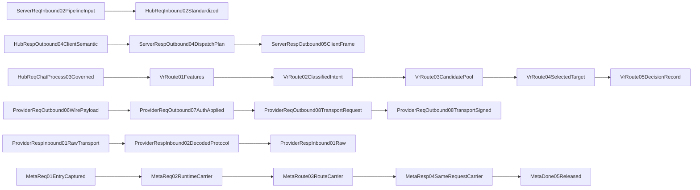

# Topology Residual Node Review

## Purpose

This page closes the topology review debt that was previously budgeted in `docs/architecture/topology-sync-manifest.yml`.
These nodes are declared in `docs/design/pipeline-type-topology-and-module-boundaries.md` as stable topology contracts but are not first-class mainline call-map edges yet.

## Main Rule

Residual topology nodes are review-surface contracts, not permission to add runtime shortcuts.
They may describe transport detail, server dispatch detail, Virtual Router internal phases, or metadata carriers, but they must not become a second request/response pipeline.

## Residual Topology Surface

## Node Matrix

| Node | Contract Role | Current Review Surface | Must Not Do |
| --- | --- | --- | --- |
| `ServerReqInbound02PipelineInput` | server entry input after raw HTTP capture | topology-only server handoff contract | build provider wire body |
| `ServerRespOutbound04DispatchPlan` | server response dispatch plan before client frame write | topology-only server dispatch contract | repair Hub history or provider semantics |
| `VrRoute01Features` | route feature extraction phase | Virtual Router internal phase contract | mutate request payload |
| `VrRoute02ClassifiedIntent` | route intent classification phase | Virtual Router internal phase contract | choose provider by provider-specific payload patch |
| `VrRoute03CandidatePool` | route candidate pool phase | Virtual Router internal phase contract | execute retry/reroute policy locally in caller |
| `VrRoute05DecisionRecord` | route decision record after selected target | Virtual Router internal phase contract | become client-visible response truth |
| `ProviderReqOutbound07AuthApplied` | provider auth/header application phase | provider runtime transport detail | perform Hub tool governance |
| `ProviderReqOutbound08TransportRequest` | provider HTTP/SDK transport request phase | provider runtime transport detail | reselect route or inject metadata into body |
| `ProviderReqOutbound08TransportSigned` | optional signed transport tail phase | topology tail-extension example | insert a mid-chain shortcut |
| `ProviderRespInbound01RawTransport` | provider raw transport response phase | provider runtime transport detail | parse into client response directly |
| `ProviderRespInbound02DecodedProtocol` | provider decoded protocol phase | provider runtime decode detail | swallow parse errors as success |
| `MetaReq01EntryCaptured` | metadata captured at request entry | Rust contract help carrier | enter provider/client normal payload |
| `MetaReq02RuntimeCarrier` | request-scoped runtime metadata carrier | Rust contract help plus `meta_error_carriers.rs` | persist as live metadata object |
| `MetaResp04SameRequestCarrier` | same-request response metadata carrier | Rust contract help carrier | restore another request/session state |

## Owner Matrix

| Family | Nodes | Owner Surface |
| --- | --- | --- |
| Server runtime | `ServerReqInbound02PipelineInput`, `ServerRespOutbound04DispatchPlan` | `src/server/handlers/*`, `src/server/runtime/http-server/*` shell surfaces; function-map owners remain server-specific |
| Virtual Router | `VrRoute01Features`, `VrRoute02ClassifiedIntent`, `VrRoute03CandidatePool`, `VrRoute05DecisionRecord` | `sharedmodule/llmswitch-core/rust-core/crates/router-hotpath-napi/src/virtual_router_engine/` |
| Provider runtime | `ProviderReqOutbound07AuthApplied`, `ProviderReqOutbound08TransportRequest`, `ProviderReqOutbound08TransportSigned`, `ProviderRespInbound01RawTransport`, `ProviderRespInbound02DecodedProtocol` | provider runtime transport/codec owner surfaces |
| Metadata carrier | `MetaReq01EntryCaptured`, `MetaReq02RuntimeCarrier`, `MetaResp04SameRequestCarrier` | Rust contract help: `hub_pipeline_contracts`; runtime carrier type: `meta_error_carriers.rs` |

## Review Findings

topology-residual-gap-01: These nodes are now reviewable through this wiki page instead of being hidden in the debt manifest.

topology-residual-gap-02: Nodes listed here remain topology contracts unless a future slice binds them to concrete adjacent `mainline-call-map.yml` edges.

topology-residual-gap-03: Adding a new residual node must update this page, the topology manifest counts, and the relevant owner map before implementation.

## Verification

- `npm run verify:architecture-topology-doc-sync`
- `npm run verify:architecture-topology-type-consistency`
- `npm run verify:architecture-wiki-sync`
- `npm run verify:architecture-wiki-html-sync`
