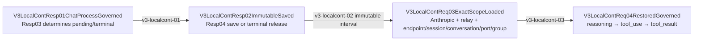

# V3 Anthropic Relay Local Continuation

Canonical plan: [implementation plan](../../goals/v3-anthropic-relay-local-continuation-integration-plan.md) · [test design](../../goals/v3-anthropic-relay-local-continuation-test-design.md) · [machine manifest](../manifests/v3.anthropic_relay.local_continuation.mainline.yml) · [HTML review surface](v3-anthropic-relay-local-continuation.html)

Owner feature: `v3.anthropic_relay_local_continuation_integration`.

## Contract

- Response Chat Process is the only save/release owner. A response with pending tool calls saves the canonical provider response under every pending call ID; terminal success releases only the restored IDs.
- The immutable interval permits typed codec/store transport, expiry, exact scope validation, and release only. It does not infer `required_action`, rebuild history/context outside Req04, or repair malformed tool ordering.
- Request Chat Process is the only restore owner. Anthropic `tool_result.tool_use_id` identifies the record; all referenced call IDs must resolve under the same Anthropic Relay endpoint/session/conversation/port/routing-group scope and the same immutable context.
- Req04 prepends the exact saved reasoning/tool calls to the current tool outputs. Provider/client payloads never receive owner, scope, store, metadata, debug, auth, or route-control truth.
- Responses Direct, OpenAI Chat, remote/provider-owned continuation, Server handlers, SSE framing, and Provider WebSocket transport cannot read or write this resource.

## Positive and negative matrix

| Path | Required result |
|---|---|
| JSON tool call → JSON tool result | save one context, restore ordered reasoning/call/output, terminal release |
| SSE tool call → JSON tool result | materialize canonical response once at Resp04, same restore/release |
| multiple pending tool calls | all IDs alias one immutable canonical context; all tool results restore and release |
| provider failure after restore | Error01-06, no success projection, saved truth retained |
| wrong endpoint/session/conversation/port/group or expired ID | fail before provider send; no fallback |
| success/failure/already-terminal | explicit non-save/no-revival outcome |

## Completion boundary

The verified surface is controlled Rust Runtime replay. It does not claim live provider compatibility, config mutation, global install, restart, or production cutover.
