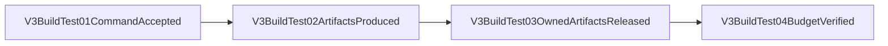

# V3 Build Test Artifact Budget

## Contract

The RouteCodex-owned V3 Cargo test target has a 2 GiB steady-state allocation budget. The build-tooling owner removes test-owned outputs after every canonical V3 Cargo test and retains reusable dependency artifacts while they fit inside that budget. An explicit `CARGO_TARGET_DIR` is namespaced under `routecodex-v3-test`, so idle over-budget Cargo test-profile cleanup cannot remove unrelated workspace artifacts; an active external builder makes cleanup fail explicitly.

The canonical lock records both PID and process-start identity. Acquisition derives the current wrapper identity without process enumeration and removes the lock directory if owner initialization fails. Inspection normalizes `ps` output under the `C` locale before comparing identities. A matching live process keeps ownership; a dead process or a reused PID makes the lock stale and reclaimable. If a restricted environment denies inspection of another live process's start identity, exclusivity is retained only for a bounded lease.

## Ownership

- Command and cleanup owner: `scripts/run-v3-cargo-test.mjs`.
- Direct Cargo test runner: `scripts/cargo-test-artifact-runner.mjs`.
- Profile owner: `v3/Cargo.toml`.
- Module registry: `docs/architecture/v3-build-tool-module-registry.yml`.

## Allowed Cleanup

- Test executables emitted by the current Cargo invocation.
- Matching test dep-info and `rcgu.o` intermediates whose filenames match executables reported by this invocation.
- The complete Cargo test profile inside the RouteCodex-owned target namespace only when the retained cache exceeds 2 GiB and no other V3 builder is active.

## Forbidden Cleanup

- Reusable dependency `rlib`, `rmeta`, proc-macro, fingerprint, or build-script artifacts while the cache is within budget.
- Timestamp-new object files, runtime source, payload, control-plane resources, installed releases, live samples, another invocation's artifacts, or any artifact outside the RouteCodex-owned target namespace.

## Failure

After owned cleanup, allocation above 2 GiB is a build failure. There is no silent success, runtime fallback, or payload-side compensation.
