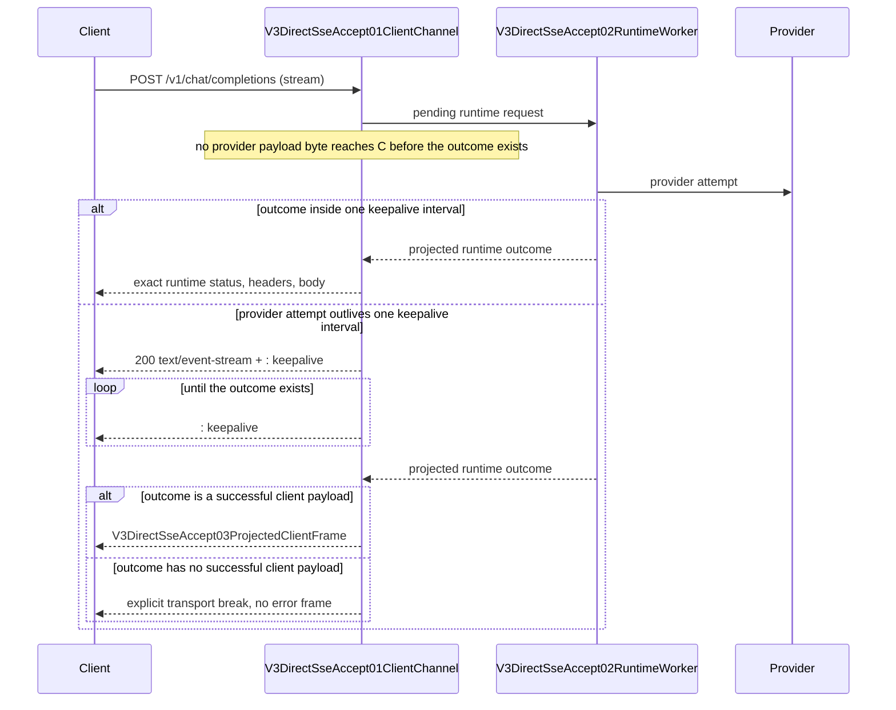

# V3 Client SSE Transport Channel

`v3.client_sse_head_commit` is the Server-owned client transport boundary that
keeps a streamed client connection observable while the Runtime still buffers a
complete provider attempt. It implements the declared client accept channel node
`V3DirectSseAccept01ClientChannel` and the projected client frame node
`V3DirectSseAccept03ProjectedClientFrame` of `v3.direct_sse_accept_skeleton`.

The Server owns the listener, HTTP framing, and the client transport. The Runtime
owns full-attempt buffering: no provider payload byte reaches the client before
the runtime outcome exists. These two ownerships meet at exactly one place — the
committed client SSE transport channel.

## Ownership

The channel owner is the independent module
`routecodex-v3-server/src/client_sse_transport.rs`:

1. `accept_v3_client_sse_transport` races the pending runtime future against one
   keepalive interval and either returns the runtime outcome unchanged or commits
   the channel.
2. `commit_v3_client_sse_channel` builds the committed channel. The channel
   carries only transport framing: status `200`, `content-type: text/event-stream`,
   and `cache-control: no-cache`. It is not a semantic client commit.
3. `V3ClientSseChannelStream` writes one keepalive comment immediately, then one
   keepalive per keepalive interval while the runtime outcome is pending, and then
   hands the client transport to the projected outcome body.
4. The committed body owns the pending runtime task. When the client transport
   goes away, `Drop` aborts that task, so a client disconnect still cancels the
   in-flight runtime request.

The commit decision owner is the Server entry `pending_model_request`:

- `v3_request_wants_sse` selects the boundary. A non-SSE client keeps waiting for
  the runtime outcome and never receives a committed channel.
- The deferred runtime outcome is projected through the same model-entry
  `commit_model_transport_outcome` path the entry handler applies, so the deferred
  outcome is not a second projection owner.

## Projection of the committed client payload

The transport module reads only the HTTP status and content type of the
already-projected runtime outcome. It never parses, reclassifies, or rewrites the
payload.

- A successful `text/event-stream` outcome drains through unchanged. The drained
  SSE body owns the transport framing and the keepalive from that point on, so the
  channel stops emitting keepalives. The keepalive has exactly one owner at a time.
- A successful non-SSE outcome is carried by SSE transport framing of the
  committed bytes (`build_v3_client_sse_data_frame`). Each payload line becomes
  its own `data:` field, built through the `routecodex-v3-sse` transport codec.
  A successful outcome must never become a client transport failure.
- An outcome without a successful client payload closes the client transport
  without projecting a provider status, error payload, or fabricated success.

## Invariants

- The Server owns the committed client SSE transport channel and its
  transport-only keepalives; the Runtime still fully buffers the provider attempt
  before any provider payload projection.
- Establishing the channel is not a semantic client commit.
- No provider payload byte or provider status reaches the client before the
  runtime outcome exists.
- An outcome that arrives inside one keepalive interval returns the exact runtime
  status, headers, and body. The race adds no framing of its own.
- A client never receives a provider error payload on the committed channel. The
  Error chain records and prints the cause, and candidate switching stays inside
  the Runtime before any client payload is committed.
- Provider error detail, internal status, and pool-exhaustion text never appear in
  a committed client body.
- Keepalive is an SSE comment, never an event, JSON payload, metadata field, or
  terminal marker.
- The transport module must not import Runtime, provider transport, or
  payload-parsing code.

## Exec replacement drain

The same Server boundary bounds transport closing during an exec replacement in
`V3ServerAggregateHandle::prepare_for_exec`:

1. stop the listener accept loops so no new client request is admitted;
2. wait up to `V3_EXEC_INFLIGHT_DRAIN` (5s) on `v3.front.request_activity_gate`
   for the in-flight client requests to reach quiescence;
3. freeze the handoff and close the remaining client transports.

`V3StableFrontSocket` writes both normal and queued-before-close response frames
through one `write_front_response_frame` path. On the close signal it drains the
queued frames for at most `V3_FRONT_CLOSE_FLUSH` (500ms) before closing, so a
response already queued for the client is not dropped at the close boundary.

The drain is bounded. A provider attempt that never finishes must not hold the
replacement open forever, and the drain never fabricates a client error for a
response it did not deliver.

## Gate

- `npm run test:v3-client-sse-head-commit` — client SSE transport channel unit
  behaviour.
- `npm run test:v3-client-transport-boundary` — controlled black-box cases through
  the public `/v1/chat/completions` entry.
- `npm run verify:v3-client-sse-head-commit` — ownership, map, and manifest
  bindings.

These gates are sub-gates of `verify:v3-architecture-ci`. They are
source-controlled evidence only: live install, restart, and provider
compatibility require separate evidence.

## Contract authorization

The owner approved this contract change in the working session on 2026-10-05,
while the client-visible silent-connection defect was being fixed:

- a client must never receive an error return; errors are recorded and printed in
  the Error chain, and the provider switches inside the Runtime before any client
  payload is committed;
- the fix must conform to the declared `v3.direct_sse_accept_skeleton` contract
  instead of restoring the pre-runtime front commit path removed by `3a96357c3`.

That decision is what `AGENTS.md` records as the transport-accept exemption: the
transport accept is not a semantic client commit, the Runtime still fully buffers
the provider attempt, and the committed client channel never projects a provider
error.
