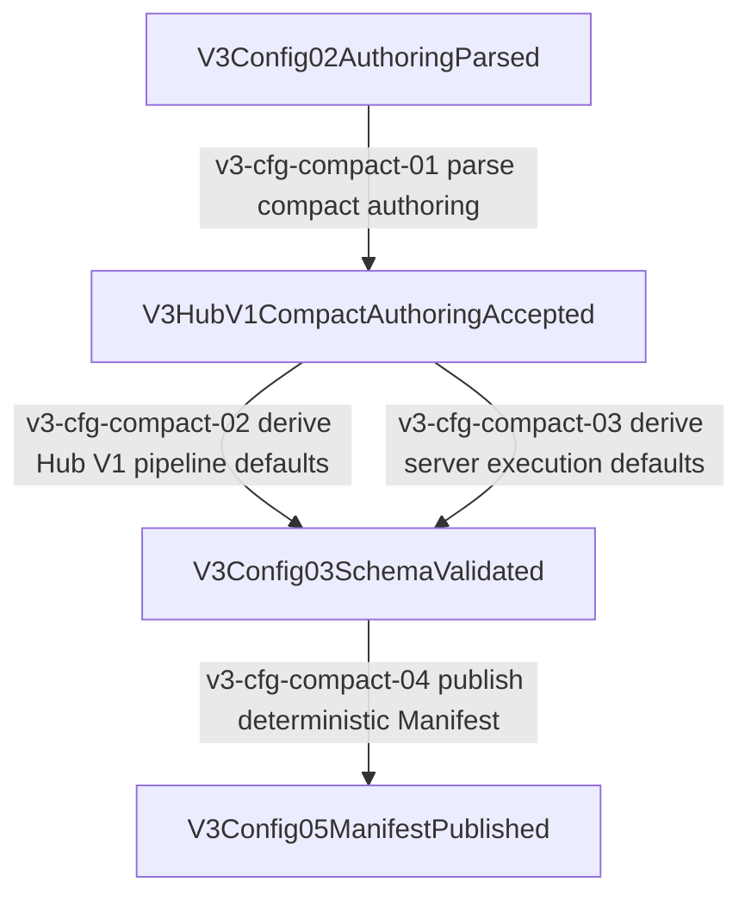

# V3 Config Compact Hub V1 Defaults SOP

## Contract

This SOP locks the compact native V3 authoring path for fixed Hub V1 internals.
User config may declare only the pipeline identity:

```toml
[pipelines.hub_v1]
skeleton = "hub_v1"
```

The closed endpoint bindings, hook set, runtime resource declarations, and server execution policy are derived only inside `routecodex-v3-config` before `V3Config05ManifestPublished`.
Runtime, Server, Provider, Virtual Router, and Compat may consume only the published Manifest and must not read source config or rebuild these defaults.

## Mainline



## Allowed Owners

- `v3/crates/routecodex-v3-config/src/types.rs`
- `v3/crates/routecodex-v3-config/src/defaults.rs`
- `v3/crates/routecodex-v3-config/src/validate.rs`
- `v3/crates/routecodex-v3-config/src/lib.rs`
- `v3/crates/routecodex-v3-config/tests/config_v3_contract.rs`

## Forbidden Owners

- `routecodex-v3-runtime`
- `routecodex-v3-server`
- `routecodex-v3-provider-*`
- `routecodex-v3-virtual-router`
- `routecodex-v3-target`
- compat/provider wire codecs
- live `~/.rcc` mutation as a substitute for config compiler truth

## Default Truth

- `default_hub_v1_authoring()` owns fixed entry protocols, endpoint bindings, runtime owner symbols, hook resources, and hook lifecycle declarations.
- `default_server_execution()` owns allowed modes, invocation sources, transports, continuation owners, and continuation scope keys.
- `compile_hub_v1()` may fill omitted Hub V1 internals from `default_hub_v1_authoring()`.
- `compile_servers()` may fill omitted Hub V1 server execution from `default_server_execution()`.

## Review Checklist

- Compact authoring does not expose fixed hook/resource lifecycle boilerplate to user config.
- Defaults are derived before Manifest publication.
- Published Manifest remains deterministic.
- Runtime/Server/Provider do not read source config files or rebuild default Hub declarations.
- V2 compatibility uses the same default owner instead of carrying a copied default block.
- Changing this path requires updating `docs/architecture/v3-mainline-call-map.yml` and `docs/architecture/v3-architecture-audit-locks.yml` fingerprints.

## Gates

- `CARGO_NET_OFFLINE=true cargo test --manifest-path v3/Cargo.toml -p routecodex-v3-config --test config_v3_contract -- --nocapture`
- `npm run verify:v3-architecture-docs`
- `npm run verify:architecture-wiki-sync`
- `npm run render:architecture-wiki-html`
- `npm run verify:architecture-wiki-html-sync`
- `npm run verify:function-map-compile-gate`
- `git diff --check`

## Completion Scope

This SOP claims source/config-contract closure only. It does not claim global install, restart, live 5555 behavior, provider credentials, or live config mutation.
