# V3 Config and Server Full-Function Review

Canonical plan: [V3 Config and Server Full-Function Completion Plan](../../goals/v3-config-server-full-function-plan.md).

## Review surface

```mermaid
flowchart LR
  C1[V3Config01FileSource] --> C2[V3Config02AuthoringParsed]
  C2 --> C3[V3Config03SchemaValidated]
  C3 --> C4[V3Config04ResourceRegistryBuilt]
  C4 --> C5[V3Config05ManifestPublished]
  C5 --> S1[V3ServerStartup01ListenerSetPreflight]
  S1 -->|bind every listener first| H[HTTP boundary]
  H -->|valid POST + JSON + size| R[V3Server03HttpRequestRaw]
  H -->|invalid| E1[V3Error01SourceRaised]
  E1 --> E2[V3Error02Classified]
  E2 --> E3[V3Error03TargetLocalAction]
  E3 --> E4[V3Error04TargetExhaustionDecision]
  E4 --> E5[V3Error05ExecutionDecision]
  E5 --> E6[V3Error06ClientProjected]
  R -->|responses only| P6[P6 Runtime Direct]
  R -->|messages chat gemini| NI[explicit not_implemented]
```

## Config declarations

- Unique IO owner: `V3ConfigStore`.
- Manifest declarations: listeners, provider protocol/auth/model/alias/capability/health/concurrency, forwarders, route pools, typed pool match, Debug/Error, Hub hook IDs, execution modes, transports, invocation sources, continuation owners, full isolation scope.
- Forbidden manifest truth: selected route, expanded target, selected provider, resolved secret, request-specific execution or continuation decision.
- Fail-fast: unknown fields/IDs/protocols/hooks/capabilities, duplicate or ambiguous aliases, invalid references/cycles/matches/capability combinations, empty default pools.

## Server boundary

- Aggregate startup binds all enabled listeners before spawning any serving task. One bind failure releases all preflight listeners.
- Business endpoints use explicit POST dispatch. Health/models/Debug reads use explicit GET; Debug Dry Run uses explicit POST.
- Missing/wrong content type, malformed JSON, overflow, wrong method, unknown path project Error01-06 before Runtime.
- No synthetic `raw_body_bytes` or `body_read_error` payload exists.

## Checklist

- [x] Config/Server resources bind real Rust symbols.
- [x] P6 `/v1/responses` remains sole executable business path.
- [x] Other protocols remain explicit `not_implemented`.
- [x] Relay, continuation runtime, Chat Process, Hub cutover, P6 deletion, V2/live/global install remain out of scope.
- [ ] Completion requires mapped gates plus actual CLI/HTTP/controlled-upstream replay evidence.
