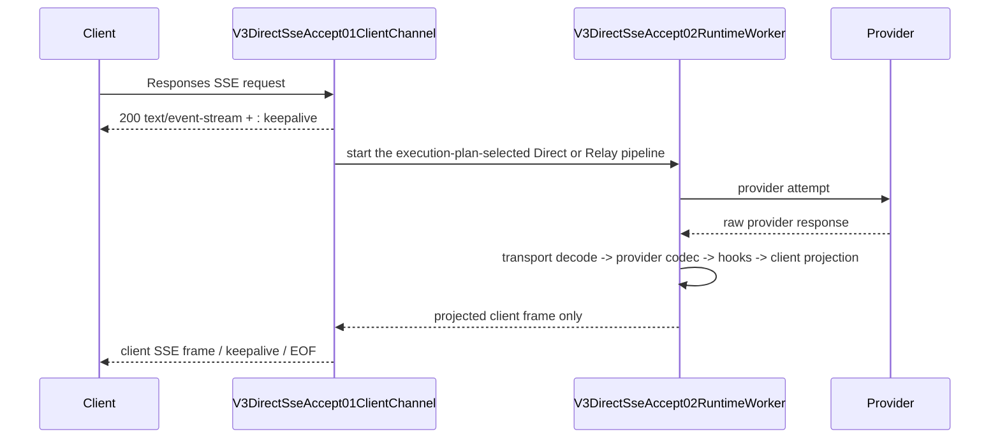

# V3 Direct SSE Accept Skeleton

`v3.direct_sse_accept_skeleton` is the fixed Responses SSE Front transport
boundary shared by Direct and Relay. The historical feature id remains for
map compatibility; the Front does not choose Direct or Relay and never
inspects provider response shape.

## Frozen skeleton

The skeleton owner is `routecodex-v3-server/src/endpoint_handlers.rs`:

1. `V3DirectSseAccept01ClientChannel` is selected for Responses client SSE
   intent before provider execution completes. The request-stage execution
   plan owns Direct versus Relay; this Front boundary does not select it.
2. The channel returns `text/event-stream` and owns the transport-only
   heartbeat through `v3_io_sse_body`.
3. `V3DirectSseAccept02RuntimeWorker` runs the execution-plan-selected pipeline
   in the background. It owns no provider semantics and does not select a
   provider.
4. `V3DirectSseAccept03ProjectedClientFrame` forwards only the response already
   projected by the selected runtime. Provider raw SSE never crosses this edge.

The following are skeleton invariants and may not be changed by later hooks or
compatibility features:

- provider failure before the first semantic client event stays in the Error
  chain and can trigger the existing reselect policy while the client channel
  remains open;
- after semantic client commitment, the current stream may close and update
  side-channel health, but it cannot reroute or rebuild the current response;
- heartbeat is an SSE comment, never a Responses event, JSON payload, tool
  result, metadata field, or terminal marker;
- feature work may extend typed hooks inside the runtime projection boundary,
  but may not replace the accept channel, worker, or projected-frame edge;
- Direct and Relay share this Front transport skeleton; only their typed runtime
  codec/projector differs behind the worker edge.

## Allowed extension points

Features may add behavior only in the registered typed protocol hook/catalog or
provider codec owners. They must preserve the three skeleton nodes and both
adjacent edges, add a positive and reverse test, and update the maps before
implementation.

## Gate

Run `npm run verify:v3-direct-sse-accept-skeleton`. The gate checks source
markers, owner symbols, map/manifest lockstep, and forbidden ownership. It is a
sub-gate of `verify:v3-architecture-ci` and therefore runs before V3 builds.
