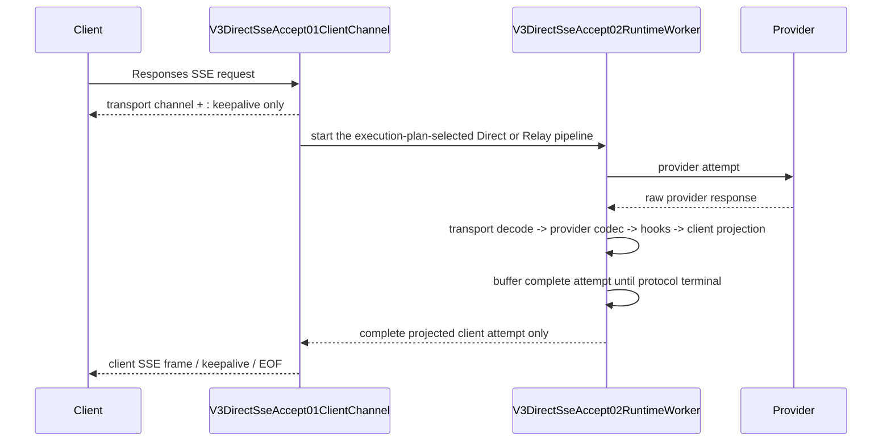

# V3 Direct SSE Accept Skeleton

`v3.direct_sse_accept_skeleton` is the fixed Responses SSE Front transport
boundary shared by Direct and Relay. The historical feature id remains for
map compatibility; the Front does not choose Direct or Relay and never
inspects provider response shape.



## Frozen skeleton

The skeleton owner is `routecodex-v3-server/src/endpoint_handlers.rs`:

1. `V3DirectSseAccept01ClientChannel` is selected for Responses client SSE
   intent before provider execution completes. The request-stage execution
   plan owns Direct versus Relay; this Front boundary does not select it.
   The concrete shared accept owner is `V3FrontSseAcceptSkeleton`; the
   request-intent owner is the single `v3_request_wants_sse` helper in the
   server entry module.
2. The channel returns `text/event-stream` and owns the transport-only
   heartbeat through `v3_io_sse_body`.
3. `V3DirectSseAccept02RuntimeWorker` runs the execution-plan-selected pipeline
   in the background. It owns no provider semantics and does not select a
   provider.
4. `V3DirectSseAccept03ProjectedClientFrame` forwards only the response already
   projected by the selected runtime. Provider raw SSE never crosses this edge.

The following are skeleton invariants and may not be changed by later hooks or
compatibility features:

- establishing the HTTP/SSE transport channel is not semantic client commit;
- the runtime owns a complete-attempt buffer. No provider business frame may
  cross the client-frame edge before a protocol-valid terminal event;
- provider failure, malformed event, missing terminal, or transport EOF before
  terminal stays in the Error chain and triggers the existing reselect policy;
- a failed attempt buffer is discarded. A replacement provider must produce a
  complete terminal attempt before any business frame is released;
- the client may receive transport-only keepalive comments while the attempt is
  pending, but never a partial provider response;
- after semantic client commitment, provider reroute/rebuild is forbidden;
- heartbeat is an SSE comment, never a Responses event, JSON payload, tool
  result, metadata field, or terminal marker;
- feature work may extend typed hooks inside the runtime projection boundary,
  but may not replace the accept channel, worker, or projected-frame edge;
- Direct and Relay share this Front transport skeleton; only their typed runtime
  codec/projector differs behind the worker edge.

## Allowed extension points

Features may add behavior only in the registered typed protocol hook/catalog or
provider codec owners. They must preserve the three skeleton nodes and both
adjacent edges, add a positive and reverse test, and update the maps before
implementation.

## Full-attempt lifecycle lock

```text
Client request
  -> transport accept / keepalive (no semantic response yet)
  -> Direct provider attempt N buffer
       -> provider codec + typed projection
       -> terminal success? -- no --> discard + Error01..05 + reselect
                              \-- yes -> release complete attempt
  -> client semantic commit
```

The buffer is request-local and runtime-owned. It is not metadata, payload
control state, session state, or a server-side reconstruction cache. The failed
attempt's frames must not be concatenated with the replacement attempt.

## Gate

Run `npm run verify:v3-direct-sse-accept-skeleton` and
`npm run verify:v3-direct-sse-full-attempt-commit`. The gates check source
markers, owner symbols, map/manifest lockstep, precommit terminal admission,
and forbidden ownership. They are sub-gates of `verify:v3-architecture-ci` and
therefore run before V3 builds.
