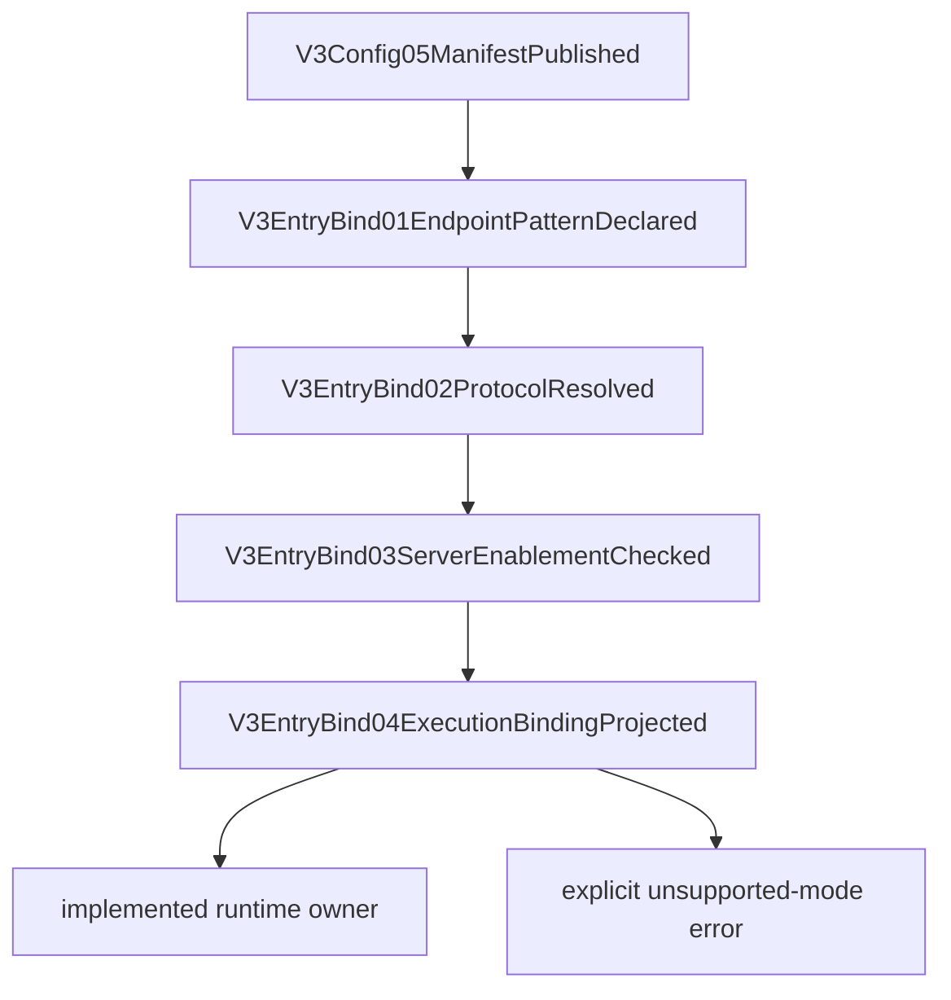

# V3 Entry Protocol Endpoint Binding

Canonical manifest: [v3.entry_protocol_endpoint_binding.mainline](../manifests/v3.entry_protocol_endpoint_binding.mainline.yml)

Canonical maps: [V3 function map](../v3-function-map.yml), [V3 mainline call map](../v3-mainline-call-map.yml), [V3 resource map](../v3-resource-operation-map.yml), and [V3 verification map](../v3-verification-map.yml).

## Purpose

This page is the review surface for `v3.entry_protocol_endpoint_binding`. It locks the first V3 entry gap: every exposed HTTP business endpoint must resolve to one known entry protocol, one execution mode, one implementation status, and one owner before Server dispatch.

The required review phrase is endpoint binding complete only when the binding registry, Server exposure, manifest, maps, wiki, verifier, and red fixtures are all consistent. Runtime protocol implementation remains a separately owned feature even when its binding is integrated here.

## Main Rule

Server must not own a second protocol registry. It may expose endpoint routes, but it must consume the Config-published binding registry to decide the entry protocol, execution mode, implementation status, and Runtime owner. Responses Relay and Gemini relay implemented mean the registry points to their separately owned runtime features; this does not mean live/global/prod compatibility.

Binding resources are side-channel governance truth. They may not enter provider body, client body, metadata payload, debug payload, provider runtime state, or request payload. live/global/prod not claimed by this source slice.

## Binding Matrix

| Entry protocol | Endpoint pattern | Execution mode | Implementation status | Owner |
| --- | --- | --- | --- | --- |
| responses | `/v1/responses` | relay | implemented | `execute_v3_responses_relay_runtime_with_default_transport` |
| anthropic | `/v1/messages` | relay | implemented | `execute_v3_anthropic_relay_runtime_with_default_transport` |
| openai_chat | `/v1/chat/completions` | relay | implemented | `execute_v3_openai_chat_relay_runtime_with_default_transport` |
| gemini | `/v1beta/models/:model/generateContent` | relay | implemented | `execute_v3_gemini_relay_runtime_with_default_transport` |

## Mainline

| Step | From | To | Contract |
| --- | --- | --- | --- |
| v3-entry-bind-01 | `V3Config05ManifestPublished` | `V3EntryBind01EndpointPatternDeclared` | Config declares the endpoint pattern registry. |
| v3-entry-bind-02 | `V3EntryBind01EndpointPatternDeclared` | `V3EntryBind02ProtocolResolved` | Closed protocol resolves execution mode, implementation status, and owner. |
| v3-entry-bind-03 | `V3EntryBind02ProtocolResolved` | `V3EntryBind03ServerEnablementChecked` | Server endpoint table matches the Config registry before dispatch. |
| v3-entry-bind-04 | `V3EntryBind03ServerEnablementChecked` | `V3EntryBind04ExecutionBindingProjected` | Implemented protocols enter the owner Runtime; unsupported execution modes fail explicitly. |

## Review Checklist

- Every exposed `/v1/*` or `/v1beta/*` business endpoint has exactly one binding.
- Config allowed protocols, manifest declarations, and Server endpoint exposure are equal.
- Server has no `endpoint_protocol()` duplicate registry and no raw path runtime bypass.
- Responses Relay source binding is explicit and bound to `v3.hub_relay_runtime_closeout`; manual Direct remains a separately declared config possibility, not the V2 default projection.
- Gemini relay implemented is explicit and bound to `v3.gemini_relay_runtime_integration`.
- No unbound endpoint can fall through to generic foundation pending.
- Binding resources are forbidden from provider/client body.
- `npm run verify:v3-entry-protocol-endpoint-binding` and `npm run test:v3-entry-protocol-endpoint-binding-red-fixtures` are required gates.

## Current Integration Boundary

Config publishes the closed four-protocol registry. Server consumes
`entry_protocol_binding_for_endpoint` before dispatch. Responses now enters the separately owned
Responses Relay source runtime by default for V2 projection, Gemini enters its separately owned
controlled Relay Runtime, and the entry-binding verifier/red fixtures lock the source integration.

This surface does not prove a real Responses/Gemini provider, credentials, install, restart, release,
global availability, or production cutover. live/global/prod not claimed.
