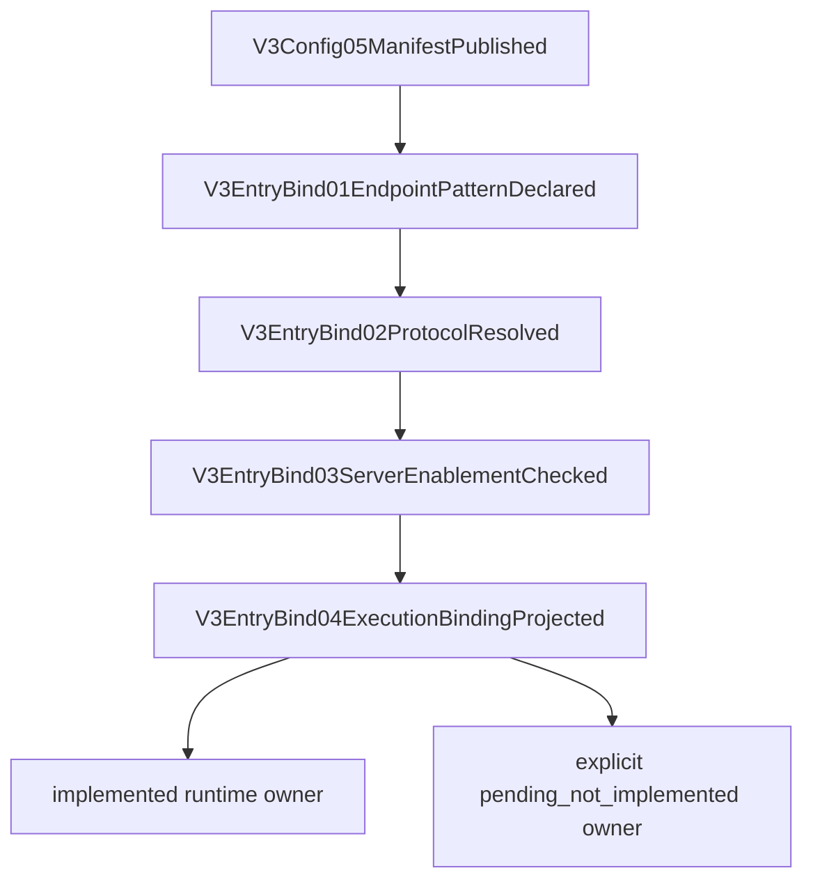

# V3 Entry Protocol Endpoint Binding

Canonical manifest: [v3.entry_protocol_endpoint_binding.mainline](../manifests/v3.entry_protocol_endpoint_binding.mainline.yml)

Canonical maps: [V3 function map](../v3-function-map.yml), [V3 mainline call map](../v3-mainline-call-map.yml), [V3 resource map](../v3-resource-operation-map.yml), and [V3 verification map](../v3-verification-map.yml).

## Purpose

This page is the review surface for `v3.entry_protocol_endpoint_binding`. It locks the first V3 entry gap: every exposed HTTP business endpoint must resolve to one known entry protocol, one execution mode, one implementation status, and one owner before Server dispatch.

The required review phrase is endpoint binding complete only when the binding registry, Server exposure, manifest, maps, wiki, verifier, and red fixtures are all consistent. runtime protocol implementation is separate.

## Main Rule

Server must not own a second protocol registry. It may expose endpoint routes, but it must consume the Config-published binding registry to decide the entry protocol and whether the target is implemented or Gemini pending_not_implemented.

Binding resources are side-channel governance truth. They may not enter provider body, client body, metadata payload, debug payload, provider runtime state, or request payload. live/global/prod not claimed by this source slice.

## Binding Matrix

| Entry protocol | Endpoint pattern | Execution mode | Implementation status | Owner |
| --- | --- | --- | --- | --- |
| responses | `/v1/responses` | direct | implemented | `execute_v3_responses_direct_runtime_kernel_with_default_transport_debug_and_continuation` |
| anthropic | `/v1/messages` | relay | implemented | `execute_v3_anthropic_relay_runtime_with_default_transport` |
| openai_chat | `/v1/chat/completions` | relay | implemented | `execute_v3_openai_chat_relay_runtime_with_default_transport` |
| gemini | `/v1beta/models/:model/generateContent` | pending_not_implemented | Gemini pending_not_implemented | `execute_v3_foundation_pending_runtime` pending projection |

## Mainline

| Step | From | To | Contract |
| --- | --- | --- | --- |
| v3-entry-bind-01 | `V3Config05ManifestPublished` | `V3EntryBind01EndpointPatternDeclared` | Config declares the endpoint pattern registry. |
| v3-entry-bind-02 | `V3EntryBind01EndpointPatternDeclared` | `V3EntryBind02ProtocolResolved` | Closed protocol resolves execution mode, implementation status, and owner. |
| v3-entry-bind-03 | `V3EntryBind02ProtocolResolved` | `V3EntryBind03ServerEnablementChecked` | Server endpoint table matches the Config registry before dispatch. |
| v3-entry-bind-04 | `V3EntryBind03ServerEnablementChecked` | `V3EntryBind04ExecutionBindingProjected` | Implemented protocols enter owner runtime; pending protocols return explicit pending_not_implemented. |

## Review Checklist

- Every exposed `/v1/*` or `/v1beta/*` business endpoint has exactly one binding.
- Config allowed protocols, manifest declarations, and Server endpoint exposure are equal.
- Server has no `endpoint_protocol()` duplicate registry and no raw path runtime bypass.
- Gemini pending_not_implemented is explicit and owner-bound; it is not runtime success.
- No unbound endpoint can fall through to generic foundation pending.
- Binding resources are forbidden from provider/client body.
- `npm run verify:v3-entry-protocol-endpoint-binding` and `npm run test:v3-entry-protocol-endpoint-binding-red-fixtures` are required gates.

## Current Integration Boundary

Worker A owns Config registry implementation. Worker B owns Server binding consumer implementation. This review surface owns the maps, manifest, wiki, source gate, red fixtures, and integration audit.

If A or B is still running, this page can only prove the review/gate skeleton and the baseline red diagnostics. It cannot claim endpoint binding complete, live/global/prod not claimed, or runtime compatibility until the source consumer gates pass.
