<!-- AUTO-GENERATED: edit the manifest/maps, then run `npm run render:v3-execution-control-payload-architecture`. -->
# V3 Execution Control / Payload Architecture

Status: `active`

One resident request lifecycle owns immutable target planning, cumulative recovery budget, bounded attempt payloads, terminal success, and closeout; diagnostics and persistence are bounded side channels without execution authority.

## Canonical Sources

- problem: `docs/goals/v3-execution-control-payload-architecture-audit-problem.md`
- design: `docs/goals/v3-execution-control-payload-architecture-audit-design.md`
- plan: `docs/goals/v3-execution-control-payload-architecture-audit-plan.md`
- goal_prompt: `docs/goals/v3-execution-control-payload-architecture-audit-goal-prompt.md`
- manifest: `docs/architecture/manifests/v3.execution_control_payload_architecture.mainline.yml`
- resource map: `docs/architecture/v3-resource-operation-map.yml`
- function map: `docs/architecture/v3-function-map.yml`
- call map: `docs/architecture/v3-mainline-call-map.yml`
- module registry: `docs/architecture/v3-runtime-module-registry.yml`
- verification map: `docs/architecture/v3-verification-map.yml`

## Lifecycle

```mermaid
flowchart LR
  V3ExecutionControl01RequestAccepted["V3ExecutionControl01RequestAccepted"] -->|v3-execution-control-target-plan| V3ExecutionControl02RecoveryDecision["V3ExecutionControl02RecoveryDecision"]
  V3ExecutionControl02RecoveryDecision["V3ExecutionControl02RecoveryDecision"] -->|v3-execution-control-attempt-admission| V3ExecutionControl03AttemptReserved["V3ExecutionControl03AttemptReserved"]
  V3ExecutionControl03AttemptReserved["V3ExecutionControl03AttemptReserved"] -->|v3-execution-control-attempt-stream| V3ExecutionControl04AttemptInFlight["V3ExecutionControl04AttemptInFlight"]
  V3ExecutionControl04AttemptInFlight["V3ExecutionControl04AttemptInFlight"] -->|v3-execution-control-terminal-read| V3ExecutionControl05AttemptSealed["V3ExecutionControl05AttemptSealed"]
  V3ExecutionControl05AttemptSealed["V3ExecutionControl05AttemptSealed"] -->|v3-execution-control-success-receipt| V3ExecutionControl06SuccessCommitted["V3ExecutionControl06SuccessCommitted"]
  V3ExecutionControl06SuccessCommitted["V3ExecutionControl06SuccessCommitted"] -->|v3-execution-control-health-persistence| V3ExecutionControl07PersistenceQueued["V3ExecutionControl07PersistenceQueued"]
  V3ExecutionControl06SuccessCommitted["V3ExecutionControl06SuccessCommitted"] -->|v3-execution-control-observability-persistence| V3ExecutionControl07PersistenceQueued["V3ExecutionControl07PersistenceQueued"]
```

## Control, Payload, Diagnostics, Persistence

| lane | resources | execution authority |
| --- | --- | --- |
| control | `v3.execution.request_lifecycle_control`, `v3.execution.target_plan`, `v3.execution.attempt_budget`, `v3.execution.attempt_control_state`, `v3.execution.attempt_success_receipt` | request lifecycle only |
| payload | `v3.execution.attempt_payload_store` | none; bounded storage only |
| diagnostics | `v3.observability.stream_diagnostics` | none |
| persistence | `v3.provider.health_persistence_queue`, `v3.observability.request_ledger_queue` | none; ordered bounded writers |

## Budget Contract

- Per attempt: `required`
- Per request: `required`
- Process global: `required`
- Residence/deadline: `required`
- Reserve before append/copy: `true`
- Initial storage: `bounded_memory_only`
- Disk spill: `forbidden`

## Success and Failure Truth

- Success issuer: `response_semantic_owner_after_protocol_terminal_and_payload_seal`
- Success consumers: `provider_health_success`, `route_policy_commit`, `continuation_commit`, `client_semantic_commit`
- Forbidden success evidence: `http_2xx`, `response_headers`, `stream_constructed`, `first_business_frame`, `transport_accepted`
- Failure kinds: `Upstream`, `Protocol`, `LocalResourceExhausted`, `ObservationFailure`, `PersistenceFailure`, `ClientCancelled`

## Current Runtime-Red Bindings

| issue | current symbols |
| --- | --- |

## Module Responsibilities

### runtime

Owns: `request_lifecycle`, `target_plan_consumption`, `attempt_budget`, `attempt_store`, `Error05_execution`, `success_receipt`

Forbids: `temporary_runtime`, `stream_wrapper_executor_reentry`, `route_pool_rehit`, `payload_control_reconstruction`

### provider_responses

Owns: `network_io`, `lazy_stream_runtime_lifetime`, `health_memory_truth`, `health_persistence_writer`

Forbids: `routing`, `recovery_policy`, `lock_held_disk_io`, `local_failure_provider_penalty`

### server_observability

Owns: `typed_event_projection`, `active_request_cache`, `bounded_recent_terminal_cache`, `request_ledger_queue`

Forbids: `execution_control`, `provider_health_control`, `mutex_held_file_io`, `unbounded_history_cache`

### config

Owns: `storage_path_policy_compilation`

Forbids: `runtime_append`, `runtime_flush`, `history_rotation`, `request_hot_path_io`

## Completion Gate

- `runtime_red_bindings_remaining`: `0`
- `binding_pending_remaining`: `0`
- `real_tcp_handoff`: `required`
- `global_install_restart_live_replay`: `required`
- `agy_controller_pass`: `required`
- `exact_reviewed_commit_pushed`: `required`

## Verification

- `npm run verify:v3-execution-control-payload-architecture`
- `npm run test:v3-execution-control-payload-architecture-red-fixtures`
- `npm run verify:v3-resource-map`
- `npm run verify:v3-module-boundaries`
- `npm run verify:v3-mainline-caller-flow`
- `npm run verify:v3-architecture-docs`
- `npm run verify:v3-architecture-ci`
- `npm run verify:ci`
