# V3 Gemini Relay Controlled Runtime

[Implementation plan](../../goals/v3-gemini-relay-runtime-integration-plan.md) ·
[Test design](../../goals/v3-gemini-relay-runtime-integration-test-design.md) ·
[Machine manifest](../manifests/v3.gemini_relay.controlled_runtime.mainline.yml) ·
[HTML review](html/v3-gemini-relay-controlled-runtime.html)

## Status

- Feature: `v3.gemini_relay_runtime_integration`.
- Endpoint: `/v1beta/models/:model/generateContent`.
- Evidence boundary: controlled Rust loopback JSON/SSE/error/isolation only.
- Live Gemini provider compatibility, install, restart, release, global availability, and production
  cutover remain unverified and unclaimed.
- V2, P6, Responses Direct, Anthropic Relay, OpenAI Chat Relay, and Provider WebSocket owners are
  unchanged.

## Single lifecycle

```mermaid
flowchart LR
  S[V3GeminiRelayRuntimeInput] --> R1[V3HubReqInbound01ClientRaw]
  R1 --> R2[V3HubReqInbound02Normalized]
  R2 --> R3[V3HubReqContinuation03Classified]
  R3 --> R4[V3HubReqChatProcess04Governed]
  R4 --> R5[V3HubReqExecution05Planned]
  R5 --> R6[V3HubReqTarget06Resolved]
  R6 --> R7[V3HubReqOutbound07ProviderSemantic]
  R7 --> R8[V3ProviderReqOutbound08WirePayload]
  R8 --> R9[V3ProviderReqOutbound09TransportRequest]
  R9 --> P[(Controlled Gemini upstream)]
  P --> P1[V3ProviderRespInbound01Raw]
  P1 --> P2[V3HubRespInbound02Normalized]
  P2 --> P3[V3HubRespChatProcess03Governed]
  P3 --> P4[V3HubRespContinuation04Committed]
  P4 --> P5[V3HubRespOutbound05ClientSemantic]
  P5 --> P6[V3ServerRespOutbound06ClientFrame]
```



Machine edge IDs are `v3-gemini-relay-01..15`. Server reads the Config entry binding, supplies
request scope, calls the Gemini Runtime owner, and transports the typed result. Gemini URL/model,
candidate, function-call, finishReason, JSON, and SSE semantics stay in the Gemini codec/Runtime.

## JSON, SSE, error, isolation

| Surface | Controlled evidence | Locked risk |
|---|---|---|
| JSON | Loopback captures one `/v1beta/models/gemini-wire/generateContent` request and returns exact candidates/usage | client URL alias selects the wire URL without inserting a synthetic `model` body field |
| Function call | Runtime governs a Gemini `functionCall` and preserves its `name` | protocol identity is not lost or remapped by generic Hub stages |
| SSE | Shared incremental decoder feeds `Body::from_stream`; first candidate frame arrives before delayed terminal; no synthetic `[DONE]` | no full stream materialization or OpenAI framing |
| SSE negatives | malformed JSON, stream end without terminal, and post-terminal frame fail explicitly | still-running or malformed provider streams never become success |
| Error | Controlled 429 enters `V3Error01SourceRaised` through `V3Error06ClientProjected` | provider failure never becomes Resp01/success |
| Isolation | request/response `metadata_center` fails before provider send or client projection | internal control truth never enters provider/client normal payload |

## Ownership checklist

- [x] Config registry marks Gemini `relay` and `implemented` with the Gemini Runtime owner.
- [x] Server consumes `entry_protocol_binding_for_endpoint`; no raw-path Gemini bypass.
- [x] Virtual Router classifies the dynamic Gemini endpoint as the `gemini` entry protocol.
- [x] Existing Hub v1 Req01–Req09 and Resp01–Resp06 nodes only.
- [x] Gemini protocol semantics stay in `gemini_codec.rs` and `gemini_relay_runtime.rs`.
- [x] Static hook registry only; no dynamic discovery.
- [x] No fallback, second Runtime kernel, history repair, or Responses Direct re-entry.
- [x] No raw SSE body collection, synthetic `[DONE]`, or Server-side candidate/functionCall/
  finishReason parsing.
- [x] Source/mutation gates cover missing nodes, transport bypass, fallback, dynamic hooks,
  materialization, Server semantic parsing, binding regression, endpoint classification, and
  side-channel leakage.
- [ ] Real Gemini provider/live production lifecycle; explicitly outside this controlled slice.

## Required gates

```text
npm run test:v3-gemini-relay-runtime-integration
npm run verify:v3-gemini-relay-runtime-integration
npm run test:v3-gemini-relay-runtime-integration-red-fixtures
npm run test:v3-gemini-codec-characterization
npm run verify:v3-gemini-codec-characterization
npm run test:v3-gemini-codec-characterization-red-fixtures
npm run verify:v3-entry-protocol-endpoint-binding
npm run test:v3-entry-protocol-endpoint-binding-red-fixtures
npm run verify:v3-module-boundaries
npm run verify:v3-rust-only
npm run verify:v3-architecture-docs
npm run verify:v3-resource-map
cargo fmt --manifest-path v3/Cargo.toml --all -- --check
CARGO_NET_OFFLINE=true cargo clippy --manifest-path v3/Cargo.toml --workspace --all-targets -- -D warnings
CARGO_NET_OFFLINE=true cargo test --manifest-path v3/Cargo.toml --workspace -- --nocapture
git diff --check
```
