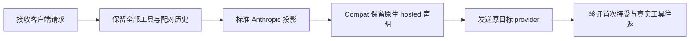

# Goaichat hosted 工具与调用历史的请求兼容

缺陷 `908e8aa` 必须分别验证 provider 请求接受与客户端错误隔离。
切换成功或最终客户端 200 不能证明首个 provider 请求形状兼容。
所有模型入口的错误隔离合同由项目 AGENTS.md 唯一维护。

2026-10-04 的请求 `743898-45622` 包含380个工具、115条 Anthropic 历史，
历史中的67次调用均为已声明的 `exec_command`。没有重复名称、非法名称字符
或为普通工具添加的 type/function。原始 provider-bound 请求在两把配置 key
上均返回400 `invalid function name`。只删除 Compat 给原生 hosted
`web_search_20250305` 添加的 `function` 字段，保留全部工具、历史、名称与
schema 后，两把 key 均返回200与真实 `exec_command` 调用；恢复原样均再400。

该额外 envelope 来自此前的 Goaichat Compat 修复。早期14条历史样本曾在
标准 hosted 声明上400，添加 envelope 后200；但该早期标准原样请求在本轮
两把 key 的六次回放均200。历史诊断不能证明网关永远需要这个私有字段。
本次删除代理自行添加的混合协议形状，恢复标准 Anthropic 声明。
客户端已提供的扩展字段保持原样，不能用过滤未知字段替代此修复。

唯一 owner 是 `provider-compat-core` 的 request Compat。复用
`../dagpipe/v3.operation_runner.request.graph.json` 中
`adjust_provider_private_request`，不更改拓扑、通用编解码或错误恢复。
`anthropic:goaichat` authoring 选择可以保留；没有需要执行的私有变换时，
沿现有 passthrough 返回原始标准 payload，不另建一条空的 provider 分支。

普通 Anthropic 工具不得由 Compat 添加 OpenAI type/function。
原生 hosted 声明也不得由 Compat 添加 function。工具名称、参数、call ID、
schema、历史和配对结果完整保留。已退役的历史工具不得重新加入当前工具集合。
不截断或改名、不删除 hosted 工具、不排序工具来规避错误、不添加新 fallback。

必跑黑盒 `npm run test:v3-goaichat-hosted-tool-history-blackbox`：
公开 Responses JSON/SSE、Chat、Messages -> 外部 TCP Anthropic peer ->
客户端实际执行 `exec_command` 的确定性 consumer -> 匹配输出的下一轮 ->
正常响应。外部 peer 对本次已证实的额外 hosted function 与普通工具
type/function 形状返回400，而非无条件200。每轮只允许一次接受的 provider
请求。用例保留380个工具、长名称、write_stdin 与已退役 update_plan 的配对
历史。标准 `chat:glm` 对照同样保留原生 hosted 声明。

真实 provider 验收须覆盖新115条历史与早期14条历史样本，断言首个 provider
200、无失败 attempt、无切换，并验证真实 consumer 输出与匹配 follow-up。
一次 provider 200 只证明该请求被接受；原生搜索执行仍须独立搜索 receipt。
本次对照不证明所有网关后台或所有其他400原因已经解决。
