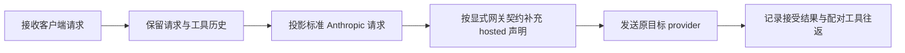

# Goaichat hosted 工具与调用历史的请求兼容

缺陷 `908e8aa`：Codex Responses 进入标准 Anthropic Messages 投影后，
Goaichat AI / GLM-5.3 网关在 hosted `web_search_20250305` 与已有普通
`tool_use`/`tool_result` 历史同时出现时返回 400 `invalid function name`。
同一真实请求的工具单独声明可接受；移除 hosted 声明可接受；保留全部声明与
历史并增加 `function: {name: "web_search", parameters: {}}` 可接受。
只有 `function.name` 的对照仍失败。另一些对照接受了原始长名称，
不能从错误文本推断名称长度或 namespace 就是根因。

后续修复给普通 Anthropic 工具补充嵌套 `function`，再补充 `type: "function"`，
均引入了新的请求兼容回归。这些改动已通过可追溯 revert 撤销。
最新112条历史、380个工具的原始请求，在配置的 `key2` 上交错重放三轮：
普通工具包含新增的 type/function 时三次400；恢复原有 name/input_schema
形状时三次首次200。`key1` 的完整声明也曾200，不能将此规律扩大为
所有后台对所有请求都必然拒绝。更不能用一次最终200或切换成功证明形状安全。

历史提交 `c3946aeb` 修复的是另一个 GLM Anthropic 网关的标准协议选择；
`0bbd8d27` 修复的是 OpenAI Chat 的 hosted 工具能力投影。它们仍在主链，
不等价于本次网关组合契约。原 GLM 回归内部 transport 固定返回 200，
请求没有工具历史，无法发现这次失败。禁止通过删除 hosted 工具、改名、
切换 provider 或 HTTP 200 包装错误让回归变绿。

唯一 owner 是 `provider-compat-core`，选择源是 provider authoring 的
`compatibilityProfile = "anthropic:goaichat"`。请求图复用
`../dagpipe/v3.operation_runner.request.graph.json` 的
`adjust_provider_private_request`，无需更改拓扑或通用协议编解码。

该 profile 只在 `anthropic-messages` 请求 Compat 中调整确切声明
`type=web_search_20250305,name=web_search`。保留原始字段和已有 function
扩展；缺少 function 时补充同名 envelope 和空 parameters。不修改普通工具、
调用 ID、参数、历史、响应、控制状态或标准 `chat:glm` passthrough。
它不赋予客户端新工具，也不宣称网关原生搜索已经执行。

兼容边界必须按声明逐项保持。hosted 工具的已证实私有调整只作用于该
hosted 声明，不能传播到普通工具。普通工具保留标准 Anthropic name、
input_schema、description 及客户端已有扩展；不得凭 hosted 同时出现而
增加 OpenAI type/function 形状。保留当前工具集合、名称、schema 和全部
调用/结果历史；历史中已退役的工具不能重新增加为可调用声明。

真实 provider 的 200 证明该形状被接受；搜索执行必须另有真实搜索 receipt，
文本模拟搜索或工具标记不算完成。本次验收要求普通工具的真实 consumer
执行输出及后续请求，同时保持原 hosted 声明。

必跑黑盒 `npm run test:v3-goaichat-hosted-tool-history-blackbox`：真实公开 HTTP
Responses JSON/SSE、Chat、Messages -> 外部 TCP Anthropic peer -> 客户端执行
`exec_command` 的确定性 consumer -> 匹配输出的下一轮 -> 最终正常响应。
用例携带380个工具、长工具名称、write_stdin 与已退役 update_plan 的调用
及配对结果。外部 peer 检查 hosted 兼容，同时拒绝为普通工具新增第二套
协议形状；客户端原本没有这些扩展，不能由 Compat 凭空增加。
捕获的声明必须保持数量、名称、schema，历史必须保持完整且不扩大能力。
每轮只允许一次接受的 provider 请求；重试或切换后成功仍判失败。
标准 `chat:glm` 对照要求 hosted 声明没有私有 function 字段。
该套件同时纳入 provider-compat gate 和 V3 canonical CI 的 CLI 测试列表。
真实 provider 错误的客户端隔离仍遵守项目 AGENTS 的所有入口统一禁令。
