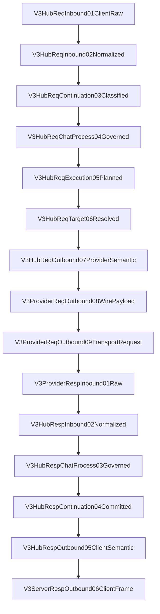
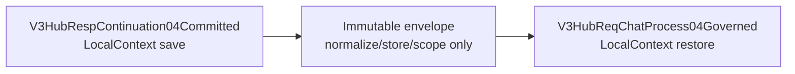

# V3 Hub Pipeline Static Skeleton Review

Canonical contract: [V3 Hub Pipeline Static Skeleton Contract](../../design/v3-hub-pipeline-static-skeleton-contract.md)

Implementation order: [V3 Hub Pipeline Static Skeleton Plan](../../goals/v3-hub-pipeline-static-skeleton-implementation-plan.md)

Existing source audit: [Existing Hub and Provider Path Audit](../../design/v3-existing-hub-provider-path-audit.md)

## Fixed topology

## Four independent branch axes

| Axis | Closed values | Must not be inferred from |
| --- | --- | --- |
| Entry protocol | Responses, Anthropic, Gemini, OpenAI Chat | Provider identity |
| Continuation ownership | new, remote-provider-owned, RouteCodex-local-owned | GPT family or wire protocol |
| Execution mode | Direct, Relay | same-protocol equality |
| Provider wire protocol | Responses, Anthropic, Gemini, OpenAI Chat | Direct/Relay mode |

Target resolution is a typed sub-branch: routed and pinned both merge into
`V3HubReqTarget06Resolved`.

Cross-cutting branches are fixed too: client/servertool/Dry Run invocation source, JSON/SSE frame
transport, and success/global-Error outcome. They occupy existing hook slots and never add a
lifecycle or response exit.

## Immutable interval

No business logic, tool/history repair, request rebuild, routing, Provider adaptation, Debug replay,
or fallback is allowed between save and restore.

## Current-state review

- P6 Responses Direct: implemented and verified, but not the final Hub topology.
- Hub v1 nodes/static registry: contract defined, binding pending.
- Remote continuation: pending hook implementation.
- Local continuation/Relay: pending hook implementation.
- Other protocols: pending hook implementation.
- P6 deletion: required after Hub v1 Direct cutover; permanent dual paths are forbidden.
