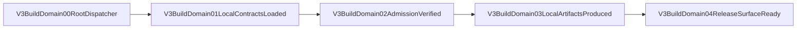

# V3 Independent Build Isolation

Status: design pending

## Review Flow

## Node Contracts

| Node | Owner | Contract |
| --- | --- | --- |
| `V3BuildDomain00RootDispatcher` | root npm/CI/release | Thin `npm --prefix v3` dispatch only; no crate/gate/version/artifact enumeration. |
| `V3BuildDomain01LocalContractsLoaded` | `v3/package.json` | Load V3-local Node, Cargo, toolchain, version, and tracked admission inputs. |
| `V3BuildDomain02AdmissionVerified` | `v3/scripts/verify-isolation.mjs` | Fail on missing, stale, tampered, escaping, or root-fallback inputs. |
| `V3BuildDomain03LocalArtifactsProduced` | `v3/scripts/**` | Write compilation, test, assembly, and package staging only under declared V3 roots. |
| `V3BuildDomain04ReleaseSurfaceReady` | V3 install/pack owners | Emit V3-local packages or atomically publish the verified binary. |

## Resource Boundaries

- Source contracts: `v3.build.node_dependency_lock`,
  `v3.build.cargo_dependency_lock`, `v3.build.rust_toolchain_contract`,
  `v3.build.architecture_admission`, and `v3.build.version_truth`.
- Mutable local outputs: `v3.build.ordinary_cargo_target`,
  `v3.build.install_target`, `v3.build.pack_staging`,
  `v3.build.test_artifact_store`, and `v3.build.dependency_cache`.
- Release candidates: `v3.build.assembled_binary` and
  `v3.build.release_artifacts`.
- Explicit publication: `v3.global_binary_install`.
- Build identity and artifacts never enter request/response/provider wire,
  MetadataCenter, continuation, debug, or Error payloads.

## Ownership Review

- `provider-compat-core`, `servertool-core`, and `stop-message-core` move byte-first
  into `v3/crates/`; path edits follow the move.
- The old shared owners are removed only after zero-consumer, metadata/tree, focused
  test, workspace test, and behavioral equivalence evidence.
- V4 and root runtime semantics are forbidden scope.
- Root authoring maps may remain canonical, but ordinary V3 builds consume only
  deterministic tracked V3-local admission manifests.

## Failure Paths

- Missing local input: fail before build.
- Escaping dependency or output path: fail before write.
- Stale/tampered admission: fail before build.
- Active concurrent V3 builder during over-budget eviction: fail without racing.
- Failed install/pack: release run-owned staging; do not publish partial output.
- Any runtime semantic delta: fail migration and return to the owning runtime feature.

## Review Checklist

- [ ] Every design resource has a real owner/path/gate before promotion.
- [ ] Cargo metadata has zero path dependencies outside V3.
- [ ] Root package/CI/release are thin dispatchers.
- [ ] Full build/test/verify/install-build/pack write set stays under V3.
- [ ] Shared crate owners are physically retired with no duplicate fallback.
- [ ] Positive and red isolation gates pass from V3, root, unrelated cwd, and standalone copy.
- [ ] Runtime request/response/error topology and payload/control separation are unchanged.
- [ ] Global install, one aggregate restart, all health endpoints, and old samples pass.
- [ ] DSH Review passes after live evidence.

## Canonical Sources

- `docs/goals/v3-independent-build-isolation-plan.md`
- `docs/goals/v3-independent-build-isolation-test-design.md`
- `docs/architecture/manifests/v3.build.independent_domain.mainline.yml`
- `docs/architecture/v3-resource-operation-map.yml`
- `docs/architecture/v3-function-map.yml`
- `docs/architecture/v3-mainline-call-map.yml`
- `docs/architecture/v3-build-tool-module-registry.yml`
- `docs/architecture/v3-verification-map.yml`
