<!-- AUTO-GENERATED: do not edit by hand. Rebuild with `npm run render:v3-mainline-caller-flow`. -->

# V3 Mainline Caller Flow

Source: `docs/architecture/v3-mainline-call-map.yml`

Generated view: 35 functional paths, 228 caller edges.

This page renders the V3 mainline edge truth as top-down caller graphs. Each functional path is grouped by implementation module and each edge shows both the function call and the contract-node transition.

Review rule: a provider/runtime response must not jump directly to client/server projection. It must pass through the response chain (`ProviderRespCompat02ProviderCompat -> V3HubRespInbound02Normalized -> V3HubRespChatProcess03Governed -> V3HubRespContinuation04Committed -> V3HubRespOutbound05ClientSemantic -> V3ServerRespOutbound06ClientFrame`) unless it is an explicitly separate direct lifecycle with its own declared nodes.

## Module caller overview

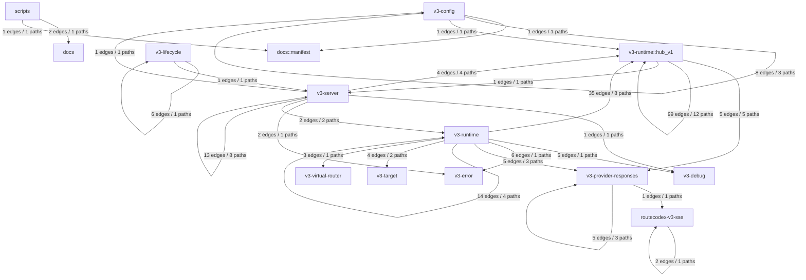

| From module | To module | Edges | Functional paths |
| --- | --- | ---: | --- |
| routecodex-v3-sse | routecodex-v3-sse | 2 | `v3.sse.transport_boundary` |
| scripts | docs | 2 | `v3.live_provider_compat.parity` |
| scripts | docs::manifest | 1 | `v3.live_provider_compat.parity` |
| v3-config | docs::manifest | 1 | `v3.entry_protocol_endpoint_binding.mainline` |
| v3-config | v3-config | 8 | `v3.config.compile`<br/>`v3.entry_protocol_endpoint_binding.mainline`<br/>`v3.entry_protocol_registry_contract.mainline` |
| v3-config | v3-runtime::hub_v1 | 1 | `v3.responses_relay.source_server_entry` |
| v3-lifecycle | v3-lifecycle | 6 | `v3.server.managed_lifecycle` |
| v3-lifecycle | v3-server | 1 | `v3.server.managed_lifecycle` |
| v3-provider-responses | routecodex-v3-sse | 1 | `v3.sse.transport_boundary` |
| v3-provider-responses | v3-provider-responses | 5 | `v3.debug_error_foundation.mainline`<br/>`v3.responses.websocket_v2.transport_hardening`<br/>`v3.responses_direct.required_mainline` |
| v3-runtime::hub_v1 | v3-provider-responses | 5 | `v3.anthropic_relay.controlled_runtime`<br/>`v3.gemini_relay.controlled_runtime`<br/>`v3.hub_relay.runtime_closeout`<br/>`v3.openai_chat_relay.controlled_runtime`<br/>`v3.responses_relay.source_server_entry` |
| v3-runtime::hub_v1 | v3-runtime::hub_v1 | 99 | `v3.anthropic_relay.controlled_runtime`<br/>`v3.anthropic_relay.local_continuation`<br/>`v3.gemini_relay.controlled_runtime`<br/>`v3.hub_pipeline.v1.relay_request_source_slice`<br/>`v3.hub_pipeline.v1.relay_response_source_slice`<br/>`v3.hub_pipeline.v1.request`<br/>`v3.hub_pipeline.v1.response`<br/>`v3.hub_relay.runtime_closeout`<br/>`v3.openai_chat_relay.controlled_runtime`<br/>`v3.protocol_normalization_tool_governance_boundary`<br/>`v3.resp03_tool_governance_gap_closeout`<br/>`v3.servertool_hook_skeleton_lifecycle` |
| v3-runtime::hub_v1 | v3-server | 1 | `v3.responses_relay.source_server_entry` |
| v3-runtime | v3-debug | 5 | `v3.debug_error_foundation.mainline` |
| v3-runtime | v3-error | 6 | `v3.debug_error_foundation.mainline` |
| v3-runtime | v3-provider-responses | 5 | `v3.debug_error_foundation.mainline`<br/>`v3.responses_direct.remote_continuation.integration`<br/>`v3.responses_direct.required_mainline` |
| v3-runtime | v3-runtime | 14 | `v3.responses_continuation.remote_contract_store`<br/>`v3.responses_continuation.remote_locator_codec`<br/>`v3.responses_direct.remote_continuation.integration`<br/>`v3.responses_direct.required_mainline` |
| v3-runtime | v3-runtime::hub_v1 | 35 | `v3.hub_pipeline.v1.hook_registry_compile`<br/>`v3.hub_pipeline.v1.relay_payload_copy_runtime_probes`<br/>`v3.hub_relay.tool_servertool_multiturn_parity`<br/>`v3.protocol.anthropic.characterization`<br/>`v3.protocol.gemini.characterization`<br/>`v3.protocol.openai_chat.characterization`<br/>`v3.protocol_conversion_field_parity`<br/>`v3.protocol_normalization_tool_governance_boundary` |
| v3-runtime | v3-target | 4 | `v3.responses_direct.remote_continuation.integration`<br/>`v3.responses_direct.required_mainline` |
| v3-runtime | v3-virtual-router | 3 | `v3.responses_direct.required_mainline` |
| v3-server | v3-config | 1 | `v3.entry_protocol_endpoint_binding.mainline` |
| v3-server | v3-debug | 1 | `v3.server.startup` |
| v3-server | v3-error | 2 | `v3.server.startup` |
| v3-server | v3-runtime | 2 | `v3.responses.inbound_websocket_proxy`<br/>`v3.responses_direct.required_mainline` |
| v3-server | v3-runtime::hub_v1 | 4 | `v3.anthropic_relay.controlled_runtime`<br/>`v3.gemini_relay.controlled_runtime`<br/>`v3.openai_chat_relay.controlled_runtime`<br/>`v3.responses_relay.source_server_entry` |
| v3-server | v3-server | 13 | `v3.entry_protocol_endpoint_binding.mainline`<br/>`v3.gemini_relay.controlled_runtime`<br/>`v3.models.capability_catalog`<br/>`v3.openai_chat_relay.controlled_runtime`<br/>`v3.responses.inbound_websocket_proxy`<br/>`v3.responses_direct.required_mainline`<br/>`v3.server.startup`<br/>`v3.sse.transport_boundary` |

## Auto audit /补救清单

### Forbidden direct response projection edges

- none

### Forbidden source registered direct response edges

- none

### Binding-pending edges

| chain_id | step_id | from_node | to_node |
| --- | --- | --- | --- |
| v3.entry_protocol_endpoint_binding.mainline | v3-entry-bind-01 | V3Config05ManifestPublished | V3EntryBind01EndpointPatternDeclared |
| v3.entry_protocol_endpoint_binding.mainline | v3-entry-bind-02 | V3EntryBind01EndpointPatternDeclared | V3EntryBind02ProtocolResolved |
| v3.entry_protocol_endpoint_binding.mainline | v3-entry-bind-03 | V3EntryBind02ProtocolResolved | V3EntryBind03ServerEnablementChecked |

### Missing caller/callee fields

- none

## Functional caller paths

## v3.server.managed_lifecycle

One Rust owner validates Config, declares aggregate instance identity, locks lifecycle operations, preserves old rcc start takeover for configured listener ports through managed control, foreign managed port-scoped release, and explicit listener PID signals, runs top-level start in the foreground with real Server console, retains hidden detached-child compatibility, publishes PID/control identity, restarts through one in-place exec with a nonce-bound restart plan when executable/snapshot overrides are needed, and gracefully stops the exact instance without broad kill.

Owner feature: `v3.managed_server_lifecycle`
Manifest: `docs/architecture/manifests/v3.managed_server_lifecycle.mainline.yml`

```mermaid
flowchart TD
  subgraph c_0_v3_server_managed_lifecycle_m_v3_lifecycle["v3-lifecycle"]
    c_0_v3_server_managed_lifecycle_0["v3-lifecycle<br/>V3ManagedLifecycle::start<br/><small>routecodex-v3-lifecycle/src/lib.rs</small>"]
    c_0_v3_server_managed_lifecycle_1["v3-lifecycle<br/>V3ManagedLifecycle::declaration<br/><small>routecodex-v3-lifecycle/src/lib.rs</small>"]
    c_0_v3_server_managed_lifecycle_2["v3-lifecycle<br/>acquire_operation_lock<br/><small>routecodex-v3-lifecycle/src/lib.rs</small>"]
    c_0_v3_server_managed_lifecycle_3["v3-lifecycle<br/>Command::spawn<br/><small>routecodex-v3-lifecycle/src/lib.rs</small>"]
    c_0_v3_server_managed_lifecycle_4["v3-lifecycle<br/>V3ManagedLifecycle::run_managed_child<br/><small>routecodex-v3-lifecycle/src/lib.rs</small>"]
    c_0_v3_server_managed_lifecycle_5["v3-lifecycle<br/>write_json_atomic<br/><small>routecodex-v3-lifecycle/src/lib.rs</small>"]
    c_0_v3_server_managed_lifecycle_6["v3-lifecycle<br/>V3ManagedLifecycle::status<br/><small>routecodex-v3-lifecycle/src/lib.rs</small>"]
    c_0_v3_server_managed_lifecycle_7["v3-lifecycle<br/>send_control<br/><small>routecodex-v3-lifecycle/src/lib.rs</small>"]
    c_0_v3_server_managed_lifecycle_8["v3-lifecycle<br/>V3ManagedLifecycle::restart<br/><small>routecodex-v3-lifecycle/src/lib.rs</small>"]
    c_0_v3_server_managed_lifecycle_9["v3-lifecycle<br/>send_restart_control<br/><small>routecodex-v3-lifecycle/src/lib.rs</small>"]
    c_0_v3_server_managed_lifecycle_10["v3-lifecycle<br/>V3ManagedLifecycle::stop<br/><small>routecodex-v3-lifecycle/src/lib.rs</small>"]
  end
  subgraph c_0_v3_server_managed_lifecycle_m_v3_server["v3-server"]
    c_0_v3_server_managed_lifecycle_11["v3-server<br/>V3ServerAggregateHandle::shutdown<br/><small>routecodex-v3-server/src/lib.rs</small>"]
  end
  c_0_v3_server_managed_lifecycle_0 -->|v3-life-01<br/>V3Lifecycle01ValidatedConfig → V3Lifecycle02InstanceDeclared| c_0_v3_server_managed_lifecycle_1
  c_0_v3_server_managed_lifecycle_0 -->|v3-life-02<br/>V3Lifecycle02InstanceDeclared → V3Lifecycle03OperationLocked| c_0_v3_server_managed_lifecycle_2
  c_0_v3_server_managed_lifecycle_0 -->|v3-life-03<br/>V3Lifecycle03OperationLocked → V3Lifecycle04ChildSpawned| c_0_v3_server_managed_lifecycle_3
  c_0_v3_server_managed_lifecycle_4 -->|v3-life-04<br/>V3Lifecycle04ChildSpawned → V3Lifecycle05IdentityPublished| c_0_v3_server_managed_lifecycle_5
  c_0_v3_server_managed_lifecycle_6 -->|v3-life-05<br/>V3Lifecycle05IdentityPublished → V3Lifecycle06LiveControlled| c_0_v3_server_managed_lifecycle_7
  c_0_v3_server_managed_lifecycle_8 -->|v3-life-05r<br/>V3Lifecycle06LiveControlled → V3Lifecycle05IdentityPublished| c_0_v3_server_managed_lifecycle_9
  c_0_v3_server_managed_lifecycle_10 -->|v3-life-06<br/>V3Lifecycle06LiveControlled → V3Lifecycle07GracefullyStopped| c_0_v3_server_managed_lifecycle_11
```

| Step | Node edge | Status | Caller | Callee | Owner |
| --- | --- | --- | --- | --- | --- |
| `v3-life-01` | `V3Lifecycle01ValidatedConfig` → `V3Lifecycle02InstanceDeclared` | anchored | V3ManagedLifecycle::start<br/><small>routecodex-v3-lifecycle/src/lib.rs</small> | V3ManagedLifecycle::declaration<br/><small>routecodex-v3-lifecycle/src/lib.rs</small> | `v3.managed_server_lifecycle` |
| `v3-life-02` | `V3Lifecycle02InstanceDeclared` → `V3Lifecycle03OperationLocked` | anchored | V3ManagedLifecycle::start<br/><small>routecodex-v3-lifecycle/src/lib.rs</small> | acquire_operation_lock<br/><small>routecodex-v3-lifecycle/src/lib.rs</small> | `v3.managed_server_lifecycle` |
| `v3-life-03` | `V3Lifecycle03OperationLocked` → `V3Lifecycle04ChildSpawned` | anchored | V3ManagedLifecycle::start<br/><small>routecodex-v3-lifecycle/src/lib.rs</small> | Command::spawn<br/><small>routecodex-v3-lifecycle/src/lib.rs</small> | `v3.managed_server_lifecycle` |
| `v3-life-04` | `V3Lifecycle04ChildSpawned` → `V3Lifecycle05IdentityPublished` | anchored | V3ManagedLifecycle::run_managed_child<br/><small>routecodex-v3-lifecycle/src/lib.rs</small> | write_json_atomic<br/><small>routecodex-v3-lifecycle/src/lib.rs</small> | `v3.managed_server_lifecycle` |
| `v3-life-05` | `V3Lifecycle05IdentityPublished` → `V3Lifecycle06LiveControlled` | anchored | V3ManagedLifecycle::status<br/><small>routecodex-v3-lifecycle/src/lib.rs</small> | send_control<br/><small>routecodex-v3-lifecycle/src/lib.rs</small> | `v3.managed_server_lifecycle` |
| `v3-life-05r` | `V3Lifecycle06LiveControlled` → `V3Lifecycle05IdentityPublished` | anchored | V3ManagedLifecycle::restart<br/><small>routecodex-v3-lifecycle/src/lib.rs</small> | send_restart_control<br/><small>routecodex-v3-lifecycle/src/lib.rs</small> | `v3.managed_server_lifecycle` |
| `v3-life-06` | `V3Lifecycle06LiveControlled` → `V3Lifecycle07GracefullyStopped` | anchored | V3ManagedLifecycle::stop<br/><small>routecodex-v3-lifecycle/src/lib.rs</small> | V3ServerAggregateHandle::shutdown<br/><small>routecodex-v3-server/src/lib.rs</small> | `v3.managed_server_lifecycle` |

## v3.config.compile

Unique config.v3 read/parse/validate/registry/publish chain.

Owner feature: `v3.config_interpreter_contract`

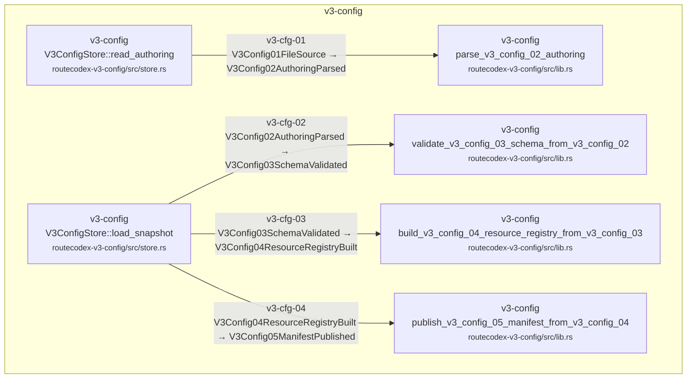

| Step | Node edge | Status | Caller | Callee | Owner |
| --- | --- | --- | --- | --- | --- |
| `v3-cfg-01` | `V3Config01FileSource` → `V3Config02AuthoringParsed` | anchored | V3ConfigStore::read_authoring<br/><small>routecodex-v3-config/src/store.rs</small> | parse_v3_config_02_authoring<br/><small>routecodex-v3-config/src/lib.rs</small> | `v3.config_interpreter_contract` |
| `v3-cfg-02` | `V3Config02AuthoringParsed` → `V3Config03SchemaValidated` | anchored | V3ConfigStore::load_snapshot<br/><small>routecodex-v3-config/src/store.rs</small> | validate_v3_config_03_schema_from_v3_config_02<br/><small>routecodex-v3-config/src/lib.rs</small> | `v3.config_interpreter_contract` |
| `v3-cfg-03` | `V3Config03SchemaValidated` → `V3Config04ResourceRegistryBuilt` | anchored | V3ConfigStore::load_snapshot<br/><small>routecodex-v3-config/src/store.rs</small> | build_v3_config_04_resource_registry_from_v3_config_03<br/><small>routecodex-v3-config/src/lib.rs</small> | `v3.config_interpreter_contract` |
| `v3-cfg-04` | `V3Config04ResourceRegistryBuilt` → `V3Config05ManifestPublished` | anchored | V3ConfigStore::load_snapshot<br/><small>routecodex-v3-config/src/store.rs</small> | publish_v3_config_05_manifest_from_v3_config_04<br/><small>routecodex-v3-config/src/lib.rs</small> | `v3.config_interpreter_contract` |

## v3.models.capability_catalog

Server projects the compiled provider model registry plus stable built-in Codex ModelInfo metadata through the read-only /v1/models endpoint.

Owner feature: `v3.models_capability_catalog`

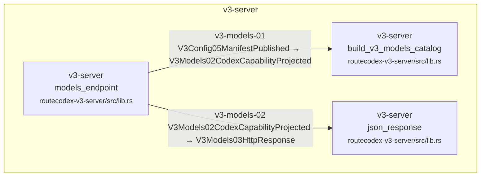

| Step | Node edge | Status | Caller | Callee | Owner |
| --- | --- | --- | --- | --- | --- |
| `v3-models-01` | `V3Config05ManifestPublished` → `V3Models02CodexCapabilityProjected` | anchored | models_endpoint<br/><small>routecodex-v3-server/src/lib.rs</small> | build_v3_models_catalog<br/><small>routecodex-v3-server/src/lib.rs</small> | `v3.models_capability_catalog` |
| `v3-models-02` | `V3Models02CodexCapabilityProjected` → `V3Models03HttpResponse` | anchored | models_endpoint<br/><small>routecodex-v3-server/src/lib.rs</small> | json_response<br/><small>routecodex-v3-server/src/lib.rs</small> | `v3.models_capability_catalog` |

## v3.entry_protocol_endpoint_binding.mainline

Review/gate chain binding V3 business endpoint exposure to closed entry protocols, execution mode, implementation status, and owner before Server dispatch.

Owner feature: `v3.entry_protocol_endpoint_binding`
Manifest: `docs/architecture/manifests/v3.entry_protocol_endpoint_binding.mainline.yml`

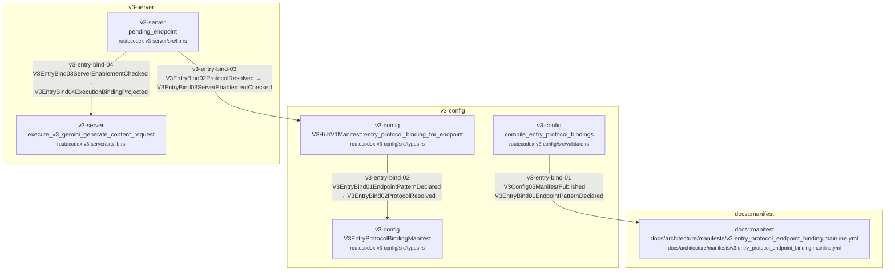

| Step | Node edge | Status | Caller | Callee | Owner |
| --- | --- | --- | --- | --- | --- |
| `v3-entry-bind-01` | `V3Config05ManifestPublished` → `V3EntryBind01EndpointPatternDeclared` | binding_pending | compile_entry_protocol_bindings<br/><small>routecodex-v3-config/src/validate.rs</small> | docs/architecture/manifests/v3.entry_protocol_endpoint_binding.mainline.yml<br/><small>docs/architecture/manifests/v3.entry_protocol_endpoint_binding.mainline.yml</small> | `v3.entry_protocol_endpoint_binding` |
| `v3-entry-bind-02` | `V3EntryBind01EndpointPatternDeclared` → `V3EntryBind02ProtocolResolved` | binding_pending | V3HubV1Manifest::entry_protocol_binding_for_endpoint<br/><small>routecodex-v3-config/src/types.rs</small> | V3EntryProtocolBindingManifest<br/><small>routecodex-v3-config/src/types.rs</small> | `v3.entry_protocol_endpoint_binding` |
| `v3-entry-bind-03` | `V3EntryBind02ProtocolResolved` → `V3EntryBind03ServerEnablementChecked` | binding_pending | pending_endpoint<br/><small>routecodex-v3-server/src/lib.rs</small> | V3HubV1Manifest::entry_protocol_binding_for_endpoint<br/><small>routecodex-v3-config/src/types.rs</small> | `v3.entry_protocol_endpoint_binding` |
| `v3-entry-bind-04` | `V3EntryBind03ServerEnablementChecked` → `V3EntryBind04ExecutionBindingProjected` | anchored | pending_endpoint<br/><small>routecodex-v3-server/src/lib.rs</small> | execute_v3_gemini_generate_content_request<br/><small>routecodex-v3-server/src/lib.rs</small> | `v3.entry_protocol_endpoint_binding` |

## v3.hub_pipeline.v1.hook_registry_compile

Runtime borrows deterministic resource/hook declarations only from V3Config05ManifestPublished and binds every fixed node entry/exit slot to the closed Rust static catalog.

Owner feature: `v3.hub_relay_runtime_resources_hooks`

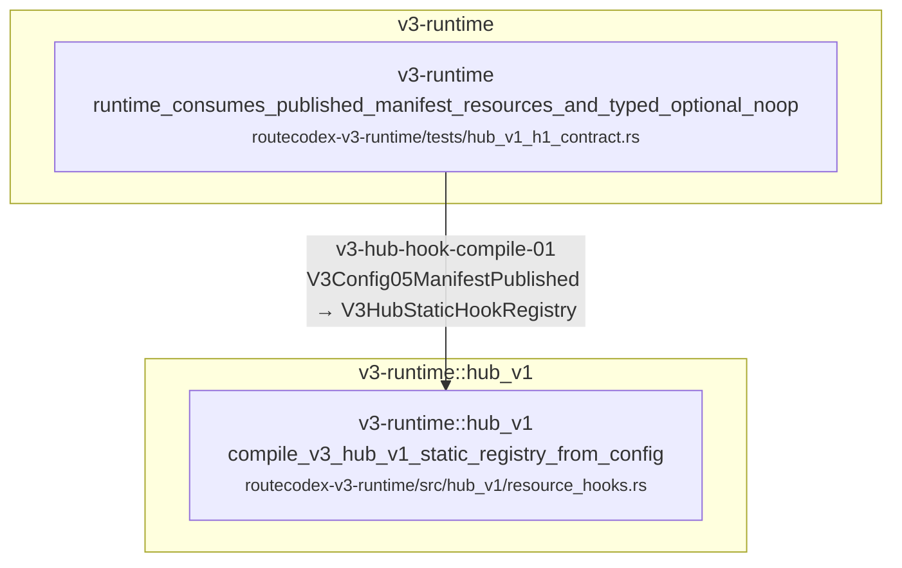

| Step | Node edge | Status | Caller | Callee | Owner |
| --- | --- | --- | --- | --- | --- |
| `v3-hub-hook-compile-01` | `V3Config05ManifestPublished` → `V3HubStaticHookRegistry` | anchored | runtime_consumes_published_manifest_resources_and_typed_optional_noop<br/><small>routecodex-v3-runtime/tests/hub_v1_h1_contract.rs</small> | compile_v3_hub_v1_static_registry_from_config<br/><small>routecodex-v3-runtime/src/hub_v1/resource_hooks.rs</small> | `v3.hub_relay_runtime_resources_hooks` |

## v3.responses_direct.required_mainline

Required no-shortcut lifecycle. P6 is source-bound from Server03 through Server16; Target-local reselection remains inside the single Runtime kernel without Router re-entry.

Owner feature: `v3.responses_direct_mvp_architecture`

```mermaid
flowchart TD
  subgraph c_5_v3_responses_direct_required_mainline_m_v3_provider_responses["v3-provider-responses"]
    c_5_v3_responses_direct_required_mainline_13["v3-provider-responses<br/>build_v3_provider_12_responses_wire_payload<br/><small>routecodex-v3-provider-responses/src/wire.rs</small>"]
    c_5_v3_responses_direct_required_mainline_15["v3-provider-responses<br/>build_v3_transport_13_responses_http_request_from_v3_provider_12<br/><small>routecodex-v3-provider-responses/src/transport.rs</small>"]
    c_5_v3_responses_direct_required_mainline_16["v3-provider-responses<br/>ReqwestResponsesTransport::send<br/><small>routecodex-v3-provider-responses/src/transport.rs</small>"]
    c_5_v3_responses_direct_required_mainline_17["v3-provider-responses<br/>V3ProviderResp14Raw::from_json<br/><small>routecodex-v3-provider-responses/src/raw_response.rs</small>"]
  end
  subgraph c_5_v3_responses_direct_required_mainline_m_v3_runtime["v3-runtime"]
    c_5_v3_responses_direct_required_mainline_1["v3-runtime<br/>build_v3_server_03_http_request_raw<br/><small>routecodex-v3-runtime/src/nodes.rs</small>"]
    c_5_v3_responses_direct_required_mainline_2["v3-runtime<br/>execute_v3_p5_routing_runtime<br/><small>routecodex-v3-runtime/src/foundation.rs</small>"]
    c_5_v3_responses_direct_required_mainline_3["v3-runtime<br/>build_v3_req_04_standardized_responses_from_v3_server_03<br/><small>routecodex-v3-runtime/src/nodes.rs</small>"]
    c_5_v3_responses_direct_required_mainline_10["v3-runtime<br/>execute_v3_responses_direct_runtime_kernel<br/><small>routecodex-v3-runtime/src/kernel.rs</small>"]
    c_5_v3_responses_direct_required_mainline_11["v3-runtime<br/>responses_direct_route_hook<br/><small>routecodex-v3-runtime/src/hooks.rs</small>"]
    c_5_v3_responses_direct_required_mainline_12["v3-runtime<br/>responses_direct_request_projection_hook<br/><small>routecodex-v3-runtime/src/hooks.rs</small>"]
    c_5_v3_responses_direct_required_mainline_14["v3-runtime<br/>responses_direct_provider_transport_hook<br/><small>routecodex-v3-runtime/src/hooks.rs</small>"]
    c_5_v3_responses_direct_required_mainline_18["v3-runtime<br/>responses_direct_response_projection_hook<br/><small>routecodex-v3-runtime/src/hooks.rs</small>"]
    c_5_v3_responses_direct_required_mainline_19["v3-runtime<br/>V3ResponsesDirectRuntimeOutput<br/><small>routecodex-v3-runtime/src/kernel.rs</small>"]
  end
  subgraph c_5_v3_responses_direct_required_mainline_m_v3_server["v3-server"]
    c_5_v3_responses_direct_required_mainline_0["v3-server<br/>pending_endpoint<br/><small>routecodex-v3-server/src/lib.rs</small>"]
    c_5_v3_responses_direct_required_mainline_20["v3-server<br/>build_v3_server_16_http_frame_from_v3_resp_15<br/><small>routecodex-v3-server/src/lib.rs</small>"]
  end
  subgraph c_5_v3_responses_direct_required_mainline_m_v3_target["v3-target"]
    c_5_v3_responses_direct_required_mainline_7["v3-target<br/>V3TargetInterpreter::classify_kind<br/><small>routecodex-v3-target/src/lib.rs</small>"]
    c_5_v3_responses_direct_required_mainline_8["v3-target<br/>V3TargetInterpreter::expand_candidates<br/><small>routecodex-v3-target/src/lib.rs</small>"]
    c_5_v3_responses_direct_required_mainline_9["v3-target<br/>V3TargetInterpreter::select_available<br/><small>routecodex-v3-target/src/lib.rs</small>"]
  end
  subgraph c_5_v3_responses_direct_required_mainline_m_v3_virtual_router["v3-virtual-router"]
    c_5_v3_responses_direct_required_mainline_4["v3-virtual-router<br/>V3VirtualRouter::classify_request_with_facts<br/><small>routecodex-v3-virtual-router/src/lib.rs</small>"]
    c_5_v3_responses_direct_required_mainline_5["v3-virtual-router<br/>V3VirtualRouter::resolve_route_pool_plan<br/><small>routecodex-v3-virtual-router/src/lib.rs</small>"]
    c_5_v3_responses_direct_required_mainline_6["v3-virtual-router<br/>V3VirtualRouter::hit_opaque_target_plan_once<br/><small>routecodex-v3-virtual-router/src/lib.rs</small>"]
  end
  c_5_v3_responses_direct_required_mainline_0 -->|v3-rd-01<br/>V3Config05ManifestPublished → V3Server03HttpRequestRaw| c_5_v3_responses_direct_required_mainline_1
  c_5_v3_responses_direct_required_mainline_2 -->|v3-rd-02<br/>V3Server03HttpRequestRaw → V3Req04StandardizedResponses| c_5_v3_responses_direct_required_mainline_3
  c_5_v3_responses_direct_required_mainline_2 -->|v3-rd-03<br/>V3Req04StandardizedResponses → V3Router05RequestClassified| c_5_v3_responses_direct_required_mainline_4
  c_5_v3_responses_direct_required_mainline_2 -->|v3-rd-04<br/>V3Router05RequestClassified → V3Router06RoutePoolResolved| c_5_v3_responses_direct_required_mainline_5
  c_5_v3_responses_direct_required_mainline_2 -->|v3-rd-05<br/>V3Router06RoutePoolResolved → V3Router07OpaqueTargetHitOnce| c_5_v3_responses_direct_required_mainline_6
  c_5_v3_responses_direct_required_mainline_2 -->|v3-rd-06<br/>V3Router07OpaqueTargetHitOnce → V3Target08KindClassified| c_5_v3_responses_direct_required_mainline_7
  c_5_v3_responses_direct_required_mainline_2 -->|v3-rd-07<br/>V3Target08KindClassified → V3Target09CandidateSetExpanded| c_5_v3_responses_direct_required_mainline_8
  c_5_v3_responses_direct_required_mainline_2 -->|v3-rd-08<br/>V3Target09CandidateSetExpanded → V3Target10ConcreteProviderSelected| c_5_v3_responses_direct_required_mainline_9
  c_5_v3_responses_direct_required_mainline_10 -->|v3-rd-09<br/>V3Target10ConcreteProviderSelected → V3ResponsesDirect11Policy| c_5_v3_responses_direct_required_mainline_11
  c_5_v3_responses_direct_required_mainline_12 -->|v3-rd-10<br/>V3ResponsesDirect11Policy → V3Provider12ResponsesWirePayload| c_5_v3_responses_direct_required_mainline_13
  c_5_v3_responses_direct_required_mainline_14 -->|v3-rd-11<br/>V3Provider12ResponsesWirePayload → V3Transport13ResponsesHttpRequest| c_5_v3_responses_direct_required_mainline_15
  c_5_v3_responses_direct_required_mainline_16 -->|v3-rd-12<br/>V3Transport13ResponsesHttpRequest → V3ProviderResp14Raw| c_5_v3_responses_direct_required_mainline_17
  c_5_v3_responses_direct_required_mainline_10 -->|v3-rd-13<br/>V3ProviderResp14Raw → V3DirectResp14ProviderProjectionPrepared| c_5_v3_responses_direct_required_mainline_18
  c_5_v3_responses_direct_required_mainline_10 -->|v3-rd-14<br/>V3DirectResp14ProviderProjectionPrepared → V3DirectResp15ClientPayloadReady| c_5_v3_responses_direct_required_mainline_19
  c_5_v3_responses_direct_required_mainline_10 -->|v3-rd-15<br/>V3DirectResp15ClientPayloadReady → V3Resp15ClientPayload| c_5_v3_responses_direct_required_mainline_19
  c_5_v3_responses_direct_required_mainline_0 -->|v3-rd-16<br/>V3Resp15ClientPayload → V3Server16HttpFrame| c_5_v3_responses_direct_required_mainline_20
```

| Step | Node edge | Status | Caller | Callee | Owner |
| --- | --- | --- | --- | --- | --- |
| `v3-rd-01` | `V3Config05ManifestPublished` → `V3Server03HttpRequestRaw` | anchored | pending_endpoint<br/><small>routecodex-v3-server/src/lib.rs</small> | build_v3_server_03_http_request_raw<br/><small>routecodex-v3-runtime/src/nodes.rs</small> | `v3.virtual_router_target_interpreter` |
| `v3-rd-02` | `V3Server03HttpRequestRaw` → `V3Req04StandardizedResponses` | anchored | execute_v3_p5_routing_runtime<br/><small>routecodex-v3-runtime/src/foundation.rs</small> | build_v3_req_04_standardized_responses_from_v3_server_03<br/><small>routecodex-v3-runtime/src/nodes.rs</small> | `v3.virtual_router_target_interpreter` |
| `v3-rd-03` | `V3Req04StandardizedResponses` → `V3Router05RequestClassified` | anchored | execute_v3_p5_routing_runtime<br/><small>routecodex-v3-runtime/src/foundation.rs</small> | V3VirtualRouter::classify_request_with_facts<br/><small>routecodex-v3-virtual-router/src/lib.rs</small> | `v3.virtual_router_full_function` |
| `v3-rd-04` | `V3Router05RequestClassified` → `V3Router06RoutePoolResolved` | anchored | execute_v3_p5_routing_runtime<br/><small>routecodex-v3-runtime/src/foundation.rs</small> | V3VirtualRouter::resolve_route_pool_plan<br/><small>routecodex-v3-virtual-router/src/lib.rs</small> | `v3.virtual_router_full_function` |
| `v3-rd-05` | `V3Router06RoutePoolResolved` → `V3Router07OpaqueTargetHitOnce` | anchored | execute_v3_p5_routing_runtime<br/><small>routecodex-v3-runtime/src/foundation.rs</small> | V3VirtualRouter::hit_opaque_target_plan_once<br/><small>routecodex-v3-virtual-router/src/lib.rs</small> | `v3.virtual_router_full_function` |
| `v3-rd-06` | `V3Router07OpaqueTargetHitOnce` → `V3Target08KindClassified` | anchored | execute_v3_p5_routing_runtime<br/><small>routecodex-v3-runtime/src/foundation.rs</small> | V3TargetInterpreter::classify_kind<br/><small>routecodex-v3-target/src/lib.rs</small> | `v3.virtual_router_target_interpreter` |
| `v3-rd-07` | `V3Target08KindClassified` → `V3Target09CandidateSetExpanded` | anchored | execute_v3_p5_routing_runtime<br/><small>routecodex-v3-runtime/src/foundation.rs</small> | V3TargetInterpreter::expand_candidates<br/><small>routecodex-v3-target/src/lib.rs</small> | `v3.virtual_router_target_interpreter` |
| `v3-rd-08` | `V3Target09CandidateSetExpanded` → `V3Target10ConcreteProviderSelected` | anchored | execute_v3_p5_routing_runtime<br/><small>routecodex-v3-runtime/src/foundation.rs</small> | V3TargetInterpreter::select_available<br/><small>routecodex-v3-target/src/lib.rs</small> | `v3.virtual_router_target_interpreter` |
| `v3-rd-09` | `V3Target10ConcreteProviderSelected` → `V3ResponsesDirect11Policy` | anchored | execute_v3_responses_direct_runtime_kernel<br/><small>routecodex-v3-runtime/src/kernel.rs</small> | responses_direct_route_hook<br/><small>routecodex-v3-runtime/src/hooks.rs</small> | `v3.responses_direct_mvp_architecture` |
| `v3-rd-10` | `V3ResponsesDirect11Policy` → `V3Provider12ResponsesWirePayload` | anchored | responses_direct_request_projection_hook<br/><small>routecodex-v3-runtime/src/hooks.rs</small> | build_v3_provider_12_responses_wire_payload<br/><small>routecodex-v3-provider-responses/src/wire.rs</small> | `v3.responses_provider_runtime` |
| `v3-rd-11` | `V3Provider12ResponsesWirePayload` → `V3Transport13ResponsesHttpRequest` | anchored | responses_direct_provider_transport_hook<br/><small>routecodex-v3-runtime/src/hooks.rs</small> | build_v3_transport_13_responses_http_request_from_v3_provider_12<br/><small>routecodex-v3-provider-responses/src/transport.rs</small> | `v3.responses_provider_runtime` |
| `v3-rd-12` | `V3Transport13ResponsesHttpRequest` → `V3ProviderResp14Raw` | anchored | ReqwestResponsesTransport::send<br/><small>routecodex-v3-provider-responses/src/transport.rs</small> | V3ProviderResp14Raw::from_json<br/><small>routecodex-v3-provider-responses/src/raw_response.rs</small> | `v3.responses_provider_runtime` |
| `v3-rd-13` | `V3ProviderResp14Raw` → `V3DirectResp14ProviderProjectionPrepared` | anchored | execute_v3_responses_direct_runtime_kernel<br/><small>routecodex-v3-runtime/src/kernel.rs</small> | responses_direct_response_projection_hook<br/><small>routecodex-v3-runtime/src/hooks.rs</small> | `v3.responses_direct_mvp_architecture` |
| `v3-rd-14` | `V3DirectResp14ProviderProjectionPrepared` → `V3DirectResp15ClientPayloadReady` | anchored | execute_v3_responses_direct_runtime_kernel<br/><small>routecodex-v3-runtime/src/kernel.rs</small> | V3ResponsesDirectRuntimeOutput<br/><small>routecodex-v3-runtime/src/kernel.rs</small> | `v3.responses_direct_mvp_architecture` |
| `v3-rd-15` | `V3DirectResp15ClientPayloadReady` → `V3Resp15ClientPayload` | anchored | execute_v3_responses_direct_runtime_kernel<br/><small>routecodex-v3-runtime/src/kernel.rs</small> | V3ResponsesDirectRuntimeOutput<br/><small>routecodex-v3-runtime/src/kernel.rs</small> | `v3.responses_direct_mvp_architecture` |
| `v3-rd-16` | `V3Resp15ClientPayload` → `V3Server16HttpFrame` | anchored | pending_endpoint<br/><small>routecodex-v3-server/src/lib.rs</small> | build_v3_server_16_http_frame_from_v3_resp_15<br/><small>routecodex-v3-server/src/lib.rs</small> | `v3.responses_direct_mvp_architecture` |

## v3.hub_pipeline.v1.request

Fixed Hub v1 request topology. All Direct/Relay/continuation/target/provider-protocol branches traverse every adjacent node and are supplied by static Rust hooks.

Owner feature: `v3.hub_pipeline_static_skeleton`

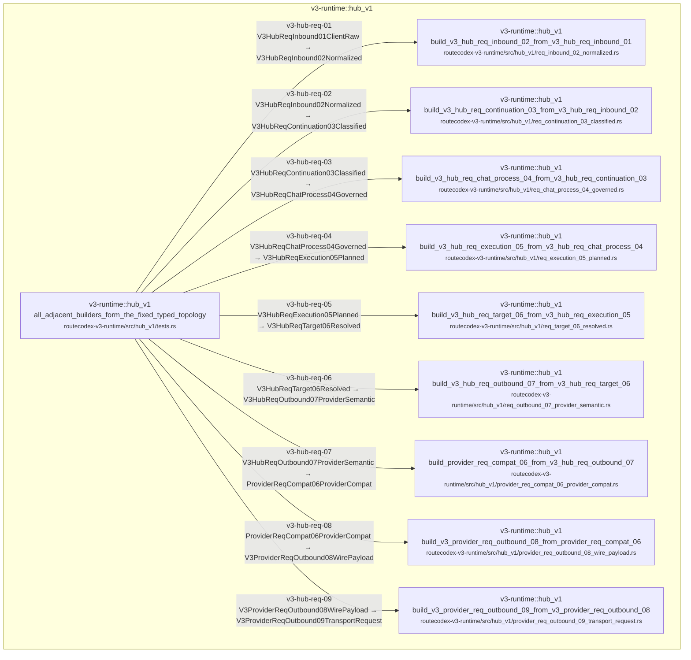

| Step | Node edge | Status | Caller | Callee | Owner |
| --- | --- | --- | --- | --- | --- |
| `v3-hub-req-01` | `V3HubReqInbound01ClientRaw` → `V3HubReqInbound02Normalized` | anchored | all_adjacent_builders_form_the_fixed_typed_topology<br/><small>routecodex-v3-runtime/src/hub_v1/tests.rs</small> | build_v3_hub_req_inbound_02_from_v3_hub_req_inbound_01<br/><small>routecodex-v3-runtime/src/hub_v1/req_inbound_02_normalized.rs</small> | `v3.hub_pipeline_static_skeleton` |
| `v3-hub-req-02` | `V3HubReqInbound02Normalized` → `V3HubReqContinuation03Classified` | anchored | all_adjacent_builders_form_the_fixed_typed_topology<br/><small>routecodex-v3-runtime/src/hub_v1/tests.rs</small> | build_v3_hub_req_continuation_03_from_v3_hub_req_inbound_02<br/><small>routecodex-v3-runtime/src/hub_v1/req_continuation_03_classified.rs</small> | `v3.hub_pipeline_static_skeleton` |
| `v3-hub-req-03` | `V3HubReqContinuation03Classified` → `V3HubReqChatProcess04Governed` | anchored | all_adjacent_builders_form_the_fixed_typed_topology<br/><small>routecodex-v3-runtime/src/hub_v1/tests.rs</small> | build_v3_hub_req_chat_process_04_from_v3_hub_req_continuation_03<br/><small>routecodex-v3-runtime/src/hub_v1/req_chat_process_04_governed.rs</small> | `v3.hub_pipeline_static_skeleton` |
| `v3-hub-req-04` | `V3HubReqChatProcess04Governed` → `V3HubReqExecution05Planned` | anchored | all_adjacent_builders_form_the_fixed_typed_topology<br/><small>routecodex-v3-runtime/src/hub_v1/tests.rs</small> | build_v3_hub_req_execution_05_from_v3_hub_req_chat_process_04<br/><small>routecodex-v3-runtime/src/hub_v1/req_execution_05_planned.rs</small> | `v3.hub_pipeline_static_skeleton` |
| `v3-hub-req-05` | `V3HubReqExecution05Planned` → `V3HubReqTarget06Resolved` | anchored | all_adjacent_builders_form_the_fixed_typed_topology<br/><small>routecodex-v3-runtime/src/hub_v1/tests.rs</small> | build_v3_hub_req_target_06_from_v3_hub_req_execution_05<br/><small>routecodex-v3-runtime/src/hub_v1/req_target_06_resolved.rs</small> | `v3.hub_pipeline_static_skeleton` |
| `v3-hub-req-06` | `V3HubReqTarget06Resolved` → `V3HubReqOutbound07ProviderSemantic` | anchored | all_adjacent_builders_form_the_fixed_typed_topology<br/><small>routecodex-v3-runtime/src/hub_v1/tests.rs</small> | build_v3_hub_req_outbound_07_from_v3_hub_req_target_06<br/><small>routecodex-v3-runtime/src/hub_v1/req_outbound_07_provider_semantic.rs</small> | `v3.hub_pipeline_static_skeleton` |
| `v3-hub-req-07` | `V3HubReqOutbound07ProviderSemantic` → `ProviderReqCompat06ProviderCompat` | anchored | all_adjacent_builders_form_the_fixed_typed_topology<br/><small>routecodex-v3-runtime/src/hub_v1/tests.rs</small> | build_provider_req_compat_06_from_v3_hub_req_outbound_07<br/><small>routecodex-v3-runtime/src/hub_v1/provider_req_compat_06_provider_compat.rs</small> | `v3.hub_pipeline_static_skeleton` |
| `v3-hub-req-08` | `ProviderReqCompat06ProviderCompat` → `V3ProviderReqOutbound08WirePayload` | anchored | all_adjacent_builders_form_the_fixed_typed_topology<br/><small>routecodex-v3-runtime/src/hub_v1/tests.rs</small> | build_v3_provider_req_outbound_08_from_provider_req_compat_06<br/><small>routecodex-v3-runtime/src/hub_v1/provider_req_outbound_08_wire_payload.rs</small> | `v3.hub_pipeline_static_skeleton` |
| `v3-hub-req-09` | `V3ProviderReqOutbound08WirePayload` → `V3ProviderReqOutbound09TransportRequest` | anchored | all_adjacent_builders_form_the_fixed_typed_topology<br/><small>routecodex-v3-runtime/src/hub_v1/tests.rs</small> | build_v3_provider_req_outbound_09_from_v3_provider_req_outbound_08<br/><small>routecodex-v3-runtime/src/hub_v1/provider_req_outbound_09_transport_request.rs</small> | `v3.hub_pipeline_static_skeleton` |

## v3.hub_pipeline.v1.relay_request_source_slice

Relay request-side source slice. Req02 normalizes, Req03 classifies only, and Req04 restores/governs; later fixed nodes remain the standard Hub v1 chain.

Owner feature: `v3.hub_relay_request_semantics`

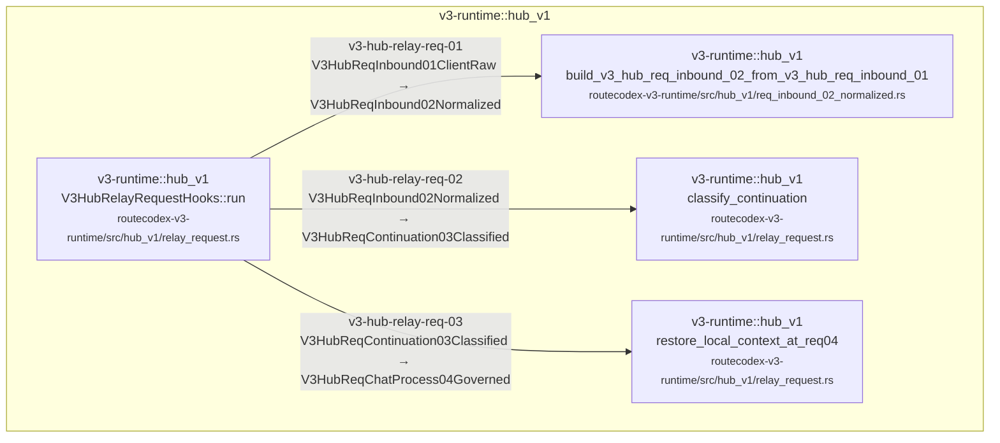

| Step | Node edge | Status | Caller | Callee | Owner |
| --- | --- | --- | --- | --- | --- |
| `v3-hub-relay-req-01` | `V3HubReqInbound01ClientRaw` → `V3HubReqInbound02Normalized` | anchored | V3HubRelayRequestHooks::run<br/><small>routecodex-v3-runtime/src/hub_v1/relay_request.rs</small> | build_v3_hub_req_inbound_02_from_v3_hub_req_inbound_01<br/><small>routecodex-v3-runtime/src/hub_v1/req_inbound_02_normalized.rs</small> | `v3.hub_relay_request_semantics` |
| `v3-hub-relay-req-02` | `V3HubReqInbound02Normalized` → `V3HubReqContinuation03Classified` | anchored | V3HubRelayRequestHooks::run<br/><small>routecodex-v3-runtime/src/hub_v1/relay_request.rs</small> | classify_continuation<br/><small>routecodex-v3-runtime/src/hub_v1/relay_request.rs</small> | `v3.hub_relay_request_semantics` |
| `v3-hub-relay-req-03` | `V3HubReqContinuation03Classified` → `V3HubReqChatProcess04Governed` | anchored | V3HubRelayRequestHooks::run<br/><small>routecodex-v3-runtime/src/hub_v1/relay_request.rs</small> | restore_local_context_at_req04<br/><small>routecodex-v3-runtime/src/hub_v1/relay_request.rs</small> | `v3.hub_relay_request_semantics` |

## v3.hub_pipeline.v1.response

Fixed Hub v1 response topology. Direct/Relay/JSON/SSE/servertool outcomes merge before the sole client projection and Server frame exit.

Owner feature: `v3.hub_pipeline_static_skeleton`

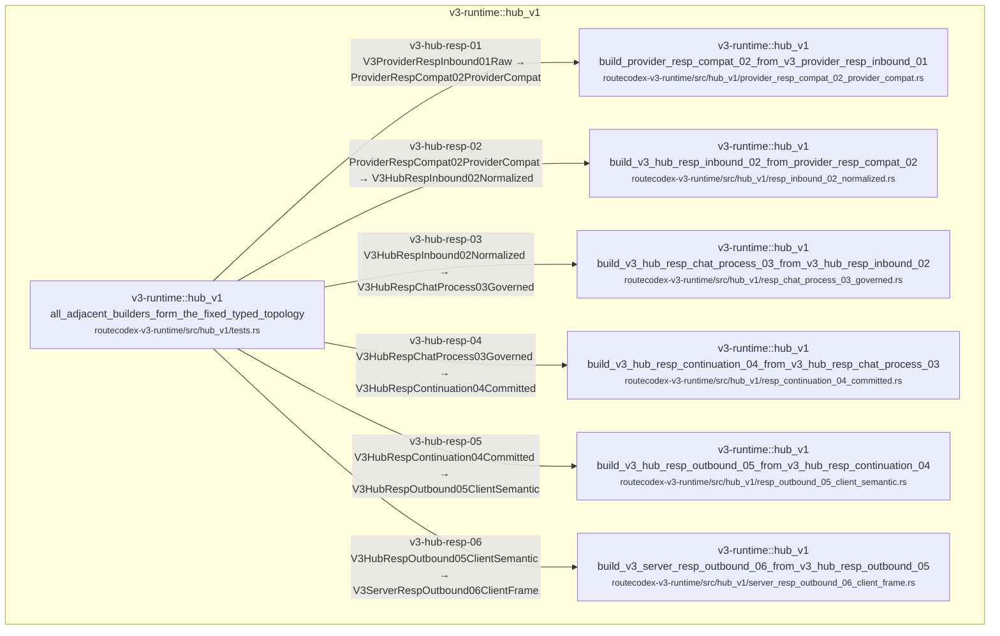

| Step | Node edge | Status | Caller | Callee | Owner |
| --- | --- | --- | --- | --- | --- |
| `v3-hub-resp-01` | `V3ProviderRespInbound01Raw` → `ProviderRespCompat02ProviderCompat` | anchored | all_adjacent_builders_form_the_fixed_typed_topology<br/><small>routecodex-v3-runtime/src/hub_v1/tests.rs</small> | build_provider_resp_compat_02_from_v3_provider_resp_inbound_01<br/><small>routecodex-v3-runtime/src/hub_v1/provider_resp_compat_02_provider_compat.rs</small> | `v3.hub_pipeline_static_skeleton` |
| `v3-hub-resp-02` | `ProviderRespCompat02ProviderCompat` → `V3HubRespInbound02Normalized` | anchored | all_adjacent_builders_form_the_fixed_typed_topology<br/><small>routecodex-v3-runtime/src/hub_v1/tests.rs</small> | build_v3_hub_resp_inbound_02_from_provider_resp_compat_02<br/><small>routecodex-v3-runtime/src/hub_v1/resp_inbound_02_normalized.rs</small> | `v3.hub_pipeline_static_skeleton` |
| `v3-hub-resp-03` | `V3HubRespInbound02Normalized` → `V3HubRespChatProcess03Governed` | anchored | all_adjacent_builders_form_the_fixed_typed_topology<br/><small>routecodex-v3-runtime/src/hub_v1/tests.rs</small> | build_v3_hub_resp_chat_process_03_from_v3_hub_resp_inbound_02<br/><small>routecodex-v3-runtime/src/hub_v1/resp_chat_process_03_governed.rs</small> | `v3.hub_pipeline_static_skeleton` |
| `v3-hub-resp-04` | `V3HubRespChatProcess03Governed` → `V3HubRespContinuation04Committed` | anchored | all_adjacent_builders_form_the_fixed_typed_topology<br/><small>routecodex-v3-runtime/src/hub_v1/tests.rs</small> | build_v3_hub_resp_continuation_04_from_v3_hub_resp_chat_process_03<br/><small>routecodex-v3-runtime/src/hub_v1/resp_continuation_04_committed.rs</small> | `v3.hub_pipeline_static_skeleton` |
| `v3-hub-resp-05` | `V3HubRespContinuation04Committed` → `V3HubRespOutbound05ClientSemantic` | anchored | all_adjacent_builders_form_the_fixed_typed_topology<br/><small>routecodex-v3-runtime/src/hub_v1/tests.rs</small> | build_v3_hub_resp_outbound_05_from_v3_hub_resp_continuation_04<br/><small>routecodex-v3-runtime/src/hub_v1/resp_outbound_05_client_semantic.rs</small> | `v3.hub_pipeline_static_skeleton` |
| `v3-hub-resp-06` | `V3HubRespOutbound05ClientSemantic` → `V3ServerRespOutbound06ClientFrame` | anchored | all_adjacent_builders_form_the_fixed_typed_topology<br/><small>routecodex-v3-runtime/src/hub_v1/tests.rs</small> | build_v3_server_resp_outbound_06_from_v3_hub_resp_outbound_05<br/><small>routecodex-v3-runtime/src/hub_v1/server_resp_outbound_06_client_frame.rs</small> | `v3.hub_pipeline_static_skeleton` |

## v3.hub_pipeline.v1.relay_response_source_slice

Relay response-side source slice. Static callable response hooks implement Resp01->Resp04 only; Resp05/Server/SSE remain pass-through projection/transport and cannot own continuation semantics.

Owner feature: `v3.hub_relay_response_semantics`

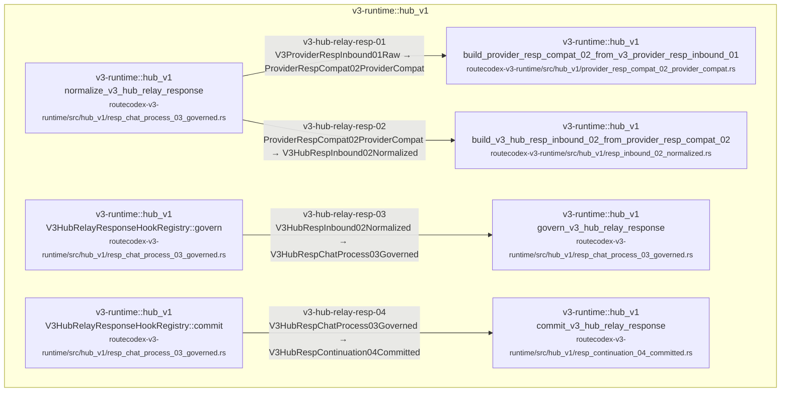

| Step | Node edge | Status | Caller | Callee | Owner |
| --- | --- | --- | --- | --- | --- |
| `v3-hub-relay-resp-01` | `V3ProviderRespInbound01Raw` → `ProviderRespCompat02ProviderCompat` | anchored | normalize_v3_hub_relay_response<br/><small>routecodex-v3-runtime/src/hub_v1/resp_chat_process_03_governed.rs</small> | build_provider_resp_compat_02_from_v3_provider_resp_inbound_01<br/><small>routecodex-v3-runtime/src/hub_v1/provider_resp_compat_02_provider_compat.rs</small> | `v3.hub_relay_response_semantics` |
| `v3-hub-relay-resp-02` | `ProviderRespCompat02ProviderCompat` → `V3HubRespInbound02Normalized` | anchored | normalize_v3_hub_relay_response<br/><small>routecodex-v3-runtime/src/hub_v1/resp_chat_process_03_governed.rs</small> | build_v3_hub_resp_inbound_02_from_provider_resp_compat_02<br/><small>routecodex-v3-runtime/src/hub_v1/resp_inbound_02_normalized.rs</small> | `v3.hub_relay_response_semantics` |
| `v3-hub-relay-resp-03` | `V3HubRespInbound02Normalized` → `V3HubRespChatProcess03Governed` | anchored | V3HubRelayResponseHookRegistry::govern<br/><small>routecodex-v3-runtime/src/hub_v1/resp_chat_process_03_governed.rs</small> | govern_v3_hub_relay_response<br/><small>routecodex-v3-runtime/src/hub_v1/resp_chat_process_03_governed.rs</small> | `v3.hub_relay_response_semantics` |
| `v3-hub-relay-resp-04` | `V3HubRespChatProcess03Governed` → `V3HubRespContinuation04Committed` | anchored | V3HubRelayResponseHookRegistry::commit<br/><small>routecodex-v3-runtime/src/hub_v1/resp_chat_process_03_governed.rs</small> | commit_v3_hub_relay_response<br/><small>routecodex-v3-runtime/src/hub_v1/resp_continuation_04_committed.rs</small> | `v3.hub_relay_response_semantics` |

## v3.protocol.anthropic.characterization

Characterization-only Anthropic request/response codec evidence. These edges do not register Hub hooks or create a second runtime lifecycle.

Owner feature: `v3.protocol_anthropic_codec_characterization`


| Step | Node edge | Status | Caller | Callee | Owner |
| --- | --- | --- | --- | --- | --- |
| `v3-protocol-anthropic-01` | `V3AnthropicClientInput01Raw` → `V3AnthropicHubRequest02Semantic` | anchored | request_characterization_preserves_anthropic_json_tool_result_and_reasoning_shape<br/><small>routecodex-v3-runtime/tests/hub_anthropic_codec_characterization.rs</small> | characterize_v3_anthropic_client_input_to_hub_semantic<br/><small>routecodex-v3-runtime/src/hub_v1/anthropic_codec.rs</small> | `v3.protocol_anthropic_codec_characterization` |
| `v3-protocol-anthropic-02` | `V3AnthropicHubRequest02Semantic` → `V3AnthropicProviderWire03Payload` | anchored | request_characterization_preserves_anthropic_json_tool_result_and_reasoning_shape<br/><small>routecodex-v3-runtime/tests/hub_anthropic_codec_characterization.rs</small> | characterize_v3_anthropic_hub_semantic_to_provider_wire<br/><small>routecodex-v3-runtime/src/hub_v1/anthropic_codec.rs</small> | `v3.protocol_anthropic_codec_characterization` |
| `v3-protocol-anthropic-03` | `V3AnthropicProviderRaw04Response` → `V3AnthropicHubResponse05Semantic` | anchored | sse_characterization_preserves_individual_reasoning_and_tool_events_without_materialization<br/><small>routecodex-v3-runtime/tests/hub_anthropic_codec_characterization.rs</small> | characterize_v3_anthropic_provider_raw_to_hub_response_semantic<br/><small>routecodex-v3-runtime/src/hub_v1/anthropic_codec.rs</small> | `v3.protocol_anthropic_codec_characterization` |
| `v3-protocol-anthropic-04` | `V3AnthropicHubResponse05Semantic` → `V3AnthropicClientProjection06Semantic` | anchored | sse_characterization_preserves_individual_reasoning_and_tool_events_without_materialization<br/><small>routecodex-v3-runtime/tests/hub_anthropic_codec_characterization.rs</small> | characterize_v3_anthropic_hub_response_semantic_to_client_projection<br/><small>routecodex-v3-runtime/src/hub_v1/anthropic_codec.rs</small> | `v3.protocol_anthropic_codec_characterization` |

## v3.protocol.openai_chat.characterization

Characterization-only native OpenAI Chat JSON/event codec evidence; no hook or runtime edge.

Owner feature: `v3.protocol_openai_chat_codec_characterization`

```mermaid
flowchart TD
  subgraph c_11_v3_protocol_openai_chat_characterization_m_v3_runtime["v3-runtime"]
    c_11_v3_protocol_openai_chat_characterization_0["v3-runtime<br/>request_preserves_messages_multiple_tool_calls_and_matching_results<br/><small>routecodex-v3-runtime/tests/hub_openai_chat_codec_characterization.rs</small>"]
    c_11_v3_protocol_openai_chat_characterization_3["v3-runtime<br/>sse_characterization_preserves_individual_delta_events_without_materialization<br/><small>routecodex-v3-runtime/tests/hub_openai_chat_codec_characterization.rs</small>"]
  end
  subgraph c_11_v3_protocol_openai_chat_characterization_m_v3_runtime__hub_v1["v3-runtime::hub_v1"]
    c_11_v3_protocol_openai_chat_characterization_1["v3-runtime::hub_v1<br/>characterize_v3_openai_chat_client_input_to_hub_semantic<br/><small>routecodex-v3-runtime/src/hub_v1/openai_chat_codec.rs</small>"]
    c_11_v3_protocol_openai_chat_characterization_2["v3-runtime::hub_v1<br/>characterize_v3_openai_chat_hub_semantic_to_provider_wire<br/><small>routecodex-v3-runtime/src/hub_v1/openai_chat_codec.rs</small>"]
    c_11_v3_protocol_openai_chat_characterization_4["v3-runtime::hub_v1<br/>characterize_v3_openai_chat_provider_raw_to_hub_response_semantic<br/><small>routecodex-v3-runtime/src/hub_v1/openai_chat_codec.rs</small>"]
    c_11_v3_protocol_openai_chat_characterization_5["v3-runtime::hub_v1<br/>characterize_v3_openai_chat_hub_response_semantic_to_client_projection<br/><small>routecodex-v3-runtime/src/hub_v1/openai_chat_codec.rs</small>"]
  end
  c_11_v3_protocol_openai_chat_characterization_0 -->|v3-protocol-openai-chat-01<br/>V3OpenAiChatClientInput01Raw → V3OpenAiChatHubRequest02Semantic| c_11_v3_protocol_openai_chat_characterization_1
  c_11_v3_protocol_openai_chat_characterization_0 -->|v3-protocol-openai-chat-02<br/>V3OpenAiChatHubRequest02Semantic → V3OpenAiChatProviderWire03Payload| c_11_v3_protocol_openai_chat_characterization_2
  c_11_v3_protocol_openai_chat_characterization_3 -->|v3-protocol-openai-chat-03<br/>V3OpenAiChatProviderRaw04Response → V3OpenAiChatHubResponse05Semantic| c_11_v3_protocol_openai_chat_characterization_4
  c_11_v3_protocol_openai_chat_characterization_3 -->|v3-protocol-openai-chat-04<br/>V3OpenAiChatHubResponse05Semantic → V3OpenAiChatClientProjection06Semantic| c_11_v3_protocol_openai_chat_characterization_5
```

| Step | Node edge | Status | Caller | Callee | Owner |
| --- | --- | --- | --- | --- | --- |
| `v3-protocol-openai-chat-01` | `V3OpenAiChatClientInput01Raw` → `V3OpenAiChatHubRequest02Semantic` | anchored | request_preserves_messages_multiple_tool_calls_and_matching_results<br/><small>routecodex-v3-runtime/tests/hub_openai_chat_codec_characterization.rs</small> | characterize_v3_openai_chat_client_input_to_hub_semantic<br/><small>routecodex-v3-runtime/src/hub_v1/openai_chat_codec.rs</small> | `v3.protocol_openai_chat_codec_characterization` |
| `v3-protocol-openai-chat-02` | `V3OpenAiChatHubRequest02Semantic` → `V3OpenAiChatProviderWire03Payload` | anchored | request_preserves_messages_multiple_tool_calls_and_matching_results<br/><small>routecodex-v3-runtime/tests/hub_openai_chat_codec_characterization.rs</small> | characterize_v3_openai_chat_hub_semantic_to_provider_wire<br/><small>routecodex-v3-runtime/src/hub_v1/openai_chat_codec.rs</small> | `v3.protocol_openai_chat_codec_characterization` |
| `v3-protocol-openai-chat-03` | `V3OpenAiChatProviderRaw04Response` → `V3OpenAiChatHubResponse05Semantic` | anchored | sse_characterization_preserves_individual_delta_events_without_materialization<br/><small>routecodex-v3-runtime/tests/hub_openai_chat_codec_characterization.rs</small> | characterize_v3_openai_chat_provider_raw_to_hub_response_semantic<br/><small>routecodex-v3-runtime/src/hub_v1/openai_chat_codec.rs</small> | `v3.protocol_openai_chat_codec_characterization` |
| `v3-protocol-openai-chat-04` | `V3OpenAiChatHubResponse05Semantic` → `V3OpenAiChatClientProjection06Semantic` | anchored | sse_characterization_preserves_individual_delta_events_without_materialization<br/><small>routecodex-v3-runtime/tests/hub_openai_chat_codec_characterization.rs</small> | characterize_v3_openai_chat_hub_response_semantic_to_client_projection<br/><small>routecodex-v3-runtime/src/hub_v1/openai_chat_codec.rs</small> | `v3.protocol_openai_chat_codec_characterization` |

## v3.protocol.gemini.characterization

Characterization-only native Gemini JSON/event codec evidence; no hook, Server endpoint implementation, or runtime edge.

Owner feature: `v3.protocol_gemini_codec_characterization`

```mermaid
flowchart TD
  subgraph c_12_v3_protocol_gemini_characterization_m_v3_runtime["v3-runtime"]
    c_12_v3_protocol_gemini_characterization_0["v3-runtime<br/>request_preserves_contents_tools_and_function_response_pairs<br/><small>routecodex-v3-runtime/tests/hub_gemini_codec_characterization.rs</small>"]
    c_12_v3_protocol_gemini_characterization_3["v3-runtime<br/>sse_characterization_preserves_individual_candidate_events_without_materialization<br/><small>routecodex-v3-runtime/tests/hub_gemini_codec_characterization.rs</small>"]
  end
  subgraph c_12_v3_protocol_gemini_characterization_m_v3_runtime__hub_v1["v3-runtime::hub_v1"]
    c_12_v3_protocol_gemini_characterization_1["v3-runtime::hub_v1<br/>characterize_v3_gemini_client_input_to_hub_semantic<br/><small>routecodex-v3-runtime/src/hub_v1/gemini_codec.rs</small>"]
    c_12_v3_protocol_gemini_characterization_2["v3-runtime::hub_v1<br/>characterize_v3_gemini_hub_semantic_to_provider_wire<br/><small>routecodex-v3-runtime/src/hub_v1/gemini_codec.rs</small>"]
    c_12_v3_protocol_gemini_characterization_4["v3-runtime::hub_v1<br/>characterize_v3_gemini_provider_raw_to_hub_response_semantic<br/><small>routecodex-v3-runtime/src/hub_v1/gemini_codec.rs</small>"]
    c_12_v3_protocol_gemini_characterization_5["v3-runtime::hub_v1<br/>characterize_v3_gemini_hub_response_semantic_to_client_projection<br/><small>routecodex-v3-runtime/src/hub_v1/gemini_codec.rs</small>"]
  end
  c_12_v3_protocol_gemini_characterization_0 -->|v3-protocol-gemini-01<br/>V3GeminiClientInput01Raw → V3GeminiHubRequest02Semantic| c_12_v3_protocol_gemini_characterization_1
  c_12_v3_protocol_gemini_characterization_0 -->|v3-protocol-gemini-02<br/>V3GeminiHubRequest02Semantic → V3GeminiProviderWire03Payload| c_12_v3_protocol_gemini_characterization_2
  c_12_v3_protocol_gemini_characterization_3 -->|v3-protocol-gemini-03<br/>V3GeminiProviderRaw04Response → V3GeminiHubResponse05Semantic| c_12_v3_protocol_gemini_characterization_4
  c_12_v3_protocol_gemini_characterization_3 -->|v3-protocol-gemini-04<br/>V3GeminiHubResponse05Semantic → V3GeminiClientProjection06Semantic| c_12_v3_protocol_gemini_characterization_5
```

| Step | Node edge | Status | Caller | Callee | Owner |
| --- | --- | --- | --- | --- | --- |
| `v3-protocol-gemini-01` | `V3GeminiClientInput01Raw` → `V3GeminiHubRequest02Semantic` | anchored | request_preserves_contents_tools_and_function_response_pairs<br/><small>routecodex-v3-runtime/tests/hub_gemini_codec_characterization.rs</small> | characterize_v3_gemini_client_input_to_hub_semantic<br/><small>routecodex-v3-runtime/src/hub_v1/gemini_codec.rs</small> | `v3.protocol_gemini_codec_characterization` |
| `v3-protocol-gemini-02` | `V3GeminiHubRequest02Semantic` → `V3GeminiProviderWire03Payload` | anchored | request_preserves_contents_tools_and_function_response_pairs<br/><small>routecodex-v3-runtime/tests/hub_gemini_codec_characterization.rs</small> | characterize_v3_gemini_hub_semantic_to_provider_wire<br/><small>routecodex-v3-runtime/src/hub_v1/gemini_codec.rs</small> | `v3.protocol_gemini_codec_characterization` |
| `v3-protocol-gemini-03` | `V3GeminiProviderRaw04Response` → `V3GeminiHubResponse05Semantic` | anchored | sse_characterization_preserves_individual_candidate_events_without_materialization<br/><small>routecodex-v3-runtime/tests/hub_gemini_codec_characterization.rs</small> | characterize_v3_gemini_provider_raw_to_hub_response_semantic<br/><small>routecodex-v3-runtime/src/hub_v1/gemini_codec.rs</small> | `v3.protocol_gemini_codec_characterization` |
| `v3-protocol-gemini-04` | `V3GeminiHubResponse05Semantic` → `V3GeminiClientProjection06Semantic` | anchored | sse_characterization_preserves_individual_candidate_events_without_materialization<br/><small>routecodex-v3-runtime/tests/hub_gemini_codec_characterization.rs</small> | characterize_v3_gemini_hub_response_semantic_to_client_projection<br/><small>routecodex-v3-runtime/src/hub_v1/gemini_codec.rs</small> | `v3.protocol_gemini_codec_characterization` |

## v3.hub_pipeline.v1.relay_payload_copy_runtime_probes

Test-only probes bind copy-budget observations to existing Relay nodes without adding a runtime edge or second truth.

Owner feature: `v3.hub_relay_payload_copy_runtime_probes`

```mermaid
flowchart TD
  subgraph c_13_v3_hub_pipeline_v1_relay_payload_copy_runtime_probes_m_v3_runtime["v3-runtime"]
    c_13_v3_hub_pipeline_v1_relay_payload_copy_runtime_probes_0["v3-runtime<br/>relay_json_moves_one_business_payload_through_req04<br/><small>routecodex-v3-runtime/tests/hub_relay_payload_copy_runtime_probes.rs</small>"]
    c_13_v3_hub_pipeline_v1_relay_payload_copy_runtime_probes_2["v3-runtime<br/>relay_sse_keeps_one_canonical_payload_without_materializing_stream<br/><small>routecodex-v3-runtime/tests/hub_relay_payload_copy_runtime_probes.rs</small>"]
    c_13_v3_hub_pipeline_v1_relay_payload_copy_runtime_probes_4["v3-runtime<br/>local_context_is_retained_until_req04_outcome_release<br/><small>routecodex-v3-runtime/tests/hub_relay_payload_copy_runtime_probes.rs</small>"]
    c_13_v3_hub_pipeline_v1_relay_payload_copy_runtime_probes_6["v3-runtime<br/>servertool_roundtrip_uses_one_resp04_context_and_restores_before_req04_hook<br/><small>routecodex-v3-runtime/tests/hub_relay_payload_copy_runtime_probes.rs</small>"]
  end
  subgraph c_13_v3_hub_pipeline_v1_relay_payload_copy_runtime_probes_m_v3_runtime__hub_v1["v3-runtime::hub_v1"]
    c_13_v3_hub_pipeline_v1_relay_payload_copy_runtime_probes_1["v3-runtime::hub_v1<br/>V3HubRelayRequestHooks::run<br/><small>routecodex-v3-runtime/src/hub_v1/relay_request.rs</small>"]
    c_13_v3_hub_pipeline_v1_relay_payload_copy_runtime_probes_3["v3-runtime::hub_v1<br/>V3HubRelayResponseHookRegistry::normalize<br/><small>routecodex-v3-runtime/src/hub_v1/resp_chat_process_03_governed.rs</small>"]
    c_13_v3_hub_pipeline_v1_relay_payload_copy_runtime_probes_5["v3-runtime::hub_v1<br/>restore_local_context_at_req04<br/><small>routecodex-v3-runtime/src/hub_v1/relay_request.rs</small>"]
    c_13_v3_hub_pipeline_v1_relay_payload_copy_runtime_probes_7["v3-runtime::hub_v1<br/>V3HubRelayResponseHookRegistry::commit<br/><small>routecodex-v3-runtime/src/hub_v1/resp_chat_process_03_governed.rs</small>"]
  end
  c_13_v3_hub_pipeline_v1_relay_payload_copy_runtime_probes_0 -->|v3-hub-relay-copy-probe-01<br/>V3HubReqInbound01ClientRaw → V3HubReqInbound02Normalized| c_13_v3_hub_pipeline_v1_relay_payload_copy_runtime_probes_1
  c_13_v3_hub_pipeline_v1_relay_payload_copy_runtime_probes_2 -->|v3-hub-relay-copy-probe-02<br/>V3ProviderRespInbound01Raw → ProviderRespCompat02ProviderCompat| c_13_v3_hub_pipeline_v1_relay_payload_copy_runtime_probes_3
  c_13_v3_hub_pipeline_v1_relay_payload_copy_runtime_probes_2 -->|v3-hub-relay-copy-probe-03<br/>ProviderRespCompat02ProviderCompat → V3HubRespInbound02Normalized| c_13_v3_hub_pipeline_v1_relay_payload_copy_runtime_probes_3
  c_13_v3_hub_pipeline_v1_relay_payload_copy_runtime_probes_4 -->|v3-hub-relay-copy-probe-04<br/>V3HubReqContinuation03Classified → V3HubReqChatProcess04Governed| c_13_v3_hub_pipeline_v1_relay_payload_copy_runtime_probes_5
  c_13_v3_hub_pipeline_v1_relay_payload_copy_runtime_probes_6 -->|v3-hub-relay-copy-probe-05<br/>V3HubRespChatProcess03Governed → V3HubRespContinuation04Committed| c_13_v3_hub_pipeline_v1_relay_payload_copy_runtime_probes_7
```

| Step | Node edge | Status | Caller | Callee | Owner |
| --- | --- | --- | --- | --- | --- |
| `v3-hub-relay-copy-probe-01` | `V3HubReqInbound01ClientRaw` → `V3HubReqInbound02Normalized` | anchored | relay_json_moves_one_business_payload_through_req04<br/><small>routecodex-v3-runtime/tests/hub_relay_payload_copy_runtime_probes.rs</small> | V3HubRelayRequestHooks::run<br/><small>routecodex-v3-runtime/src/hub_v1/relay_request.rs</small> | `v3.hub_relay_payload_copy_runtime_probes` |
| `v3-hub-relay-copy-probe-02` | `V3ProviderRespInbound01Raw` → `ProviderRespCompat02ProviderCompat` | anchored | relay_sse_keeps_one_canonical_payload_without_materializing_stream<br/><small>routecodex-v3-runtime/tests/hub_relay_payload_copy_runtime_probes.rs</small> | V3HubRelayResponseHookRegistry::normalize<br/><small>routecodex-v3-runtime/src/hub_v1/resp_chat_process_03_governed.rs</small> | `v3.hub_relay_payload_copy_runtime_probes` |
| `v3-hub-relay-copy-probe-03` | `ProviderRespCompat02ProviderCompat` → `V3HubRespInbound02Normalized` | anchored | relay_sse_keeps_one_canonical_payload_without_materializing_stream<br/><small>routecodex-v3-runtime/tests/hub_relay_payload_copy_runtime_probes.rs</small> | V3HubRelayResponseHookRegistry::normalize<br/><small>routecodex-v3-runtime/src/hub_v1/resp_chat_process_03_governed.rs</small> | `v3.hub_relay_payload_copy_runtime_probes` |
| `v3-hub-relay-copy-probe-04` | `V3HubReqContinuation03Classified` → `V3HubReqChatProcess04Governed` | anchored | local_context_is_retained_until_req04_outcome_release<br/><small>routecodex-v3-runtime/tests/hub_relay_payload_copy_runtime_probes.rs</small> | restore_local_context_at_req04<br/><small>routecodex-v3-runtime/src/hub_v1/relay_request.rs</small> | `v3.hub_relay_payload_copy_runtime_probes` |
| `v3-hub-relay-copy-probe-05` | `V3HubRespChatProcess03Governed` → `V3HubRespContinuation04Committed` | anchored | servertool_roundtrip_uses_one_resp04_context_and_restores_before_req04_hook<br/><small>routecodex-v3-runtime/tests/hub_relay_payload_copy_runtime_probes.rs</small> | V3HubRelayResponseHookRegistry::commit<br/><small>routecodex-v3-runtime/src/hub_v1/resp_chat_process_03_governed.rs</small> | `v3.hub_relay_payload_copy_runtime_probes` |

## v3.server.startup

Atomic multi-listener startup plus strict HTTP boundary; valid business requests enter Runtime and invalid input enters the global typed Error chain before Runtime.

Owner feature: `v3.foundation_p0_p2`

```mermaid
flowchart TD
  subgraph c_14_v3_server_startup_m_v3_debug["v3-debug"]
    c_14_v3_server_startup_6["v3-debug<br/>register_v3_debug_01_pending_endpoint_event<br/><small>routecodex-v3-debug/src/lib.rs</small>"]
  end
  subgraph c_14_v3_server_startup_m_v3_error["v3-error"]
    c_14_v3_server_startup_5["v3-error<br/>project_v3_http_boundary_error<br/><small>routecodex-v3-error/src/lib.rs</small>"]
    c_14_v3_server_startup_7["v3-error<br/>project_v3_pending_endpoint_error<br/><small>routecodex-v3-error/src/lib.rs</small>"]
  end
  subgraph c_14_v3_server_startup_m_v3_server["v3-server"]
    c_14_v3_server_startup_0["v3-server<br/>spawn_v3_server_aggregate<br/><small>routecodex-v3-server/src/lib.rs</small>"]
    c_14_v3_server_startup_1["v3-server<br/>build_v3_server_startup_01_listener_set_from_config_05<br/><small>routecodex-v3-server/src/lib.rs</small>"]
    c_14_v3_server_startup_2["v3-server<br/>pending_endpoint<br/><small>routecodex-v3-server/src/lib.rs</small>"]
    c_14_v3_server_startup_3["v3-server<br/>build_v3_server_03_http_request_raw<br/><small>routecodex-v3-server/src/lib.rs</small>"]
    c_14_v3_server_startup_4["v3-server<br/>read_json_payload<br/><small>routecodex-v3-server/src/lib.rs</small>"]
    c_14_v3_server_startup_8["v3-server<br/>build_v3_server_16_http_frame_from_v3_error_06<br/><small>routecodex-v3-server/src/lib.rs</small>"]
  end
  c_14_v3_server_startup_0 -->|v3-srv-01<br/>V3Config05ManifestPublished → V3ServerStartup01ListenerSetPreflight| c_14_v3_server_startup_1
  c_14_v3_server_startup_2 -->|v3-srv-02<br/>V3ServerStartup01ListenerSetPreflight → V3Server03HttpRequestRaw| c_14_v3_server_startup_3
  c_14_v3_server_startup_4 -->|v3-srv-http-error-01<br/>V3Server03HttpRequestRaw → V3Error01SourceRaised| c_14_v3_server_startup_5
  c_14_v3_server_startup_2 -->|v3-srv-03<br/>V3Server03HttpRequestRaw → V3Debug01NodeEventRegistered| c_14_v3_server_startup_6
  c_14_v3_server_startup_2 -->|v3-srv-04<br/>V3Debug01NodeEventRegistered → V3Error06ClientProjected| c_14_v3_server_startup_7
  c_14_v3_server_startup_2 -->|v3-srv-05<br/>V3Error06ClientProjected → V3Server16HttpFrame| c_14_v3_server_startup_8
```

| Step | Node edge | Status | Caller | Callee | Owner |
| --- | --- | --- | --- | --- | --- |
| `v3-srv-01` | `V3Config05ManifestPublished` → `V3ServerStartup01ListenerSetPreflight` | anchored | spawn_v3_server_aggregate<br/><small>routecodex-v3-server/src/lib.rs</small> | build_v3_server_startup_01_listener_set_from_config_05<br/><small>routecodex-v3-server/src/lib.rs</small> | `v3.foundation_p0_p2` |
| `v3-srv-02` | `V3ServerStartup01ListenerSetPreflight` → `V3Server03HttpRequestRaw` | anchored | pending_endpoint<br/><small>routecodex-v3-server/src/lib.rs</small> | build_v3_server_03_http_request_raw<br/><small>routecodex-v3-server/src/lib.rs</small> | `v3.foundation_p0_p2` |
| `v3-srv-http-error-01` | `V3Server03HttpRequestRaw` → `V3Error01SourceRaised` | anchored | read_json_payload<br/><small>routecodex-v3-server/src/lib.rs</small> | project_v3_http_boundary_error<br/><small>routecodex-v3-error/src/lib.rs</small> | `v3.config_server_full_function` |
| `v3-srv-03` | `V3Server03HttpRequestRaw` → `V3Debug01NodeEventRegistered` | anchored | pending_endpoint<br/><small>routecodex-v3-server/src/lib.rs</small> | register_v3_debug_01_pending_endpoint_event<br/><small>routecodex-v3-debug/src/lib.rs</small> | `v3.foundation_p0_p2` |
| `v3-srv-04` | `V3Debug01NodeEventRegistered` → `V3Error06ClientProjected` | anchored | pending_endpoint<br/><small>routecodex-v3-server/src/lib.rs</small> | project_v3_pending_endpoint_error<br/><small>routecodex-v3-error/src/lib.rs</small> | `v3.foundation_p0_p2` |
| `v3-srv-05` | `V3Error06ClientProjected` → `V3Server16HttpFrame` | anchored | pending_endpoint<br/><small>routecodex-v3-server/src/lib.rs</small> | build_v3_server_16_http_frame_from_v3_error_06<br/><small>routecodex-v3-server/src/lib.rs</small> | `v3.foundation_p0_p2` |

## v3.debug_error_foundation.mainline

P3/P4 Runtime foundation: Server enters Runtime, Debug records side-channel evidence, Error traverses six adjacent nodes, Provider owns health state.

Owner feature: `v3.debug_error_foundation`

```mermaid
flowchart TD
  subgraph c_15_v3_debug_error_foundation_mainline_m_v3_debug["v3-debug"]
    c_15_v3_debug_error_foundation_mainline_1["v3-debug<br/>V3DebugRuntime::start_trace<br/><small>routecodex-v3-debug/src/lib.rs</small>"]
    c_15_v3_debug_error_foundation_mainline_2["v3-debug<br/>V3DebugRuntime::capture_raw_request<br/><small>routecodex-v3-debug/src/lib.rs</small>"]
    c_15_v3_debug_error_foundation_mainline_3["v3-debug<br/>V3DebugRuntime::record_node_event<br/><small>routecodex-v3-debug/src/lib.rs</small>"]
    c_15_v3_debug_error_foundation_mainline_12["v3-debug<br/>V3DebugRuntime::build_dry_run_execution_plan<br/><small>routecodex-v3-debug/src/lib.rs</small>"]
    c_15_v3_debug_error_foundation_mainline_13["v3-debug<br/>V3DebugRuntime::start_snapshot_session<br/><small>routecodex-v3-debug/src/lib.rs</small>"]
  end
  subgraph c_15_v3_debug_error_foundation_mainline_m_v3_error["v3-error"]
    c_15_v3_debug_error_foundation_mainline_5["v3-error<br/>build_v3_error_01_source_raised<br/><small>routecodex-v3-error/src/lib.rs</small>"]
    c_15_v3_debug_error_foundation_mainline_6["v3-error<br/>build_v3_error_02_classified_from_v3_error_01<br/><small>routecodex-v3-error/src/lib.rs</small>"]
    c_15_v3_debug_error_foundation_mainline_7["v3-error<br/>build_v3_error_03_target_local_action_from_v3_error_02<br/><small>routecodex-v3-error/src/lib.rs</small>"]
    c_15_v3_debug_error_foundation_mainline_8["v3-error<br/>build_v3_error_04_target_exhaustion_decision_from_v3_error_03<br/><small>routecodex-v3-error/src/lib.rs</small>"]
    c_15_v3_debug_error_foundation_mainline_9["v3-error<br/>build_v3_error_05_execution_decision_from_v3_error_04<br/><small>routecodex-v3-error/src/lib.rs</small>"]
    c_15_v3_debug_error_foundation_mainline_10["v3-error<br/>build_v3_error_06_client_projected_from_v3_error_05<br/><small>routecodex-v3-error/src/lib.rs</small>"]
  end
  subgraph c_15_v3_debug_error_foundation_mainline_m_v3_provider_responses["v3-provider-responses"]
    c_15_v3_debug_error_foundation_mainline_14["v3-provider-responses<br/>V3ProviderHealthStore::apply_error_action<br/><small>routecodex-v3-provider-responses/src/health.rs</small>"]
    c_15_v3_debug_error_foundation_mainline_15["v3-provider-responses<br/>V3ProviderHealthStore::availability<br/><small>routecodex-v3-provider-responses/src/health.rs</small>"]
    c_15_v3_debug_error_foundation_mainline_17["v3-provider-responses<br/>V3ProviderHealthStore::record_provider_failure<br/><small>routecodex-v3-provider-responses/src/health.rs</small>"]
    c_15_v3_debug_error_foundation_mainline_18["v3-provider-responses<br/>V3ProviderHealthStore::record_provider_success<br/><small>routecodex-v3-provider-responses/src/health.rs</small>"]
  end
  subgraph c_15_v3_debug_error_foundation_mainline_m_v3_runtime["v3-runtime"]
    c_15_v3_debug_error_foundation_mainline_0["v3-runtime<br/>execute_v3_foundation_pending_runtime<br/><small>routecodex-v3-runtime/src/foundation.rs</small>"]
    c_15_v3_debug_error_foundation_mainline_4["v3-runtime<br/>build_pending_projection<br/><small>routecodex-v3-runtime/src/foundation.rs</small>"]
    c_15_v3_debug_error_foundation_mainline_11["v3-runtime<br/>execute_v3_responses_direct_dry_run_runtime<br/><small>routecodex-v3-runtime/src/kernel.rs</small>"]
    c_15_v3_debug_error_foundation_mainline_16["v3-runtime<br/>execute_v3_responses_direct_runtime_kernel_core<br/><small>routecodex-v3-runtime/src/kernel.rs</small>"]
  end
  c_15_v3_debug_error_foundation_mainline_0 -->|v3-de-01<br/>V3Server03HttpRequestRaw → V3DebugTraceContextStarted| c_15_v3_debug_error_foundation_mainline_1
  c_15_v3_debug_error_foundation_mainline_0 -->|v3-de-02<br/>V3DebugTraceContextStarted → V3DebugRawCaptureStored| c_15_v3_debug_error_foundation_mainline_2
  c_15_v3_debug_error_foundation_mainline_0 -->|v3-de-03<br/>V3DebugTraceContextStarted → V3DebugEventLedgerRecorded| c_15_v3_debug_error_foundation_mainline_3
  c_15_v3_debug_error_foundation_mainline_4 -->|v3-de-04<br/>V3Server03HttpRequestRaw → V3Error01SourceRaised| c_15_v3_debug_error_foundation_mainline_5
  c_15_v3_debug_error_foundation_mainline_4 -->|v3-de-05<br/>V3Error01SourceRaised → V3Error02Classified| c_15_v3_debug_error_foundation_mainline_6
  c_15_v3_debug_error_foundation_mainline_4 -->|v3-de-06<br/>V3Error02Classified → V3Error03TargetLocalAction| c_15_v3_debug_error_foundation_mainline_7
  c_15_v3_debug_error_foundation_mainline_4 -->|v3-de-07<br/>V3Error03TargetLocalAction → V3Error04TargetExhaustionDecision| c_15_v3_debug_error_foundation_mainline_8
  c_15_v3_debug_error_foundation_mainline_4 -->|v3-de-08<br/>V3Error04TargetExhaustionDecision → V3Error05ExecutionDecision| c_15_v3_debug_error_foundation_mainline_9
  c_15_v3_debug_error_foundation_mainline_4 -->|v3-de-09<br/>V3Error05ExecutionDecision → V3Error06ClientProjected| c_15_v3_debug_error_foundation_mainline_10
  c_15_v3_debug_error_foundation_mainline_11 -->|v3-de-10<br/>V3DryRunFixture → V3DryRunNoNetworkTerminalEffect| c_15_v3_debug_error_foundation_mainline_12
  c_15_v3_debug_error_foundation_mainline_11 -->|v3-de-11<br/>V3DebugTraceContextStarted → V3DebugSnapshotSessionRegistered| c_15_v3_debug_error_foundation_mainline_13
  c_15_v3_debug_error_foundation_mainline_14 -->|v3-de-12<br/>V3Error03TargetLocalAction → V3ProviderHealthStateMutated| c_15_v3_debug_error_foundation_mainline_14
  c_15_v3_debug_error_foundation_mainline_15 -->|v3-de-13<br/>V3ProviderHealthStateMutated → V3ProviderAvailabilityProjected| c_15_v3_debug_error_foundation_mainline_15
  c_15_v3_debug_error_foundation_mainline_16 -->|v3-de-14<br/>V3Transport13ResponsesHttpRequest → V3ProviderHealthStateMutated| c_15_v3_debug_error_foundation_mainline_17
  c_15_v3_debug_error_foundation_mainline_16 -->|v3-de-15<br/>V3ProviderResp14Raw → V3ProviderHealthStateMutated| c_15_v3_debug_error_foundation_mainline_18
```

| Step | Node edge | Status | Caller | Callee | Owner |
| --- | --- | --- | --- | --- | --- |
| `v3-de-01` | `V3Server03HttpRequestRaw` → `V3DebugTraceContextStarted` | anchored | execute_v3_foundation_pending_runtime<br/><small>routecodex-v3-runtime/src/foundation.rs</small> | V3DebugRuntime::start_trace<br/><small>routecodex-v3-debug/src/lib.rs</small> | `v3.debug_error_foundation` |
| `v3-de-02` | `V3DebugTraceContextStarted` → `V3DebugRawCaptureStored` | anchored | execute_v3_foundation_pending_runtime<br/><small>routecodex-v3-runtime/src/foundation.rs</small> | V3DebugRuntime::capture_raw_request<br/><small>routecodex-v3-debug/src/lib.rs</small> | `v3.debug_error_foundation` |
| `v3-de-03` | `V3DebugTraceContextStarted` → `V3DebugEventLedgerRecorded` | anchored | execute_v3_foundation_pending_runtime<br/><small>routecodex-v3-runtime/src/foundation.rs</small> | V3DebugRuntime::record_node_event<br/><small>routecodex-v3-debug/src/lib.rs</small> | `v3.debug_error_foundation` |
| `v3-de-04` | `V3Server03HttpRequestRaw` → `V3Error01SourceRaised` | anchored | build_pending_projection<br/><small>routecodex-v3-runtime/src/foundation.rs</small> | build_v3_error_01_source_raised<br/><small>routecodex-v3-error/src/lib.rs</small> | `v3.debug_error_foundation` |
| `v3-de-05` | `V3Error01SourceRaised` → `V3Error02Classified` | anchored | build_pending_projection<br/><small>routecodex-v3-runtime/src/foundation.rs</small> | build_v3_error_02_classified_from_v3_error_01<br/><small>routecodex-v3-error/src/lib.rs</small> | `v3.debug_error_foundation` |
| `v3-de-06` | `V3Error02Classified` → `V3Error03TargetLocalAction` | anchored | build_pending_projection<br/><small>routecodex-v3-runtime/src/foundation.rs</small> | build_v3_error_03_target_local_action_from_v3_error_02<br/><small>routecodex-v3-error/src/lib.rs</small> | `v3.debug_error_foundation` |
| `v3-de-07` | `V3Error03TargetLocalAction` → `V3Error04TargetExhaustionDecision` | anchored | build_pending_projection<br/><small>routecodex-v3-runtime/src/foundation.rs</small> | build_v3_error_04_target_exhaustion_decision_from_v3_error_03<br/><small>routecodex-v3-error/src/lib.rs</small> | `v3.debug_error_foundation` |
| `v3-de-08` | `V3Error04TargetExhaustionDecision` → `V3Error05ExecutionDecision` | anchored | build_pending_projection<br/><small>routecodex-v3-runtime/src/foundation.rs</small> | build_v3_error_05_execution_decision_from_v3_error_04<br/><small>routecodex-v3-error/src/lib.rs</small> | `v3.debug_error_foundation` |
| `v3-de-09` | `V3Error05ExecutionDecision` → `V3Error06ClientProjected` | anchored | build_pending_projection<br/><small>routecodex-v3-runtime/src/foundation.rs</small> | build_v3_error_06_client_projected_from_v3_error_05<br/><small>routecodex-v3-error/src/lib.rs</small> | `v3.debug_error_foundation` |
| `v3-de-10` | `V3DryRunFixture` → `V3DryRunNoNetworkTerminalEffect` | anchored | execute_v3_responses_direct_dry_run_runtime<br/><small>routecodex-v3-runtime/src/kernel.rs</small> | V3DebugRuntime::build_dry_run_execution_plan<br/><small>routecodex-v3-debug/src/lib.rs</small> | `v3.debug_error_foundation` |
| `v3-de-11` | `V3DebugTraceContextStarted` → `V3DebugSnapshotSessionRegistered` | anchored | execute_v3_responses_direct_dry_run_runtime<br/><small>routecodex-v3-runtime/src/kernel.rs</small> | V3DebugRuntime::start_snapshot_session<br/><small>routecodex-v3-debug/src/lib.rs</small> | `v3.debug_error_foundation` |
| `v3-de-12` | `V3Error03TargetLocalAction` → `V3ProviderHealthStateMutated` | anchored | V3ProviderHealthStore::apply_error_action<br/><small>routecodex-v3-provider-responses/src/health.rs</small> | V3ProviderHealthStore::apply_error_action<br/><small>routecodex-v3-provider-responses/src/health.rs</small> | `v3.debug_error_foundation` |
| `v3-de-13` | `V3ProviderHealthStateMutated` → `V3ProviderAvailabilityProjected` | anchored | V3ProviderHealthStore::availability<br/><small>routecodex-v3-provider-responses/src/health.rs</small> | V3ProviderHealthStore::availability<br/><small>routecodex-v3-provider-responses/src/health.rs</small> | `v3.debug_error_foundation` |
| `v3-de-14` | `V3Transport13ResponsesHttpRequest` → `V3ProviderHealthStateMutated` | anchored | execute_v3_responses_direct_runtime_kernel_core<br/><small>routecodex-v3-runtime/src/kernel.rs</small> | V3ProviderHealthStore::record_provider_failure<br/><small>routecodex-v3-provider-responses/src/health.rs</small> | `v3.debug_error_foundation` |
| `v3-de-15` | `V3ProviderResp14Raw` → `V3ProviderHealthStateMutated` | anchored | execute_v3_responses_direct_runtime_kernel_core<br/><small>routecodex-v3-runtime/src/kernel.rs</small> | V3ProviderHealthStore::record_provider_success<br/><small>routecodex-v3-provider-responses/src/health.rs</small> | `v3.debug_error_foundation` |

## v3.responses_continuation.remote_contract_store

H4 source-only direct-owner remote locator commit/load contract. It stores locator and pin control facts only and is not wired into Hub v1.

Owner feature: `v3.remote_continuation_contract_store`

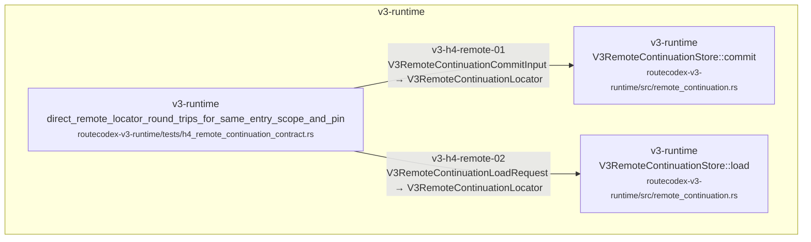

| Step | Node edge | Status | Caller | Callee | Owner |
| --- | --- | --- | --- | --- | --- |
| `v3-h4-remote-01` | `V3RemoteContinuationCommitInput` → `V3RemoteContinuationLocator` | anchored | direct_remote_locator_round_trips_for_same_entry_scope_and_pin<br/><small>routecodex-v3-runtime/tests/h4_remote_continuation_contract.rs</small> | V3RemoteContinuationStore::commit<br/><small>routecodex-v3-runtime/src/remote_continuation.rs</small> | `v3.remote_continuation_contract_store` |
| `v3-h4-remote-02` | `V3RemoteContinuationLoadRequest` → `V3RemoteContinuationLocator` | anchored | direct_remote_locator_round_trips_for_same_entry_scope_and_pin<br/><small>routecodex-v3-runtime/tests/h4_remote_continuation_contract.rs</small> | V3RemoteContinuationStore::load<br/><small>routecodex-v3-runtime/src/remote_continuation.rs</small> | `v3.remote_continuation_contract_store` |

## v3.responses_continuation.remote_locator_codec

H4 lossless locator-only codec. Unknown local context/history/tool-state fields fail decoding.

Owner feature: `v3.remote_continuation_contract_store`

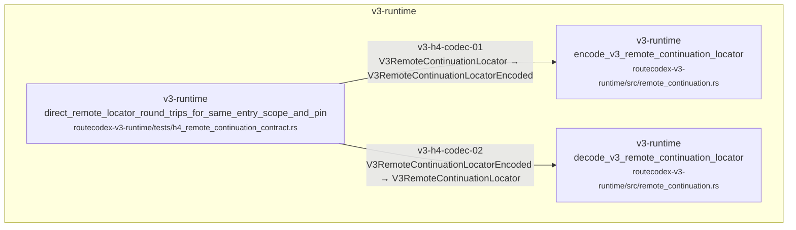

| Step | Node edge | Status | Caller | Callee | Owner |
| --- | --- | --- | --- | --- | --- |
| `v3-h4-codec-01` | `V3RemoteContinuationLocator` → `V3RemoteContinuationLocatorEncoded` | anchored | direct_remote_locator_round_trips_for_same_entry_scope_and_pin<br/><small>routecodex-v3-runtime/tests/h4_remote_continuation_contract.rs</small> | encode_v3_remote_continuation_locator<br/><small>routecodex-v3-runtime/src/remote_continuation.rs</small> | `v3.remote_continuation_contract_store` |
| `v3-h4-codec-02` | `V3RemoteContinuationLocatorEncoded` → `V3RemoteContinuationLocator` | anchored | direct_remote_locator_round_trips_for_same_entry_scope_and_pin<br/><small>routecodex-v3-runtime/tests/h4_remote_continuation_contract.rs</small> | decode_v3_remote_continuation_locator<br/><small>routecodex-v3-runtime/src/remote_continuation.rs</small> | `v3.remote_continuation_contract_store` |

## v3.responses_direct.remote_continuation.integration

Responses Direct remote continuation commits provider-owned identity at Resp04, loads direct scope at the next Req03, resolves the immutable exact provider/model/auth/transport pin at Req06, uses provider-owned Responses WebSocket v2 when remote continuation is configured, and rejoins the single Direct provider/response exit without Virtual Router re-entry.

Owner feature: `v3.responses_direct_remote_continuation_integration`

```mermaid
flowchart TD
  subgraph c_18_v3_responses_direct_remote_continuation_integration_m_v3_provider_responses["v3-provider-responses"]
    c_18_v3_responses_direct_remote_continuation_integration_4["v3-provider-responses<br/>build_v3_transport_13_responses_request_from_v3_provider_12<br/><small>routecodex-v3-provider-responses/src/transport.rs</small>"]
  end
  subgraph c_18_v3_responses_direct_remote_continuation_integration_m_v3_runtime["v3-runtime"]
    c_18_v3_responses_direct_remote_continuation_integration_0["v3-runtime<br/>execute_v3_responses_direct_runtime_kernel_core<br/><small>routecodex-v3-runtime/src/kernel.rs</small>"]
    c_18_v3_responses_direct_remote_continuation_integration_1["v3-runtime<br/>V3RemoteContinuationStore::load_for_req03<br/><small>routecodex-v3-runtime/src/remote_continuation.rs</small>"]
    c_18_v3_responses_direct_remote_continuation_integration_3["v3-runtime<br/>responses_direct_provider_transport_hook<br/><small>routecodex-v3-runtime/src/hooks.rs</small>"]
    c_18_v3_responses_direct_remote_continuation_integration_5["v3-runtime<br/>responses_direct_response_projection_hook<br/><small>routecodex-v3-runtime/src/hooks.rs</small>"]
    c_18_v3_responses_direct_remote_continuation_integration_6["v3-runtime<br/>V3RemoteContinuationStore::commit<br/><small>routecodex-v3-runtime/src/remote_continuation.rs</small>"]
    c_18_v3_responses_direct_remote_continuation_integration_7["v3-runtime<br/>V3ResponsesDirectRuntimeOutput<br/><small>routecodex-v3-runtime/src/kernel.rs</small>"]
  end
  subgraph c_18_v3_responses_direct_remote_continuation_integration_m_v3_target["v3-target"]
    c_18_v3_responses_direct_remote_continuation_integration_2["v3-target<br/>V3TargetInterpreter::resolve_exact_provider_model_auth<br/><small>routecodex-v3-target/src/lib.rs</small>"]
  end
  c_18_v3_responses_direct_remote_continuation_integration_0 -->|v3-rci-01<br/>V3Server03HttpRequestRaw → V3HubReqContinuation03Classified| c_18_v3_responses_direct_remote_continuation_integration_1
  c_18_v3_responses_direct_remote_continuation_integration_0 -->|v3-rci-02<br/>V3HubReqContinuation03Classified → V3HubReqTarget06Resolved| c_18_v3_responses_direct_remote_continuation_integration_2
  c_18_v3_responses_direct_remote_continuation_integration_3 -->|v3-rci-ws-01<br/>V3HubReqTarget06Resolved → V3Transport13ResponsesHttpRequest| c_18_v3_responses_direct_remote_continuation_integration_4
  c_18_v3_responses_direct_remote_continuation_integration_0 -->|v3-rci-03<br/>V3ProviderResp14Raw → V3DirectResp14ProviderProjectionPrepared| c_18_v3_responses_direct_remote_continuation_integration_5
  c_18_v3_responses_direct_remote_continuation_integration_0 -->|v3-rci-04<br/>V3DirectResp14ProviderProjectionPrepared → V3HubRespContinuation04Committed| c_18_v3_responses_direct_remote_continuation_integration_6
  c_18_v3_responses_direct_remote_continuation_integration_0 -->|v3-rci-05<br/>V3HubRespContinuation04Committed → V3DirectResp15ClientPayloadReady| c_18_v3_responses_direct_remote_continuation_integration_7
  c_18_v3_responses_direct_remote_continuation_integration_0 -->|v3-rci-06<br/>V3DirectResp15ClientPayloadReady → V3Resp15ClientPayload| c_18_v3_responses_direct_remote_continuation_integration_7
```

| Step | Node edge | Status | Caller | Callee | Owner |
| --- | --- | --- | --- | --- | --- |
| `v3-rci-01` | `V3Server03HttpRequestRaw` → `V3HubReqContinuation03Classified` | anchored | execute_v3_responses_direct_runtime_kernel_core<br/><small>routecodex-v3-runtime/src/kernel.rs</small> | V3RemoteContinuationStore::load_for_req03<br/><small>routecodex-v3-runtime/src/remote_continuation.rs</small> | `v3.responses_direct_remote_continuation_integration` |
| `v3-rci-02` | `V3HubReqContinuation03Classified` → `V3HubReqTarget06Resolved` | anchored | execute_v3_responses_direct_runtime_kernel_core<br/><small>routecodex-v3-runtime/src/kernel.rs</small> | V3TargetInterpreter::resolve_exact_provider_model_auth<br/><small>routecodex-v3-target/src/lib.rs</small> | `v3.responses_direct_remote_continuation_integration` |
| `v3-rci-ws-01` | `V3HubReqTarget06Resolved` → `V3Transport13ResponsesHttpRequest` | anchored | responses_direct_provider_transport_hook<br/><small>routecodex-v3-runtime/src/hooks.rs</small> | build_v3_transport_13_responses_request_from_v3_provider_12<br/><small>routecodex-v3-provider-responses/src/transport.rs</small> | `v3.responses_direct_remote_continuation_integration` |
| `v3-rci-03` | `V3ProviderResp14Raw` → `V3DirectResp14ProviderProjectionPrepared` | anchored | execute_v3_responses_direct_runtime_kernel_core<br/><small>routecodex-v3-runtime/src/kernel.rs</small> | responses_direct_response_projection_hook<br/><small>routecodex-v3-runtime/src/hooks.rs</small> | `v3.responses_direct_remote_continuation_integration` |
| `v3-rci-04` | `V3DirectResp14ProviderProjectionPrepared` → `V3HubRespContinuation04Committed` | anchored | execute_v3_responses_direct_runtime_kernel_core<br/><small>routecodex-v3-runtime/src/kernel.rs</small> | V3RemoteContinuationStore::commit<br/><small>routecodex-v3-runtime/src/remote_continuation.rs</small> | `v3.responses_direct_remote_continuation_integration` |
| `v3-rci-05` | `V3HubRespContinuation04Committed` → `V3DirectResp15ClientPayloadReady` | anchored | execute_v3_responses_direct_runtime_kernel_core<br/><small>routecodex-v3-runtime/src/kernel.rs</small> | V3ResponsesDirectRuntimeOutput<br/><small>routecodex-v3-runtime/src/kernel.rs</small> | `v3.responses_direct_remote_continuation_integration` |
| `v3-rci-06` | `V3DirectResp15ClientPayloadReady` → `V3Resp15ClientPayload` | anchored | execute_v3_responses_direct_runtime_kernel_core<br/><small>routecodex-v3-runtime/src/kernel.rs</small> | V3ResponsesDirectRuntimeOutput<br/><small>routecodex-v3-runtime/src/kernel.rs</small> | `v3.responses_direct_remote_continuation_integration` |

## v3.anthropic_relay.controlled_runtime

Controlled Anthropic /v1/messages Relay request through the sole Hub v1 lifecycle, generic Responses transport, Error01-06, and the sole Anthropic client projection exit.

Owner feature: `v3.anthropic_relay_runtime_integration`

```mermaid
flowchart TD
  subgraph c_19_v3_anthropic_relay_controlled_runtime_m_v3_provider_responses["v3-provider-responses"]
    c_19_v3_anthropic_relay_controlled_runtime_13["v3-provider-responses<br/>ResponsesTransport::send<br/><small>routecodex-v3-provider-responses/src/transport.rs</small>"]
  end
  subgraph c_19_v3_anthropic_relay_controlled_runtime_m_v3_runtime__hub_v1["v3-runtime::hub_v1"]
    c_19_v3_anthropic_relay_controlled_runtime_1["v3-runtime::hub_v1<br/>execute_v3_anthropic_relay_runtime_with_default_transport<br/><small>routecodex-v3-runtime/src/hub_v1/anthropic_relay_runtime.rs</small>"]
    c_19_v3_anthropic_relay_controlled_runtime_2["v3-runtime::hub_v1<br/>execute_v3_anthropic_relay_runtime<br/><small>routecodex-v3-runtime/src/hub_v1/anthropic_relay_runtime.rs</small>"]
    c_19_v3_anthropic_relay_controlled_runtime_3["v3-runtime::hub_v1<br/>run_v3_anthropic_relay_runtime_req_inbound<br/><small>routecodex-v3-runtime/src/hub_v1/anthropic_relay_hooks.rs</small>"]
    c_19_v3_anthropic_relay_controlled_runtime_4["v3-runtime::hub_v1<br/>V3HubRelayRequestHooks::run_from_normalized_with_events<br/><small>routecodex-v3-runtime/src/hub_v1/relay_request.rs</small>"]
    c_19_v3_anthropic_relay_controlled_runtime_5["v3-runtime::hub_v1<br/>build_v3_hub_req_continuation_03_from_v3_hub_req_inbound_02<br/><small>routecodex-v3-runtime/src/hub_v1/req_continuation_03_classified.rs</small>"]
    c_19_v3_anthropic_relay_controlled_runtime_6["v3-runtime::hub_v1<br/>build_v3_hub_req_chat_process_04_from_v3_hub_req_continuation_03<br/><small>routecodex-v3-runtime/src/hub_v1/req_chat_process_04_governed.rs</small>"]
    c_19_v3_anthropic_relay_controlled_runtime_7["v3-runtime::hub_v1<br/>build_v3_hub_req_execution_05_from_v3_hub_req_chat_process_04<br/><small>routecodex-v3-runtime/src/hub_v1/req_execution_05_planned.rs</small>"]
    c_19_v3_anthropic_relay_controlled_runtime_8["v3-runtime::hub_v1<br/>build_v3_hub_req_target_06_from_v3_hub_req_execution_05<br/><small>routecodex-v3-runtime/src/hub_v1/req_target_06_resolved.rs</small>"]
    c_19_v3_anthropic_relay_controlled_runtime_9["v3-runtime::hub_v1<br/>build_v3_hub_req_outbound_07_from_v3_hub_req_target_06<br/><small>routecodex-v3-runtime/src/hub_v1/req_outbound_07_provider_semantic.rs</small>"]
    c_19_v3_anthropic_relay_controlled_runtime_10["v3-runtime::hub_v1<br/>build_provider_req_compat_06_from_v3_hub_req_outbound_07<br/><small>routecodex-v3-runtime/src/hub_v1/provider_req_compat_06_provider_compat.rs</small>"]
    c_19_v3_anthropic_relay_controlled_runtime_11["v3-runtime::hub_v1<br/>build_v3_provider_req_outbound_08_from_provider_req_compat_06<br/><small>routecodex-v3-runtime/src/hub_v1/provider_req_outbound_08_wire_payload.rs</small>"]
    c_19_v3_anthropic_relay_controlled_runtime_12["v3-runtime::hub_v1<br/>build_v3_provider_req_outbound_09_from_v3_provider_req_outbound_08<br/><small>routecodex-v3-runtime/src/hub_v1/provider_req_outbound_09_transport_request.rs</small>"]
    c_19_v3_anthropic_relay_controlled_runtime_14["v3-runtime::hub_v1<br/>build_provider_resp_compat_02_from_v3_provider_resp_inbound_01<br/><small>routecodex-v3-runtime/src/hub_v1/provider_resp_compat_02_provider_compat.rs</small>"]
    c_19_v3_anthropic_relay_controlled_runtime_15["v3-runtime::hub_v1<br/>build_v3_hub_resp_inbound_02_from_provider_resp_compat_02<br/><small>routecodex-v3-runtime/src/hub_v1/resp_inbound_02_normalized.rs</small>"]
    c_19_v3_anthropic_relay_controlled_runtime_16["v3-runtime::hub_v1<br/>V3HubRelayResponseHookRegistry::govern<br/><small>routecodex-v3-runtime/src/hub_v1/resp_chat_process_03_governed.rs</small>"]
    c_19_v3_anthropic_relay_controlled_runtime_17["v3-runtime::hub_v1<br/>V3HubRelayResponseHookRegistry::commit<br/><small>routecodex-v3-runtime/src/hub_v1/resp_chat_process_03_governed.rs</small>"]
    c_19_v3_anthropic_relay_controlled_runtime_18["v3-runtime::hub_v1<br/>build_v3_hub_resp_outbound_05_from_v3_hub_resp_continuation_04<br/><small>routecodex-v3-runtime/src/hub_v1/resp_outbound_05_client_semantic.rs</small>"]
    c_19_v3_anthropic_relay_controlled_runtime_19["v3-runtime::hub_v1<br/>build_v3_server_resp_outbound_06_from_v3_hub_resp_outbound_05<br/><small>routecodex-v3-runtime/src/hub_v1/server_resp_outbound_06_client_frame.rs</small>"]
  end
  subgraph c_19_v3_anthropic_relay_controlled_runtime_m_v3_server["v3-server"]
    c_19_v3_anthropic_relay_controlled_runtime_0["v3-server<br/>execute_v3_anthropic_messages_request<br/><small>routecodex-v3-server/src/lib.rs</small>"]
  end
  c_19_v3_anthropic_relay_controlled_runtime_0 -->|v3-anthropic-relay-01<br/>V3ServerValidatedMessagesRequest → V3HubReqInbound01ClientRaw| c_19_v3_anthropic_relay_controlled_runtime_1
  c_19_v3_anthropic_relay_controlled_runtime_2 -->|v3-anthropic-relay-02<br/>V3HubReqInbound01ClientRaw → V3HubReqInbound02Normalized| c_19_v3_anthropic_relay_controlled_runtime_3
  c_19_v3_anthropic_relay_controlled_runtime_4 -->|v3-anthropic-relay-03<br/>V3HubReqInbound02Normalized → V3HubReqContinuation03Classified| c_19_v3_anthropic_relay_controlled_runtime_5
  c_19_v3_anthropic_relay_controlled_runtime_4 -->|v3-anthropic-relay-04<br/>V3HubReqContinuation03Classified → V3HubReqChatProcess04Governed| c_19_v3_anthropic_relay_controlled_runtime_6
  c_19_v3_anthropic_relay_controlled_runtime_2 -->|v3-anthropic-relay-05<br/>V3HubReqChatProcess04Governed → V3HubReqExecution05Planned| c_19_v3_anthropic_relay_controlled_runtime_7
  c_19_v3_anthropic_relay_controlled_runtime_2 -->|v3-anthropic-relay-06<br/>V3HubReqExecution05Planned → V3HubReqTarget06Resolved| c_19_v3_anthropic_relay_controlled_runtime_8
  c_19_v3_anthropic_relay_controlled_runtime_2 -->|v3-anthropic-relay-07<br/>V3HubReqTarget06Resolved → V3HubReqOutbound07ProviderSemantic| c_19_v3_anthropic_relay_controlled_runtime_9
  c_19_v3_anthropic_relay_controlled_runtime_2 -->|v3-anthropic-relay-08<br/>V3HubReqOutbound07ProviderSemantic → ProviderReqCompat06ProviderCompat| c_19_v3_anthropic_relay_controlled_runtime_10
  c_19_v3_anthropic_relay_controlled_runtime_2 -->|v3-anthropic-relay-09<br/>ProviderReqCompat06ProviderCompat → V3ProviderReqOutbound08WirePayload| c_19_v3_anthropic_relay_controlled_runtime_11
  c_19_v3_anthropic_relay_controlled_runtime_2 -->|v3-anthropic-relay-10<br/>V3ProviderReqOutbound08WirePayload → V3ProviderReqOutbound09TransportRequest| c_19_v3_anthropic_relay_controlled_runtime_12
  c_19_v3_anthropic_relay_controlled_runtime_2 -->|v3-anthropic-relay-11<br/>V3ProviderReqOutbound09TransportRequest → V3ProviderRespInbound01Raw| c_19_v3_anthropic_relay_controlled_runtime_13
  c_19_v3_anthropic_relay_controlled_runtime_2 -->|v3-anthropic-relay-12<br/>V3ProviderRespInbound01Raw → ProviderRespCompat02ProviderCompat| c_19_v3_anthropic_relay_controlled_runtime_14
  c_19_v3_anthropic_relay_controlled_runtime_2 -->|v3-anthropic-relay-13<br/>ProviderRespCompat02ProviderCompat → V3HubRespInbound02Normalized| c_19_v3_anthropic_relay_controlled_runtime_15
  c_19_v3_anthropic_relay_controlled_runtime_2 -->|v3-anthropic-relay-14<br/>V3HubRespInbound02Normalized → V3HubRespChatProcess03Governed| c_19_v3_anthropic_relay_controlled_runtime_16
  c_19_v3_anthropic_relay_controlled_runtime_2 -->|v3-anthropic-relay-15<br/>V3HubRespChatProcess03Governed → V3HubRespContinuation04Committed| c_19_v3_anthropic_relay_controlled_runtime_17
  c_19_v3_anthropic_relay_controlled_runtime_2 -->|v3-anthropic-relay-16<br/>V3HubRespContinuation04Committed → V3HubRespOutbound05ClientSemantic| c_19_v3_anthropic_relay_controlled_runtime_18
  c_19_v3_anthropic_relay_controlled_runtime_2 -->|v3-anthropic-relay-17<br/>V3HubRespOutbound05ClientSemantic → V3ServerRespOutbound06ClientFrame| c_19_v3_anthropic_relay_controlled_runtime_19
```

| Step | Node edge | Status | Caller | Callee | Owner |
| --- | --- | --- | --- | --- | --- |
| `v3-anthropic-relay-01` | `V3ServerValidatedMessagesRequest` → `V3HubReqInbound01ClientRaw` | anchored | execute_v3_anthropic_messages_request<br/><small>routecodex-v3-server/src/lib.rs</small> | execute_v3_anthropic_relay_runtime_with_default_transport<br/><small>routecodex-v3-runtime/src/hub_v1/anthropic_relay_runtime.rs</small> | `v3.anthropic_relay_runtime_integration` |
| `v3-anthropic-relay-02` | `V3HubReqInbound01ClientRaw` → `V3HubReqInbound02Normalized` | anchored | execute_v3_anthropic_relay_runtime<br/><small>routecodex-v3-runtime/src/hub_v1/anthropic_relay_runtime.rs</small> | run_v3_anthropic_relay_runtime_req_inbound<br/><small>routecodex-v3-runtime/src/hub_v1/anthropic_relay_hooks.rs</small> | `v3.anthropic_relay_runtime_integration` |
| `v3-anthropic-relay-03` | `V3HubReqInbound02Normalized` → `V3HubReqContinuation03Classified` | anchored | V3HubRelayRequestHooks::run_from_normalized_with_events<br/><small>routecodex-v3-runtime/src/hub_v1/relay_request.rs</small> | build_v3_hub_req_continuation_03_from_v3_hub_req_inbound_02<br/><small>routecodex-v3-runtime/src/hub_v1/req_continuation_03_classified.rs</small> | `v3.anthropic_relay_runtime_integration` |
| `v3-anthropic-relay-04` | `V3HubReqContinuation03Classified` → `V3HubReqChatProcess04Governed` | anchored | V3HubRelayRequestHooks::run_from_normalized_with_events<br/><small>routecodex-v3-runtime/src/hub_v1/relay_request.rs</small> | build_v3_hub_req_chat_process_04_from_v3_hub_req_continuation_03<br/><small>routecodex-v3-runtime/src/hub_v1/req_chat_process_04_governed.rs</small> | `v3.anthropic_relay_runtime_integration` |
| `v3-anthropic-relay-05` | `V3HubReqChatProcess04Governed` → `V3HubReqExecution05Planned` | anchored | execute_v3_anthropic_relay_runtime<br/><small>routecodex-v3-runtime/src/hub_v1/anthropic_relay_runtime.rs</small> | build_v3_hub_req_execution_05_from_v3_hub_req_chat_process_04<br/><small>routecodex-v3-runtime/src/hub_v1/req_execution_05_planned.rs</small> | `v3.anthropic_relay_runtime_integration` |
| `v3-anthropic-relay-06` | `V3HubReqExecution05Planned` → `V3HubReqTarget06Resolved` | anchored | execute_v3_anthropic_relay_runtime<br/><small>routecodex-v3-runtime/src/hub_v1/anthropic_relay_runtime.rs</small> | build_v3_hub_req_target_06_from_v3_hub_req_execution_05<br/><small>routecodex-v3-runtime/src/hub_v1/req_target_06_resolved.rs</small> | `v3.anthropic_relay_runtime_integration` |
| `v3-anthropic-relay-07` | `V3HubReqTarget06Resolved` → `V3HubReqOutbound07ProviderSemantic` | anchored | execute_v3_anthropic_relay_runtime<br/><small>routecodex-v3-runtime/src/hub_v1/anthropic_relay_runtime.rs</small> | build_v3_hub_req_outbound_07_from_v3_hub_req_target_06<br/><small>routecodex-v3-runtime/src/hub_v1/req_outbound_07_provider_semantic.rs</small> | `v3.anthropic_relay_runtime_integration` |
| `v3-anthropic-relay-08` | `V3HubReqOutbound07ProviderSemantic` → `ProviderReqCompat06ProviderCompat` | anchored | execute_v3_anthropic_relay_runtime<br/><small>routecodex-v3-runtime/src/hub_v1/anthropic_relay_runtime.rs</small> | build_provider_req_compat_06_from_v3_hub_req_outbound_07<br/><small>routecodex-v3-runtime/src/hub_v1/provider_req_compat_06_provider_compat.rs</small> | `v3.anthropic_relay_runtime_integration` |
| `v3-anthropic-relay-09` | `ProviderReqCompat06ProviderCompat` → `V3ProviderReqOutbound08WirePayload` | anchored | execute_v3_anthropic_relay_runtime<br/><small>routecodex-v3-runtime/src/hub_v1/anthropic_relay_runtime.rs</small> | build_v3_provider_req_outbound_08_from_provider_req_compat_06<br/><small>routecodex-v3-runtime/src/hub_v1/provider_req_outbound_08_wire_payload.rs</small> | `v3.anthropic_relay_runtime_integration` |
| `v3-anthropic-relay-10` | `V3ProviderReqOutbound08WirePayload` → `V3ProviderReqOutbound09TransportRequest` | anchored | execute_v3_anthropic_relay_runtime<br/><small>routecodex-v3-runtime/src/hub_v1/anthropic_relay_runtime.rs</small> | build_v3_provider_req_outbound_09_from_v3_provider_req_outbound_08<br/><small>routecodex-v3-runtime/src/hub_v1/provider_req_outbound_09_transport_request.rs</small> | `v3.anthropic_relay_runtime_integration` |
| `v3-anthropic-relay-11` | `V3ProviderReqOutbound09TransportRequest` → `V3ProviderRespInbound01Raw` | anchored | execute_v3_anthropic_relay_runtime<br/><small>routecodex-v3-runtime/src/hub_v1/anthropic_relay_runtime.rs</small> | ResponsesTransport::send<br/><small>routecodex-v3-provider-responses/src/transport.rs</small> | `v3.anthropic_relay_runtime_integration` |
| `v3-anthropic-relay-12` | `V3ProviderRespInbound01Raw` → `ProviderRespCompat02ProviderCompat` | anchored | execute_v3_anthropic_relay_runtime<br/><small>routecodex-v3-runtime/src/hub_v1/anthropic_relay_runtime.rs</small> | build_provider_resp_compat_02_from_v3_provider_resp_inbound_01<br/><small>routecodex-v3-runtime/src/hub_v1/provider_resp_compat_02_provider_compat.rs</small> | `v3.anthropic_relay_runtime_integration` |
| `v3-anthropic-relay-13` | `ProviderRespCompat02ProviderCompat` → `V3HubRespInbound02Normalized` | anchored | execute_v3_anthropic_relay_runtime<br/><small>routecodex-v3-runtime/src/hub_v1/anthropic_relay_runtime.rs</small> | build_v3_hub_resp_inbound_02_from_provider_resp_compat_02<br/><small>routecodex-v3-runtime/src/hub_v1/resp_inbound_02_normalized.rs</small> | `v3.anthropic_relay_runtime_integration` |
| `v3-anthropic-relay-14` | `V3HubRespInbound02Normalized` → `V3HubRespChatProcess03Governed` | anchored | execute_v3_anthropic_relay_runtime<br/><small>routecodex-v3-runtime/src/hub_v1/anthropic_relay_runtime.rs</small> | V3HubRelayResponseHookRegistry::govern<br/><small>routecodex-v3-runtime/src/hub_v1/resp_chat_process_03_governed.rs</small> | `v3.anthropic_relay_runtime_integration` |
| `v3-anthropic-relay-15` | `V3HubRespChatProcess03Governed` → `V3HubRespContinuation04Committed` | anchored | execute_v3_anthropic_relay_runtime<br/><small>routecodex-v3-runtime/src/hub_v1/anthropic_relay_runtime.rs</small> | V3HubRelayResponseHookRegistry::commit<br/><small>routecodex-v3-runtime/src/hub_v1/resp_chat_process_03_governed.rs</small> | `v3.anthropic_relay_runtime_integration` |
| `v3-anthropic-relay-16` | `V3HubRespContinuation04Committed` → `V3HubRespOutbound05ClientSemantic` | anchored | execute_v3_anthropic_relay_runtime<br/><small>routecodex-v3-runtime/src/hub_v1/anthropic_relay_runtime.rs</small> | build_v3_hub_resp_outbound_05_from_v3_hub_resp_continuation_04<br/><small>routecodex-v3-runtime/src/hub_v1/resp_outbound_05_client_semantic.rs</small> | `v3.anthropic_relay_runtime_integration` |
| `v3-anthropic-relay-17` | `V3HubRespOutbound05ClientSemantic` → `V3ServerRespOutbound06ClientFrame` | anchored | execute_v3_anthropic_relay_runtime<br/><small>routecodex-v3-runtime/src/hub_v1/anthropic_relay_runtime.rs</small> | build_v3_server_resp_outbound_06_from_v3_hub_resp_outbound_05<br/><small>routecodex-v3-runtime/src/hub_v1/server_resp_outbound_06_client_frame.rs</small> | `v3.anthropic_relay_runtime_integration` |

## v3.responses.websocket_v2.transport_hardening

Provider-owned Responses WebSocket mode request/session lifecycle; RouteCodex internal transport name is websocket_v2, handshake sends OpenAI-Beta responses_websockets=2026-02-06, same-stream WebSocket event aggregation is limited to producing V3ProviderResp14Raw, and only terminal drain permits exact-session reuse while early drop, error, disconnect, and protocol failure discard the connection.

Owner feature: `v3.responses_websocket_v2_transport_hardening`

```mermaid
flowchart TD
  subgraph c_20_v3_responses_websocket_v2_transport_hardening_m_v3_provider_responses["v3-provider-responses"]
    c_20_v3_responses_websocket_v2_transport_hardening_0["v3-provider-responses<br/>ResponsesTransport::send<br/><small>routecodex-v3-provider-responses/src/transport.rs</small>"]
    c_20_v3_responses_websocket_v2_transport_hardening_1["v3-provider-responses<br/>ProviderResponsesTransport::send_websocket_v2<br/><small>routecodex-v3-provider-responses/src/transport.rs</small>"]
    c_20_v3_responses_websocket_v2_transport_hardening_2["v3-provider-responses<br/>websocket_sse_stream<br/><small>routecodex-v3-provider-responses/src/transport.rs</small>"]
  end
  c_20_v3_responses_websocket_v2_transport_hardening_0 -->|v3-ws2-01<br/>V3Transport13ResponsesRequest → V3ProviderResponsesWebSocketSession| c_20_v3_responses_websocket_v2_transport_hardening_1
  c_20_v3_responses_websocket_v2_transport_hardening_1 -->|v3-ws2-02<br/>V3ProviderResponsesWebSocketSession → V3ProviderResp14Raw| c_20_v3_responses_websocket_v2_transport_hardening_2
```

| Step | Node edge | Status | Caller | Callee | Owner |
| --- | --- | --- | --- | --- | --- |
| `v3-ws2-01` | `V3Transport13ResponsesRequest` → `V3ProviderResponsesWebSocketSession` | anchored | ResponsesTransport::send<br/><small>routecodex-v3-provider-responses/src/transport.rs</small> | ProviderResponsesTransport::send_websocket_v2<br/><small>routecodex-v3-provider-responses/src/transport.rs</small> | `v3.responses_websocket_v2_transport_hardening` |
| `v3-ws2-02` | `V3ProviderResponsesWebSocketSession` → `V3ProviderResp14Raw` | anchored | ProviderResponsesTransport::send_websocket_v2<br/><small>routecodex-v3-provider-responses/src/transport.rs</small> | websocket_sse_stream<br/><small>routecodex-v3-provider-responses/src/transport.rs</small> | `v3.responses_websocket_v2_transport_hardening` |

## v3.anthropic_relay.local_continuation

Resp04 local canonical save through the immutable interval to next Req04 exact-scope restore and governance.

Owner feature: `v3.anthropic_relay_local_continuation_integration`

```mermaid
flowchart TD
  subgraph c_21_v3_anthropic_relay_local_continuation_m_v3_runtime__hub_v1["v3-runtime::hub_v1"]
    c_21_v3_anthropic_relay_local_continuation_0["v3-runtime::hub_v1<br/>execute_v3_anthropic_relay_runtime_inner<br/><small>routecodex-v3-runtime/src/hub_v1/anthropic_relay_runtime.rs</small>"]
    c_21_v3_anthropic_relay_local_continuation_1["v3-runtime::hub_v1<br/>commit_or_release_local_continuation<br/><small>routecodex-v3-runtime/src/hub_v1/anthropic_relay_runtime.rs</small>"]
    c_21_v3_anthropic_relay_local_continuation_2["v3-runtime::hub_v1<br/>V3HubContinuationLookup::with_local_context_from_req04_store<br/><small>routecodex-v3-runtime/src/hub_v1/relay_request.rs</small>"]
    c_21_v3_anthropic_relay_local_continuation_3["v3-runtime::hub_v1<br/>V3HubRelayRequestHooks::run_from_normalized<br/><small>routecodex-v3-runtime/src/hub_v1/relay_request.rs</small>"]
    c_21_v3_anthropic_relay_local_continuation_4["v3-runtime::hub_v1<br/>merge_v3_relay_restored_local_context_at_req04<br/><small>routecodex-v3-runtime/src/hub_v1/req_chat_process_04_governed.rs</small>"]
  end
  c_21_v3_anthropic_relay_local_continuation_0 -->|v3-localcont-01<br/>V3LocalContResp01ChatProcessGoverned → V3LocalContResp02ImmutableSaved| c_21_v3_anthropic_relay_local_continuation_1
  c_21_v3_anthropic_relay_local_continuation_0 -->|v3-localcont-02<br/>V3LocalContResp02ImmutableSaved → V3LocalContReq03ExactScopeLoaded| c_21_v3_anthropic_relay_local_continuation_2
  c_21_v3_anthropic_relay_local_continuation_3 -->|v3-localcont-03<br/>V3LocalContReq03ExactScopeLoaded → V3LocalContReq04RestoredGoverned| c_21_v3_anthropic_relay_local_continuation_4
```

| Step | Node edge | Status | Caller | Callee | Owner |
| --- | --- | --- | --- | --- | --- |
| `v3-localcont-01` | `V3LocalContResp01ChatProcessGoverned` → `V3LocalContResp02ImmutableSaved` | anchored | execute_v3_anthropic_relay_runtime_inner<br/><small>routecodex-v3-runtime/src/hub_v1/anthropic_relay_runtime.rs</small> | commit_or_release_local_continuation<br/><small>routecodex-v3-runtime/src/hub_v1/anthropic_relay_runtime.rs</small> | `v3.anthropic_relay_local_continuation_integration` |
| `v3-localcont-02` | `V3LocalContResp02ImmutableSaved` → `V3LocalContReq03ExactScopeLoaded` | anchored | execute_v3_anthropic_relay_runtime_inner<br/><small>routecodex-v3-runtime/src/hub_v1/anthropic_relay_runtime.rs</small> | V3HubContinuationLookup::with_local_context_from_req04_store<br/><small>routecodex-v3-runtime/src/hub_v1/relay_request.rs</small> | `v3.anthropic_relay_local_continuation_integration` |
| `v3-localcont-03` | `V3LocalContReq03ExactScopeLoaded` → `V3LocalContReq04RestoredGoverned` | anchored | V3HubRelayRequestHooks::run_from_normalized<br/><small>routecodex-v3-runtime/src/hub_v1/relay_request.rs</small> | merge_v3_relay_restored_local_context_at_req04<br/><small>routecodex-v3-runtime/src/hub_v1/req_chat_process_04_governed.rs</small> | `v3.anthropic_relay_local_continuation_integration` |

## v3.openai_chat_relay.controlled_runtime

Controlled /v1/chat/completions Relay through the sole Hub v1 request/response lifecycle; SSE is incrementally projected by Runtime and transported by Server without materialization.

Owner feature: `v3.openai_chat_relay_runtime_integration`
Manifest: `docs/architecture/manifests/v3.openai_chat_relay.controlled_runtime.mainline.yml`

```mermaid
flowchart TD
  subgraph c_22_v3_openai_chat_relay_controlled_runtime_m_v3_provider_responses["v3-provider-responses"]
    c_22_v3_openai_chat_relay_controlled_runtime_13["v3-provider-responses<br/>ResponsesTransport::send<br/><small>routecodex-v3-provider-responses/src/transport.rs</small>"]
  end
  subgraph c_22_v3_openai_chat_relay_controlled_runtime_m_v3_runtime__hub_v1["v3-runtime::hub_v1"]
    c_22_v3_openai_chat_relay_controlled_runtime_1["v3-runtime::hub_v1<br/>execute_v3_openai_chat_relay_runtime_with_default_transport<br/><small>routecodex-v3-runtime/src/hub_v1/openai_chat_relay_runtime.rs</small>"]
    c_22_v3_openai_chat_relay_controlled_runtime_2["v3-runtime::hub_v1<br/>execute_v3_openai_chat_relay_runtime<br/><small>routecodex-v3-runtime/src/hub_v1/openai_chat_relay_runtime.rs</small>"]
    c_22_v3_openai_chat_relay_controlled_runtime_3["v3-runtime::hub_v1<br/>build_v3_hub_req_inbound_02_from_v3_hub_req_inbound_01<br/><small>routecodex-v3-runtime/src/hub_v1/req_inbound_02_normalized.rs</small>"]
    c_22_v3_openai_chat_relay_controlled_runtime_4["v3-runtime::hub_v1<br/>V3HubRelayRequestHooks::run_from_normalized<br/><small>routecodex-v3-runtime/src/hub_v1/relay_request.rs</small>"]
    c_22_v3_openai_chat_relay_controlled_runtime_5["v3-runtime::hub_v1<br/>build_v3_hub_req_continuation_03_from_v3_hub_req_inbound_02<br/><small>routecodex-v3-runtime/src/hub_v1/req_continuation_03_classified.rs</small>"]
    c_22_v3_openai_chat_relay_controlled_runtime_6["v3-runtime::hub_v1<br/>build_v3_hub_req_chat_process_04_from_v3_hub_req_continuation_03<br/><small>routecodex-v3-runtime/src/hub_v1/req_chat_process_04_governed.rs</small>"]
    c_22_v3_openai_chat_relay_controlled_runtime_7["v3-runtime::hub_v1<br/>build_v3_hub_req_execution_05_from_v3_hub_req_chat_process_04<br/><small>routecodex-v3-runtime/src/hub_v1/req_execution_05_planned.rs</small>"]
    c_22_v3_openai_chat_relay_controlled_runtime_8["v3-runtime::hub_v1<br/>build_v3_hub_req_target_06_from_v3_hub_req_execution_05<br/><small>routecodex-v3-runtime/src/hub_v1/req_target_06_resolved.rs</small>"]
    c_22_v3_openai_chat_relay_controlled_runtime_9["v3-runtime::hub_v1<br/>build_v3_hub_req_outbound_07_from_v3_hub_req_target_06<br/><small>routecodex-v3-runtime/src/hub_v1/req_outbound_07_provider_semantic.rs</small>"]
    c_22_v3_openai_chat_relay_controlled_runtime_10["v3-runtime::hub_v1<br/>build_provider_req_compat_06_from_v3_hub_req_outbound_07<br/><small>routecodex-v3-runtime/src/hub_v1/provider_req_compat_06_provider_compat.rs</small>"]
    c_22_v3_openai_chat_relay_controlled_runtime_11["v3-runtime::hub_v1<br/>build_v3_provider_req_outbound_08_from_provider_req_compat_06<br/><small>routecodex-v3-runtime/src/hub_v1/provider_req_outbound_08_wire_payload.rs</small>"]
    c_22_v3_openai_chat_relay_controlled_runtime_12["v3-runtime::hub_v1<br/>build_v3_provider_req_outbound_09_from_v3_provider_req_outbound_08<br/><small>routecodex-v3-runtime/src/hub_v1/provider_req_outbound_09_transport_request.rs</small>"]
    c_22_v3_openai_chat_relay_controlled_runtime_14["v3-runtime::hub_v1<br/>project_json_response<br/><small>routecodex-v3-runtime/src/hub_v1/openai_chat_relay_runtime.rs</small>"]
    c_22_v3_openai_chat_relay_controlled_runtime_15["v3-runtime::hub_v1<br/>build_provider_resp_compat_02_from_v3_provider_resp_inbound_01<br/><small>routecodex-v3-runtime/src/hub_v1/provider_resp_compat_02_provider_compat.rs</small>"]
    c_22_v3_openai_chat_relay_controlled_runtime_16["v3-runtime::hub_v1<br/>build_v3_hub_resp_inbound_02_from_provider_resp_compat_02<br/><small>routecodex-v3-runtime/src/hub_v1/resp_inbound_02_normalized.rs</small>"]
    c_22_v3_openai_chat_relay_controlled_runtime_17["v3-runtime::hub_v1<br/>V3HubRelayResponseHookRegistry::govern<br/><small>routecodex-v3-runtime/src/hub_v1/resp_chat_process_03_governed.rs</small>"]
    c_22_v3_openai_chat_relay_controlled_runtime_18["v3-runtime::hub_v1<br/>V3HubRelayResponseHookRegistry::commit<br/><small>routecodex-v3-runtime/src/hub_v1/resp_chat_process_03_governed.rs</small>"]
    c_22_v3_openai_chat_relay_controlled_runtime_19["v3-runtime::hub_v1<br/>build_v3_hub_resp_outbound_05_from_v3_hub_resp_continuation_04<br/><small>routecodex-v3-runtime/src/hub_v1/resp_outbound_05_client_semantic.rs</small>"]
  end
  subgraph c_22_v3_openai_chat_relay_controlled_runtime_m_v3_server["v3-server"]
    c_22_v3_openai_chat_relay_controlled_runtime_0["v3-server<br/>execute_v3_openai_chat_completions_request<br/><small>routecodex-v3-server/src/lib.rs</small>"]
    c_22_v3_openai_chat_relay_controlled_runtime_20["v3-server<br/>openai_chat_relay_output_response<br/><small>routecodex-v3-server/src/lib.rs</small>"]
    c_22_v3_openai_chat_relay_controlled_runtime_21["v3-server<br/>Body::from_stream<br/><small>routecodex-v3-server/src/lib.rs</small>"]
  end
  c_22_v3_openai_chat_relay_controlled_runtime_0 -->|v3-openai-chat-relay-01<br/>V3OpenAiChatRelayRuntimeInput → V3HubReqInbound01ClientRaw| c_22_v3_openai_chat_relay_controlled_runtime_1
  c_22_v3_openai_chat_relay_controlled_runtime_2 -->|v3-openai-chat-relay-02<br/>V3HubReqInbound01ClientRaw → V3HubReqInbound02Normalized| c_22_v3_openai_chat_relay_controlled_runtime_3
  c_22_v3_openai_chat_relay_controlled_runtime_4 -->|v3-openai-chat-relay-03<br/>V3HubReqInbound02Normalized → V3HubReqContinuation03Classified| c_22_v3_openai_chat_relay_controlled_runtime_5
  c_22_v3_openai_chat_relay_controlled_runtime_4 -->|v3-openai-chat-relay-04<br/>V3HubReqContinuation03Classified → V3HubReqChatProcess04Governed| c_22_v3_openai_chat_relay_controlled_runtime_6
  c_22_v3_openai_chat_relay_controlled_runtime_2 -->|v3-openai-chat-relay-05<br/>V3HubReqChatProcess04Governed → V3HubReqExecution05Planned| c_22_v3_openai_chat_relay_controlled_runtime_7
  c_22_v3_openai_chat_relay_controlled_runtime_2 -->|v3-openai-chat-relay-06<br/>V3HubReqExecution05Planned → V3HubReqTarget06Resolved| c_22_v3_openai_chat_relay_controlled_runtime_8
  c_22_v3_openai_chat_relay_controlled_runtime_2 -->|v3-openai-chat-relay-07<br/>V3HubReqTarget06Resolved → V3HubReqOutbound07ProviderSemantic| c_22_v3_openai_chat_relay_controlled_runtime_9
  c_22_v3_openai_chat_relay_controlled_runtime_2 -->|v3-openai-chat-relay-08<br/>V3HubReqOutbound07ProviderSemantic → ProviderReqCompat06ProviderCompat| c_22_v3_openai_chat_relay_controlled_runtime_10
  c_22_v3_openai_chat_relay_controlled_runtime_2 -->|v3-openai-chat-relay-09<br/>ProviderReqCompat06ProviderCompat → V3ProviderReqOutbound08WirePayload| c_22_v3_openai_chat_relay_controlled_runtime_11
  c_22_v3_openai_chat_relay_controlled_runtime_2 -->|v3-openai-chat-relay-10<br/>V3ProviderReqOutbound08WirePayload → V3ProviderReqOutbound09TransportRequest| c_22_v3_openai_chat_relay_controlled_runtime_12
  c_22_v3_openai_chat_relay_controlled_runtime_2 -->|v3-openai-chat-relay-11<br/>V3ProviderReqOutbound09TransportRequest → V3ProviderRespInbound01Raw| c_22_v3_openai_chat_relay_controlled_runtime_13
  c_22_v3_openai_chat_relay_controlled_runtime_14 -->|v3-openai-chat-relay-12<br/>V3ProviderRespInbound01Raw → ProviderRespCompat02ProviderCompat| c_22_v3_openai_chat_relay_controlled_runtime_15
  c_22_v3_openai_chat_relay_controlled_runtime_14 -->|v3-openai-chat-relay-13<br/>ProviderRespCompat02ProviderCompat → V3HubRespInbound02Normalized| c_22_v3_openai_chat_relay_controlled_runtime_16
  c_22_v3_openai_chat_relay_controlled_runtime_14 -->|v3-openai-chat-relay-14<br/>V3HubRespInbound02Normalized → V3HubRespChatProcess03Governed| c_22_v3_openai_chat_relay_controlled_runtime_17
  c_22_v3_openai_chat_relay_controlled_runtime_14 -->|v3-openai-chat-relay-15<br/>V3HubRespChatProcess03Governed → V3HubRespContinuation04Committed| c_22_v3_openai_chat_relay_controlled_runtime_18
  c_22_v3_openai_chat_relay_controlled_runtime_14 -->|v3-openai-chat-relay-16<br/>V3HubRespContinuation04Committed → V3HubRespOutbound05ClientSemantic| c_22_v3_openai_chat_relay_controlled_runtime_19
  c_22_v3_openai_chat_relay_controlled_runtime_20 -->|v3-openai-chat-relay-17<br/>V3HubRespOutbound05ClientSemantic → V3ServerRespOutbound06ClientFrame| c_22_v3_openai_chat_relay_controlled_runtime_21
```

| Step | Node edge | Status | Caller | Callee | Owner |
| --- | --- | --- | --- | --- | --- |
| `v3-openai-chat-relay-01` | `V3OpenAiChatRelayRuntimeInput` → `V3HubReqInbound01ClientRaw` | anchored | execute_v3_openai_chat_completions_request<br/><small>routecodex-v3-server/src/lib.rs</small> | execute_v3_openai_chat_relay_runtime_with_default_transport<br/><small>routecodex-v3-runtime/src/hub_v1/openai_chat_relay_runtime.rs</small> | `v3.openai_chat_relay_runtime_integration` |
| `v3-openai-chat-relay-02` | `V3HubReqInbound01ClientRaw` → `V3HubReqInbound02Normalized` | anchored | execute_v3_openai_chat_relay_runtime<br/><small>routecodex-v3-runtime/src/hub_v1/openai_chat_relay_runtime.rs</small> | build_v3_hub_req_inbound_02_from_v3_hub_req_inbound_01<br/><small>routecodex-v3-runtime/src/hub_v1/req_inbound_02_normalized.rs</small> | `v3.openai_chat_relay_runtime_integration` |
| `v3-openai-chat-relay-03` | `V3HubReqInbound02Normalized` → `V3HubReqContinuation03Classified` | anchored | V3HubRelayRequestHooks::run_from_normalized<br/><small>routecodex-v3-runtime/src/hub_v1/relay_request.rs</small> | build_v3_hub_req_continuation_03_from_v3_hub_req_inbound_02<br/><small>routecodex-v3-runtime/src/hub_v1/req_continuation_03_classified.rs</small> | `v3.openai_chat_relay_runtime_integration` |
| `v3-openai-chat-relay-04` | `V3HubReqContinuation03Classified` → `V3HubReqChatProcess04Governed` | anchored | V3HubRelayRequestHooks::run_from_normalized<br/><small>routecodex-v3-runtime/src/hub_v1/relay_request.rs</small> | build_v3_hub_req_chat_process_04_from_v3_hub_req_continuation_03<br/><small>routecodex-v3-runtime/src/hub_v1/req_chat_process_04_governed.rs</small> | `v3.openai_chat_relay_runtime_integration` |
| `v3-openai-chat-relay-05` | `V3HubReqChatProcess04Governed` → `V3HubReqExecution05Planned` | anchored | execute_v3_openai_chat_relay_runtime<br/><small>routecodex-v3-runtime/src/hub_v1/openai_chat_relay_runtime.rs</small> | build_v3_hub_req_execution_05_from_v3_hub_req_chat_process_04<br/><small>routecodex-v3-runtime/src/hub_v1/req_execution_05_planned.rs</small> | `v3.openai_chat_relay_runtime_integration` |
| `v3-openai-chat-relay-06` | `V3HubReqExecution05Planned` → `V3HubReqTarget06Resolved` | anchored | execute_v3_openai_chat_relay_runtime<br/><small>routecodex-v3-runtime/src/hub_v1/openai_chat_relay_runtime.rs</small> | build_v3_hub_req_target_06_from_v3_hub_req_execution_05<br/><small>routecodex-v3-runtime/src/hub_v1/req_target_06_resolved.rs</small> | `v3.openai_chat_relay_runtime_integration` |
| `v3-openai-chat-relay-07` | `V3HubReqTarget06Resolved` → `V3HubReqOutbound07ProviderSemantic` | anchored | execute_v3_openai_chat_relay_runtime<br/><small>routecodex-v3-runtime/src/hub_v1/openai_chat_relay_runtime.rs</small> | build_v3_hub_req_outbound_07_from_v3_hub_req_target_06<br/><small>routecodex-v3-runtime/src/hub_v1/req_outbound_07_provider_semantic.rs</small> | `v3.openai_chat_relay_runtime_integration` |
| `v3-openai-chat-relay-08` | `V3HubReqOutbound07ProviderSemantic` → `ProviderReqCompat06ProviderCompat` | anchored | execute_v3_openai_chat_relay_runtime<br/><small>routecodex-v3-runtime/src/hub_v1/openai_chat_relay_runtime.rs</small> | build_provider_req_compat_06_from_v3_hub_req_outbound_07<br/><small>routecodex-v3-runtime/src/hub_v1/provider_req_compat_06_provider_compat.rs</small> | `v3.openai_chat_relay_runtime_integration` |
| `v3-openai-chat-relay-09` | `ProviderReqCompat06ProviderCompat` → `V3ProviderReqOutbound08WirePayload` | anchored | execute_v3_openai_chat_relay_runtime<br/><small>routecodex-v3-runtime/src/hub_v1/openai_chat_relay_runtime.rs</small> | build_v3_provider_req_outbound_08_from_provider_req_compat_06<br/><small>routecodex-v3-runtime/src/hub_v1/provider_req_outbound_08_wire_payload.rs</small> | `v3.openai_chat_relay_runtime_integration` |
| `v3-openai-chat-relay-10` | `V3ProviderReqOutbound08WirePayload` → `V3ProviderReqOutbound09TransportRequest` | anchored | execute_v3_openai_chat_relay_runtime<br/><small>routecodex-v3-runtime/src/hub_v1/openai_chat_relay_runtime.rs</small> | build_v3_provider_req_outbound_09_from_v3_provider_req_outbound_08<br/><small>routecodex-v3-runtime/src/hub_v1/provider_req_outbound_09_transport_request.rs</small> | `v3.openai_chat_relay_runtime_integration` |
| `v3-openai-chat-relay-11` | `V3ProviderReqOutbound09TransportRequest` → `V3ProviderRespInbound01Raw` | anchored | execute_v3_openai_chat_relay_runtime<br/><small>routecodex-v3-runtime/src/hub_v1/openai_chat_relay_runtime.rs</small> | ResponsesTransport::send<br/><small>routecodex-v3-provider-responses/src/transport.rs</small> | `v3.openai_chat_relay_runtime_integration` |
| `v3-openai-chat-relay-12` | `V3ProviderRespInbound01Raw` → `ProviderRespCompat02ProviderCompat` | anchored | project_json_response<br/><small>routecodex-v3-runtime/src/hub_v1/openai_chat_relay_runtime.rs</small> | build_provider_resp_compat_02_from_v3_provider_resp_inbound_01<br/><small>routecodex-v3-runtime/src/hub_v1/provider_resp_compat_02_provider_compat.rs</small> | `v3.openai_chat_relay_runtime_integration` |
| `v3-openai-chat-relay-13` | `ProviderRespCompat02ProviderCompat` → `V3HubRespInbound02Normalized` | anchored | project_json_response<br/><small>routecodex-v3-runtime/src/hub_v1/openai_chat_relay_runtime.rs</small> | build_v3_hub_resp_inbound_02_from_provider_resp_compat_02<br/><small>routecodex-v3-runtime/src/hub_v1/resp_inbound_02_normalized.rs</small> | `v3.openai_chat_relay_runtime_integration` |
| `v3-openai-chat-relay-14` | `V3HubRespInbound02Normalized` → `V3HubRespChatProcess03Governed` | anchored | project_json_response<br/><small>routecodex-v3-runtime/src/hub_v1/openai_chat_relay_runtime.rs</small> | V3HubRelayResponseHookRegistry::govern<br/><small>routecodex-v3-runtime/src/hub_v1/resp_chat_process_03_governed.rs</small> | `v3.openai_chat_relay_runtime_integration` |
| `v3-openai-chat-relay-15` | `V3HubRespChatProcess03Governed` → `V3HubRespContinuation04Committed` | anchored | project_json_response<br/><small>routecodex-v3-runtime/src/hub_v1/openai_chat_relay_runtime.rs</small> | V3HubRelayResponseHookRegistry::commit<br/><small>routecodex-v3-runtime/src/hub_v1/resp_chat_process_03_governed.rs</small> | `v3.openai_chat_relay_runtime_integration` |
| `v3-openai-chat-relay-16` | `V3HubRespContinuation04Committed` → `V3HubRespOutbound05ClientSemantic` | anchored | project_json_response<br/><small>routecodex-v3-runtime/src/hub_v1/openai_chat_relay_runtime.rs</small> | build_v3_hub_resp_outbound_05_from_v3_hub_resp_continuation_04<br/><small>routecodex-v3-runtime/src/hub_v1/resp_outbound_05_client_semantic.rs</small> | `v3.openai_chat_relay_runtime_integration` |
| `v3-openai-chat-relay-17` | `V3HubRespOutbound05ClientSemantic` → `V3ServerRespOutbound06ClientFrame` | anchored | openai_chat_relay_output_response<br/><small>routecodex-v3-server/src/lib.rs</small> | Body::from_stream<br/><small>routecodex-v3-server/src/lib.rs</small> | `v3.openai_chat_relay_runtime_integration` |

## v3.gemini_relay.controlled_runtime

Controlled /v1beta/models/:model/generateContent Relay through the sole Hub v1 request/response lifecycle; Gemini codec and Runtime own protocol semantics while Server only transports typed JSON/SSE output.

Owner feature: `v3.gemini_relay_runtime_integration`
Manifest: `docs/architecture/manifests/v3.gemini_relay.controlled_runtime.mainline.yml`

```mermaid
flowchart TD
  subgraph c_23_v3_gemini_relay_controlled_runtime_m_v3_provider_responses["v3-provider-responses"]
    c_23_v3_gemini_relay_controlled_runtime_13["v3-provider-responses<br/>ResponsesTransport::send<br/><small>routecodex-v3-provider-responses/src/transport.rs</small>"]
  end
  subgraph c_23_v3_gemini_relay_controlled_runtime_m_v3_runtime__hub_v1["v3-runtime::hub_v1"]
    c_23_v3_gemini_relay_controlled_runtime_1["v3-runtime::hub_v1<br/>execute_v3_gemini_relay_runtime_with_default_transport<br/><small>routecodex-v3-runtime/src/hub_v1/gemini_relay_runtime.rs</small>"]
    c_23_v3_gemini_relay_controlled_runtime_2["v3-runtime::hub_v1<br/>execute_v3_gemini_relay_runtime<br/><small>routecodex-v3-runtime/src/hub_v1/gemini_relay_runtime.rs</small>"]
    c_23_v3_gemini_relay_controlled_runtime_3["v3-runtime::hub_v1<br/>build_v3_hub_req_inbound_02_from_v3_hub_req_inbound_01<br/><small>routecodex-v3-runtime/src/hub_v1/req_inbound_02_normalized.rs</small>"]
    c_23_v3_gemini_relay_controlled_runtime_4["v3-runtime::hub_v1<br/>V3HubRelayRequestHooks::run_from_normalized<br/><small>routecodex-v3-runtime/src/hub_v1/relay_request.rs</small>"]
    c_23_v3_gemini_relay_controlled_runtime_5["v3-runtime::hub_v1<br/>build_v3_hub_req_continuation_03_from_v3_hub_req_inbound_02<br/><small>routecodex-v3-runtime/src/hub_v1/req_continuation_03_classified.rs</small>"]
    c_23_v3_gemini_relay_controlled_runtime_6["v3-runtime::hub_v1<br/>build_v3_hub_req_chat_process_04_from_v3_hub_req_continuation_03<br/><small>routecodex-v3-runtime/src/hub_v1/req_chat_process_04_governed.rs</small>"]
    c_23_v3_gemini_relay_controlled_runtime_7["v3-runtime::hub_v1<br/>build_v3_hub_req_execution_05_from_v3_hub_req_chat_process_04<br/><small>routecodex-v3-runtime/src/hub_v1/req_execution_05_planned.rs</small>"]
    c_23_v3_gemini_relay_controlled_runtime_8["v3-runtime::hub_v1<br/>build_v3_hub_req_target_06_from_v3_hub_req_execution_05<br/><small>routecodex-v3-runtime/src/hub_v1/req_target_06_resolved.rs</small>"]
    c_23_v3_gemini_relay_controlled_runtime_9["v3-runtime::hub_v1<br/>build_v3_hub_req_outbound_07_from_v3_hub_req_target_06<br/><small>routecodex-v3-runtime/src/hub_v1/req_outbound_07_provider_semantic.rs</small>"]
    c_23_v3_gemini_relay_controlled_runtime_10["v3-runtime::hub_v1<br/>build_provider_req_compat_06_from_v3_hub_req_outbound_07<br/><small>routecodex-v3-runtime/src/hub_v1/provider_req_compat_06_provider_compat.rs</small>"]
    c_23_v3_gemini_relay_controlled_runtime_11["v3-runtime::hub_v1<br/>build_v3_provider_req_outbound_08_from_provider_req_compat_06<br/><small>routecodex-v3-runtime/src/hub_v1/provider_req_outbound_08_wire_payload.rs</small>"]
    c_23_v3_gemini_relay_controlled_runtime_12["v3-runtime::hub_v1<br/>build_v3_gemini_transport_09<br/><small>routecodex-v3-runtime/src/hub_v1/gemini_relay_runtime.rs</small>"]
    c_23_v3_gemini_relay_controlled_runtime_14["v3-runtime::hub_v1<br/>project_json_response<br/><small>routecodex-v3-runtime/src/hub_v1/gemini_relay_runtime.rs</small>"]
    c_23_v3_gemini_relay_controlled_runtime_15["v3-runtime::hub_v1<br/>build_provider_resp_compat_02_from_v3_provider_resp_inbound_01<br/><small>routecodex-v3-runtime/src/hub_v1/provider_resp_compat_02_provider_compat.rs</small>"]
    c_23_v3_gemini_relay_controlled_runtime_16["v3-runtime::hub_v1<br/>build_v3_hub_resp_inbound_02_from_provider_resp_compat_02<br/><small>routecodex-v3-runtime/src/hub_v1/resp_inbound_02_normalized.rs</small>"]
    c_23_v3_gemini_relay_controlled_runtime_17["v3-runtime::hub_v1<br/>V3HubRelayResponseHookRegistry::govern<br/><small>routecodex-v3-runtime/src/hub_v1/resp_chat_process_03_governed.rs</small>"]
    c_23_v3_gemini_relay_controlled_runtime_18["v3-runtime::hub_v1<br/>V3HubRelayResponseHookRegistry::commit<br/><small>routecodex-v3-runtime/src/hub_v1/resp_chat_process_03_governed.rs</small>"]
    c_23_v3_gemini_relay_controlled_runtime_19["v3-runtime::hub_v1<br/>build_v3_hub_resp_outbound_05_from_v3_hub_resp_continuation_04<br/><small>routecodex-v3-runtime/src/hub_v1/resp_outbound_05_client_semantic.rs</small>"]
  end
  subgraph c_23_v3_gemini_relay_controlled_runtime_m_v3_server["v3-server"]
    c_23_v3_gemini_relay_controlled_runtime_0["v3-server<br/>execute_v3_gemini_generate_content_request<br/><small>routecodex-v3-server/src/lib.rs</small>"]
    c_23_v3_gemini_relay_controlled_runtime_20["v3-server<br/>gemini_relay_output_response<br/><small>routecodex-v3-server/src/lib.rs</small>"]
    c_23_v3_gemini_relay_controlled_runtime_21["v3-server<br/>Body::from_stream<br/><small>routecodex-v3-server/src/lib.rs</small>"]
  end
  c_23_v3_gemini_relay_controlled_runtime_0 -->|v3-gemini-relay-01<br/>V3GeminiRelayRuntimeInput → V3HubReqInbound01ClientRaw| c_23_v3_gemini_relay_controlled_runtime_1
  c_23_v3_gemini_relay_controlled_runtime_2 -->|v3-gemini-relay-02<br/>V3HubReqInbound01ClientRaw → V3HubReqInbound02Normalized| c_23_v3_gemini_relay_controlled_runtime_3
  c_23_v3_gemini_relay_controlled_runtime_4 -->|v3-gemini-relay-03<br/>V3HubReqInbound02Normalized → V3HubReqContinuation03Classified| c_23_v3_gemini_relay_controlled_runtime_5
  c_23_v3_gemini_relay_controlled_runtime_4 -->|v3-gemini-relay-04<br/>V3HubReqContinuation03Classified → V3HubReqChatProcess04Governed| c_23_v3_gemini_relay_controlled_runtime_6
  c_23_v3_gemini_relay_controlled_runtime_2 -->|v3-gemini-relay-05<br/>V3HubReqChatProcess04Governed → V3HubReqExecution05Planned| c_23_v3_gemini_relay_controlled_runtime_7
  c_23_v3_gemini_relay_controlled_runtime_2 -->|v3-gemini-relay-06<br/>V3HubReqExecution05Planned → V3HubReqTarget06Resolved| c_23_v3_gemini_relay_controlled_runtime_8
  c_23_v3_gemini_relay_controlled_runtime_2 -->|v3-gemini-relay-07<br/>V3HubReqTarget06Resolved → V3HubReqOutbound07ProviderSemantic| c_23_v3_gemini_relay_controlled_runtime_9
  c_23_v3_gemini_relay_controlled_runtime_2 -->|v3-gemini-relay-08<br/>V3HubReqOutbound07ProviderSemantic → ProviderReqCompat06ProviderCompat| c_23_v3_gemini_relay_controlled_runtime_10
  c_23_v3_gemini_relay_controlled_runtime_2 -->|v3-gemini-relay-09<br/>ProviderReqCompat06ProviderCompat → V3ProviderReqOutbound08WirePayload| c_23_v3_gemini_relay_controlled_runtime_11
  c_23_v3_gemini_relay_controlled_runtime_2 -->|v3-gemini-relay-10<br/>V3ProviderReqOutbound08WirePayload → V3ProviderReqOutbound09TransportRequest| c_23_v3_gemini_relay_controlled_runtime_12
  c_23_v3_gemini_relay_controlled_runtime_2 -->|v3-gemini-relay-11<br/>V3ProviderReqOutbound09TransportRequest → V3ProviderRespInbound01Raw| c_23_v3_gemini_relay_controlled_runtime_13
  c_23_v3_gemini_relay_controlled_runtime_14 -->|v3-gemini-relay-12<br/>V3ProviderRespInbound01Raw → ProviderRespCompat02ProviderCompat| c_23_v3_gemini_relay_controlled_runtime_15
  c_23_v3_gemini_relay_controlled_runtime_14 -->|v3-gemini-relay-13<br/>ProviderRespCompat02ProviderCompat → V3HubRespInbound02Normalized| c_23_v3_gemini_relay_controlled_runtime_16
  c_23_v3_gemini_relay_controlled_runtime_14 -->|v3-gemini-relay-14<br/>V3HubRespInbound02Normalized → V3HubRespChatProcess03Governed| c_23_v3_gemini_relay_controlled_runtime_17
  c_23_v3_gemini_relay_controlled_runtime_14 -->|v3-gemini-relay-15<br/>V3HubRespChatProcess03Governed → V3HubRespContinuation04Committed| c_23_v3_gemini_relay_controlled_runtime_18
  c_23_v3_gemini_relay_controlled_runtime_14 -->|v3-gemini-relay-16<br/>V3HubRespContinuation04Committed → V3HubRespOutbound05ClientSemantic| c_23_v3_gemini_relay_controlled_runtime_19
  c_23_v3_gemini_relay_controlled_runtime_20 -->|v3-gemini-relay-17<br/>V3HubRespOutbound05ClientSemantic → V3ServerRespOutbound06ClientFrame| c_23_v3_gemini_relay_controlled_runtime_21
```

| Step | Node edge | Status | Caller | Callee | Owner |
| --- | --- | --- | --- | --- | --- |
| `v3-gemini-relay-01` | `V3GeminiRelayRuntimeInput` → `V3HubReqInbound01ClientRaw` | anchored | execute_v3_gemini_generate_content_request<br/><small>routecodex-v3-server/src/lib.rs</small> | execute_v3_gemini_relay_runtime_with_default_transport<br/><small>routecodex-v3-runtime/src/hub_v1/gemini_relay_runtime.rs</small> | `v3.gemini_relay_runtime_integration` |
| `v3-gemini-relay-02` | `V3HubReqInbound01ClientRaw` → `V3HubReqInbound02Normalized` | anchored | execute_v3_gemini_relay_runtime<br/><small>routecodex-v3-runtime/src/hub_v1/gemini_relay_runtime.rs</small> | build_v3_hub_req_inbound_02_from_v3_hub_req_inbound_01<br/><small>routecodex-v3-runtime/src/hub_v1/req_inbound_02_normalized.rs</small> | `v3.gemini_relay_runtime_integration` |
| `v3-gemini-relay-03` | `V3HubReqInbound02Normalized` → `V3HubReqContinuation03Classified` | anchored | V3HubRelayRequestHooks::run_from_normalized<br/><small>routecodex-v3-runtime/src/hub_v1/relay_request.rs</small> | build_v3_hub_req_continuation_03_from_v3_hub_req_inbound_02<br/><small>routecodex-v3-runtime/src/hub_v1/req_continuation_03_classified.rs</small> | `v3.gemini_relay_runtime_integration` |
| `v3-gemini-relay-04` | `V3HubReqContinuation03Classified` → `V3HubReqChatProcess04Governed` | anchored | V3HubRelayRequestHooks::run_from_normalized<br/><small>routecodex-v3-runtime/src/hub_v1/relay_request.rs</small> | build_v3_hub_req_chat_process_04_from_v3_hub_req_continuation_03<br/><small>routecodex-v3-runtime/src/hub_v1/req_chat_process_04_governed.rs</small> | `v3.gemini_relay_runtime_integration` |
| `v3-gemini-relay-05` | `V3HubReqChatProcess04Governed` → `V3HubReqExecution05Planned` | anchored | execute_v3_gemini_relay_runtime<br/><small>routecodex-v3-runtime/src/hub_v1/gemini_relay_runtime.rs</small> | build_v3_hub_req_execution_05_from_v3_hub_req_chat_process_04<br/><small>routecodex-v3-runtime/src/hub_v1/req_execution_05_planned.rs</small> | `v3.gemini_relay_runtime_integration` |
| `v3-gemini-relay-06` | `V3HubReqExecution05Planned` → `V3HubReqTarget06Resolved` | anchored | execute_v3_gemini_relay_runtime<br/><small>routecodex-v3-runtime/src/hub_v1/gemini_relay_runtime.rs</small> | build_v3_hub_req_target_06_from_v3_hub_req_execution_05<br/><small>routecodex-v3-runtime/src/hub_v1/req_target_06_resolved.rs</small> | `v3.gemini_relay_runtime_integration` |
| `v3-gemini-relay-07` | `V3HubReqTarget06Resolved` → `V3HubReqOutbound07ProviderSemantic` | anchored | execute_v3_gemini_relay_runtime<br/><small>routecodex-v3-runtime/src/hub_v1/gemini_relay_runtime.rs</small> | build_v3_hub_req_outbound_07_from_v3_hub_req_target_06<br/><small>routecodex-v3-runtime/src/hub_v1/req_outbound_07_provider_semantic.rs</small> | `v3.gemini_relay_runtime_integration` |
| `v3-gemini-relay-08` | `V3HubReqOutbound07ProviderSemantic` → `ProviderReqCompat06ProviderCompat` | anchored | execute_v3_gemini_relay_runtime<br/><small>routecodex-v3-runtime/src/hub_v1/gemini_relay_runtime.rs</small> | build_provider_req_compat_06_from_v3_hub_req_outbound_07<br/><small>routecodex-v3-runtime/src/hub_v1/provider_req_compat_06_provider_compat.rs</small> | `v3.gemini_relay_runtime_integration` |
| `v3-gemini-relay-09` | `ProviderReqCompat06ProviderCompat` → `V3ProviderReqOutbound08WirePayload` | anchored | execute_v3_gemini_relay_runtime<br/><small>routecodex-v3-runtime/src/hub_v1/gemini_relay_runtime.rs</small> | build_v3_provider_req_outbound_08_from_provider_req_compat_06<br/><small>routecodex-v3-runtime/src/hub_v1/provider_req_outbound_08_wire_payload.rs</small> | `v3.gemini_relay_runtime_integration` |
| `v3-gemini-relay-10` | `V3ProviderReqOutbound08WirePayload` → `V3ProviderReqOutbound09TransportRequest` | anchored | execute_v3_gemini_relay_runtime<br/><small>routecodex-v3-runtime/src/hub_v1/gemini_relay_runtime.rs</small> | build_v3_gemini_transport_09<br/><small>routecodex-v3-runtime/src/hub_v1/gemini_relay_runtime.rs</small> | `v3.gemini_relay_runtime_integration` |
| `v3-gemini-relay-11` | `V3ProviderReqOutbound09TransportRequest` → `V3ProviderRespInbound01Raw` | anchored | execute_v3_gemini_relay_runtime<br/><small>routecodex-v3-runtime/src/hub_v1/gemini_relay_runtime.rs</small> | ResponsesTransport::send<br/><small>routecodex-v3-provider-responses/src/transport.rs</small> | `v3.gemini_relay_runtime_integration` |
| `v3-gemini-relay-12` | `V3ProviderRespInbound01Raw` → `ProviderRespCompat02ProviderCompat` | anchored | project_json_response<br/><small>routecodex-v3-runtime/src/hub_v1/gemini_relay_runtime.rs</small> | build_provider_resp_compat_02_from_v3_provider_resp_inbound_01<br/><small>routecodex-v3-runtime/src/hub_v1/provider_resp_compat_02_provider_compat.rs</small> | `v3.gemini_relay_runtime_integration` |
| `v3-gemini-relay-13` | `ProviderRespCompat02ProviderCompat` → `V3HubRespInbound02Normalized` | anchored | project_json_response<br/><small>routecodex-v3-runtime/src/hub_v1/gemini_relay_runtime.rs</small> | build_v3_hub_resp_inbound_02_from_provider_resp_compat_02<br/><small>routecodex-v3-runtime/src/hub_v1/resp_inbound_02_normalized.rs</small> | `v3.gemini_relay_runtime_integration` |
| `v3-gemini-relay-14` | `V3HubRespInbound02Normalized` → `V3HubRespChatProcess03Governed` | anchored | project_json_response<br/><small>routecodex-v3-runtime/src/hub_v1/gemini_relay_runtime.rs</small> | V3HubRelayResponseHookRegistry::govern<br/><small>routecodex-v3-runtime/src/hub_v1/resp_chat_process_03_governed.rs</small> | `v3.gemini_relay_runtime_integration` |
| `v3-gemini-relay-15` | `V3HubRespChatProcess03Governed` → `V3HubRespContinuation04Committed` | anchored | project_json_response<br/><small>routecodex-v3-runtime/src/hub_v1/gemini_relay_runtime.rs</small> | V3HubRelayResponseHookRegistry::commit<br/><small>routecodex-v3-runtime/src/hub_v1/resp_chat_process_03_governed.rs</small> | `v3.gemini_relay_runtime_integration` |
| `v3-gemini-relay-16` | `V3HubRespContinuation04Committed` → `V3HubRespOutbound05ClientSemantic` | anchored | project_json_response<br/><small>routecodex-v3-runtime/src/hub_v1/gemini_relay_runtime.rs</small> | build_v3_hub_resp_outbound_05_from_v3_hub_resp_continuation_04<br/><small>routecodex-v3-runtime/src/hub_v1/resp_outbound_05_client_semantic.rs</small> | `v3.gemini_relay_runtime_integration` |
| `v3-gemini-relay-17` | `V3HubRespOutbound05ClientSemantic` → `V3ServerRespOutbound06ClientFrame` | anchored | gemini_relay_output_response<br/><small>routecodex-v3-server/src/lib.rs</small> | Body::from_stream<br/><small>routecodex-v3-server/src/lib.rs</small> | `v3.gemini_relay_runtime_integration` |

## v3.entry_protocol_registry_contract.mainline

Config compiles Hub v1 entry protocol bindings into manifest truth before Server or Runtime execution.

Owner feature: `v3.entry_protocol_registry_contract`

```mermaid
flowchart TD
  subgraph c_24_v3_entry_protocol_registry_contract_mainline_m_v3_config["v3-config"]
    c_24_v3_entry_protocol_registry_contract_mainline_0["v3-config<br/>compile_hub_v1<br/><small>routecodex-v3-config/src/validate.rs</small>"]
    c_24_v3_entry_protocol_registry_contract_mainline_1["v3-config<br/>compile_entry_protocol_bindings<br/><small>routecodex-v3-config/src/validate.rs</small>"]
    c_24_v3_entry_protocol_registry_contract_mainline_2["v3-config<br/>V3EntryProtocolBindingManifest<br/><small>routecodex-v3-config/src/types.rs</small>"]
    c_24_v3_entry_protocol_registry_contract_mainline_3["v3-config<br/>publish_v3_config_05_manifest_from_v3_config_04<br/><small>routecodex-v3-config/src/lib.rs</small>"]
  end
  c_24_v3_entry_protocol_registry_contract_mainline_0 -->|v3-entry-protocol-registry-01<br/>V3HubV1AuthoringConfig → V3EntryProtocolBindingAuthoringConfig| c_24_v3_entry_protocol_registry_contract_mainline_1
  c_24_v3_entry_protocol_registry_contract_mainline_1 -->|v3-entry-protocol-registry-02<br/>V3EntryProtocolBindingAuthoringConfig → V3EntryProtocolBindingManifest| c_24_v3_entry_protocol_registry_contract_mainline_2
  c_24_v3_entry_protocol_registry_contract_mainline_0 -->|v3-entry-protocol-registry-03<br/>V3EntryProtocolBindingManifest → V3Config05ManifestPublished| c_24_v3_entry_protocol_registry_contract_mainline_3
```

| Step | Node edge | Status | Caller | Callee | Owner |
| --- | --- | --- | --- | --- | --- |
| `v3-entry-protocol-registry-01` | `V3HubV1AuthoringConfig` → `V3EntryProtocolBindingAuthoringConfig` | anchored | compile_hub_v1<br/><small>routecodex-v3-config/src/validate.rs</small> | compile_entry_protocol_bindings<br/><small>routecodex-v3-config/src/validate.rs</small> | `v3.entry_protocol_registry_contract` |
| `v3-entry-protocol-registry-02` | `V3EntryProtocolBindingAuthoringConfig` → `V3EntryProtocolBindingManifest` | anchored | compile_entry_protocol_bindings<br/><small>routecodex-v3-config/src/validate.rs</small> | V3EntryProtocolBindingManifest<br/><small>routecodex-v3-config/src/types.rs</small> | `v3.entry_protocol_registry_contract` |
| `v3-entry-protocol-registry-03` | `V3EntryProtocolBindingManifest` → `V3Config05ManifestPublished` | anchored | compile_hub_v1<br/><small>routecodex-v3-config/src/validate.rs</small> | publish_v3_config_05_manifest_from_v3_config_04<br/><small>routecodex-v3-config/src/lib.rs</small> | `v3.entry_protocol_registry_contract` |

## v3.hub_relay.runtime_closeout

Controlled Hub Relay Runtime closeout over the fixed Req01-Req09 and Resp01-Resp06 topology. It binds JSON/SSE, local continuation, servertool hook profile, Responses Relay source server entry, Error01-06, and one-response-exit evidence without claiming live/P6/global cutover.

Owner feature: `v3.hub_relay_runtime_closeout`
Manifest: `docs/architecture/manifests/v3.hub_relay.runtime_closeout.mainline.yml`

```mermaid
flowchart TD
  subgraph c_25_v3_hub_relay_runtime_closeout_m_v3_provider_responses["v3-provider-responses"]
    c_25_v3_hub_relay_runtime_closeout_11["v3-provider-responses<br/>ResponsesTransport::send<br/><small>routecodex-v3-provider-responses/src/transport.rs</small>"]
  end
  subgraph c_25_v3_hub_relay_runtime_closeout_m_v3_runtime__hub_v1["v3-runtime::hub_v1"]
    c_25_v3_hub_relay_runtime_closeout_0["v3-runtime::hub_v1<br/>execute_v3_anthropic_relay_runtime_inner<br/><small>routecodex-v3-runtime/src/hub_v1/anthropic_relay_runtime.rs</small>"]
    c_25_v3_hub_relay_runtime_closeout_1["v3-runtime::hub_v1<br/>run_v3_anthropic_relay_runtime_req_inbound<br/><small>routecodex-v3-runtime/src/hub_v1/anthropic_relay_hooks.rs</small>"]
    c_25_v3_hub_relay_runtime_closeout_2["v3-runtime::hub_v1<br/>V3HubRelayRequestHooks::run_from_normalized<br/><small>routecodex-v3-runtime/src/hub_v1/relay_request.rs</small>"]
    c_25_v3_hub_relay_runtime_closeout_3["v3-runtime::hub_v1<br/>build_v3_hub_req_continuation_03_from_v3_hub_req_inbound_02<br/><small>routecodex-v3-runtime/src/hub_v1/req_continuation_03_classified.rs</small>"]
    c_25_v3_hub_relay_runtime_closeout_4["v3-runtime::hub_v1<br/>build_v3_hub_req_chat_process_04_from_v3_hub_req_continuation_03<br/><small>routecodex-v3-runtime/src/hub_v1/req_chat_process_04_governed.rs</small>"]
    c_25_v3_hub_relay_runtime_closeout_5["v3-runtime::hub_v1<br/>build_v3_hub_req_execution_05_from_v3_hub_req_chat_process_04<br/><small>routecodex-v3-runtime/src/hub_v1/req_execution_05_planned.rs</small>"]
    c_25_v3_hub_relay_runtime_closeout_6["v3-runtime::hub_v1<br/>build_v3_hub_req_target_06_from_v3_hub_req_execution_05<br/><small>routecodex-v3-runtime/src/hub_v1/req_target_06_resolved.rs</small>"]
    c_25_v3_hub_relay_runtime_closeout_7["v3-runtime::hub_v1<br/>build_v3_hub_req_outbound_07_from_v3_hub_req_target_06<br/><small>routecodex-v3-runtime/src/hub_v1/req_outbound_07_provider_semantic.rs</small>"]
    c_25_v3_hub_relay_runtime_closeout_8["v3-runtime::hub_v1<br/>build_provider_req_compat_06_from_v3_hub_req_outbound_07<br/><small>routecodex-v3-runtime/src/hub_v1/provider_req_compat_06_provider_compat.rs</small>"]
    c_25_v3_hub_relay_runtime_closeout_9["v3-runtime::hub_v1<br/>build_v3_provider_req_outbound_08_from_provider_req_compat_06<br/><small>routecodex-v3-runtime/src/hub_v1/provider_req_outbound_08_wire_payload.rs</small>"]
    c_25_v3_hub_relay_runtime_closeout_10["v3-runtime::hub_v1<br/>build_v3_provider_req_outbound_09_from_v3_provider_req_outbound_08<br/><small>routecodex-v3-runtime/src/hub_v1/provider_req_outbound_09_transport_request.rs</small>"]
    c_25_v3_hub_relay_runtime_closeout_12["v3-runtime::hub_v1<br/>build_provider_resp_compat_02_from_v3_provider_resp_inbound_01<br/><small>routecodex-v3-runtime/src/hub_v1/provider_resp_compat_02_provider_compat.rs</small>"]
    c_25_v3_hub_relay_runtime_closeout_13["v3-runtime::hub_v1<br/>build_v3_hub_resp_inbound_02_from_provider_resp_compat_02<br/><small>routecodex-v3-runtime/src/hub_v1/resp_inbound_02_normalized.rs</small>"]
    c_25_v3_hub_relay_runtime_closeout_14["v3-runtime::hub_v1<br/>V3HubRelayResponseHookRegistry::govern<br/><small>routecodex-v3-runtime/src/hub_v1/resp_chat_process_03_governed.rs</small>"]
    c_25_v3_hub_relay_runtime_closeout_15["v3-runtime::hub_v1<br/>V3HubRelayResponseHookRegistry::commit<br/><small>routecodex-v3-runtime/src/hub_v1/resp_chat_process_03_governed.rs</small>"]
    c_25_v3_hub_relay_runtime_closeout_16["v3-runtime::hub_v1<br/>build_v3_hub_resp_outbound_05_from_v3_hub_resp_continuation_04<br/><small>routecodex-v3-runtime/src/hub_v1/resp_outbound_05_client_semantic.rs</small>"]
    c_25_v3_hub_relay_runtime_closeout_17["v3-runtime::hub_v1<br/>build_v3_server_resp_outbound_06_from_v3_hub_resp_outbound_05<br/><small>routecodex-v3-runtime/src/hub_v1/server_resp_outbound_06_client_frame.rs</small>"]
  end
  c_25_v3_hub_relay_runtime_closeout_0 -->|v3-hub-relay-closeout-01<br/>V3HubReqInbound01ClientRaw → V3HubReqInbound02Normalized| c_25_v3_hub_relay_runtime_closeout_1
  c_25_v3_hub_relay_runtime_closeout_2 -->|v3-hub-relay-closeout-02<br/>V3HubReqInbound02Normalized → V3HubReqContinuation03Classified| c_25_v3_hub_relay_runtime_closeout_3
  c_25_v3_hub_relay_runtime_closeout_2 -->|v3-hub-relay-closeout-03<br/>V3HubReqContinuation03Classified → V3HubReqChatProcess04Governed| c_25_v3_hub_relay_runtime_closeout_4
  c_25_v3_hub_relay_runtime_closeout_0 -->|v3-hub-relay-closeout-04<br/>V3HubReqChatProcess04Governed → V3HubReqExecution05Planned| c_25_v3_hub_relay_runtime_closeout_5
  c_25_v3_hub_relay_runtime_closeout_0 -->|v3-hub-relay-closeout-05<br/>V3HubReqExecution05Planned → V3HubReqTarget06Resolved| c_25_v3_hub_relay_runtime_closeout_6
  c_25_v3_hub_relay_runtime_closeout_0 -->|v3-hub-relay-closeout-06<br/>V3HubReqTarget06Resolved → V3HubReqOutbound07ProviderSemantic| c_25_v3_hub_relay_runtime_closeout_7
  c_25_v3_hub_relay_runtime_closeout_0 -->|v3-hub-relay-closeout-07<br/>V3HubReqOutbound07ProviderSemantic → ProviderReqCompat06ProviderCompat| c_25_v3_hub_relay_runtime_closeout_8
  c_25_v3_hub_relay_runtime_closeout_0 -->|v3-hub-relay-closeout-08<br/>ProviderReqCompat06ProviderCompat → V3ProviderReqOutbound08WirePayload| c_25_v3_hub_relay_runtime_closeout_9
  c_25_v3_hub_relay_runtime_closeout_0 -->|v3-hub-relay-closeout-09<br/>V3ProviderReqOutbound08WirePayload → V3ProviderReqOutbound09TransportRequest| c_25_v3_hub_relay_runtime_closeout_10
  c_25_v3_hub_relay_runtime_closeout_0 -->|v3-hub-relay-closeout-10<br/>V3ProviderReqOutbound09TransportRequest → V3ProviderRespInbound01Raw| c_25_v3_hub_relay_runtime_closeout_11
  c_25_v3_hub_relay_runtime_closeout_0 -->|v3-hub-relay-closeout-11<br/>V3ProviderRespInbound01Raw → ProviderRespCompat02ProviderCompat| c_25_v3_hub_relay_runtime_closeout_12
  c_25_v3_hub_relay_runtime_closeout_0 -->|v3-hub-relay-closeout-12<br/>ProviderRespCompat02ProviderCompat → V3HubRespInbound02Normalized| c_25_v3_hub_relay_runtime_closeout_13
  c_25_v3_hub_relay_runtime_closeout_0 -->|v3-hub-relay-closeout-13<br/>V3HubRespInbound02Normalized → V3HubRespChatProcess03Governed| c_25_v3_hub_relay_runtime_closeout_14
  c_25_v3_hub_relay_runtime_closeout_0 -->|v3-hub-relay-closeout-14<br/>V3HubRespChatProcess03Governed → V3HubRespContinuation04Committed| c_25_v3_hub_relay_runtime_closeout_15
  c_25_v3_hub_relay_runtime_closeout_0 -->|v3-hub-relay-closeout-15<br/>V3HubRespContinuation04Committed → V3HubRespOutbound05ClientSemantic| c_25_v3_hub_relay_runtime_closeout_16
  c_25_v3_hub_relay_runtime_closeout_0 -->|v3-hub-relay-closeout-16<br/>V3HubRespOutbound05ClientSemantic → V3ServerRespOutbound06ClientFrame| c_25_v3_hub_relay_runtime_closeout_17
```

| Step | Node edge | Status | Caller | Callee | Owner |
| --- | --- | --- | --- | --- | --- |
| `v3-hub-relay-closeout-01` | `V3HubReqInbound01ClientRaw` → `V3HubReqInbound02Normalized` | anchored | execute_v3_anthropic_relay_runtime_inner<br/><small>routecodex-v3-runtime/src/hub_v1/anthropic_relay_runtime.rs</small> | run_v3_anthropic_relay_runtime_req_inbound<br/><small>routecodex-v3-runtime/src/hub_v1/anthropic_relay_hooks.rs</small> | `v3.hub_relay_runtime_closeout` |
| `v3-hub-relay-closeout-02` | `V3HubReqInbound02Normalized` → `V3HubReqContinuation03Classified` | anchored | V3HubRelayRequestHooks::run_from_normalized<br/><small>routecodex-v3-runtime/src/hub_v1/relay_request.rs</small> | build_v3_hub_req_continuation_03_from_v3_hub_req_inbound_02<br/><small>routecodex-v3-runtime/src/hub_v1/req_continuation_03_classified.rs</small> | `v3.hub_relay_runtime_closeout` |
| `v3-hub-relay-closeout-03` | `V3HubReqContinuation03Classified` → `V3HubReqChatProcess04Governed` | anchored | V3HubRelayRequestHooks::run_from_normalized<br/><small>routecodex-v3-runtime/src/hub_v1/relay_request.rs</small> | build_v3_hub_req_chat_process_04_from_v3_hub_req_continuation_03<br/><small>routecodex-v3-runtime/src/hub_v1/req_chat_process_04_governed.rs</small> | `v3.hub_relay_runtime_closeout` |
| `v3-hub-relay-closeout-04` | `V3HubReqChatProcess04Governed` → `V3HubReqExecution05Planned` | anchored | execute_v3_anthropic_relay_runtime_inner<br/><small>routecodex-v3-runtime/src/hub_v1/anthropic_relay_runtime.rs</small> | build_v3_hub_req_execution_05_from_v3_hub_req_chat_process_04<br/><small>routecodex-v3-runtime/src/hub_v1/req_execution_05_planned.rs</small> | `v3.hub_relay_runtime_closeout` |
| `v3-hub-relay-closeout-05` | `V3HubReqExecution05Planned` → `V3HubReqTarget06Resolved` | anchored | execute_v3_anthropic_relay_runtime_inner<br/><small>routecodex-v3-runtime/src/hub_v1/anthropic_relay_runtime.rs</small> | build_v3_hub_req_target_06_from_v3_hub_req_execution_05<br/><small>routecodex-v3-runtime/src/hub_v1/req_target_06_resolved.rs</small> | `v3.hub_relay_runtime_closeout` |
| `v3-hub-relay-closeout-06` | `V3HubReqTarget06Resolved` → `V3HubReqOutbound07ProviderSemantic` | anchored | execute_v3_anthropic_relay_runtime_inner<br/><small>routecodex-v3-runtime/src/hub_v1/anthropic_relay_runtime.rs</small> | build_v3_hub_req_outbound_07_from_v3_hub_req_target_06<br/><small>routecodex-v3-runtime/src/hub_v1/req_outbound_07_provider_semantic.rs</small> | `v3.hub_relay_runtime_closeout` |
| `v3-hub-relay-closeout-07` | `V3HubReqOutbound07ProviderSemantic` → `ProviderReqCompat06ProviderCompat` | anchored | execute_v3_anthropic_relay_runtime_inner<br/><small>routecodex-v3-runtime/src/hub_v1/anthropic_relay_runtime.rs</small> | build_provider_req_compat_06_from_v3_hub_req_outbound_07<br/><small>routecodex-v3-runtime/src/hub_v1/provider_req_compat_06_provider_compat.rs</small> | `v3.hub_relay_runtime_closeout` |
| `v3-hub-relay-closeout-08` | `ProviderReqCompat06ProviderCompat` → `V3ProviderReqOutbound08WirePayload` | anchored | execute_v3_anthropic_relay_runtime_inner<br/><small>routecodex-v3-runtime/src/hub_v1/anthropic_relay_runtime.rs</small> | build_v3_provider_req_outbound_08_from_provider_req_compat_06<br/><small>routecodex-v3-runtime/src/hub_v1/provider_req_outbound_08_wire_payload.rs</small> | `v3.hub_relay_runtime_closeout` |
| `v3-hub-relay-closeout-09` | `V3ProviderReqOutbound08WirePayload` → `V3ProviderReqOutbound09TransportRequest` | anchored | execute_v3_anthropic_relay_runtime_inner<br/><small>routecodex-v3-runtime/src/hub_v1/anthropic_relay_runtime.rs</small> | build_v3_provider_req_outbound_09_from_v3_provider_req_outbound_08<br/><small>routecodex-v3-runtime/src/hub_v1/provider_req_outbound_09_transport_request.rs</small> | `v3.hub_relay_runtime_closeout` |
| `v3-hub-relay-closeout-10` | `V3ProviderReqOutbound09TransportRequest` → `V3ProviderRespInbound01Raw` | anchored | execute_v3_anthropic_relay_runtime_inner<br/><small>routecodex-v3-runtime/src/hub_v1/anthropic_relay_runtime.rs</small> | ResponsesTransport::send<br/><small>routecodex-v3-provider-responses/src/transport.rs</small> | `v3.hub_relay_runtime_closeout` |
| `v3-hub-relay-closeout-11` | `V3ProviderRespInbound01Raw` → `ProviderRespCompat02ProviderCompat` | anchored | execute_v3_anthropic_relay_runtime_inner<br/><small>routecodex-v3-runtime/src/hub_v1/anthropic_relay_runtime.rs</small> | build_provider_resp_compat_02_from_v3_provider_resp_inbound_01<br/><small>routecodex-v3-runtime/src/hub_v1/provider_resp_compat_02_provider_compat.rs</small> | `v3.hub_relay_runtime_closeout` |
| `v3-hub-relay-closeout-12` | `ProviderRespCompat02ProviderCompat` → `V3HubRespInbound02Normalized` | anchored | execute_v3_anthropic_relay_runtime_inner<br/><small>routecodex-v3-runtime/src/hub_v1/anthropic_relay_runtime.rs</small> | build_v3_hub_resp_inbound_02_from_provider_resp_compat_02<br/><small>routecodex-v3-runtime/src/hub_v1/resp_inbound_02_normalized.rs</small> | `v3.hub_relay_runtime_closeout` |
| `v3-hub-relay-closeout-13` | `V3HubRespInbound02Normalized` → `V3HubRespChatProcess03Governed` | anchored | execute_v3_anthropic_relay_runtime_inner<br/><small>routecodex-v3-runtime/src/hub_v1/anthropic_relay_runtime.rs</small> | V3HubRelayResponseHookRegistry::govern<br/><small>routecodex-v3-runtime/src/hub_v1/resp_chat_process_03_governed.rs</small> | `v3.hub_relay_runtime_closeout` |
| `v3-hub-relay-closeout-14` | `V3HubRespChatProcess03Governed` → `V3HubRespContinuation04Committed` | anchored | execute_v3_anthropic_relay_runtime_inner<br/><small>routecodex-v3-runtime/src/hub_v1/anthropic_relay_runtime.rs</small> | V3HubRelayResponseHookRegistry::commit<br/><small>routecodex-v3-runtime/src/hub_v1/resp_chat_process_03_governed.rs</small> | `v3.hub_relay_runtime_closeout` |
| `v3-hub-relay-closeout-15` | `V3HubRespContinuation04Committed` → `V3HubRespOutbound05ClientSemantic` | anchored | execute_v3_anthropic_relay_runtime_inner<br/><small>routecodex-v3-runtime/src/hub_v1/anthropic_relay_runtime.rs</small> | build_v3_hub_resp_outbound_05_from_v3_hub_resp_continuation_04<br/><small>routecodex-v3-runtime/src/hub_v1/resp_outbound_05_client_semantic.rs</small> | `v3.hub_relay_runtime_closeout` |
| `v3-hub-relay-closeout-16` | `V3HubRespOutbound05ClientSemantic` → `V3ServerRespOutbound06ClientFrame` | anchored | execute_v3_anthropic_relay_runtime_inner<br/><small>routecodex-v3-runtime/src/hub_v1/anthropic_relay_runtime.rs</small> | build_v3_server_resp_outbound_06_from_v3_hub_resp_outbound_05<br/><small>routecodex-v3-runtime/src/hub_v1/server_resp_outbound_06_client_frame.rs</small> | `v3.hub_relay_runtime_closeout` |

## v3.sse.transport_boundary

V3 SSE is a transport-only edge: provider bytes become opaque validated SSE frames in routecodex-v3-sse, protocol semantics are handled by provider/protocol codecs, and server output only hands finalized client stream bytes to Body::from_stream.

Owner feature: `v3.sse_transport_core_independent`
Manifest: `docs/architecture/manifests/v3.sse.transport_boundary.mainline.yml`

```mermaid
flowchart TD
  subgraph c_26_v3_sse_transport_boundary_m_routecodex_v3_sse["routecodex-v3-sse"]
    c_26_v3_sse_transport_boundary_0["routecodex-v3-sse<br/>SseIncrementalDecoder::push<br/><small>routecodex-v3-sse/src/lib.rs</small>"]
    c_26_v3_sse_transport_boundary_1["routecodex-v3-sse<br/>build_v3_sse_transport_in_02_from_fields<br/><small>routecodex-v3-sse/src/lib.rs</small>"]
    c_26_v3_sse_transport_boundary_2["routecodex-v3-sse<br/>build_v3_sse_transport_in_03_from_v3_sse_transport_in_02<br/><small>routecodex-v3-sse/src/lib.rs</small>"]
    c_26_v3_sse_transport_boundary_4["routecodex-v3-sse<br/>build_v3_sse_transport_out_04_from_v3_sse_transport_in_03<br/><small>routecodex-v3-sse/src/lib.rs</small>"]
  end
  subgraph c_26_v3_sse_transport_boundary_m_v3_provider_responses["v3-provider-responses"]
    c_26_v3_sse_transport_boundary_3["v3-provider-responses<br/>validated_sse_stream<br/><small>routecodex-v3-provider-responses/src/shared.rs</small>"]
  end
  subgraph c_26_v3_sse_transport_boundary_m_v3_server["v3-server"]
    c_26_v3_sse_transport_boundary_5["v3-server<br/>wrap_v3_relay_sse_closeout_stream<br/><small>routecodex-v3-server/src/lib.rs</small>"]
    c_26_v3_sse_transport_boundary_6["v3-server<br/>Body::from_stream<br/><small>routecodex-v3-server/src/lib.rs</small>"]
  end
  c_26_v3_sse_transport_boundary_0 -->|v3-sse-transport-01<br/>V3SseTransportIn01RawChunk → V3SseTransportIn02DecodedFrame| c_26_v3_sse_transport_boundary_1
  c_26_v3_sse_transport_boundary_0 -->|v3-sse-transport-02<br/>V3SseTransportIn02DecodedFrame → V3SseTransportIn03ValidatedFrameStream| c_26_v3_sse_transport_boundary_2
  c_26_v3_sse_transport_boundary_3 -->|v3-sse-transport-03<br/>V3SseTransportIn03ValidatedFrameStream → V3SseTransportOut04EncodedChunk| c_26_v3_sse_transport_boundary_4
  c_26_v3_sse_transport_boundary_5 -->|v3-sse-server-frame-04<br/>V3HubRespOutbound05ClientSemantic → V3ServerRespOutbound06ClientFrame| c_26_v3_sse_transport_boundary_6
```

| Step | Node edge | Status | Caller | Callee | Owner |
| --- | --- | --- | --- | --- | --- |
| `v3-sse-transport-01` | `V3SseTransportIn01RawChunk` → `V3SseTransportIn02DecodedFrame` | anchored | SseIncrementalDecoder::push<br/><small>routecodex-v3-sse/src/lib.rs</small> | build_v3_sse_transport_in_02_from_fields<br/><small>routecodex-v3-sse/src/lib.rs</small> | `v3.sse_transport_core_independent` |
| `v3-sse-transport-02` | `V3SseTransportIn02DecodedFrame` → `V3SseTransportIn03ValidatedFrameStream` | anchored | SseIncrementalDecoder::push<br/><small>routecodex-v3-sse/src/lib.rs</small> | build_v3_sse_transport_in_03_from_v3_sse_transport_in_02<br/><small>routecodex-v3-sse/src/lib.rs</small> | `v3.sse_transport_core_independent` |
| `v3-sse-transport-03` | `V3SseTransportIn03ValidatedFrameStream` → `V3SseTransportOut04EncodedChunk` | anchored | validated_sse_stream<br/><small>routecodex-v3-provider-responses/src/shared.rs</small> | build_v3_sse_transport_out_04_from_v3_sse_transport_in_03<br/><small>routecodex-v3-sse/src/lib.rs</small> | `v3.sse_transport_core_independent` |
| `v3-sse-server-frame-04` | `V3HubRespOutbound05ClientSemantic` → `V3ServerRespOutbound06ClientFrame` | anchored | wrap_v3_relay_sse_closeout_stream<br/><small>routecodex-v3-server/src/lib.rs</small> | Body::from_stream<br/><small>routecodex-v3-server/src/lib.rs</small> | `v3.sse_transport_core_independent` |

## v3.protocol_conversion_field_parity

Field-parity contract overlay over existing V3 Relay chains. It binds adjacent codec/projector owner functions and focused tests; it does not introduce a separate runtime lifecycle or any server/SSE/provider-transport owner.

Owner feature: `v3.protocol_conversion_field_parity`

```mermaid
flowchart TD
  subgraph c_27_v3_protocol_conversion_field_parity_m_v3_runtime["v3-runtime"]
    c_27_v3_protocol_conversion_field_parity_0["v3-runtime<br/>responses_openai_chat_field_parity_request_matrix<br/><small>routecodex-v3-runtime/tests/responses_relay_local_continuation_integration.rs</small>"]
    c_27_v3_protocol_conversion_field_parity_2["v3-runtime<br/>responses_openai_chat_field_parity_response_matrix<br/><small>routecodex-v3-runtime/tests/responses_relay_local_continuation_integration.rs</small>"]
    c_27_v3_protocol_conversion_field_parity_4["v3-runtime<br/>anthropic_responses_field_parity_request_matrix<br/><small>routecodex-v3-runtime/tests/anthropic_relay_runtime_integration.rs</small>"]
    c_27_v3_protocol_conversion_field_parity_6["v3-runtime<br/>anthropic_responses_field_parity_response_matrix<br/><small>routecodex-v3-runtime/tests/anthropic_relay_runtime_integration.rs</small>"]
    c_27_v3_protocol_conversion_field_parity_8["v3-runtime<br/>openai_chat_same_protocol_field_parity_request_response_matrix<br/><small>routecodex-v3-runtime/tests/openai_chat_relay_runtime_integration.rs</small>"]
  end
  subgraph c_27_v3_protocol_conversion_field_parity_m_v3_runtime__hub_v1["v3-runtime::hub_v1"]
    c_27_v3_protocol_conversion_field_parity_1["v3-runtime::hub_v1<br/>build_v3_openai_chat_standard_request_from_chat_canonical<br/><small>routecodex-v3-runtime/src/hub_v1/request_outbound_format.rs</small>"]
    c_27_v3_protocol_conversion_field_parity_3["v3-runtime::hub_v1<br/>build_v3_responses_provider_response_from_openai_chat_payload<br/><small>routecodex-v3-runtime/src/hub_v1/responses_relay_runtime.rs</small>"]
    c_27_v3_protocol_conversion_field_parity_5["v3-runtime::hub_v1<br/>encode_v3_anthropic_request_as_responses_semantic<br/><small>routecodex-v3-runtime/src/hub_v1/anthropic_codec.rs</small>"]
    c_27_v3_protocol_conversion_field_parity_7["v3-runtime::hub_v1<br/>project_v3_responses_json_as_anthropic_message<br/><small>routecodex-v3-runtime/src/hub_v1/anthropic_relay_runtime_codec.rs</small>"]
    c_27_v3_protocol_conversion_field_parity_9["v3-runtime::hub_v1<br/>execute_v3_openai_chat_relay_runtime<br/><small>routecodex-v3-runtime/src/hub_v1/openai_chat_relay_runtime.rs</small>"]
  end
  c_27_v3_protocol_conversion_field_parity_0 -->|v3-protocol-field-parity-responses-chat-req-01<br/>V3HubReqOutbound07ProviderSemantic → V3ProviderReqOutbound08WirePayload| c_27_v3_protocol_conversion_field_parity_1
  c_27_v3_protocol_conversion_field_parity_2 -->|v3-protocol-field-parity-responses-chat-resp-01<br/>V3ProviderRespInbound01Raw → V3HubRespInbound02Normalized| c_27_v3_protocol_conversion_field_parity_3
  c_27_v3_protocol_conversion_field_parity_4 -->|v3-protocol-field-parity-anthropic-responses-req-01<br/>V3HubReqInbound02Normalized → V3HubReqOutbound07ProviderSemantic| c_27_v3_protocol_conversion_field_parity_5
  c_27_v3_protocol_conversion_field_parity_6 -->|v3-protocol-field-parity-responses-anthropic-resp-01<br/>V3HubRespOutbound05ClientSemantic → V3ServerRespOutbound06ClientFrame| c_27_v3_protocol_conversion_field_parity_7
  c_27_v3_protocol_conversion_field_parity_8 -->|v3-protocol-field-parity-openai-chat-same-protocol-01<br/>V3OpenAiChatRelayRuntimeInput → V3ServerRespOutbound06ClientFrame| c_27_v3_protocol_conversion_field_parity_9
```

| Step | Node edge | Status | Caller | Callee | Owner |
| --- | --- | --- | --- | --- | --- |
| `v3-protocol-field-parity-responses-chat-req-01` | `V3HubReqOutbound07ProviderSemantic` → `V3ProviderReqOutbound08WirePayload` | anchored | responses_openai_chat_field_parity_request_matrix<br/><small>routecodex-v3-runtime/tests/responses_relay_local_continuation_integration.rs</small> | build_v3_openai_chat_standard_request_from_chat_canonical<br/><small>routecodex-v3-runtime/src/hub_v1/request_outbound_format.rs</small> | `v3.protocol_conversion_field_parity` |
| `v3-protocol-field-parity-responses-chat-resp-01` | `V3ProviderRespInbound01Raw` → `V3HubRespInbound02Normalized` | anchored | responses_openai_chat_field_parity_response_matrix<br/><small>routecodex-v3-runtime/tests/responses_relay_local_continuation_integration.rs</small> | build_v3_responses_provider_response_from_openai_chat_payload<br/><small>routecodex-v3-runtime/src/hub_v1/responses_relay_runtime.rs</small> | `v3.protocol_conversion_field_parity` |
| `v3-protocol-field-parity-anthropic-responses-req-01` | `V3HubReqInbound02Normalized` → `V3HubReqOutbound07ProviderSemantic` | anchored | anthropic_responses_field_parity_request_matrix<br/><small>routecodex-v3-runtime/tests/anthropic_relay_runtime_integration.rs</small> | encode_v3_anthropic_request_as_responses_semantic<br/><small>routecodex-v3-runtime/src/hub_v1/anthropic_codec.rs</small> | `v3.protocol_conversion_field_parity` |
| `v3-protocol-field-parity-responses-anthropic-resp-01` | `V3HubRespOutbound05ClientSemantic` → `V3ServerRespOutbound06ClientFrame` | anchored | anthropic_responses_field_parity_response_matrix<br/><small>routecodex-v3-runtime/tests/anthropic_relay_runtime_integration.rs</small> | project_v3_responses_json_as_anthropic_message<br/><small>routecodex-v3-runtime/src/hub_v1/anthropic_relay_runtime_codec.rs</small> | `v3.protocol_conversion_field_parity` |
| `v3-protocol-field-parity-openai-chat-same-protocol-01` | `V3OpenAiChatRelayRuntimeInput` → `V3ServerRespOutbound06ClientFrame` | anchored | openai_chat_same_protocol_field_parity_request_response_matrix<br/><small>routecodex-v3-runtime/tests/openai_chat_relay_runtime_integration.rs</small> | execute_v3_openai_chat_relay_runtime<br/><small>routecodex-v3-runtime/src/hub_v1/openai_chat_relay_runtime.rs</small> | `v3.protocol_conversion_field_parity` |

## v3.responses_relay.source_server_entry

Source-only Responses /v1/responses Relay cutover binding: V2 default config projects Relay owner, Server dispatch enters Responses Relay runtime before Direct/P6, and controlled JSON/SSE/dry-run tests prove one fixed Hub Relay lifecycle without live cutover.

Owner feature: `v3.hub_relay_runtime_closeout`

```mermaid
flowchart TD
  subgraph c_28_v3_responses_relay_source_server_entry_m_v3_config["v3-config"]
    c_28_v3_responses_relay_source_server_entry_0["v3-config<br/>default_v2_hub_v1_authoring<br/><small>routecodex-v3-config/src/v2_compat.rs</small>"]
  end
  subgraph c_28_v3_responses_relay_source_server_entry_m_v3_provider_responses["v3-provider-responses"]
    c_28_v3_responses_relay_source_server_entry_6["v3-provider-responses<br/>V3Transport13ResponsesRequest::redacted_provider_request_projection<br/><small>routecodex-v3-provider-responses/src/transport.rs</small>"]
  end
  subgraph c_28_v3_responses_relay_source_server_entry_m_v3_runtime__hub_v1["v3-runtime::hub_v1"]
    c_28_v3_responses_relay_source_server_entry_1["v3-runtime::hub_v1<br/>execute_v3_responses_relay_runtime_with_default_transport_health_local_continuation_and_stopless_control<br/><small>routecodex-v3-runtime/src/hub_v1/responses_relay_runtime.rs</small>"]
    c_28_v3_responses_relay_source_server_entry_3["v3-runtime::hub_v1<br/>execute_v3_responses_relay_runtime_with_transport_health_local_continuation_and_stopless_control<br/><small>routecodex-v3-runtime/src/hub_v1/responses_relay_runtime.rs</small>"]
    c_28_v3_responses_relay_source_server_entry_5["v3-runtime::hub_v1<br/>execute_v3_responses_relay_dry_run_runtime<br/><small>routecodex-v3-runtime/src/hub_v1/responses_relay_runtime.rs</small>"]
  end
  subgraph c_28_v3_responses_relay_source_server_entry_m_v3_server["v3-server"]
    c_28_v3_responses_relay_source_server_entry_2["v3-server<br/>pending_endpoint<br/><small>routecodex-v3-server/src/lib.rs</small>"]
    c_28_v3_responses_relay_source_server_entry_4["v3-server<br/>responses_relay_output_response<br/><small>routecodex-v3-server/src/lib.rs</small>"]
  end
  c_28_v3_responses_relay_source_server_entry_0 -->|v3-responses-relay-server-01<br/>V3Config05ManifestPublished → V3EntryBind04ExecutionBindingProjected| c_28_v3_responses_relay_source_server_entry_1
  c_28_v3_responses_relay_source_server_entry_2 -->|v3-responses-relay-server-02<br/>V3EntryBind04ExecutionBindingProjected → V3HubReqInbound01ClientRaw| c_28_v3_responses_relay_source_server_entry_1
  c_28_v3_responses_relay_source_server_entry_3 -->|v3-responses-relay-server-03<br/>V3HubReqInbound01ClientRaw → V3ServerRespOutbound06ClientFrame| c_28_v3_responses_relay_source_server_entry_4
  c_28_v3_responses_relay_source_server_entry_5 -->|v3-responses-relay-server-04<br/>V3ProviderReqOutbound09TransportRequest → V3DryRunNoNetworkTerminalEffect| c_28_v3_responses_relay_source_server_entry_6
```

| Step | Node edge | Status | Caller | Callee | Owner |
| --- | --- | --- | --- | --- | --- |
| `v3-responses-relay-server-01` | `V3Config05ManifestPublished` → `V3EntryBind04ExecutionBindingProjected` | anchored | default_v2_hub_v1_authoring<br/><small>routecodex-v3-config/src/v2_compat.rs</small> | execute_v3_responses_relay_runtime_with_default_transport_health_local_continuation_and_stopless_control<br/><small>routecodex-v3-runtime/src/hub_v1/responses_relay_runtime.rs</small> | `v3.hub_relay_runtime_closeout` |
| `v3-responses-relay-server-02` | `V3EntryBind04ExecutionBindingProjected` → `V3HubReqInbound01ClientRaw` | anchored | pending_endpoint<br/><small>routecodex-v3-server/src/lib.rs</small> | execute_v3_responses_relay_runtime_with_default_transport_health_local_continuation_and_stopless_control<br/><small>routecodex-v3-runtime/src/hub_v1/responses_relay_runtime.rs</small> | `v3.hub_relay_runtime_closeout` |
| `v3-responses-relay-server-03` | `V3HubReqInbound01ClientRaw` → `V3ServerRespOutbound06ClientFrame` | anchored | execute_v3_responses_relay_runtime_with_transport_health_local_continuation_and_stopless_control<br/><small>routecodex-v3-runtime/src/hub_v1/responses_relay_runtime.rs</small> | responses_relay_output_response<br/><small>routecodex-v3-server/src/lib.rs</small> | `v3.hub_relay_runtime_closeout` |
| `v3-responses-relay-server-04` | `V3ProviderReqOutbound09TransportRequest` → `V3DryRunNoNetworkTerminalEffect` | anchored | execute_v3_responses_relay_dry_run_runtime<br/><small>routecodex-v3-runtime/src/hub_v1/responses_relay_runtime.rs</small> | V3Transport13ResponsesRequest::redacted_provider_request_projection<br/><small>routecodex-v3-provider-responses/src/transport.rs</small> | `v3.hub_relay_runtime_closeout` |

## v3.servertool_hook_skeleton_lifecycle

StoplessCenter Metadata Center control-signal state-machine lifecycle inside declared Chat Process stopless SOP only. Server entry and generic relay closeout are aggregate routing edges; StoplessCenter read/write ownership is bound to Req04/Resp03 StoplessCenter nodes; CLI is no-input no-op evidence only.

Owner feature: `v3.servertool_hook_skeleton_lifecycle`
Manifest: `docs/architecture/manifests/v3.servertool_hook_skeleton_lifecycle.mainline.yml`

```mermaid
flowchart TD
  subgraph c_29_v3_servertool_hook_skeleton_lifecycle_m_v3_runtime__hub_v1["v3-runtime::hub_v1"]
    c_29_v3_servertool_hook_skeleton_lifecycle_0["v3-runtime::hub_v1<br/>V3HubRelayRequestHooks::run_from_normalized<br/><small>routecodex-v3-runtime/src/hub_v1/relay_request.rs</small>"]
    c_29_v3_servertool_hook_skeleton_lifecycle_1["v3-runtime::hub_v1<br/>build_v3_hub_req_chat_process_04_from_v3_hub_req_continuation_03<br/><small>routecodex-v3-runtime/src/hub_v1/req_chat_process_04_governed.rs</small>"]
    c_29_v3_servertool_hook_skeleton_lifecycle_2["v3-runtime::hub_v1<br/>load_v3_responses_relay_stopless_control_state<br/><small>routecodex-v3-runtime/src/hub_v1/responses_relay_runtime.rs</small>"]
    c_29_v3_servertool_hook_skeleton_lifecycle_3["v3-runtime::hub_v1<br/>V3ResponsesRelayStoplessControlState::load_for_scope<br/><small>routecodex-v3-runtime/src/hub_v1/responses_relay_runtime.rs</small>"]
    c_29_v3_servertool_hook_skeleton_lifecycle_4["v3-runtime::hub_v1<br/>apply_v3_stopless_request_hook_at_req04<br/><small>routecodex-v3-runtime/src/hub_v1/servertool_hooks.rs</small>"]
    c_29_v3_servertool_hook_skeleton_lifecycle_5["v3-runtime::hub_v1<br/>strip_active_stopless_pair_and_stale<br/><small>routecodex-v3-runtime/src/hub_v1/servertool_hooks.rs</small>"]
    c_29_v3_servertool_hook_skeleton_lifecycle_6["v3-runtime::hub_v1<br/>inject_stopless_guidance<br/><small>routecodex-v3-runtime/src/hub_v1/servertool_hooks.rs</small>"]
    c_29_v3_servertool_hook_skeleton_lifecycle_7["v3-runtime::hub_v1<br/>apply_v3_tool_call_servertool_hook_at_resp03<br/><small>routecodex-v3-runtime/src/hub_v1/servertool_hooks.rs</small>"]
    c_29_v3_servertool_hook_skeleton_lifecycle_8["v3-runtime::hub_v1<br/>first_reasoning_stop_tool_call_arguments<br/><small>routecodex-v3-runtime/src/hub_v1/servertool_hooks.rs</small>"]
    c_29_v3_servertool_hook_skeleton_lifecycle_9["v3-runtime::hub_v1<br/>apply_v3_responses_relay_stopless_control_transition<br/><small>routecodex-v3-runtime/src/hub_v1/responses_relay_runtime.rs</small>"]
    c_29_v3_servertool_hook_skeleton_lifecycle_10["v3-runtime::hub_v1<br/>V3ResponsesRelayStoplessControlState::store_for_scope<br/><small>routecodex-v3-runtime/src/hub_v1/responses_relay_runtime.rs</small>"]
    c_29_v3_servertool_hook_skeleton_lifecycle_11["v3-runtime::hub_v1<br/>build_stopless_cli_projection_payload<br/><small>routecodex-v3-runtime/src/hub_v1/servertool_hooks.rs</small>"]
    c_29_v3_servertool_hook_skeleton_lifecycle_12["v3-runtime::hub_v1<br/>commit_v3_hub_relay_response<br/><small>routecodex-v3-runtime/src/hub_v1/resp_continuation_04_committed.rs</small>"]
    c_29_v3_servertool_hook_skeleton_lifecycle_13["v3-runtime::hub_v1<br/>build_v3_relay_local_continuation_context_at_resp04<br/><small>routecodex-v3-runtime/src/hub_v1/resp_continuation_04_committed.rs</small>"]
  end
  c_29_v3_servertool_hook_skeleton_lifecycle_0 -->|v3-servertool-stopless-req-01<br/>V3HubReqContinuation03Classified → V3HubReqChatProcess04Governed| c_29_v3_servertool_hook_skeleton_lifecycle_1
  c_29_v3_servertool_hook_skeleton_lifecycle_2 -->|v3-servertool-stopless-req-02<br/>V3HubReqChatProcess04Governed → V3StoplessReq01RuntimeControlLoaded| c_29_v3_servertool_hook_skeleton_lifecycle_3
  c_29_v3_servertool_hook_skeleton_lifecycle_4 -->|v3-servertool-stopless-req-03<br/>V3StoplessReq01RuntimeControlLoaded → V3StoplessReq02NoopCliConsumed| c_29_v3_servertool_hook_skeleton_lifecycle_5
  c_29_v3_servertool_hook_skeleton_lifecycle_4 -->|v3-servertool-stopless-req-04<br/>V3StoplessReq02NoopCliConsumed → V3StoplessReq03GuidanceToolInjected| c_29_v3_servertool_hook_skeleton_lifecycle_6
  c_29_v3_servertool_hook_skeleton_lifecycle_7 -->|v3-servertool-stopless-resp-01<br/>V3HubRespChatProcess03Governed → V3StoplessResp01ReasoningStopInspected| c_29_v3_servertool_hook_skeleton_lifecycle_8
  c_29_v3_servertool_hook_skeleton_lifecycle_9 -->|v3-servertool-stopless-resp-02<br/>V3StoplessResp01ReasoningStopInspected → V3StoplessResp02RuntimeControlUpdated| c_29_v3_servertool_hook_skeleton_lifecycle_10
  c_29_v3_servertool_hook_skeleton_lifecycle_7 -->|v3-servertool-stopless-resp-03<br/>V3StoplessResp02RuntimeControlUpdated → V3StoplessResp03NoopCliOrTerminalProjected| c_29_v3_servertool_hook_skeleton_lifecycle_11
  c_29_v3_servertool_hook_skeleton_lifecycle_12 -->|v3-servertool-stopless-resp-04<br/>V3StoplessResp03NoopCliOrTerminalProjected → V3HubRespContinuation04Committed| c_29_v3_servertool_hook_skeleton_lifecycle_13
```

| Step | Node edge | Status | Caller | Callee | Owner |
| --- | --- | --- | --- | --- | --- |
| `v3-servertool-stopless-req-01` | `V3HubReqContinuation03Classified` → `V3HubReqChatProcess04Governed` | anchored | V3HubRelayRequestHooks::run_from_normalized<br/><small>routecodex-v3-runtime/src/hub_v1/relay_request.rs</small> | build_v3_hub_req_chat_process_04_from_v3_hub_req_continuation_03<br/><small>routecodex-v3-runtime/src/hub_v1/req_chat_process_04_governed.rs</small> | `v3.servertool_hook_skeleton_lifecycle` |
| `v3-servertool-stopless-req-02` | `V3HubReqChatProcess04Governed` → `V3StoplessReq01RuntimeControlLoaded` | anchored | load_v3_responses_relay_stopless_control_state<br/><small>routecodex-v3-runtime/src/hub_v1/responses_relay_runtime.rs</small> | V3ResponsesRelayStoplessControlState::load_for_scope<br/><small>routecodex-v3-runtime/src/hub_v1/responses_relay_runtime.rs</small> | `v3.servertool_hook_skeleton_lifecycle` |
| `v3-servertool-stopless-req-03` | `V3StoplessReq01RuntimeControlLoaded` → `V3StoplessReq02NoopCliConsumed` | anchored | apply_v3_stopless_request_hook_at_req04<br/><small>routecodex-v3-runtime/src/hub_v1/servertool_hooks.rs</small> | strip_active_stopless_pair_and_stale<br/><small>routecodex-v3-runtime/src/hub_v1/servertool_hooks.rs</small> | `v3.servertool_hook_skeleton_lifecycle` |
| `v3-servertool-stopless-req-04` | `V3StoplessReq02NoopCliConsumed` → `V3StoplessReq03GuidanceToolInjected` | anchored | apply_v3_stopless_request_hook_at_req04<br/><small>routecodex-v3-runtime/src/hub_v1/servertool_hooks.rs</small> | inject_stopless_guidance<br/><small>routecodex-v3-runtime/src/hub_v1/servertool_hooks.rs</small> | `v3.servertool_hook_skeleton_lifecycle` |
| `v3-servertool-stopless-resp-01` | `V3HubRespChatProcess03Governed` → `V3StoplessResp01ReasoningStopInspected` | anchored | apply_v3_tool_call_servertool_hook_at_resp03<br/><small>routecodex-v3-runtime/src/hub_v1/servertool_hooks.rs</small> | first_reasoning_stop_tool_call_arguments<br/><small>routecodex-v3-runtime/src/hub_v1/servertool_hooks.rs</small> | `v3.servertool_hook_skeleton_lifecycle` |
| `v3-servertool-stopless-resp-02` | `V3StoplessResp01ReasoningStopInspected` → `V3StoplessResp02RuntimeControlUpdated` | anchored | apply_v3_responses_relay_stopless_control_transition<br/><small>routecodex-v3-runtime/src/hub_v1/responses_relay_runtime.rs</small> | V3ResponsesRelayStoplessControlState::store_for_scope<br/><small>routecodex-v3-runtime/src/hub_v1/responses_relay_runtime.rs</small> | `v3.servertool_hook_skeleton_lifecycle` |
| `v3-servertool-stopless-resp-03` | `V3StoplessResp02RuntimeControlUpdated` → `V3StoplessResp03NoopCliOrTerminalProjected` | anchored | apply_v3_tool_call_servertool_hook_at_resp03<br/><small>routecodex-v3-runtime/src/hub_v1/servertool_hooks.rs</small> | build_stopless_cli_projection_payload<br/><small>routecodex-v3-runtime/src/hub_v1/servertool_hooks.rs</small> | `v3.servertool_hook_skeleton_lifecycle` |
| `v3-servertool-stopless-resp-04` | `V3StoplessResp03NoopCliOrTerminalProjected` → `V3HubRespContinuation04Committed` | anchored | commit_v3_hub_relay_response<br/><small>routecodex-v3-runtime/src/hub_v1/resp_continuation_04_committed.rs</small> | build_v3_relay_local_continuation_context_at_resp04<br/><small>routecodex-v3-runtime/src/hub_v1/resp_continuation_04_committed.rs</small> | `v3.servertool_hook_skeleton_lifecycle` |

## v3.hub_relay.tool_servertool_multiturn_parity

Controlled Hub Relay tool/servertool multiturn parity over Rust Chat Process tool governance, Req04 apply_patch feedback normalization, attachment history placeholder, response tool harvest, Resp03 apply_patch freeform client projection, continuation commit, SSE ordering, and single response exit.

Owner feature: `v3.relay_tool_servertool_multiturn_parity_closeout`
Manifest: `docs/architecture/manifests/v3.hub_relay.tool_servertool_multiturn_parity.mainline.yml`

```mermaid
flowchart TD
  subgraph c_30_v3_hub_relay_tool_servertool_multiturn_parity_m_v3_runtime["v3-runtime"]
    c_30_v3_hub_relay_tool_servertool_multiturn_parity_0["v3-runtime<br/>request_governance_matches_function_custom_servertool_and_internal_tool_outputs_to_restored_context<br/><small>routecodex-v3-runtime/tests/hub_relay_tool_servertool_multiturn_parity.rs</small>"]
    c_30_v3_hub_relay_tool_servertool_multiturn_parity_2["v3-runtime<br/>request_governance_rejects_orphan_output_wrong_kind_and_missing_call_id<br/><small>routecodex-v3-runtime/tests/hub_relay_tool_servertool_multiturn_parity.rs</small>"]
    c_30_v3_hub_relay_tool_servertool_multiturn_parity_4["v3-runtime<br/>attachment_history_placeholder_releases_only_historical_media_and_preserves_current_payload<br/><small>routecodex-v3-runtime/tests/hub_relay_tool_servertool_multiturn_parity.rs</small>"]
    c_30_v3_hub_relay_tool_servertool_multiturn_parity_6["v3-runtime<br/>response_governance_classifies_function_custom_servertool_and_internal_tools_before_commit<br/><small>routecodex-v3-runtime/tests/hub_relay_tool_servertool_multiturn_parity.rs</small>"]
    c_30_v3_hub_relay_tool_servertool_multiturn_parity_9["v3-runtime<br/>responses_sse_arbitrary_chunks_preserve_delta_order_and_terminal_tool_order<br/><small>routecodex-v3-runtime/tests/hub_relay_tool_servertool_multiturn_parity.rs</small>"]
  end
  subgraph c_30_v3_hub_relay_tool_servertool_multiturn_parity_m_v3_runtime__hub_v1["v3-runtime::hub_v1"]
    c_30_v3_hub_relay_tool_servertool_multiturn_parity_1["v3-runtime::hub_v1<br/>run_with_attachment_history_policy<br/><small>routecodex-v3-runtime/src/hub_v1/relay_request.rs</small>"]
    c_30_v3_hub_relay_tool_servertool_multiturn_parity_3["v3-runtime::hub_v1<br/>govern_tool_outputs_at_req04<br/><small>routecodex-v3-runtime/src/hub_v1/relay_request.rs</small>"]
    c_30_v3_hub_relay_tool_servertool_multiturn_parity_5["v3-runtime::hub_v1<br/>govern_attachment_history_at_req04<br/><small>routecodex-v3-runtime/src/hub_v1/relay_request.rs</small>"]
    c_30_v3_hub_relay_tool_servertool_multiturn_parity_7["v3-runtime::hub_v1<br/>govern_v3_hub_relay_response<br/><small>routecodex-v3-runtime/src/hub_v1/resp_chat_process_03_governed.rs</small>"]
    c_30_v3_hub_relay_tool_servertool_multiturn_parity_8["v3-runtime::hub_v1<br/>commit_v3_hub_relay_response<br/><small>routecodex-v3-runtime/src/hub_v1/resp_continuation_04_committed.rs</small>"]
    c_30_v3_hub_relay_tool_servertool_multiturn_parity_10["v3-runtime::hub_v1<br/>build_v3_server_resp_outbound_06_from_v3_hub_resp_outbound_05<br/><small>routecodex-v3-runtime/src/hub_v1/server_resp_outbound_06_client_frame.rs</small>"]
  end
  c_30_v3_hub_relay_tool_servertool_multiturn_parity_0 -->|v3-relay-tool-parity-01<br/>V3HubReqContinuation03Classified → V3HubReqChatProcess04Governed| c_30_v3_hub_relay_tool_servertool_multiturn_parity_1
  c_30_v3_hub_relay_tool_servertool_multiturn_parity_2 -->|v3-relay-tool-parity-02<br/>V3HubReqContinuation03Classified → V3HubReqChatProcess04Governed| c_30_v3_hub_relay_tool_servertool_multiturn_parity_3
  c_30_v3_hub_relay_tool_servertool_multiturn_parity_4 -->|v3-relay-tool-parity-03<br/>V3HubReqContinuation03Classified → V3HubReqChatProcess04Governed| c_30_v3_hub_relay_tool_servertool_multiturn_parity_5
  c_30_v3_hub_relay_tool_servertool_multiturn_parity_6 -->|v3-relay-tool-parity-04<br/>V3HubRespInbound02Normalized → V3HubRespChatProcess03Governed| c_30_v3_hub_relay_tool_servertool_multiturn_parity_7
  c_30_v3_hub_relay_tool_servertool_multiturn_parity_6 -->|v3-relay-tool-parity-05<br/>V3HubRespChatProcess03Governed → V3HubRespContinuation04Committed| c_30_v3_hub_relay_tool_servertool_multiturn_parity_8
  c_30_v3_hub_relay_tool_servertool_multiturn_parity_9 -->|v3-relay-tool-parity-06<br/>V3HubRespOutbound05ClientSemantic → V3ServerRespOutbound06ClientFrame| c_30_v3_hub_relay_tool_servertool_multiturn_parity_10
```

| Step | Node edge | Status | Caller | Callee | Owner |
| --- | --- | --- | --- | --- | --- |
| `v3-relay-tool-parity-01` | `V3HubReqContinuation03Classified` → `V3HubReqChatProcess04Governed` | anchored | request_governance_matches_function_custom_servertool_and_internal_tool_outputs_to_restored_context<br/><small>routecodex-v3-runtime/tests/hub_relay_tool_servertool_multiturn_parity.rs</small> | run_with_attachment_history_policy<br/><small>routecodex-v3-runtime/src/hub_v1/relay_request.rs</small> | `v3.relay_tool_servertool_multiturn_parity_closeout` |
| `v3-relay-tool-parity-02` | `V3HubReqContinuation03Classified` → `V3HubReqChatProcess04Governed` | anchored | request_governance_rejects_orphan_output_wrong_kind_and_missing_call_id<br/><small>routecodex-v3-runtime/tests/hub_relay_tool_servertool_multiturn_parity.rs</small> | govern_tool_outputs_at_req04<br/><small>routecodex-v3-runtime/src/hub_v1/relay_request.rs</small> | `v3.relay_tool_servertool_multiturn_parity_closeout` |
| `v3-relay-tool-parity-03` | `V3HubReqContinuation03Classified` → `V3HubReqChatProcess04Governed` | anchored | attachment_history_placeholder_releases_only_historical_media_and_preserves_current_payload<br/><small>routecodex-v3-runtime/tests/hub_relay_tool_servertool_multiturn_parity.rs</small> | govern_attachment_history_at_req04<br/><small>routecodex-v3-runtime/src/hub_v1/relay_request.rs</small> | `v3.relay_tool_servertool_multiturn_parity_closeout` |
| `v3-relay-tool-parity-04` | `V3HubRespInbound02Normalized` → `V3HubRespChatProcess03Governed` | anchored | response_governance_classifies_function_custom_servertool_and_internal_tools_before_commit<br/><small>routecodex-v3-runtime/tests/hub_relay_tool_servertool_multiturn_parity.rs</small> | govern_v3_hub_relay_response<br/><small>routecodex-v3-runtime/src/hub_v1/resp_chat_process_03_governed.rs</small> | `v3.relay_tool_servertool_multiturn_parity_closeout` |
| `v3-relay-tool-parity-05` | `V3HubRespChatProcess03Governed` → `V3HubRespContinuation04Committed` | anchored | response_governance_classifies_function_custom_servertool_and_internal_tools_before_commit<br/><small>routecodex-v3-runtime/tests/hub_relay_tool_servertool_multiturn_parity.rs</small> | commit_v3_hub_relay_response<br/><small>routecodex-v3-runtime/src/hub_v1/resp_continuation_04_committed.rs</small> | `v3.relay_tool_servertool_multiturn_parity_closeout` |
| `v3-relay-tool-parity-06` | `V3HubRespOutbound05ClientSemantic` → `V3ServerRespOutbound06ClientFrame` | anchored | responses_sse_arbitrary_chunks_preserve_delta_order_and_terminal_tool_order<br/><small>routecodex-v3-runtime/tests/hub_relay_tool_servertool_multiturn_parity.rs</small> | build_v3_server_resp_outbound_06_from_v3_hub_resp_outbound_05<br/><small>routecodex-v3-runtime/src/hub_v1/server_resp_outbound_06_client_frame.rs</small> | `v3.relay_tool_servertool_multiturn_parity_closeout` |

## v3.resp03_tool_governance_gap_closeout

Resp03 response small skeleton: provider-neutral text harvest and tool-frame repair occur before finish_reason branch; tool_call branch runs servertool hook before ordinary governance; stop branch runs a distinct stop hook; Resp04 only saves the governed continuation truth.

Owner feature: `v3.resp03_tool_governance_gap_closeout`
Manifest: `binding_pending`

```mermaid
flowchart TD
  subgraph c_31_v3_resp03_tool_governance_gap_closeout_m_v3_runtime__hub_v1["v3-runtime::hub_v1"]
    c_31_v3_resp03_tool_governance_gap_closeout_0["v3-runtime::hub_v1<br/>govern_v3_hub_relay_response<br/><small>routecodex-v3-runtime/src/hub_v1/resp_chat_process_03_governed.rs</small>"]
    c_31_v3_resp03_tool_governance_gap_closeout_1["v3-runtime::hub_v1<br/>complete_or_repair_v3_resp03_tool_frames<br/><small>routecodex-v3-runtime/src/hub_v1/resp_chat_process_03_governed.rs</small>"]
    c_31_v3_resp03_tool_governance_gap_closeout_2["v3-runtime::hub_v1<br/>inspect_v3_resp03_finish_reason<br/><small>routecodex-v3-runtime/src/hub_v1/resp_chat_process_03_governed.rs</small>"]
    c_31_v3_resp03_tool_governance_gap_closeout_3["v3-runtime::hub_v1<br/>apply_v3_tool_call_servertool_hook_at_resp03<br/><small>routecodex-v3-runtime/src/hub_v1/servertool_hooks.rs</small>"]
    c_31_v3_resp03_tool_governance_gap_closeout_4["v3-runtime::hub_v1<br/>project_v3_apply_patch_freeform_calls_at_resp03<br/><small>routecodex-v3-runtime/src/hub_v1/resp_chat_process_03_governed.rs</small>"]
    c_31_v3_resp03_tool_governance_gap_closeout_5["v3-runtime::hub_v1<br/>apply_v3_stop_servertool_hook_at_resp03<br/><small>routecodex-v3-runtime/src/hub_v1/servertool_hooks.rs</small>"]
    c_31_v3_resp03_tool_governance_gap_closeout_6["v3-runtime::hub_v1<br/>commit_v3_hub_relay_response<br/><small>routecodex-v3-runtime/src/hub_v1/resp_continuation_04_committed.rs</small>"]
    c_31_v3_resp03_tool_governance_gap_closeout_7["v3-runtime::hub_v1<br/>V3HubRelayCanonicalResponseContext<br/><small>routecodex-v3-runtime/src/hub_v1/resp_continuation_04_committed.rs</small>"]
  end
  c_31_v3_resp03_tool_governance_gap_closeout_0 -->|v3-resp03-tool-governance-01<br/>V3HubRespInbound02Normalized → V3HubRespChatProcess03Governed| c_31_v3_resp03_tool_governance_gap_closeout_1
  c_31_v3_resp03_tool_governance_gap_closeout_0 -->|v3-resp03-tool-governance-02<br/>V3HubRespChatProcess03Governed → V3Resp03FinishReasonBranch| c_31_v3_resp03_tool_governance_gap_closeout_2
  c_31_v3_resp03_tool_governance_gap_closeout_0 -->|v3-resp03-tool-governance-03<br/>V3Resp03FinishReasonBranch → V3Resp03ToolCallServertoolHook| c_31_v3_resp03_tool_governance_gap_closeout_3
  c_31_v3_resp03_tool_governance_gap_closeout_0 -->|v3-resp03-tool-governance-04<br/>V3Resp03ToolCallServertoolHook → V3Resp03OrdinaryToolGovernance| c_31_v3_resp03_tool_governance_gap_closeout_4
  c_31_v3_resp03_tool_governance_gap_closeout_0 -->|v3-resp03-tool-governance-05<br/>V3Resp03FinishReasonBranch → V3Resp03StopServertoolHook| c_31_v3_resp03_tool_governance_gap_closeout_5
  c_31_v3_resp03_tool_governance_gap_closeout_6 -->|v3-resp03-tool-governance-06<br/>V3HubRespChatProcess03Governed → V3HubRespContinuation04Committed| c_31_v3_resp03_tool_governance_gap_closeout_7
```

| Step | Node edge | Status | Caller | Callee | Owner |
| --- | --- | --- | --- | --- | --- |
| `v3-resp03-tool-governance-01` | `V3HubRespInbound02Normalized` → `V3HubRespChatProcess03Governed` | anchored | govern_v3_hub_relay_response<br/><small>routecodex-v3-runtime/src/hub_v1/resp_chat_process_03_governed.rs</small> | complete_or_repair_v3_resp03_tool_frames<br/><small>routecodex-v3-runtime/src/hub_v1/resp_chat_process_03_governed.rs</small> | `v3.resp03_tool_governance_gap_closeout` |
| `v3-resp03-tool-governance-02` | `V3HubRespChatProcess03Governed` → `V3Resp03FinishReasonBranch` | anchored | govern_v3_hub_relay_response<br/><small>routecodex-v3-runtime/src/hub_v1/resp_chat_process_03_governed.rs</small> | inspect_v3_resp03_finish_reason<br/><small>routecodex-v3-runtime/src/hub_v1/resp_chat_process_03_governed.rs</small> | `v3.resp03_tool_governance_gap_closeout` |
| `v3-resp03-tool-governance-03` | `V3Resp03FinishReasonBranch` → `V3Resp03ToolCallServertoolHook` | anchored | govern_v3_hub_relay_response<br/><small>routecodex-v3-runtime/src/hub_v1/resp_chat_process_03_governed.rs</small> | apply_v3_tool_call_servertool_hook_at_resp03<br/><small>routecodex-v3-runtime/src/hub_v1/servertool_hooks.rs</small> | `v3.resp03_tool_governance_gap_closeout` |
| `v3-resp03-tool-governance-04` | `V3Resp03ToolCallServertoolHook` → `V3Resp03OrdinaryToolGovernance` | anchored | govern_v3_hub_relay_response<br/><small>routecodex-v3-runtime/src/hub_v1/resp_chat_process_03_governed.rs</small> | project_v3_apply_patch_freeform_calls_at_resp03<br/><small>routecodex-v3-runtime/src/hub_v1/resp_chat_process_03_governed.rs</small> | `v3.resp03_tool_governance_gap_closeout` |
| `v3-resp03-tool-governance-05` | `V3Resp03FinishReasonBranch` → `V3Resp03StopServertoolHook` | anchored | govern_v3_hub_relay_response<br/><small>routecodex-v3-runtime/src/hub_v1/resp_chat_process_03_governed.rs</small> | apply_v3_stop_servertool_hook_at_resp03<br/><small>routecodex-v3-runtime/src/hub_v1/servertool_hooks.rs</small> | `v3.resp03_tool_governance_gap_closeout` |
| `v3-resp03-tool-governance-06` | `V3HubRespChatProcess03Governed` → `V3HubRespContinuation04Committed` | anchored | commit_v3_hub_relay_response<br/><small>routecodex-v3-runtime/src/hub_v1/resp_continuation_04_committed.rs</small> | V3HubRelayCanonicalResponseContext<br/><small>routecodex-v3-runtime/src/hub_v1/resp_continuation_04_committed.rs</small> | `v3.resp03_tool_governance_gap_closeout` |

## v3.live_provider_compat.parity

Docs/verifier lifecycle for V3 live provider compatibility parity; it indexes endpoint/transport/provider evidence and projects production blockers without touching runtime or live config.

Owner feature: `v3.live_provider_compat_parity_closeout`
Manifest: `docs/architecture/manifests/v3.live_provider_compat.parity.yml`

```mermaid
flowchart TD
  subgraph c_32_v3_live_provider_compat_parity_m_docs["docs"]
    c_32_v3_live_provider_compat_parity_2["docs<br/>v3.live_provider_compat.parity<br/><small>docs/architecture/wiki/v3-live-provider-compat-parity.md</small>"]
    c_32_v3_live_provider_compat_parity_3["docs<br/>v3.live_provider_compat_parity_closeout<br/><small>docs/architecture/v3-verification-map.yml</small>"]
  end
  subgraph c_32_v3_live_provider_compat_parity_m_docs__manifest["docs::manifest"]
    c_32_v3_live_provider_compat_parity_1["docs::manifest<br/>lifecycle_id<br/><small>docs/architecture/manifests/v3.live_provider_compat.parity.yml</small>"]
  end
  subgraph c_32_v3_live_provider_compat_parity_m_scripts["scripts"]
    c_32_v3_live_provider_compat_parity_0["scripts<br/>verifierName<br/><small>scripts/architecture/verify-v3-live-provider-compat-parity.mjs</small>"]
  end
  c_32_v3_live_provider_compat_parity_0 -->|v3-live-compat-01<br/>V3LiveCompat01MatrixDeclared → V3LiveCompat02ControlledEvidenceBound| c_32_v3_live_provider_compat_parity_1
  c_32_v3_live_provider_compat_parity_0 -->|v3-live-compat-02<br/>V3LiveCompat02ControlledEvidenceBound → V3LiveCompat03LiveEvidenceBound| c_32_v3_live_provider_compat_parity_2
  c_32_v3_live_provider_compat_parity_0 -->|v3-live-compat-03<br/>V3LiveCompat03LiveEvidenceBound → V3LiveCompat04ProductionReadinessProjected| c_32_v3_live_provider_compat_parity_3
```

| Step | Node edge | Status | Caller | Callee | Owner |
| --- | --- | --- | --- | --- | --- |
| `v3-live-compat-01` | `V3LiveCompat01MatrixDeclared` → `V3LiveCompat02ControlledEvidenceBound` | anchored | verifierName<br/><small>scripts/architecture/verify-v3-live-provider-compat-parity.mjs</small> | lifecycle_id<br/><small>docs/architecture/manifests/v3.live_provider_compat.parity.yml</small> | `v3.live_provider_compat_parity_closeout` |
| `v3-live-compat-02` | `V3LiveCompat02ControlledEvidenceBound` → `V3LiveCompat03LiveEvidenceBound` | anchored | verifierName<br/><small>scripts/architecture/verify-v3-live-provider-compat-parity.mjs</small> | v3.live_provider_compat.parity<br/><small>docs/architecture/wiki/v3-live-provider-compat-parity.md</small> | `v3.live_provider_compat_parity_closeout` |
| `v3-live-compat-03` | `V3LiveCompat03LiveEvidenceBound` → `V3LiveCompat04ProductionReadinessProjected` | anchored | verifierName<br/><small>scripts/architecture/verify-v3-live-provider-compat-parity.mjs</small> | v3.live_provider_compat_parity_closeout<br/><small>docs/architecture/v3-verification-map.yml</small> | `v3.live_provider_compat_parity_closeout` |

## v3.responses.inbound_websocket_proxy

Client-facing Responses WebSocket mode enters RouteCodex through a Server upgrade/framing shell, then dispatches to the configured Responses Direct or Relay Runtime and Provider transport owners.

Owner feature: `v3.responses_inbound_websocket_proxy`
Manifest: `docs/architecture/manifests/v3.responses_inbound_websocket_proxy.mainline.yml`

```mermaid
flowchart TD
  subgraph c_33_v3_responses_inbound_websocket_proxy_m_v3_runtime["v3-runtime"]
    c_33_v3_responses_inbound_websocket_proxy_3["v3-runtime<br/>build_v3_server_03_http_request_raw<br/><small>routecodex-v3-runtime/src/nodes.rs</small>"]
  end
  subgraph c_33_v3_responses_inbound_websocket_proxy_m_v3_server["v3-server"]
    c_33_v3_responses_inbound_websocket_proxy_0["v3-server<br/>responses_websocket_endpoint<br/><small>routecodex-v3-server/src/lib.rs</small>"]
    c_33_v3_responses_inbound_websocket_proxy_1["v3-server<br/>responses_websocket_session<br/><small>routecodex-v3-server/src/lib.rs</small>"]
    c_33_v3_responses_inbound_websocket_proxy_2["v3-server<br/>responses_websocket_create_payload<br/><small>routecodex-v3-server/src/lib.rs</small>"]
    c_33_v3_responses_inbound_websocket_proxy_4["v3-server<br/>handle_responses_websocket_message_with_mode<br/><small>routecodex-v3-server/src/lib.rs</small>"]
    c_33_v3_responses_inbound_websocket_proxy_5["v3-server<br/>execute_responses_relay_websocket_output<br/><small>routecodex-v3-server/src/lib.rs</small>"]
    c_33_v3_responses_inbound_websocket_proxy_6["v3-server<br/>send_responses_websocket_frame<br/><small>routecodex-v3-server/src/lib.rs</small>"]
    c_33_v3_responses_inbound_websocket_proxy_7["v3-server<br/>send_responses_relay_websocket_output<br/><small>routecodex-v3-server/src/lib.rs</small>"]
  end
  c_33_v3_responses_inbound_websocket_proxy_0 -->|v3-inws-01<br/>V3ResponsesInboundWs01ClientUpgrade → V3ResponsesInboundWs02CreateEventParsed| c_33_v3_responses_inbound_websocket_proxy_1
  c_33_v3_responses_inbound_websocket_proxy_2 -->|v3-inws-02<br/>V3ResponsesInboundWs02CreateEventParsed → V3Server03HttpRequestRaw| c_33_v3_responses_inbound_websocket_proxy_3
  c_33_v3_responses_inbound_websocket_proxy_4 -->|v3-inws-03<br/>V3Server03HttpRequestRaw → V3Resp15ClientPayload| c_33_v3_responses_inbound_websocket_proxy_5
  c_33_v3_responses_inbound_websocket_proxy_6 -->|v3-inws-04<br/>V3Resp15ClientPayload → V3ResponsesInboundWs04ClientEventProjected| c_33_v3_responses_inbound_websocket_proxy_7
```

| Step | Node edge | Status | Caller | Callee | Owner |
| --- | --- | --- | --- | --- | --- |
| `v3-inws-01` | `V3ResponsesInboundWs01ClientUpgrade` → `V3ResponsesInboundWs02CreateEventParsed` | anchored | responses_websocket_endpoint<br/><small>routecodex-v3-server/src/lib.rs</small> | responses_websocket_session<br/><small>routecodex-v3-server/src/lib.rs</small> | `v3.responses_inbound_websocket_proxy` |
| `v3-inws-02` | `V3ResponsesInboundWs02CreateEventParsed` → `V3Server03HttpRequestRaw` | anchored | responses_websocket_create_payload<br/><small>routecodex-v3-server/src/lib.rs</small> | build_v3_server_03_http_request_raw<br/><small>routecodex-v3-runtime/src/nodes.rs</small> | `v3.responses_inbound_websocket_proxy` |
| `v3-inws-03` | `V3Server03HttpRequestRaw` → `V3Resp15ClientPayload` | anchored | handle_responses_websocket_message_with_mode<br/><small>routecodex-v3-server/src/lib.rs</small> | execute_responses_relay_websocket_output<br/><small>routecodex-v3-server/src/lib.rs</small> | `v3.responses_inbound_websocket_proxy` |
| `v3-inws-04` | `V3Resp15ClientPayload` → `V3ResponsesInboundWs04ClientEventProjected` | anchored | send_responses_websocket_frame<br/><small>routecodex-v3-server/src/lib.rs</small> | send_responses_relay_websocket_output<br/><small>routecodex-v3-server/src/lib.rs</small> | `v3.responses_inbound_websocket_proxy` |

## v3.protocol_normalization_tool_governance_boundary

V3 protocol normalization boundary: protocol codecs perform mapping and shape checks only; Req04 and Resp Chat Process govern nodes own tool identity pairing and uniqueness; Provider compat nodes are skeleton contracts that forbid tool governance and fallback repair.

Owner feature: `v3.protocol_normalization_tool_governance_boundary`
Manifest: `docs/architecture/manifests/v3.protocol_normalization_tool_governance_boundary.mainline.yml`

```mermaid
flowchart TD
  subgraph c_34_v3_protocol_normalization_tool_governance_boundary_m_v3_runtime["v3-runtime"]
    c_34_v3_protocol_normalization_tool_governance_boundary_0["v3-runtime<br/>request_tool_identity_pairing_is_not_normalization<br/><small>routecodex-v3-runtime/tests/hub_openai_chat_codec_characterization.rs</small>"]
    c_34_v3_protocol_normalization_tool_governance_boundary_2["v3-runtime<br/>function_response_identity_pairing_is_not_normalization<br/><small>routecodex-v3-runtime/tests/hub_gemini_codec_characterization.rs</small>"]
    c_34_v3_protocol_normalization_tool_governance_boundary_4["v3-runtime<br/>openai_chat_tool_identity_is_governed_at_req04_after_normalization<br/><small>routecodex-v3-runtime/tests/hub_relay_request_semantics.rs</small>"]
    c_34_v3_protocol_normalization_tool_governance_boundary_6["v3-runtime<br/>gemini_function_response_identity_is_governed_at_req04_after_normalization<br/><small>routecodex-v3-runtime/tests/hub_relay_request_semantics.rs</small>"]
    c_34_v3_protocol_normalization_tool_governance_boundary_7["v3-runtime<br/>response_tool_identity_pairing_is_not_inbound_normalization<br/><small>routecodex-v3-runtime/tests/hub_openai_chat_codec_characterization.rs</small>"]
    c_34_v3_protocol_normalization_tool_governance_boundary_9["v3-runtime<br/>duplicate_response_tool_identity_fails_inside_response_chat_process<br/><small>routecodex-v3-runtime/tests/hub_relay_response_semantics.rs</small>"]
  end
  subgraph c_34_v3_protocol_normalization_tool_governance_boundary_m_v3_runtime__hub_v1["v3-runtime::hub_v1"]
    c_34_v3_protocol_normalization_tool_governance_boundary_1["v3-runtime::hub_v1<br/>characterize_v3_openai_chat_client_input_to_hub_semantic<br/><small>routecodex-v3-runtime/src/hub_v1/openai_chat_codec.rs</small>"]
    c_34_v3_protocol_normalization_tool_governance_boundary_3["v3-runtime::hub_v1<br/>characterize_v3_gemini_client_input_to_hub_semantic<br/><small>routecodex-v3-runtime/src/hub_v1/gemini_codec.rs</small>"]
    c_34_v3_protocol_normalization_tool_governance_boundary_5["v3-runtime::hub_v1<br/>govern_protocol_tool_identity_at_req04<br/><small>routecodex-v3-runtime/src/hub_v1/relay_request.rs</small>"]
    c_34_v3_protocol_normalization_tool_governance_boundary_8["v3-runtime::hub_v1<br/>characterize_v3_openai_chat_provider_raw_to_hub_response_semantic<br/><small>routecodex-v3-runtime/src/hub_v1/openai_chat_codec.rs</small>"]
    c_34_v3_protocol_normalization_tool_governance_boundary_10["v3-runtime::hub_v1<br/>govern_v3_hub_relay_response<br/><small>routecodex-v3-runtime/src/hub_v1/resp_chat_process_03_governed.rs</small>"]
    c_34_v3_protocol_normalization_tool_governance_boundary_11["v3-runtime::hub_v1<br/>all_adjacent_builders_form_the_fixed_typed_topology<br/><small>routecodex-v3-runtime/src/hub_v1/tests.rs</small>"]
    c_34_v3_protocol_normalization_tool_governance_boundary_12["v3-runtime::hub_v1<br/>build_provider_req_compat_06_from_v3_hub_req_outbound_07<br/><small>routecodex-v3-runtime/src/hub_v1/provider_req_compat_06_provider_compat.rs</small>"]
    c_34_v3_protocol_normalization_tool_governance_boundary_13["v3-runtime::hub_v1<br/>build_provider_resp_compat_02_from_v3_provider_resp_inbound_01<br/><small>routecodex-v3-runtime/src/hub_v1/provider_resp_compat_02_provider_compat.rs</small>"]
  end
  c_34_v3_protocol_normalization_tool_governance_boundary_0 -->|v3-protocol-boundary-req-01<br/>V3OpenAiChatClientInput01Raw → V3OpenAiChatHubRequest02Semantic| c_34_v3_protocol_normalization_tool_governance_boundary_1
  c_34_v3_protocol_normalization_tool_governance_boundary_2 -->|v3-protocol-boundary-req-02<br/>V3GeminiClientInput01Raw → V3GeminiHubRequest02Semantic| c_34_v3_protocol_normalization_tool_governance_boundary_3
  c_34_v3_protocol_normalization_tool_governance_boundary_4 -->|v3-protocol-boundary-req-03<br/>V3HubReqContinuation03Classified → V3HubReqChatProcess04Governed| c_34_v3_protocol_normalization_tool_governance_boundary_5
  c_34_v3_protocol_normalization_tool_governance_boundary_6 -->|v3-protocol-boundary-req-04<br/>V3HubReqContinuation03Classified → V3HubReqChatProcess04Governed| c_34_v3_protocol_normalization_tool_governance_boundary_5
  c_34_v3_protocol_normalization_tool_governance_boundary_7 -->|v3-protocol-boundary-resp-01<br/>V3OpenAiChatProviderRaw04Response → V3OpenAiChatHubResponse05Semantic| c_34_v3_protocol_normalization_tool_governance_boundary_8
  c_34_v3_protocol_normalization_tool_governance_boundary_9 -->|v3-protocol-boundary-resp-02<br/>V3HubRespInbound02Normalized → V3HubRespChatProcess03Governed| c_34_v3_protocol_normalization_tool_governance_boundary_10
  c_34_v3_protocol_normalization_tool_governance_boundary_11 -->|v3-protocol-boundary-compat-01<br/>HubReqOutbound05ProviderSemantic → ProviderReqCompat06ProviderCompat| c_34_v3_protocol_normalization_tool_governance_boundary_12
  c_34_v3_protocol_normalization_tool_governance_boundary_11 -->|v3-protocol-boundary-compat-02<br/>ProviderRespInbound01Raw → ProviderRespCompat02ProviderCompat| c_34_v3_protocol_normalization_tool_governance_boundary_13
```

| Step | Node edge | Status | Caller | Callee | Owner |
| --- | --- | --- | --- | --- | --- |
| `v3-protocol-boundary-req-01` | `V3OpenAiChatClientInput01Raw` → `V3OpenAiChatHubRequest02Semantic` | anchored | request_tool_identity_pairing_is_not_normalization<br/><small>routecodex-v3-runtime/tests/hub_openai_chat_codec_characterization.rs</small> | characterize_v3_openai_chat_client_input_to_hub_semantic<br/><small>routecodex-v3-runtime/src/hub_v1/openai_chat_codec.rs</small> | `v3.protocol_normalization_tool_governance_boundary` |
| `v3-protocol-boundary-req-02` | `V3GeminiClientInput01Raw` → `V3GeminiHubRequest02Semantic` | anchored | function_response_identity_pairing_is_not_normalization<br/><small>routecodex-v3-runtime/tests/hub_gemini_codec_characterization.rs</small> | characterize_v3_gemini_client_input_to_hub_semantic<br/><small>routecodex-v3-runtime/src/hub_v1/gemini_codec.rs</small> | `v3.protocol_normalization_tool_governance_boundary` |
| `v3-protocol-boundary-req-03` | `V3HubReqContinuation03Classified` → `V3HubReqChatProcess04Governed` | anchored | openai_chat_tool_identity_is_governed_at_req04_after_normalization<br/><small>routecodex-v3-runtime/tests/hub_relay_request_semantics.rs</small> | govern_protocol_tool_identity_at_req04<br/><small>routecodex-v3-runtime/src/hub_v1/relay_request.rs</small> | `v3.protocol_normalization_tool_governance_boundary` |
| `v3-protocol-boundary-req-04` | `V3HubReqContinuation03Classified` → `V3HubReqChatProcess04Governed` | anchored | gemini_function_response_identity_is_governed_at_req04_after_normalization<br/><small>routecodex-v3-runtime/tests/hub_relay_request_semantics.rs</small> | govern_protocol_tool_identity_at_req04<br/><small>routecodex-v3-runtime/src/hub_v1/relay_request.rs</small> | `v3.protocol_normalization_tool_governance_boundary` |
| `v3-protocol-boundary-resp-01` | `V3OpenAiChatProviderRaw04Response` → `V3OpenAiChatHubResponse05Semantic` | anchored | response_tool_identity_pairing_is_not_inbound_normalization<br/><small>routecodex-v3-runtime/tests/hub_openai_chat_codec_characterization.rs</small> | characterize_v3_openai_chat_provider_raw_to_hub_response_semantic<br/><small>routecodex-v3-runtime/src/hub_v1/openai_chat_codec.rs</small> | `v3.protocol_normalization_tool_governance_boundary` |
| `v3-protocol-boundary-resp-02` | `V3HubRespInbound02Normalized` → `V3HubRespChatProcess03Governed` | anchored | duplicate_response_tool_identity_fails_inside_response_chat_process<br/><small>routecodex-v3-runtime/tests/hub_relay_response_semantics.rs</small> | govern_v3_hub_relay_response<br/><small>routecodex-v3-runtime/src/hub_v1/resp_chat_process_03_governed.rs</small> | `v3.protocol_normalization_tool_governance_boundary` |
| `v3-protocol-boundary-compat-01` | `HubReqOutbound05ProviderSemantic` → `ProviderReqCompat06ProviderCompat` | anchored | all_adjacent_builders_form_the_fixed_typed_topology<br/><small>routecodex-v3-runtime/src/hub_v1/tests.rs</small> | build_provider_req_compat_06_from_v3_hub_req_outbound_07<br/><small>routecodex-v3-runtime/src/hub_v1/provider_req_compat_06_provider_compat.rs</small> | `v3.protocol_normalization_tool_governance_boundary` |
| `v3-protocol-boundary-compat-02` | `ProviderRespInbound01Raw` → `ProviderRespCompat02ProviderCompat` | anchored | all_adjacent_builders_form_the_fixed_typed_topology<br/><small>routecodex-v3-runtime/src/hub_v1/tests.rs</small> | build_provider_resp_compat_02_from_v3_provider_resp_inbound_01<br/><small>routecodex-v3-runtime/src/hub_v1/provider_resp_compat_02_provider_compat.rs</small> | `v3.protocol_normalization_tool_governance_boundary` |
