<!-- AUTO-GENERATED: do not edit by hand. Rebuild with `npm run render:v3-mainline-caller-flow`. -->

# V3 Mainline Caller Flow

Source: `docs/architecture/v3-mainline-call-map.yml`

Generated view: 47 functional paths, 342 caller edges.

This page renders the V3 mainline edge truth as top-down caller graphs. Each functional path is grouped by implementation module and each edge shows both the function call and the contract-node transition.

Review rule: a provider/runtime response must not jump directly to client/server projection. It must pass through the response chain (`ProviderRespCompat02ProviderCompat -> V3HubRespInbound02Normalized -> V3HubRespChatProcess03Governed -> V3HubRespContinuation04Committed -> V3HubRespOutbound05ClientSemantic -> V3ServerRespOutbound06ClientFrame`) unless it is an explicitly separate direct lifecycle with its own declared nodes.

## Module caller overview

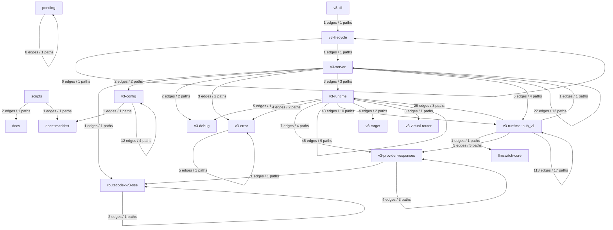
```mermaid
flowchart TD
  module_docs["docs"]
  module_docs__manifest["docs::manifest"]
  module_llmswitch_core["llmswitch-core"]
  module_pending["pending"]
  module_routecodex_v3_sse["routecodex-v3-sse"]
  module_scripts["scripts"]
  module_v3_cli["v3-cli"]
  module_v3_config["v3-config"]
  module_v3_debug["v3-debug"]
  module_v3_error["v3-error"]
  module_v3_lifecycle["v3-lifecycle"]
  module_v3_provider_responses["v3-provider-responses"]
  module_v3_runtime["v3-runtime"]
  module_v3_runtime__hub_v1["v3-runtime::hub_v1"]
  module_v3_server["v3-server"]
  module_v3_target["v3-target"]
  module_v3_virtual_router["v3-virtual-router"]
  module_pending -->|8 edges / 1 paths| module_pending
  module_routecodex_v3_sse -->|2 edges / 1 paths| module_routecodex_v3_sse
  module_scripts -->|2 edges / 1 paths| module_docs
  module_scripts -->|1 edges / 1 paths| module_docs__manifest
  module_v3_cli -->|1 edges / 1 paths| module_v3_lifecycle
  module_v3_config -->|1 edges / 1 paths| module_docs__manifest
  module_v3_config -->|12 edges / 4 paths| module_v3_config
  module_v3_error -->|5 edges / 1 paths| module_v3_error
  module_v3_lifecycle -->|6 edges / 1 paths| module_v3_lifecycle
  module_v3_lifecycle -->|1 edges / 1 paths| module_v3_server
  module_v3_provider_responses -->|1 edges / 1 paths| module_routecodex_v3_sse
  module_v3_provider_responses -->|4 edges / 3 paths| module_v3_provider_responses
  module_v3_runtime__hub_v1 -->|1 edges / 1 paths| module_llmswitch_core
  module_v3_runtime__hub_v1 -->|5 edges / 5 paths| module_v3_provider_responses
  module_v3_runtime__hub_v1 -->|29 edges / 3 paths| module_v3_runtime
  module_v3_runtime__hub_v1 -->|113 edges / 17 paths| module_v3_runtime__hub_v1
  module_v3_runtime__hub_v1 -->|1 edges / 1 paths| module_v3_server
  module_v3_runtime -->|5 edges / 1 paths| module_v3_debug
  module_v3_runtime -->|4 edges / 2 paths| module_v3_error
  module_v3_runtime -->|7 edges / 4 paths| module_v3_provider_responses
  module_v3_runtime -->|45 edges / 9 paths| module_v3_runtime
  module_v3_runtime -->|43 edges / 10 paths| module_v3_runtime__hub_v1
  module_v3_runtime -->|4 edges / 2 paths| module_v3_target
  module_v3_runtime -->|3 edges / 1 paths| module_v3_virtual_router
  module_v3_server -->|1 edges / 1 paths| module_routecodex_v3_sse
  module_v3_server -->|2 edges / 2 paths| module_v3_config
  module_v3_server -->|2 edges / 2 paths| module_v3_debug
  module_v3_server -->|3 edges / 2 paths| module_v3_error
  module_v3_server -->|3 edges / 3 paths| module_v3_runtime
  module_v3_server -->|5 edges / 4 paths| module_v3_runtime__hub_v1
  module_v3_server -->|22 edges / 12 paths| module_v3_server
```

| From module | To module | Edges | Functional paths |
| --- | --- | ---: | --- |
| pending | pending | 8 | `v3.web_search_servertool_state_machine` |
| routecodex-v3-sse | routecodex-v3-sse | 2 | `v3.sse.transport_boundary` |
| scripts | docs | 2 | `v3.live_provider_compat.parity` |
| scripts | docs::manifest | 1 | `v3.live_provider_compat.parity` |
| v3-cli | v3-lifecycle | 1 | `v3.server.managed_lifecycle` |
| v3-config | docs::manifest | 1 | `v3.entry_protocol_endpoint_binding.mainline` |
| v3-config | v3-config | 12 | `v3.config.compact_hub_v1_defaults`<br/>`v3.config.compile`<br/>`v3.entry_protocol_endpoint_binding.mainline`<br/>`v3.entry_protocol_registry_contract.mainline` |
| v3-error | v3-error | 5 | `v3.debug_error_foundation.mainline` |
| v3-lifecycle | v3-lifecycle | 6 | `v3.server.managed_lifecycle` |
| v3-lifecycle | v3-server | 1 | `v3.server.managed_lifecycle` |
| v3-provider-responses | routecodex-v3-sse | 1 | `v3.sse.transport_boundary` |
| v3-provider-responses | v3-provider-responses | 4 | `v3.debug_error_foundation.mainline`<br/>`v3.responses.websocket_v2.transport_hardening`<br/>`v3.responses_direct.required_mainline` |
| v3-runtime::hub_v1 | llmswitch-core | 1 | `v3.selected_provider_model_binding` |
| v3-runtime::hub_v1 | v3-provider-responses | 5 | `v3.anthropic_relay.controlled_runtime`<br/>`v3.gemini_relay.controlled_runtime`<br/>`v3.hub_relay.runtime_closeout`<br/>`v3.openai_chat_relay.controlled_runtime`<br/>`v3.responses_relay.source_server_entry` |
| v3-runtime::hub_v1 | v3-runtime | 29 | `v3.provider_action_gate.mainline`<br/>`v3.runtime_timing_observability.mainline`<br/>`v3.selected_provider_model_binding` |
| v3-runtime::hub_v1 | v3-runtime::hub_v1 | 113 | `v3.anthropic_relay.controlled_runtime`<br/>`v3.anthropic_relay.local_continuation`<br/>`v3.console_human_readable_layering.mainline`<br/>`v3.gemini_relay.controlled_runtime`<br/>`v3.hub_pipeline.v1.relay_request_source_slice`<br/>`v3.hub_pipeline.v1.relay_response_source_slice`<br/>`v3.hub_pipeline.v1.request`<br/>`v3.hub_pipeline.v1.response`<br/>`v3.hub_relay.runtime_closeout`<br/>`v3.openai_chat_relay.controlled_runtime`<br/>`v3.protocol_conversion_field_parity`<br/>`v3.protocol_normalization_tool_governance_boundary`<br/>`v3.provider_action_gate.mainline`<br/>`v3.resp03_tool_governance_gap_closeout`<br/>`v3.responses_provider_event.terminal_merge`<br/>`v3.runtime_timing_observability.mainline`<br/>`v3.servertool_hook_skeleton_lifecycle` |
| v3-runtime::hub_v1 | v3-server | 1 | `v3.responses_relay.source_server_entry` |
| v3-runtime | v3-debug | 5 | `v3.debug_error_foundation.mainline` |
| v3-runtime | v3-error | 4 | `v3.debug_error_foundation.mainline`<br/>`v3.hub_relay.response_failure_entry` |
| v3-runtime | v3-provider-responses | 7 | `v3.debug_error_foundation.mainline`<br/>`v3.responses_direct.remote_continuation.integration`<br/>`v3.responses_direct.required_mainline`<br/>`v3.selected_provider_model_binding` |
| v3-runtime | v3-runtime | 45 | `v3.console_human_readable_layering.mainline`<br/>`v3.direct_stopless_metadata_center`<br/>`v3.provider_action_gate.mainline`<br/>`v3.responses_continuation.remote_contract_store`<br/>`v3.responses_continuation.remote_locator_codec`<br/>`v3.responses_direct.remote_continuation.integration`<br/>`v3.responses_direct.required_mainline`<br/>`v3.runtime_timing_observability.mainline`<br/>`v3.selected_provider_model_binding` |
| v3-runtime | v3-runtime::hub_v1 | 43 | `v3.direct_stopless_metadata_center`<br/>`v3.hub_pipeline.v1.hook_registry_compile`<br/>`v3.hub_pipeline.v1.relay_payload_copy_runtime_probes`<br/>`v3.hub_relay.tool_servertool_multiturn_parity`<br/>`v3.protocol.anthropic.characterization`<br/>`v3.protocol.gemini.characterization`<br/>`v3.protocol.openai_chat.characterization`<br/>`v3.protocol_conversion_field_parity`<br/>`v3.protocol_normalization_tool_governance_boundary`<br/>`v3.runtime_timing_observability.mainline` |
| v3-runtime | v3-target | 4 | `v3.responses_direct.remote_continuation.integration`<br/>`v3.responses_direct.required_mainline` |
| v3-runtime | v3-virtual-router | 3 | `v3.responses_direct.required_mainline` |
| v3-server | routecodex-v3-sse | 1 | `v3.sse.http_keepalive_boundary` |
| v3-server | v3-config | 2 | `v3.entry_protocol_endpoint_binding.mainline`<br/>`v3.models.capability_catalog` |
| v3-server | v3-debug | 2 | `v3.codex_sample_retention_snap_scope`<br/>`v3.server.startup` |
| v3-server | v3-error | 3 | `v3.debug_error_foundation.mainline`<br/>`v3.server.startup` |
| v3-server | v3-runtime | 3 | `v3.responses.inbound_websocket_proxy`<br/>`v3.responses_direct.remote_continuation.integration`<br/>`v3.responses_direct.required_mainline` |
| v3-server | v3-runtime::hub_v1 | 5 | `v3.anthropic_relay.controlled_runtime`<br/>`v3.gemini_relay.controlled_runtime`<br/>`v3.openai_chat_relay.controlled_runtime`<br/>`v3.responses_relay.source_server_entry` |
| v3-server | v3-server | 22 | `v3.codex_sample_retention_snap_scope`<br/>`v3.console_human_readable_layering.mainline`<br/>`v3.console_request_count_visibility.mainline`<br/>`v3.entry_protocol_endpoint_binding.mainline`<br/>`v3.gemini_relay.controlled_runtime`<br/>`v3.models.capability_catalog`<br/>`v3.openai_chat_relay.controlled_runtime`<br/>`v3.responses.inbound_websocket_proxy`<br/>`v3.responses_direct.required_mainline`<br/>`v3.runtime_timing_observability.mainline`<br/>`v3.server.startup`<br/>`v3.sse.transport_boundary` |

## Auto audit /补救清单

### Forbidden direct response projection edges

- none

### Forbidden source registered direct response edges

- none

### Binding-pending edges

| chain_id | step_id | from_node | to_node |
| --- | --- | --- | --- |
| v3.entry_protocol_endpoint_binding.mainline | v3-entry-bind-01 | V3Config05ManifestPublished | V3EntryBind01EndpointPatternDeclared |
| v3.entry_protocol_endpoint_binding.mainline | v3-entry-bind-02 | V3EntryBind01EndpointPatternDeclared | V3EntryBind02ProtocolResolved |
| v3.entry_protocol_endpoint_binding.mainline | v3-entry-bind-03 | V3EntryBind02ProtocolResolved | V3EntryBind03ServerEnablementChecked |
| v3.web_search_servertool_state_machine | v3-web-search-sm-01 | HubReqChatProcess03Governed | V3WebSearch01RouteEvidenceClassified |
| v3.web_search_servertool_state_machine | v3-web-search-sm-02 | V3WebSearch01RouteEvidenceClassified | VrRoute04SelectedTarget |
| v3.web_search_servertool_state_machine | v3-web-search-sm-03 | HubRespChatProcess03Governed | V3ServerToolState01ControlScope |
| v3.web_search_servertool_state_machine | v3-web-search-sm-04 | V3ServerToolState01ControlScope | V3WebSearch02SearchDispatchPrepared |
| v3.web_search_servertool_state_machine | v3-web-search-sm-05 | V3WebSearch02SearchDispatchPrepared | ProviderReqOutbound06WirePayload |
| v3.web_search_servertool_state_machine | v3-web-search-sm-06 | HubRespChatProcess03Governed | V3WebSearch03SearchResultCaptured |
| v3.web_search_servertool_state_machine | v3-web-search-sm-07 | V3WebSearch03SearchResultCaptured | HubRespOutbound04ClientSemantic |
| v3.web_search_servertool_state_machine | v3-web-search-sm-08 | HubReqChatProcess03Governed | V3WebSearch04ToolResultInjected |

### Missing caller/callee fields

- none

## Functional caller paths

## v3.codex_sample_retention_snap_scope

Debug-bounded request and response copies move from explicit manifest authorization to Server-owned filesystem persistence without entering MetadataCenter or normal payload truth.

Owner feature: `v3.codex_sample_retention_snap_scope`

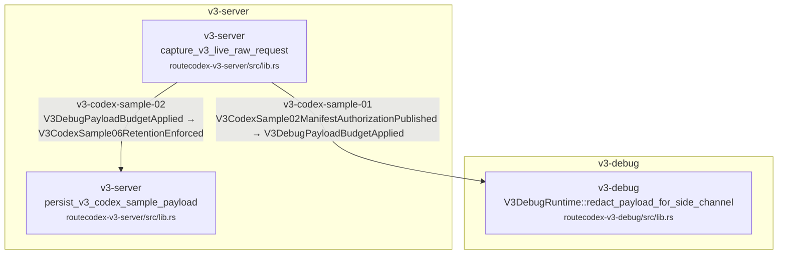
```mermaid
flowchart TD
  subgraph c_0_v3_codex_sample_retention_snap_scope_m_v3_debug["v3-debug"]
    c_0_v3_codex_sample_retention_snap_scope_1["v3-debug<br/>V3DebugRuntime::redact_payload_for_side_channel<br/><small>routecodex-v3-debug/src/lib.rs</small>"]
  end
  subgraph c_0_v3_codex_sample_retention_snap_scope_m_v3_server["v3-server"]
    c_0_v3_codex_sample_retention_snap_scope_0["v3-server<br/>capture_v3_live_raw_request<br/><small>routecodex-v3-server/src/lib.rs</small>"]
    c_0_v3_codex_sample_retention_snap_scope_2["v3-server<br/>persist_v3_codex_sample_payload<br/><small>routecodex-v3-server/src/lib.rs</small>"]
  end
  c_0_v3_codex_sample_retention_snap_scope_0 -->|v3-codex-sample-01<br/>V3CodexSample02ManifestAuthorizationPublished → V3DebugPayloadBudgetApplied| c_0_v3_codex_sample_retention_snap_scope_1
  c_0_v3_codex_sample_retention_snap_scope_0 -->|v3-codex-sample-02<br/>V3DebugPayloadBudgetApplied → V3CodexSample06RetentionEnforced| c_0_v3_codex_sample_retention_snap_scope_2
```

| Step | Node edge | Status | Caller | Callee | Owner |
| --- | --- | --- | --- | --- | --- |
| `v3-codex-sample-01` | `V3CodexSample02ManifestAuthorizationPublished` → `V3DebugPayloadBudgetApplied` | anchored | capture_v3_live_raw_request<br/><small>routecodex-v3-server/src/lib.rs</small> | V3DebugRuntime::redact_payload_for_side_channel<br/><small>routecodex-v3-debug/src/lib.rs</small> | `v3.codex_sample_retention_snap_scope` |
| `v3-codex-sample-02` | `V3DebugPayloadBudgetApplied` → `V3CodexSample06RetentionEnforced` | anchored | capture_v3_live_raw_request<br/><small>routecodex-v3-server/src/lib.rs</small> | persist_v3_codex_sample_payload<br/><small>routecodex-v3-server/src/lib.rs</small> | `v3.codex_sample_retention_snap_scope` |

## v3.server.managed_lifecycle

One Rust owner validates Config, declares aggregate instance identity, locks lifecycle operations, preserves old rcc start takeover for configured listener ports through managed control, foreign managed port-scoped release, and explicit listener PID signals, runs top-level start in the foreground with real Server console, retains hidden detached-child compatibility, publishes PID/control identity, restarts through one in-place exec with a nonce-bound restart plan when executable/snapshot overrides are needed, and gracefully stops the exact instance without broad kill.

Owner feature: `v3.managed_server_lifecycle`
Manifest: `docs/architecture/manifests/v3.managed_server_lifecycle.mainline.yml`


```mermaid
flowchart TD
  subgraph c_1_v3_server_managed_lifecycle_m_v3_cli["v3-cli"]
    c_1_v3_server_managed_lifecycle_10["v3-cli<br/>run_cli<br/><small>routecodex-v3-cli/src/main.rs</small>"]
  end
  subgraph c_1_v3_server_managed_lifecycle_m_v3_lifecycle["v3-lifecycle"]
    c_1_v3_server_managed_lifecycle_0["v3-lifecycle<br/>V3ManagedLifecycle::start<br/><small>routecodex-v3-lifecycle/src/lib.rs</small>"]
    c_1_v3_server_managed_lifecycle_1["v3-lifecycle<br/>V3ManagedLifecycle::declaration<br/><small>routecodex-v3-lifecycle/src/lib.rs</small>"]
    c_1_v3_server_managed_lifecycle_2["v3-lifecycle<br/>acquire_operation_lock<br/><small>routecodex-v3-lifecycle/src/lib.rs</small>"]
    c_1_v3_server_managed_lifecycle_3["v3-lifecycle<br/>Command::spawn<br/><small>routecodex-v3-lifecycle/src/lib.rs</small>"]
    c_1_v3_server_managed_lifecycle_4["v3-lifecycle<br/>V3ManagedLifecycle::run_managed_child<br/><small>routecodex-v3-lifecycle/src/lib.rs</small>"]
    c_1_v3_server_managed_lifecycle_5["v3-lifecycle<br/>write_json_atomic<br/><small>routecodex-v3-lifecycle/src/lib.rs</small>"]
    c_1_v3_server_managed_lifecycle_6["v3-lifecycle<br/>V3ManagedLifecycle::status<br/><small>routecodex-v3-lifecycle/src/lib.rs</small>"]
    c_1_v3_server_managed_lifecycle_7["v3-lifecycle<br/>send_control<br/><small>routecodex-v3-lifecycle/src/lib.rs</small>"]
    c_1_v3_server_managed_lifecycle_8["v3-lifecycle<br/>V3ManagedLifecycle::restart<br/><small>routecodex-v3-lifecycle/src/lib.rs</small>"]
    c_1_v3_server_managed_lifecycle_9["v3-lifecycle<br/>send_restart_control<br/><small>routecodex-v3-lifecycle/src/lib.rs</small>"]
    c_1_v3_server_managed_lifecycle_11["v3-lifecycle<br/>V3ManagedLifecycle::with_console_enabled<br/><small>routecodex-v3-lifecycle/src/lib.rs</small>"]
    c_1_v3_server_managed_lifecycle_12["v3-lifecycle<br/>V3ManagedLifecycle::stop<br/><small>routecodex-v3-lifecycle/src/lib.rs</small>"]
  end
  subgraph c_1_v3_server_managed_lifecycle_m_v3_server["v3-server"]
    c_1_v3_server_managed_lifecycle_13["v3-server<br/>V3ServerAggregateHandle::shutdown<br/><small>routecodex-v3-server/src/lib.rs</small>"]
  end
  c_1_v3_server_managed_lifecycle_0 -->|v3-life-01<br/>V3Lifecycle01ValidatedConfig → V3Lifecycle02InstanceDeclared| c_1_v3_server_managed_lifecycle_1
  c_1_v3_server_managed_lifecycle_0 -->|v3-life-02<br/>V3Lifecycle02InstanceDeclared → V3Lifecycle03OperationLocked| c_1_v3_server_managed_lifecycle_2
  c_1_v3_server_managed_lifecycle_0 -->|v3-life-03<br/>V3Lifecycle03OperationLocked → V3Lifecycle04ChildSpawned| c_1_v3_server_managed_lifecycle_3
  c_1_v3_server_managed_lifecycle_4 -->|v3-life-04<br/>V3Lifecycle04ChildSpawned → V3Lifecycle05IdentityPublished| c_1_v3_server_managed_lifecycle_5
  c_1_v3_server_managed_lifecycle_6 -->|v3-life-05<br/>V3Lifecycle05IdentityPublished → V3Lifecycle06LiveControlled| c_1_v3_server_managed_lifecycle_7
  c_1_v3_server_managed_lifecycle_8 -->|v3-life-05r<br/>V3Lifecycle06LiveControlled → V3Lifecycle05IdentityPublished| c_1_v3_server_managed_lifecycle_9
  c_1_v3_server_managed_lifecycle_10 -->|v3-life-cli-debug-01<br/>V3Cli01ResolvedDebugIntent → V3Lifecycle06LiveControlled| c_1_v3_server_managed_lifecycle_11
  c_1_v3_server_managed_lifecycle_12 -->|v3-life-06<br/>V3Lifecycle06LiveControlled → V3Lifecycle07GracefullyStopped| c_1_v3_server_managed_lifecycle_13
```

| Step | Node edge | Status | Caller | Callee | Owner |
| --- | --- | --- | --- | --- | --- |
| `v3-life-01` | `V3Lifecycle01ValidatedConfig` → `V3Lifecycle02InstanceDeclared` | anchored | V3ManagedLifecycle::start<br/><small>routecodex-v3-lifecycle/src/lib.rs</small> | V3ManagedLifecycle::declaration<br/><small>routecodex-v3-lifecycle/src/lib.rs</small> | `v3.managed_server_lifecycle` |
| `v3-life-02` | `V3Lifecycle02InstanceDeclared` → `V3Lifecycle03OperationLocked` | anchored | V3ManagedLifecycle::start<br/><small>routecodex-v3-lifecycle/src/lib.rs</small> | acquire_operation_lock<br/><small>routecodex-v3-lifecycle/src/lib.rs</small> | `v3.managed_server_lifecycle` |
| `v3-life-03` | `V3Lifecycle03OperationLocked` → `V3Lifecycle04ChildSpawned` | anchored | V3ManagedLifecycle::start<br/><small>routecodex-v3-lifecycle/src/lib.rs</small> | Command::spawn<br/><small>routecodex-v3-lifecycle/src/lib.rs</small> | `v3.managed_server_lifecycle` |
| `v3-life-04` | `V3Lifecycle04ChildSpawned` → `V3Lifecycle05IdentityPublished` | anchored | V3ManagedLifecycle::run_managed_child<br/><small>routecodex-v3-lifecycle/src/lib.rs</small> | write_json_atomic<br/><small>routecodex-v3-lifecycle/src/lib.rs</small> | `v3.managed_server_lifecycle` |
| `v3-life-05` | `V3Lifecycle05IdentityPublished` → `V3Lifecycle06LiveControlled` | anchored | V3ManagedLifecycle::status<br/><small>routecodex-v3-lifecycle/src/lib.rs</small> | send_control<br/><small>routecodex-v3-lifecycle/src/lib.rs</small> | `v3.managed_server_lifecycle` |
| `v3-life-05r` | `V3Lifecycle06LiveControlled` → `V3Lifecycle05IdentityPublished` | anchored | V3ManagedLifecycle::restart<br/><small>routecodex-v3-lifecycle/src/lib.rs</small> | send_restart_control<br/><small>routecodex-v3-lifecycle/src/lib.rs</small> | `v3.managed_server_lifecycle` |
| `v3-life-cli-debug-01` | `V3Cli01ResolvedDebugIntent` → `V3Lifecycle06LiveControlled` | anchored | run_cli<br/><small>routecodex-v3-cli/src/main.rs</small> | V3ManagedLifecycle::with_console_enabled<br/><small>routecodex-v3-lifecycle/src/lib.rs</small> | `v3.managed_server_lifecycle` |
| `v3-life-06` | `V3Lifecycle06LiveControlled` → `V3Lifecycle07GracefullyStopped` | anchored | V3ManagedLifecycle::stop<br/><small>routecodex-v3-lifecycle/src/lib.rs</small> | V3ServerAggregateHandle::shutdown<br/><small>routecodex-v3-server/src/lib.rs</small> | `v3.managed_server_lifecycle` |

## v3.config.compile

Unique config.v3 read/parse/validate/registry/publish chain.

Owner feature: `v3.config_interpreter_contract`

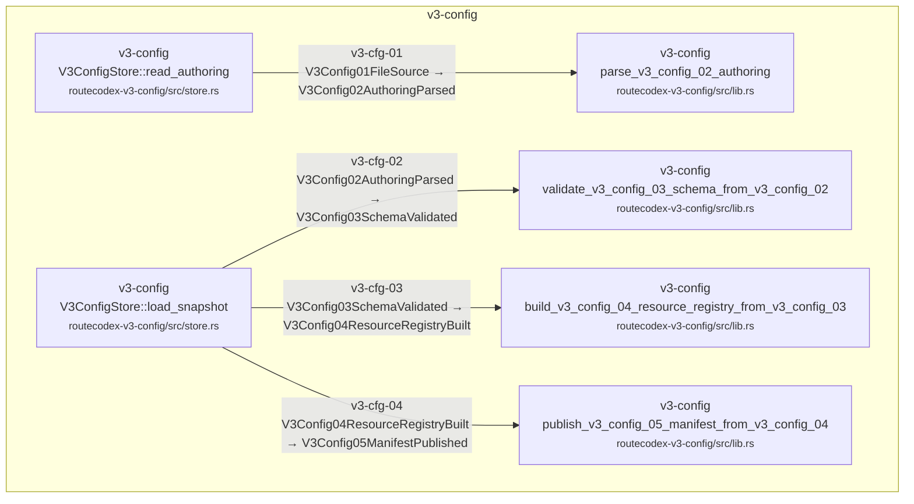
```mermaid
flowchart TD
  subgraph c_2_v3_config_compile_m_v3_config["v3-config"]
    c_2_v3_config_compile_0["v3-config<br/>V3ConfigStore::read_authoring<br/><small>routecodex-v3-config/src/store.rs</small>"]
    c_2_v3_config_compile_1["v3-config<br/>parse_v3_config_02_authoring<br/><small>routecodex-v3-config/src/lib.rs</small>"]
    c_2_v3_config_compile_2["v3-config<br/>V3ConfigStore::load_snapshot<br/><small>routecodex-v3-config/src/store.rs</small>"]
    c_2_v3_config_compile_3["v3-config<br/>validate_v3_config_03_schema_from_v3_config_02<br/><small>routecodex-v3-config/src/lib.rs</small>"]
    c_2_v3_config_compile_4["v3-config<br/>build_v3_config_04_resource_registry_from_v3_config_03<br/><small>routecodex-v3-config/src/lib.rs</small>"]
    c_2_v3_config_compile_5["v3-config<br/>publish_v3_config_05_manifest_from_v3_config_04<br/><small>routecodex-v3-config/src/lib.rs</small>"]
  end
  c_2_v3_config_compile_0 -->|v3-cfg-01<br/>V3Config01FileSource → V3Config02AuthoringParsed| c_2_v3_config_compile_1
  c_2_v3_config_compile_2 -->|v3-cfg-02<br/>V3Config02AuthoringParsed → V3Config03SchemaValidated| c_2_v3_config_compile_3
  c_2_v3_config_compile_2 -->|v3-cfg-03<br/>V3Config03SchemaValidated → V3Config04ResourceRegistryBuilt| c_2_v3_config_compile_4
  c_2_v3_config_compile_2 -->|v3-cfg-04<br/>V3Config04ResourceRegistryBuilt → V3Config05ManifestPublished| c_2_v3_config_compile_5
```

| Step | Node edge | Status | Caller | Callee | Owner |
| --- | --- | --- | --- | --- | --- |
| `v3-cfg-01` | `V3Config01FileSource` → `V3Config02AuthoringParsed` | anchored | V3ConfigStore::read_authoring<br/><small>routecodex-v3-config/src/store.rs</small> | parse_v3_config_02_authoring<br/><small>routecodex-v3-config/src/lib.rs</small> | `v3.config_interpreter_contract` |
| `v3-cfg-02` | `V3Config02AuthoringParsed` → `V3Config03SchemaValidated` | anchored | V3ConfigStore::load_snapshot<br/><small>routecodex-v3-config/src/store.rs</small> | validate_v3_config_03_schema_from_v3_config_02<br/><small>routecodex-v3-config/src/lib.rs</small> | `v3.config_interpreter_contract` |
| `v3-cfg-03` | `V3Config03SchemaValidated` → `V3Config04ResourceRegistryBuilt` | anchored | V3ConfigStore::load_snapshot<br/><small>routecodex-v3-config/src/store.rs</small> | build_v3_config_04_resource_registry_from_v3_config_03<br/><small>routecodex-v3-config/src/lib.rs</small> | `v3.config_interpreter_contract` |
| `v3-cfg-04` | `V3Config04ResourceRegistryBuilt` → `V3Config05ManifestPublished` | anchored | V3ConfigStore::load_snapshot<br/><small>routecodex-v3-config/src/store.rs</small> | publish_v3_config_05_manifest_from_v3_config_04<br/><small>routecodex-v3-config/src/lib.rs</small> | `v3.config_interpreter_contract` |

## v3.config.compact_hub_v1_defaults

Compact user-facing Hub V1 authoring derives the closed fixed pipeline defaults inside routecodex-v3-config before Manifest publication.

Owner feature: `v3.config_interpreter_contract`

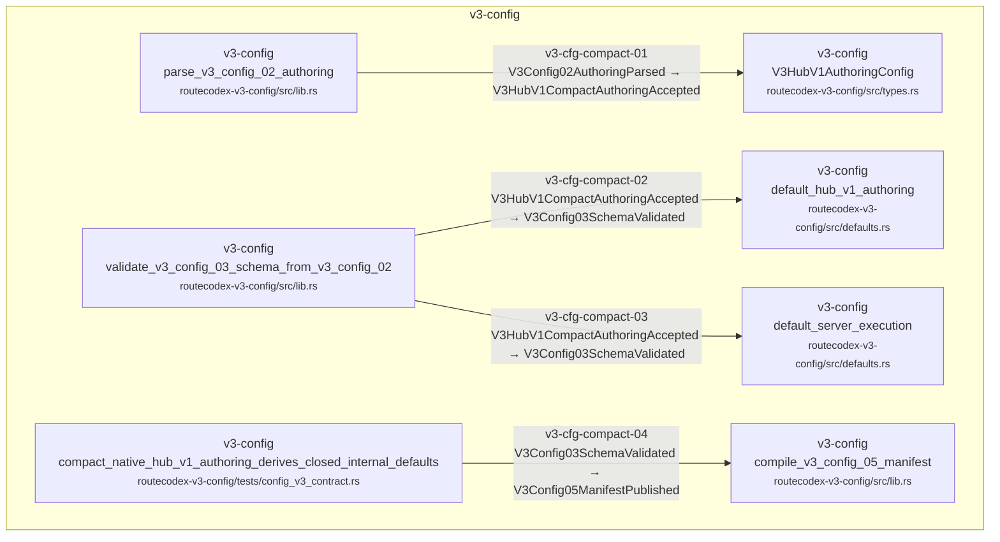
```mermaid
flowchart TD
  subgraph c_3_v3_config_compact_hub_v1_defaults_m_v3_config["v3-config"]
    c_3_v3_config_compact_hub_v1_defaults_0["v3-config<br/>parse_v3_config_02_authoring<br/><small>routecodex-v3-config/src/lib.rs</small>"]
    c_3_v3_config_compact_hub_v1_defaults_1["v3-config<br/>V3HubV1AuthoringConfig<br/><small>routecodex-v3-config/src/types.rs</small>"]
    c_3_v3_config_compact_hub_v1_defaults_2["v3-config<br/>validate_v3_config_03_schema_from_v3_config_02<br/><small>routecodex-v3-config/src/lib.rs</small>"]
    c_3_v3_config_compact_hub_v1_defaults_3["v3-config<br/>default_hub_v1_authoring<br/><small>routecodex-v3-config/src/defaults.rs</small>"]
    c_3_v3_config_compact_hub_v1_defaults_4["v3-config<br/>default_server_execution<br/><small>routecodex-v3-config/src/defaults.rs</small>"]
    c_3_v3_config_compact_hub_v1_defaults_5["v3-config<br/>compact_native_hub_v1_authoring_derives_closed_internal_defaults<br/><small>routecodex-v3-config/tests/config_v3_contract.rs</small>"]
    c_3_v3_config_compact_hub_v1_defaults_6["v3-config<br/>compile_v3_config_05_manifest<br/><small>routecodex-v3-config/src/lib.rs</small>"]
  end
  c_3_v3_config_compact_hub_v1_defaults_0 -->|v3-cfg-compact-01<br/>V3Config02AuthoringParsed → V3HubV1CompactAuthoringAccepted| c_3_v3_config_compact_hub_v1_defaults_1
  c_3_v3_config_compact_hub_v1_defaults_2 -->|v3-cfg-compact-02<br/>V3HubV1CompactAuthoringAccepted → V3Config03SchemaValidated| c_3_v3_config_compact_hub_v1_defaults_3
  c_3_v3_config_compact_hub_v1_defaults_2 -->|v3-cfg-compact-03<br/>V3HubV1CompactAuthoringAccepted → V3Config03SchemaValidated| c_3_v3_config_compact_hub_v1_defaults_4
  c_3_v3_config_compact_hub_v1_defaults_5 -->|v3-cfg-compact-04<br/>V3Config03SchemaValidated → V3Config05ManifestPublished| c_3_v3_config_compact_hub_v1_defaults_6
```

| Step | Node edge | Status | Caller | Callee | Owner |
| --- | --- | --- | --- | --- | --- |
| `v3-cfg-compact-01` | `V3Config02AuthoringParsed` → `V3HubV1CompactAuthoringAccepted` | anchored | parse_v3_config_02_authoring<br/><small>routecodex-v3-config/src/lib.rs</small> | V3HubV1AuthoringConfig<br/><small>routecodex-v3-config/src/types.rs</small> | `v3.config_interpreter_contract` |
| `v3-cfg-compact-02` | `V3HubV1CompactAuthoringAccepted` → `V3Config03SchemaValidated` | anchored | validate_v3_config_03_schema_from_v3_config_02<br/><small>routecodex-v3-config/src/lib.rs</small> | default_hub_v1_authoring<br/><small>routecodex-v3-config/src/defaults.rs</small> | `v3.config_interpreter_contract` |
| `v3-cfg-compact-03` | `V3HubV1CompactAuthoringAccepted` → `V3Config03SchemaValidated` | anchored | validate_v3_config_03_schema_from_v3_config_02<br/><small>routecodex-v3-config/src/lib.rs</small> | default_server_execution<br/><small>routecodex-v3-config/src/defaults.rs</small> | `v3.config_interpreter_contract` |
| `v3-cfg-compact-04` | `V3Config03SchemaValidated` → `V3Config05ManifestPublished` | anchored | compact_native_hub_v1_authoring_derives_closed_internal_defaults<br/><small>routecodex-v3-config/tests/config_v3_contract.rs</small> | compile_v3_config_05_manifest<br/><small>routecodex-v3-config/src/lib.rs</small> | `v3.config_interpreter_contract` |

## v3.models.capability_catalog

Config expands the current listener route-group model refs; Server projects those refs plus stable built-in Codex ModelInfo metadata through the read-only /v1/models endpoint.

Owner feature: `v3.models_capability_catalog`

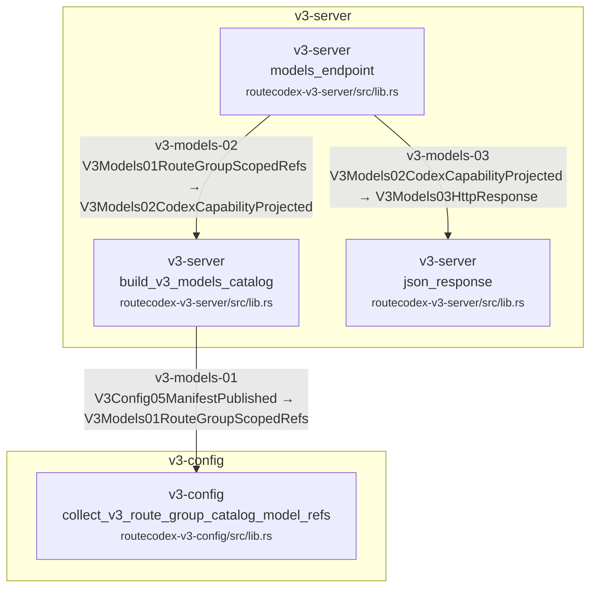
```mermaid
flowchart TD
  subgraph c_4_v3_models_capability_catalog_m_v3_config["v3-config"]
    c_4_v3_models_capability_catalog_1["v3-config<br/>collect_v3_route_group_catalog_model_refs<br/><small>routecodex-v3-config/src/lib.rs</small>"]
  end
  subgraph c_4_v3_models_capability_catalog_m_v3_server["v3-server"]
    c_4_v3_models_capability_catalog_0["v3-server<br/>build_v3_models_catalog<br/><small>routecodex-v3-server/src/lib.rs</small>"]
    c_4_v3_models_capability_catalog_2["v3-server<br/>models_endpoint<br/><small>routecodex-v3-server/src/lib.rs</small>"]
    c_4_v3_models_capability_catalog_3["v3-server<br/>json_response<br/><small>routecodex-v3-server/src/lib.rs</small>"]
  end
  c_4_v3_models_capability_catalog_0 -->|v3-models-01<br/>V3Config05ManifestPublished → V3Models01RouteGroupScopedRefs| c_4_v3_models_capability_catalog_1
  c_4_v3_models_capability_catalog_2 -->|v3-models-02<br/>V3Models01RouteGroupScopedRefs → V3Models02CodexCapabilityProjected| c_4_v3_models_capability_catalog_0
  c_4_v3_models_capability_catalog_2 -->|v3-models-03<br/>V3Models02CodexCapabilityProjected → V3Models03HttpResponse| c_4_v3_models_capability_catalog_3
```

| Step | Node edge | Status | Caller | Callee | Owner |
| --- | --- | --- | --- | --- | --- |
| `v3-models-01` | `V3Config05ManifestPublished` → `V3Models01RouteGroupScopedRefs` | anchored | build_v3_models_catalog<br/><small>routecodex-v3-server/src/lib.rs</small> | collect_v3_route_group_catalog_model_refs<br/><small>routecodex-v3-config/src/lib.rs</small> | `v3.models_capability_catalog` |
| `v3-models-02` | `V3Models01RouteGroupScopedRefs` → `V3Models02CodexCapabilityProjected` | anchored | models_endpoint<br/><small>routecodex-v3-server/src/lib.rs</small> | build_v3_models_catalog<br/><small>routecodex-v3-server/src/lib.rs</small> | `v3.models_capability_catalog` |
| `v3-models-03` | `V3Models02CodexCapabilityProjected` → `V3Models03HttpResponse` | anchored | models_endpoint<br/><small>routecodex-v3-server/src/lib.rs</small> | json_response<br/><small>routecodex-v3-server/src/lib.rs</small> | `v3.models_capability_catalog` |

## v3.entry_protocol_endpoint_binding.mainline

Review/gate chain binding V3 business endpoint exposure to closed entry protocols, execution mode, implementation status, and owner before Server dispatch.

Owner feature: `v3.entry_protocol_endpoint_binding`
Manifest: `docs/architecture/manifests/v3.entry_protocol_endpoint_binding.mainline.yml`

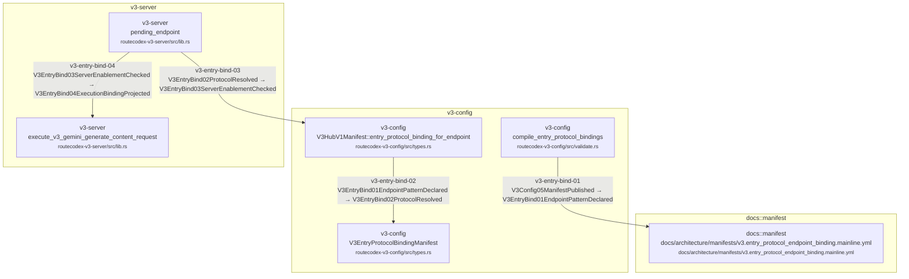
```mermaid
flowchart TD
  subgraph c_5_v3_entry_protocol_endpoint_binding_mainline_m_docs__manifest["docs::manifest"]
    c_5_v3_entry_protocol_endpoint_binding_mainline_1["docs::manifest<br/>docs/architecture/manifests/v3.entry_protocol_endpoint_binding.mainline.yml<br/><small>docs/architecture/manifests/v3.entry_protocol_endpoint_binding.mainline.yml</small>"]
  end
  subgraph c_5_v3_entry_protocol_endpoint_binding_mainline_m_v3_config["v3-config"]
    c_5_v3_entry_protocol_endpoint_binding_mainline_0["v3-config<br/>compile_entry_protocol_bindings<br/><small>routecodex-v3-config/src/validate.rs</small>"]
    c_5_v3_entry_protocol_endpoint_binding_mainline_2["v3-config<br/>V3HubV1Manifest::entry_protocol_binding_for_endpoint<br/><small>routecodex-v3-config/src/types.rs</small>"]
    c_5_v3_entry_protocol_endpoint_binding_mainline_3["v3-config<br/>V3EntryProtocolBindingManifest<br/><small>routecodex-v3-config/src/types.rs</small>"]
  end
  subgraph c_5_v3_entry_protocol_endpoint_binding_mainline_m_v3_server["v3-server"]
    c_5_v3_entry_protocol_endpoint_binding_mainline_4["v3-server<br/>pending_endpoint<br/><small>routecodex-v3-server/src/lib.rs</small>"]
    c_5_v3_entry_protocol_endpoint_binding_mainline_5["v3-server<br/>execute_v3_gemini_generate_content_request<br/><small>routecodex-v3-server/src/lib.rs</small>"]
  end
  c_5_v3_entry_protocol_endpoint_binding_mainline_0 -->|v3-entry-bind-01<br/>V3Config05ManifestPublished → V3EntryBind01EndpointPatternDeclared| c_5_v3_entry_protocol_endpoint_binding_mainline_1
  c_5_v3_entry_protocol_endpoint_binding_mainline_2 -->|v3-entry-bind-02<br/>V3EntryBind01EndpointPatternDeclared → V3EntryBind02ProtocolResolved| c_5_v3_entry_protocol_endpoint_binding_mainline_3
  c_5_v3_entry_protocol_endpoint_binding_mainline_4 -->|v3-entry-bind-03<br/>V3EntryBind02ProtocolResolved → V3EntryBind03ServerEnablementChecked| c_5_v3_entry_protocol_endpoint_binding_mainline_2
  c_5_v3_entry_protocol_endpoint_binding_mainline_4 -->|v3-entry-bind-04<br/>V3EntryBind03ServerEnablementChecked → V3EntryBind04ExecutionBindingProjected| c_5_v3_entry_protocol_endpoint_binding_mainline_5
```

| Step | Node edge | Status | Caller | Callee | Owner |
| --- | --- | --- | --- | --- | --- |
| `v3-entry-bind-01` | `V3Config05ManifestPublished` → `V3EntryBind01EndpointPatternDeclared` | binding_pending | compile_entry_protocol_bindings<br/><small>routecodex-v3-config/src/validate.rs</small> | docs/architecture/manifests/v3.entry_protocol_endpoint_binding.mainline.yml<br/><small>docs/architecture/manifests/v3.entry_protocol_endpoint_binding.mainline.yml</small> | `v3.entry_protocol_endpoint_binding` |
| `v3-entry-bind-02` | `V3EntryBind01EndpointPatternDeclared` → `V3EntryBind02ProtocolResolved` | binding_pending | V3HubV1Manifest::entry_protocol_binding_for_endpoint<br/><small>routecodex-v3-config/src/types.rs</small> | V3EntryProtocolBindingManifest<br/><small>routecodex-v3-config/src/types.rs</small> | `v3.entry_protocol_endpoint_binding` |
| `v3-entry-bind-03` | `V3EntryBind02ProtocolResolved` → `V3EntryBind03ServerEnablementChecked` | binding_pending | pending_endpoint<br/><small>routecodex-v3-server/src/lib.rs</small> | V3HubV1Manifest::entry_protocol_binding_for_endpoint<br/><small>routecodex-v3-config/src/types.rs</small> | `v3.entry_protocol_endpoint_binding` |
| `v3-entry-bind-04` | `V3EntryBind03ServerEnablementChecked` → `V3EntryBind04ExecutionBindingProjected` | anchored | pending_endpoint<br/><small>routecodex-v3-server/src/lib.rs</small> | execute_v3_gemini_generate_content_request<br/><small>routecodex-v3-server/src/lib.rs</small> | `v3.entry_protocol_endpoint_binding` |

## v3.hub_pipeline.v1.hook_registry_compile

Runtime borrows deterministic resource/hook declarations only from V3Config05ManifestPublished and binds every fixed node entry/exit slot to the closed Rust static catalog.

Owner feature: `v3.hub_relay_runtime_resources_hooks`

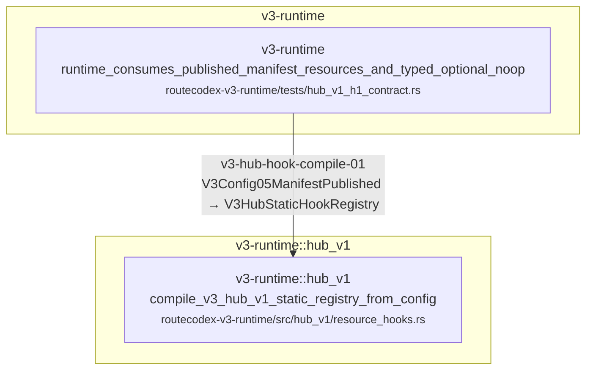
```mermaid
flowchart TD
  subgraph c_6_v3_hub_pipeline_v1_hook_registry_compile_m_v3_runtime["v3-runtime"]
    c_6_v3_hub_pipeline_v1_hook_registry_compile_0["v3-runtime<br/>runtime_consumes_published_manifest_resources_and_typed_optional_noop<br/><small>routecodex-v3-runtime/tests/hub_v1_h1_contract.rs</small>"]
  end
  subgraph c_6_v3_hub_pipeline_v1_hook_registry_compile_m_v3_runtime__hub_v1["v3-runtime::hub_v1"]
    c_6_v3_hub_pipeline_v1_hook_registry_compile_1["v3-runtime::hub_v1<br/>compile_v3_hub_v1_static_registry_from_config<br/><small>routecodex-v3-runtime/src/hub_v1/resource_hooks.rs</small>"]
  end
  c_6_v3_hub_pipeline_v1_hook_registry_compile_0 -->|v3-hub-hook-compile-01<br/>V3Config05ManifestPublished → V3HubStaticHookRegistry| c_6_v3_hub_pipeline_v1_hook_registry_compile_1
```

| Step | Node edge | Status | Caller | Callee | Owner |
| --- | --- | --- | --- | --- | --- |
| `v3-hub-hook-compile-01` | `V3Config05ManifestPublished` → `V3HubStaticHookRegistry` | anchored | runtime_consumes_published_manifest_resources_and_typed_optional_noop<br/><small>routecodex-v3-runtime/tests/hub_v1_h1_contract.rs</small> | compile_v3_hub_v1_static_registry_from_config<br/><small>routecodex-v3-runtime/src/hub_v1/resource_hooks.rs</small> | `v3.hub_relay_runtime_resources_hooks` |

## v3.responses_direct.required_mainline

Required no-shortcut lifecycle. P6 is source-bound from Server03 through Server16; after Target10 the runtime must decide direct-vs-relay before Direct policy, while target-local reselection stays inside the single Runtime kernel without Router re-entry.

Owner feature: `v3.responses_direct_mvp_architecture`


```mermaid
flowchart TD
  subgraph c_7_v3_responses_direct_required_mainline_m_v3_provider_responses["v3-provider-responses"]
    c_7_v3_responses_direct_required_mainline_15["v3-provider-responses<br/>build_v3_provider_12_responses_wire_payload<br/><small>routecodex-v3-provider-responses/src/wire.rs</small>"]
    c_7_v3_responses_direct_required_mainline_17["v3-provider-responses<br/>build_v3_transport_13_responses_http_request_from_v3_provider_12<br/><small>routecodex-v3-provider-responses/src/transport.rs</small>"]
    c_7_v3_responses_direct_required_mainline_18["v3-provider-responses<br/>ReqwestResponsesTransport::send<br/><small>routecodex-v3-provider-responses/src/transport.rs</small>"]
    c_7_v3_responses_direct_required_mainline_19["v3-provider-responses<br/>V3ProviderResp14Raw::from_json<br/><small>routecodex-v3-provider-responses/src/raw_response.rs</small>"]
  end
  subgraph c_7_v3_responses_direct_required_mainline_m_v3_runtime["v3-runtime"]
    c_7_v3_responses_direct_required_mainline_1["v3-runtime<br/>build_v3_server_03_http_request_raw<br/><small>routecodex-v3-runtime/src/nodes.rs</small>"]
    c_7_v3_responses_direct_required_mainline_2["v3-runtime<br/>execute_v3_p5_routing_runtime<br/><small>routecodex-v3-runtime/src/foundation.rs</small>"]
    c_7_v3_responses_direct_required_mainline_3["v3-runtime<br/>build_v3_req_04_standardized_responses_from_v3_server_03<br/><small>routecodex-v3-runtime/src/nodes.rs</small>"]
    c_7_v3_responses_direct_required_mainline_10["v3-runtime<br/>plan_v3_responses_protocol_execution_with_provider_health<br/><small>routecodex-v3-runtime/src/kernel/direct_protocol_plan.rs</small>"]
    c_7_v3_responses_direct_required_mainline_11["v3-runtime<br/>build_v3_execution_11_protocol_decision_from_v3_target_10<br/><small>routecodex-v3-runtime/src/nodes.rs</small>"]
    c_7_v3_responses_direct_required_mainline_12["v3-runtime<br/>execute_v3_responses_direct_runtime_kernel<br/><small>routecodex-v3-runtime/src/kernel.rs</small>"]
    c_7_v3_responses_direct_required_mainline_13["v3-runtime<br/>responses_direct_route_hook<br/><small>routecodex-v3-runtime/src/hooks.rs</small>"]
    c_7_v3_responses_direct_required_mainline_14["v3-runtime<br/>responses_direct_request_projection_hook<br/><small>routecodex-v3-runtime/src/hooks.rs</small>"]
    c_7_v3_responses_direct_required_mainline_16["v3-runtime<br/>responses_direct_provider_transport_hook<br/><small>routecodex-v3-runtime/src/hooks.rs</small>"]
    c_7_v3_responses_direct_required_mainline_20["v3-runtime<br/>responses_direct_response_projection_hook<br/><small>routecodex-v3-runtime/src/hooks.rs</small>"]
    c_7_v3_responses_direct_required_mainline_21["v3-runtime<br/>V3ResponsesDirectRuntimeOutput<br/><small>routecodex-v3-runtime/src/kernel.rs</small>"]
  end
  subgraph c_7_v3_responses_direct_required_mainline_m_v3_server["v3-server"]
    c_7_v3_responses_direct_required_mainline_0["v3-server<br/>pending_endpoint<br/><small>routecodex-v3-server/src/lib.rs</small>"]
    c_7_v3_responses_direct_required_mainline_22["v3-server<br/>build_v3_server_16_http_frame_from_v3_resp_15<br/><small>routecodex-v3-server/src/lib.rs</small>"]
  end
  subgraph c_7_v3_responses_direct_required_mainline_m_v3_target["v3-target"]
    c_7_v3_responses_direct_required_mainline_7["v3-target<br/>V3TargetInterpreter::classify_kind<br/><small>routecodex-v3-target/src/lib.rs</small>"]
    c_7_v3_responses_direct_required_mainline_8["v3-target<br/>V3TargetInterpreter::expand_candidates<br/><small>routecodex-v3-target/src/lib.rs</small>"]
    c_7_v3_responses_direct_required_mainline_9["v3-target<br/>V3TargetInterpreter::select_available<br/><small>routecodex-v3-target/src/lib.rs</small>"]
  end
  subgraph c_7_v3_responses_direct_required_mainline_m_v3_virtual_router["v3-virtual-router"]
    c_7_v3_responses_direct_required_mainline_4["v3-virtual-router<br/>V3VirtualRouter::classify_request_with_facts<br/><small>routecodex-v3-virtual-router/src/lib.rs</small>"]
    c_7_v3_responses_direct_required_mainline_5["v3-virtual-router<br/>V3VirtualRouter::resolve_route_pool_plan<br/><small>routecodex-v3-virtual-router/src/lib.rs</small>"]
    c_7_v3_responses_direct_required_mainline_6["v3-virtual-router<br/>V3VirtualRouter::hit_opaque_target_plan_once<br/><small>routecodex-v3-virtual-router/src/lib.rs</small>"]
  end
  c_7_v3_responses_direct_required_mainline_0 -->|v3-rd-01<br/>V3Config05ManifestPublished → V3Server03HttpRequestRaw| c_7_v3_responses_direct_required_mainline_1
  c_7_v3_responses_direct_required_mainline_2 -->|v3-rd-02<br/>V3Server03HttpRequestRaw → V3Req04StandardizedResponses| c_7_v3_responses_direct_required_mainline_3
  c_7_v3_responses_direct_required_mainline_2 -->|v3-rd-03<br/>V3Req04StandardizedResponses → V3Router05RequestClassified| c_7_v3_responses_direct_required_mainline_4
  c_7_v3_responses_direct_required_mainline_2 -->|v3-rd-04<br/>V3Router05RequestClassified → V3Router06RoutePoolResolved| c_7_v3_responses_direct_required_mainline_5
  c_7_v3_responses_direct_required_mainline_2 -->|v3-rd-05<br/>V3Router06RoutePoolResolved → V3Router07OpaqueTargetHitOnce| c_7_v3_responses_direct_required_mainline_6
  c_7_v3_responses_direct_required_mainline_2 -->|v3-rd-06<br/>V3Router07OpaqueTargetHitOnce → V3Target08KindClassified| c_7_v3_responses_direct_required_mainline_7
  c_7_v3_responses_direct_required_mainline_2 -->|v3-rd-07<br/>V3Target08KindClassified → V3Target09CandidateSetExpanded| c_7_v3_responses_direct_required_mainline_8
  c_7_v3_responses_direct_required_mainline_2 -->|v3-rd-08<br/>V3Target09CandidateSetExpanded → V3Target10ConcreteProviderSelected| c_7_v3_responses_direct_required_mainline_9
  c_7_v3_responses_direct_required_mainline_10 -->|v3-rd-09<br/>V3Target10ConcreteProviderSelected → V3Execution11ProtocolDecision| c_7_v3_responses_direct_required_mainline_11
  c_7_v3_responses_direct_required_mainline_12 -->|v3-rd-09-direct-policy<br/>V3Execution11ProtocolDecision → V3ResponsesDirect11Policy| c_7_v3_responses_direct_required_mainline_13
  c_7_v3_responses_direct_required_mainline_14 -->|v3-rd-10<br/>V3ResponsesDirect11Policy → V3Provider12ResponsesWirePayload| c_7_v3_responses_direct_required_mainline_15
  c_7_v3_responses_direct_required_mainline_16 -->|v3-rd-11<br/>V3Provider12ResponsesWirePayload → V3Transport13ResponsesHttpRequest| c_7_v3_responses_direct_required_mainline_17
  c_7_v3_responses_direct_required_mainline_18 -->|v3-rd-12<br/>V3Transport13ResponsesHttpRequest → V3ProviderResp14Raw| c_7_v3_responses_direct_required_mainline_19
  c_7_v3_responses_direct_required_mainline_12 -->|v3-rd-13<br/>V3ProviderResp14Raw → V3DirectResp14ProviderProjectionPrepared| c_7_v3_responses_direct_required_mainline_20
  c_7_v3_responses_direct_required_mainline_12 -->|v3-rd-14<br/>V3DirectResp14ProviderProjectionPrepared → V3DirectResp15ClientPayloadReady| c_7_v3_responses_direct_required_mainline_21
  c_7_v3_responses_direct_required_mainline_12 -->|v3-rd-15<br/>V3DirectResp15ClientPayloadReady → V3Resp15ClientPayload| c_7_v3_responses_direct_required_mainline_21
  c_7_v3_responses_direct_required_mainline_0 -->|v3-rd-16<br/>V3Resp15ClientPayload → V3Server16HttpFrame| c_7_v3_responses_direct_required_mainline_22
```

| Step | Node edge | Status | Caller | Callee | Owner |
| --- | --- | --- | --- | --- | --- |
| `v3-rd-01` | `V3Config05ManifestPublished` → `V3Server03HttpRequestRaw` | anchored | pending_endpoint<br/><small>routecodex-v3-server/src/lib.rs</small> | build_v3_server_03_http_request_raw<br/><small>routecodex-v3-runtime/src/nodes.rs</small> | `v3.virtual_router_target_interpreter` |
| `v3-rd-02` | `V3Server03HttpRequestRaw` → `V3Req04StandardizedResponses` | anchored | execute_v3_p5_routing_runtime<br/><small>routecodex-v3-runtime/src/foundation.rs</small> | build_v3_req_04_standardized_responses_from_v3_server_03<br/><small>routecodex-v3-runtime/src/nodes.rs</small> | `v3.virtual_router_target_interpreter` |
| `v3-rd-03` | `V3Req04StandardizedResponses` → `V3Router05RequestClassified` | anchored | execute_v3_p5_routing_runtime<br/><small>routecodex-v3-runtime/src/foundation.rs</small> | V3VirtualRouter::classify_request_with_facts<br/><small>routecodex-v3-virtual-router/src/lib.rs</small> | `v3.virtual_router_full_function` |
| `v3-rd-04` | `V3Router05RequestClassified` → `V3Router06RoutePoolResolved` | anchored | execute_v3_p5_routing_runtime<br/><small>routecodex-v3-runtime/src/foundation.rs</small> | V3VirtualRouter::resolve_route_pool_plan<br/><small>routecodex-v3-virtual-router/src/lib.rs</small> | `v3.virtual_router_full_function` |
| `v3-rd-05` | `V3Router06RoutePoolResolved` → `V3Router07OpaqueTargetHitOnce` | anchored | execute_v3_p5_routing_runtime<br/><small>routecodex-v3-runtime/src/foundation.rs</small> | V3VirtualRouter::hit_opaque_target_plan_once<br/><small>routecodex-v3-virtual-router/src/lib.rs</small> | `v3.virtual_router_full_function` |
| `v3-rd-06` | `V3Router07OpaqueTargetHitOnce` → `V3Target08KindClassified` | anchored | execute_v3_p5_routing_runtime<br/><small>routecodex-v3-runtime/src/foundation.rs</small> | V3TargetInterpreter::classify_kind<br/><small>routecodex-v3-target/src/lib.rs</small> | `v3.virtual_router_target_interpreter` |
| `v3-rd-07` | `V3Target08KindClassified` → `V3Target09CandidateSetExpanded` | anchored | execute_v3_p5_routing_runtime<br/><small>routecodex-v3-runtime/src/foundation.rs</small> | V3TargetInterpreter::expand_candidates<br/><small>routecodex-v3-target/src/lib.rs</small> | `v3.virtual_router_target_interpreter` |
| `v3-rd-08` | `V3Target09CandidateSetExpanded` → `V3Target10ConcreteProviderSelected` | anchored | execute_v3_p5_routing_runtime<br/><small>routecodex-v3-runtime/src/foundation.rs</small> | V3TargetInterpreter::select_available<br/><small>routecodex-v3-target/src/lib.rs</small> | `v3.virtual_router_target_interpreter` |
| `v3-rd-09` | `V3Target10ConcreteProviderSelected` → `V3Execution11ProtocolDecision` | anchored | plan_v3_responses_protocol_execution_with_provider_health<br/><small>routecodex-v3-runtime/src/kernel/direct_protocol_plan.rs</small> | build_v3_execution_11_protocol_decision_from_v3_target_10<br/><small>routecodex-v3-runtime/src/nodes.rs</small> | `v3.responses_direct_mvp_architecture` |
| `v3-rd-09-direct-policy` | `V3Execution11ProtocolDecision` → `V3ResponsesDirect11Policy` | anchored | execute_v3_responses_direct_runtime_kernel<br/><small>routecodex-v3-runtime/src/kernel.rs</small> | responses_direct_route_hook<br/><small>routecodex-v3-runtime/src/hooks.rs</small> | `v3.responses_direct_mvp_architecture` |
| `v3-rd-10` | `V3ResponsesDirect11Policy` → `V3Provider12ResponsesWirePayload` | anchored | responses_direct_request_projection_hook<br/><small>routecodex-v3-runtime/src/hooks.rs</small> | build_v3_provider_12_responses_wire_payload<br/><small>routecodex-v3-provider-responses/src/wire.rs</small> | `v3.responses_provider_runtime` |
| `v3-rd-11` | `V3Provider12ResponsesWirePayload` → `V3Transport13ResponsesHttpRequest` | anchored | responses_direct_provider_transport_hook<br/><small>routecodex-v3-runtime/src/hooks.rs</small> | build_v3_transport_13_responses_http_request_from_v3_provider_12<br/><small>routecodex-v3-provider-responses/src/transport.rs</small> | `v3.responses_provider_runtime` |
| `v3-rd-12` | `V3Transport13ResponsesHttpRequest` → `V3ProviderResp14Raw` | anchored | ReqwestResponsesTransport::send<br/><small>routecodex-v3-provider-responses/src/transport.rs</small> | V3ProviderResp14Raw::from_json<br/><small>routecodex-v3-provider-responses/src/raw_response.rs</small> | `v3.responses_provider_runtime` |
| `v3-rd-13` | `V3ProviderResp14Raw` → `V3DirectResp14ProviderProjectionPrepared` | anchored | execute_v3_responses_direct_runtime_kernel<br/><small>routecodex-v3-runtime/src/kernel.rs</small> | responses_direct_response_projection_hook<br/><small>routecodex-v3-runtime/src/hooks.rs</small> | `v3.responses_direct_mvp_architecture` |
| `v3-rd-14` | `V3DirectResp14ProviderProjectionPrepared` → `V3DirectResp15ClientPayloadReady` | anchored | execute_v3_responses_direct_runtime_kernel<br/><small>routecodex-v3-runtime/src/kernel.rs</small> | V3ResponsesDirectRuntimeOutput<br/><small>routecodex-v3-runtime/src/kernel.rs</small> | `v3.responses_direct_mvp_architecture` |
| `v3-rd-15` | `V3DirectResp15ClientPayloadReady` → `V3Resp15ClientPayload` | anchored | execute_v3_responses_direct_runtime_kernel<br/><small>routecodex-v3-runtime/src/kernel.rs</small> | V3ResponsesDirectRuntimeOutput<br/><small>routecodex-v3-runtime/src/kernel.rs</small> | `v3.responses_direct_mvp_architecture` |
| `v3-rd-16` | `V3Resp15ClientPayload` → `V3Server16HttpFrame` | anchored | pending_endpoint<br/><small>routecodex-v3-server/src/lib.rs</small> | build_v3_server_16_http_frame_from_v3_resp_15<br/><small>routecodex-v3-server/src/lib.rs</small> | `v3.responses_direct_mvp_architecture` |

## v3.hub_pipeline.v1.request

Fixed Hub v1 request topology. All Direct/Relay/continuation/target/provider-protocol branches traverse every adjacent node and are supplied by static Rust hooks.

Owner feature: `v3.hub_pipeline_static_skeleton`
Manifest: `docs/architecture/manifests/v3.hub_pipeline.v1.request.mainline.yml`

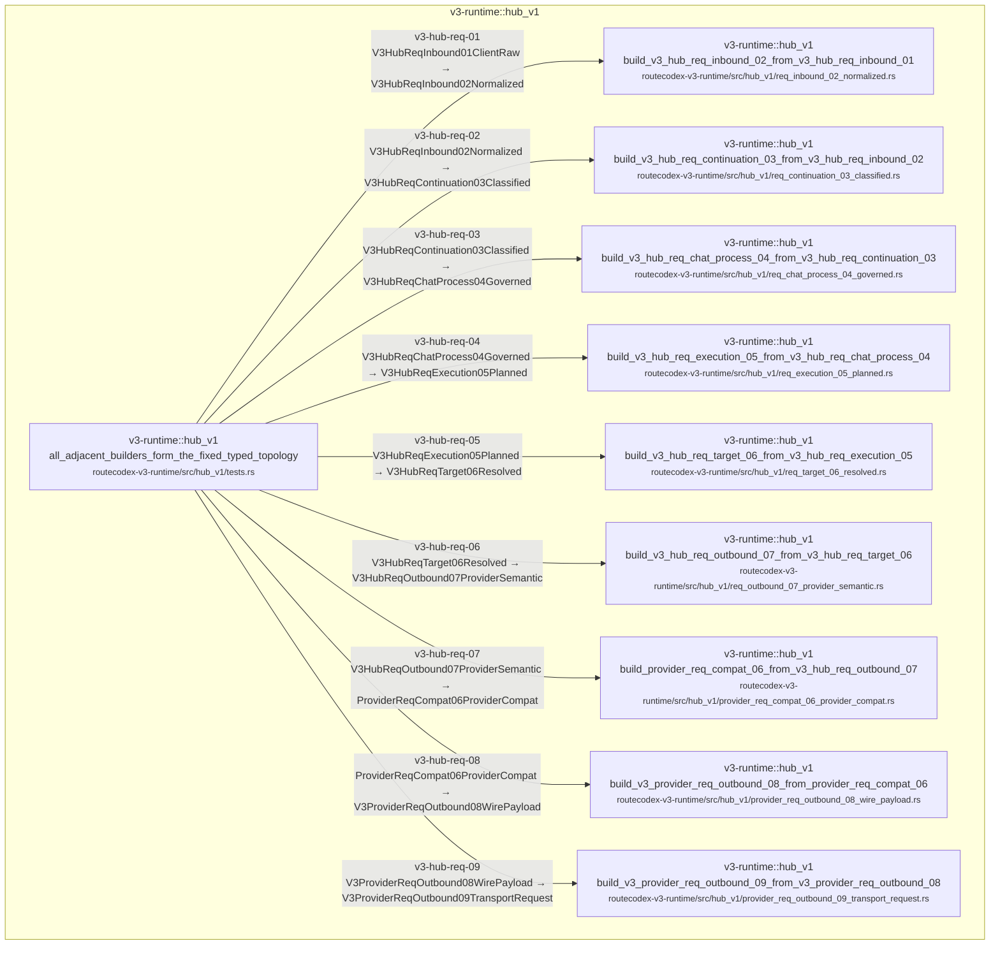
```mermaid
flowchart TD
  subgraph c_8_v3_hub_pipeline_v1_request_m_v3_runtime__hub_v1["v3-runtime::hub_v1"]
    c_8_v3_hub_pipeline_v1_request_0["v3-runtime::hub_v1<br/>all_adjacent_builders_form_the_fixed_typed_topology<br/><small>routecodex-v3-runtime/src/hub_v1/tests.rs</small>"]
    c_8_v3_hub_pipeline_v1_request_1["v3-runtime::hub_v1<br/>build_v3_hub_req_inbound_02_from_v3_hub_req_inbound_01<br/><small>routecodex-v3-runtime/src/hub_v1/req_inbound_02_normalized.rs</small>"]
    c_8_v3_hub_pipeline_v1_request_2["v3-runtime::hub_v1<br/>build_v3_hub_req_continuation_03_from_v3_hub_req_inbound_02<br/><small>routecodex-v3-runtime/src/hub_v1/req_continuation_03_classified.rs</small>"]
    c_8_v3_hub_pipeline_v1_request_3["v3-runtime::hub_v1<br/>build_v3_hub_req_chat_process_04_from_v3_hub_req_continuation_03<br/><small>routecodex-v3-runtime/src/hub_v1/req_chat_process_04_governed.rs</small>"]
    c_8_v3_hub_pipeline_v1_request_4["v3-runtime::hub_v1<br/>build_v3_hub_req_execution_05_from_v3_hub_req_chat_process_04<br/><small>routecodex-v3-runtime/src/hub_v1/req_execution_05_planned.rs</small>"]
    c_8_v3_hub_pipeline_v1_request_5["v3-runtime::hub_v1<br/>build_v3_hub_req_target_06_from_v3_hub_req_execution_05<br/><small>routecodex-v3-runtime/src/hub_v1/req_target_06_resolved.rs</small>"]
    c_8_v3_hub_pipeline_v1_request_6["v3-runtime::hub_v1<br/>build_v3_hub_req_outbound_07_from_v3_hub_req_target_06<br/><small>routecodex-v3-runtime/src/hub_v1/req_outbound_07_provider_semantic.rs</small>"]
    c_8_v3_hub_pipeline_v1_request_7["v3-runtime::hub_v1<br/>build_provider_req_compat_06_from_v3_hub_req_outbound_07<br/><small>routecodex-v3-runtime/src/hub_v1/provider_req_compat_06_provider_compat.rs</small>"]
    c_8_v3_hub_pipeline_v1_request_8["v3-runtime::hub_v1<br/>build_v3_provider_req_outbound_08_from_provider_req_compat_06<br/><small>routecodex-v3-runtime/src/hub_v1/provider_req_outbound_08_wire_payload.rs</small>"]
    c_8_v3_hub_pipeline_v1_request_9["v3-runtime::hub_v1<br/>build_v3_provider_req_outbound_09_from_v3_provider_req_outbound_08<br/><small>routecodex-v3-runtime/src/hub_v1/provider_req_outbound_09_transport_request.rs</small>"]
  end
  c_8_v3_hub_pipeline_v1_request_0 -->|v3-hub-req-01<br/>V3HubReqInbound01ClientRaw → V3HubReqInbound02Normalized| c_8_v3_hub_pipeline_v1_request_1
  c_8_v3_hub_pipeline_v1_request_0 -->|v3-hub-req-02<br/>V3HubReqInbound02Normalized → V3HubReqContinuation03Classified| c_8_v3_hub_pipeline_v1_request_2
  c_8_v3_hub_pipeline_v1_request_0 -->|v3-hub-req-03<br/>V3HubReqContinuation03Classified → V3HubReqChatProcess04Governed| c_8_v3_hub_pipeline_v1_request_3
  c_8_v3_hub_pipeline_v1_request_0 -->|v3-hub-req-04<br/>V3HubReqChatProcess04Governed → V3HubReqExecution05Planned| c_8_v3_hub_pipeline_v1_request_4
  c_8_v3_hub_pipeline_v1_request_0 -->|v3-hub-req-05<br/>V3HubReqExecution05Planned → V3HubReqTarget06Resolved| c_8_v3_hub_pipeline_v1_request_5
  c_8_v3_hub_pipeline_v1_request_0 -->|v3-hub-req-06<br/>V3HubReqTarget06Resolved → V3HubReqOutbound07ProviderSemantic| c_8_v3_hub_pipeline_v1_request_6
  c_8_v3_hub_pipeline_v1_request_0 -->|v3-hub-req-07<br/>V3HubReqOutbound07ProviderSemantic → ProviderReqCompat06ProviderCompat| c_8_v3_hub_pipeline_v1_request_7
  c_8_v3_hub_pipeline_v1_request_0 -->|v3-hub-req-08<br/>ProviderReqCompat06ProviderCompat → V3ProviderReqOutbound08WirePayload| c_8_v3_hub_pipeline_v1_request_8
  c_8_v3_hub_pipeline_v1_request_0 -->|v3-hub-req-09<br/>V3ProviderReqOutbound08WirePayload → V3ProviderReqOutbound09TransportRequest| c_8_v3_hub_pipeline_v1_request_9
```

| Step | Node edge | Status | Caller | Callee | Owner |
| --- | --- | --- | --- | --- | --- |
| `v3-hub-req-01` | `V3HubReqInbound01ClientRaw` → `V3HubReqInbound02Normalized` | anchored | all_adjacent_builders_form_the_fixed_typed_topology<br/><small>routecodex-v3-runtime/src/hub_v1/tests.rs</small> | build_v3_hub_req_inbound_02_from_v3_hub_req_inbound_01<br/><small>routecodex-v3-runtime/src/hub_v1/req_inbound_02_normalized.rs</small> | `v3.hub_pipeline_static_skeleton` |
| `v3-hub-req-02` | `V3HubReqInbound02Normalized` → `V3HubReqContinuation03Classified` | anchored | all_adjacent_builders_form_the_fixed_typed_topology<br/><small>routecodex-v3-runtime/src/hub_v1/tests.rs</small> | build_v3_hub_req_continuation_03_from_v3_hub_req_inbound_02<br/><small>routecodex-v3-runtime/src/hub_v1/req_continuation_03_classified.rs</small> | `v3.hub_pipeline_static_skeleton` |
| `v3-hub-req-03` | `V3HubReqContinuation03Classified` → `V3HubReqChatProcess04Governed` | anchored | all_adjacent_builders_form_the_fixed_typed_topology<br/><small>routecodex-v3-runtime/src/hub_v1/tests.rs</small> | build_v3_hub_req_chat_process_04_from_v3_hub_req_continuation_03<br/><small>routecodex-v3-runtime/src/hub_v1/req_chat_process_04_governed.rs</small> | `v3.hub_pipeline_static_skeleton` |
| `v3-hub-req-04` | `V3HubReqChatProcess04Governed` → `V3HubReqExecution05Planned` | anchored | all_adjacent_builders_form_the_fixed_typed_topology<br/><small>routecodex-v3-runtime/src/hub_v1/tests.rs</small> | build_v3_hub_req_execution_05_from_v3_hub_req_chat_process_04<br/><small>routecodex-v3-runtime/src/hub_v1/req_execution_05_planned.rs</small> | `v3.hub_pipeline_static_skeleton` |
| `v3-hub-req-05` | `V3HubReqExecution05Planned` → `V3HubReqTarget06Resolved` | anchored | all_adjacent_builders_form_the_fixed_typed_topology<br/><small>routecodex-v3-runtime/src/hub_v1/tests.rs</small> | build_v3_hub_req_target_06_from_v3_hub_req_execution_05<br/><small>routecodex-v3-runtime/src/hub_v1/req_target_06_resolved.rs</small> | `v3.hub_pipeline_static_skeleton` |
| `v3-hub-req-06` | `V3HubReqTarget06Resolved` → `V3HubReqOutbound07ProviderSemantic` | anchored | all_adjacent_builders_form_the_fixed_typed_topology<br/><small>routecodex-v3-runtime/src/hub_v1/tests.rs</small> | build_v3_hub_req_outbound_07_from_v3_hub_req_target_06<br/><small>routecodex-v3-runtime/src/hub_v1/req_outbound_07_provider_semantic.rs</small> | `v3.hub_pipeline_static_skeleton` |
| `v3-hub-req-07` | `V3HubReqOutbound07ProviderSemantic` → `ProviderReqCompat06ProviderCompat` | anchored | all_adjacent_builders_form_the_fixed_typed_topology<br/><small>routecodex-v3-runtime/src/hub_v1/tests.rs</small> | build_provider_req_compat_06_from_v3_hub_req_outbound_07<br/><small>routecodex-v3-runtime/src/hub_v1/provider_req_compat_06_provider_compat.rs</small> | `v3.hub_pipeline_static_skeleton` |
| `v3-hub-req-08` | `ProviderReqCompat06ProviderCompat` → `V3ProviderReqOutbound08WirePayload` | anchored | all_adjacent_builders_form_the_fixed_typed_topology<br/><small>routecodex-v3-runtime/src/hub_v1/tests.rs</small> | build_v3_provider_req_outbound_08_from_provider_req_compat_06<br/><small>routecodex-v3-runtime/src/hub_v1/provider_req_outbound_08_wire_payload.rs</small> | `v3.hub_pipeline_static_skeleton` |
| `v3-hub-req-09` | `V3ProviderReqOutbound08WirePayload` → `V3ProviderReqOutbound09TransportRequest` | anchored | all_adjacent_builders_form_the_fixed_typed_topology<br/><small>routecodex-v3-runtime/src/hub_v1/tests.rs</small> | build_v3_provider_req_outbound_09_from_v3_provider_req_outbound_08<br/><small>routecodex-v3-runtime/src/hub_v1/provider_req_outbound_09_transport_request.rs</small> | `v3.hub_pipeline_static_skeleton` |

## v3.hub_pipeline.v1.relay_request_source_slice

Relay request-side source slice. Req02 normalizes, Req03 classifies only, and Req04 restores/governs; later fixed nodes remain the standard Hub v1 chain.

Owner feature: `v3.hub_relay_request_semantics`

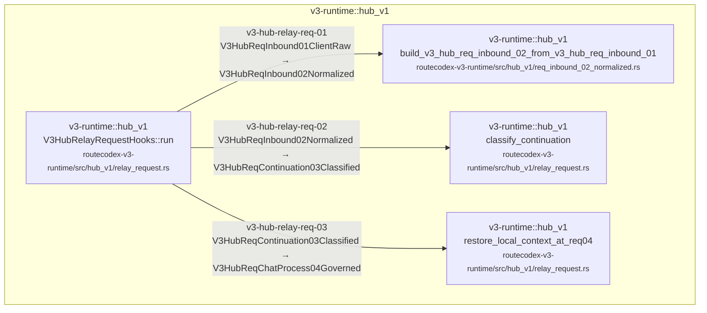
```mermaid
flowchart TD
  subgraph c_9_v3_hub_pipeline_v1_relay_request_source_slice_m_v3_runtime__hub_v1["v3-runtime::hub_v1"]
    c_9_v3_hub_pipeline_v1_relay_request_source_slice_0["v3-runtime::hub_v1<br/>V3HubRelayRequestHooks::run<br/><small>routecodex-v3-runtime/src/hub_v1/relay_request.rs</small>"]
    c_9_v3_hub_pipeline_v1_relay_request_source_slice_1["v3-runtime::hub_v1<br/>build_v3_hub_req_inbound_02_from_v3_hub_req_inbound_01<br/><small>routecodex-v3-runtime/src/hub_v1/req_inbound_02_normalized.rs</small>"]
    c_9_v3_hub_pipeline_v1_relay_request_source_slice_2["v3-runtime::hub_v1<br/>classify_continuation<br/><small>routecodex-v3-runtime/src/hub_v1/relay_request.rs</small>"]
    c_9_v3_hub_pipeline_v1_relay_request_source_slice_3["v3-runtime::hub_v1<br/>restore_local_context_at_req04<br/><small>routecodex-v3-runtime/src/hub_v1/relay_request.rs</small>"]
  end
  c_9_v3_hub_pipeline_v1_relay_request_source_slice_0 -->|v3-hub-relay-req-01<br/>V3HubReqInbound01ClientRaw → V3HubReqInbound02Normalized| c_9_v3_hub_pipeline_v1_relay_request_source_slice_1
  c_9_v3_hub_pipeline_v1_relay_request_source_slice_0 -->|v3-hub-relay-req-02<br/>V3HubReqInbound02Normalized → V3HubReqContinuation03Classified| c_9_v3_hub_pipeline_v1_relay_request_source_slice_2
  c_9_v3_hub_pipeline_v1_relay_request_source_slice_0 -->|v3-hub-relay-req-03<br/>V3HubReqContinuation03Classified → V3HubReqChatProcess04Governed| c_9_v3_hub_pipeline_v1_relay_request_source_slice_3
```

| Step | Node edge | Status | Caller | Callee | Owner |
| --- | --- | --- | --- | --- | --- |
| `v3-hub-relay-req-01` | `V3HubReqInbound01ClientRaw` → `V3HubReqInbound02Normalized` | anchored | V3HubRelayRequestHooks::run<br/><small>routecodex-v3-runtime/src/hub_v1/relay_request.rs</small> | build_v3_hub_req_inbound_02_from_v3_hub_req_inbound_01<br/><small>routecodex-v3-runtime/src/hub_v1/req_inbound_02_normalized.rs</small> | `v3.hub_relay_request_semantics` |
| `v3-hub-relay-req-02` | `V3HubReqInbound02Normalized` → `V3HubReqContinuation03Classified` | anchored | V3HubRelayRequestHooks::run<br/><small>routecodex-v3-runtime/src/hub_v1/relay_request.rs</small> | classify_continuation<br/><small>routecodex-v3-runtime/src/hub_v1/relay_request.rs</small> | `v3.hub_relay_request_semantics` |
| `v3-hub-relay-req-03` | `V3HubReqContinuation03Classified` → `V3HubReqChatProcess04Governed` | anchored | V3HubRelayRequestHooks::run<br/><small>routecodex-v3-runtime/src/hub_v1/relay_request.rs</small> | restore_local_context_at_req04<br/><small>routecodex-v3-runtime/src/hub_v1/relay_request.rs</small> | `v3.hub_relay_request_semantics` |

## v3.hub_pipeline.v1.response

Fixed Hub v1 response topology. Direct/Relay/JSON/SSE/servertool outcomes merge before the sole client projection and Server frame exit.

Owner feature: `v3.hub_pipeline_static_skeleton`
Manifest: `docs/architecture/manifests/v3.hub_pipeline.v1.response.mainline.yml`

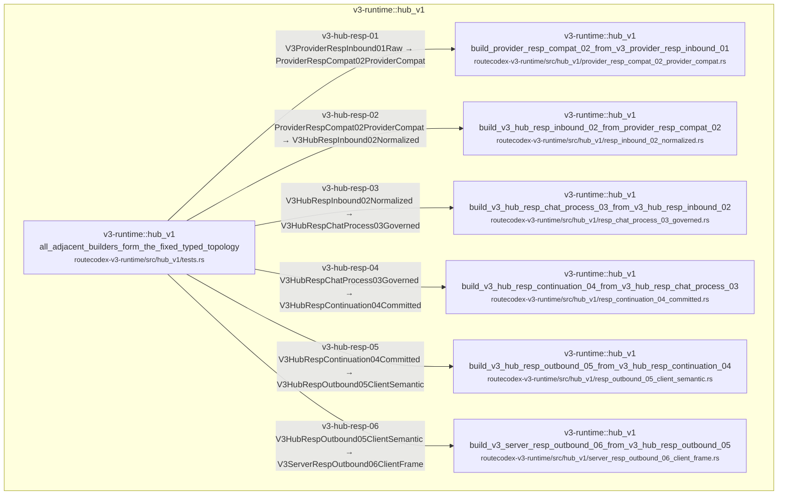
```mermaid
flowchart TD
  subgraph c_10_v3_hub_pipeline_v1_response_m_v3_runtime__hub_v1["v3-runtime::hub_v1"]
    c_10_v3_hub_pipeline_v1_response_0["v3-runtime::hub_v1<br/>all_adjacent_builders_form_the_fixed_typed_topology<br/><small>routecodex-v3-runtime/src/hub_v1/tests.rs</small>"]
    c_10_v3_hub_pipeline_v1_response_1["v3-runtime::hub_v1<br/>build_provider_resp_compat_02_from_v3_provider_resp_inbound_01<br/><small>routecodex-v3-runtime/src/hub_v1/provider_resp_compat_02_provider_compat.rs</small>"]
    c_10_v3_hub_pipeline_v1_response_2["v3-runtime::hub_v1<br/>build_v3_hub_resp_inbound_02_from_provider_resp_compat_02<br/><small>routecodex-v3-runtime/src/hub_v1/resp_inbound_02_normalized.rs</small>"]
    c_10_v3_hub_pipeline_v1_response_3["v3-runtime::hub_v1<br/>build_v3_hub_resp_chat_process_03_from_v3_hub_resp_inbound_02<br/><small>routecodex-v3-runtime/src/hub_v1/resp_chat_process_03_governed.rs</small>"]
    c_10_v3_hub_pipeline_v1_response_4["v3-runtime::hub_v1<br/>build_v3_hub_resp_continuation_04_from_v3_hub_resp_chat_process_03<br/><small>routecodex-v3-runtime/src/hub_v1/resp_continuation_04_committed.rs</small>"]
    c_10_v3_hub_pipeline_v1_response_5["v3-runtime::hub_v1<br/>build_v3_hub_resp_outbound_05_from_v3_hub_resp_continuation_04<br/><small>routecodex-v3-runtime/src/hub_v1/resp_outbound_05_client_semantic.rs</small>"]
    c_10_v3_hub_pipeline_v1_response_6["v3-runtime::hub_v1<br/>build_v3_server_resp_outbound_06_from_v3_hub_resp_outbound_05<br/><small>routecodex-v3-runtime/src/hub_v1/server_resp_outbound_06_client_frame.rs</small>"]
  end
  c_10_v3_hub_pipeline_v1_response_0 -->|v3-hub-resp-01<br/>V3ProviderRespInbound01Raw → ProviderRespCompat02ProviderCompat| c_10_v3_hub_pipeline_v1_response_1
  c_10_v3_hub_pipeline_v1_response_0 -->|v3-hub-resp-02<br/>ProviderRespCompat02ProviderCompat → V3HubRespInbound02Normalized| c_10_v3_hub_pipeline_v1_response_2
  c_10_v3_hub_pipeline_v1_response_0 -->|v3-hub-resp-03<br/>V3HubRespInbound02Normalized → V3HubRespChatProcess03Governed| c_10_v3_hub_pipeline_v1_response_3
  c_10_v3_hub_pipeline_v1_response_0 -->|v3-hub-resp-04<br/>V3HubRespChatProcess03Governed → V3HubRespContinuation04Committed| c_10_v3_hub_pipeline_v1_response_4
  c_10_v3_hub_pipeline_v1_response_0 -->|v3-hub-resp-05<br/>V3HubRespContinuation04Committed → V3HubRespOutbound05ClientSemantic| c_10_v3_hub_pipeline_v1_response_5
  c_10_v3_hub_pipeline_v1_response_0 -->|v3-hub-resp-06<br/>V3HubRespOutbound05ClientSemantic → V3ServerRespOutbound06ClientFrame| c_10_v3_hub_pipeline_v1_response_6
```

| Step | Node edge | Status | Caller | Callee | Owner |
| --- | --- | --- | --- | --- | --- |
| `v3-hub-resp-01` | `V3ProviderRespInbound01Raw` → `ProviderRespCompat02ProviderCompat` | anchored | all_adjacent_builders_form_the_fixed_typed_topology<br/><small>routecodex-v3-runtime/src/hub_v1/tests.rs</small> | build_provider_resp_compat_02_from_v3_provider_resp_inbound_01<br/><small>routecodex-v3-runtime/src/hub_v1/provider_resp_compat_02_provider_compat.rs</small> | `v3.hub_pipeline_static_skeleton` |
| `v3-hub-resp-02` | `ProviderRespCompat02ProviderCompat` → `V3HubRespInbound02Normalized` | anchored | all_adjacent_builders_form_the_fixed_typed_topology<br/><small>routecodex-v3-runtime/src/hub_v1/tests.rs</small> | build_v3_hub_resp_inbound_02_from_provider_resp_compat_02<br/><small>routecodex-v3-runtime/src/hub_v1/resp_inbound_02_normalized.rs</small> | `v3.hub_pipeline_static_skeleton` |
| `v3-hub-resp-03` | `V3HubRespInbound02Normalized` → `V3HubRespChatProcess03Governed` | anchored | all_adjacent_builders_form_the_fixed_typed_topology<br/><small>routecodex-v3-runtime/src/hub_v1/tests.rs</small> | build_v3_hub_resp_chat_process_03_from_v3_hub_resp_inbound_02<br/><small>routecodex-v3-runtime/src/hub_v1/resp_chat_process_03_governed.rs</small> | `v3.hub_pipeline_static_skeleton` |
| `v3-hub-resp-04` | `V3HubRespChatProcess03Governed` → `V3HubRespContinuation04Committed` | anchored | all_adjacent_builders_form_the_fixed_typed_topology<br/><small>routecodex-v3-runtime/src/hub_v1/tests.rs</small> | build_v3_hub_resp_continuation_04_from_v3_hub_resp_chat_process_03<br/><small>routecodex-v3-runtime/src/hub_v1/resp_continuation_04_committed.rs</small> | `v3.hub_pipeline_static_skeleton` |
| `v3-hub-resp-05` | `V3HubRespContinuation04Committed` → `V3HubRespOutbound05ClientSemantic` | anchored | all_adjacent_builders_form_the_fixed_typed_topology<br/><small>routecodex-v3-runtime/src/hub_v1/tests.rs</small> | build_v3_hub_resp_outbound_05_from_v3_hub_resp_continuation_04<br/><small>routecodex-v3-runtime/src/hub_v1/resp_outbound_05_client_semantic.rs</small> | `v3.hub_pipeline_static_skeleton` |
| `v3-hub-resp-06` | `V3HubRespOutbound05ClientSemantic` → `V3ServerRespOutbound06ClientFrame` | anchored | all_adjacent_builders_form_the_fixed_typed_topology<br/><small>routecodex-v3-runtime/src/hub_v1/tests.rs</small> | build_v3_server_resp_outbound_06_from_v3_hub_resp_outbound_05<br/><small>routecodex-v3-runtime/src/hub_v1/server_resp_outbound_06_client_frame.rs</small> | `v3.hub_pipeline_static_skeleton` |

## v3.hub_pipeline.v1.relay_response_source_slice

Relay response-side source slice. Static callable response hooks implement Resp01->Resp04 only; Resp05/Server/SSE remain pass-through projection/transport and cannot own continuation semantics.

Owner feature: `v3.hub_relay_response_semantics`

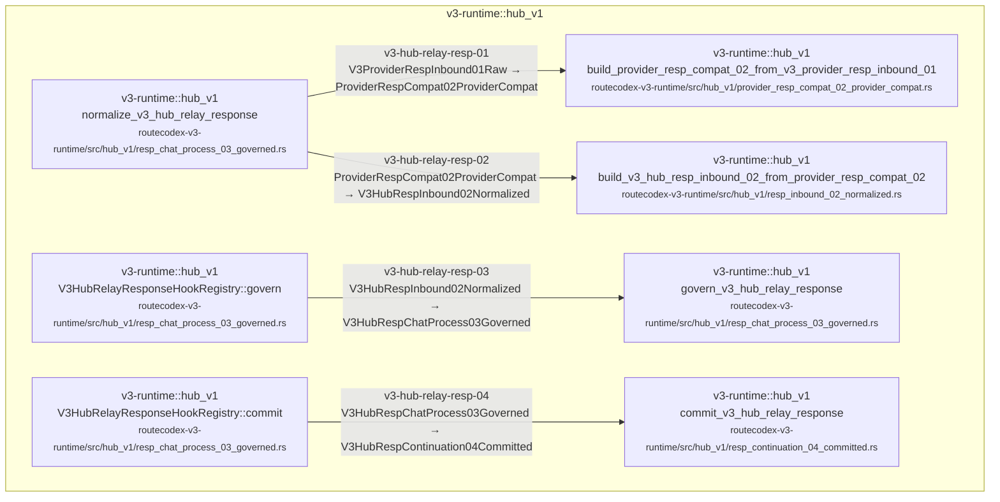
```mermaid
flowchart TD
  subgraph c_11_v3_hub_pipeline_v1_relay_response_source_slice_m_v3_runtime__hub_v1["v3-runtime::hub_v1"]
    c_11_v3_hub_pipeline_v1_relay_response_source_slice_0["v3-runtime::hub_v1<br/>normalize_v3_hub_relay_response<br/><small>routecodex-v3-runtime/src/hub_v1/resp_chat_process_03_governed.rs</small>"]
    c_11_v3_hub_pipeline_v1_relay_response_source_slice_1["v3-runtime::hub_v1<br/>build_provider_resp_compat_02_from_v3_provider_resp_inbound_01<br/><small>routecodex-v3-runtime/src/hub_v1/provider_resp_compat_02_provider_compat.rs</small>"]
    c_11_v3_hub_pipeline_v1_relay_response_source_slice_2["v3-runtime::hub_v1<br/>build_v3_hub_resp_inbound_02_from_provider_resp_compat_02<br/><small>routecodex-v3-runtime/src/hub_v1/resp_inbound_02_normalized.rs</small>"]
    c_11_v3_hub_pipeline_v1_relay_response_source_slice_3["v3-runtime::hub_v1<br/>V3HubRelayResponseHookRegistry::govern<br/><small>routecodex-v3-runtime/src/hub_v1/resp_chat_process_03_governed.rs</small>"]
    c_11_v3_hub_pipeline_v1_relay_response_source_slice_4["v3-runtime::hub_v1<br/>govern_v3_hub_relay_response<br/><small>routecodex-v3-runtime/src/hub_v1/resp_chat_process_03_governed.rs</small>"]
    c_11_v3_hub_pipeline_v1_relay_response_source_slice_5["v3-runtime::hub_v1<br/>V3HubRelayResponseHookRegistry::commit<br/><small>routecodex-v3-runtime/src/hub_v1/resp_chat_process_03_governed.rs</small>"]
    c_11_v3_hub_pipeline_v1_relay_response_source_slice_6["v3-runtime::hub_v1<br/>commit_v3_hub_relay_response<br/><small>routecodex-v3-runtime/src/hub_v1/resp_continuation_04_committed.rs</small>"]
  end
  c_11_v3_hub_pipeline_v1_relay_response_source_slice_0 -->|v3-hub-relay-resp-01<br/>V3ProviderRespInbound01Raw → ProviderRespCompat02ProviderCompat| c_11_v3_hub_pipeline_v1_relay_response_source_slice_1
  c_11_v3_hub_pipeline_v1_relay_response_source_slice_0 -->|v3-hub-relay-resp-02<br/>ProviderRespCompat02ProviderCompat → V3HubRespInbound02Normalized| c_11_v3_hub_pipeline_v1_relay_response_source_slice_2
  c_11_v3_hub_pipeline_v1_relay_response_source_slice_3 -->|v3-hub-relay-resp-03<br/>V3HubRespInbound02Normalized → V3HubRespChatProcess03Governed| c_11_v3_hub_pipeline_v1_relay_response_source_slice_4
  c_11_v3_hub_pipeline_v1_relay_response_source_slice_5 -->|v3-hub-relay-resp-04<br/>V3HubRespChatProcess03Governed → V3HubRespContinuation04Committed| c_11_v3_hub_pipeline_v1_relay_response_source_slice_6
```

| Step | Node edge | Status | Caller | Callee | Owner |
| --- | --- | --- | --- | --- | --- |
| `v3-hub-relay-resp-01` | `V3ProviderRespInbound01Raw` → `ProviderRespCompat02ProviderCompat` | anchored | normalize_v3_hub_relay_response<br/><small>routecodex-v3-runtime/src/hub_v1/resp_chat_process_03_governed.rs</small> | build_provider_resp_compat_02_from_v3_provider_resp_inbound_01<br/><small>routecodex-v3-runtime/src/hub_v1/provider_resp_compat_02_provider_compat.rs</small> | `v3.hub_relay_response_semantics` |
| `v3-hub-relay-resp-02` | `ProviderRespCompat02ProviderCompat` → `V3HubRespInbound02Normalized` | anchored | normalize_v3_hub_relay_response<br/><small>routecodex-v3-runtime/src/hub_v1/resp_chat_process_03_governed.rs</small> | build_v3_hub_resp_inbound_02_from_provider_resp_compat_02<br/><small>routecodex-v3-runtime/src/hub_v1/resp_inbound_02_normalized.rs</small> | `v3.hub_relay_response_semantics` |
| `v3-hub-relay-resp-03` | `V3HubRespInbound02Normalized` → `V3HubRespChatProcess03Governed` | anchored | V3HubRelayResponseHookRegistry::govern<br/><small>routecodex-v3-runtime/src/hub_v1/resp_chat_process_03_governed.rs</small> | govern_v3_hub_relay_response<br/><small>routecodex-v3-runtime/src/hub_v1/resp_chat_process_03_governed.rs</small> | `v3.hub_relay_response_semantics` |
| `v3-hub-relay-resp-04` | `V3HubRespChatProcess03Governed` → `V3HubRespContinuation04Committed` | anchored | V3HubRelayResponseHookRegistry::commit<br/><small>routecodex-v3-runtime/src/hub_v1/resp_chat_process_03_governed.rs</small> | commit_v3_hub_relay_response<br/><small>routecodex-v3-runtime/src/hub_v1/resp_continuation_04_committed.rs</small> | `v3.hub_relay_response_semantics` |

## v3.protocol.anthropic.characterization

Characterization-only Anthropic request/response codec evidence. These edges do not register Hub hooks or create a second runtime lifecycle.

Owner feature: `v3.protocol_anthropic_codec_characterization`


```mermaid
flowchart TD
  subgraph c_12_v3_protocol_anthropic_characterization_m_v3_runtime["v3-runtime"]
    c_12_v3_protocol_anthropic_characterization_0["v3-runtime<br/>request_characterization_preserves_anthropic_json_tool_result_and_reasoning_shape<br/><small>routecodex-v3-runtime/tests/hub_anthropic_codec_characterization.rs</small>"]
    c_12_v3_protocol_anthropic_characterization_2["v3-runtime<br/>anthropic_image_source_url_maps_only_to_chat_image_url_url<br/><small>routecodex-v3-runtime/tests/hub_anthropic_codec_characterization.rs</small>"]
    c_12_v3_protocol_anthropic_characterization_5["v3-runtime<br/>sse_characterization_preserves_individual_reasoning_and_tool_events_without_materialization<br/><small>routecodex-v3-runtime/tests/hub_anthropic_codec_characterization.rs</small>"]
  end
  subgraph c_12_v3_protocol_anthropic_characterization_m_v3_runtime__hub_v1["v3-runtime::hub_v1"]
    c_12_v3_protocol_anthropic_characterization_1["v3-runtime::hub_v1<br/>characterize_v3_anthropic_client_input_to_hub_semantic<br/><small>routecodex-v3-runtime/src/hub_v1/anthropic_codec.rs</small>"]
    c_12_v3_protocol_anthropic_characterization_3["v3-runtime::hub_v1<br/>collect_v3_anthropic_request_shape_branch_semantics<br/><small>routecodex-v3-runtime/src/hub_v1/anthropic_codec.rs</small>"]
    c_12_v3_protocol_anthropic_characterization_4["v3-runtime::hub_v1<br/>characterize_v3_anthropic_hub_semantic_to_provider_wire<br/><small>routecodex-v3-runtime/src/hub_v1/anthropic_codec.rs</small>"]
    c_12_v3_protocol_anthropic_characterization_6["v3-runtime::hub_v1<br/>characterize_v3_anthropic_provider_raw_to_hub_response_semantic<br/><small>routecodex-v3-runtime/src/hub_v1/anthropic_codec.rs</small>"]
    c_12_v3_protocol_anthropic_characterization_7["v3-runtime::hub_v1<br/>characterize_v3_anthropic_hub_response_semantic_to_client_projection<br/><small>routecodex-v3-runtime/src/hub_v1/anthropic_codec.rs</small>"]
  end
  c_12_v3_protocol_anthropic_characterization_0 -->|v3-protocol-anthropic-01<br/>V3AnthropicClientInput01Raw → V3AnthropicHubRequest02Semantic| c_12_v3_protocol_anthropic_characterization_1
  c_12_v3_protocol_anthropic_characterization_2 -->|v3-protocol-anthropic-shape-branch-01<br/>V3AnthropicClientInput01Raw → V3AnthropicHubRequest02Semantic| c_12_v3_protocol_anthropic_characterization_3
  c_12_v3_protocol_anthropic_characterization_0 -->|v3-protocol-anthropic-02<br/>V3AnthropicHubRequest02Semantic → V3AnthropicProviderWire03Payload| c_12_v3_protocol_anthropic_characterization_4
  c_12_v3_protocol_anthropic_characterization_5 -->|v3-protocol-anthropic-03<br/>V3AnthropicProviderRaw04Response → V3AnthropicHubResponse05Semantic| c_12_v3_protocol_anthropic_characterization_6
  c_12_v3_protocol_anthropic_characterization_5 -->|v3-protocol-anthropic-04<br/>V3AnthropicHubResponse05Semantic → V3AnthropicClientProjection06Semantic| c_12_v3_protocol_anthropic_characterization_7
```

| Step | Node edge | Status | Caller | Callee | Owner |
| --- | --- | --- | --- | --- | --- |
| `v3-protocol-anthropic-01` | `V3AnthropicClientInput01Raw` → `V3AnthropicHubRequest02Semantic` | anchored | request_characterization_preserves_anthropic_json_tool_result_and_reasoning_shape<br/><small>routecodex-v3-runtime/tests/hub_anthropic_codec_characterization.rs</small> | characterize_v3_anthropic_client_input_to_hub_semantic<br/><small>routecodex-v3-runtime/src/hub_v1/anthropic_codec.rs</small> | `v3.protocol_anthropic_codec_characterization` |
| `v3-protocol-anthropic-shape-branch-01` | `V3AnthropicClientInput01Raw` → `V3AnthropicHubRequest02Semantic` | anchored | anthropic_image_source_url_maps_only_to_chat_image_url_url<br/><small>routecodex-v3-runtime/tests/hub_anthropic_codec_characterization.rs</small> | collect_v3_anthropic_request_shape_branch_semantics<br/><small>routecodex-v3-runtime/src/hub_v1/anthropic_codec.rs</small> | `v3.protocol_anthropic_codec_characterization` |
| `v3-protocol-anthropic-02` | `V3AnthropicHubRequest02Semantic` → `V3AnthropicProviderWire03Payload` | anchored | request_characterization_preserves_anthropic_json_tool_result_and_reasoning_shape<br/><small>routecodex-v3-runtime/tests/hub_anthropic_codec_characterization.rs</small> | characterize_v3_anthropic_hub_semantic_to_provider_wire<br/><small>routecodex-v3-runtime/src/hub_v1/anthropic_codec.rs</small> | `v3.protocol_anthropic_codec_characterization` |
| `v3-protocol-anthropic-03` | `V3AnthropicProviderRaw04Response` → `V3AnthropicHubResponse05Semantic` | anchored | sse_characterization_preserves_individual_reasoning_and_tool_events_without_materialization<br/><small>routecodex-v3-runtime/tests/hub_anthropic_codec_characterization.rs</small> | characterize_v3_anthropic_provider_raw_to_hub_response_semantic<br/><small>routecodex-v3-runtime/src/hub_v1/anthropic_codec.rs</small> | `v3.protocol_anthropic_codec_characterization` |
| `v3-protocol-anthropic-04` | `V3AnthropicHubResponse05Semantic` → `V3AnthropicClientProjection06Semantic` | anchored | sse_characterization_preserves_individual_reasoning_and_tool_events_without_materialization<br/><small>routecodex-v3-runtime/tests/hub_anthropic_codec_characterization.rs</small> | characterize_v3_anthropic_hub_response_semantic_to_client_projection<br/><small>routecodex-v3-runtime/src/hub_v1/anthropic_codec.rs</small> | `v3.protocol_anthropic_codec_characterization` |

## v3.protocol.openai_chat.characterization

Characterization-only native OpenAI Chat JSON/event codec evidence; no hook or runtime edge.

Owner feature: `v3.protocol_openai_chat_codec_characterization`


```mermaid
flowchart TD
  subgraph c_13_v3_protocol_openai_chat_characterization_m_v3_runtime["v3-runtime"]
    c_13_v3_protocol_openai_chat_characterization_0["v3-runtime<br/>request_preserves_messages_multiple_tool_calls_and_matching_results<br/><small>routecodex-v3-runtime/tests/hub_openai_chat_codec_characterization.rs</small>"]
    c_13_v3_protocol_openai_chat_characterization_3["v3-runtime<br/>sse_characterization_preserves_individual_delta_events_without_materialization<br/><small>routecodex-v3-runtime/tests/hub_openai_chat_codec_characterization.rs</small>"]
  end
  subgraph c_13_v3_protocol_openai_chat_characterization_m_v3_runtime__hub_v1["v3-runtime::hub_v1"]
    c_13_v3_protocol_openai_chat_characterization_1["v3-runtime::hub_v1<br/>characterize_v3_openai_chat_client_input_to_hub_semantic<br/><small>routecodex-v3-runtime/src/hub_v1/openai_chat_codec.rs</small>"]
    c_13_v3_protocol_openai_chat_characterization_2["v3-runtime::hub_v1<br/>characterize_v3_openai_chat_hub_semantic_to_provider_wire<br/><small>routecodex-v3-runtime/src/hub_v1/openai_chat_codec.rs</small>"]
    c_13_v3_protocol_openai_chat_characterization_4["v3-runtime::hub_v1<br/>characterize_v3_openai_chat_provider_raw_to_hub_response_semantic<br/><small>routecodex-v3-runtime/src/hub_v1/openai_chat_codec.rs</small>"]
    c_13_v3_protocol_openai_chat_characterization_5["v3-runtime::hub_v1<br/>characterize_v3_openai_chat_hub_response_semantic_to_client_projection<br/><small>routecodex-v3-runtime/src/hub_v1/openai_chat_codec.rs</small>"]
  end
  c_13_v3_protocol_openai_chat_characterization_0 -->|v3-protocol-openai-chat-01<br/>V3OpenAiChatClientInput01Raw → V3OpenAiChatHubRequest02Semantic| c_13_v3_protocol_openai_chat_characterization_1
  c_13_v3_protocol_openai_chat_characterization_0 -->|v3-protocol-openai-chat-02<br/>V3OpenAiChatHubRequest02Semantic → V3OpenAiChatProviderWire03Payload| c_13_v3_protocol_openai_chat_characterization_2
  c_13_v3_protocol_openai_chat_characterization_3 -->|v3-protocol-openai-chat-03<br/>V3OpenAiChatProviderRaw04Response → V3OpenAiChatHubResponse05Semantic| c_13_v3_protocol_openai_chat_characterization_4
  c_13_v3_protocol_openai_chat_characterization_3 -->|v3-protocol-openai-chat-04<br/>V3OpenAiChatHubResponse05Semantic → V3OpenAiChatClientProjection06Semantic| c_13_v3_protocol_openai_chat_characterization_5
```

| Step | Node edge | Status | Caller | Callee | Owner |
| --- | --- | --- | --- | --- | --- |
| `v3-protocol-openai-chat-01` | `V3OpenAiChatClientInput01Raw` → `V3OpenAiChatHubRequest02Semantic` | anchored | request_preserves_messages_multiple_tool_calls_and_matching_results<br/><small>routecodex-v3-runtime/tests/hub_openai_chat_codec_characterization.rs</small> | characterize_v3_openai_chat_client_input_to_hub_semantic<br/><small>routecodex-v3-runtime/src/hub_v1/openai_chat_codec.rs</small> | `v3.protocol_openai_chat_codec_characterization` |
| `v3-protocol-openai-chat-02` | `V3OpenAiChatHubRequest02Semantic` → `V3OpenAiChatProviderWire03Payload` | anchored | request_preserves_messages_multiple_tool_calls_and_matching_results<br/><small>routecodex-v3-runtime/tests/hub_openai_chat_codec_characterization.rs</small> | characterize_v3_openai_chat_hub_semantic_to_provider_wire<br/><small>routecodex-v3-runtime/src/hub_v1/openai_chat_codec.rs</small> | `v3.protocol_openai_chat_codec_characterization` |
| `v3-protocol-openai-chat-03` | `V3OpenAiChatProviderRaw04Response` → `V3OpenAiChatHubResponse05Semantic` | anchored | sse_characterization_preserves_individual_delta_events_without_materialization<br/><small>routecodex-v3-runtime/tests/hub_openai_chat_codec_characterization.rs</small> | characterize_v3_openai_chat_provider_raw_to_hub_response_semantic<br/><small>routecodex-v3-runtime/src/hub_v1/openai_chat_codec.rs</small> | `v3.protocol_openai_chat_codec_characterization` |
| `v3-protocol-openai-chat-04` | `V3OpenAiChatHubResponse05Semantic` → `V3OpenAiChatClientProjection06Semantic` | anchored | sse_characterization_preserves_individual_delta_events_without_materialization<br/><small>routecodex-v3-runtime/tests/hub_openai_chat_codec_characterization.rs</small> | characterize_v3_openai_chat_hub_response_semantic_to_client_projection<br/><small>routecodex-v3-runtime/src/hub_v1/openai_chat_codec.rs</small> | `v3.protocol_openai_chat_codec_characterization` |

## v3.protocol.gemini.characterization

Characterization-only native Gemini JSON/event codec evidence; no hook, Server endpoint implementation, or runtime edge.

Owner feature: `v3.protocol_gemini_codec_characterization`


```mermaid
flowchart TD
  subgraph c_14_v3_protocol_gemini_characterization_m_v3_runtime["v3-runtime"]
    c_14_v3_protocol_gemini_characterization_0["v3-runtime<br/>request_preserves_contents_tools_and_function_response_pairs<br/><small>routecodex-v3-runtime/tests/hub_gemini_codec_characterization.rs</small>"]
    c_14_v3_protocol_gemini_characterization_2["v3-runtime<br/>gemini_inline_data_maps_to_chat_inline_media_data<br/><small>routecodex-v3-runtime/tests/hub_gemini_codec_characterization.rs</small>"]
    c_14_v3_protocol_gemini_characterization_4["v3-runtime<br/>gemini_tool_config_mode_maps_to_chat_tool_choice_policy<br/><small>routecodex-v3-runtime/tests/hub_gemini_codec_characterization.rs</small>"]
    c_14_v3_protocol_gemini_characterization_6["v3-runtime<br/>gemini_thinking_config_include_thoughts_maps_to_reasoning_visibility_request<br/><small>routecodex-v3-runtime/tests/hub_gemini_codec_characterization.rs</small>"]
    c_14_v3_protocol_gemini_characterization_8["v3-runtime<br/>gemini_generation_config_frequency_penalty_maps_to_chat_frequency_penalty<br/><small>routecodex-v3-runtime/tests/hub_gemini_codec_characterization.rs</small>"]
    c_14_v3_protocol_gemini_characterization_11["v3-runtime<br/>sse_characterization_preserves_individual_candidate_events_without_materialization<br/><small>routecodex-v3-runtime/tests/hub_gemini_codec_characterization.rs</small>"]
  end
  subgraph c_14_v3_protocol_gemini_characterization_m_v3_runtime__hub_v1["v3-runtime::hub_v1"]
    c_14_v3_protocol_gemini_characterization_1["v3-runtime::hub_v1<br/>characterize_v3_gemini_client_input_to_hub_semantic<br/><small>routecodex-v3-runtime/src/hub_v1/gemini_codec.rs</small>"]
    c_14_v3_protocol_gemini_characterization_3["v3-runtime::hub_v1<br/>collect_v3_gemini_request_shape_branch_semantics<br/><small>routecodex-v3-runtime/src/hub_v1/gemini_codec.rs</small>"]
    c_14_v3_protocol_gemini_characterization_5["v3-runtime::hub_v1<br/>collect_v3_gemini_request_tool_config_semantics<br/><small>routecodex-v3-runtime/src/hub_v1/gemini_codec.rs</small>"]
    c_14_v3_protocol_gemini_characterization_7["v3-runtime::hub_v1<br/>collect_v3_gemini_request_thinking_config_semantics<br/><small>routecodex-v3-runtime/src/hub_v1/gemini_codec.rs</small>"]
    c_14_v3_protocol_gemini_characterization_9["v3-runtime::hub_v1<br/>collect_v3_gemini_request_generation_config_scalar_semantics<br/><small>routecodex-v3-runtime/src/hub_v1/gemini_codec.rs</small>"]
    c_14_v3_protocol_gemini_characterization_10["v3-runtime::hub_v1<br/>characterize_v3_gemini_hub_semantic_to_provider_wire<br/><small>routecodex-v3-runtime/src/hub_v1/gemini_codec.rs</small>"]
    c_14_v3_protocol_gemini_characterization_12["v3-runtime::hub_v1<br/>characterize_v3_gemini_provider_raw_to_hub_response_semantic<br/><small>routecodex-v3-runtime/src/hub_v1/gemini_codec.rs</small>"]
    c_14_v3_protocol_gemini_characterization_13["v3-runtime::hub_v1<br/>characterize_v3_gemini_hub_response_semantic_to_client_projection<br/><small>routecodex-v3-runtime/src/hub_v1/gemini_codec.rs</small>"]
  end
  c_14_v3_protocol_gemini_characterization_0 -->|v3-protocol-gemini-01<br/>V3GeminiClientInput01Raw → V3GeminiHubRequest02Semantic| c_14_v3_protocol_gemini_characterization_1
  c_14_v3_protocol_gemini_characterization_2 -->|v3-protocol-gemini-shape-branch-01<br/>V3GeminiClientInput01Raw → V3GeminiHubRequest02Semantic| c_14_v3_protocol_gemini_characterization_3
  c_14_v3_protocol_gemini_characterization_4 -->|v3-protocol-gemini-tool-config-01<br/>V3GeminiClientInput01Raw → V3GeminiHubRequest02Semantic| c_14_v3_protocol_gemini_characterization_5
  c_14_v3_protocol_gemini_characterization_6 -->|v3-protocol-gemini-thinking-config-01<br/>V3GeminiClientInput01Raw → V3GeminiHubRequest02Semantic| c_14_v3_protocol_gemini_characterization_7
  c_14_v3_protocol_gemini_characterization_8 -->|v3-protocol-gemini-generation-config-scalar-01<br/>V3GeminiClientInput01Raw → V3GeminiHubRequest02Semantic| c_14_v3_protocol_gemini_characterization_9
  c_14_v3_protocol_gemini_characterization_0 -->|v3-protocol-gemini-02<br/>V3GeminiHubRequest02Semantic → V3GeminiProviderWire03Payload| c_14_v3_protocol_gemini_characterization_10
  c_14_v3_protocol_gemini_characterization_11 -->|v3-protocol-gemini-03<br/>V3GeminiProviderRaw04Response → V3GeminiHubResponse05Semantic| c_14_v3_protocol_gemini_characterization_12
  c_14_v3_protocol_gemini_characterization_11 -->|v3-protocol-gemini-04<br/>V3GeminiHubResponse05Semantic → V3GeminiClientProjection06Semantic| c_14_v3_protocol_gemini_characterization_13
```

| Step | Node edge | Status | Caller | Callee | Owner |
| --- | --- | --- | --- | --- | --- |
| `v3-protocol-gemini-01` | `V3GeminiClientInput01Raw` → `V3GeminiHubRequest02Semantic` | anchored | request_preserves_contents_tools_and_function_response_pairs<br/><small>routecodex-v3-runtime/tests/hub_gemini_codec_characterization.rs</small> | characterize_v3_gemini_client_input_to_hub_semantic<br/><small>routecodex-v3-runtime/src/hub_v1/gemini_codec.rs</small> | `v3.protocol_gemini_codec_characterization` |
| `v3-protocol-gemini-shape-branch-01` | `V3GeminiClientInput01Raw` → `V3GeminiHubRequest02Semantic` | anchored | gemini_inline_data_maps_to_chat_inline_media_data<br/><small>routecodex-v3-runtime/tests/hub_gemini_codec_characterization.rs</small> | collect_v3_gemini_request_shape_branch_semantics<br/><small>routecodex-v3-runtime/src/hub_v1/gemini_codec.rs</small> | `v3.protocol_gemini_codec_characterization` |
| `v3-protocol-gemini-tool-config-01` | `V3GeminiClientInput01Raw` → `V3GeminiHubRequest02Semantic` | anchored | gemini_tool_config_mode_maps_to_chat_tool_choice_policy<br/><small>routecodex-v3-runtime/tests/hub_gemini_codec_characterization.rs</small> | collect_v3_gemini_request_tool_config_semantics<br/><small>routecodex-v3-runtime/src/hub_v1/gemini_codec.rs</small> | `v3.protocol_gemini_codec_characterization` |
| `v3-protocol-gemini-thinking-config-01` | `V3GeminiClientInput01Raw` → `V3GeminiHubRequest02Semantic` | anchored | gemini_thinking_config_include_thoughts_maps_to_reasoning_visibility_request<br/><small>routecodex-v3-runtime/tests/hub_gemini_codec_characterization.rs</small> | collect_v3_gemini_request_thinking_config_semantics<br/><small>routecodex-v3-runtime/src/hub_v1/gemini_codec.rs</small> | `v3.protocol_gemini_codec_characterization` |
| `v3-protocol-gemini-generation-config-scalar-01` | `V3GeminiClientInput01Raw` → `V3GeminiHubRequest02Semantic` | anchored | gemini_generation_config_frequency_penalty_maps_to_chat_frequency_penalty<br/><small>routecodex-v3-runtime/tests/hub_gemini_codec_characterization.rs</small> | collect_v3_gemini_request_generation_config_scalar_semantics<br/><small>routecodex-v3-runtime/src/hub_v1/gemini_codec.rs</small> | `v3.protocol_gemini_codec_characterization` |
| `v3-protocol-gemini-02` | `V3GeminiHubRequest02Semantic` → `V3GeminiProviderWire03Payload` | anchored | request_preserves_contents_tools_and_function_response_pairs<br/><small>routecodex-v3-runtime/tests/hub_gemini_codec_characterization.rs</small> | characterize_v3_gemini_hub_semantic_to_provider_wire<br/><small>routecodex-v3-runtime/src/hub_v1/gemini_codec.rs</small> | `v3.protocol_gemini_codec_characterization` |
| `v3-protocol-gemini-03` | `V3GeminiProviderRaw04Response` → `V3GeminiHubResponse05Semantic` | anchored | sse_characterization_preserves_individual_candidate_events_without_materialization<br/><small>routecodex-v3-runtime/tests/hub_gemini_codec_characterization.rs</small> | characterize_v3_gemini_provider_raw_to_hub_response_semantic<br/><small>routecodex-v3-runtime/src/hub_v1/gemini_codec.rs</small> | `v3.protocol_gemini_codec_characterization` |
| `v3-protocol-gemini-04` | `V3GeminiHubResponse05Semantic` → `V3GeminiClientProjection06Semantic` | anchored | sse_characterization_preserves_individual_candidate_events_without_materialization<br/><small>routecodex-v3-runtime/tests/hub_gemini_codec_characterization.rs</small> | characterize_v3_gemini_hub_response_semantic_to_client_projection<br/><small>routecodex-v3-runtime/src/hub_v1/gemini_codec.rs</small> | `v3.protocol_gemini_codec_characterization` |

## v3.hub_pipeline.v1.relay_payload_copy_runtime_probes

Test-only probes bind copy-budget observations to existing Relay nodes without adding a runtime edge or second truth.

Owner feature: `v3.hub_relay_payload_copy_runtime_probes`


```mermaid
flowchart TD
  subgraph c_15_v3_hub_pipeline_v1_relay_payload_copy_runtime_probes_m_v3_runtime["v3-runtime"]
    c_15_v3_hub_pipeline_v1_relay_payload_copy_runtime_probes_0["v3-runtime<br/>relay_json_moves_one_business_payload_through_req04<br/><small>routecodex-v3-runtime/tests/hub_relay_payload_copy_runtime_probes.rs</small>"]
    c_15_v3_hub_pipeline_v1_relay_payload_copy_runtime_probes_2["v3-runtime<br/>relay_sse_keeps_one_canonical_payload_without_materializing_stream<br/><small>routecodex-v3-runtime/tests/hub_relay_payload_copy_runtime_probes.rs</small>"]
    c_15_v3_hub_pipeline_v1_relay_payload_copy_runtime_probes_4["v3-runtime<br/>local_context_is_retained_until_req04_outcome_release<br/><small>routecodex-v3-runtime/tests/hub_relay_payload_copy_runtime_probes.rs</small>"]
    c_15_v3_hub_pipeline_v1_relay_payload_copy_runtime_probes_6["v3-runtime<br/>servertool_roundtrip_uses_one_resp04_context_and_restores_before_req04_hook<br/><small>routecodex-v3-runtime/tests/hub_relay_payload_copy_runtime_probes.rs</small>"]
  end
  subgraph c_15_v3_hub_pipeline_v1_relay_payload_copy_runtime_probes_m_v3_runtime__hub_v1["v3-runtime::hub_v1"]
    c_15_v3_hub_pipeline_v1_relay_payload_copy_runtime_probes_1["v3-runtime::hub_v1<br/>V3HubRelayRequestHooks::run<br/><small>routecodex-v3-runtime/src/hub_v1/relay_request.rs</small>"]
    c_15_v3_hub_pipeline_v1_relay_payload_copy_runtime_probes_3["v3-runtime::hub_v1<br/>V3HubRelayResponseHookRegistry::normalize<br/><small>routecodex-v3-runtime/src/hub_v1/resp_chat_process_03_governed.rs</small>"]
    c_15_v3_hub_pipeline_v1_relay_payload_copy_runtime_probes_5["v3-runtime::hub_v1<br/>restore_local_context_at_req04<br/><small>routecodex-v3-runtime/src/hub_v1/relay_request.rs</small>"]
    c_15_v3_hub_pipeline_v1_relay_payload_copy_runtime_probes_7["v3-runtime::hub_v1<br/>V3HubRelayResponseHookRegistry::commit<br/><small>routecodex-v3-runtime/src/hub_v1/resp_chat_process_03_governed.rs</small>"]
  end
  c_15_v3_hub_pipeline_v1_relay_payload_copy_runtime_probes_0 -->|v3-hub-relay-copy-probe-01<br/>V3HubReqInbound01ClientRaw → V3HubReqInbound02Normalized| c_15_v3_hub_pipeline_v1_relay_payload_copy_runtime_probes_1
  c_15_v3_hub_pipeline_v1_relay_payload_copy_runtime_probes_2 -->|v3-hub-relay-copy-probe-02<br/>V3ProviderRespInbound01Raw → ProviderRespCompat02ProviderCompat| c_15_v3_hub_pipeline_v1_relay_payload_copy_runtime_probes_3
  c_15_v3_hub_pipeline_v1_relay_payload_copy_runtime_probes_2 -->|v3-hub-relay-copy-probe-03<br/>ProviderRespCompat02ProviderCompat → V3HubRespInbound02Normalized| c_15_v3_hub_pipeline_v1_relay_payload_copy_runtime_probes_3
  c_15_v3_hub_pipeline_v1_relay_payload_copy_runtime_probes_4 -->|v3-hub-relay-copy-probe-04<br/>V3HubReqContinuation03Classified → V3HubReqChatProcess04Governed| c_15_v3_hub_pipeline_v1_relay_payload_copy_runtime_probes_5
  c_15_v3_hub_pipeline_v1_relay_payload_copy_runtime_probes_6 -->|v3-hub-relay-copy-probe-05<br/>V3HubRespChatProcess03Governed → V3HubRespContinuation04Committed| c_15_v3_hub_pipeline_v1_relay_payload_copy_runtime_probes_7
```

| Step | Node edge | Status | Caller | Callee | Owner |
| --- | --- | --- | --- | --- | --- |
| `v3-hub-relay-copy-probe-01` | `V3HubReqInbound01ClientRaw` → `V3HubReqInbound02Normalized` | anchored | relay_json_moves_one_business_payload_through_req04<br/><small>routecodex-v3-runtime/tests/hub_relay_payload_copy_runtime_probes.rs</small> | V3HubRelayRequestHooks::run<br/><small>routecodex-v3-runtime/src/hub_v1/relay_request.rs</small> | `v3.hub_relay_payload_copy_runtime_probes` |
| `v3-hub-relay-copy-probe-02` | `V3ProviderRespInbound01Raw` → `ProviderRespCompat02ProviderCompat` | anchored | relay_sse_keeps_one_canonical_payload_without_materializing_stream<br/><small>routecodex-v3-runtime/tests/hub_relay_payload_copy_runtime_probes.rs</small> | V3HubRelayResponseHookRegistry::normalize<br/><small>routecodex-v3-runtime/src/hub_v1/resp_chat_process_03_governed.rs</small> | `v3.hub_relay_payload_copy_runtime_probes` |
| `v3-hub-relay-copy-probe-03` | `ProviderRespCompat02ProviderCompat` → `V3HubRespInbound02Normalized` | anchored | relay_sse_keeps_one_canonical_payload_without_materializing_stream<br/><small>routecodex-v3-runtime/tests/hub_relay_payload_copy_runtime_probes.rs</small> | V3HubRelayResponseHookRegistry::normalize<br/><small>routecodex-v3-runtime/src/hub_v1/resp_chat_process_03_governed.rs</small> | `v3.hub_relay_payload_copy_runtime_probes` |
| `v3-hub-relay-copy-probe-04` | `V3HubReqContinuation03Classified` → `V3HubReqChatProcess04Governed` | anchored | local_context_is_retained_until_req04_outcome_release<br/><small>routecodex-v3-runtime/tests/hub_relay_payload_copy_runtime_probes.rs</small> | restore_local_context_at_req04<br/><small>routecodex-v3-runtime/src/hub_v1/relay_request.rs</small> | `v3.hub_relay_payload_copy_runtime_probes` |
| `v3-hub-relay-copy-probe-05` | `V3HubRespChatProcess03Governed` → `V3HubRespContinuation04Committed` | anchored | servertool_roundtrip_uses_one_resp04_context_and_restores_before_req04_hook<br/><small>routecodex-v3-runtime/tests/hub_relay_payload_copy_runtime_probes.rs</small> | V3HubRelayResponseHookRegistry::commit<br/><small>routecodex-v3-runtime/src/hub_v1/resp_chat_process_03_governed.rs</small> | `v3.hub_relay_payload_copy_runtime_probes` |

## v3.server.startup

Atomic multi-listener startup plus strict HTTP boundary; valid business requests enter Runtime and invalid input enters the global typed Error chain before Runtime.

Owner feature: `v3.foundation_p0_p2`


```mermaid
flowchart TD
  subgraph c_16_v3_server_startup_m_v3_debug["v3-debug"]
    c_16_v3_server_startup_6["v3-debug<br/>register_v3_debug_01_pending_endpoint_event<br/><small>routecodex-v3-debug/src/lib.rs</small>"]
  end
  subgraph c_16_v3_server_startup_m_v3_error["v3-error"]
    c_16_v3_server_startup_5["v3-error<br/>project_v3_http_boundary_error<br/><small>routecodex-v3-error/src/lib.rs</small>"]
    c_16_v3_server_startup_7["v3-error<br/>project_v3_pending_endpoint_error<br/><small>routecodex-v3-error/src/lib.rs</small>"]
  end
  subgraph c_16_v3_server_startup_m_v3_server["v3-server"]
    c_16_v3_server_startup_0["v3-server<br/>spawn_v3_server_aggregate<br/><small>routecodex-v3-server/src/lib.rs</small>"]
    c_16_v3_server_startup_1["v3-server<br/>build_v3_server_startup_01_listener_set_from_config_05<br/><small>routecodex-v3-server/src/lib.rs</small>"]
    c_16_v3_server_startup_2["v3-server<br/>pending_endpoint<br/><small>routecodex-v3-server/src/lib.rs</small>"]
    c_16_v3_server_startup_3["v3-server<br/>build_v3_server_03_http_request_raw<br/><small>routecodex-v3-server/src/lib.rs</small>"]
    c_16_v3_server_startup_4["v3-server<br/>read_json_payload<br/><small>routecodex-v3-server/src/lib.rs</small>"]
    c_16_v3_server_startup_8["v3-server<br/>build_v3_server_16_http_frame_from_v3_error_06<br/><small>routecodex-v3-server/src/lib.rs</small>"]
  end
  c_16_v3_server_startup_0 -->|v3-srv-01<br/>V3Config05ManifestPublished → V3ServerStartup01ListenerSetPreflight| c_16_v3_server_startup_1
  c_16_v3_server_startup_2 -->|v3-srv-02<br/>V3ServerStartup01ListenerSetPreflight → V3Server03HttpRequestRaw| c_16_v3_server_startup_3
  c_16_v3_server_startup_4 -->|v3-srv-http-error-01<br/>V3Server03HttpRequestRaw → V3Error01SourceRaised| c_16_v3_server_startup_5
  c_16_v3_server_startup_2 -->|v3-srv-03<br/>V3Server03HttpRequestRaw → V3Debug01NodeEventRegistered| c_16_v3_server_startup_6
  c_16_v3_server_startup_2 -->|v3-srv-04<br/>V3Debug01NodeEventRegistered → V3Error06ClientProjected| c_16_v3_server_startup_7
  c_16_v3_server_startup_2 -->|v3-srv-05<br/>V3Error06ClientProjected → V3Server16HttpFrame| c_16_v3_server_startup_8
```

| Step | Node edge | Status | Caller | Callee | Owner |
| --- | --- | --- | --- | --- | --- |
| `v3-srv-01` | `V3Config05ManifestPublished` → `V3ServerStartup01ListenerSetPreflight` | anchored | spawn_v3_server_aggregate<br/><small>routecodex-v3-server/src/lib.rs</small> | build_v3_server_startup_01_listener_set_from_config_05<br/><small>routecodex-v3-server/src/lib.rs</small> | `v3.foundation_p0_p2` |
| `v3-srv-02` | `V3ServerStartup01ListenerSetPreflight` → `V3Server03HttpRequestRaw` | anchored | pending_endpoint<br/><small>routecodex-v3-server/src/lib.rs</small> | build_v3_server_03_http_request_raw<br/><small>routecodex-v3-server/src/lib.rs</small> | `v3.foundation_p0_p2` |
| `v3-srv-http-error-01` | `V3Server03HttpRequestRaw` → `V3Error01SourceRaised` | anchored | read_json_payload<br/><small>routecodex-v3-server/src/lib.rs</small> | project_v3_http_boundary_error<br/><small>routecodex-v3-error/src/lib.rs</small> | `v3.config_server_full_function` |
| `v3-srv-03` | `V3Server03HttpRequestRaw` → `V3Debug01NodeEventRegistered` | anchored | pending_endpoint<br/><small>routecodex-v3-server/src/lib.rs</small> | register_v3_debug_01_pending_endpoint_event<br/><small>routecodex-v3-debug/src/lib.rs</small> | `v3.foundation_p0_p2` |
| `v3-srv-04` | `V3Debug01NodeEventRegistered` → `V3Error06ClientProjected` | anchored | pending_endpoint<br/><small>routecodex-v3-server/src/lib.rs</small> | project_v3_pending_endpoint_error<br/><small>routecodex-v3-error/src/lib.rs</small> | `v3.foundation_p0_p2` |
| `v3-srv-05` | `V3Error06ClientProjected` → `V3Server16HttpFrame` | anchored | pending_endpoint<br/><small>routecodex-v3-server/src/lib.rs</small> | build_v3_server_16_http_frame_from_v3_error_06<br/><small>routecodex-v3-server/src/lib.rs</small> | `v3.foundation_p0_p2` |

## v3.debug_error_foundation.mainline

P3/P4 Runtime foundation: Server enters Runtime, Debug records side-channel evidence, Error traverses six adjacent nodes, Error owns the failure session scope, Provider owns health state.

Owner feature: `v3.debug_error_foundation`


```mermaid
flowchart TD
  subgraph c_17_v3_debug_error_foundation_mainline_m_v3_debug["v3-debug"]
    c_17_v3_debug_error_foundation_mainline_1["v3-debug<br/>V3DebugRuntime::start_trace<br/><small>routecodex-v3-debug/src/lib.rs</small>"]
    c_17_v3_debug_error_foundation_mainline_2["v3-debug<br/>V3DebugRuntime::capture_raw_request<br/><small>routecodex-v3-debug/src/lib.rs</small>"]
    c_17_v3_debug_error_foundation_mainline_3["v3-debug<br/>V3DebugRuntime::record_node_event<br/><small>routecodex-v3-debug/src/lib.rs</small>"]
    c_17_v3_debug_error_foundation_mainline_14["v3-debug<br/>V3DebugRuntime::build_dry_run_execution_plan<br/><small>routecodex-v3-debug/src/lib.rs</small>"]
    c_17_v3_debug_error_foundation_mainline_15["v3-debug<br/>V3DebugRuntime::start_snapshot_session<br/><small>routecodex-v3-debug/src/lib.rs</small>"]
  end
  subgraph c_17_v3_debug_error_foundation_mainline_m_v3_error["v3-error"]
    c_17_v3_debug_error_foundation_mainline_5["v3-error<br/>build_v3_error_01_source_raised<br/><small>routecodex-v3-error/src/lib.rs</small>"]
    c_17_v3_debug_error_foundation_mainline_6["v3-error<br/>V3ErrorHandlingCenter::decide_provider<br/><small>routecodex-v3-error/src/lib.rs</small>"]
    c_17_v3_debug_error_foundation_mainline_7["v3-error<br/>build_v3_error_02_classified_from_v3_error_01<br/><small>routecodex-v3-error/src/lib.rs</small>"]
    c_17_v3_debug_error_foundation_mainline_8["v3-error<br/>build_v3_error_03_target_local_action_from_v3_error_02<br/><small>routecodex-v3-error/src/lib.rs</small>"]
    c_17_v3_debug_error_foundation_mainline_9["v3-error<br/>build_v3_error_04_target_exhaustion_decision_with_provider_availability<br/><small>routecodex-v3-error/src/lib.rs</small>"]
    c_17_v3_debug_error_foundation_mainline_10["v3-error<br/>build_v3_error_05_execution_decision_from_v3_error_04<br/><small>routecodex-v3-error/src/lib.rs</small>"]
    c_17_v3_debug_error_foundation_mainline_11["v3-error<br/>V3ErrorHandlingCenter::handle<br/><small>routecodex-v3-error/src/lib.rs</small>"]
    c_17_v3_debug_error_foundation_mainline_12["v3-error<br/>build_v3_error_06_client_projected_from_v3_error_05<br/><small>routecodex-v3-error/src/lib.rs</small>"]
    c_17_v3_debug_error_foundation_mainline_23["v3-error<br/>build_v3_error_01_source_raised_external<br/><small>routecodex-v3-error/src/lib.rs</small>"]
    c_17_v3_debug_error_foundation_mainline_24["v3-error<br/>build_v3_error_01_source_raised_internal<br/><small>routecodex-v3-error/src/lib.rs</small>"]
    c_17_v3_debug_error_foundation_mainline_26["v3-error<br/>V3ProviderFailureSessionScope::new<br/><small>routecodex-v3-error/src/lib.rs</small>"]
  end
  subgraph c_17_v3_debug_error_foundation_mainline_m_v3_provider_responses["v3-provider-responses"]
    c_17_v3_debug_error_foundation_mainline_17["v3-provider-responses<br/>V3ProviderHealthStore::record_provider_failure_in_session<br/><small>routecodex-v3-provider-responses/src/health.rs</small>"]
    c_17_v3_debug_error_foundation_mainline_18["v3-provider-responses<br/>V3ProviderSessionAvailabilityReader::availability<br/><small>routecodex-v3-provider-responses/src/health.rs</small>"]
    c_17_v3_debug_error_foundation_mainline_19["v3-provider-responses<br/>V3ProviderHealthStore::availability_for_session<br/><small>routecodex-v3-provider-responses/src/health.rs</small>"]
    c_17_v3_debug_error_foundation_mainline_21["v3-provider-responses<br/>V3ProviderHealthStore::record_provider_success_in_session<br/><small>routecodex-v3-provider-responses/src/health.rs</small>"]
  end
  subgraph c_17_v3_debug_error_foundation_mainline_m_v3_runtime["v3-runtime"]
    c_17_v3_debug_error_foundation_mainline_0["v3-runtime<br/>execute_v3_foundation_pending_runtime<br/><small>routecodex-v3-runtime/src/foundation.rs</small>"]
    c_17_v3_debug_error_foundation_mainline_4["v3-runtime<br/>build_pending_projection<br/><small>routecodex-v3-runtime/src/foundation.rs</small>"]
    c_17_v3_debug_error_foundation_mainline_13["v3-runtime<br/>execute_v3_responses_direct_dry_run_runtime<br/><small>routecodex-v3-runtime/src/kernel/direct_protocol_plan.rs</small>"]
    c_17_v3_debug_error_foundation_mainline_16["v3-runtime<br/>V3ProviderFailureRuntimeHealth::record_provider_failure_record<br/><small>routecodex-v3-runtime/src/provider_failure_runtime_policy.rs</small>"]
    c_17_v3_debug_error_foundation_mainline_20["v3-runtime<br/>V3ProviderFailureRuntimeHealth::record_provider_success_in_failure_scope<br/><small>routecodex-v3-runtime/src/provider_failure_runtime_policy.rs</small>"]
    c_17_v3_debug_error_foundation_mainline_22["v3-runtime<br/>build_v3_provider_error_source<br/><small>routecodex-v3-runtime/src/hooks.rs</small>"]
  end
  subgraph c_17_v3_debug_error_foundation_mainline_m_v3_server["v3-server"]
    c_17_v3_debug_error_foundation_mainline_25["v3-server<br/>build_v3_provider_failure_session_scope_for_request<br/><small>routecodex-v3-server/src/lib.rs</small>"]
  end
  c_17_v3_debug_error_foundation_mainline_0 -->|v3-de-01<br/>V3Server03HttpRequestRaw → V3DebugTraceContextStarted| c_17_v3_debug_error_foundation_mainline_1
  c_17_v3_debug_error_foundation_mainline_0 -->|v3-de-02<br/>V3DebugTraceContextStarted → V3DebugRawCaptureStored| c_17_v3_debug_error_foundation_mainline_2
  c_17_v3_debug_error_foundation_mainline_0 -->|v3-de-03<br/>V3DebugTraceContextStarted → V3DebugEventLedgerRecorded| c_17_v3_debug_error_foundation_mainline_3
  c_17_v3_debug_error_foundation_mainline_4 -->|v3-de-04<br/>V3Server03HttpRequestRaw → V3Error01SourceRaised| c_17_v3_debug_error_foundation_mainline_5
  c_17_v3_debug_error_foundation_mainline_6 -->|v3-de-05<br/>V3Error01SourceRaised → V3Error02Classified| c_17_v3_debug_error_foundation_mainline_7
  c_17_v3_debug_error_foundation_mainline_6 -->|v3-de-06<br/>V3Error02Classified → V3Error03TargetLocalAction| c_17_v3_debug_error_foundation_mainline_8
  c_17_v3_debug_error_foundation_mainline_6 -->|v3-de-07<br/>V3Error03TargetLocalAction → V3Error04TargetExhaustionDecision| c_17_v3_debug_error_foundation_mainline_9
  c_17_v3_debug_error_foundation_mainline_6 -->|v3-de-08<br/>V3Error04TargetExhaustionDecision → V3Error05ExecutionDecision| c_17_v3_debug_error_foundation_mainline_10
  c_17_v3_debug_error_foundation_mainline_11 -->|v3-de-09<br/>V3Error05ExecutionDecision → V3Error06ClientProjected| c_17_v3_debug_error_foundation_mainline_12
  c_17_v3_debug_error_foundation_mainline_13 -->|v3-de-10<br/>V3DryRunFixture → V3DryRunNoNetworkTerminalEffect| c_17_v3_debug_error_foundation_mainline_14
  c_17_v3_debug_error_foundation_mainline_13 -->|v3-de-11<br/>V3DebugTraceContextStarted → V3DebugSnapshotSessionRegistered| c_17_v3_debug_error_foundation_mainline_15
  c_17_v3_debug_error_foundation_mainline_16 -->|v3-de-12<br/>V3Error03TargetLocalAction → V3ProviderHealthStateMutated| c_17_v3_debug_error_foundation_mainline_17
  c_17_v3_debug_error_foundation_mainline_18 -->|v3-de-13<br/>V3ProviderHealthStateMutated → V3ProviderAvailabilityProjected| c_17_v3_debug_error_foundation_mainline_19
  c_17_v3_debug_error_foundation_mainline_16 -->|v3-de-14<br/>V3Transport13ResponsesHttpRequest → V3ProviderHealthStateMutated| c_17_v3_debug_error_foundation_mainline_17
  c_17_v3_debug_error_foundation_mainline_20 -->|v3-de-15<br/>V3ProviderResp14Raw → V3ProviderHealthStateMutated| c_17_v3_debug_error_foundation_mainline_21
  c_17_v3_debug_error_foundation_mainline_22 -->|v3-de-16<br/>V3ProviderError → V3Error01SourceRaised| c_17_v3_debug_error_foundation_mainline_23
  c_17_v3_debug_error_foundation_mainline_22 -->|v3-de-17<br/>V3ProviderError → V3Error01SourceRaised| c_17_v3_debug_error_foundation_mainline_24
  c_17_v3_debug_error_foundation_mainline_25 -->|v3-de-18<br/>V3Server03HttpRequestRaw → V3ProviderFailureSessionScope| c_17_v3_debug_error_foundation_mainline_26
```

| Step | Node edge | Status | Caller | Callee | Owner |
| --- | --- | --- | --- | --- | --- |
| `v3-de-01` | `V3Server03HttpRequestRaw` → `V3DebugTraceContextStarted` | anchored | execute_v3_foundation_pending_runtime<br/><small>routecodex-v3-runtime/src/foundation.rs</small> | V3DebugRuntime::start_trace<br/><small>routecodex-v3-debug/src/lib.rs</small> | `v3.debug_error_foundation` |
| `v3-de-02` | `V3DebugTraceContextStarted` → `V3DebugRawCaptureStored` | anchored | execute_v3_foundation_pending_runtime<br/><small>routecodex-v3-runtime/src/foundation.rs</small> | V3DebugRuntime::capture_raw_request<br/><small>routecodex-v3-debug/src/lib.rs</small> | `v3.debug_error_foundation` |
| `v3-de-03` | `V3DebugTraceContextStarted` → `V3DebugEventLedgerRecorded` | anchored | execute_v3_foundation_pending_runtime<br/><small>routecodex-v3-runtime/src/foundation.rs</small> | V3DebugRuntime::record_node_event<br/><small>routecodex-v3-debug/src/lib.rs</small> | `v3.debug_error_foundation` |
| `v3-de-04` | `V3Server03HttpRequestRaw` → `V3Error01SourceRaised` | anchored | build_pending_projection<br/><small>routecodex-v3-runtime/src/foundation.rs</small> | build_v3_error_01_source_raised<br/><small>routecodex-v3-error/src/lib.rs</small> | `v3.debug_error_foundation` |
| `v3-de-05` | `V3Error01SourceRaised` → `V3Error02Classified` | anchored | V3ErrorHandlingCenter::decide_provider<br/><small>routecodex-v3-error/src/lib.rs</small> | build_v3_error_02_classified_from_v3_error_01<br/><small>routecodex-v3-error/src/lib.rs</small> | `v3.debug_error_foundation` |
| `v3-de-06` | `V3Error02Classified` → `V3Error03TargetLocalAction` | anchored | V3ErrorHandlingCenter::decide_provider<br/><small>routecodex-v3-error/src/lib.rs</small> | build_v3_error_03_target_local_action_from_v3_error_02<br/><small>routecodex-v3-error/src/lib.rs</small> | `v3.debug_error_foundation` |
| `v3-de-07` | `V3Error03TargetLocalAction` → `V3Error04TargetExhaustionDecision` | anchored | V3ErrorHandlingCenter::decide_provider<br/><small>routecodex-v3-error/src/lib.rs</small> | build_v3_error_04_target_exhaustion_decision_with_provider_availability<br/><small>routecodex-v3-error/src/lib.rs</small> | `v3.debug_error_foundation` |
| `v3-de-08` | `V3Error04TargetExhaustionDecision` → `V3Error05ExecutionDecision` | anchored | V3ErrorHandlingCenter::decide_provider<br/><small>routecodex-v3-error/src/lib.rs</small> | build_v3_error_05_execution_decision_from_v3_error_04<br/><small>routecodex-v3-error/src/lib.rs</small> | `v3.debug_error_foundation` |
| `v3-de-09` | `V3Error05ExecutionDecision` → `V3Error06ClientProjected` | anchored | V3ErrorHandlingCenter::handle<br/><small>routecodex-v3-error/src/lib.rs</small> | build_v3_error_06_client_projected_from_v3_error_05<br/><small>routecodex-v3-error/src/lib.rs</small> | `v3.debug_error_foundation` |
| `v3-de-10` | `V3DryRunFixture` → `V3DryRunNoNetworkTerminalEffect` | anchored | execute_v3_responses_direct_dry_run_runtime<br/><small>routecodex-v3-runtime/src/kernel/direct_protocol_plan.rs</small> | V3DebugRuntime::build_dry_run_execution_plan<br/><small>routecodex-v3-debug/src/lib.rs</small> | `v3.debug_error_foundation` |
| `v3-de-11` | `V3DebugTraceContextStarted` → `V3DebugSnapshotSessionRegistered` | anchored | execute_v3_responses_direct_dry_run_runtime<br/><small>routecodex-v3-runtime/src/kernel/direct_protocol_plan.rs</small> | V3DebugRuntime::start_snapshot_session<br/><small>routecodex-v3-debug/src/lib.rs</small> | `v3.debug_error_foundation` |
| `v3-de-12` | `V3Error03TargetLocalAction` → `V3ProviderHealthStateMutated` | anchored | V3ProviderFailureRuntimeHealth::record_provider_failure_record<br/><small>routecodex-v3-runtime/src/provider_failure_runtime_policy.rs</small> | V3ProviderHealthStore::record_provider_failure_in_session<br/><small>routecodex-v3-provider-responses/src/health.rs</small> | `v3.debug_error_foundation` |
| `v3-de-13` | `V3ProviderHealthStateMutated` → `V3ProviderAvailabilityProjected` | anchored | V3ProviderSessionAvailabilityReader::availability<br/><small>routecodex-v3-provider-responses/src/health.rs</small> | V3ProviderHealthStore::availability_for_session<br/><small>routecodex-v3-provider-responses/src/health.rs</small> | `v3.debug_error_foundation` |
| `v3-de-14` | `V3Transport13ResponsesHttpRequest` → `V3ProviderHealthStateMutated` | anchored | V3ProviderFailureRuntimeHealth::record_provider_failure_record<br/><small>routecodex-v3-runtime/src/provider_failure_runtime_policy.rs</small> | V3ProviderHealthStore::record_provider_failure_in_session<br/><small>routecodex-v3-provider-responses/src/health.rs</small> | `v3.debug_error_foundation` |
| `v3-de-15` | `V3ProviderResp14Raw` → `V3ProviderHealthStateMutated` | anchored | V3ProviderFailureRuntimeHealth::record_provider_success_in_failure_scope<br/><small>routecodex-v3-runtime/src/provider_failure_runtime_policy.rs</small> | V3ProviderHealthStore::record_provider_success_in_session<br/><small>routecodex-v3-provider-responses/src/health.rs</small> | `v3.debug_error_foundation` |
| `v3-de-16` | `V3ProviderError` → `V3Error01SourceRaised` | anchored | build_v3_provider_error_source<br/><small>routecodex-v3-runtime/src/hooks.rs</small> | build_v3_error_01_source_raised_external<br/><small>routecodex-v3-error/src/lib.rs</small> | `v3.debug_error_foundation` |
| `v3-de-17` | `V3ProviderError` → `V3Error01SourceRaised` | anchored | build_v3_provider_error_source<br/><small>routecodex-v3-runtime/src/hooks.rs</small> | build_v3_error_01_source_raised_internal<br/><small>routecodex-v3-error/src/lib.rs</small> | `v3.debug_error_foundation` |
| `v3-de-18` | `V3Server03HttpRequestRaw` → `V3ProviderFailureSessionScope` | anchored | build_v3_provider_failure_session_scope_for_request<br/><small>routecodex-v3-server/src/lib.rs</small> | V3ProviderFailureSessionScope::new<br/><small>routecodex-v3-error/src/lib.rs</small> | `v3.debug_error_foundation` |

## v3.responses_continuation.remote_contract_store

H4 source-only direct-owner remote locator commit/load contract. It stores locator and pin control facts only and is not wired into Hub v1.

Owner feature: `v3.remote_continuation_contract_store`

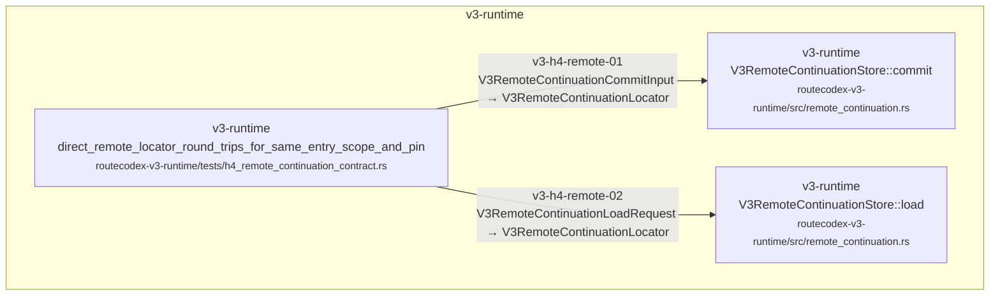
```mermaid
flowchart TD
  subgraph c_18_v3_responses_continuation_remote_contract_store_m_v3_runtime["v3-runtime"]
    c_18_v3_responses_continuation_remote_contract_store_0["v3-runtime<br/>direct_remote_locator_round_trips_for_same_entry_scope_and_pin<br/><small>routecodex-v3-runtime/tests/h4_remote_continuation_contract.rs</small>"]
    c_18_v3_responses_continuation_remote_contract_store_1["v3-runtime<br/>V3RemoteContinuationStore::commit<br/><small>routecodex-v3-runtime/src/remote_continuation.rs</small>"]
    c_18_v3_responses_continuation_remote_contract_store_2["v3-runtime<br/>V3RemoteContinuationStore::load<br/><small>routecodex-v3-runtime/src/remote_continuation.rs</small>"]
  end
  c_18_v3_responses_continuation_remote_contract_store_0 -->|v3-h4-remote-01<br/>V3RemoteContinuationCommitInput → V3RemoteContinuationLocator| c_18_v3_responses_continuation_remote_contract_store_1
  c_18_v3_responses_continuation_remote_contract_store_0 -->|v3-h4-remote-02<br/>V3RemoteContinuationLoadRequest → V3RemoteContinuationLocator| c_18_v3_responses_continuation_remote_contract_store_2
```

| Step | Node edge | Status | Caller | Callee | Owner |
| --- | --- | --- | --- | --- | --- |
| `v3-h4-remote-01` | `V3RemoteContinuationCommitInput` → `V3RemoteContinuationLocator` | anchored | direct_remote_locator_round_trips_for_same_entry_scope_and_pin<br/><small>routecodex-v3-runtime/tests/h4_remote_continuation_contract.rs</small> | V3RemoteContinuationStore::commit<br/><small>routecodex-v3-runtime/src/remote_continuation.rs</small> | `v3.remote_continuation_contract_store` |
| `v3-h4-remote-02` | `V3RemoteContinuationLoadRequest` → `V3RemoteContinuationLocator` | anchored | direct_remote_locator_round_trips_for_same_entry_scope_and_pin<br/><small>routecodex-v3-runtime/tests/h4_remote_continuation_contract.rs</small> | V3RemoteContinuationStore::load<br/><small>routecodex-v3-runtime/src/remote_continuation.rs</small> | `v3.remote_continuation_contract_store` |

## v3.responses_continuation.remote_locator_codec

H4 lossless locator-only codec. Unknown local context/history/tool-state fields fail decoding.

Owner feature: `v3.remote_continuation_contract_store`

```mermaid
flowchart TD
  subgraph c_19_v3_responses_continuation_remote_locator_codec_m_v3_runtime["v3-runtime"]
    c_19_v3_responses_continuation_remote_locator_codec_0["v3-runtime<br/>direct_remote_locator_round_trips_for_same_entry_scope_and_pin<br/><small>routecodex-v3-runtime/tests/h4_remote_continuation_contract.rs</small>"]
    c_19_v3_responses_continuation_remote_locator_codec_1["v3-runtime<br/>encode_v3_remote_continuation_locator<br/><small>routecodex-v3-runtime/src/remote_continuation.rs</small>"]
    c_19_v3_responses_continuation_remote_locator_codec_2["v3-runtime<br/>decode_v3_remote_continuation_locator<br/><small>routecodex-v3-runtime/src/remote_continuation.rs</small>"]
  end
  c_19_v3_responses_continuation_remote_locator_codec_0 -->|v3-h4-codec-01<br/>V3RemoteContinuationLocator → V3RemoteContinuationLocatorEncoded| c_19_v3_responses_continuation_remote_locator_codec_1
  c_19_v3_responses_continuation_remote_locator_codec_0 -->|v3-h4-codec-02<br/>V3RemoteContinuationLocatorEncoded → V3RemoteContinuationLocator| c_19_v3_responses_continuation_remote_locator_codec_2
```

| Step | Node edge | Status | Caller | Callee | Owner |
| --- | --- | --- | --- | --- | --- |
| `v3-h4-codec-01` | `V3RemoteContinuationLocator` → `V3RemoteContinuationLocatorEncoded` | anchored | direct_remote_locator_round_trips_for_same_entry_scope_and_pin<br/><small>routecodex-v3-runtime/tests/h4_remote_continuation_contract.rs</small> | encode_v3_remote_continuation_locator<br/><small>routecodex-v3-runtime/src/remote_continuation.rs</small> | `v3.remote_continuation_contract_store` |
| `v3-h4-codec-02` | `V3RemoteContinuationLocatorEncoded` → `V3RemoteContinuationLocator` | anchored | direct_remote_locator_round_trips_for_same_entry_scope_and_pin<br/><small>routecodex-v3-runtime/tests/h4_remote_continuation_contract.rs</small> | decode_v3_remote_continuation_locator<br/><small>routecodex-v3-runtime/src/remote_continuation.rs</small> | `v3.remote_continuation_contract_store` |

## v3.responses_direct.remote_continuation.integration

Responses Direct remote continuation commits provider-owned identity at Resp04; next Req03 first resolves previous_response_id owner from direct remote vs relay local stores, then direct-owned ids load scope and exact-pin provider/model/auth at Req06. Continuation owner selection is not a Target model capability.

Owner feature: `v3.responses_direct_remote_continuation_integration`

```mermaid
flowchart TD
  subgraph c_20_v3_responses_direct_remote_continuation_integration_m_v3_provider_responses["v3-provider-responses"]
    c_20_v3_responses_direct_remote_continuation_integration_5["v3-provider-responses<br/>build_v3_transport_13_responses_request_from_v3_provider_12<br/><small>routecodex-v3-provider-responses/src/transport.rs</small>"]
  end
  subgraph c_20_v3_responses_direct_remote_continuation_integration_m_v3_runtime["v3-runtime"]
    c_20_v3_responses_direct_remote_continuation_integration_1["v3-runtime<br/>resolve_v3_responses_previous_response_owner_execution_mode_at_req03<br/><small>routecodex-v3-runtime/src/responses_continuation_owner.rs</small>"]
    c_20_v3_responses_direct_remote_continuation_integration_2["v3-runtime<br/>execute_v3_responses_direct_runtime_kernel_core<br/><small>routecodex-v3-runtime/src/kernel.rs</small>"]
    c_20_v3_responses_direct_remote_continuation_integration_4["v3-runtime<br/>responses_direct_provider_transport_hook<br/><small>routecodex-v3-runtime/src/hooks.rs</small>"]
    c_20_v3_responses_direct_remote_continuation_integration_6["v3-runtime<br/>responses_direct_response_projection_hook<br/><small>routecodex-v3-runtime/src/hooks.rs</small>"]
    c_20_v3_responses_direct_remote_continuation_integration_7["v3-runtime<br/>V3RemoteContinuationStore::commit<br/><small>routecodex-v3-runtime/src/remote_continuation.rs</small>"]
    c_20_v3_responses_direct_remote_continuation_integration_8["v3-runtime<br/>V3ResponsesDirectRuntimeOutput<br/><small>routecodex-v3-runtime/src/kernel.rs</small>"]
  end
  subgraph c_20_v3_responses_direct_remote_continuation_integration_m_v3_server["v3-server"]
    c_20_v3_responses_direct_remote_continuation_integration_0["v3-server<br/>pending_endpoint<br/><small>routecodex-v3-server/src/lib.rs</small>"]
  end
  subgraph c_20_v3_responses_direct_remote_continuation_integration_m_v3_target["v3-target"]
    c_20_v3_responses_direct_remote_continuation_integration_3["v3-target<br/>V3TargetInterpreter::resolve_exact_provider_model_auth<br/><small>routecodex-v3-target/src/lib.rs</small>"]
  end
  c_20_v3_responses_direct_remote_continuation_integration_0 -->|v3-rci-01<br/>V3Server03HttpRequestRaw → V3HubReqContinuation03Classified| c_20_v3_responses_direct_remote_continuation_integration_1
  c_20_v3_responses_direct_remote_continuation_integration_2 -->|v3-rci-02<br/>V3HubReqContinuation03Classified → V3HubReqTarget06Resolved| c_20_v3_responses_direct_remote_continuation_integration_3
  c_20_v3_responses_direct_remote_continuation_integration_4 -->|v3-rci-ws-01<br/>V3HubReqTarget06Resolved → V3Transport13ResponsesHttpRequest| c_20_v3_responses_direct_remote_continuation_integration_5
  c_20_v3_responses_direct_remote_continuation_integration_2 -->|v3-rci-03<br/>V3ProviderResp14Raw → V3DirectResp14ProviderProjectionPrepared| c_20_v3_responses_direct_remote_continuation_integration_6
  c_20_v3_responses_direct_remote_continuation_integration_2 -->|v3-rci-04<br/>V3DirectResp14ProviderProjectionPrepared → V3HubRespContinuation04Committed| c_20_v3_responses_direct_remote_continuation_integration_7
  c_20_v3_responses_direct_remote_continuation_integration_2 -->|v3-rci-05<br/>V3HubRespContinuation04Committed → V3DirectResp15ClientPayloadReady| c_20_v3_responses_direct_remote_continuation_integration_8
  c_20_v3_responses_direct_remote_continuation_integration_2 -->|v3-rci-06<br/>V3DirectResp15ClientPayloadReady → V3Resp15ClientPayload| c_20_v3_responses_direct_remote_continuation_integration_8
```

| Step | Node edge | Status | Caller | Callee | Owner |
| --- | --- | --- | --- | --- | --- |
| `v3-rci-01` | `V3Server03HttpRequestRaw` → `V3HubReqContinuation03Classified` | anchored | pending_endpoint<br/><small>routecodex-v3-server/src/lib.rs</small> | resolve_v3_responses_previous_response_owner_execution_mode_at_req03<br/><small>routecodex-v3-runtime/src/responses_continuation_owner.rs</small> | `v3.responses_direct_remote_continuation_integration` |
| `v3-rci-02` | `V3HubReqContinuation03Classified` → `V3HubReqTarget06Resolved` | anchored | execute_v3_responses_direct_runtime_kernel_core<br/><small>routecodex-v3-runtime/src/kernel.rs</small> | V3TargetInterpreter::resolve_exact_provider_model_auth<br/><small>routecodex-v3-target/src/lib.rs</small> | `v3.responses_direct_remote_continuation_integration` |
| `v3-rci-ws-01` | `V3HubReqTarget06Resolved` → `V3Transport13ResponsesHttpRequest` | anchored | responses_direct_provider_transport_hook<br/><small>routecodex-v3-runtime/src/hooks.rs</small> | build_v3_transport_13_responses_request_from_v3_provider_12<br/><small>routecodex-v3-provider-responses/src/transport.rs</small> | `v3.responses_direct_remote_continuation_integration` |
| `v3-rci-03` | `V3ProviderResp14Raw` → `V3DirectResp14ProviderProjectionPrepared` | anchored | execute_v3_responses_direct_runtime_kernel_core<br/><small>routecodex-v3-runtime/src/kernel.rs</small> | responses_direct_response_projection_hook<br/><small>routecodex-v3-runtime/src/hooks.rs</small> | `v3.responses_direct_remote_continuation_integration` |
| `v3-rci-04` | `V3DirectResp14ProviderProjectionPrepared` → `V3HubRespContinuation04Committed` | anchored | execute_v3_responses_direct_runtime_kernel_core<br/><small>routecodex-v3-runtime/src/kernel.rs</small> | V3RemoteContinuationStore::commit<br/><small>routecodex-v3-runtime/src/remote_continuation.rs</small> | `v3.responses_direct_remote_continuation_integration` |
| `v3-rci-05` | `V3HubRespContinuation04Committed` → `V3DirectResp15ClientPayloadReady` | anchored | execute_v3_responses_direct_runtime_kernel_core<br/><small>routecodex-v3-runtime/src/kernel.rs</small> | V3ResponsesDirectRuntimeOutput<br/><small>routecodex-v3-runtime/src/kernel.rs</small> | `v3.responses_direct_remote_continuation_integration` |
| `v3-rci-06` | `V3DirectResp15ClientPayloadReady` → `V3Resp15ClientPayload` | anchored | execute_v3_responses_direct_runtime_kernel_core<br/><small>routecodex-v3-runtime/src/kernel.rs</small> | V3ResponsesDirectRuntimeOutput<br/><small>routecodex-v3-runtime/src/kernel.rs</small> | `v3.responses_direct_remote_continuation_integration` |

## v3.anthropic_relay.controlled_runtime

Controlled Anthropic /v1/messages Relay request through the sole Hub v1 lifecycle, generic Responses transport, Error01-06, and the sole Anthropic client projection exit.

Owner feature: `v3.anthropic_relay_runtime_integration`

```mermaid
flowchart TD
  subgraph c_21_v3_anthropic_relay_controlled_runtime_m_v3_provider_responses["v3-provider-responses"]
    c_21_v3_anthropic_relay_controlled_runtime_13["v3-provider-responses<br/>ResponsesTransport::send<br/><small>routecodex-v3-provider-responses/src/transport.rs</small>"]
  end
  subgraph c_21_v3_anthropic_relay_controlled_runtime_m_v3_runtime__hub_v1["v3-runtime::hub_v1"]
    c_21_v3_anthropic_relay_controlled_runtime_1["v3-runtime::hub_v1<br/>execute_v3_anthropic_relay_runtime_with_default_transport<br/><small>routecodex-v3-runtime/src/hub_v1/anthropic_relay_runtime.rs</small>"]
    c_21_v3_anthropic_relay_controlled_runtime_2["v3-runtime::hub_v1<br/>execute_v3_anthropic_relay_runtime<br/><small>routecodex-v3-runtime/src/hub_v1/anthropic_relay_runtime.rs</small>"]
    c_21_v3_anthropic_relay_controlled_runtime_3["v3-runtime::hub_v1<br/>run_v3_anthropic_relay_runtime_req_inbound<br/><small>routecodex-v3-runtime/src/hub_v1/anthropic_relay_hooks.rs</small>"]
    c_21_v3_anthropic_relay_controlled_runtime_4["v3-runtime::hub_v1<br/>V3HubRelayRequestHooks::run_from_normalized_with_events<br/><small>routecodex-v3-runtime/src/hub_v1/relay_request.rs</small>"]
    c_21_v3_anthropic_relay_controlled_runtime_5["v3-runtime::hub_v1<br/>build_v3_hub_req_continuation_03_from_v3_hub_req_inbound_02<br/><small>routecodex-v3-runtime/src/hub_v1/req_continuation_03_classified.rs</small>"]
    c_21_v3_anthropic_relay_controlled_runtime_6["v3-runtime::hub_v1<br/>build_v3_hub_req_chat_process_04_from_v3_hub_req_continuation_03<br/><small>routecodex-v3-runtime/src/hub_v1/req_chat_process_04_governed.rs</small>"]
    c_21_v3_anthropic_relay_controlled_runtime_7["v3-runtime::hub_v1<br/>build_v3_hub_req_execution_05_from_v3_hub_req_chat_process_04<br/><small>routecodex-v3-runtime/src/hub_v1/req_execution_05_planned.rs</small>"]
    c_21_v3_anthropic_relay_controlled_runtime_8["v3-runtime::hub_v1<br/>build_v3_hub_req_target_06_from_v3_hub_req_execution_05<br/><small>routecodex-v3-runtime/src/hub_v1/req_target_06_resolved.rs</small>"]
    c_21_v3_anthropic_relay_controlled_runtime_9["v3-runtime::hub_v1<br/>build_v3_hub_req_outbound_07_from_v3_hub_req_target_06<br/><small>routecodex-v3-runtime/src/hub_v1/req_outbound_07_provider_semantic.rs</small>"]
    c_21_v3_anthropic_relay_controlled_runtime_10["v3-runtime::hub_v1<br/>build_provider_req_compat_06_from_v3_hub_req_outbound_07<br/><small>routecodex-v3-runtime/src/hub_v1/provider_req_compat_06_provider_compat.rs</small>"]
    c_21_v3_anthropic_relay_controlled_runtime_11["v3-runtime::hub_v1<br/>build_v3_provider_req_outbound_08_from_provider_req_compat_06<br/><small>routecodex-v3-runtime/src/hub_v1/provider_req_outbound_08_wire_payload.rs</small>"]
    c_21_v3_anthropic_relay_controlled_runtime_12["v3-runtime::hub_v1<br/>build_v3_provider_req_outbound_09_from_v3_provider_req_outbound_08<br/><small>routecodex-v3-runtime/src/hub_v1/provider_req_outbound_09_transport_request.rs</small>"]
    c_21_v3_anthropic_relay_controlled_runtime_14["v3-runtime::hub_v1<br/>build_provider_resp_compat_02_from_v3_provider_resp_inbound_01<br/><small>routecodex-v3-runtime/src/hub_v1/provider_resp_compat_02_provider_compat.rs</small>"]
    c_21_v3_anthropic_relay_controlled_runtime_15["v3-runtime::hub_v1<br/>build_v3_hub_resp_inbound_02_from_provider_resp_compat_02<br/><small>routecodex-v3-runtime/src/hub_v1/resp_inbound_02_normalized.rs</small>"]
    c_21_v3_anthropic_relay_controlled_runtime_16["v3-runtime::hub_v1<br/>V3HubRelayResponseHookRegistry::govern<br/><small>routecodex-v3-runtime/src/hub_v1/resp_chat_process_03_governed.rs</small>"]
    c_21_v3_anthropic_relay_controlled_runtime_17["v3-runtime::hub_v1<br/>V3HubRelayResponseHookRegistry::commit<br/><small>routecodex-v3-runtime/src/hub_v1/resp_chat_process_03_governed.rs</small>"]
    c_21_v3_anthropic_relay_controlled_runtime_18["v3-runtime::hub_v1<br/>build_v3_hub_resp_outbound_05_from_v3_hub_resp_continuation_04<br/><small>routecodex-v3-runtime/src/hub_v1/resp_outbound_05_client_semantic.rs</small>"]
    c_21_v3_anthropic_relay_controlled_runtime_19["v3-runtime::hub_v1<br/>build_v3_server_resp_outbound_06_from_v3_hub_resp_outbound_05<br/><small>routecodex-v3-runtime/src/hub_v1/server_resp_outbound_06_client_frame.rs</small>"]
  end
  subgraph c_21_v3_anthropic_relay_controlled_runtime_m_v3_server["v3-server"]
    c_21_v3_anthropic_relay_controlled_runtime_0["v3-server<br/>execute_v3_anthropic_messages_request<br/><small>routecodex-v3-server/src/lib.rs</small>"]
  end
  c_21_v3_anthropic_relay_controlled_runtime_0 -->|v3-anthropic-relay-01<br/>V3ServerValidatedMessagesRequest → V3HubReqInbound01ClientRaw| c_21_v3_anthropic_relay_controlled_runtime_1
  c_21_v3_anthropic_relay_controlled_runtime_2 -->|v3-anthropic-relay-02<br/>V3HubReqInbound01ClientRaw → V3HubReqInbound02Normalized| c_21_v3_anthropic_relay_controlled_runtime_3
  c_21_v3_anthropic_relay_controlled_runtime_4 -->|v3-anthropic-relay-03<br/>V3HubReqInbound02Normalized → V3HubReqContinuation03Classified| c_21_v3_anthropic_relay_controlled_runtime_5
  c_21_v3_anthropic_relay_controlled_runtime_4 -->|v3-anthropic-relay-04<br/>V3HubReqContinuation03Classified → V3HubReqChatProcess04Governed| c_21_v3_anthropic_relay_controlled_runtime_6
  c_21_v3_anthropic_relay_controlled_runtime_2 -->|v3-anthropic-relay-05<br/>V3HubReqChatProcess04Governed → V3HubReqExecution05Planned| c_21_v3_anthropic_relay_controlled_runtime_7
  c_21_v3_anthropic_relay_controlled_runtime_2 -->|v3-anthropic-relay-06<br/>V3HubReqExecution05Planned → V3HubReqTarget06Resolved| c_21_v3_anthropic_relay_controlled_runtime_8
  c_21_v3_anthropic_relay_controlled_runtime_2 -->|v3-anthropic-relay-07<br/>V3HubReqTarget06Resolved → V3HubReqOutbound07ProviderSemantic| c_21_v3_anthropic_relay_controlled_runtime_9
  c_21_v3_anthropic_relay_controlled_runtime_2 -->|v3-anthropic-relay-08<br/>V3HubReqOutbound07ProviderSemantic → ProviderReqCompat06ProviderCompat| c_21_v3_anthropic_relay_controlled_runtime_10
  c_21_v3_anthropic_relay_controlled_runtime_2 -->|v3-anthropic-relay-09<br/>ProviderReqCompat06ProviderCompat → V3ProviderReqOutbound08WirePayload| c_21_v3_anthropic_relay_controlled_runtime_11
  c_21_v3_anthropic_relay_controlled_runtime_2 -->|v3-anthropic-relay-10<br/>V3ProviderReqOutbound08WirePayload → V3ProviderReqOutbound09TransportRequest| c_21_v3_anthropic_relay_controlled_runtime_12
  c_21_v3_anthropic_relay_controlled_runtime_2 -->|v3-anthropic-relay-11<br/>V3ProviderReqOutbound09TransportRequest → V3ProviderRespInbound01Raw| c_21_v3_anthropic_relay_controlled_runtime_13
  c_21_v3_anthropic_relay_controlled_runtime_2 -->|v3-anthropic-relay-12<br/>V3ProviderRespInbound01Raw → ProviderRespCompat02ProviderCompat| c_21_v3_anthropic_relay_controlled_runtime_14
  c_21_v3_anthropic_relay_controlled_runtime_2 -->|v3-anthropic-relay-13<br/>ProviderRespCompat02ProviderCompat → V3HubRespInbound02Normalized| c_21_v3_anthropic_relay_controlled_runtime_15
  c_21_v3_anthropic_relay_controlled_runtime_2 -->|v3-anthropic-relay-14<br/>V3HubRespInbound02Normalized → V3HubRespChatProcess03Governed| c_21_v3_anthropic_relay_controlled_runtime_16
  c_21_v3_anthropic_relay_controlled_runtime_2 -->|v3-anthropic-relay-15<br/>V3HubRespChatProcess03Governed → V3HubRespContinuation04Committed| c_21_v3_anthropic_relay_controlled_runtime_17
  c_21_v3_anthropic_relay_controlled_runtime_2 -->|v3-anthropic-relay-16<br/>V3HubRespContinuation04Committed → V3HubRespOutbound05ClientSemantic| c_21_v3_anthropic_relay_controlled_runtime_18
  c_21_v3_anthropic_relay_controlled_runtime_2 -->|v3-anthropic-relay-17<br/>V3HubRespOutbound05ClientSemantic → V3ServerRespOutbound06ClientFrame| c_21_v3_anthropic_relay_controlled_runtime_19
```

| Step | Node edge | Status | Caller | Callee | Owner |
| --- | --- | --- | --- | --- | --- |
| `v3-anthropic-relay-01` | `V3ServerValidatedMessagesRequest` → `V3HubReqInbound01ClientRaw` | anchored | execute_v3_anthropic_messages_request<br/><small>routecodex-v3-server/src/lib.rs</small> | execute_v3_anthropic_relay_runtime_with_default_transport<br/><small>routecodex-v3-runtime/src/hub_v1/anthropic_relay_runtime.rs</small> | `v3.anthropic_relay_runtime_integration` |
| `v3-anthropic-relay-02` | `V3HubReqInbound01ClientRaw` → `V3HubReqInbound02Normalized` | anchored | execute_v3_anthropic_relay_runtime<br/><small>routecodex-v3-runtime/src/hub_v1/anthropic_relay_runtime.rs</small> | run_v3_anthropic_relay_runtime_req_inbound<br/><small>routecodex-v3-runtime/src/hub_v1/anthropic_relay_hooks.rs</small> | `v3.anthropic_relay_runtime_integration` |
| `v3-anthropic-relay-03` | `V3HubReqInbound02Normalized` → `V3HubReqContinuation03Classified` | anchored | V3HubRelayRequestHooks::run_from_normalized_with_events<br/><small>routecodex-v3-runtime/src/hub_v1/relay_request.rs</small> | build_v3_hub_req_continuation_03_from_v3_hub_req_inbound_02<br/><small>routecodex-v3-runtime/src/hub_v1/req_continuation_03_classified.rs</small> | `v3.anthropic_relay_runtime_integration` |
| `v3-anthropic-relay-04` | `V3HubReqContinuation03Classified` → `V3HubReqChatProcess04Governed` | anchored | V3HubRelayRequestHooks::run_from_normalized_with_events<br/><small>routecodex-v3-runtime/src/hub_v1/relay_request.rs</small> | build_v3_hub_req_chat_process_04_from_v3_hub_req_continuation_03<br/><small>routecodex-v3-runtime/src/hub_v1/req_chat_process_04_governed.rs</small> | `v3.anthropic_relay_runtime_integration` |
| `v3-anthropic-relay-05` | `V3HubReqChatProcess04Governed` → `V3HubReqExecution05Planned` | anchored | execute_v3_anthropic_relay_runtime<br/><small>routecodex-v3-runtime/src/hub_v1/anthropic_relay_runtime.rs</small> | build_v3_hub_req_execution_05_from_v3_hub_req_chat_process_04<br/><small>routecodex-v3-runtime/src/hub_v1/req_execution_05_planned.rs</small> | `v3.anthropic_relay_runtime_integration` |
| `v3-anthropic-relay-06` | `V3HubReqExecution05Planned` → `V3HubReqTarget06Resolved` | anchored | execute_v3_anthropic_relay_runtime<br/><small>routecodex-v3-runtime/src/hub_v1/anthropic_relay_runtime.rs</small> | build_v3_hub_req_target_06_from_v3_hub_req_execution_05<br/><small>routecodex-v3-runtime/src/hub_v1/req_target_06_resolved.rs</small> | `v3.anthropic_relay_runtime_integration` |
| `v3-anthropic-relay-07` | `V3HubReqTarget06Resolved` → `V3HubReqOutbound07ProviderSemantic` | anchored | execute_v3_anthropic_relay_runtime<br/><small>routecodex-v3-runtime/src/hub_v1/anthropic_relay_runtime.rs</small> | build_v3_hub_req_outbound_07_from_v3_hub_req_target_06<br/><small>routecodex-v3-runtime/src/hub_v1/req_outbound_07_provider_semantic.rs</small> | `v3.anthropic_relay_runtime_integration` |
| `v3-anthropic-relay-08` | `V3HubReqOutbound07ProviderSemantic` → `ProviderReqCompat06ProviderCompat` | anchored | execute_v3_anthropic_relay_runtime<br/><small>routecodex-v3-runtime/src/hub_v1/anthropic_relay_runtime.rs</small> | build_provider_req_compat_06_from_v3_hub_req_outbound_07<br/><small>routecodex-v3-runtime/src/hub_v1/provider_req_compat_06_provider_compat.rs</small> | `v3.anthropic_relay_runtime_integration` |
| `v3-anthropic-relay-09` | `ProviderReqCompat06ProviderCompat` → `V3ProviderReqOutbound08WirePayload` | anchored | execute_v3_anthropic_relay_runtime<br/><small>routecodex-v3-runtime/src/hub_v1/anthropic_relay_runtime.rs</small> | build_v3_provider_req_outbound_08_from_provider_req_compat_06<br/><small>routecodex-v3-runtime/src/hub_v1/provider_req_outbound_08_wire_payload.rs</small> | `v3.anthropic_relay_runtime_integration` |
| `v3-anthropic-relay-10` | `V3ProviderReqOutbound08WirePayload` → `V3ProviderReqOutbound09TransportRequest` | anchored | execute_v3_anthropic_relay_runtime<br/><small>routecodex-v3-runtime/src/hub_v1/anthropic_relay_runtime.rs</small> | build_v3_provider_req_outbound_09_from_v3_provider_req_outbound_08<br/><small>routecodex-v3-runtime/src/hub_v1/provider_req_outbound_09_transport_request.rs</small> | `v3.anthropic_relay_runtime_integration` |
| `v3-anthropic-relay-11` | `V3ProviderReqOutbound09TransportRequest` → `V3ProviderRespInbound01Raw` | anchored | execute_v3_anthropic_relay_runtime<br/><small>routecodex-v3-runtime/src/hub_v1/anthropic_relay_runtime.rs</small> | ResponsesTransport::send<br/><small>routecodex-v3-provider-responses/src/transport.rs</small> | `v3.anthropic_relay_runtime_integration` |
| `v3-anthropic-relay-12` | `V3ProviderRespInbound01Raw` → `ProviderRespCompat02ProviderCompat` | anchored | execute_v3_anthropic_relay_runtime<br/><small>routecodex-v3-runtime/src/hub_v1/anthropic_relay_runtime.rs</small> | build_provider_resp_compat_02_from_v3_provider_resp_inbound_01<br/><small>routecodex-v3-runtime/src/hub_v1/provider_resp_compat_02_provider_compat.rs</small> | `v3.anthropic_relay_runtime_integration` |
| `v3-anthropic-relay-13` | `ProviderRespCompat02ProviderCompat` → `V3HubRespInbound02Normalized` | anchored | execute_v3_anthropic_relay_runtime<br/><small>routecodex-v3-runtime/src/hub_v1/anthropic_relay_runtime.rs</small> | build_v3_hub_resp_inbound_02_from_provider_resp_compat_02<br/><small>routecodex-v3-runtime/src/hub_v1/resp_inbound_02_normalized.rs</small> | `v3.anthropic_relay_runtime_integration` |
| `v3-anthropic-relay-14` | `V3HubRespInbound02Normalized` → `V3HubRespChatProcess03Governed` | anchored | execute_v3_anthropic_relay_runtime<br/><small>routecodex-v3-runtime/src/hub_v1/anthropic_relay_runtime.rs</small> | V3HubRelayResponseHookRegistry::govern<br/><small>routecodex-v3-runtime/src/hub_v1/resp_chat_process_03_governed.rs</small> | `v3.anthropic_relay_runtime_integration` |
| `v3-anthropic-relay-15` | `V3HubRespChatProcess03Governed` → `V3HubRespContinuation04Committed` | anchored | execute_v3_anthropic_relay_runtime<br/><small>routecodex-v3-runtime/src/hub_v1/anthropic_relay_runtime.rs</small> | V3HubRelayResponseHookRegistry::commit<br/><small>routecodex-v3-runtime/src/hub_v1/resp_chat_process_03_governed.rs</small> | `v3.anthropic_relay_runtime_integration` |
| `v3-anthropic-relay-16` | `V3HubRespContinuation04Committed` → `V3HubRespOutbound05ClientSemantic` | anchored | execute_v3_anthropic_relay_runtime<br/><small>routecodex-v3-runtime/src/hub_v1/anthropic_relay_runtime.rs</small> | build_v3_hub_resp_outbound_05_from_v3_hub_resp_continuation_04<br/><small>routecodex-v3-runtime/src/hub_v1/resp_outbound_05_client_semantic.rs</small> | `v3.anthropic_relay_runtime_integration` |
| `v3-anthropic-relay-17` | `V3HubRespOutbound05ClientSemantic` → `V3ServerRespOutbound06ClientFrame` | anchored | execute_v3_anthropic_relay_runtime<br/><small>routecodex-v3-runtime/src/hub_v1/anthropic_relay_runtime.rs</small> | build_v3_server_resp_outbound_06_from_v3_hub_resp_outbound_05<br/><small>routecodex-v3-runtime/src/hub_v1/server_resp_outbound_06_client_frame.rs</small> | `v3.anthropic_relay_runtime_integration` |

## v3.responses.websocket_v2.transport_hardening

Provider-owned Responses WebSocket mode request/session lifecycle; RouteCodex internal transport name is websocket_v2, handshake sends OpenAI-Beta responses_websockets=2026-02-06, same-stream WebSocket event aggregation is limited to producing V3ProviderResp14Raw, and only terminal drain permits exact-session reuse while early drop, error, disconnect, and protocol failure discard the connection.

Owner feature: `v3.responses_websocket_v2_transport_hardening`

```mermaid
flowchart TD
  subgraph c_22_v3_responses_websocket_v2_transport_hardening_m_v3_provider_responses["v3-provider-responses"]
    c_22_v3_responses_websocket_v2_transport_hardening_0["v3-provider-responses<br/>ResponsesTransport::send<br/><small>routecodex-v3-provider-responses/src/transport.rs</small>"]
    c_22_v3_responses_websocket_v2_transport_hardening_1["v3-provider-responses<br/>ProviderResponsesTransport::send_websocket_v2<br/><small>routecodex-v3-provider-responses/src/transport.rs</small>"]
    c_22_v3_responses_websocket_v2_transport_hardening_2["v3-provider-responses<br/>websocket_sse_stream<br/><small>routecodex-v3-provider-responses/src/transport.rs</small>"]
  end
  c_22_v3_responses_websocket_v2_transport_hardening_0 -->|v3-ws2-01<br/>V3Transport13ResponsesRequest → V3ProviderResponsesWebSocketSession| c_22_v3_responses_websocket_v2_transport_hardening_1
  c_22_v3_responses_websocket_v2_transport_hardening_1 -->|v3-ws2-02<br/>V3ProviderResponsesWebSocketSession → V3ProviderResp14Raw| c_22_v3_responses_websocket_v2_transport_hardening_2
```

| Step | Node edge | Status | Caller | Callee | Owner |
| --- | --- | --- | --- | --- | --- |
| `v3-ws2-01` | `V3Transport13ResponsesRequest` → `V3ProviderResponsesWebSocketSession` | anchored | ResponsesTransport::send<br/><small>routecodex-v3-provider-responses/src/transport.rs</small> | ProviderResponsesTransport::send_websocket_v2<br/><small>routecodex-v3-provider-responses/src/transport.rs</small> | `v3.responses_websocket_v2_transport_hardening` |
| `v3-ws2-02` | `V3ProviderResponsesWebSocketSession` → `V3ProviderResp14Raw` | anchored | ProviderResponsesTransport::send_websocket_v2<br/><small>routecodex-v3-provider-responses/src/transport.rs</small> | websocket_sse_stream<br/><small>routecodex-v3-provider-responses/src/transport.rs</small> | `v3.responses_websocket_v2_transport_hardening` |

## v3.anthropic_relay.local_continuation

Resp04 local canonical save through the immutable interval to next Req04 exact-scope restore and governance.

Owner feature: `v3.anthropic_relay_local_continuation_integration`

```mermaid
flowchart TD
  subgraph c_23_v3_anthropic_relay_local_continuation_m_v3_runtime__hub_v1["v3-runtime::hub_v1"]
    c_23_v3_anthropic_relay_local_continuation_0["v3-runtime::hub_v1<br/>execute_v3_anthropic_relay_runtime_inner<br/><small>routecodex-v3-runtime/src/hub_v1/anthropic_relay_runtime.rs</small>"]
    c_23_v3_anthropic_relay_local_continuation_1["v3-runtime::hub_v1<br/>commit_or_release_local_continuation<br/><small>routecodex-v3-runtime/src/hub_v1/anthropic_relay_runtime.rs</small>"]
    c_23_v3_anthropic_relay_local_continuation_2["v3-runtime::hub_v1<br/>V3HubContinuationLookup::with_local_context_from_req04_store<br/><small>routecodex-v3-runtime/src/hub_v1/relay_request.rs</small>"]
    c_23_v3_anthropic_relay_local_continuation_3["v3-runtime::hub_v1<br/>V3HubRelayRequestHooks::run_from_normalized<br/><small>routecodex-v3-runtime/src/hub_v1/relay_request.rs</small>"]
    c_23_v3_anthropic_relay_local_continuation_4["v3-runtime::hub_v1<br/>merge_v3_relay_restored_local_context_at_req04<br/><small>routecodex-v3-runtime/src/hub_v1/req_chat_process_04_governed.rs</small>"]
  end
  c_23_v3_anthropic_relay_local_continuation_0 -->|v3-localcont-01<br/>V3LocalContResp01ChatProcessGoverned → V3LocalContResp02ImmutableSaved| c_23_v3_anthropic_relay_local_continuation_1
  c_23_v3_anthropic_relay_local_continuation_0 -->|v3-localcont-02<br/>V3LocalContResp02ImmutableSaved → V3LocalContReq03ExactScopeLoaded| c_23_v3_anthropic_relay_local_continuation_2
  c_23_v3_anthropic_relay_local_continuation_3 -->|v3-localcont-03<br/>V3LocalContReq03ExactScopeLoaded → V3LocalContReq04RestoredGoverned| c_23_v3_anthropic_relay_local_continuation_4
```

| Step | Node edge | Status | Caller | Callee | Owner |
| --- | --- | --- | --- | --- | --- |
| `v3-localcont-01` | `V3LocalContResp01ChatProcessGoverned` → `V3LocalContResp02ImmutableSaved` | anchored | execute_v3_anthropic_relay_runtime_inner<br/><small>routecodex-v3-runtime/src/hub_v1/anthropic_relay_runtime.rs</small> | commit_or_release_local_continuation<br/><small>routecodex-v3-runtime/src/hub_v1/anthropic_relay_runtime.rs</small> | `v3.anthropic_relay_local_continuation_integration` |
| `v3-localcont-02` | `V3LocalContResp02ImmutableSaved` → `V3LocalContReq03ExactScopeLoaded` | anchored | execute_v3_anthropic_relay_runtime_inner<br/><small>routecodex-v3-runtime/src/hub_v1/anthropic_relay_runtime.rs</small> | V3HubContinuationLookup::with_local_context_from_req04_store<br/><small>routecodex-v3-runtime/src/hub_v1/relay_request.rs</small> | `v3.anthropic_relay_local_continuation_integration` |
| `v3-localcont-03` | `V3LocalContReq03ExactScopeLoaded` → `V3LocalContReq04RestoredGoverned` | anchored | V3HubRelayRequestHooks::run_from_normalized<br/><small>routecodex-v3-runtime/src/hub_v1/relay_request.rs</small> | merge_v3_relay_restored_local_context_at_req04<br/><small>routecodex-v3-runtime/src/hub_v1/req_chat_process_04_governed.rs</small> | `v3.anthropic_relay_local_continuation_integration` |

## v3.openai_chat_relay.controlled_runtime

Controlled /v1/chat/completions Relay through the sole Hub v1 request/response lifecycle; SSE is incrementally projected by Runtime and transported by Server without materialization.

Owner feature: `v3.openai_chat_relay_runtime_integration`
Manifest: `docs/architecture/manifests/v3.openai_chat_relay.controlled_runtime.mainline.yml`

```mermaid
flowchart TD
  subgraph c_24_v3_openai_chat_relay_controlled_runtime_m_v3_provider_responses["v3-provider-responses"]
    c_24_v3_openai_chat_relay_controlled_runtime_13["v3-provider-responses<br/>ResponsesTransport::send<br/><small>routecodex-v3-provider-responses/src/transport.rs</small>"]
  end
  subgraph c_24_v3_openai_chat_relay_controlled_runtime_m_v3_runtime__hub_v1["v3-runtime::hub_v1"]
    c_24_v3_openai_chat_relay_controlled_runtime_1["v3-runtime::hub_v1<br/>execute_v3_openai_chat_relay_runtime_with_default_transport<br/><small>routecodex-v3-runtime/src/hub_v1/openai_chat_relay_runtime.rs</small>"]
    c_24_v3_openai_chat_relay_controlled_runtime_2["v3-runtime::hub_v1<br/>execute_v3_openai_chat_relay_runtime<br/><small>routecodex-v3-runtime/src/hub_v1/openai_chat_relay_runtime.rs</small>"]
    c_24_v3_openai_chat_relay_controlled_runtime_3["v3-runtime::hub_v1<br/>build_v3_hub_req_inbound_02_from_v3_hub_req_inbound_01<br/><small>routecodex-v3-runtime/src/hub_v1/req_inbound_02_normalized.rs</small>"]
    c_24_v3_openai_chat_relay_controlled_runtime_4["v3-runtime::hub_v1<br/>V3HubRelayRequestHooks::run_from_normalized<br/><small>routecodex-v3-runtime/src/hub_v1/relay_request.rs</small>"]
    c_24_v3_openai_chat_relay_controlled_runtime_5["v3-runtime::hub_v1<br/>build_v3_hub_req_continuation_03_from_v3_hub_req_inbound_02<br/><small>routecodex-v3-runtime/src/hub_v1/req_continuation_03_classified.rs</small>"]
    c_24_v3_openai_chat_relay_controlled_runtime_6["v3-runtime::hub_v1<br/>build_v3_hub_req_chat_process_04_from_v3_hub_req_continuation_03<br/><small>routecodex-v3-runtime/src/hub_v1/req_chat_process_04_governed.rs</small>"]
    c_24_v3_openai_chat_relay_controlled_runtime_7["v3-runtime::hub_v1<br/>build_v3_hub_req_execution_05_from_v3_hub_req_chat_process_04<br/><small>routecodex-v3-runtime/src/hub_v1/req_execution_05_planned.rs</small>"]
    c_24_v3_openai_chat_relay_controlled_runtime_8["v3-runtime::hub_v1<br/>build_v3_hub_req_target_06_from_v3_hub_req_execution_05<br/><small>routecodex-v3-runtime/src/hub_v1/req_target_06_resolved.rs</small>"]
    c_24_v3_openai_chat_relay_controlled_runtime_9["v3-runtime::hub_v1<br/>build_v3_hub_req_outbound_07_from_v3_hub_req_target_06<br/><small>routecodex-v3-runtime/src/hub_v1/req_outbound_07_provider_semantic.rs</small>"]
    c_24_v3_openai_chat_relay_controlled_runtime_10["v3-runtime::hub_v1<br/>build_provider_req_compat_06_from_v3_hub_req_outbound_07<br/><small>routecodex-v3-runtime/src/hub_v1/provider_req_compat_06_provider_compat.rs</small>"]
    c_24_v3_openai_chat_relay_controlled_runtime_11["v3-runtime::hub_v1<br/>build_v3_provider_req_outbound_08_from_provider_req_compat_06<br/><small>routecodex-v3-runtime/src/hub_v1/provider_req_outbound_08_wire_payload.rs</small>"]
    c_24_v3_openai_chat_relay_controlled_runtime_12["v3-runtime::hub_v1<br/>build_v3_provider_req_outbound_09_from_v3_provider_req_outbound_08<br/><small>routecodex-v3-runtime/src/hub_v1/provider_req_outbound_09_transport_request.rs</small>"]
    c_24_v3_openai_chat_relay_controlled_runtime_14["v3-runtime::hub_v1<br/>project_json_response<br/><small>routecodex-v3-runtime/src/hub_v1/openai_chat_relay_runtime.rs</small>"]
    c_24_v3_openai_chat_relay_controlled_runtime_15["v3-runtime::hub_v1<br/>build_provider_resp_compat_02_from_v3_provider_resp_inbound_01<br/><small>routecodex-v3-runtime/src/hub_v1/provider_resp_compat_02_provider_compat.rs</small>"]
    c_24_v3_openai_chat_relay_controlled_runtime_16["v3-runtime::hub_v1<br/>build_v3_hub_resp_inbound_02_from_provider_resp_compat_02<br/><small>routecodex-v3-runtime/src/hub_v1/resp_inbound_02_normalized.rs</small>"]
    c_24_v3_openai_chat_relay_controlled_runtime_17["v3-runtime::hub_v1<br/>V3HubRelayResponseHookRegistry::govern<br/><small>routecodex-v3-runtime/src/hub_v1/resp_chat_process_03_governed.rs</small>"]
    c_24_v3_openai_chat_relay_controlled_runtime_18["v3-runtime::hub_v1<br/>V3HubRelayResponseHookRegistry::commit<br/><small>routecodex-v3-runtime/src/hub_v1/resp_chat_process_03_governed.rs</small>"]
    c_24_v3_openai_chat_relay_controlled_runtime_19["v3-runtime::hub_v1<br/>build_v3_hub_resp_outbound_05_from_v3_hub_resp_continuation_04<br/><small>routecodex-v3-runtime/src/hub_v1/resp_outbound_05_client_semantic.rs</small>"]
  end
  subgraph c_24_v3_openai_chat_relay_controlled_runtime_m_v3_server["v3-server"]
    c_24_v3_openai_chat_relay_controlled_runtime_0["v3-server<br/>execute_v3_openai_chat_completions_request<br/><small>routecodex-v3-server/src/lib.rs</small>"]
    c_24_v3_openai_chat_relay_controlled_runtime_20["v3-server<br/>openai_chat_relay_output_response<br/><small>routecodex-v3-server/src/lib.rs</small>"]
    c_24_v3_openai_chat_relay_controlled_runtime_21["v3-server<br/>Body::from_stream<br/><small>routecodex-v3-server/src/lib.rs</small>"]
  end
  c_24_v3_openai_chat_relay_controlled_runtime_0 -->|v3-openai-chat-relay-01<br/>V3OpenAiChatRelayRuntimeInput → V3HubReqInbound01ClientRaw| c_24_v3_openai_chat_relay_controlled_runtime_1
  c_24_v3_openai_chat_relay_controlled_runtime_2 -->|v3-openai-chat-relay-02<br/>V3HubReqInbound01ClientRaw → V3HubReqInbound02Normalized| c_24_v3_openai_chat_relay_controlled_runtime_3
  c_24_v3_openai_chat_relay_controlled_runtime_4 -->|v3-openai-chat-relay-03<br/>V3HubReqInbound02Normalized → V3HubReqContinuation03Classified| c_24_v3_openai_chat_relay_controlled_runtime_5
  c_24_v3_openai_chat_relay_controlled_runtime_4 -->|v3-openai-chat-relay-04<br/>V3HubReqContinuation03Classified → V3HubReqChatProcess04Governed| c_24_v3_openai_chat_relay_controlled_runtime_6
  c_24_v3_openai_chat_relay_controlled_runtime_2 -->|v3-openai-chat-relay-05<br/>V3HubReqChatProcess04Governed → V3HubReqExecution05Planned| c_24_v3_openai_chat_relay_controlled_runtime_7
  c_24_v3_openai_chat_relay_controlled_runtime_2 -->|v3-openai-chat-relay-06<br/>V3HubReqExecution05Planned → V3HubReqTarget06Resolved| c_24_v3_openai_chat_relay_controlled_runtime_8
  c_24_v3_openai_chat_relay_controlled_runtime_2 -->|v3-openai-chat-relay-07<br/>V3HubReqTarget06Resolved → V3HubReqOutbound07ProviderSemantic| c_24_v3_openai_chat_relay_controlled_runtime_9
  c_24_v3_openai_chat_relay_controlled_runtime_2 -->|v3-openai-chat-relay-08<br/>V3HubReqOutbound07ProviderSemantic → ProviderReqCompat06ProviderCompat| c_24_v3_openai_chat_relay_controlled_runtime_10
  c_24_v3_openai_chat_relay_controlled_runtime_2 -->|v3-openai-chat-relay-09<br/>ProviderReqCompat06ProviderCompat → V3ProviderReqOutbound08WirePayload| c_24_v3_openai_chat_relay_controlled_runtime_11
  c_24_v3_openai_chat_relay_controlled_runtime_2 -->|v3-openai-chat-relay-10<br/>V3ProviderReqOutbound08WirePayload → V3ProviderReqOutbound09TransportRequest| c_24_v3_openai_chat_relay_controlled_runtime_12
  c_24_v3_openai_chat_relay_controlled_runtime_2 -->|v3-openai-chat-relay-11<br/>V3ProviderReqOutbound09TransportRequest → V3ProviderRespInbound01Raw| c_24_v3_openai_chat_relay_controlled_runtime_13
  c_24_v3_openai_chat_relay_controlled_runtime_14 -->|v3-openai-chat-relay-12<br/>V3ProviderRespInbound01Raw → ProviderRespCompat02ProviderCompat| c_24_v3_openai_chat_relay_controlled_runtime_15
  c_24_v3_openai_chat_relay_controlled_runtime_14 -->|v3-openai-chat-relay-13<br/>ProviderRespCompat02ProviderCompat → V3HubRespInbound02Normalized| c_24_v3_openai_chat_relay_controlled_runtime_16
  c_24_v3_openai_chat_relay_controlled_runtime_14 -->|v3-openai-chat-relay-14<br/>V3HubRespInbound02Normalized → V3HubRespChatProcess03Governed| c_24_v3_openai_chat_relay_controlled_runtime_17
  c_24_v3_openai_chat_relay_controlled_runtime_14 -->|v3-openai-chat-relay-15<br/>V3HubRespChatProcess03Governed → V3HubRespContinuation04Committed| c_24_v3_openai_chat_relay_controlled_runtime_18
  c_24_v3_openai_chat_relay_controlled_runtime_14 -->|v3-openai-chat-relay-16<br/>V3HubRespContinuation04Committed → V3HubRespOutbound05ClientSemantic| c_24_v3_openai_chat_relay_controlled_runtime_19
  c_24_v3_openai_chat_relay_controlled_runtime_20 -->|v3-openai-chat-relay-17<br/>V3HubRespOutbound05ClientSemantic → V3ServerRespOutbound06ClientFrame| c_24_v3_openai_chat_relay_controlled_runtime_21
```

| Step | Node edge | Status | Caller | Callee | Owner |
| --- | --- | --- | --- | --- | --- |
| `v3-openai-chat-relay-01` | `V3OpenAiChatRelayRuntimeInput` → `V3HubReqInbound01ClientRaw` | anchored | execute_v3_openai_chat_completions_request<br/><small>routecodex-v3-server/src/lib.rs</small> | execute_v3_openai_chat_relay_runtime_with_default_transport<br/><small>routecodex-v3-runtime/src/hub_v1/openai_chat_relay_runtime.rs</small> | `v3.openai_chat_relay_runtime_integration` |
| `v3-openai-chat-relay-02` | `V3HubReqInbound01ClientRaw` → `V3HubReqInbound02Normalized` | anchored | execute_v3_openai_chat_relay_runtime<br/><small>routecodex-v3-runtime/src/hub_v1/openai_chat_relay_runtime.rs</small> | build_v3_hub_req_inbound_02_from_v3_hub_req_inbound_01<br/><small>routecodex-v3-runtime/src/hub_v1/req_inbound_02_normalized.rs</small> | `v3.openai_chat_relay_runtime_integration` |
| `v3-openai-chat-relay-03` | `V3HubReqInbound02Normalized` → `V3HubReqContinuation03Classified` | anchored | V3HubRelayRequestHooks::run_from_normalized<br/><small>routecodex-v3-runtime/src/hub_v1/relay_request.rs</small> | build_v3_hub_req_continuation_03_from_v3_hub_req_inbound_02<br/><small>routecodex-v3-runtime/src/hub_v1/req_continuation_03_classified.rs</small> | `v3.openai_chat_relay_runtime_integration` |
| `v3-openai-chat-relay-04` | `V3HubReqContinuation03Classified` → `V3HubReqChatProcess04Governed` | anchored | V3HubRelayRequestHooks::run_from_normalized<br/><small>routecodex-v3-runtime/src/hub_v1/relay_request.rs</small> | build_v3_hub_req_chat_process_04_from_v3_hub_req_continuation_03<br/><small>routecodex-v3-runtime/src/hub_v1/req_chat_process_04_governed.rs</small> | `v3.openai_chat_relay_runtime_integration` |
| `v3-openai-chat-relay-05` | `V3HubReqChatProcess04Governed` → `V3HubReqExecution05Planned` | anchored | execute_v3_openai_chat_relay_runtime<br/><small>routecodex-v3-runtime/src/hub_v1/openai_chat_relay_runtime.rs</small> | build_v3_hub_req_execution_05_from_v3_hub_req_chat_process_04<br/><small>routecodex-v3-runtime/src/hub_v1/req_execution_05_planned.rs</small> | `v3.openai_chat_relay_runtime_integration` |
| `v3-openai-chat-relay-06` | `V3HubReqExecution05Planned` → `V3HubReqTarget06Resolved` | anchored | execute_v3_openai_chat_relay_runtime<br/><small>routecodex-v3-runtime/src/hub_v1/openai_chat_relay_runtime.rs</small> | build_v3_hub_req_target_06_from_v3_hub_req_execution_05<br/><small>routecodex-v3-runtime/src/hub_v1/req_target_06_resolved.rs</small> | `v3.openai_chat_relay_runtime_integration` |
| `v3-openai-chat-relay-07` | `V3HubReqTarget06Resolved` → `V3HubReqOutbound07ProviderSemantic` | anchored | execute_v3_openai_chat_relay_runtime<br/><small>routecodex-v3-runtime/src/hub_v1/openai_chat_relay_runtime.rs</small> | build_v3_hub_req_outbound_07_from_v3_hub_req_target_06<br/><small>routecodex-v3-runtime/src/hub_v1/req_outbound_07_provider_semantic.rs</small> | `v3.openai_chat_relay_runtime_integration` |
| `v3-openai-chat-relay-08` | `V3HubReqOutbound07ProviderSemantic` → `ProviderReqCompat06ProviderCompat` | anchored | execute_v3_openai_chat_relay_runtime<br/><small>routecodex-v3-runtime/src/hub_v1/openai_chat_relay_runtime.rs</small> | build_provider_req_compat_06_from_v3_hub_req_outbound_07<br/><small>routecodex-v3-runtime/src/hub_v1/provider_req_compat_06_provider_compat.rs</small> | `v3.openai_chat_relay_runtime_integration` |
| `v3-openai-chat-relay-09` | `ProviderReqCompat06ProviderCompat` → `V3ProviderReqOutbound08WirePayload` | anchored | execute_v3_openai_chat_relay_runtime<br/><small>routecodex-v3-runtime/src/hub_v1/openai_chat_relay_runtime.rs</small> | build_v3_provider_req_outbound_08_from_provider_req_compat_06<br/><small>routecodex-v3-runtime/src/hub_v1/provider_req_outbound_08_wire_payload.rs</small> | `v3.openai_chat_relay_runtime_integration` |
| `v3-openai-chat-relay-10` | `V3ProviderReqOutbound08WirePayload` → `V3ProviderReqOutbound09TransportRequest` | anchored | execute_v3_openai_chat_relay_runtime<br/><small>routecodex-v3-runtime/src/hub_v1/openai_chat_relay_runtime.rs</small> | build_v3_provider_req_outbound_09_from_v3_provider_req_outbound_08<br/><small>routecodex-v3-runtime/src/hub_v1/provider_req_outbound_09_transport_request.rs</small> | `v3.openai_chat_relay_runtime_integration` |
| `v3-openai-chat-relay-11` | `V3ProviderReqOutbound09TransportRequest` → `V3ProviderRespInbound01Raw` | anchored | execute_v3_openai_chat_relay_runtime<br/><small>routecodex-v3-runtime/src/hub_v1/openai_chat_relay_runtime.rs</small> | ResponsesTransport::send<br/><small>routecodex-v3-provider-responses/src/transport.rs</small> | `v3.openai_chat_relay_runtime_integration` |
| `v3-openai-chat-relay-12` | `V3ProviderRespInbound01Raw` → `ProviderRespCompat02ProviderCompat` | anchored | project_json_response<br/><small>routecodex-v3-runtime/src/hub_v1/openai_chat_relay_runtime.rs</small> | build_provider_resp_compat_02_from_v3_provider_resp_inbound_01<br/><small>routecodex-v3-runtime/src/hub_v1/provider_resp_compat_02_provider_compat.rs</small> | `v3.openai_chat_relay_runtime_integration` |
| `v3-openai-chat-relay-13` | `ProviderRespCompat02ProviderCompat` → `V3HubRespInbound02Normalized` | anchored | project_json_response<br/><small>routecodex-v3-runtime/src/hub_v1/openai_chat_relay_runtime.rs</small> | build_v3_hub_resp_inbound_02_from_provider_resp_compat_02<br/><small>routecodex-v3-runtime/src/hub_v1/resp_inbound_02_normalized.rs</small> | `v3.openai_chat_relay_runtime_integration` |
| `v3-openai-chat-relay-14` | `V3HubRespInbound02Normalized` → `V3HubRespChatProcess03Governed` | anchored | project_json_response<br/><small>routecodex-v3-runtime/src/hub_v1/openai_chat_relay_runtime.rs</small> | V3HubRelayResponseHookRegistry::govern<br/><small>routecodex-v3-runtime/src/hub_v1/resp_chat_process_03_governed.rs</small> | `v3.openai_chat_relay_runtime_integration` |
| `v3-openai-chat-relay-15` | `V3HubRespChatProcess03Governed` → `V3HubRespContinuation04Committed` | anchored | project_json_response<br/><small>routecodex-v3-runtime/src/hub_v1/openai_chat_relay_runtime.rs</small> | V3HubRelayResponseHookRegistry::commit<br/><small>routecodex-v3-runtime/src/hub_v1/resp_chat_process_03_governed.rs</small> | `v3.openai_chat_relay_runtime_integration` |
| `v3-openai-chat-relay-16` | `V3HubRespContinuation04Committed` → `V3HubRespOutbound05ClientSemantic` | anchored | project_json_response<br/><small>routecodex-v3-runtime/src/hub_v1/openai_chat_relay_runtime.rs</small> | build_v3_hub_resp_outbound_05_from_v3_hub_resp_continuation_04<br/><small>routecodex-v3-runtime/src/hub_v1/resp_outbound_05_client_semantic.rs</small> | `v3.openai_chat_relay_runtime_integration` |
| `v3-openai-chat-relay-17` | `V3HubRespOutbound05ClientSemantic` → `V3ServerRespOutbound06ClientFrame` | anchored | openai_chat_relay_output_response<br/><small>routecodex-v3-server/src/lib.rs</small> | Body::from_stream<br/><small>routecodex-v3-server/src/lib.rs</small> | `v3.openai_chat_relay_runtime_integration` |

## v3.gemini_relay.controlled_runtime

Controlled /v1beta/models/:model/generateContent Relay through the sole Hub v1 request/response lifecycle; Gemini codec and Runtime own protocol semantics while Server only transports typed JSON/SSE output.

Owner feature: `v3.gemini_relay_runtime_integration`
Manifest: `docs/architecture/manifests/v3.gemini_relay.controlled_runtime.mainline.yml`

```mermaid
flowchart TD
  subgraph c_25_v3_gemini_relay_controlled_runtime_m_v3_provider_responses["v3-provider-responses"]
    c_25_v3_gemini_relay_controlled_runtime_13["v3-provider-responses<br/>ResponsesTransport::send<br/><small>routecodex-v3-provider-responses/src/transport.rs</small>"]
  end
  subgraph c_25_v3_gemini_relay_controlled_runtime_m_v3_runtime__hub_v1["v3-runtime::hub_v1"]
    c_25_v3_gemini_relay_controlled_runtime_1["v3-runtime::hub_v1<br/>execute_v3_gemini_relay_runtime_with_default_transport<br/><small>routecodex-v3-runtime/src/hub_v1/gemini_relay_runtime.rs</small>"]
    c_25_v3_gemini_relay_controlled_runtime_2["v3-runtime::hub_v1<br/>execute_v3_gemini_relay_runtime<br/><small>routecodex-v3-runtime/src/hub_v1/gemini_relay_runtime.rs</small>"]
    c_25_v3_gemini_relay_controlled_runtime_3["v3-runtime::hub_v1<br/>build_v3_hub_req_inbound_02_from_v3_hub_req_inbound_01<br/><small>routecodex-v3-runtime/src/hub_v1/req_inbound_02_normalized.rs</small>"]
    c_25_v3_gemini_relay_controlled_runtime_4["v3-runtime::hub_v1<br/>V3HubRelayRequestHooks::run_from_normalized<br/><small>routecodex-v3-runtime/src/hub_v1/relay_request.rs</small>"]
    c_25_v3_gemini_relay_controlled_runtime_5["v3-runtime::hub_v1<br/>build_v3_hub_req_continuation_03_from_v3_hub_req_inbound_02<br/><small>routecodex-v3-runtime/src/hub_v1/req_continuation_03_classified.rs</small>"]
    c_25_v3_gemini_relay_controlled_runtime_6["v3-runtime::hub_v1<br/>build_v3_hub_req_chat_process_04_from_v3_hub_req_continuation_03<br/><small>routecodex-v3-runtime/src/hub_v1/req_chat_process_04_governed.rs</small>"]
    c_25_v3_gemini_relay_controlled_runtime_7["v3-runtime::hub_v1<br/>build_v3_hub_req_execution_05_from_v3_hub_req_chat_process_04<br/><small>routecodex-v3-runtime/src/hub_v1/req_execution_05_planned.rs</small>"]
    c_25_v3_gemini_relay_controlled_runtime_8["v3-runtime::hub_v1<br/>build_v3_hub_req_target_06_from_v3_hub_req_execution_05<br/><small>routecodex-v3-runtime/src/hub_v1/req_target_06_resolved.rs</small>"]
    c_25_v3_gemini_relay_controlled_runtime_9["v3-runtime::hub_v1<br/>build_v3_hub_req_outbound_07_from_v3_hub_req_target_06<br/><small>routecodex-v3-runtime/src/hub_v1/req_outbound_07_provider_semantic.rs</small>"]
    c_25_v3_gemini_relay_controlled_runtime_10["v3-runtime::hub_v1<br/>build_provider_req_compat_06_from_v3_hub_req_outbound_07<br/><small>routecodex-v3-runtime/src/hub_v1/provider_req_compat_06_provider_compat.rs</small>"]
    c_25_v3_gemini_relay_controlled_runtime_11["v3-runtime::hub_v1<br/>build_v3_provider_req_outbound_08_from_provider_req_compat_06<br/><small>routecodex-v3-runtime/src/hub_v1/provider_req_outbound_08_wire_payload.rs</small>"]
    c_25_v3_gemini_relay_controlled_runtime_12["v3-runtime::hub_v1<br/>build_v3_gemini_transport_09<br/><small>routecodex-v3-runtime/src/hub_v1/gemini_relay_runtime.rs</small>"]
    c_25_v3_gemini_relay_controlled_runtime_14["v3-runtime::hub_v1<br/>project_json_response<br/><small>routecodex-v3-runtime/src/hub_v1/gemini_relay_runtime.rs</small>"]
    c_25_v3_gemini_relay_controlled_runtime_15["v3-runtime::hub_v1<br/>build_provider_resp_compat_02_from_v3_provider_resp_inbound_01<br/><small>routecodex-v3-runtime/src/hub_v1/provider_resp_compat_02_provider_compat.rs</small>"]
    c_25_v3_gemini_relay_controlled_runtime_16["v3-runtime::hub_v1<br/>build_v3_hub_resp_inbound_02_from_provider_resp_compat_02<br/><small>routecodex-v3-runtime/src/hub_v1/resp_inbound_02_normalized.rs</small>"]
    c_25_v3_gemini_relay_controlled_runtime_17["v3-runtime::hub_v1<br/>V3HubRelayResponseHookRegistry::govern<br/><small>routecodex-v3-runtime/src/hub_v1/resp_chat_process_03_governed.rs</small>"]
    c_25_v3_gemini_relay_controlled_runtime_18["v3-runtime::hub_v1<br/>V3HubRelayResponseHookRegistry::commit<br/><small>routecodex-v3-runtime/src/hub_v1/resp_chat_process_03_governed.rs</small>"]
    c_25_v3_gemini_relay_controlled_runtime_19["v3-runtime::hub_v1<br/>build_v3_hub_resp_outbound_05_from_v3_hub_resp_continuation_04<br/><small>routecodex-v3-runtime/src/hub_v1/resp_outbound_05_client_semantic.rs</small>"]
  end
  subgraph c_25_v3_gemini_relay_controlled_runtime_m_v3_server["v3-server"]
    c_25_v3_gemini_relay_controlled_runtime_0["v3-server<br/>execute_v3_gemini_generate_content_request<br/><small>routecodex-v3-server/src/lib.rs</small>"]
    c_25_v3_gemini_relay_controlled_runtime_20["v3-server<br/>gemini_relay_output_response<br/><small>routecodex-v3-server/src/lib.rs</small>"]
    c_25_v3_gemini_relay_controlled_runtime_21["v3-server<br/>Body::from_stream<br/><small>routecodex-v3-server/src/lib.rs</small>"]
  end
  c_25_v3_gemini_relay_controlled_runtime_0 -->|v3-gemini-relay-01<br/>V3GeminiRelayRuntimeInput → V3HubReqInbound01ClientRaw| c_25_v3_gemini_relay_controlled_runtime_1
  c_25_v3_gemini_relay_controlled_runtime_2 -->|v3-gemini-relay-02<br/>V3HubReqInbound01ClientRaw → V3HubReqInbound02Normalized| c_25_v3_gemini_relay_controlled_runtime_3
  c_25_v3_gemini_relay_controlled_runtime_4 -->|v3-gemini-relay-03<br/>V3HubReqInbound02Normalized → V3HubReqContinuation03Classified| c_25_v3_gemini_relay_controlled_runtime_5
  c_25_v3_gemini_relay_controlled_runtime_4 -->|v3-gemini-relay-04<br/>V3HubReqContinuation03Classified → V3HubReqChatProcess04Governed| c_25_v3_gemini_relay_controlled_runtime_6
  c_25_v3_gemini_relay_controlled_runtime_2 -->|v3-gemini-relay-05<br/>V3HubReqChatProcess04Governed → V3HubReqExecution05Planned| c_25_v3_gemini_relay_controlled_runtime_7
  c_25_v3_gemini_relay_controlled_runtime_2 -->|v3-gemini-relay-06<br/>V3HubReqExecution05Planned → V3HubReqTarget06Resolved| c_25_v3_gemini_relay_controlled_runtime_8
  c_25_v3_gemini_relay_controlled_runtime_2 -->|v3-gemini-relay-07<br/>V3HubReqTarget06Resolved → V3HubReqOutbound07ProviderSemantic| c_25_v3_gemini_relay_controlled_runtime_9
  c_25_v3_gemini_relay_controlled_runtime_2 -->|v3-gemini-relay-08<br/>V3HubReqOutbound07ProviderSemantic → ProviderReqCompat06ProviderCompat| c_25_v3_gemini_relay_controlled_runtime_10
  c_25_v3_gemini_relay_controlled_runtime_2 -->|v3-gemini-relay-09<br/>ProviderReqCompat06ProviderCompat → V3ProviderReqOutbound08WirePayload| c_25_v3_gemini_relay_controlled_runtime_11
  c_25_v3_gemini_relay_controlled_runtime_2 -->|v3-gemini-relay-10<br/>V3ProviderReqOutbound08WirePayload → V3ProviderReqOutbound09TransportRequest| c_25_v3_gemini_relay_controlled_runtime_12
  c_25_v3_gemini_relay_controlled_runtime_2 -->|v3-gemini-relay-11<br/>V3ProviderReqOutbound09TransportRequest → V3ProviderRespInbound01Raw| c_25_v3_gemini_relay_controlled_runtime_13
  c_25_v3_gemini_relay_controlled_runtime_14 -->|v3-gemini-relay-12<br/>V3ProviderRespInbound01Raw → ProviderRespCompat02ProviderCompat| c_25_v3_gemini_relay_controlled_runtime_15
  c_25_v3_gemini_relay_controlled_runtime_14 -->|v3-gemini-relay-13<br/>ProviderRespCompat02ProviderCompat → V3HubRespInbound02Normalized| c_25_v3_gemini_relay_controlled_runtime_16
  c_25_v3_gemini_relay_controlled_runtime_14 -->|v3-gemini-relay-14<br/>V3HubRespInbound02Normalized → V3HubRespChatProcess03Governed| c_25_v3_gemini_relay_controlled_runtime_17
  c_25_v3_gemini_relay_controlled_runtime_14 -->|v3-gemini-relay-15<br/>V3HubRespChatProcess03Governed → V3HubRespContinuation04Committed| c_25_v3_gemini_relay_controlled_runtime_18
  c_25_v3_gemini_relay_controlled_runtime_14 -->|v3-gemini-relay-16<br/>V3HubRespContinuation04Committed → V3HubRespOutbound05ClientSemantic| c_25_v3_gemini_relay_controlled_runtime_19
  c_25_v3_gemini_relay_controlled_runtime_20 -->|v3-gemini-relay-17<br/>V3HubRespOutbound05ClientSemantic → V3ServerRespOutbound06ClientFrame| c_25_v3_gemini_relay_controlled_runtime_21
```

| Step | Node edge | Status | Caller | Callee | Owner |
| --- | --- | --- | --- | --- | --- |
| `v3-gemini-relay-01` | `V3GeminiRelayRuntimeInput` → `V3HubReqInbound01ClientRaw` | anchored | execute_v3_gemini_generate_content_request<br/><small>routecodex-v3-server/src/lib.rs</small> | execute_v3_gemini_relay_runtime_with_default_transport<br/><small>routecodex-v3-runtime/src/hub_v1/gemini_relay_runtime.rs</small> | `v3.gemini_relay_runtime_integration` |
| `v3-gemini-relay-02` | `V3HubReqInbound01ClientRaw` → `V3HubReqInbound02Normalized` | anchored | execute_v3_gemini_relay_runtime<br/><small>routecodex-v3-runtime/src/hub_v1/gemini_relay_runtime.rs</small> | build_v3_hub_req_inbound_02_from_v3_hub_req_inbound_01<br/><small>routecodex-v3-runtime/src/hub_v1/req_inbound_02_normalized.rs</small> | `v3.gemini_relay_runtime_integration` |
| `v3-gemini-relay-03` | `V3HubReqInbound02Normalized` → `V3HubReqContinuation03Classified` | anchored | V3HubRelayRequestHooks::run_from_normalized<br/><small>routecodex-v3-runtime/src/hub_v1/relay_request.rs</small> | build_v3_hub_req_continuation_03_from_v3_hub_req_inbound_02<br/><small>routecodex-v3-runtime/src/hub_v1/req_continuation_03_classified.rs</small> | `v3.gemini_relay_runtime_integration` |
| `v3-gemini-relay-04` | `V3HubReqContinuation03Classified` → `V3HubReqChatProcess04Governed` | anchored | V3HubRelayRequestHooks::run_from_normalized<br/><small>routecodex-v3-runtime/src/hub_v1/relay_request.rs</small> | build_v3_hub_req_chat_process_04_from_v3_hub_req_continuation_03<br/><small>routecodex-v3-runtime/src/hub_v1/req_chat_process_04_governed.rs</small> | `v3.gemini_relay_runtime_integration` |
| `v3-gemini-relay-05` | `V3HubReqChatProcess04Governed` → `V3HubReqExecution05Planned` | anchored | execute_v3_gemini_relay_runtime<br/><small>routecodex-v3-runtime/src/hub_v1/gemini_relay_runtime.rs</small> | build_v3_hub_req_execution_05_from_v3_hub_req_chat_process_04<br/><small>routecodex-v3-runtime/src/hub_v1/req_execution_05_planned.rs</small> | `v3.gemini_relay_runtime_integration` |
| `v3-gemini-relay-06` | `V3HubReqExecution05Planned` → `V3HubReqTarget06Resolved` | anchored | execute_v3_gemini_relay_runtime<br/><small>routecodex-v3-runtime/src/hub_v1/gemini_relay_runtime.rs</small> | build_v3_hub_req_target_06_from_v3_hub_req_execution_05<br/><small>routecodex-v3-runtime/src/hub_v1/req_target_06_resolved.rs</small> | `v3.gemini_relay_runtime_integration` |
| `v3-gemini-relay-07` | `V3HubReqTarget06Resolved` → `V3HubReqOutbound07ProviderSemantic` | anchored | execute_v3_gemini_relay_runtime<br/><small>routecodex-v3-runtime/src/hub_v1/gemini_relay_runtime.rs</small> | build_v3_hub_req_outbound_07_from_v3_hub_req_target_06<br/><small>routecodex-v3-runtime/src/hub_v1/req_outbound_07_provider_semantic.rs</small> | `v3.gemini_relay_runtime_integration` |
| `v3-gemini-relay-08` | `V3HubReqOutbound07ProviderSemantic` → `ProviderReqCompat06ProviderCompat` | anchored | execute_v3_gemini_relay_runtime<br/><small>routecodex-v3-runtime/src/hub_v1/gemini_relay_runtime.rs</small> | build_provider_req_compat_06_from_v3_hub_req_outbound_07<br/><small>routecodex-v3-runtime/src/hub_v1/provider_req_compat_06_provider_compat.rs</small> | `v3.gemini_relay_runtime_integration` |
| `v3-gemini-relay-09` | `ProviderReqCompat06ProviderCompat` → `V3ProviderReqOutbound08WirePayload` | anchored | execute_v3_gemini_relay_runtime<br/><small>routecodex-v3-runtime/src/hub_v1/gemini_relay_runtime.rs</small> | build_v3_provider_req_outbound_08_from_provider_req_compat_06<br/><small>routecodex-v3-runtime/src/hub_v1/provider_req_outbound_08_wire_payload.rs</small> | `v3.gemini_relay_runtime_integration` |
| `v3-gemini-relay-10` | `V3ProviderReqOutbound08WirePayload` → `V3ProviderReqOutbound09TransportRequest` | anchored | execute_v3_gemini_relay_runtime<br/><small>routecodex-v3-runtime/src/hub_v1/gemini_relay_runtime.rs</small> | build_v3_gemini_transport_09<br/><small>routecodex-v3-runtime/src/hub_v1/gemini_relay_runtime.rs</small> | `v3.gemini_relay_runtime_integration` |
| `v3-gemini-relay-11` | `V3ProviderReqOutbound09TransportRequest` → `V3ProviderRespInbound01Raw` | anchored | execute_v3_gemini_relay_runtime<br/><small>routecodex-v3-runtime/src/hub_v1/gemini_relay_runtime.rs</small> | ResponsesTransport::send<br/><small>routecodex-v3-provider-responses/src/transport.rs</small> | `v3.gemini_relay_runtime_integration` |
| `v3-gemini-relay-12` | `V3ProviderRespInbound01Raw` → `ProviderRespCompat02ProviderCompat` | anchored | project_json_response<br/><small>routecodex-v3-runtime/src/hub_v1/gemini_relay_runtime.rs</small> | build_provider_resp_compat_02_from_v3_provider_resp_inbound_01<br/><small>routecodex-v3-runtime/src/hub_v1/provider_resp_compat_02_provider_compat.rs</small> | `v3.gemini_relay_runtime_integration` |
| `v3-gemini-relay-13` | `ProviderRespCompat02ProviderCompat` → `V3HubRespInbound02Normalized` | anchored | project_json_response<br/><small>routecodex-v3-runtime/src/hub_v1/gemini_relay_runtime.rs</small> | build_v3_hub_resp_inbound_02_from_provider_resp_compat_02<br/><small>routecodex-v3-runtime/src/hub_v1/resp_inbound_02_normalized.rs</small> | `v3.gemini_relay_runtime_integration` |
| `v3-gemini-relay-14` | `V3HubRespInbound02Normalized` → `V3HubRespChatProcess03Governed` | anchored | project_json_response<br/><small>routecodex-v3-runtime/src/hub_v1/gemini_relay_runtime.rs</small> | V3HubRelayResponseHookRegistry::govern<br/><small>routecodex-v3-runtime/src/hub_v1/resp_chat_process_03_governed.rs</small> | `v3.gemini_relay_runtime_integration` |
| `v3-gemini-relay-15` | `V3HubRespChatProcess03Governed` → `V3HubRespContinuation04Committed` | anchored | project_json_response<br/><small>routecodex-v3-runtime/src/hub_v1/gemini_relay_runtime.rs</small> | V3HubRelayResponseHookRegistry::commit<br/><small>routecodex-v3-runtime/src/hub_v1/resp_chat_process_03_governed.rs</small> | `v3.gemini_relay_runtime_integration` |
| `v3-gemini-relay-16` | `V3HubRespContinuation04Committed` → `V3HubRespOutbound05ClientSemantic` | anchored | project_json_response<br/><small>routecodex-v3-runtime/src/hub_v1/gemini_relay_runtime.rs</small> | build_v3_hub_resp_outbound_05_from_v3_hub_resp_continuation_04<br/><small>routecodex-v3-runtime/src/hub_v1/resp_outbound_05_client_semantic.rs</small> | `v3.gemini_relay_runtime_integration` |
| `v3-gemini-relay-17` | `V3HubRespOutbound05ClientSemantic` → `V3ServerRespOutbound06ClientFrame` | anchored | gemini_relay_output_response<br/><small>routecodex-v3-server/src/lib.rs</small> | Body::from_stream<br/><small>routecodex-v3-server/src/lib.rs</small> | `v3.gemini_relay_runtime_integration` |

## v3.entry_protocol_registry_contract.mainline

Config compiles Hub v1 entry protocol bindings into manifest truth before Server or Runtime execution.

Owner feature: `v3.entry_protocol_registry_contract`

```mermaid
flowchart TD
  subgraph c_26_v3_entry_protocol_registry_contract_mainline_m_v3_config["v3-config"]
    c_26_v3_entry_protocol_registry_contract_mainline_0["v3-config<br/>compile_hub_v1<br/><small>routecodex-v3-config/src/validate.rs</small>"]
    c_26_v3_entry_protocol_registry_contract_mainline_1["v3-config<br/>compile_entry_protocol_bindings<br/><small>routecodex-v3-config/src/validate.rs</small>"]
    c_26_v3_entry_protocol_registry_contract_mainline_2["v3-config<br/>V3EntryProtocolBindingManifest<br/><small>routecodex-v3-config/src/types.rs</small>"]
    c_26_v3_entry_protocol_registry_contract_mainline_3["v3-config<br/>publish_v3_config_05_manifest_from_v3_config_04<br/><small>routecodex-v3-config/src/lib.rs</small>"]
  end
  c_26_v3_entry_protocol_registry_contract_mainline_0 -->|v3-entry-protocol-registry-01<br/>V3HubV1AuthoringConfig → V3EntryProtocolBindingAuthoringConfig| c_26_v3_entry_protocol_registry_contract_mainline_1
  c_26_v3_entry_protocol_registry_contract_mainline_1 -->|v3-entry-protocol-registry-02<br/>V3EntryProtocolBindingAuthoringConfig → V3EntryProtocolBindingManifest| c_26_v3_entry_protocol_registry_contract_mainline_2
  c_26_v3_entry_protocol_registry_contract_mainline_0 -->|v3-entry-protocol-registry-03<br/>V3EntryProtocolBindingManifest → V3Config05ManifestPublished| c_26_v3_entry_protocol_registry_contract_mainline_3
```

| Step | Node edge | Status | Caller | Callee | Owner |
| --- | --- | --- | --- | --- | --- |
| `v3-entry-protocol-registry-01` | `V3HubV1AuthoringConfig` → `V3EntryProtocolBindingAuthoringConfig` | anchored | compile_hub_v1<br/><small>routecodex-v3-config/src/validate.rs</small> | compile_entry_protocol_bindings<br/><small>routecodex-v3-config/src/validate.rs</small> | `v3.entry_protocol_registry_contract` |
| `v3-entry-protocol-registry-02` | `V3EntryProtocolBindingAuthoringConfig` → `V3EntryProtocolBindingManifest` | anchored | compile_entry_protocol_bindings<br/><small>routecodex-v3-config/src/validate.rs</small> | V3EntryProtocolBindingManifest<br/><small>routecodex-v3-config/src/types.rs</small> | `v3.entry_protocol_registry_contract` |
| `v3-entry-protocol-registry-03` | `V3EntryProtocolBindingManifest` → `V3Config05ManifestPublished` | anchored | compile_hub_v1<br/><small>routecodex-v3-config/src/validate.rs</small> | publish_v3_config_05_manifest_from_v3_config_04<br/><small>routecodex-v3-config/src/lib.rs</small> | `v3.entry_protocol_registry_contract` |

## v3.hub_relay.runtime_closeout

Controlled Hub Relay Runtime closeout over the fixed Req01-Req09 and Resp01-Resp06 topology. It binds JSON/SSE, local continuation, servertool hook profile, Responses Relay source server entry, Error01-06, and one-response-exit evidence without claiming live/P6/global cutover.

Owner feature: `v3.hub_relay_runtime_closeout`
Manifest: `docs/architecture/manifests/v3.hub_relay.runtime_closeout.mainline.yml`

```mermaid
flowchart TD
  subgraph c_27_v3_hub_relay_runtime_closeout_m_v3_provider_responses["v3-provider-responses"]
    c_27_v3_hub_relay_runtime_closeout_11["v3-provider-responses<br/>ResponsesTransport::send<br/><small>routecodex-v3-provider-responses/src/transport.rs</small>"]
  end
  subgraph c_27_v3_hub_relay_runtime_closeout_m_v3_runtime__hub_v1["v3-runtime::hub_v1"]
    c_27_v3_hub_relay_runtime_closeout_0["v3-runtime::hub_v1<br/>execute_v3_anthropic_relay_runtime_inner<br/><small>routecodex-v3-runtime/src/hub_v1/anthropic_relay_runtime.rs</small>"]
    c_27_v3_hub_relay_runtime_closeout_1["v3-runtime::hub_v1<br/>run_v3_anthropic_relay_runtime_req_inbound<br/><small>routecodex-v3-runtime/src/hub_v1/anthropic_relay_hooks.rs</small>"]
    c_27_v3_hub_relay_runtime_closeout_2["v3-runtime::hub_v1<br/>V3HubRelayRequestHooks::run_from_normalized<br/><small>routecodex-v3-runtime/src/hub_v1/relay_request.rs</small>"]
    c_27_v3_hub_relay_runtime_closeout_3["v3-runtime::hub_v1<br/>build_v3_hub_req_continuation_03_from_v3_hub_req_inbound_02<br/><small>routecodex-v3-runtime/src/hub_v1/req_continuation_03_classified.rs</small>"]
    c_27_v3_hub_relay_runtime_closeout_4["v3-runtime::hub_v1<br/>build_v3_hub_req_chat_process_04_from_v3_hub_req_continuation_03<br/><small>routecodex-v3-runtime/src/hub_v1/req_chat_process_04_governed.rs</small>"]
    c_27_v3_hub_relay_runtime_closeout_5["v3-runtime::hub_v1<br/>build_v3_hub_req_execution_05_from_v3_hub_req_chat_process_04<br/><small>routecodex-v3-runtime/src/hub_v1/req_execution_05_planned.rs</small>"]
    c_27_v3_hub_relay_runtime_closeout_6["v3-runtime::hub_v1<br/>build_v3_hub_req_target_06_from_v3_hub_req_execution_05<br/><small>routecodex-v3-runtime/src/hub_v1/req_target_06_resolved.rs</small>"]
    c_27_v3_hub_relay_runtime_closeout_7["v3-runtime::hub_v1<br/>build_v3_hub_req_outbound_07_from_v3_hub_req_target_06<br/><small>routecodex-v3-runtime/src/hub_v1/req_outbound_07_provider_semantic.rs</small>"]
    c_27_v3_hub_relay_runtime_closeout_8["v3-runtime::hub_v1<br/>build_provider_req_compat_06_from_v3_hub_req_outbound_07<br/><small>routecodex-v3-runtime/src/hub_v1/provider_req_compat_06_provider_compat.rs</small>"]
    c_27_v3_hub_relay_runtime_closeout_9["v3-runtime::hub_v1<br/>build_v3_provider_req_outbound_08_from_provider_req_compat_06<br/><small>routecodex-v3-runtime/src/hub_v1/provider_req_outbound_08_wire_payload.rs</small>"]
    c_27_v3_hub_relay_runtime_closeout_10["v3-runtime::hub_v1<br/>build_v3_provider_req_outbound_09_from_v3_provider_req_outbound_08<br/><small>routecodex-v3-runtime/src/hub_v1/provider_req_outbound_09_transport_request.rs</small>"]
    c_27_v3_hub_relay_runtime_closeout_12["v3-runtime::hub_v1<br/>build_provider_resp_compat_02_from_v3_provider_resp_inbound_01<br/><small>routecodex-v3-runtime/src/hub_v1/provider_resp_compat_02_provider_compat.rs</small>"]
    c_27_v3_hub_relay_runtime_closeout_13["v3-runtime::hub_v1<br/>build_v3_hub_resp_inbound_02_from_provider_resp_compat_02<br/><small>routecodex-v3-runtime/src/hub_v1/resp_inbound_02_normalized.rs</small>"]
    c_27_v3_hub_relay_runtime_closeout_14["v3-runtime::hub_v1<br/>V3HubRelayResponseHookRegistry::govern<br/><small>routecodex-v3-runtime/src/hub_v1/resp_chat_process_03_governed.rs</small>"]
    c_27_v3_hub_relay_runtime_closeout_15["v3-runtime::hub_v1<br/>V3HubRelayResponseHookRegistry::commit<br/><small>routecodex-v3-runtime/src/hub_v1/resp_chat_process_03_governed.rs</small>"]
    c_27_v3_hub_relay_runtime_closeout_16["v3-runtime::hub_v1<br/>build_v3_hub_resp_outbound_05_from_v3_hub_resp_continuation_04<br/><small>routecodex-v3-runtime/src/hub_v1/resp_outbound_05_client_semantic.rs</small>"]
    c_27_v3_hub_relay_runtime_closeout_17["v3-runtime::hub_v1<br/>build_v3_server_resp_outbound_06_from_v3_hub_resp_outbound_05<br/><small>routecodex-v3-runtime/src/hub_v1/server_resp_outbound_06_client_frame.rs</small>"]
  end
  c_27_v3_hub_relay_runtime_closeout_0 -->|v3-hub-relay-closeout-01<br/>V3HubReqInbound01ClientRaw → V3HubReqInbound02Normalized| c_27_v3_hub_relay_runtime_closeout_1
  c_27_v3_hub_relay_runtime_closeout_2 -->|v3-hub-relay-closeout-02<br/>V3HubReqInbound02Normalized → V3HubReqContinuation03Classified| c_27_v3_hub_relay_runtime_closeout_3
  c_27_v3_hub_relay_runtime_closeout_2 -->|v3-hub-relay-closeout-03<br/>V3HubReqContinuation03Classified → V3HubReqChatProcess04Governed| c_27_v3_hub_relay_runtime_closeout_4
  c_27_v3_hub_relay_runtime_closeout_0 -->|v3-hub-relay-closeout-04<br/>V3HubReqChatProcess04Governed → V3HubReqExecution05Planned| c_27_v3_hub_relay_runtime_closeout_5
  c_27_v3_hub_relay_runtime_closeout_0 -->|v3-hub-relay-closeout-05<br/>V3HubReqExecution05Planned → V3HubReqTarget06Resolved| c_27_v3_hub_relay_runtime_closeout_6
  c_27_v3_hub_relay_runtime_closeout_0 -->|v3-hub-relay-closeout-06<br/>V3HubReqTarget06Resolved → V3HubReqOutbound07ProviderSemantic| c_27_v3_hub_relay_runtime_closeout_7
  c_27_v3_hub_relay_runtime_closeout_0 -->|v3-hub-relay-closeout-07<br/>V3HubReqOutbound07ProviderSemantic → ProviderReqCompat06ProviderCompat| c_27_v3_hub_relay_runtime_closeout_8
  c_27_v3_hub_relay_runtime_closeout_0 -->|v3-hub-relay-closeout-08<br/>ProviderReqCompat06ProviderCompat → V3ProviderReqOutbound08WirePayload| c_27_v3_hub_relay_runtime_closeout_9
  c_27_v3_hub_relay_runtime_closeout_0 -->|v3-hub-relay-closeout-09<br/>V3ProviderReqOutbound08WirePayload → V3ProviderReqOutbound09TransportRequest| c_27_v3_hub_relay_runtime_closeout_10
  c_27_v3_hub_relay_runtime_closeout_0 -->|v3-hub-relay-closeout-10<br/>V3ProviderReqOutbound09TransportRequest → V3ProviderRespInbound01Raw| c_27_v3_hub_relay_runtime_closeout_11
  c_27_v3_hub_relay_runtime_closeout_0 -->|v3-hub-relay-closeout-11<br/>V3ProviderRespInbound01Raw → ProviderRespCompat02ProviderCompat| c_27_v3_hub_relay_runtime_closeout_12
  c_27_v3_hub_relay_runtime_closeout_0 -->|v3-hub-relay-closeout-12<br/>ProviderRespCompat02ProviderCompat → V3HubRespInbound02Normalized| c_27_v3_hub_relay_runtime_closeout_13
  c_27_v3_hub_relay_runtime_closeout_0 -->|v3-hub-relay-closeout-13<br/>V3HubRespInbound02Normalized → V3HubRespChatProcess03Governed| c_27_v3_hub_relay_runtime_closeout_14
  c_27_v3_hub_relay_runtime_closeout_0 -->|v3-hub-relay-closeout-14<br/>V3HubRespChatProcess03Governed → V3HubRespContinuation04Committed| c_27_v3_hub_relay_runtime_closeout_15
  c_27_v3_hub_relay_runtime_closeout_0 -->|v3-hub-relay-closeout-15<br/>V3HubRespContinuation04Committed → V3HubRespOutbound05ClientSemantic| c_27_v3_hub_relay_runtime_closeout_16
  c_27_v3_hub_relay_runtime_closeout_0 -->|v3-hub-relay-closeout-16<br/>V3HubRespOutbound05ClientSemantic → V3ServerRespOutbound06ClientFrame| c_27_v3_hub_relay_runtime_closeout_17
```

| Step | Node edge | Status | Caller | Callee | Owner |
| --- | --- | --- | --- | --- | --- |
| `v3-hub-relay-closeout-01` | `V3HubReqInbound01ClientRaw` → `V3HubReqInbound02Normalized` | anchored | execute_v3_anthropic_relay_runtime_inner<br/><small>routecodex-v3-runtime/src/hub_v1/anthropic_relay_runtime.rs</small> | run_v3_anthropic_relay_runtime_req_inbound<br/><small>routecodex-v3-runtime/src/hub_v1/anthropic_relay_hooks.rs</small> | `v3.hub_relay_runtime_closeout` |
| `v3-hub-relay-closeout-02` | `V3HubReqInbound02Normalized` → `V3HubReqContinuation03Classified` | anchored | V3HubRelayRequestHooks::run_from_normalized<br/><small>routecodex-v3-runtime/src/hub_v1/relay_request.rs</small> | build_v3_hub_req_continuation_03_from_v3_hub_req_inbound_02<br/><small>routecodex-v3-runtime/src/hub_v1/req_continuation_03_classified.rs</small> | `v3.hub_relay_runtime_closeout` |
| `v3-hub-relay-closeout-03` | `V3HubReqContinuation03Classified` → `V3HubReqChatProcess04Governed` | anchored | V3HubRelayRequestHooks::run_from_normalized<br/><small>routecodex-v3-runtime/src/hub_v1/relay_request.rs</small> | build_v3_hub_req_chat_process_04_from_v3_hub_req_continuation_03<br/><small>routecodex-v3-runtime/src/hub_v1/req_chat_process_04_governed.rs</small> | `v3.hub_relay_runtime_closeout` |
| `v3-hub-relay-closeout-04` | `V3HubReqChatProcess04Governed` → `V3HubReqExecution05Planned` | anchored | execute_v3_anthropic_relay_runtime_inner<br/><small>routecodex-v3-runtime/src/hub_v1/anthropic_relay_runtime.rs</small> | build_v3_hub_req_execution_05_from_v3_hub_req_chat_process_04<br/><small>routecodex-v3-runtime/src/hub_v1/req_execution_05_planned.rs</small> | `v3.hub_relay_runtime_closeout` |
| `v3-hub-relay-closeout-05` | `V3HubReqExecution05Planned` → `V3HubReqTarget06Resolved` | anchored | execute_v3_anthropic_relay_runtime_inner<br/><small>routecodex-v3-runtime/src/hub_v1/anthropic_relay_runtime.rs</small> | build_v3_hub_req_target_06_from_v3_hub_req_execution_05<br/><small>routecodex-v3-runtime/src/hub_v1/req_target_06_resolved.rs</small> | `v3.hub_relay_runtime_closeout` |
| `v3-hub-relay-closeout-06` | `V3HubReqTarget06Resolved` → `V3HubReqOutbound07ProviderSemantic` | anchored | execute_v3_anthropic_relay_runtime_inner<br/><small>routecodex-v3-runtime/src/hub_v1/anthropic_relay_runtime.rs</small> | build_v3_hub_req_outbound_07_from_v3_hub_req_target_06<br/><small>routecodex-v3-runtime/src/hub_v1/req_outbound_07_provider_semantic.rs</small> | `v3.hub_relay_runtime_closeout` |
| `v3-hub-relay-closeout-07` | `V3HubReqOutbound07ProviderSemantic` → `ProviderReqCompat06ProviderCompat` | anchored | execute_v3_anthropic_relay_runtime_inner<br/><small>routecodex-v3-runtime/src/hub_v1/anthropic_relay_runtime.rs</small> | build_provider_req_compat_06_from_v3_hub_req_outbound_07<br/><small>routecodex-v3-runtime/src/hub_v1/provider_req_compat_06_provider_compat.rs</small> | `v3.hub_relay_runtime_closeout` |
| `v3-hub-relay-closeout-08` | `ProviderReqCompat06ProviderCompat` → `V3ProviderReqOutbound08WirePayload` | anchored | execute_v3_anthropic_relay_runtime_inner<br/><small>routecodex-v3-runtime/src/hub_v1/anthropic_relay_runtime.rs</small> | build_v3_provider_req_outbound_08_from_provider_req_compat_06<br/><small>routecodex-v3-runtime/src/hub_v1/provider_req_outbound_08_wire_payload.rs</small> | `v3.hub_relay_runtime_closeout` |
| `v3-hub-relay-closeout-09` | `V3ProviderReqOutbound08WirePayload` → `V3ProviderReqOutbound09TransportRequest` | anchored | execute_v3_anthropic_relay_runtime_inner<br/><small>routecodex-v3-runtime/src/hub_v1/anthropic_relay_runtime.rs</small> | build_v3_provider_req_outbound_09_from_v3_provider_req_outbound_08<br/><small>routecodex-v3-runtime/src/hub_v1/provider_req_outbound_09_transport_request.rs</small> | `v3.hub_relay_runtime_closeout` |
| `v3-hub-relay-closeout-10` | `V3ProviderReqOutbound09TransportRequest` → `V3ProviderRespInbound01Raw` | anchored | execute_v3_anthropic_relay_runtime_inner<br/><small>routecodex-v3-runtime/src/hub_v1/anthropic_relay_runtime.rs</small> | ResponsesTransport::send<br/><small>routecodex-v3-provider-responses/src/transport.rs</small> | `v3.hub_relay_runtime_closeout` |
| `v3-hub-relay-closeout-11` | `V3ProviderRespInbound01Raw` → `ProviderRespCompat02ProviderCompat` | anchored | execute_v3_anthropic_relay_runtime_inner<br/><small>routecodex-v3-runtime/src/hub_v1/anthropic_relay_runtime.rs</small> | build_provider_resp_compat_02_from_v3_provider_resp_inbound_01<br/><small>routecodex-v3-runtime/src/hub_v1/provider_resp_compat_02_provider_compat.rs</small> | `v3.hub_relay_runtime_closeout` |
| `v3-hub-relay-closeout-12` | `ProviderRespCompat02ProviderCompat` → `V3HubRespInbound02Normalized` | anchored | execute_v3_anthropic_relay_runtime_inner<br/><small>routecodex-v3-runtime/src/hub_v1/anthropic_relay_runtime.rs</small> | build_v3_hub_resp_inbound_02_from_provider_resp_compat_02<br/><small>routecodex-v3-runtime/src/hub_v1/resp_inbound_02_normalized.rs</small> | `v3.hub_relay_runtime_closeout` |
| `v3-hub-relay-closeout-13` | `V3HubRespInbound02Normalized` → `V3HubRespChatProcess03Governed` | anchored | execute_v3_anthropic_relay_runtime_inner<br/><small>routecodex-v3-runtime/src/hub_v1/anthropic_relay_runtime.rs</small> | V3HubRelayResponseHookRegistry::govern<br/><small>routecodex-v3-runtime/src/hub_v1/resp_chat_process_03_governed.rs</small> | `v3.hub_relay_runtime_closeout` |
| `v3-hub-relay-closeout-14` | `V3HubRespChatProcess03Governed` → `V3HubRespContinuation04Committed` | anchored | execute_v3_anthropic_relay_runtime_inner<br/><small>routecodex-v3-runtime/src/hub_v1/anthropic_relay_runtime.rs</small> | V3HubRelayResponseHookRegistry::commit<br/><small>routecodex-v3-runtime/src/hub_v1/resp_chat_process_03_governed.rs</small> | `v3.hub_relay_runtime_closeout` |
| `v3-hub-relay-closeout-15` | `V3HubRespContinuation04Committed` → `V3HubRespOutbound05ClientSemantic` | anchored | execute_v3_anthropic_relay_runtime_inner<br/><small>routecodex-v3-runtime/src/hub_v1/anthropic_relay_runtime.rs</small> | build_v3_hub_resp_outbound_05_from_v3_hub_resp_continuation_04<br/><small>routecodex-v3-runtime/src/hub_v1/resp_outbound_05_client_semantic.rs</small> | `v3.hub_relay_runtime_closeout` |
| `v3-hub-relay-closeout-16` | `V3HubRespOutbound05ClientSemantic` → `V3ServerRespOutbound06ClientFrame` | anchored | execute_v3_anthropic_relay_runtime_inner<br/><small>routecodex-v3-runtime/src/hub_v1/anthropic_relay_runtime.rs</small> | build_v3_server_resp_outbound_06_from_v3_hub_resp_outbound_05<br/><small>routecodex-v3-runtime/src/hub_v1/server_resp_outbound_06_client_frame.rs</small> | `v3.hub_relay_runtime_closeout` |

## v3.hub_relay.response_failure_entry

Resp03 provider response governance failure enters the typed Error01 source builder before policy classification and client projection.

Owner feature: `v3.hub_relay_runtime_closeout`
Manifest: `docs/architecture/manifests/v3.hub_relay.runtime_closeout.mainline.yml`

```mermaid
flowchart TD
  subgraph c_28_v3_hub_relay_response_failure_entry_m_v3_error["v3-error"]
    c_28_v3_hub_relay_response_failure_entry_1["v3-error<br/>build_v3_error_01_source_raised_external<br/><small>routecodex-v3-error/src/lib.rs</small>"]
  end
  subgraph c_28_v3_hub_relay_response_failure_entry_m_v3_runtime["v3-runtime"]
    c_28_v3_hub_relay_response_failure_entry_0["v3-runtime<br/>build_v3_relay_provider_error_05_decision<br/><small>routecodex-v3-runtime/src/provider_failure_runtime_policy.rs</small>"]
  end
  c_28_v3_hub_relay_response_failure_entry_0 -->|v3-hub-relay-response-failure-01<br/>V3HubRespChatProcess03Governed → V3Error01SourceRaised| c_28_v3_hub_relay_response_failure_entry_1
```

| Step | Node edge | Status | Caller | Callee | Owner |
| --- | --- | --- | --- | --- | --- |
| `v3-hub-relay-response-failure-01` | `V3HubRespChatProcess03Governed` → `V3Error01SourceRaised` | anchored | build_v3_relay_provider_error_05_decision<br/><small>routecodex-v3-runtime/src/provider_failure_runtime_policy.rs</small> | build_v3_error_01_source_raised_external<br/><small>routecodex-v3-error/src/lib.rs</small> | `v3.hub_relay_runtime_closeout` |

## v3.responses_provider_event.terminal_merge

Responses provider-event terminal merge matches call-bearing output by call_id, preserves terminal truth, and backfills only stream fields absent from response.completed.

Owner feature: `v3.hub_relay_runtime_closeout`
Manifest: `docs/architecture/manifests/v3.responses_provider_event_terminal_merge.mainline.yml`

```mermaid
flowchart TD
  subgraph c_29_v3_responses_provider_event_terminal_merge_m_v3_runtime__hub_v1["v3-runtime::hub_v1"]
    c_29_v3_responses_provider_event_terminal_merge_0["v3-runtime::hub_v1<br/>apply_v3_runtime_responses_semantic_event<br/><small>routecodex-v3-runtime/src/hub_v1/responses_relay_runtime/responses_provider_event_codec.rs</small>"]
    c_29_v3_responses_provider_event_terminal_merge_1["v3-runtime::hub_v1<br/>merge_v3_runtime_responses_stream_output_items_into_terminal_response<br/><small>routecodex-v3-runtime/src/hub_v1/responses_relay_runtime/responses_provider_event_codec.rs</small>"]
  end
  c_29_v3_responses_provider_event_terminal_merge_0 -->|v3-responses-provider-event-terminal-merge-01<br/>V3ProviderResponsesEventCodec → V3ProviderResponsesTerminalOrFailureObserved| c_29_v3_responses_provider_event_terminal_merge_1
```

| Step | Node edge | Status | Caller | Callee | Owner |
| --- | --- | --- | --- | --- | --- |
| `v3-responses-provider-event-terminal-merge-01` | `V3ProviderResponsesEventCodec` → `V3ProviderResponsesTerminalOrFailureObserved` | anchored | apply_v3_runtime_responses_semantic_event<br/><small>routecodex-v3-runtime/src/hub_v1/responses_relay_runtime/responses_provider_event_codec.rs</small> | merge_v3_runtime_responses_stream_output_items_into_terminal_response<br/><small>routecodex-v3-runtime/src/hub_v1/responses_relay_runtime/responses_provider_event_codec.rs</small> | `v3.hub_relay_runtime_closeout` |

## v3.sse.transport_boundary

V3 SSE is a transport-only edge: provider bytes become opaque validated SSE frames in routecodex-v3-sse, protocol semantics are handled by provider/protocol codecs, and server output only hands finalized client stream bytes to Body::from_stream.

Owner feature: `v3.sse_transport_core_independent`
Manifest: `docs/architecture/manifests/v3.sse.transport_boundary.mainline.yml`

```mermaid
flowchart TD
  subgraph c_30_v3_sse_transport_boundary_m_routecodex_v3_sse["routecodex-v3-sse"]
    c_30_v3_sse_transport_boundary_0["routecodex-v3-sse<br/>SseIncrementalDecoder::push<br/><small>routecodex-v3-sse/src/lib.rs</small>"]
    c_30_v3_sse_transport_boundary_1["routecodex-v3-sse<br/>build_v3_sse_transport_in_02_from_fields<br/><small>routecodex-v3-sse/src/lib.rs</small>"]
    c_30_v3_sse_transport_boundary_2["routecodex-v3-sse<br/>build_v3_sse_transport_in_03_from_v3_sse_transport_in_02<br/><small>routecodex-v3-sse/src/lib.rs</small>"]
    c_30_v3_sse_transport_boundary_4["routecodex-v3-sse<br/>build_v3_sse_transport_out_04_from_v3_sse_transport_in_03<br/><small>routecodex-v3-sse/src/lib.rs</small>"]
  end
  subgraph c_30_v3_sse_transport_boundary_m_v3_provider_responses["v3-provider-responses"]
    c_30_v3_sse_transport_boundary_3["v3-provider-responses<br/>validated_sse_stream<br/><small>routecodex-v3-provider-responses/src/shared.rs</small>"]
  end
  subgraph c_30_v3_sse_transport_boundary_m_v3_server["v3-server"]
    c_30_v3_sse_transport_boundary_5["v3-server<br/>wrap_v3_relay_sse_closeout_stream<br/><small>routecodex-v3-server/src/lib.rs</small>"]
    c_30_v3_sse_transport_boundary_6["v3-server<br/>Body::from_stream<br/><small>routecodex-v3-server/src/lib.rs</small>"]
  end
  c_30_v3_sse_transport_boundary_0 -->|v3-sse-transport-01<br/>V3SseTransportIn01RawChunk → V3SseTransportIn02DecodedFrame| c_30_v3_sse_transport_boundary_1
  c_30_v3_sse_transport_boundary_0 -->|v3-sse-transport-02<br/>V3SseTransportIn02DecodedFrame → V3SseTransportIn03ValidatedFrameStream| c_30_v3_sse_transport_boundary_2
  c_30_v3_sse_transport_boundary_3 -->|v3-sse-transport-03<br/>V3SseTransportIn03ValidatedFrameStream → V3SseTransportOut04EncodedChunk| c_30_v3_sse_transport_boundary_4
  c_30_v3_sse_transport_boundary_5 -->|v3-sse-server-frame-04<br/>V3HubRespOutbound05ClientSemantic → V3ServerRespOutbound06ClientFrame| c_30_v3_sse_transport_boundary_6
```

| Step | Node edge | Status | Caller | Callee | Owner |
| --- | --- | --- | --- | --- | --- |
| `v3-sse-transport-01` | `V3SseTransportIn01RawChunk` → `V3SseTransportIn02DecodedFrame` | anchored | SseIncrementalDecoder::push<br/><small>routecodex-v3-sse/src/lib.rs</small> | build_v3_sse_transport_in_02_from_fields<br/><small>routecodex-v3-sse/src/lib.rs</small> | `v3.sse_transport_core_independent` |
| `v3-sse-transport-02` | `V3SseTransportIn02DecodedFrame` → `V3SseTransportIn03ValidatedFrameStream` | anchored | SseIncrementalDecoder::push<br/><small>routecodex-v3-sse/src/lib.rs</small> | build_v3_sse_transport_in_03_from_v3_sse_transport_in_02<br/><small>routecodex-v3-sse/src/lib.rs</small> | `v3.sse_transport_core_independent` |
| `v3-sse-transport-03` | `V3SseTransportIn03ValidatedFrameStream` → `V3SseTransportOut04EncodedChunk` | anchored | validated_sse_stream<br/><small>routecodex-v3-provider-responses/src/shared.rs</small> | build_v3_sse_transport_out_04_from_v3_sse_transport_in_03<br/><small>routecodex-v3-sse/src/lib.rs</small> | `v3.sse_transport_core_independent` |
| `v3-sse-server-frame-04` | `V3HubRespOutbound05ClientSemantic` → `V3ServerRespOutbound06ClientFrame` | anchored | wrap_v3_relay_sse_closeout_stream<br/><small>routecodex-v3-server/src/lib.rs</small> | Body::from_stream<br/><small>routecodex-v3-server/src/lib.rs</small> | `v3.sse_transport_core_independent` |

## v3.protocol_conversion_field_parity

Field-parity contract overlay over existing V3 Relay chains. It binds adjacent codec/projector owner functions and focused tests; arguments and other payload fields stay in the data plane, routing/switch/continuation control stays in MetadataCenter, and neither side reconstructs the other. It does not introduce a separate runtime lifecycle or any server/SSE/provider-transport owner.

Owner feature: `v3.protocol_conversion_field_parity`

```mermaid
flowchart TD
  subgraph c_31_v3_protocol_conversion_field_parity_m_v3_runtime["v3-runtime"]
    c_31_v3_protocol_conversion_field_parity_0["v3-runtime<br/>responses_openai_chat_field_parity_request_matrix<br/><small>routecodex-v3-runtime/tests/responses_relay_local_continuation_integration.rs</small>"]
    c_31_v3_protocol_conversion_field_parity_4["v3-runtime<br/>responses_openai_chat_field_parity_response_matrix<br/><small>routecodex-v3-runtime/tests/responses_relay_local_continuation_integration.rs</small>"]
    c_31_v3_protocol_conversion_field_parity_6["v3-runtime<br/>responses_relay_reasoning_request_config_projects_anthropic_system_marker<br/><small>routecodex-v3-runtime/tests/responses_relay_anthropic_provider_wire_integration.rs</small>"]
    c_31_v3_protocol_conversion_field_parity_8["v3-runtime<br/>anthropic_responses_field_parity_request_matrix<br/><small>routecodex-v3-runtime/tests/anthropic_relay_runtime_integration.rs</small>"]
    c_31_v3_protocol_conversion_field_parity_10["v3-runtime<br/>anthropic_responses_field_parity_response_matrix<br/><small>routecodex-v3-runtime/tests/anthropic_relay_runtime_integration.rs</small>"]
    c_31_v3_protocol_conversion_field_parity_12["v3-runtime<br/>openai_chat_same_protocol_field_parity_request_response_matrix<br/><small>routecodex-v3-runtime/tests/openai_chat_relay_runtime_integration.rs</small>"]
  end
  subgraph c_31_v3_protocol_conversion_field_parity_m_v3_runtime__hub_v1["v3-runtime::hub_v1"]
    c_31_v3_protocol_conversion_field_parity_1["v3-runtime::hub_v1<br/>build_v3_openai_chat_standard_request_from_chat_canonical<br/><small>routecodex-v3-runtime/src/hub_v1/request_outbound_format.rs</small>"]
    c_31_v3_protocol_conversion_field_parity_2["v3-runtime::hub_v1<br/>build_v3_openai_chat_assistant_tool_call_message<br/><small>routecodex-v3-runtime/src/hub_v1/responses_openai_codec.rs</small>"]
    c_31_v3_protocol_conversion_field_parity_3["v3-runtime::hub_v1<br/>project_v3_responses_arguments_to_openai_chat_wire<br/><small>routecodex-v3-runtime/src/hub_v1/responses_openai_codec.rs</small>"]
    c_31_v3_protocol_conversion_field_parity_5["v3-runtime::hub_v1<br/>build_v3_responses_provider_response_from_openai_chat_payload<br/><small>routecodex-v3-runtime/src/hub_v1/responses_relay_runtime.rs</small>"]
    c_31_v3_protocol_conversion_field_parity_7["v3-runtime::hub_v1<br/>build_provider_req_compat_06_from_v3_hub_req_outbound_07<br/><small>routecodex-v3-runtime/src/hub_v1/provider_req_compat_06_provider_compat.rs</small>"]
    c_31_v3_protocol_conversion_field_parity_9["v3-runtime::hub_v1<br/>encode_v3_anthropic_request_as_responses_semantic<br/><small>routecodex-v3-runtime/src/hub_v1/anthropic_codec.rs</small>"]
    c_31_v3_protocol_conversion_field_parity_11["v3-runtime::hub_v1<br/>project_v3_responses_json_as_anthropic_message<br/><small>routecodex-v3-runtime/src/hub_v1/anthropic_relay_runtime_codec.rs</small>"]
    c_31_v3_protocol_conversion_field_parity_13["v3-runtime::hub_v1<br/>execute_v3_openai_chat_relay_runtime<br/><small>routecodex-v3-runtime/src/hub_v1/openai_chat_relay_runtime.rs</small>"]
  end
  c_31_v3_protocol_conversion_field_parity_0 -->|v3-protocol-field-parity-responses-chat-req-01<br/>V3HubReqOutbound07ProviderSemantic → V3ProviderReqOutbound08WirePayload| c_31_v3_protocol_conversion_field_parity_1
  c_31_v3_protocol_conversion_field_parity_2 -->|v3-protocol-field-parity-responses-chat-malformed-arguments-project-01<br/>ProviderReqCompat06ProviderCompat → V3ProviderReqOutbound08WirePayload| c_31_v3_protocol_conversion_field_parity_3
  c_31_v3_protocol_conversion_field_parity_4 -->|v3-protocol-field-parity-responses-chat-resp-01<br/>V3ProviderRespInbound01Raw → V3HubRespInbound02Normalized| c_31_v3_protocol_conversion_field_parity_5
  c_31_v3_protocol_conversion_field_parity_6 -->|v3-protocol-field-parity-responses-anthropic-req-01<br/>V3HubReqOutbound07ProviderSemantic → ProviderReqCompat06ProviderCompat| c_31_v3_protocol_conversion_field_parity_7
  c_31_v3_protocol_conversion_field_parity_8 -->|v3-protocol-field-parity-anthropic-responses-req-01<br/>V3HubReqInbound02Normalized → V3HubReqOutbound07ProviderSemantic| c_31_v3_protocol_conversion_field_parity_9
  c_31_v3_protocol_conversion_field_parity_10 -->|v3-protocol-field-parity-responses-anthropic-resp-01<br/>V3HubRespOutbound05ClientSemantic → V3ServerRespOutbound06ClientFrame| c_31_v3_protocol_conversion_field_parity_11
  c_31_v3_protocol_conversion_field_parity_12 -->|v3-protocol-field-parity-openai-chat-same-protocol-01<br/>V3OpenAiChatRelayRuntimeInput → V3ServerRespOutbound06ClientFrame| c_31_v3_protocol_conversion_field_parity_13
```

| Step | Node edge | Status | Caller | Callee | Owner |
| --- | --- | --- | --- | --- | --- |
| `v3-protocol-field-parity-responses-chat-req-01` | `V3HubReqOutbound07ProviderSemantic` → `V3ProviderReqOutbound08WirePayload` | anchored | responses_openai_chat_field_parity_request_matrix<br/><small>routecodex-v3-runtime/tests/responses_relay_local_continuation_integration.rs</small> | build_v3_openai_chat_standard_request_from_chat_canonical<br/><small>routecodex-v3-runtime/src/hub_v1/request_outbound_format.rs</small> | `v3.protocol_conversion_field_parity` |
| `v3-protocol-field-parity-responses-chat-malformed-arguments-project-01` | `ProviderReqCompat06ProviderCompat` → `V3ProviderReqOutbound08WirePayload` | anchored | build_v3_openai_chat_assistant_tool_call_message<br/><small>routecodex-v3-runtime/src/hub_v1/responses_openai_codec.rs</small> | project_v3_responses_arguments_to_openai_chat_wire<br/><small>routecodex-v3-runtime/src/hub_v1/responses_openai_codec.rs</small> | `v3.protocol_conversion_field_parity` |
| `v3-protocol-field-parity-responses-chat-resp-01` | `V3ProviderRespInbound01Raw` → `V3HubRespInbound02Normalized` | anchored | responses_openai_chat_field_parity_response_matrix<br/><small>routecodex-v3-runtime/tests/responses_relay_local_continuation_integration.rs</small> | build_v3_responses_provider_response_from_openai_chat_payload<br/><small>routecodex-v3-runtime/src/hub_v1/responses_relay_runtime.rs</small> | `v3.protocol_conversion_field_parity` |
| `v3-protocol-field-parity-responses-anthropic-req-01` | `V3HubReqOutbound07ProviderSemantic` → `ProviderReqCompat06ProviderCompat` | anchored | responses_relay_reasoning_request_config_projects_anthropic_system_marker<br/><small>routecodex-v3-runtime/tests/responses_relay_anthropic_provider_wire_integration.rs</small> | build_provider_req_compat_06_from_v3_hub_req_outbound_07<br/><small>routecodex-v3-runtime/src/hub_v1/provider_req_compat_06_provider_compat.rs</small> | `v3.protocol_conversion_field_parity` |
| `v3-protocol-field-parity-anthropic-responses-req-01` | `V3HubReqInbound02Normalized` → `V3HubReqOutbound07ProviderSemantic` | anchored | anthropic_responses_field_parity_request_matrix<br/><small>routecodex-v3-runtime/tests/anthropic_relay_runtime_integration.rs</small> | encode_v3_anthropic_request_as_responses_semantic<br/><small>routecodex-v3-runtime/src/hub_v1/anthropic_codec.rs</small> | `v3.protocol_conversion_field_parity` |
| `v3-protocol-field-parity-responses-anthropic-resp-01` | `V3HubRespOutbound05ClientSemantic` → `V3ServerRespOutbound06ClientFrame` | anchored | anthropic_responses_field_parity_response_matrix<br/><small>routecodex-v3-runtime/tests/anthropic_relay_runtime_integration.rs</small> | project_v3_responses_json_as_anthropic_message<br/><small>routecodex-v3-runtime/src/hub_v1/anthropic_relay_runtime_codec.rs</small> | `v3.protocol_conversion_field_parity` |
| `v3-protocol-field-parity-openai-chat-same-protocol-01` | `V3OpenAiChatRelayRuntimeInput` → `V3ServerRespOutbound06ClientFrame` | anchored | openai_chat_same_protocol_field_parity_request_response_matrix<br/><small>routecodex-v3-runtime/tests/openai_chat_relay_runtime_integration.rs</small> | execute_v3_openai_chat_relay_runtime<br/><small>routecodex-v3-runtime/src/hub_v1/openai_chat_relay_runtime.rs</small> | `v3.protocol_conversion_field_parity` |

## v3.responses_relay.source_server_entry

Source-only explicit Responses /v1/responses Relay binding: controlled manifests may bind Relay, while V2/default projection remains Direct; Server dispatch enters the declared Relay runtime only for that explicit binding, and controlled JSON/SSE/dry-run tests prove one fixed Hub Relay lifecycle without default cutover.

Owner feature: `v3.hub_relay_runtime_closeout`

```mermaid
flowchart TD
  subgraph c_32_v3_responses_relay_source_server_entry_m_v3_provider_responses["v3-provider-responses"]
    c_32_v3_responses_relay_source_server_entry_6["v3-provider-responses<br/>V3Transport13ResponsesRequest::redacted_provider_request_projection<br/><small>routecodex-v3-provider-responses/src/transport.rs</small>"]
  end
  subgraph c_32_v3_responses_relay_source_server_entry_m_v3_runtime__hub_v1["v3-runtime::hub_v1"]
    c_32_v3_responses_relay_source_server_entry_1["v3-runtime::hub_v1<br/>execute_v3_responses_relay_runtime_with_default_transport_health_local_continuation_and_stopless_control<br/><small>routecodex-v3-runtime/src/hub_v1/responses_relay_runtime.rs</small>"]
    c_32_v3_responses_relay_source_server_entry_3["v3-runtime::hub_v1<br/>execute_v3_responses_relay_runtime_with_transport_health_local_continuation_and_stopless_control<br/><small>routecodex-v3-runtime/src/hub_v1/responses_relay_runtime.rs</small>"]
    c_32_v3_responses_relay_source_server_entry_5["v3-runtime::hub_v1<br/>execute_v3_responses_relay_dry_run_runtime<br/><small>routecodex-v3-runtime/src/hub_v1/responses_relay_runtime.rs</small>"]
  end
  subgraph c_32_v3_responses_relay_source_server_entry_m_v3_server["v3-server"]
    c_32_v3_responses_relay_source_server_entry_0["v3-server<br/>responses_relay_manifest<br/><small>routecodex-v3-server/tests/multi_listener_server.rs</small>"]
    c_32_v3_responses_relay_source_server_entry_2["v3-server<br/>pending_endpoint<br/><small>routecodex-v3-server/src/lib.rs</small>"]
    c_32_v3_responses_relay_source_server_entry_4["v3-server<br/>responses_relay_output_response<br/><small>routecodex-v3-server/src/lib.rs</small>"]
  end
  c_32_v3_responses_relay_source_server_entry_0 -->|v3-responses-relay-server-01<br/>V3Config05ManifestPublished → V3EntryBind04ExecutionBindingProjected| c_32_v3_responses_relay_source_server_entry_1
  c_32_v3_responses_relay_source_server_entry_2 -->|v3-responses-relay-server-02<br/>V3EntryBind04ExecutionBindingProjected → V3HubReqInbound01ClientRaw| c_32_v3_responses_relay_source_server_entry_1
  c_32_v3_responses_relay_source_server_entry_3 -->|v3-responses-relay-server-03<br/>V3HubReqInbound01ClientRaw → V3ServerRespOutbound06ClientFrame| c_32_v3_responses_relay_source_server_entry_4
  c_32_v3_responses_relay_source_server_entry_5 -->|v3-responses-relay-server-04<br/>V3ProviderReqOutbound09TransportRequest → V3DryRunNoNetworkTerminalEffect| c_32_v3_responses_relay_source_server_entry_6
```

| Step | Node edge | Status | Caller | Callee | Owner |
| --- | --- | --- | --- | --- | --- |
| `v3-responses-relay-server-01` | `V3Config05ManifestPublished` → `V3EntryBind04ExecutionBindingProjected` | anchored | responses_relay_manifest<br/><small>routecodex-v3-server/tests/multi_listener_server.rs</small> | execute_v3_responses_relay_runtime_with_default_transport_health_local_continuation_and_stopless_control<br/><small>routecodex-v3-runtime/src/hub_v1/responses_relay_runtime.rs</small> | `v3.hub_relay_runtime_closeout` |
| `v3-responses-relay-server-02` | `V3EntryBind04ExecutionBindingProjected` → `V3HubReqInbound01ClientRaw` | anchored | pending_endpoint<br/><small>routecodex-v3-server/src/lib.rs</small> | execute_v3_responses_relay_runtime_with_default_transport_health_local_continuation_and_stopless_control<br/><small>routecodex-v3-runtime/src/hub_v1/responses_relay_runtime.rs</small> | `v3.hub_relay_runtime_closeout` |
| `v3-responses-relay-server-03` | `V3HubReqInbound01ClientRaw` → `V3ServerRespOutbound06ClientFrame` | anchored | execute_v3_responses_relay_runtime_with_transport_health_local_continuation_and_stopless_control<br/><small>routecodex-v3-runtime/src/hub_v1/responses_relay_runtime.rs</small> | responses_relay_output_response<br/><small>routecodex-v3-server/src/lib.rs</small> | `v3.hub_relay_runtime_closeout` |
| `v3-responses-relay-server-04` | `V3ProviderReqOutbound09TransportRequest` → `V3DryRunNoNetworkTerminalEffect` | anchored | execute_v3_responses_relay_dry_run_runtime<br/><small>routecodex-v3-runtime/src/hub_v1/responses_relay_runtime.rs</small> | V3Transport13ResponsesRequest::redacted_provider_request_projection<br/><small>routecodex-v3-provider-responses/src/transport.rs</small> | `v3.hub_relay_runtime_closeout` |

## v3.servertool_hook_skeleton_lifecycle

StoplessCenter Metadata Center control-signal state-machine lifecycle inside declared Chat Process stopless SOP only. Server entry and generic relay closeout are aggregate routing edges; StoplessCenter read/write ownership is bound to Req04/Resp03 StoplessCenter nodes; CLI is no-input no-op evidence only.

Owner feature: `v3.servertool_hook_skeleton_lifecycle`
Manifest: `docs/architecture/manifests/v3.servertool_hook_skeleton_lifecycle.mainline.yml`

```mermaid
flowchart TD
  subgraph c_33_v3_servertool_hook_skeleton_lifecycle_m_v3_runtime__hub_v1["v3-runtime::hub_v1"]
    c_33_v3_servertool_hook_skeleton_lifecycle_0["v3-runtime::hub_v1<br/>V3HubRelayRequestHooks::run_from_normalized<br/><small>routecodex-v3-runtime/src/hub_v1/relay_request.rs</small>"]
    c_33_v3_servertool_hook_skeleton_lifecycle_1["v3-runtime::hub_v1<br/>build_v3_hub_req_chat_process_04_from_v3_hub_req_continuation_03<br/><small>routecodex-v3-runtime/src/hub_v1/req_chat_process_04_governed.rs</small>"]
    c_33_v3_servertool_hook_skeleton_lifecycle_2["v3-runtime::hub_v1<br/>load_v3_responses_relay_stopless_control_state<br/><small>routecodex-v3-runtime/src/hub_v1/responses_relay_runtime.rs</small>"]
    c_33_v3_servertool_hook_skeleton_lifecycle_3["v3-runtime::hub_v1<br/>V3ResponsesRelayStoplessControlState::load_for_scope<br/><small>routecodex-v3-runtime/src/hub_v1/responses_relay_runtime.rs</small>"]
    c_33_v3_servertool_hook_skeleton_lifecycle_4["v3-runtime::hub_v1<br/>apply_v3_stopless_request_hook_at_req04<br/><small>routecodex-v3-runtime/src/hub_v1/servertool_hooks.rs</small>"]
    c_33_v3_servertool_hook_skeleton_lifecycle_5["v3-runtime::hub_v1<br/>strip_active_stopless_pair_and_stale<br/><small>routecodex-v3-runtime/src/hub_v1/servertool_hooks.rs</small>"]
    c_33_v3_servertool_hook_skeleton_lifecycle_6["v3-runtime::hub_v1<br/>inject_stopless_guidance<br/><small>routecodex-v3-runtime/src/hub_v1/servertool_hooks/stopless_injection.rs</small>"]
    c_33_v3_servertool_hook_skeleton_lifecycle_7["v3-runtime::hub_v1<br/>apply_v3_tool_call_servertool_hook_at_resp03<br/><small>routecodex-v3-runtime/src/hub_v1/servertool_hooks.rs</small>"]
    c_33_v3_servertool_hook_skeleton_lifecycle_8["v3-runtime::hub_v1<br/>first_reasoning_stop_tool_call<br/><small>routecodex-v3-runtime/src/hub_v1/servertool_hooks.rs</small>"]
    c_33_v3_servertool_hook_skeleton_lifecycle_9["v3-runtime::hub_v1<br/>apply_v3_responses_relay_stopless_control_transition<br/><small>routecodex-v3-runtime/src/hub_v1/responses_relay_runtime.rs</small>"]
    c_33_v3_servertool_hook_skeleton_lifecycle_10["v3-runtime::hub_v1<br/>V3ResponsesRelayStoplessControlState::store_for_scope<br/><small>routecodex-v3-runtime/src/hub_v1/responses_relay_runtime.rs</small>"]
    c_33_v3_servertool_hook_skeleton_lifecycle_11["v3-runtime::hub_v1<br/>build_stopless_cli_projection_payload<br/><small>routecodex-v3-runtime/src/hub_v1/servertool_hooks.rs</small>"]
    c_33_v3_servertool_hook_skeleton_lifecycle_12["v3-runtime::hub_v1<br/>commit_v3_hub_relay_response<br/><small>routecodex-v3-runtime/src/hub_v1/resp_continuation_04_committed.rs</small>"]
    c_33_v3_servertool_hook_skeleton_lifecycle_13["v3-runtime::hub_v1<br/>build_v3_relay_local_continuation_context_at_resp04<br/><small>routecodex-v3-runtime/src/hub_v1/resp_continuation_04_committed.rs</small>"]
  end
  c_33_v3_servertool_hook_skeleton_lifecycle_0 -->|v3-servertool-stopless-req-01<br/>V3HubReqContinuation03Classified → V3HubReqChatProcess04Governed| c_33_v3_servertool_hook_skeleton_lifecycle_1
  c_33_v3_servertool_hook_skeleton_lifecycle_2 -->|v3-servertool-stopless-req-02<br/>V3HubReqChatProcess04Governed → V3StoplessReq01RuntimeControlLoaded| c_33_v3_servertool_hook_skeleton_lifecycle_3
  c_33_v3_servertool_hook_skeleton_lifecycle_4 -->|v3-servertool-stopless-req-03<br/>V3StoplessReq01RuntimeControlLoaded → V3StoplessReq02NoopCliConsumed| c_33_v3_servertool_hook_skeleton_lifecycle_5
  c_33_v3_servertool_hook_skeleton_lifecycle_4 -->|v3-servertool-stopless-req-04<br/>V3StoplessReq02NoopCliConsumed → V3StoplessReq03GuidanceToolInjected| c_33_v3_servertool_hook_skeleton_lifecycle_6
  c_33_v3_servertool_hook_skeleton_lifecycle_7 -->|v3-servertool-stopless-resp-01<br/>V3HubRespChatProcess03Governed → V3StoplessResp01ReasoningStopInspected| c_33_v3_servertool_hook_skeleton_lifecycle_8
  c_33_v3_servertool_hook_skeleton_lifecycle_9 -->|v3-servertool-stopless-resp-02<br/>V3StoplessResp01ReasoningStopInspected → V3StoplessResp02RuntimeControlUpdated| c_33_v3_servertool_hook_skeleton_lifecycle_10
  c_33_v3_servertool_hook_skeleton_lifecycle_7 -->|v3-servertool-stopless-resp-03<br/>V3StoplessResp02RuntimeControlUpdated → V3StoplessResp03NoopCliOrTerminalProjected| c_33_v3_servertool_hook_skeleton_lifecycle_11
  c_33_v3_servertool_hook_skeleton_lifecycle_12 -->|v3-servertool-stopless-resp-04<br/>V3StoplessResp03NoopCliOrTerminalProjected → V3HubRespContinuation04Committed| c_33_v3_servertool_hook_skeleton_lifecycle_13
```

| Step | Node edge | Status | Caller | Callee | Owner |
| --- | --- | --- | --- | --- | --- |
| `v3-servertool-stopless-req-01` | `V3HubReqContinuation03Classified` → `V3HubReqChatProcess04Governed` | anchored | V3HubRelayRequestHooks::run_from_normalized<br/><small>routecodex-v3-runtime/src/hub_v1/relay_request.rs</small> | build_v3_hub_req_chat_process_04_from_v3_hub_req_continuation_03<br/><small>routecodex-v3-runtime/src/hub_v1/req_chat_process_04_governed.rs</small> | `v3.servertool_hook_skeleton_lifecycle` |
| `v3-servertool-stopless-req-02` | `V3HubReqChatProcess04Governed` → `V3StoplessReq01RuntimeControlLoaded` | anchored | load_v3_responses_relay_stopless_control_state<br/><small>routecodex-v3-runtime/src/hub_v1/responses_relay_runtime.rs</small> | V3ResponsesRelayStoplessControlState::load_for_scope<br/><small>routecodex-v3-runtime/src/hub_v1/responses_relay_runtime.rs</small> | `v3.servertool_hook_skeleton_lifecycle` |
| `v3-servertool-stopless-req-03` | `V3StoplessReq01RuntimeControlLoaded` → `V3StoplessReq02NoopCliConsumed` | anchored | apply_v3_stopless_request_hook_at_req04<br/><small>routecodex-v3-runtime/src/hub_v1/servertool_hooks.rs</small> | strip_active_stopless_pair_and_stale<br/><small>routecodex-v3-runtime/src/hub_v1/servertool_hooks.rs</small> | `v3.servertool_hook_skeleton_lifecycle` |
| `v3-servertool-stopless-req-04` | `V3StoplessReq02NoopCliConsumed` → `V3StoplessReq03GuidanceToolInjected` | anchored | apply_v3_stopless_request_hook_at_req04<br/><small>routecodex-v3-runtime/src/hub_v1/servertool_hooks.rs</small> | inject_stopless_guidance<br/><small>routecodex-v3-runtime/src/hub_v1/servertool_hooks/stopless_injection.rs</small> | `v3.servertool_hook_skeleton_lifecycle` |
| `v3-servertool-stopless-resp-01` | `V3HubRespChatProcess03Governed` → `V3StoplessResp01ReasoningStopInspected` | anchored | apply_v3_tool_call_servertool_hook_at_resp03<br/><small>routecodex-v3-runtime/src/hub_v1/servertool_hooks.rs</small> | first_reasoning_stop_tool_call<br/><small>routecodex-v3-runtime/src/hub_v1/servertool_hooks.rs</small> | `v3.servertool_hook_skeleton_lifecycle` |
| `v3-servertool-stopless-resp-02` | `V3StoplessResp01ReasoningStopInspected` → `V3StoplessResp02RuntimeControlUpdated` | anchored | apply_v3_responses_relay_stopless_control_transition<br/><small>routecodex-v3-runtime/src/hub_v1/responses_relay_runtime.rs</small> | V3ResponsesRelayStoplessControlState::store_for_scope<br/><small>routecodex-v3-runtime/src/hub_v1/responses_relay_runtime.rs</small> | `v3.servertool_hook_skeleton_lifecycle` |
| `v3-servertool-stopless-resp-03` | `V3StoplessResp02RuntimeControlUpdated` → `V3StoplessResp03NoopCliOrTerminalProjected` | anchored | apply_v3_tool_call_servertool_hook_at_resp03<br/><small>routecodex-v3-runtime/src/hub_v1/servertool_hooks.rs</small> | build_stopless_cli_projection_payload<br/><small>routecodex-v3-runtime/src/hub_v1/servertool_hooks.rs</small> | `v3.servertool_hook_skeleton_lifecycle` |
| `v3-servertool-stopless-resp-04` | `V3StoplessResp03NoopCliOrTerminalProjected` → `V3HubRespContinuation04Committed` | anchored | commit_v3_hub_relay_response<br/><small>routecodex-v3-runtime/src/hub_v1/resp_continuation_04_committed.rs</small> | build_v3_relay_local_continuation_context_at_resp04<br/><small>routecodex-v3-runtime/src/hub_v1/resp_continuation_04_committed.rs</small> | `v3.servertool_hook_skeleton_lifecycle` |

## v3.direct_stopless_metadata_center

Direct-scoped StoplessCenter MetadataCenter control lifecycle for same-protocol /v1/responses Direct. Semantic owner remains StoplessCenterMetadataControl; Direct adapter handle is V3ResponsesDirectStoplessControlState. Control starts only after SameProtocolDirect decision; SSE is transport projection only.

Owner feature: `v3.direct_stopless_metadata_center`
Manifest: `docs/architecture/manifests/v3.servertool_hook_skeleton_lifecycle.mainline.yml`

```mermaid
flowchart TD
  subgraph c_34_v3_direct_stopless_metadata_center_m_v3_runtime["v3-runtime"]
    c_34_v3_direct_stopless_metadata_center_0["v3-runtime<br/>execute_v3_responses_direct_runtime_kernel_core<br/><small>routecodex-v3-runtime/src/kernel.rs</small>"]
    c_34_v3_direct_stopless_metadata_center_1["v3-runtime<br/>prepare_v3_responses_direct_stopless_control_request<br/><small>routecodex-v3-runtime/src/kernel.rs</small>"]
    c_34_v3_direct_stopless_metadata_center_2["v3-runtime<br/>prepare_v3_responses_direct_stopless_control_request<br/><small>routecodex-v3-runtime/src/kernel/direct_stopless.rs</small>"]
    c_34_v3_direct_stopless_metadata_center_4["v3-runtime<br/>apply_v3_responses_direct_stopless_control_request_transition<br/><small>routecodex-v3-runtime/src/kernel/direct_stopless.rs</small>"]
    c_34_v3_direct_stopless_metadata_center_5["v3-runtime<br/>apply_v3_responses_direct_stopless_json_response_control<br/><small>routecodex-v3-runtime/src/kernel/direct_stopless.rs</small>"]
    c_34_v3_direct_stopless_metadata_center_6["v3-runtime<br/>run_v3_responses_direct_stopless_response_hooks<br/><small>routecodex-v3-runtime/src/kernel/direct_stopless.rs</small>"]
    c_34_v3_direct_stopless_metadata_center_7["v3-runtime<br/>apply_v3_responses_direct_stopless_control_response_transition<br/><small>routecodex-v3-runtime/src/kernel/direct_stopless.rs</small>"]
    c_34_v3_direct_stopless_metadata_center_8["v3-runtime<br/>commit_v3_direct_stopless_remote_locator_for_payload<br/><small>routecodex-v3-runtime/src/kernel/direct_stopless.rs</small>"]
    c_34_v3_direct_stopless_metadata_center_9["v3-runtime<br/>wrap_direct_sse_stopless_control_stream<br/><small>routecodex-v3-runtime/src/kernel.rs</small>"]
    c_34_v3_direct_stopless_metadata_center_10["v3-runtime<br/>apply_v3_responses_direct_stopless_json_response_control<br/><small>routecodex-v3-runtime/src/kernel.rs</small>"]
  end
  subgraph c_34_v3_direct_stopless_metadata_center_m_v3_runtime__hub_v1["v3-runtime::hub_v1"]
    c_34_v3_direct_stopless_metadata_center_3["v3-runtime::hub_v1<br/>apply_v3_stopless_request_hook_at_req04<br/><small>routecodex-v3-runtime/src/hub_v1/servertool_hooks.rs</small>"]
  end
  c_34_v3_direct_stopless_metadata_center_0 -->|v3-direct-stopless-req-01<br/>V3Execution11ProtocolDecision → V3DirectStoplessReq01RuntimeControlLoaded| c_34_v3_direct_stopless_metadata_center_1
  c_34_v3_direct_stopless_metadata_center_2 -->|v3-direct-stopless-req-02<br/>V3DirectStoplessReq01RuntimeControlLoaded → V3DirectStoplessReq02NoopCliConsumed| c_34_v3_direct_stopless_metadata_center_3
  c_34_v3_direct_stopless_metadata_center_2 -->|v3-direct-stopless-req-03<br/>V3DirectStoplessReq02NoopCliConsumed → V3DirectStoplessReq03GuidanceToolInjected| c_34_v3_direct_stopless_metadata_center_4
  c_34_v3_direct_stopless_metadata_center_5 -->|v3-direct-stopless-resp-01<br/>V3DirectResp14ProviderProjectionPrepared → V3DirectStoplessResp01EvidenceObserved| c_34_v3_direct_stopless_metadata_center_6
  c_34_v3_direct_stopless_metadata_center_5 -->|v3-direct-stopless-resp-02<br/>V3DirectStoplessResp01EvidenceObserved → V3DirectStoplessResp02RuntimeControlUpdated| c_34_v3_direct_stopless_metadata_center_7
  c_34_v3_direct_stopless_metadata_center_5 -->|v3-direct-stopless-resp-03<br/>V3DirectStoplessResp02RuntimeControlUpdated → V3DirectStoplessResp03NoopCliOrTerminalProjected| c_34_v3_direct_stopless_metadata_center_8
  c_34_v3_direct_stopless_metadata_center_9 -->|v3-direct-stopless-sse-01<br/>V3DirectResp14ProviderProjectionPrepared → V3DirectStoplessResp03NoopCliOrTerminalProjected| c_34_v3_direct_stopless_metadata_center_10
```

| Step | Node edge | Status | Caller | Callee | Owner |
| --- | --- | --- | --- | --- | --- |
| `v3-direct-stopless-req-01` | `V3Execution11ProtocolDecision` → `V3DirectStoplessReq01RuntimeControlLoaded` | anchored | execute_v3_responses_direct_runtime_kernel_core<br/><small>routecodex-v3-runtime/src/kernel.rs</small> | prepare_v3_responses_direct_stopless_control_request<br/><small>routecodex-v3-runtime/src/kernel.rs</small> | `v3.direct_stopless_metadata_center` |
| `v3-direct-stopless-req-02` | `V3DirectStoplessReq01RuntimeControlLoaded` → `V3DirectStoplessReq02NoopCliConsumed` | anchored | prepare_v3_responses_direct_stopless_control_request<br/><small>routecodex-v3-runtime/src/kernel/direct_stopless.rs</small> | apply_v3_stopless_request_hook_at_req04<br/><small>routecodex-v3-runtime/src/hub_v1/servertool_hooks.rs</small> | `v3.direct_stopless_metadata_center` |
| `v3-direct-stopless-req-03` | `V3DirectStoplessReq02NoopCliConsumed` → `V3DirectStoplessReq03GuidanceToolInjected` | anchored | prepare_v3_responses_direct_stopless_control_request<br/><small>routecodex-v3-runtime/src/kernel/direct_stopless.rs</small> | apply_v3_responses_direct_stopless_control_request_transition<br/><small>routecodex-v3-runtime/src/kernel/direct_stopless.rs</small> | `v3.direct_stopless_metadata_center` |
| `v3-direct-stopless-resp-01` | `V3DirectResp14ProviderProjectionPrepared` → `V3DirectStoplessResp01EvidenceObserved` | anchored | apply_v3_responses_direct_stopless_json_response_control<br/><small>routecodex-v3-runtime/src/kernel/direct_stopless.rs</small> | run_v3_responses_direct_stopless_response_hooks<br/><small>routecodex-v3-runtime/src/kernel/direct_stopless.rs</small> | `v3.direct_stopless_metadata_center` |
| `v3-direct-stopless-resp-02` | `V3DirectStoplessResp01EvidenceObserved` → `V3DirectStoplessResp02RuntimeControlUpdated` | anchored | apply_v3_responses_direct_stopless_json_response_control<br/><small>routecodex-v3-runtime/src/kernel/direct_stopless.rs</small> | apply_v3_responses_direct_stopless_control_response_transition<br/><small>routecodex-v3-runtime/src/kernel/direct_stopless.rs</small> | `v3.direct_stopless_metadata_center` |
| `v3-direct-stopless-resp-03` | `V3DirectStoplessResp02RuntimeControlUpdated` → `V3DirectStoplessResp03NoopCliOrTerminalProjected` | anchored | apply_v3_responses_direct_stopless_json_response_control<br/><small>routecodex-v3-runtime/src/kernel/direct_stopless.rs</small> | commit_v3_direct_stopless_remote_locator_for_payload<br/><small>routecodex-v3-runtime/src/kernel/direct_stopless.rs</small> | `v3.direct_stopless_metadata_center` |
| `v3-direct-stopless-sse-01` | `V3DirectResp14ProviderProjectionPrepared` → `V3DirectStoplessResp03NoopCliOrTerminalProjected` | anchored | wrap_direct_sse_stopless_control_stream<br/><small>routecodex-v3-runtime/src/kernel.rs</small> | apply_v3_responses_direct_stopless_json_response_control<br/><small>routecodex-v3-runtime/src/kernel.rs</small> | `v3.direct_stopless_metadata_center` |

## v3.hub_relay.tool_servertool_multiturn_parity

Controlled Hub Relay tool/servertool multiturn parity over Rust Chat Process tool governance, Req04 apply_patch feedback normalization, attachment history placeholder, response tool harvest, Resp03 apply_patch freeform client projection, continuation commit, SSE ordering, and single response exit.

Owner feature: `v3.relay_tool_servertool_multiturn_parity_closeout`
Manifest: `docs/architecture/manifests/v3.hub_relay.tool_servertool_multiturn_parity.mainline.yml`

```mermaid
flowchart TD
  subgraph c_35_v3_hub_relay_tool_servertool_multiturn_parity_m_v3_runtime["v3-runtime"]
    c_35_v3_hub_relay_tool_servertool_multiturn_parity_0["v3-runtime<br/>request_governance_matches_function_custom_servertool_and_internal_tool_outputs_to_restored_context<br/><small>routecodex-v3-runtime/tests/hub_relay_tool_servertool_multiturn_parity.rs</small>"]
    c_35_v3_hub_relay_tool_servertool_multiturn_parity_2["v3-runtime<br/>request_governance_rejects_orphan_output_wrong_kind_and_missing_call_id<br/><small>routecodex-v3-runtime/tests/hub_relay_tool_servertool_multiturn_parity.rs</small>"]
    c_35_v3_hub_relay_tool_servertool_multiturn_parity_4["v3-runtime<br/>attachment_history_placeholder_releases_only_historical_media_and_preserves_current_payload<br/><small>routecodex-v3-runtime/tests/hub_relay_tool_servertool_multiturn_parity.rs</small>"]
    c_35_v3_hub_relay_tool_servertool_multiturn_parity_6["v3-runtime<br/>response_governance_classifies_function_custom_servertool_and_internal_tools_before_commit<br/><small>routecodex-v3-runtime/tests/hub_relay_tool_servertool_multiturn_parity.rs</small>"]
    c_35_v3_hub_relay_tool_servertool_multiturn_parity_9["v3-runtime<br/>responses_sse_arbitrary_chunks_preserve_delta_order_and_terminal_tool_order<br/><small>routecodex-v3-runtime/tests/hub_relay_tool_servertool_multiturn_parity.rs</small>"]
  end
  subgraph c_35_v3_hub_relay_tool_servertool_multiturn_parity_m_v3_runtime__hub_v1["v3-runtime::hub_v1"]
    c_35_v3_hub_relay_tool_servertool_multiturn_parity_1["v3-runtime::hub_v1<br/>run_with_attachment_history_policy<br/><small>routecodex-v3-runtime/src/hub_v1/relay_request.rs</small>"]
    c_35_v3_hub_relay_tool_servertool_multiturn_parity_3["v3-runtime::hub_v1<br/>govern_tool_outputs_at_req04<br/><small>routecodex-v3-runtime/src/hub_v1/relay_request.rs</small>"]
    c_35_v3_hub_relay_tool_servertool_multiturn_parity_5["v3-runtime::hub_v1<br/>govern_attachment_history_at_req04<br/><small>routecodex-v3-runtime/src/hub_v1/relay_request.rs</small>"]
    c_35_v3_hub_relay_tool_servertool_multiturn_parity_7["v3-runtime::hub_v1<br/>govern_v3_hub_relay_response<br/><small>routecodex-v3-runtime/src/hub_v1/resp_chat_process_03_governed.rs</small>"]
    c_35_v3_hub_relay_tool_servertool_multiturn_parity_8["v3-runtime::hub_v1<br/>commit_v3_hub_relay_response<br/><small>routecodex-v3-runtime/src/hub_v1/resp_continuation_04_committed.rs</small>"]
    c_35_v3_hub_relay_tool_servertool_multiturn_parity_10["v3-runtime::hub_v1<br/>build_v3_server_resp_outbound_06_from_v3_hub_resp_outbound_05<br/><small>routecodex-v3-runtime/src/hub_v1/server_resp_outbound_06_client_frame.rs</small>"]
  end
  c_35_v3_hub_relay_tool_servertool_multiturn_parity_0 -->|v3-relay-tool-parity-01<br/>V3HubReqContinuation03Classified → V3HubReqChatProcess04Governed| c_35_v3_hub_relay_tool_servertool_multiturn_parity_1
  c_35_v3_hub_relay_tool_servertool_multiturn_parity_2 -->|v3-relay-tool-parity-02<br/>V3HubReqContinuation03Classified → V3HubReqChatProcess04Governed| c_35_v3_hub_relay_tool_servertool_multiturn_parity_3
  c_35_v3_hub_relay_tool_servertool_multiturn_parity_4 -->|v3-relay-tool-parity-03<br/>V3HubReqContinuation03Classified → V3HubReqChatProcess04Governed| c_35_v3_hub_relay_tool_servertool_multiturn_parity_5
  c_35_v3_hub_relay_tool_servertool_multiturn_parity_6 -->|v3-relay-tool-parity-04<br/>V3HubRespInbound02Normalized → V3HubRespChatProcess03Governed| c_35_v3_hub_relay_tool_servertool_multiturn_parity_7
  c_35_v3_hub_relay_tool_servertool_multiturn_parity_6 -->|v3-relay-tool-parity-05<br/>V3HubRespChatProcess03Governed → V3HubRespContinuation04Committed| c_35_v3_hub_relay_tool_servertool_multiturn_parity_8
  c_35_v3_hub_relay_tool_servertool_multiturn_parity_9 -->|v3-relay-tool-parity-06<br/>V3HubRespOutbound05ClientSemantic → V3ServerRespOutbound06ClientFrame| c_35_v3_hub_relay_tool_servertool_multiturn_parity_10
```

| Step | Node edge | Status | Caller | Callee | Owner |
| --- | --- | --- | --- | --- | --- |
| `v3-relay-tool-parity-01` | `V3HubReqContinuation03Classified` → `V3HubReqChatProcess04Governed` | anchored | request_governance_matches_function_custom_servertool_and_internal_tool_outputs_to_restored_context<br/><small>routecodex-v3-runtime/tests/hub_relay_tool_servertool_multiturn_parity.rs</small> | run_with_attachment_history_policy<br/><small>routecodex-v3-runtime/src/hub_v1/relay_request.rs</small> | `v3.relay_tool_servertool_multiturn_parity_closeout` |
| `v3-relay-tool-parity-02` | `V3HubReqContinuation03Classified` → `V3HubReqChatProcess04Governed` | anchored | request_governance_rejects_orphan_output_wrong_kind_and_missing_call_id<br/><small>routecodex-v3-runtime/tests/hub_relay_tool_servertool_multiturn_parity.rs</small> | govern_tool_outputs_at_req04<br/><small>routecodex-v3-runtime/src/hub_v1/relay_request.rs</small> | `v3.relay_tool_servertool_multiturn_parity_closeout` |
| `v3-relay-tool-parity-03` | `V3HubReqContinuation03Classified` → `V3HubReqChatProcess04Governed` | anchored | attachment_history_placeholder_releases_only_historical_media_and_preserves_current_payload<br/><small>routecodex-v3-runtime/tests/hub_relay_tool_servertool_multiturn_parity.rs</small> | govern_attachment_history_at_req04<br/><small>routecodex-v3-runtime/src/hub_v1/relay_request.rs</small> | `v3.relay_tool_servertool_multiturn_parity_closeout` |
| `v3-relay-tool-parity-04` | `V3HubRespInbound02Normalized` → `V3HubRespChatProcess03Governed` | anchored | response_governance_classifies_function_custom_servertool_and_internal_tools_before_commit<br/><small>routecodex-v3-runtime/tests/hub_relay_tool_servertool_multiturn_parity.rs</small> | govern_v3_hub_relay_response<br/><small>routecodex-v3-runtime/src/hub_v1/resp_chat_process_03_governed.rs</small> | `v3.relay_tool_servertool_multiturn_parity_closeout` |
| `v3-relay-tool-parity-05` | `V3HubRespChatProcess03Governed` → `V3HubRespContinuation04Committed` | anchored | response_governance_classifies_function_custom_servertool_and_internal_tools_before_commit<br/><small>routecodex-v3-runtime/tests/hub_relay_tool_servertool_multiturn_parity.rs</small> | commit_v3_hub_relay_response<br/><small>routecodex-v3-runtime/src/hub_v1/resp_continuation_04_committed.rs</small> | `v3.relay_tool_servertool_multiturn_parity_closeout` |
| `v3-relay-tool-parity-06` | `V3HubRespOutbound05ClientSemantic` → `V3ServerRespOutbound06ClientFrame` | anchored | responses_sse_arbitrary_chunks_preserve_delta_order_and_terminal_tool_order<br/><small>routecodex-v3-runtime/tests/hub_relay_tool_servertool_multiturn_parity.rs</small> | build_v3_server_resp_outbound_06_from_v3_hub_resp_outbound_05<br/><small>routecodex-v3-runtime/src/hub_v1/server_resp_outbound_06_client_frame.rs</small> | `v3.relay_tool_servertool_multiturn_parity_closeout` |

## v3.resp03_tool_governance_gap_closeout

Resp03 response small skeleton: provider-neutral text harvest and tool-frame repair occur before finish_reason branch; tool_call branch runs servertool hook before ordinary governance; stop branch runs a distinct stop hook; Resp04 only saves the governed continuation truth.

Owner feature: `v3.resp03_tool_governance_gap_closeout`
Manifest: `binding_pending`

```mermaid
flowchart TD
  subgraph c_36_v3_resp03_tool_governance_gap_closeout_m_v3_runtime__hub_v1["v3-runtime::hub_v1"]
    c_36_v3_resp03_tool_governance_gap_closeout_0["v3-runtime::hub_v1<br/>govern_v3_hub_relay_response<br/><small>routecodex-v3-runtime/src/hub_v1/resp_chat_process_03_governed.rs</small>"]
    c_36_v3_resp03_tool_governance_gap_closeout_1["v3-runtime::hub_v1<br/>complete_or_repair_v3_resp03_tool_frames<br/><small>routecodex-v3-runtime/src/hub_v1/resp_chat_process_03_governed.rs</small>"]
    c_36_v3_resp03_tool_governance_gap_closeout_2["v3-runtime::hub_v1<br/>inspect_v3_resp03_finish_reason<br/><small>routecodex-v3-runtime/src/hub_v1/resp_chat_process_03_governed.rs</small>"]
    c_36_v3_resp03_tool_governance_gap_closeout_3["v3-runtime::hub_v1<br/>apply_v3_tool_call_servertool_hook_at_resp03<br/><small>routecodex-v3-runtime/src/hub_v1/servertool_hooks.rs</small>"]
    c_36_v3_resp03_tool_governance_gap_closeout_4["v3-runtime::hub_v1<br/>project_v3_apply_patch_freeform_calls_at_resp03<br/><small>routecodex-v3-runtime/src/hub_v1/resp_chat_process_03_governed.rs</small>"]
    c_36_v3_resp03_tool_governance_gap_closeout_5["v3-runtime::hub_v1<br/>apply_v3_stop_servertool_hook_at_resp03<br/><small>routecodex-v3-runtime/src/hub_v1/servertool_hooks.rs</small>"]
    c_36_v3_resp03_tool_governance_gap_closeout_6["v3-runtime::hub_v1<br/>commit_v3_hub_relay_response<br/><small>routecodex-v3-runtime/src/hub_v1/resp_continuation_04_committed.rs</small>"]
    c_36_v3_resp03_tool_governance_gap_closeout_7["v3-runtime::hub_v1<br/>V3HubRelayCanonicalResponseContext<br/><small>routecodex-v3-runtime/src/hub_v1/common.rs</small>"]
  end
  c_36_v3_resp03_tool_governance_gap_closeout_0 -->|v3-resp03-tool-governance-01<br/>V3HubRespInbound02Normalized → V3HubRespChatProcess03Governed| c_36_v3_resp03_tool_governance_gap_closeout_1
  c_36_v3_resp03_tool_governance_gap_closeout_0 -->|v3-resp03-tool-governance-02<br/>V3HubRespChatProcess03Governed → V3Resp03FinishReasonBranch| c_36_v3_resp03_tool_governance_gap_closeout_2
  c_36_v3_resp03_tool_governance_gap_closeout_0 -->|v3-resp03-tool-governance-03<br/>V3Resp03FinishReasonBranch → V3Resp03ToolCallServertoolHook| c_36_v3_resp03_tool_governance_gap_closeout_3
  c_36_v3_resp03_tool_governance_gap_closeout_0 -->|v3-resp03-tool-governance-04<br/>V3Resp03ToolCallServertoolHook → V3Resp03OrdinaryToolGovernance| c_36_v3_resp03_tool_governance_gap_closeout_4
  c_36_v3_resp03_tool_governance_gap_closeout_0 -->|v3-resp03-tool-governance-05<br/>V3Resp03FinishReasonBranch → V3Resp03StopServertoolHook| c_36_v3_resp03_tool_governance_gap_closeout_5
  c_36_v3_resp03_tool_governance_gap_closeout_6 -->|v3-resp03-tool-governance-06<br/>V3HubRespChatProcess03Governed → V3HubRespContinuation04Committed| c_36_v3_resp03_tool_governance_gap_closeout_7
```

| Step | Node edge | Status | Caller | Callee | Owner |
| --- | --- | --- | --- | --- | --- |
| `v3-resp03-tool-governance-01` | `V3HubRespInbound02Normalized` → `V3HubRespChatProcess03Governed` | anchored | govern_v3_hub_relay_response<br/><small>routecodex-v3-runtime/src/hub_v1/resp_chat_process_03_governed.rs</small> | complete_or_repair_v3_resp03_tool_frames<br/><small>routecodex-v3-runtime/src/hub_v1/resp_chat_process_03_governed.rs</small> | `v3.resp03_tool_governance_gap_closeout` |
| `v3-resp03-tool-governance-02` | `V3HubRespChatProcess03Governed` → `V3Resp03FinishReasonBranch` | anchored | govern_v3_hub_relay_response<br/><small>routecodex-v3-runtime/src/hub_v1/resp_chat_process_03_governed.rs</small> | inspect_v3_resp03_finish_reason<br/><small>routecodex-v3-runtime/src/hub_v1/resp_chat_process_03_governed.rs</small> | `v3.resp03_tool_governance_gap_closeout` |
| `v3-resp03-tool-governance-03` | `V3Resp03FinishReasonBranch` → `V3Resp03ToolCallServertoolHook` | anchored | govern_v3_hub_relay_response<br/><small>routecodex-v3-runtime/src/hub_v1/resp_chat_process_03_governed.rs</small> | apply_v3_tool_call_servertool_hook_at_resp03<br/><small>routecodex-v3-runtime/src/hub_v1/servertool_hooks.rs</small> | `v3.resp03_tool_governance_gap_closeout` |
| `v3-resp03-tool-governance-04` | `V3Resp03ToolCallServertoolHook` → `V3Resp03OrdinaryToolGovernance` | anchored | govern_v3_hub_relay_response<br/><small>routecodex-v3-runtime/src/hub_v1/resp_chat_process_03_governed.rs</small> | project_v3_apply_patch_freeform_calls_at_resp03<br/><small>routecodex-v3-runtime/src/hub_v1/resp_chat_process_03_governed.rs</small> | `v3.resp03_tool_governance_gap_closeout` |
| `v3-resp03-tool-governance-05` | `V3Resp03FinishReasonBranch` → `V3Resp03StopServertoolHook` | anchored | govern_v3_hub_relay_response<br/><small>routecodex-v3-runtime/src/hub_v1/resp_chat_process_03_governed.rs</small> | apply_v3_stop_servertool_hook_at_resp03<br/><small>routecodex-v3-runtime/src/hub_v1/servertool_hooks.rs</small> | `v3.resp03_tool_governance_gap_closeout` |
| `v3-resp03-tool-governance-06` | `V3HubRespChatProcess03Governed` → `V3HubRespContinuation04Committed` | anchored | commit_v3_hub_relay_response<br/><small>routecodex-v3-runtime/src/hub_v1/resp_continuation_04_committed.rs</small> | V3HubRelayCanonicalResponseContext<br/><small>routecodex-v3-runtime/src/hub_v1/common.rs</small> | `v3.resp03_tool_governance_gap_closeout` |

## v3.live_provider_compat.parity

Docs/verifier lifecycle for V3 live provider compatibility parity; it indexes endpoint/transport/provider evidence and projects production blockers without touching runtime or live config.

Owner feature: `v3.live_provider_compat_parity_closeout`
Manifest: `docs/architecture/manifests/v3.live_provider_compat.parity.yml`

```mermaid
flowchart TD
  subgraph c_37_v3_live_provider_compat_parity_m_docs["docs"]
    c_37_v3_live_provider_compat_parity_2["docs<br/>v3.live_provider_compat.parity<br/><small>docs/architecture/wiki/v3-live-provider-compat-parity.md</small>"]
    c_37_v3_live_provider_compat_parity_3["docs<br/>v3.live_provider_compat_parity_closeout<br/><small>docs/architecture/v3-verification-map.yml</small>"]
  end
  subgraph c_37_v3_live_provider_compat_parity_m_docs__manifest["docs::manifest"]
    c_37_v3_live_provider_compat_parity_1["docs::manifest<br/>lifecycle_id<br/><small>docs/architecture/manifests/v3.live_provider_compat.parity.yml</small>"]
  end
  subgraph c_37_v3_live_provider_compat_parity_m_scripts["scripts"]
    c_37_v3_live_provider_compat_parity_0["scripts<br/>verifierName<br/><small>scripts/architecture/verify-v3-live-provider-compat-parity.mjs</small>"]
  end
  c_37_v3_live_provider_compat_parity_0 -->|v3-live-compat-01<br/>V3LiveCompat01MatrixDeclared → V3LiveCompat02ControlledEvidenceBound| c_37_v3_live_provider_compat_parity_1
  c_37_v3_live_provider_compat_parity_0 -->|v3-live-compat-02<br/>V3LiveCompat02ControlledEvidenceBound → V3LiveCompat03LiveEvidenceBound| c_37_v3_live_provider_compat_parity_2
  c_37_v3_live_provider_compat_parity_0 -->|v3-live-compat-03<br/>V3LiveCompat03LiveEvidenceBound → V3LiveCompat04ProductionReadinessProjected| c_37_v3_live_provider_compat_parity_3
```

| Step | Node edge | Status | Caller | Callee | Owner |
| --- | --- | --- | --- | --- | --- |
| `v3-live-compat-01` | `V3LiveCompat01MatrixDeclared` → `V3LiveCompat02ControlledEvidenceBound` | anchored | verifierName<br/><small>scripts/architecture/verify-v3-live-provider-compat-parity.mjs</small> | lifecycle_id<br/><small>docs/architecture/manifests/v3.live_provider_compat.parity.yml</small> | `v3.live_provider_compat_parity_closeout` |
| `v3-live-compat-02` | `V3LiveCompat02ControlledEvidenceBound` → `V3LiveCompat03LiveEvidenceBound` | anchored | verifierName<br/><small>scripts/architecture/verify-v3-live-provider-compat-parity.mjs</small> | v3.live_provider_compat.parity<br/><small>docs/architecture/wiki/v3-live-provider-compat-parity.md</small> | `v3.live_provider_compat_parity_closeout` |
| `v3-live-compat-03` | `V3LiveCompat03LiveEvidenceBound` → `V3LiveCompat04ProductionReadinessProjected` | anchored | verifierName<br/><small>scripts/architecture/verify-v3-live-provider-compat-parity.mjs</small> | v3.live_provider_compat_parity_closeout<br/><small>docs/architecture/v3-verification-map.yml</small> | `v3.live_provider_compat_parity_closeout` |

## v3.responses.inbound_websocket_proxy

Client-facing Responses WebSocket mode enters RouteCodex through a Server upgrade/framing shell, then dispatches to the configured Responses Direct or Relay Runtime and Provider transport owners.

Owner feature: `v3.responses_inbound_websocket_proxy`
Manifest: `docs/architecture/manifests/v3.responses_inbound_websocket_proxy.mainline.yml`

```mermaid
flowchart TD
  subgraph c_38_v3_responses_inbound_websocket_proxy_m_v3_runtime["v3-runtime"]
    c_38_v3_responses_inbound_websocket_proxy_3["v3-runtime<br/>build_v3_server_03_http_request_raw<br/><small>routecodex-v3-runtime/src/nodes.rs</small>"]
  end
  subgraph c_38_v3_responses_inbound_websocket_proxy_m_v3_server["v3-server"]
    c_38_v3_responses_inbound_websocket_proxy_0["v3-server<br/>responses_websocket_endpoint<br/><small>routecodex-v3-server/src/lib.rs</small>"]
    c_38_v3_responses_inbound_websocket_proxy_1["v3-server<br/>responses_websocket_session<br/><small>routecodex-v3-server/src/lib.rs</small>"]
    c_38_v3_responses_inbound_websocket_proxy_2["v3-server<br/>responses_websocket_create_payload<br/><small>routecodex-v3-server/src/lib.rs</small>"]
    c_38_v3_responses_inbound_websocket_proxy_4["v3-server<br/>handle_responses_websocket_message_with_mode<br/><small>routecodex-v3-server/src/lib.rs</small>"]
    c_38_v3_responses_inbound_websocket_proxy_5["v3-server<br/>execute_responses_relay_websocket_output<br/><small>routecodex-v3-server/src/lib.rs</small>"]
    c_38_v3_responses_inbound_websocket_proxy_6["v3-server<br/>send_responses_websocket_frame<br/><small>routecodex-v3-server/src/lib.rs</small>"]
    c_38_v3_responses_inbound_websocket_proxy_7["v3-server<br/>send_responses_relay_websocket_output<br/><small>routecodex-v3-server/src/lib.rs</small>"]
  end
  c_38_v3_responses_inbound_websocket_proxy_0 -->|v3-inws-01<br/>V3ResponsesInboundWs01ClientUpgrade → V3ResponsesInboundWs02CreateEventParsed| c_38_v3_responses_inbound_websocket_proxy_1
  c_38_v3_responses_inbound_websocket_proxy_2 -->|v3-inws-02<br/>V3ResponsesInboundWs02CreateEventParsed → V3Server03HttpRequestRaw| c_38_v3_responses_inbound_websocket_proxy_3
  c_38_v3_responses_inbound_websocket_proxy_4 -->|v3-inws-03<br/>V3Server03HttpRequestRaw → V3Resp15ClientPayload| c_38_v3_responses_inbound_websocket_proxy_5
  c_38_v3_responses_inbound_websocket_proxy_6 -->|v3-inws-04<br/>V3Resp15ClientPayload → V3ResponsesInboundWs04ClientEventProjected| c_38_v3_responses_inbound_websocket_proxy_7
```

| Step | Node edge | Status | Caller | Callee | Owner |
| --- | --- | --- | --- | --- | --- |
| `v3-inws-01` | `V3ResponsesInboundWs01ClientUpgrade` → `V3ResponsesInboundWs02CreateEventParsed` | anchored | responses_websocket_endpoint<br/><small>routecodex-v3-server/src/lib.rs</small> | responses_websocket_session<br/><small>routecodex-v3-server/src/lib.rs</small> | `v3.responses_inbound_websocket_proxy` |
| `v3-inws-02` | `V3ResponsesInboundWs02CreateEventParsed` → `V3Server03HttpRequestRaw` | anchored | responses_websocket_create_payload<br/><small>routecodex-v3-server/src/lib.rs</small> | build_v3_server_03_http_request_raw<br/><small>routecodex-v3-runtime/src/nodes.rs</small> | `v3.responses_inbound_websocket_proxy` |
| `v3-inws-03` | `V3Server03HttpRequestRaw` → `V3Resp15ClientPayload` | anchored | handle_responses_websocket_message_with_mode<br/><small>routecodex-v3-server/src/lib.rs</small> | execute_responses_relay_websocket_output<br/><small>routecodex-v3-server/src/lib.rs</small> | `v3.responses_inbound_websocket_proxy` |
| `v3-inws-04` | `V3Resp15ClientPayload` → `V3ResponsesInboundWs04ClientEventProjected` | anchored | send_responses_websocket_frame<br/><small>routecodex-v3-server/src/lib.rs</small> | send_responses_relay_websocket_output<br/><small>routecodex-v3-server/src/lib.rs</small> | `v3.responses_inbound_websocket_proxy` |

## v3.protocol_normalization_tool_governance_boundary

V3 protocol normalization boundary: protocol codecs perform mapping and shape checks only; Req04 and Resp Chat Process govern nodes own tool identity pairing and uniqueness; Provider compat nodes are skeleton contracts that forbid tool governance and fallback repair.

Owner feature: `v3.protocol_normalization_tool_governance_boundary`
Manifest: `docs/architecture/manifests/v3.protocol_normalization_tool_governance_boundary.mainline.yml`

```mermaid
flowchart TD
  subgraph c_39_v3_protocol_normalization_tool_governance_boundary_m_v3_runtime["v3-runtime"]
    c_39_v3_protocol_normalization_tool_governance_boundary_0["v3-runtime<br/>request_tool_identity_pairing_is_not_normalization<br/><small>routecodex-v3-runtime/tests/hub_openai_chat_codec_characterization.rs</small>"]
    c_39_v3_protocol_normalization_tool_governance_boundary_2["v3-runtime<br/>function_response_identity_pairing_is_not_normalization<br/><small>routecodex-v3-runtime/tests/hub_gemini_codec_characterization.rs</small>"]
    c_39_v3_protocol_normalization_tool_governance_boundary_4["v3-runtime<br/>openai_chat_tool_identity_is_governed_at_req04_after_normalization<br/><small>routecodex-v3-runtime/tests/hub_relay_request_semantics.rs</small>"]
    c_39_v3_protocol_normalization_tool_governance_boundary_6["v3-runtime<br/>gemini_function_response_identity_is_governed_at_req04_after_normalization<br/><small>routecodex-v3-runtime/tests/hub_relay_request_semantics.rs</small>"]
    c_39_v3_protocol_normalization_tool_governance_boundary_7["v3-runtime<br/>response_tool_identity_pairing_is_not_inbound_normalization<br/><small>routecodex-v3-runtime/tests/hub_openai_chat_codec_characterization.rs</small>"]
    c_39_v3_protocol_normalization_tool_governance_boundary_9["v3-runtime<br/>duplicate_response_tool_identity_fails_inside_response_chat_process<br/><small>routecodex-v3-runtime/tests/hub_relay_response_semantics.rs</small>"]
  end
  subgraph c_39_v3_protocol_normalization_tool_governance_boundary_m_v3_runtime__hub_v1["v3-runtime::hub_v1"]
    c_39_v3_protocol_normalization_tool_governance_boundary_1["v3-runtime::hub_v1<br/>characterize_v3_openai_chat_client_input_to_hub_semantic<br/><small>routecodex-v3-runtime/src/hub_v1/openai_chat_codec.rs</small>"]
    c_39_v3_protocol_normalization_tool_governance_boundary_3["v3-runtime::hub_v1<br/>characterize_v3_gemini_client_input_to_hub_semantic<br/><small>routecodex-v3-runtime/src/hub_v1/gemini_codec.rs</small>"]
    c_39_v3_protocol_normalization_tool_governance_boundary_5["v3-runtime::hub_v1<br/>govern_protocol_tool_identity_at_req04<br/><small>routecodex-v3-runtime/src/hub_v1/relay_request.rs</small>"]
    c_39_v3_protocol_normalization_tool_governance_boundary_8["v3-runtime::hub_v1<br/>characterize_v3_openai_chat_provider_raw_to_hub_response_semantic<br/><small>routecodex-v3-runtime/src/hub_v1/openai_chat_codec.rs</small>"]
    c_39_v3_protocol_normalization_tool_governance_boundary_10["v3-runtime::hub_v1<br/>govern_v3_hub_relay_response<br/><small>routecodex-v3-runtime/src/hub_v1/resp_chat_process_03_governed.rs</small>"]
    c_39_v3_protocol_normalization_tool_governance_boundary_11["v3-runtime::hub_v1<br/>all_adjacent_builders_form_the_fixed_typed_topology<br/><small>routecodex-v3-runtime/src/hub_v1/tests.rs</small>"]
    c_39_v3_protocol_normalization_tool_governance_boundary_12["v3-runtime::hub_v1<br/>build_provider_req_compat_06_from_v3_hub_req_outbound_07<br/><small>routecodex-v3-runtime/src/hub_v1/provider_req_compat_06_provider_compat.rs</small>"]
    c_39_v3_protocol_normalization_tool_governance_boundary_13["v3-runtime::hub_v1<br/>build_provider_resp_compat_02_from_v3_provider_resp_inbound_01<br/><small>routecodex-v3-runtime/src/hub_v1/provider_resp_compat_02_provider_compat.rs</small>"]
  end
  c_39_v3_protocol_normalization_tool_governance_boundary_0 -->|v3-protocol-boundary-req-01<br/>V3OpenAiChatClientInput01Raw → V3OpenAiChatHubRequest02Semantic| c_39_v3_protocol_normalization_tool_governance_boundary_1
  c_39_v3_protocol_normalization_tool_governance_boundary_2 -->|v3-protocol-boundary-req-02<br/>V3GeminiClientInput01Raw → V3GeminiHubRequest02Semantic| c_39_v3_protocol_normalization_tool_governance_boundary_3
  c_39_v3_protocol_normalization_tool_governance_boundary_4 -->|v3-protocol-boundary-req-03<br/>V3HubReqContinuation03Classified → V3HubReqChatProcess04Governed| c_39_v3_protocol_normalization_tool_governance_boundary_5
  c_39_v3_protocol_normalization_tool_governance_boundary_6 -->|v3-protocol-boundary-req-04<br/>V3HubReqContinuation03Classified → V3HubReqChatProcess04Governed| c_39_v3_protocol_normalization_tool_governance_boundary_5
  c_39_v3_protocol_normalization_tool_governance_boundary_7 -->|v3-protocol-boundary-resp-01<br/>V3OpenAiChatProviderRaw04Response → V3OpenAiChatHubResponse05Semantic| c_39_v3_protocol_normalization_tool_governance_boundary_8
  c_39_v3_protocol_normalization_tool_governance_boundary_9 -->|v3-protocol-boundary-resp-02<br/>V3HubRespInbound02Normalized → V3HubRespChatProcess03Governed| c_39_v3_protocol_normalization_tool_governance_boundary_10
  c_39_v3_protocol_normalization_tool_governance_boundary_11 -->|v3-protocol-boundary-compat-01<br/>HubReqOutbound05ProviderSemantic → ProviderReqCompat06ProviderCompat| c_39_v3_protocol_normalization_tool_governance_boundary_12
  c_39_v3_protocol_normalization_tool_governance_boundary_11 -->|v3-protocol-boundary-compat-02<br/>ProviderRespInbound01Raw → ProviderRespCompat02ProviderCompat| c_39_v3_protocol_normalization_tool_governance_boundary_13
```

| Step | Node edge | Status | Caller | Callee | Owner |
| --- | --- | --- | --- | --- | --- |
| `v3-protocol-boundary-req-01` | `V3OpenAiChatClientInput01Raw` → `V3OpenAiChatHubRequest02Semantic` | anchored | request_tool_identity_pairing_is_not_normalization<br/><small>routecodex-v3-runtime/tests/hub_openai_chat_codec_characterization.rs</small> | characterize_v3_openai_chat_client_input_to_hub_semantic<br/><small>routecodex-v3-runtime/src/hub_v1/openai_chat_codec.rs</small> | `v3.protocol_normalization_tool_governance_boundary` |
| `v3-protocol-boundary-req-02` | `V3GeminiClientInput01Raw` → `V3GeminiHubRequest02Semantic` | anchored | function_response_identity_pairing_is_not_normalization<br/><small>routecodex-v3-runtime/tests/hub_gemini_codec_characterization.rs</small> | characterize_v3_gemini_client_input_to_hub_semantic<br/><small>routecodex-v3-runtime/src/hub_v1/gemini_codec.rs</small> | `v3.protocol_normalization_tool_governance_boundary` |
| `v3-protocol-boundary-req-03` | `V3HubReqContinuation03Classified` → `V3HubReqChatProcess04Governed` | anchored | openai_chat_tool_identity_is_governed_at_req04_after_normalization<br/><small>routecodex-v3-runtime/tests/hub_relay_request_semantics.rs</small> | govern_protocol_tool_identity_at_req04<br/><small>routecodex-v3-runtime/src/hub_v1/relay_request.rs</small> | `v3.protocol_normalization_tool_governance_boundary` |
| `v3-protocol-boundary-req-04` | `V3HubReqContinuation03Classified` → `V3HubReqChatProcess04Governed` | anchored | gemini_function_response_identity_is_governed_at_req04_after_normalization<br/><small>routecodex-v3-runtime/tests/hub_relay_request_semantics.rs</small> | govern_protocol_tool_identity_at_req04<br/><small>routecodex-v3-runtime/src/hub_v1/relay_request.rs</small> | `v3.protocol_normalization_tool_governance_boundary` |
| `v3-protocol-boundary-resp-01` | `V3OpenAiChatProviderRaw04Response` → `V3OpenAiChatHubResponse05Semantic` | anchored | response_tool_identity_pairing_is_not_inbound_normalization<br/><small>routecodex-v3-runtime/tests/hub_openai_chat_codec_characterization.rs</small> | characterize_v3_openai_chat_provider_raw_to_hub_response_semantic<br/><small>routecodex-v3-runtime/src/hub_v1/openai_chat_codec.rs</small> | `v3.protocol_normalization_tool_governance_boundary` |
| `v3-protocol-boundary-resp-02` | `V3HubRespInbound02Normalized` → `V3HubRespChatProcess03Governed` | anchored | duplicate_response_tool_identity_fails_inside_response_chat_process<br/><small>routecodex-v3-runtime/tests/hub_relay_response_semantics.rs</small> | govern_v3_hub_relay_response<br/><small>routecodex-v3-runtime/src/hub_v1/resp_chat_process_03_governed.rs</small> | `v3.protocol_normalization_tool_governance_boundary` |
| `v3-protocol-boundary-compat-01` | `HubReqOutbound05ProviderSemantic` → `ProviderReqCompat06ProviderCompat` | anchored | all_adjacent_builders_form_the_fixed_typed_topology<br/><small>routecodex-v3-runtime/src/hub_v1/tests.rs</small> | build_provider_req_compat_06_from_v3_hub_req_outbound_07<br/><small>routecodex-v3-runtime/src/hub_v1/provider_req_compat_06_provider_compat.rs</small> | `v3.protocol_normalization_tool_governance_boundary` |
| `v3-protocol-boundary-compat-02` | `ProviderRespInbound01Raw` → `ProviderRespCompat02ProviderCompat` | anchored | all_adjacent_builders_form_the_fixed_typed_topology<br/><small>routecodex-v3-runtime/src/hub_v1/tests.rs</small> | build_provider_resp_compat_02_from_v3_provider_resp_inbound_01<br/><small>routecodex-v3-runtime/src/hub_v1/provider_resp_compat_02_provider_compat.rs</small> | `v3.protocol_normalization_tool_governance_boundary` |

## v3.selected_provider_model_binding

Target selection freezes provider/model truth; one shared Rust binding block projects selected wire_model for Direct and Relay; Provider12 validates equality and never repairs.

Owner feature: `v3.route_selected_provider_model_binding`
Manifest: `docs/architecture/manifests/v3.selected_provider_model_binding.mainline.yml`

```mermaid
flowchart TD
  subgraph c_40_v3_selected_provider_model_binding_m_llmswitch_core["llmswitch-core"]
    c_40_v3_selected_provider_model_binding_5["llmswitch-core<br/>run_req_outbound_stage3_compat<br/><small>llmswitch-core/rust-core/crates/provider-compat-core/src/lib.rs</small>"]
  end
  subgraph c_40_v3_selected_provider_model_binding_m_v3_provider_responses["v3-provider-responses"]
    c_40_v3_selected_provider_model_binding_2["v3-provider-responses<br/>build_v3_provider_12_responses_wire_payload<br/><small>routecodex-v3-provider-responses/src/wire.rs</small>"]
  end
  subgraph c_40_v3_selected_provider_model_binding_m_v3_runtime["v3-runtime"]
    c_40_v3_selected_provider_model_binding_0["v3-runtime<br/>responses_direct_request_projection_hook<br/><small>routecodex-v3-runtime/src/hooks.rs</small>"]
    c_40_v3_selected_provider_model_binding_1["v3-runtime<br/>bind_v3_selected_provider_model<br/><small>routecodex-v3-runtime/src/selected_provider_model_binding.rs</small>"]
  end
  subgraph c_40_v3_selected_provider_model_binding_m_v3_runtime__hub_v1["v3-runtime::hub_v1"]
    c_40_v3_selected_provider_model_binding_3["v3-runtime::hub_v1<br/>build_v3_provider_standard_protocol_payload_from_req07<br/><small>routecodex-v3-runtime/src/hub_v1/provider_req_compat_06_provider_compat.rs</small>"]
    c_40_v3_selected_provider_model_binding_4["v3-runtime::hub_v1<br/>apply_v3_provider_req_compat<br/><small>routecodex-v3-runtime/src/hub_v1/provider_req_compat_06_provider_compat.rs</small>"]
  end
  c_40_v3_selected_provider_model_binding_0 -->|v3-model-bind-01<br/>V3Target10ConcreteProviderSelected → V3SelectedProviderModelBindingBlock| c_40_v3_selected_provider_model_binding_1
  c_40_v3_selected_provider_model_binding_0 -->|v3-model-bind-02<br/>V3SelectedProviderModelBindingBlock → V3Provider12ResponsesWirePayload| c_40_v3_selected_provider_model_binding_2
  c_40_v3_selected_provider_model_binding_3 -->|v3-model-bind-03<br/>V3HubReqOutbound07ProviderSemantic → V3SelectedProviderModelBindingBlock| c_40_v3_selected_provider_model_binding_1
  c_40_v3_selected_provider_model_binding_4 -->|v3-model-bind-04<br/>V3SelectedProviderModelBindingBlock → ProviderReqCompat06ProviderCompat| c_40_v3_selected_provider_model_binding_5
```

| Step | Node edge | Status | Caller | Callee | Owner |
| --- | --- | --- | --- | --- | --- |
| `v3-model-bind-01` | `V3Target10ConcreteProviderSelected` → `V3SelectedProviderModelBindingBlock` | anchored | responses_direct_request_projection_hook<br/><small>routecodex-v3-runtime/src/hooks.rs</small> | bind_v3_selected_provider_model<br/><small>routecodex-v3-runtime/src/selected_provider_model_binding.rs</small> | `v3.route_selected_provider_model_binding` |
| `v3-model-bind-02` | `V3SelectedProviderModelBindingBlock` → `V3Provider12ResponsesWirePayload` | anchored | responses_direct_request_projection_hook<br/><small>routecodex-v3-runtime/src/hooks.rs</small> | build_v3_provider_12_responses_wire_payload<br/><small>routecodex-v3-provider-responses/src/wire.rs</small> | `v3.route_selected_provider_model_binding` |
| `v3-model-bind-03` | `V3HubReqOutbound07ProviderSemantic` → `V3SelectedProviderModelBindingBlock` | anchored | build_v3_provider_standard_protocol_payload_from_req07<br/><small>routecodex-v3-runtime/src/hub_v1/provider_req_compat_06_provider_compat.rs</small> | bind_v3_selected_provider_model<br/><small>routecodex-v3-runtime/src/selected_provider_model_binding.rs</small> | `v3.route_selected_provider_model_binding` |
| `v3-model-bind-04` | `V3SelectedProviderModelBindingBlock` → `ProviderReqCompat06ProviderCompat` | anchored | apply_v3_provider_req_compat<br/><small>routecodex-v3-runtime/src/hub_v1/provider_req_compat_06_provider_compat.rs</small> | run_req_outbound_stage3_compat<br/><small>llmswitch-core/rust-core/crates/provider-compat-core/src/lib.rs</small> | `v3.route_selected_provider_model_binding` |

## v3.web_search_servertool_state_machine

web_search route activates only from current-turn evidence; ServerTool state manager owns search-only dispatch, follow-up marker, and paired tool-result injection; provider compat owns only provider wire shape.

Owner feature: `v3.web_search_servertool_state_machine`
Manifest: `docs/goals/v3-web-search-servertool-state-machine-proposal.md`

```mermaid
flowchart TD
  subgraph c_41_v3_web_search_servertool_state_machine_m_pending["pending"]
    c_41_v3_web_search_servertool_state_machine_0["pending<br/>pending<br/><small>pending</small>"]
  end
  c_41_v3_web_search_servertool_state_machine_0 -->|v3-web-search-sm-01<br/>HubReqChatProcess03Governed → V3WebSearch01RouteEvidenceClassified| c_41_v3_web_search_servertool_state_machine_0
  c_41_v3_web_search_servertool_state_machine_0 -->|v3-web-search-sm-02<br/>V3WebSearch01RouteEvidenceClassified → VrRoute04SelectedTarget| c_41_v3_web_search_servertool_state_machine_0
  c_41_v3_web_search_servertool_state_machine_0 -->|v3-web-search-sm-03<br/>HubRespChatProcess03Governed → V3ServerToolState01ControlScope| c_41_v3_web_search_servertool_state_machine_0
  c_41_v3_web_search_servertool_state_machine_0 -->|v3-web-search-sm-04<br/>V3ServerToolState01ControlScope → V3WebSearch02SearchDispatchPrepared| c_41_v3_web_search_servertool_state_machine_0
  c_41_v3_web_search_servertool_state_machine_0 -->|v3-web-search-sm-05<br/>V3WebSearch02SearchDispatchPrepared → ProviderReqOutbound06WirePayload| c_41_v3_web_search_servertool_state_machine_0
  c_41_v3_web_search_servertool_state_machine_0 -->|v3-web-search-sm-06<br/>HubRespChatProcess03Governed → V3WebSearch03SearchResultCaptured| c_41_v3_web_search_servertool_state_machine_0
  c_41_v3_web_search_servertool_state_machine_0 -->|v3-web-search-sm-07<br/>V3WebSearch03SearchResultCaptured → HubRespOutbound04ClientSemantic| c_41_v3_web_search_servertool_state_machine_0
  c_41_v3_web_search_servertool_state_machine_0 -->|v3-web-search-sm-08<br/>HubReqChatProcess03Governed → V3WebSearch04ToolResultInjected| c_41_v3_web_search_servertool_state_machine_0
```

| Step | Node edge | Status | Caller | Callee | Owner |
| --- | --- | --- | --- | --- | --- |
| `v3-web-search-sm-01` | `HubReqChatProcess03Governed` → `V3WebSearch01RouteEvidenceClassified` | binding_pending | pending<br/><small>pending</small> | pending<br/><small>pending</small> | `v3.web_search_servertool_state_machine` |
| `v3-web-search-sm-02` | `V3WebSearch01RouteEvidenceClassified` → `VrRoute04SelectedTarget` | binding_pending | pending<br/><small>pending</small> | pending<br/><small>pending</small> | `v3.web_search_servertool_state_machine` |
| `v3-web-search-sm-03` | `HubRespChatProcess03Governed` → `V3ServerToolState01ControlScope` | binding_pending | pending<br/><small>pending</small> | pending<br/><small>pending</small> | `v3.web_search_servertool_state_machine` |
| `v3-web-search-sm-04` | `V3ServerToolState01ControlScope` → `V3WebSearch02SearchDispatchPrepared` | binding_pending | pending<br/><small>pending</small> | pending<br/><small>pending</small> | `v3.web_search_servertool_state_machine` |
| `v3-web-search-sm-05` | `V3WebSearch02SearchDispatchPrepared` → `ProviderReqOutbound06WirePayload` | binding_pending | pending<br/><small>pending</small> | pending<br/><small>pending</small> | `v3.web_search_servertool_state_machine` |
| `v3-web-search-sm-06` | `HubRespChatProcess03Governed` → `V3WebSearch03SearchResultCaptured` | binding_pending | pending<br/><small>pending</small> | pending<br/><small>pending</small> | `v3.web_search_servertool_state_machine` |
| `v3-web-search-sm-07` | `V3WebSearch03SearchResultCaptured` → `HubRespOutbound04ClientSemantic` | binding_pending | pending<br/><small>pending</small> | pending<br/><small>pending</small> | `v3.web_search_servertool_state_machine` |
| `v3-web-search-sm-08` | `HubReqChatProcess03Governed` → `V3WebSearch04ToolResultInjected` | binding_pending | pending<br/><small>pending</small> | pending<br/><small>pending</small> | `v3.web_search_servertool_state_machine` |

## v3.console_request_count_visibility.mainline

One aggregate-owned request counter handle is shared by every listener, and one atomic V3 request identity allocation carries total and local-day counts into both human request and terminal response headlines.

Owner feature: `v3.console_request_count_visibility`
Manifest: `docs/architecture/manifests/v3.console_request_count_visibility.mainline.yml`

```mermaid
flowchart TD
  subgraph c_42_v3_console_request_count_visibility_mainline_m_v3_server["v3-server"]
    c_42_v3_console_request_count_visibility_mainline_0["v3-server<br/>spawn_v3_server_aggregate<br/><small>routecodex-v3-server/src/lib.rs</small>"]
    c_42_v3_console_request_count_visibility_mainline_1["v3-server<br/>V3RequestIdCounter::new<br/><small>routecodex-v3-server/src/lib.rs</small>"]
    c_42_v3_console_request_count_visibility_mainline_2["v3-server<br/>next_v3_console_request_identity<br/><small>routecodex-v3-server/src/lib.rs</small>"]
    c_42_v3_console_request_count_visibility_mainline_3["v3-server<br/>next_request_identity<br/><small>routecodex-v3-server/src/lib.rs</small>"]
    c_42_v3_console_request_count_visibility_mainline_4["v3-server<br/>render_v3_request_console_block<br/><small>routecodex-v3-server/src/lib.rs</small>"]
    c_42_v3_console_request_count_visibility_mainline_5["v3-server<br/>format_v3_console_request_count<br/><small>routecodex-v3-server/src/lib.rs</small>"]
    c_42_v3_console_request_count_visibility_mainline_6["v3-server<br/>render_v3_response_console_block<br/><small>routecodex-v3-server/src/lib.rs</small>"]
  end
  c_42_v3_console_request_count_visibility_mainline_0 -->|v3-console-count-01<br/>V3RequestCounter01AggregateOwned → V3RequestCounter02ListenerShared| c_42_v3_console_request_count_visibility_mainline_1
  c_42_v3_console_request_count_visibility_mainline_2 -->|v3-console-count-02<br/>V3RequestCounter02ListenerShared → V3RequestIdentity03Allocated| c_42_v3_console_request_count_visibility_mainline_3
  c_42_v3_console_request_count_visibility_mainline_4 -->|v3-console-count-03<br/>V3RequestIdentity03Allocated → V3ConsoleReq02HumanBlock| c_42_v3_console_request_count_visibility_mainline_5
  c_42_v3_console_request_count_visibility_mainline_6 -->|v3-console-count-04<br/>V3RequestIdentity03Allocated → V3ConsoleResp03HumanBlock| c_42_v3_console_request_count_visibility_mainline_5
```

| Step | Node edge | Status | Caller | Callee | Owner |
| --- | --- | --- | --- | --- | --- |
| `v3-console-count-01` | `V3RequestCounter01AggregateOwned` → `V3RequestCounter02ListenerShared` | anchored | spawn_v3_server_aggregate<br/><small>routecodex-v3-server/src/lib.rs</small> | V3RequestIdCounter::new<br/><small>routecodex-v3-server/src/lib.rs</small> | `v3.console_request_count_visibility` |
| `v3-console-count-02` | `V3RequestCounter02ListenerShared` → `V3RequestIdentity03Allocated` | anchored | next_v3_console_request_identity<br/><small>routecodex-v3-server/src/lib.rs</small> | next_request_identity<br/><small>routecodex-v3-server/src/lib.rs</small> | `v3.console_request_count_visibility` |
| `v3-console-count-03` | `V3RequestIdentity03Allocated` → `V3ConsoleReq02HumanBlock` | anchored | render_v3_request_console_block<br/><small>routecodex-v3-server/src/lib.rs</small> | format_v3_console_request_count<br/><small>routecodex-v3-server/src/lib.rs</small> | `v3.console_request_count_visibility` |
| `v3-console-count-04` | `V3RequestIdentity03Allocated` → `V3ConsoleResp03HumanBlock` | anchored | render_v3_response_console_block<br/><small>routecodex-v3-server/src/lib.rs</small> | format_v3_console_request_count<br/><small>routecodex-v3-server/src/lib.rs</small> | `v3.console_request_count_visibility` |

## v3.console_human_readable_layering.mainline

Runtime-created route/provider failure observations flow through diagnostic side-channel sinks to Server-owned realtime human console projection; final observability only backfills missing events and terminal closeout.

Owner feature: `v3.console_human_readable_layering`
Manifest: `docs/architecture/manifests/v3.console_human_readable_layering.mainline.yml`

```mermaid
flowchart TD
  subgraph c_43_v3_console_human_readable_layering_mainline_m_v3_runtime["v3-runtime"]
    c_43_v3_console_human_readable_layering_mainline_4["v3-runtime<br/>publish_v3_direct_provider_failure_event<br/><small>routecodex-v3-runtime/src/kernel.rs</small>"]
    c_43_v3_console_human_readable_layering_mainline_5["v3-runtime<br/>V3RuntimeProviderFailureEventSink<br/><small>routecodex-v3-runtime/src/kernel.rs</small>"]
    c_43_v3_console_human_readable_layering_mainline_6["v3-runtime<br/>execute_v3_responses_direct_runtime_kernel_core<br/><small>routecodex-v3-runtime/src/kernel.rs</small>"]
    c_43_v3_console_human_readable_layering_mainline_7["v3-runtime<br/>V3RuntimeRouteSelectionEventSink<br/><small>routecodex-v3-runtime/src/kernel.rs</small>"]
  end
  subgraph c_43_v3_console_human_readable_layering_mainline_m_v3_runtime__hub_v1["v3-runtime::hub_v1"]
    c_43_v3_console_human_readable_layering_mainline_0["v3-runtime::hub_v1<br/>handle_v3_responses_relay_provider_failure<br/><small>routecodex-v3-runtime/src/hub_v1/responses_relay_runtime.rs</small>"]
    c_43_v3_console_human_readable_layering_mainline_1["v3-runtime::hub_v1<br/>V3RuntimeProviderFailureEventSink<br/><small>routecodex-v3-runtime/src/hub_v1/responses_relay_runtime.rs</small>"]
    c_43_v3_console_human_readable_layering_mainline_2["v3-runtime::hub_v1<br/>execute_v3_responses_relay_runtime_inner<br/><small>routecodex-v3-runtime/src/hub_v1/responses_relay_runtime.rs</small>"]
    c_43_v3_console_human_readable_layering_mainline_3["v3-runtime::hub_v1<br/>V3RuntimeRouteSelectionEventSink<br/><small>routecodex-v3-runtime/src/hub_v1/responses_relay_runtime.rs</small>"]
  end
  subgraph c_43_v3_console_human_readable_layering_mainline_m_v3_server["v3-server"]
    c_43_v3_console_human_readable_layering_mainline_8["v3-server<br/>build_v3_route_selection_event_sink<br/><small>routecodex-v3-server/src/lib.rs</small>"]
    c_43_v3_console_human_readable_layering_mainline_9["v3-server<br/>emit_v3_request_route_hit_console_line_for_observability<br/><small>routecodex-v3-server/src/lib.rs</small>"]
    c_43_v3_console_human_readable_layering_mainline_10["v3-server<br/>build_v3_provider_failure_event_sink<br/><small>routecodex-v3-server/src/lib.rs</small>"]
    c_43_v3_console_human_readable_layering_mainline_11["v3-server<br/>emit_v3_provider_failure_console_event<br/><small>routecodex-v3-server/src/lib.rs</small>"]
  end
  c_43_v3_console_human_readable_layering_mainline_0 -->|v3-console-realtime-01<br/>V3RuntimeProviderFailureObservation → V3RuntimeProviderFailureEventSink| c_43_v3_console_human_readable_layering_mainline_1
  c_43_v3_console_human_readable_layering_mainline_2 -->|v3-console-realtime-02<br/>V3RuntimeRouteSelectionObservation → V3RuntimeRouteSelectionEventSink| c_43_v3_console_human_readable_layering_mainline_3
  c_43_v3_console_human_readable_layering_mainline_4 -->|v3-console-realtime-03<br/>V3RuntimeProviderFailureObservation → V3RuntimeProviderFailureEventSink| c_43_v3_console_human_readable_layering_mainline_5
  c_43_v3_console_human_readable_layering_mainline_6 -->|v3-console-realtime-04<br/>V3RuntimeRouteSelectionObservation → V3RuntimeRouteSelectionEventSink| c_43_v3_console_human_readable_layering_mainline_7
  c_43_v3_console_human_readable_layering_mainline_8 -->|v3-console-realtime-05<br/>V3RuntimeRouteSelectionEventSink → V3ConsoleReq02HumanBlock| c_43_v3_console_human_readable_layering_mainline_9
  c_43_v3_console_human_readable_layering_mainline_10 -->|v3-console-realtime-06<br/>V3RuntimeProviderFailureEventSink → V3ConsoleProvider04ExceptionalBlock| c_43_v3_console_human_readable_layering_mainline_11
```

| Step | Node edge | Status | Caller | Callee | Owner |
| --- | --- | --- | --- | --- | --- |
| `v3-console-realtime-01` | `V3RuntimeProviderFailureObservation` → `V3RuntimeProviderFailureEventSink` | anchored | handle_v3_responses_relay_provider_failure<br/><small>routecodex-v3-runtime/src/hub_v1/responses_relay_runtime.rs</small> | V3RuntimeProviderFailureEventSink<br/><small>routecodex-v3-runtime/src/hub_v1/responses_relay_runtime.rs</small> | `v3.console_human_readable_layering` |
| `v3-console-realtime-02` | `V3RuntimeRouteSelectionObservation` → `V3RuntimeRouteSelectionEventSink` | anchored | execute_v3_responses_relay_runtime_inner<br/><small>routecodex-v3-runtime/src/hub_v1/responses_relay_runtime.rs</small> | V3RuntimeRouteSelectionEventSink<br/><small>routecodex-v3-runtime/src/hub_v1/responses_relay_runtime.rs</small> | `v3.console_human_readable_layering` |
| `v3-console-realtime-03` | `V3RuntimeProviderFailureObservation` → `V3RuntimeProviderFailureEventSink` | anchored | publish_v3_direct_provider_failure_event<br/><small>routecodex-v3-runtime/src/kernel.rs</small> | V3RuntimeProviderFailureEventSink<br/><small>routecodex-v3-runtime/src/kernel.rs</small> | `v3.console_human_readable_layering` |
| `v3-console-realtime-04` | `V3RuntimeRouteSelectionObservation` → `V3RuntimeRouteSelectionEventSink` | anchored | execute_v3_responses_direct_runtime_kernel_core<br/><small>routecodex-v3-runtime/src/kernel.rs</small> | V3RuntimeRouteSelectionEventSink<br/><small>routecodex-v3-runtime/src/kernel.rs</small> | `v3.console_human_readable_layering` |
| `v3-console-realtime-05` | `V3RuntimeRouteSelectionEventSink` → `V3ConsoleReq02HumanBlock` | anchored | build_v3_route_selection_event_sink<br/><small>routecodex-v3-server/src/lib.rs</small> | emit_v3_request_route_hit_console_line_for_observability<br/><small>routecodex-v3-server/src/lib.rs</small> | `v3.console_human_readable_layering` |
| `v3-console-realtime-06` | `V3RuntimeProviderFailureEventSink` → `V3ConsoleProvider04ExceptionalBlock` | anchored | build_v3_provider_failure_event_sink<br/><small>routecodex-v3-server/src/lib.rs</small> | emit_v3_provider_failure_console_event<br/><small>routecodex-v3-server/src/lib.rs</small> | `v3.console_human_readable_layering` |

## v3.runtime_timing_observability.mainline

Responses Direct/Relay Runtime starts one monotonic state, accumulates every provider attempt, publishes only at governed terminal or Direct SSE clean EOF, and exposes a read-only Server projection.

Owner feature: `v3.runtime_timing_observability`
Manifest: `docs/architecture/manifests/v3.runtime_timing_observability.mainline.yml`

```mermaid
flowchart TD
  subgraph c_44_v3_runtime_timing_observability_mainline_m_v3_runtime["v3-runtime"]
    c_44_v3_runtime_timing_observability_mainline_1["v3-runtime<br/>start_external<br/><small>routecodex-v3-runtime/src/runtime_timing.rs</small>"]
    c_44_v3_runtime_timing_observability_mainline_2["v3-runtime<br/>finish_external<br/><small>routecodex-v3-runtime/src/runtime_timing.rs</small>"]
    c_44_v3_runtime_timing_observability_mainline_3["v3-runtime<br/>finish_runtime<br/><small>routecodex-v3-runtime/src/runtime_timing.rs</small>"]
    c_44_v3_runtime_timing_observability_mainline_7["v3-runtime<br/>execute_v3_responses_direct_runtime_kernel_core<br/><small>routecodex-v3-runtime/src/kernel.rs</small>"]
    c_44_v3_runtime_timing_observability_mainline_10["v3-runtime<br/>wrap_direct_sse_provider_event_json_observation_stream<br/><small>routecodex-v3-runtime/src/kernel.rs</small>"]
    c_44_v3_runtime_timing_observability_mainline_11["v3-runtime<br/>wrap_direct_sse_provider_outcome_stream<br/><small>routecodex-v3-runtime/src/kernel/direct_sse_provider_outcome.rs</small>"]
  end
  subgraph c_44_v3_runtime_timing_observability_mainline_m_v3_runtime__hub_v1["v3-runtime::hub_v1"]
    c_44_v3_runtime_timing_observability_mainline_0["v3-runtime::hub_v1<br/>execute_v3_responses_relay_runtime_inner<br/><small>routecodex-v3-runtime/src/hub_v1/responses_relay_runtime.rs</small>"]
    c_44_v3_runtime_timing_observability_mainline_4["v3-runtime::hub_v1<br/>record_timing<br/><small>routecodex-v3-runtime/src/hub_v1/responses_relay_runtime.rs</small>"]
  end
  subgraph c_44_v3_runtime_timing_observability_mainline_m_v3_server["v3-server"]
    c_44_v3_runtime_timing_observability_mainline_5["v3-server<br/>complete_relay_sse<br/><small>routecodex-v3-server/src/lib.rs</small>"]
    c_44_v3_runtime_timing_observability_mainline_6["v3-server<br/>merge_v3_runtime_stream_observation<br/><small>routecodex-v3-server/src/lib.rs</small>"]
    c_44_v3_runtime_timing_observability_mainline_8["v3-server<br/>emit_relay_sse_complete_console_lines<br/><small>routecodex-v3-server/src/lib.rs</small>"]
    c_44_v3_runtime_timing_observability_mainline_9["v3-server<br/>emit_v3_request_complete_console_line<br/><small>routecodex-v3-server/src/lib.rs</small>"]
  end
  c_44_v3_runtime_timing_observability_mainline_0 -->|v3-runtime-timing-01<br/>V3RuntimeTimingStart → V3RuntimeTimingExternalAttempt| c_44_v3_runtime_timing_observability_mainline_1
  c_44_v3_runtime_timing_observability_mainline_0 -->|v3-runtime-timing-02<br/>V3RuntimeTimingExternalAttempt → V3RuntimeTimingExternalComplete| c_44_v3_runtime_timing_observability_mainline_2
  c_44_v3_runtime_timing_observability_mainline_0 -->|v3-runtime-timing-03<br/>V3RuntimeTimingExternalComplete → V3RuntimeTimingExternalAttempt| c_44_v3_runtime_timing_observability_mainline_1
  c_44_v3_runtime_timing_observability_mainline_0 -->|v3-runtime-timing-04<br/>V3RuntimeTimingExternalComplete → V3RuntimeTimingTerminal| c_44_v3_runtime_timing_observability_mainline_3
  c_44_v3_runtime_timing_observability_mainline_0 -->|v3-runtime-timing-05<br/>V3RuntimeTimingTerminal → V3RuntimeTimingStreamObservation| c_44_v3_runtime_timing_observability_mainline_4
  c_44_v3_runtime_timing_observability_mainline_5 -->|v3-runtime-timing-06<br/>V3RuntimeTimingStreamObservation → V3RuntimeTimingServerProjection| c_44_v3_runtime_timing_observability_mainline_6
  c_44_v3_runtime_timing_observability_mainline_7 -->|v3-runtime-timing-07<br/>V3RuntimeTimingTerminal → V3RuntimeTimingObservability| c_44_v3_runtime_timing_observability_mainline_3
  c_44_v3_runtime_timing_observability_mainline_8 -->|v3-runtime-timing-08<br/>V3RuntimeTimingObservability → V3RuntimeTimingServerProjection| c_44_v3_runtime_timing_observability_mainline_9
  c_44_v3_runtime_timing_observability_mainline_7 -->|v3-runtime-timing-09<br/>V3RuntimeTimingStart → V3RuntimeTimingExternalAttempt| c_44_v3_runtime_timing_observability_mainline_1
  c_44_v3_runtime_timing_observability_mainline_10 -->|v3-runtime-timing-10<br/>V3RuntimeTimingExternalAttempt → V3RuntimeTimingExternalComplete| c_44_v3_runtime_timing_observability_mainline_2
  c_44_v3_runtime_timing_observability_mainline_11 -->|v3-runtime-timing-11<br/>V3RuntimeTimingExternalComplete → V3RuntimeTimingTerminal| c_44_v3_runtime_timing_observability_mainline_3
  c_44_v3_runtime_timing_observability_mainline_11 -->|v3-runtime-timing-12<br/>V3RuntimeTimingTerminal → V3RuntimeTimingStreamObservation| c_44_v3_runtime_timing_observability_mainline_4
```

| Step | Node edge | Status | Caller | Callee | Owner |
| --- | --- | --- | --- | --- | --- |
| `v3-runtime-timing-01` | `V3RuntimeTimingStart` → `V3RuntimeTimingExternalAttempt` | anchored | execute_v3_responses_relay_runtime_inner<br/><small>routecodex-v3-runtime/src/hub_v1/responses_relay_runtime.rs</small> | start_external<br/><small>routecodex-v3-runtime/src/runtime_timing.rs</small> | `v3.runtime_timing_observability` |
| `v3-runtime-timing-02` | `V3RuntimeTimingExternalAttempt` → `V3RuntimeTimingExternalComplete` | anchored | execute_v3_responses_relay_runtime_inner<br/><small>routecodex-v3-runtime/src/hub_v1/responses_relay_runtime.rs</small> | finish_external<br/><small>routecodex-v3-runtime/src/runtime_timing.rs</small> | `v3.runtime_timing_observability` |
| `v3-runtime-timing-03` | `V3RuntimeTimingExternalComplete` → `V3RuntimeTimingExternalAttempt` | anchored | execute_v3_responses_relay_runtime_inner<br/><small>routecodex-v3-runtime/src/hub_v1/responses_relay_runtime.rs</small> | start_external<br/><small>routecodex-v3-runtime/src/runtime_timing.rs</small> | `v3.runtime_timing_observability` |
| `v3-runtime-timing-04` | `V3RuntimeTimingExternalComplete` → `V3RuntimeTimingTerminal` | anchored | execute_v3_responses_relay_runtime_inner<br/><small>routecodex-v3-runtime/src/hub_v1/responses_relay_runtime.rs</small> | finish_runtime<br/><small>routecodex-v3-runtime/src/runtime_timing.rs</small> | `v3.runtime_timing_observability` |
| `v3-runtime-timing-05` | `V3RuntimeTimingTerminal` → `V3RuntimeTimingStreamObservation` | anchored | execute_v3_responses_relay_runtime_inner<br/><small>routecodex-v3-runtime/src/hub_v1/responses_relay_runtime.rs</small> | record_timing<br/><small>routecodex-v3-runtime/src/hub_v1/responses_relay_runtime.rs</small> | `v3.runtime_timing_observability` |
| `v3-runtime-timing-06` | `V3RuntimeTimingStreamObservation` → `V3RuntimeTimingServerProjection` | anchored | complete_relay_sse<br/><small>routecodex-v3-server/src/lib.rs</small> | merge_v3_runtime_stream_observation<br/><small>routecodex-v3-server/src/lib.rs</small> | `v3.runtime_timing_observability` |
| `v3-runtime-timing-07` | `V3RuntimeTimingTerminal` → `V3RuntimeTimingObservability` | anchored | execute_v3_responses_direct_runtime_kernel_core<br/><small>routecodex-v3-runtime/src/kernel.rs</small> | finish_runtime<br/><small>routecodex-v3-runtime/src/runtime_timing.rs</small> | `v3.runtime_timing_observability` |
| `v3-runtime-timing-08` | `V3RuntimeTimingObservability` → `V3RuntimeTimingServerProjection` | anchored | emit_relay_sse_complete_console_lines<br/><small>routecodex-v3-server/src/lib.rs</small> | emit_v3_request_complete_console_line<br/><small>routecodex-v3-server/src/lib.rs</small> | `v3.runtime_timing_observability` |
| `v3-runtime-timing-09` | `V3RuntimeTimingStart` → `V3RuntimeTimingExternalAttempt` | anchored | execute_v3_responses_direct_runtime_kernel_core<br/><small>routecodex-v3-runtime/src/kernel.rs</small> | start_external<br/><small>routecodex-v3-runtime/src/runtime_timing.rs</small> | `v3.runtime_timing_observability` |
| `v3-runtime-timing-10` | `V3RuntimeTimingExternalAttempt` → `V3RuntimeTimingExternalComplete` | anchored | wrap_direct_sse_provider_event_json_observation_stream<br/><small>routecodex-v3-runtime/src/kernel.rs</small> | finish_external<br/><small>routecodex-v3-runtime/src/runtime_timing.rs</small> | `v3.runtime_timing_observability` |
| `v3-runtime-timing-11` | `V3RuntimeTimingExternalComplete` → `V3RuntimeTimingTerminal` | anchored | wrap_direct_sse_provider_outcome_stream<br/><small>routecodex-v3-runtime/src/kernel/direct_sse_provider_outcome.rs</small> | finish_runtime<br/><small>routecodex-v3-runtime/src/runtime_timing.rs</small> | `v3.runtime_timing_observability` |
| `v3-runtime-timing-12` | `V3RuntimeTimingTerminal` → `V3RuntimeTimingStreamObservation` | anchored | wrap_direct_sse_provider_outcome_stream<br/><small>routecodex-v3-runtime/src/kernel/direct_sse_provider_outcome.rs</small> | record_timing<br/><small>routecodex-v3-runtime/src/hub_v1/responses_relay_runtime.rs</small> | `v3.runtime_timing_observability` |

## v3.sse.http_keepalive_boundary

Successful Direct and Relay Responses SSE adds transport-only initial and idle comments after client semantic projection; Error06 keeps event error as its first frame, and EOF/error/drop ends scheduling.

Owner feature: `v3.sse_http_keepalive_boundary`
Manifest: `docs/architecture/manifests/v3.sse.http_keepalive.mainline.yml`

```mermaid
flowchart TD
  subgraph c_45_v3_sse_http_keepalive_boundary_m_routecodex_v3_sse["routecodex-v3-sse"]
    c_45_v3_sse_http_keepalive_boundary_1["routecodex-v3-sse<br/>build_v3_sse_transport_out_04_keepalive_comment<br/><small>routecodex-v3-sse/src/lib.rs</small>"]
  end
  subgraph c_45_v3_sse_http_keepalive_boundary_m_v3_server["v3-server"]
    c_45_v3_sse_http_keepalive_boundary_0["v3-server<br/>v3_io_sse_body<br/><small>routecodex-v3-server/src/lib.rs</small>"]
  end
  c_45_v3_sse_http_keepalive_boundary_0 -->|v3-sse-http-keepalive-01<br/>V3SseTransportOut04EncodedChunk → V3ServerRespOutbound06ClientFrame| c_45_v3_sse_http_keepalive_boundary_1
```

| Step | Node edge | Status | Caller | Callee | Owner |
| --- | --- | --- | --- | --- | --- |
| `v3-sse-http-keepalive-01` | `V3SseTransportOut04EncodedChunk` → `V3ServerRespOutbound06ClientFrame` | anchored | v3_io_sse_body<br/><small>routecodex-v3-server/src/lib.rs</small> | build_v3_sse_transport_out_04_keepalive_comment<br/><small>routecodex-v3-sse/src/lib.rs</small> | `v3.sse_http_keepalive_boundary` |

## v3.provider_action_gate.mainline

V3 provider action gate serializes provider failure recovery, terminal projection, permit ownership, post-commit SSE success/failure observation, and provider response event-codec terminal evidence without Server/SSE owning Error06 semantics.

Owner feature: `v3.provider_action_gate`
Manifest: `docs/architecture/manifests/v3.provider_action_gate.mainline.yml`

```mermaid
flowchart TD
  subgraph c_46_v3_provider_action_gate_mainline_m_v3_runtime["v3-runtime"]
    c_46_v3_provider_action_gate_mainline_2["v3-runtime<br/>run_v3_relay_provider_failure_policy<br/><small>routecodex-v3-runtime/src/provider_failure_runtime_policy.rs</small>"]
    c_46_v3_provider_action_gate_mainline_3["v3-runtime<br/>V3ProviderFailureRuntimeHealth::record_provider_action_failure_in_scope<br/><small>routecodex-v3-runtime/src/provider_failure_runtime_policy.rs</small>"]
    c_46_v3_provider_action_gate_mainline_4["v3-runtime<br/>V3ProviderFailureRuntimeHealth::wait_for_error05_recovery<br/><small>routecodex-v3-runtime/src/provider_failure_runtime_policy.rs</small>"]
    c_46_v3_provider_action_gate_mainline_5["v3-runtime<br/>V3ProviderActionGate::wait_for_recovery_witness<br/><small>routecodex-v3-runtime/src/provider_action_gate.rs</small>"]
    c_46_v3_provider_action_gate_mainline_6["v3-runtime<br/>V3ProviderFailureRuntimeHealth::wait_for_terminal_provider_projection_in_scope<br/><small>routecodex-v3-runtime/src/provider_failure_runtime_policy.rs</small>"]
    c_46_v3_provider_action_gate_mainline_7["v3-runtime<br/>V3ProviderActionGate::record_failure_and_wait_for_terminal_projection<br/><small>routecodex-v3-runtime/src/provider_action_gate.rs</small>"]
    c_46_v3_provider_action_gate_mainline_8["v3-runtime<br/>V3ProviderActionGate::commit_terminal_admission<br/><small>routecodex-v3-runtime/src/provider_action_gate.rs</small>"]
    c_46_v3_provider_action_gate_mainline_9["v3-runtime<br/>V3ProviderFailureRuntimeHealth::wait_for_exact_selected_provider_action<br/><small>routecodex-v3-runtime/src/provider_failure_runtime_policy.rs</small>"]
    c_46_v3_provider_action_gate_mainline_10["v3-runtime<br/>V3ProviderActionGate::wait_for_exact_provider_action<br/><small>routecodex-v3-runtime/src/provider_action_gate.rs</small>"]
    c_46_v3_provider_action_gate_mainline_11["v3-runtime<br/>execute_v3_responses_direct_runtime_kernel_core<br/><small>routecodex-v3-runtime/src/kernel.rs</small>"]
    c_46_v3_provider_action_gate_mainline_15["v3-runtime<br/>run_v3_direct_provider_failure_policy<br/><small>routecodex-v3-runtime/src/kernel/direct_runtime_helpers.rs</small>"]
    c_46_v3_provider_action_gate_mainline_19["v3-runtime<br/>V3ProviderActionAdmission::take_permit<br/><small>routecodex-v3-runtime/src/provider_action_gate.rs</small>"]
    c_46_v3_provider_action_gate_mainline_20["v3-runtime<br/>V3ProviderActionPermit::drop<br/><small>routecodex-v3-runtime/src/provider_action_gate.rs</small>"]
    c_46_v3_provider_action_gate_mainline_21["v3-runtime<br/>V3DirectSseProviderOutcome::record_failure<br/><small>routecodex-v3-runtime/src/kernel/direct_sse_provider_outcome.rs</small>"]
    c_46_v3_provider_action_gate_mainline_24["v3-runtime<br/>V3ProviderActionGate::abandon_admission<br/><small>routecodex-v3-runtime/src/provider_action_gate.rs</small>"]
    c_46_v3_provider_action_gate_mainline_25["v3-runtime<br/>wrap_direct_sse_provider_outcome_stream<br/><small>routecodex-v3-runtime/src/kernel/direct_sse_provider_outcome.rs</small>"]
    c_46_v3_provider_action_gate_mainline_26["v3-runtime<br/>V3DirectSseProviderOutcome::record_success<br/><small>routecodex-v3-runtime/src/kernel/direct_sse_provider_outcome.rs</small>"]
    c_46_v3_provider_action_gate_mainline_27["v3-runtime<br/>V3ProviderFailureRuntimeHealth::record_provider_success_in_failure_scope<br/><small>routecodex-v3-runtime/src/provider_failure_runtime_policy.rs</small>"]
    c_46_v3_provider_action_gate_mainline_28["v3-runtime<br/>V3ProviderFailureRuntimeHealth::record_post_commit_provider_stream_failure<br/><small>routecodex-v3-runtime/src/provider_failure_runtime_policy.rs</small>"]
    c_46_v3_provider_action_gate_mainline_34["v3-runtime<br/>V3DirectSseProviderOutcome::observe_chunk<br/><small>routecodex-v3-runtime/src/kernel/direct_sse_provider_outcome.rs</small>"]
    c_46_v3_provider_action_gate_mainline_35["v3-runtime<br/>V3DirectSseProviderOutcome::observe_frame<br/><small>routecodex-v3-runtime/src/kernel/direct_sse_provider_outcome.rs</small>"]
  end
  subgraph c_46_v3_provider_action_gate_mainline_m_v3_runtime__hub_v1["v3-runtime::hub_v1"]
    c_46_v3_provider_action_gate_mainline_0["v3-runtime::hub_v1<br/>execute_v3_responses_relay_runtime_inner<br/><small>routecodex-v3-runtime/src/hub_v1/responses_relay_runtime.rs</small>"]
    c_46_v3_provider_action_gate_mainline_1["v3-runtime::hub_v1<br/>handle_v3_responses_relay_provider_failure<br/><small>routecodex-v3-runtime/src/hub_v1/responses_relay_runtime.rs</small>"]
    c_46_v3_provider_action_gate_mainline_12["v3-runtime::hub_v1<br/>execute_v3_anthropic_relay_runtime_inner<br/><small>routecodex-v3-runtime/src/hub_v1/anthropic_relay_runtime.rs</small>"]
    c_46_v3_provider_action_gate_mainline_13["v3-runtime::hub_v1<br/>execute_v3_openai_chat_relay_runtime_inner<br/><small>routecodex-v3-runtime/src/hub_v1/openai_chat_relay_runtime.rs</small>"]
    c_46_v3_provider_action_gate_mainline_14["v3-runtime::hub_v1<br/>execute_v3_gemini_relay_runtime_inner<br/><small>routecodex-v3-runtime/src/hub_v1/gemini_relay_runtime.rs</small>"]
    c_46_v3_provider_action_gate_mainline_16["v3-runtime::hub_v1<br/>handle_provider_failure<br/><small>routecodex-v3-runtime/src/hub_v1/anthropic_relay_runtime.rs</small>"]
    c_46_v3_provider_action_gate_mainline_17["v3-runtime::hub_v1<br/>handle_provider_failure<br/><small>routecodex-v3-runtime/src/hub_v1/openai_chat_relay_runtime.rs</small>"]
    c_46_v3_provider_action_gate_mainline_18["v3-runtime::hub_v1<br/>handle_provider_failure<br/><small>routecodex-v3-runtime/src/hub_v1/gemini_relay_runtime.rs</small>"]
    c_46_v3_provider_action_gate_mainline_22["v3-runtime::hub_v1<br/>V3OpenAiChatSseProviderOutcome::record_failure<br/><small>routecodex-v3-runtime/src/hub_v1/openai_chat_relay_runtime.rs</small>"]
    c_46_v3_provider_action_gate_mainline_23["v3-runtime::hub_v1<br/>V3GeminiSseProviderOutcome::record_failure<br/><small>routecodex-v3-runtime/src/hub_v1/gemini_relay_runtime.rs</small>"]
    c_46_v3_provider_action_gate_mainline_29["v3-runtime::hub_v1<br/>project_sse_stream<br/><small>routecodex-v3-runtime/src/hub_v1/openai_chat_relay_runtime.rs</small>"]
    c_46_v3_provider_action_gate_mainline_30["v3-runtime::hub_v1<br/>V3OpenAiChatSseProviderOutcome::record_success<br/><small>routecodex-v3-runtime/src/hub_v1/openai_chat_relay_runtime.rs</small>"]
    c_46_v3_provider_action_gate_mainline_31["v3-runtime::hub_v1<br/>project_sse_stream<br/><small>routecodex-v3-runtime/src/hub_v1/gemini_relay_runtime.rs</small>"]
    c_46_v3_provider_action_gate_mainline_32["v3-runtime::hub_v1<br/>V3GeminiSseProviderOutcome::record_success<br/><small>routecodex-v3-runtime/src/hub_v1/gemini_relay_runtime.rs</small>"]
    c_46_v3_provider_action_gate_mainline_33["v3-runtime::hub_v1<br/>record_provider_success_after_resp04<br/><small>routecodex-v3-runtime/src/hub_v1/anthropic_relay_runtime.rs</small>"]
    c_46_v3_provider_action_gate_mainline_36["v3-runtime::hub_v1<br/>build_v3_hub_resp_inbound_02_from_responses_provider_stream_events<br/><small>routecodex-v3-runtime/src/hub_v1/responses_relay_runtime/provider_stream_materialization.rs</small>"]
    c_46_v3_provider_action_gate_mainline_37["v3-runtime::hub_v1<br/>observe_v3_runtime_responses_sse_transport_chunk<br/><small>routecodex-v3-runtime/src/hub_v1/responses_relay_runtime/responses_provider_event_codec.rs</small>"]
    c_46_v3_provider_action_gate_mainline_38["v3-runtime::hub_v1<br/>apply_v3_runtime_responses_semantic_event<br/><small>routecodex-v3-runtime/src/hub_v1/responses_relay_runtime/responses_provider_event_codec.rs</small>"]
  end
  c_46_v3_provider_action_gate_mainline_0 -->|v3-provider-action-gate-01<br/>ProviderReqCompat06ProviderCompat → V3Error05ExecutionDecision| c_46_v3_provider_action_gate_mainline_1
  c_46_v3_provider_action_gate_mainline_0 -->|v3-provider-action-gate-02<br/>V3ProviderReqOutbound08WirePayload → V3Error05ExecutionDecision| c_46_v3_provider_action_gate_mainline_1
  c_46_v3_provider_action_gate_mainline_2 -->|v3-provider-action-gate-03<br/>V3Error05ExecutionDecision → V3Error05RecoveryWitness| c_46_v3_provider_action_gate_mainline_3
  c_46_v3_provider_action_gate_mainline_4 -->|v3-provider-action-gate-04<br/>V3Error05RecoveryWitness → V3ProviderActionGateAdmission| c_46_v3_provider_action_gate_mainline_5
  c_46_v3_provider_action_gate_mainline_2 -->|v3-provider-action-gate-05<br/>V3Error05ExecutionDecision → V3ProviderActionGateTerminalAdmission| c_46_v3_provider_action_gate_mainline_6
  c_46_v3_provider_action_gate_mainline_7 -->|v3-provider-action-gate-06<br/>V3ProviderActionGateTerminalAdmission → V3ProviderActionGateTerminalCommitted| c_46_v3_provider_action_gate_mainline_8
  c_46_v3_provider_action_gate_mainline_9 -->|v3-provider-action-gate-07<br/>V3ProviderActionGateAdmission → V3ExecutionRetryOrReselect| c_46_v3_provider_action_gate_mainline_10
  c_46_v3_provider_action_gate_mainline_11 -->|v3-provider-action-gate-08<br/>V3Error05RecoveryWitness → V3ProviderActionGateAdmission| c_46_v3_provider_action_gate_mainline_4
  c_46_v3_provider_action_gate_mainline_11 -->|v3-provider-action-gate-09<br/>V3ExecutionRetryOrReselect → V3ProviderActionGateAdmission| c_46_v3_provider_action_gate_mainline_9
  c_46_v3_provider_action_gate_mainline_0 -->|v3-provider-action-gate-10<br/>V3Error05RecoveryWitness → V3ProviderActionGateAdmission| c_46_v3_provider_action_gate_mainline_4
  c_46_v3_provider_action_gate_mainline_12 -->|v3-provider-action-gate-11<br/>V3Error05RecoveryWitness → V3ProviderActionGateAdmission| c_46_v3_provider_action_gate_mainline_4
  c_46_v3_provider_action_gate_mainline_13 -->|v3-provider-action-gate-12<br/>V3Error05RecoveryWitness → V3ProviderActionGateAdmission| c_46_v3_provider_action_gate_mainline_4
  c_46_v3_provider_action_gate_mainline_14 -->|v3-provider-action-gate-13<br/>V3Error05RecoveryWitness → V3ProviderActionGateAdmission| c_46_v3_provider_action_gate_mainline_4
  c_46_v3_provider_action_gate_mainline_11 -->|v3-provider-action-gate-14<br/>V3Error01SourceRaised → V3Error05ExecutionDecision| c_46_v3_provider_action_gate_mainline_15
  c_46_v3_provider_action_gate_mainline_1 -->|v3-provider-action-gate-15<br/>V3Error01SourceRaised → V3Error05ExecutionDecision| c_46_v3_provider_action_gate_mainline_2
  c_46_v3_provider_action_gate_mainline_16 -->|v3-provider-action-gate-16<br/>V3Error01SourceRaised → V3Error05ExecutionDecision| c_46_v3_provider_action_gate_mainline_2
  c_46_v3_provider_action_gate_mainline_17 -->|v3-provider-action-gate-17<br/>V3Error01SourceRaised → V3Error05ExecutionDecision| c_46_v3_provider_action_gate_mainline_2
  c_46_v3_provider_action_gate_mainline_18 -->|v3-provider-action-gate-18<br/>V3Error01SourceRaised → V3Error05ExecutionDecision| c_46_v3_provider_action_gate_mainline_2
  c_46_v3_provider_action_gate_mainline_11 -->|v3-provider-action-gate-19<br/>V3ProviderActionGateAdmission → V3ProviderActionPermitInFlight| c_46_v3_provider_action_gate_mainline_19
  c_46_v3_provider_action_gate_mainline_0 -->|v3-provider-action-gate-20<br/>V3ProviderActionGateAdmission → V3ProviderActionPermitInFlight| c_46_v3_provider_action_gate_mainline_19
  c_46_v3_provider_action_gate_mainline_12 -->|v3-provider-action-gate-21<br/>V3ProviderActionGateAdmission → V3ProviderActionPermitInFlight| c_46_v3_provider_action_gate_mainline_19
  c_46_v3_provider_action_gate_mainline_13 -->|v3-provider-action-gate-22<br/>V3ProviderActionGateAdmission → V3ProviderActionPermitInFlight| c_46_v3_provider_action_gate_mainline_19
  c_46_v3_provider_action_gate_mainline_14 -->|v3-provider-action-gate-23<br/>V3ProviderActionGateAdmission → V3ProviderActionPermitInFlight| c_46_v3_provider_action_gate_mainline_19
  c_46_v3_provider_action_gate_mainline_11 -->|v3-provider-action-gate-24<br/>V3ProviderActionPermitInFlight → V3ProviderActionPermitAbandonRequested| c_46_v3_provider_action_gate_mainline_20
  c_46_v3_provider_action_gate_mainline_0 -->|v3-provider-action-gate-25<br/>V3ProviderActionPermitInFlight → V3ProviderActionPermitAbandonRequested| c_46_v3_provider_action_gate_mainline_20
  c_46_v3_provider_action_gate_mainline_12 -->|v3-provider-action-gate-26<br/>V3ProviderActionPermitInFlight → V3ProviderActionPermitAbandonRequested| c_46_v3_provider_action_gate_mainline_20
  c_46_v3_provider_action_gate_mainline_13 -->|v3-provider-action-gate-27<br/>V3ProviderActionPermitInFlight → V3ProviderActionPermitAbandonRequested| c_46_v3_provider_action_gate_mainline_20
  c_46_v3_provider_action_gate_mainline_14 -->|v3-provider-action-gate-28<br/>V3ProviderActionPermitInFlight → V3ProviderActionPermitAbandonRequested| c_46_v3_provider_action_gate_mainline_20
  c_46_v3_provider_action_gate_mainline_21 -->|v3-provider-action-gate-29<br/>V3ProviderActionPermitInFlight → V3ProviderActionPermitAbandonRequested| c_46_v3_provider_action_gate_mainline_20
  c_46_v3_provider_action_gate_mainline_22 -->|v3-provider-action-gate-30<br/>V3ProviderActionPermitInFlight → V3ProviderActionPermitAbandonRequested| c_46_v3_provider_action_gate_mainline_20
  c_46_v3_provider_action_gate_mainline_23 -->|v3-provider-action-gate-31<br/>V3ProviderActionPermitInFlight → V3ProviderActionPermitAbandonRequested| c_46_v3_provider_action_gate_mainline_20
  c_46_v3_provider_action_gate_mainline_20 -->|v3-provider-action-gate-32<br/>V3ProviderActionPermitAbandonRequested → V3ProviderActionPermitAbandoned| c_46_v3_provider_action_gate_mainline_24
  c_46_v3_provider_action_gate_mainline_25 -->|v3-provider-action-gate-33<br/>V3ProviderActionPermitInFlight → V3ProviderActionSuccessObserved| c_46_v3_provider_action_gate_mainline_26
  c_46_v3_provider_action_gate_mainline_26 -->|v3-provider-action-gate-34<br/>V3ProviderActionSuccessObserved → V3ProviderActionSuccessRecorded| c_46_v3_provider_action_gate_mainline_27
  c_46_v3_provider_action_gate_mainline_25 -->|v3-provider-action-gate-35<br/>V3ProviderActionPermitInFlight → V3ProviderActionFailureObserved| c_46_v3_provider_action_gate_mainline_21
  c_46_v3_provider_action_gate_mainline_21 -->|v3-provider-action-gate-36<br/>V3ProviderActionPermitAbandoned → V3ProviderActionFailureRecorded| c_46_v3_provider_action_gate_mainline_28
  c_46_v3_provider_action_gate_mainline_29 -->|v3-provider-action-gate-37<br/>V3ProviderActionPermitInFlight → V3ProviderActionSuccessObserved| c_46_v3_provider_action_gate_mainline_30
  c_46_v3_provider_action_gate_mainline_30 -->|v3-provider-action-gate-38<br/>V3ProviderActionSuccessObserved → V3ProviderActionSuccessRecorded| c_46_v3_provider_action_gate_mainline_27
  c_46_v3_provider_action_gate_mainline_29 -->|v3-provider-action-gate-39<br/>V3ProviderActionPermitInFlight → V3ProviderActionFailureObserved| c_46_v3_provider_action_gate_mainline_22
  c_46_v3_provider_action_gate_mainline_22 -->|v3-provider-action-gate-40<br/>V3ProviderActionPermitAbandoned → V3ProviderActionFailureRecorded| c_46_v3_provider_action_gate_mainline_28
  c_46_v3_provider_action_gate_mainline_31 -->|v3-provider-action-gate-41<br/>V3ProviderActionPermitInFlight → V3ProviderActionSuccessObserved| c_46_v3_provider_action_gate_mainline_32
  c_46_v3_provider_action_gate_mainline_32 -->|v3-provider-action-gate-42<br/>V3ProviderActionSuccessObserved → V3ProviderActionSuccessRecorded| c_46_v3_provider_action_gate_mainline_27
  c_46_v3_provider_action_gate_mainline_31 -->|v3-provider-action-gate-43<br/>V3ProviderActionPermitInFlight → V3ProviderActionFailureObserved| c_46_v3_provider_action_gate_mainline_23
  c_46_v3_provider_action_gate_mainline_23 -->|v3-provider-action-gate-44<br/>V3ProviderActionPermitAbandoned → V3ProviderActionFailureRecorded| c_46_v3_provider_action_gate_mainline_28
  c_46_v3_provider_action_gate_mainline_0 -->|v3-provider-action-gate-45<br/>V3ProviderActionPermitInFlight → V3ProviderActionSuccessRecorded| c_46_v3_provider_action_gate_mainline_27
  c_46_v3_provider_action_gate_mainline_12 -->|v3-provider-action-gate-46<br/>V3ProviderActionPermitInFlight → V3ProviderActionSuccessFinalize| c_46_v3_provider_action_gate_mainline_33
  c_46_v3_provider_action_gate_mainline_33 -->|v3-provider-action-gate-47<br/>V3ProviderActionSuccessFinalize → V3ProviderActionSuccessRecorded| c_46_v3_provider_action_gate_mainline_27
  c_46_v3_provider_action_gate_mainline_25 -->|v3-provider-action-gate-48<br/>V3ProviderRespInbound01Raw → V3ProviderResponsesEventCodec| c_46_v3_provider_action_gate_mainline_34
  c_46_v3_provider_action_gate_mainline_34 -->|v3-provider-action-gate-49<br/>V3ProviderResponsesEventCodec → V3ProviderResponsesTerminalOrFailureObserved| c_46_v3_provider_action_gate_mainline_35
  c_46_v3_provider_action_gate_mainline_36 -->|v3-provider-action-gate-50<br/>V3ProviderRespInbound01Raw → V3ProviderResponsesEventCodec| c_46_v3_provider_action_gate_mainline_37
  c_46_v3_provider_action_gate_mainline_37 -->|v3-provider-action-gate-51<br/>V3ProviderResponsesEventCodec → V3ProviderResponsesTerminalOrFailureObserved| c_46_v3_provider_action_gate_mainline_38
```

| Step | Node edge | Status | Caller | Callee | Owner |
| --- | --- | --- | --- | --- | --- |
| `v3-provider-action-gate-01` | `ProviderReqCompat06ProviderCompat` → `V3Error05ExecutionDecision` | anchored | execute_v3_responses_relay_runtime_inner<br/><small>routecodex-v3-runtime/src/hub_v1/responses_relay_runtime.rs</small> | handle_v3_responses_relay_provider_failure<br/><small>routecodex-v3-runtime/src/hub_v1/responses_relay_runtime.rs</small> | `v3.provider_action_gate` |
| `v3-provider-action-gate-02` | `V3ProviderReqOutbound08WirePayload` → `V3Error05ExecutionDecision` | anchored | execute_v3_responses_relay_runtime_inner<br/><small>routecodex-v3-runtime/src/hub_v1/responses_relay_runtime.rs</small> | handle_v3_responses_relay_provider_failure<br/><small>routecodex-v3-runtime/src/hub_v1/responses_relay_runtime.rs</small> | `v3.provider_action_gate` |
| `v3-provider-action-gate-03` | `V3Error05ExecutionDecision` → `V3Error05RecoveryWitness` | anchored | run_v3_relay_provider_failure_policy<br/><small>routecodex-v3-runtime/src/provider_failure_runtime_policy.rs</small> | V3ProviderFailureRuntimeHealth::record_provider_action_failure_in_scope<br/><small>routecodex-v3-runtime/src/provider_failure_runtime_policy.rs</small> | `v3.provider_action_gate` |
| `v3-provider-action-gate-04` | `V3Error05RecoveryWitness` → `V3ProviderActionGateAdmission` | anchored | V3ProviderFailureRuntimeHealth::wait_for_error05_recovery<br/><small>routecodex-v3-runtime/src/provider_failure_runtime_policy.rs</small> | V3ProviderActionGate::wait_for_recovery_witness<br/><small>routecodex-v3-runtime/src/provider_action_gate.rs</small> | `v3.provider_action_gate` |
| `v3-provider-action-gate-05` | `V3Error05ExecutionDecision` → `V3ProviderActionGateTerminalAdmission` | anchored | run_v3_relay_provider_failure_policy<br/><small>routecodex-v3-runtime/src/provider_failure_runtime_policy.rs</small> | V3ProviderFailureRuntimeHealth::wait_for_terminal_provider_projection_in_scope<br/><small>routecodex-v3-runtime/src/provider_failure_runtime_policy.rs</small> | `v3.provider_action_gate` |
| `v3-provider-action-gate-06` | `V3ProviderActionGateTerminalAdmission` → `V3ProviderActionGateTerminalCommitted` | anchored | V3ProviderActionGate::record_failure_and_wait_for_terminal_projection<br/><small>routecodex-v3-runtime/src/provider_action_gate.rs</small> | V3ProviderActionGate::commit_terminal_admission<br/><small>routecodex-v3-runtime/src/provider_action_gate.rs</small> | `v3.provider_action_gate` |
| `v3-provider-action-gate-07` | `V3ProviderActionGateAdmission` → `V3ExecutionRetryOrReselect` | anchored | V3ProviderFailureRuntimeHealth::wait_for_exact_selected_provider_action<br/><small>routecodex-v3-runtime/src/provider_failure_runtime_policy.rs</small> | V3ProviderActionGate::wait_for_exact_provider_action<br/><small>routecodex-v3-runtime/src/provider_action_gate.rs</small> | `v3.provider_action_gate` |
| `v3-provider-action-gate-08` | `V3Error05RecoveryWitness` → `V3ProviderActionGateAdmission` | anchored | execute_v3_responses_direct_runtime_kernel_core<br/><small>routecodex-v3-runtime/src/kernel.rs</small> | V3ProviderFailureRuntimeHealth::wait_for_error05_recovery<br/><small>routecodex-v3-runtime/src/provider_failure_runtime_policy.rs</small> | `v3.provider_action_gate` |
| `v3-provider-action-gate-09` | `V3ExecutionRetryOrReselect` → `V3ProviderActionGateAdmission` | anchored | execute_v3_responses_direct_runtime_kernel_core<br/><small>routecodex-v3-runtime/src/kernel.rs</small> | V3ProviderFailureRuntimeHealth::wait_for_exact_selected_provider_action<br/><small>routecodex-v3-runtime/src/provider_failure_runtime_policy.rs</small> | `v3.provider_action_gate` |
| `v3-provider-action-gate-10` | `V3Error05RecoveryWitness` → `V3ProviderActionGateAdmission` | anchored | execute_v3_responses_relay_runtime_inner<br/><small>routecodex-v3-runtime/src/hub_v1/responses_relay_runtime.rs</small> | V3ProviderFailureRuntimeHealth::wait_for_error05_recovery<br/><small>routecodex-v3-runtime/src/provider_failure_runtime_policy.rs</small> | `v3.provider_action_gate` |
| `v3-provider-action-gate-11` | `V3Error05RecoveryWitness` → `V3ProviderActionGateAdmission` | anchored | execute_v3_anthropic_relay_runtime_inner<br/><small>routecodex-v3-runtime/src/hub_v1/anthropic_relay_runtime.rs</small> | V3ProviderFailureRuntimeHealth::wait_for_error05_recovery<br/><small>routecodex-v3-runtime/src/provider_failure_runtime_policy.rs</small> | `v3.provider_action_gate` |
| `v3-provider-action-gate-12` | `V3Error05RecoveryWitness` → `V3ProviderActionGateAdmission` | anchored | execute_v3_openai_chat_relay_runtime_inner<br/><small>routecodex-v3-runtime/src/hub_v1/openai_chat_relay_runtime.rs</small> | V3ProviderFailureRuntimeHealth::wait_for_error05_recovery<br/><small>routecodex-v3-runtime/src/provider_failure_runtime_policy.rs</small> | `v3.provider_action_gate` |
| `v3-provider-action-gate-13` | `V3Error05RecoveryWitness` → `V3ProviderActionGateAdmission` | anchored | execute_v3_gemini_relay_runtime_inner<br/><small>routecodex-v3-runtime/src/hub_v1/gemini_relay_runtime.rs</small> | V3ProviderFailureRuntimeHealth::wait_for_error05_recovery<br/><small>routecodex-v3-runtime/src/provider_failure_runtime_policy.rs</small> | `v3.provider_action_gate` |
| `v3-provider-action-gate-14` | `V3Error01SourceRaised` → `V3Error05ExecutionDecision` | anchored | execute_v3_responses_direct_runtime_kernel_core<br/><small>routecodex-v3-runtime/src/kernel.rs</small> | run_v3_direct_provider_failure_policy<br/><small>routecodex-v3-runtime/src/kernel/direct_runtime_helpers.rs</small> | `v3.provider_action_gate` |
| `v3-provider-action-gate-15` | `V3Error01SourceRaised` → `V3Error05ExecutionDecision` | anchored | handle_v3_responses_relay_provider_failure<br/><small>routecodex-v3-runtime/src/hub_v1/responses_relay_runtime.rs</small> | run_v3_relay_provider_failure_policy<br/><small>routecodex-v3-runtime/src/provider_failure_runtime_policy.rs</small> | `v3.provider_action_gate` |
| `v3-provider-action-gate-16` | `V3Error01SourceRaised` → `V3Error05ExecutionDecision` | anchored | handle_provider_failure<br/><small>routecodex-v3-runtime/src/hub_v1/anthropic_relay_runtime.rs</small> | run_v3_relay_provider_failure_policy<br/><small>routecodex-v3-runtime/src/provider_failure_runtime_policy.rs</small> | `v3.provider_action_gate` |
| `v3-provider-action-gate-17` | `V3Error01SourceRaised` → `V3Error05ExecutionDecision` | anchored | handle_provider_failure<br/><small>routecodex-v3-runtime/src/hub_v1/openai_chat_relay_runtime.rs</small> | run_v3_relay_provider_failure_policy<br/><small>routecodex-v3-runtime/src/provider_failure_runtime_policy.rs</small> | `v3.provider_action_gate` |
| `v3-provider-action-gate-18` | `V3Error01SourceRaised` → `V3Error05ExecutionDecision` | anchored | handle_provider_failure<br/><small>routecodex-v3-runtime/src/hub_v1/gemini_relay_runtime.rs</small> | run_v3_relay_provider_failure_policy<br/><small>routecodex-v3-runtime/src/provider_failure_runtime_policy.rs</small> | `v3.provider_action_gate` |
| `v3-provider-action-gate-19` | `V3ProviderActionGateAdmission` → `V3ProviderActionPermitInFlight` | anchored | execute_v3_responses_direct_runtime_kernel_core<br/><small>routecodex-v3-runtime/src/kernel.rs</small> | V3ProviderActionAdmission::take_permit<br/><small>routecodex-v3-runtime/src/provider_action_gate.rs</small> | `v3.provider_action_gate` |
| `v3-provider-action-gate-20` | `V3ProviderActionGateAdmission` → `V3ProviderActionPermitInFlight` | anchored | execute_v3_responses_relay_runtime_inner<br/><small>routecodex-v3-runtime/src/hub_v1/responses_relay_runtime.rs</small> | V3ProviderActionAdmission::take_permit<br/><small>routecodex-v3-runtime/src/provider_action_gate.rs</small> | `v3.provider_action_gate` |
| `v3-provider-action-gate-21` | `V3ProviderActionGateAdmission` → `V3ProviderActionPermitInFlight` | anchored | execute_v3_anthropic_relay_runtime_inner<br/><small>routecodex-v3-runtime/src/hub_v1/anthropic_relay_runtime.rs</small> | V3ProviderActionAdmission::take_permit<br/><small>routecodex-v3-runtime/src/provider_action_gate.rs</small> | `v3.provider_action_gate` |
| `v3-provider-action-gate-22` | `V3ProviderActionGateAdmission` → `V3ProviderActionPermitInFlight` | anchored | execute_v3_openai_chat_relay_runtime_inner<br/><small>routecodex-v3-runtime/src/hub_v1/openai_chat_relay_runtime.rs</small> | V3ProviderActionAdmission::take_permit<br/><small>routecodex-v3-runtime/src/provider_action_gate.rs</small> | `v3.provider_action_gate` |
| `v3-provider-action-gate-23` | `V3ProviderActionGateAdmission` → `V3ProviderActionPermitInFlight` | anchored | execute_v3_gemini_relay_runtime_inner<br/><small>routecodex-v3-runtime/src/hub_v1/gemini_relay_runtime.rs</small> | V3ProviderActionAdmission::take_permit<br/><small>routecodex-v3-runtime/src/provider_action_gate.rs</small> | `v3.provider_action_gate` |
| `v3-provider-action-gate-24` | `V3ProviderActionPermitInFlight` → `V3ProviderActionPermitAbandonRequested` | anchored | execute_v3_responses_direct_runtime_kernel_core<br/><small>routecodex-v3-runtime/src/kernel.rs</small> | V3ProviderActionPermit::drop<br/><small>routecodex-v3-runtime/src/provider_action_gate.rs</small> | `v3.provider_action_gate` |
| `v3-provider-action-gate-25` | `V3ProviderActionPermitInFlight` → `V3ProviderActionPermitAbandonRequested` | anchored | execute_v3_responses_relay_runtime_inner<br/><small>routecodex-v3-runtime/src/hub_v1/responses_relay_runtime.rs</small> | V3ProviderActionPermit::drop<br/><small>routecodex-v3-runtime/src/provider_action_gate.rs</small> | `v3.provider_action_gate` |
| `v3-provider-action-gate-26` | `V3ProviderActionPermitInFlight` → `V3ProviderActionPermitAbandonRequested` | anchored | execute_v3_anthropic_relay_runtime_inner<br/><small>routecodex-v3-runtime/src/hub_v1/anthropic_relay_runtime.rs</small> | V3ProviderActionPermit::drop<br/><small>routecodex-v3-runtime/src/provider_action_gate.rs</small> | `v3.provider_action_gate` |
| `v3-provider-action-gate-27` | `V3ProviderActionPermitInFlight` → `V3ProviderActionPermitAbandonRequested` | anchored | execute_v3_openai_chat_relay_runtime_inner<br/><small>routecodex-v3-runtime/src/hub_v1/openai_chat_relay_runtime.rs</small> | V3ProviderActionPermit::drop<br/><small>routecodex-v3-runtime/src/provider_action_gate.rs</small> | `v3.provider_action_gate` |
| `v3-provider-action-gate-28` | `V3ProviderActionPermitInFlight` → `V3ProviderActionPermitAbandonRequested` | anchored | execute_v3_gemini_relay_runtime_inner<br/><small>routecodex-v3-runtime/src/hub_v1/gemini_relay_runtime.rs</small> | V3ProviderActionPermit::drop<br/><small>routecodex-v3-runtime/src/provider_action_gate.rs</small> | `v3.provider_action_gate` |
| `v3-provider-action-gate-29` | `V3ProviderActionPermitInFlight` → `V3ProviderActionPermitAbandonRequested` | anchored | V3DirectSseProviderOutcome::record_failure<br/><small>routecodex-v3-runtime/src/kernel/direct_sse_provider_outcome.rs</small> | V3ProviderActionPermit::drop<br/><small>routecodex-v3-runtime/src/provider_action_gate.rs</small> | `v3.provider_action_gate` |
| `v3-provider-action-gate-30` | `V3ProviderActionPermitInFlight` → `V3ProviderActionPermitAbandonRequested` | anchored | V3OpenAiChatSseProviderOutcome::record_failure<br/><small>routecodex-v3-runtime/src/hub_v1/openai_chat_relay_runtime.rs</small> | V3ProviderActionPermit::drop<br/><small>routecodex-v3-runtime/src/provider_action_gate.rs</small> | `v3.provider_action_gate` |
| `v3-provider-action-gate-31` | `V3ProviderActionPermitInFlight` → `V3ProviderActionPermitAbandonRequested` | anchored | V3GeminiSseProviderOutcome::record_failure<br/><small>routecodex-v3-runtime/src/hub_v1/gemini_relay_runtime.rs</small> | V3ProviderActionPermit::drop<br/><small>routecodex-v3-runtime/src/provider_action_gate.rs</small> | `v3.provider_action_gate` |
| `v3-provider-action-gate-32` | `V3ProviderActionPermitAbandonRequested` → `V3ProviderActionPermitAbandoned` | anchored | V3ProviderActionPermit::drop<br/><small>routecodex-v3-runtime/src/provider_action_gate.rs</small> | V3ProviderActionGate::abandon_admission<br/><small>routecodex-v3-runtime/src/provider_action_gate.rs</small> | `v3.provider_action_gate` |
| `v3-provider-action-gate-33` | `V3ProviderActionPermitInFlight` → `V3ProviderActionSuccessObserved` | anchored | wrap_direct_sse_provider_outcome_stream<br/><small>routecodex-v3-runtime/src/kernel/direct_sse_provider_outcome.rs</small> | V3DirectSseProviderOutcome::record_success<br/><small>routecodex-v3-runtime/src/kernel/direct_sse_provider_outcome.rs</small> | `v3.provider_action_gate` |
| `v3-provider-action-gate-34` | `V3ProviderActionSuccessObserved` → `V3ProviderActionSuccessRecorded` | anchored | V3DirectSseProviderOutcome::record_success<br/><small>routecodex-v3-runtime/src/kernel/direct_sse_provider_outcome.rs</small> | V3ProviderFailureRuntimeHealth::record_provider_success_in_failure_scope<br/><small>routecodex-v3-runtime/src/provider_failure_runtime_policy.rs</small> | `v3.provider_action_gate` |
| `v3-provider-action-gate-35` | `V3ProviderActionPermitInFlight` → `V3ProviderActionFailureObserved` | anchored | wrap_direct_sse_provider_outcome_stream<br/><small>routecodex-v3-runtime/src/kernel/direct_sse_provider_outcome.rs</small> | V3DirectSseProviderOutcome::record_failure<br/><small>routecodex-v3-runtime/src/kernel/direct_sse_provider_outcome.rs</small> | `v3.provider_action_gate` |
| `v3-provider-action-gate-36` | `V3ProviderActionPermitAbandoned` → `V3ProviderActionFailureRecorded` | anchored | V3DirectSseProviderOutcome::record_failure<br/><small>routecodex-v3-runtime/src/kernel/direct_sse_provider_outcome.rs</small> | V3ProviderFailureRuntimeHealth::record_post_commit_provider_stream_failure<br/><small>routecodex-v3-runtime/src/provider_failure_runtime_policy.rs</small> | `v3.provider_action_gate` |
| `v3-provider-action-gate-37` | `V3ProviderActionPermitInFlight` → `V3ProviderActionSuccessObserved` | anchored | project_sse_stream<br/><small>routecodex-v3-runtime/src/hub_v1/openai_chat_relay_runtime.rs</small> | V3OpenAiChatSseProviderOutcome::record_success<br/><small>routecodex-v3-runtime/src/hub_v1/openai_chat_relay_runtime.rs</small> | `v3.provider_action_gate` |
| `v3-provider-action-gate-38` | `V3ProviderActionSuccessObserved` → `V3ProviderActionSuccessRecorded` | anchored | V3OpenAiChatSseProviderOutcome::record_success<br/><small>routecodex-v3-runtime/src/hub_v1/openai_chat_relay_runtime.rs</small> | V3ProviderFailureRuntimeHealth::record_provider_success_in_failure_scope<br/><small>routecodex-v3-runtime/src/provider_failure_runtime_policy.rs</small> | `v3.provider_action_gate` |
| `v3-provider-action-gate-39` | `V3ProviderActionPermitInFlight` → `V3ProviderActionFailureObserved` | anchored | project_sse_stream<br/><small>routecodex-v3-runtime/src/hub_v1/openai_chat_relay_runtime.rs</small> | V3OpenAiChatSseProviderOutcome::record_failure<br/><small>routecodex-v3-runtime/src/hub_v1/openai_chat_relay_runtime.rs</small> | `v3.provider_action_gate` |
| `v3-provider-action-gate-40` | `V3ProviderActionPermitAbandoned` → `V3ProviderActionFailureRecorded` | anchored | V3OpenAiChatSseProviderOutcome::record_failure<br/><small>routecodex-v3-runtime/src/hub_v1/openai_chat_relay_runtime.rs</small> | V3ProviderFailureRuntimeHealth::record_post_commit_provider_stream_failure<br/><small>routecodex-v3-runtime/src/provider_failure_runtime_policy.rs</small> | `v3.provider_action_gate` |
| `v3-provider-action-gate-41` | `V3ProviderActionPermitInFlight` → `V3ProviderActionSuccessObserved` | anchored | project_sse_stream<br/><small>routecodex-v3-runtime/src/hub_v1/gemini_relay_runtime.rs</small> | V3GeminiSseProviderOutcome::record_success<br/><small>routecodex-v3-runtime/src/hub_v1/gemini_relay_runtime.rs</small> | `v3.provider_action_gate` |
| `v3-provider-action-gate-42` | `V3ProviderActionSuccessObserved` → `V3ProviderActionSuccessRecorded` | anchored | V3GeminiSseProviderOutcome::record_success<br/><small>routecodex-v3-runtime/src/hub_v1/gemini_relay_runtime.rs</small> | V3ProviderFailureRuntimeHealth::record_provider_success_in_failure_scope<br/><small>routecodex-v3-runtime/src/provider_failure_runtime_policy.rs</small> | `v3.provider_action_gate` |
| `v3-provider-action-gate-43` | `V3ProviderActionPermitInFlight` → `V3ProviderActionFailureObserved` | anchored | project_sse_stream<br/><small>routecodex-v3-runtime/src/hub_v1/gemini_relay_runtime.rs</small> | V3GeminiSseProviderOutcome::record_failure<br/><small>routecodex-v3-runtime/src/hub_v1/gemini_relay_runtime.rs</small> | `v3.provider_action_gate` |
| `v3-provider-action-gate-44` | `V3ProviderActionPermitAbandoned` → `V3ProviderActionFailureRecorded` | anchored | V3GeminiSseProviderOutcome::record_failure<br/><small>routecodex-v3-runtime/src/hub_v1/gemini_relay_runtime.rs</small> | V3ProviderFailureRuntimeHealth::record_post_commit_provider_stream_failure<br/><small>routecodex-v3-runtime/src/provider_failure_runtime_policy.rs</small> | `v3.provider_action_gate` |
| `v3-provider-action-gate-45` | `V3ProviderActionPermitInFlight` → `V3ProviderActionSuccessRecorded` | anchored | execute_v3_responses_relay_runtime_inner<br/><small>routecodex-v3-runtime/src/hub_v1/responses_relay_runtime.rs</small> | V3ProviderFailureRuntimeHealth::record_provider_success_in_failure_scope<br/><small>routecodex-v3-runtime/src/provider_failure_runtime_policy.rs</small> | `v3.provider_action_gate` |
| `v3-provider-action-gate-46` | `V3ProviderActionPermitInFlight` → `V3ProviderActionSuccessFinalize` | anchored | execute_v3_anthropic_relay_runtime_inner<br/><small>routecodex-v3-runtime/src/hub_v1/anthropic_relay_runtime.rs</small> | record_provider_success_after_resp04<br/><small>routecodex-v3-runtime/src/hub_v1/anthropic_relay_runtime.rs</small> | `v3.provider_action_gate` |
| `v3-provider-action-gate-47` | `V3ProviderActionSuccessFinalize` → `V3ProviderActionSuccessRecorded` | anchored | record_provider_success_after_resp04<br/><small>routecodex-v3-runtime/src/hub_v1/anthropic_relay_runtime.rs</small> | V3ProviderFailureRuntimeHealth::record_provider_success_in_failure_scope<br/><small>routecodex-v3-runtime/src/provider_failure_runtime_policy.rs</small> | `v3.provider_action_gate` |
| `v3-provider-action-gate-48` | `V3ProviderRespInbound01Raw` → `V3ProviderResponsesEventCodec` | anchored | wrap_direct_sse_provider_outcome_stream<br/><small>routecodex-v3-runtime/src/kernel/direct_sse_provider_outcome.rs</small> | V3DirectSseProviderOutcome::observe_chunk<br/><small>routecodex-v3-runtime/src/kernel/direct_sse_provider_outcome.rs</small> | `v3.provider_action_gate` |
| `v3-provider-action-gate-49` | `V3ProviderResponsesEventCodec` → `V3ProviderResponsesTerminalOrFailureObserved` | anchored | V3DirectSseProviderOutcome::observe_chunk<br/><small>routecodex-v3-runtime/src/kernel/direct_sse_provider_outcome.rs</small> | V3DirectSseProviderOutcome::observe_frame<br/><small>routecodex-v3-runtime/src/kernel/direct_sse_provider_outcome.rs</small> | `v3.provider_action_gate` |
| `v3-provider-action-gate-50` | `V3ProviderRespInbound01Raw` → `V3ProviderResponsesEventCodec` | anchored | build_v3_hub_resp_inbound_02_from_responses_provider_stream_events<br/><small>routecodex-v3-runtime/src/hub_v1/responses_relay_runtime/provider_stream_materialization.rs</small> | observe_v3_runtime_responses_sse_transport_chunk<br/><small>routecodex-v3-runtime/src/hub_v1/responses_relay_runtime/responses_provider_event_codec.rs</small> | `v3.provider_action_gate` |
| `v3-provider-action-gate-51` | `V3ProviderResponsesEventCodec` → `V3ProviderResponsesTerminalOrFailureObserved` | anchored | observe_v3_runtime_responses_sse_transport_chunk<br/><small>routecodex-v3-runtime/src/hub_v1/responses_relay_runtime/responses_provider_event_codec.rs</small> | apply_v3_runtime_responses_semantic_event<br/><small>routecodex-v3-runtime/src/hub_v1/responses_relay_runtime/responses_provider_event_codec.rs</small> | `v3.provider_action_gate` |
