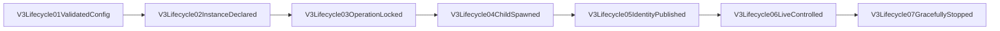

# V3 Managed Server Lifecycle

This review surface owns process control only. The RouteCodex V3 Runtime remains the sole request and
response business lifecycle.

## Truth and cache

- `instance.json` is the authoritative declaration: deterministic config identity, executable, and
  complete aggregate listener set.
- The instance ID is stable config identity. The executable path is exact launch provenance and may
  advance to a new release snapshot only after matching `stopped|failed` truth proves the previous
  release is terminal; active, missing-terminal, or otherwise different declarations remain
  non-transferable.
- `pid.cache` is transient and useful only together with the exact instance ID and start nonce.
- `control.json` points to an owner-only Unix socket and carries no secret.
- `status.json` is an observation of starting/running/stopping/stopped/failed, not authority to take
  over a port or process.

## Commands

`rccv3 server start|status|restart|stop --config <path>` all call
`routecodex-v3-lifecycle`. `server run-managed-child` is hidden and only executes a declaration
already published by the owner. `--foreground` exists solely for controlled external harnesses and
does not publish managed state.

## Safety boundary

- No broad kill or port-owner kill exists. Stop/restart uses the exact Unix control challenge and
  calls the aggregate Server handle's graceful shutdown.
- An unknown port occupant is allowed to make atomic listener bind fail. It is never stopped,
  replaced, or treated as this instance.
- Resolved provider secrets remain at the Provider transport boundary and never enter lifecycle
  files, process arguments, logs, or evidence.
- SSE Transport, continuation, Anthropic Relay, Provider routing, and Error policy are outside this
  owner.

## Review checklist

- [x] Config loads through `V3ConfigStore::load_snapshot_with_source_identity` and publishes a deterministic Manifest plus source identity.
- [x] Instance declaration matches config digest, executable, and all listeners.
- [x] Operation lock is exclusive.
- [x] Duplicate start fails while exact control identity is live.
- [x] Restart is one aggregate operation, not a listener loop.
- [x] Wrong nonce/config/executable and unknown port occupancy fail explicitly.
- [x] A stopped exact-config instance can start from the next release snapshot executable; an active
      or missing-terminal instance cannot be reaped or taken over.
- [x] State/argv/log/evidence scans contain no resolved secret.
- [x] Temporary CLI blackbox and live 5555 restart evidence both pass.
- [x] V2 5520/10000/4444 stay healthy throughout the V3 restart.
